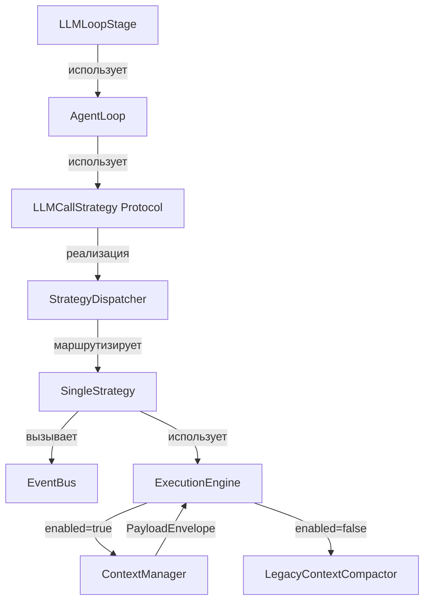
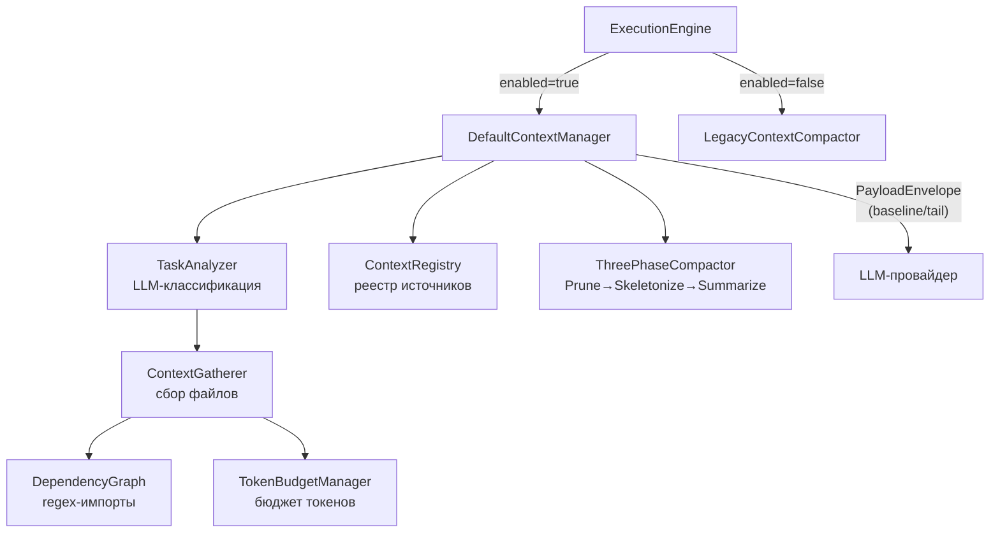
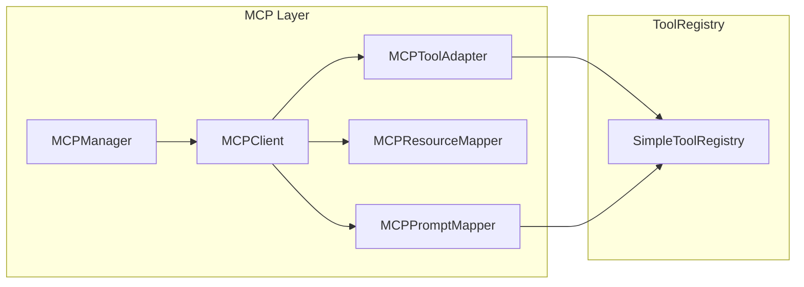

# CodeLab


> AI-ассистент для разработчиков с открытой архитектурой и полным контролем над действиями агента.

## Что такое CodeLab?

CodeLab — AI-ассистент для разработчиков, который работает с вашим кодом: читает файлы, выполняет команды, создаёт и редактирует код — из терминала или IDE. Все действия проходят через систему разрешений — вы контролируете каждое изменение агента.

Проект объединяет:

- **ACP-сервер** — интеллектуальный агент с поддержкой 9+ LLM провайдеров (OpenAI, Anthropic, OpenRouter, Zen, Go, Ollama, LMStudio, Mock, ScriptedMock)
- **TUI-клиент** — терминальный интерфейс на базе Textual
- **Web UI** — браузерный интерфейс для удаленной работы
- **stdio транспорт** — основной транспорт ACP (stdin/stdout JSON-RPC)
- **MCP интеграция** — подключение внешних инструментов через Model Context Protocol

## Быстрый старт за 5 минут

Запуск CodeLab с локальной LLM через Ollama:

```bash
# 1. Установка Ollama (macOS)
brew install ollama

# 2. Скачивание модели
ollama pull gemma4:e2b

# 3. Установка зависимостей
uv sync

# 4. Запуск приложения
CODELAB_LLM_PROVIDER=openai CODELAB_LLM_MODEL=gemma4:e2b CODELAB_LLM_BASE_URL=http://localhost:11434 codelab
```

> Подробнее: [Настройка Ollama](doc/product/getting-started/ollama-setup.md)

## Установка

```bash
# Базовая установка
uv pip install -e .

# С поддержкой сервера
uv pip install -e ".[server]"

# С TUI клиентом
uv pip install -e ".[tui]"

# Полная установка
uv pip install -e ".[full]"

# С поддержкой Web UI (браузер)
uv pip install -e ".[web]"
```

### Глобальная установка через pipx

Для установки `codelab` как глобального CLI-инструмента (изолированно от других пакетов) используйте [pipx](https://pipx.pypa.io/):

```bash
# Установка из ветки develop
pipx install "git+https://github.com/pese-git/codelab-ai.git@develop"

# Или установка из ветки master (по умолчанию)
pipx install "git+https://github.com/pese-git/codelab-ai.git"
```

> **Примечание:** Параметр `@develop` (или любое другое имя ветки/тега) — необязательный. Если не указан, будет использована ветка по умолчанию (`master`).

После установки команда `codelab` будет доступна глобально.

## Документация

| Раздел | Описание |
|--------|----------|
| [Введение](doc/product/overview/introduction.md) | Обзор возможностей и архитектуры |
| [Быстрый старт](doc/product/getting-started/quickstart.md) | Пошаговая инструкция запуска |
| [Руководство пользователя](doc/product/user-guide/clients/tui-client.md) | Работа с TUI-клиентом |
| [Руководство разработчика](doc/product/developer-guide/architecture.md) | Архитектура и разработка |
| [Справочник CLI](doc/product/reference/cli.md) | Команды и опции |
| [Архитектура](doc/internals/architecture/ARCHITECTURE.md) | Детальная архитектура системы |
| [Context Manager](doc/internals/context-manager/INDEX.md) | Интеллектуальный сбор и управление контекстом |
| [ACP Protocol](doc/protocols/Agent%20Client%20Protocol/) | Официальная спецификация протокола |

## Структура проекта

```
codelab-agent/
├── src/codelab/
│   ├── client/             # ACP-клиент (Clean Architecture)
│   │   ├── domain/         # Сущности и интерфейсы
│   │   ├── application/    # Use Cases, State Machine
│   │   ├── infrastructure/ # DI, Transport, Handlers
│   │   ├── presentation/   # ViewModels (MVVM, 14 штук)
│   │   └── tui/            # Textual UI компоненты
│   ├── server/             # ACP-сервер
│   │   ├── protocol/       # ACPProtocol (Facade) + decomposed компоненты
│   │   │                   # CommandRegistry, ResponseRouter, BackgroundExecutor
│   │   │                   # MCPSessionManager, ConfigSpecBuilder, NotificationBus
│   │   ├── agent/          # LLM-агент (ExecutionEngine, AgentLoop)
│   │   │   ├── context/    # Context Manager (сбор, бюджет, наблюдаемость)
│   │   ├── tools/          # Инструменты (fs, terminal, plan)
│   │   │   ├── executors/decorators/  # Декораторы инструментов (метрики, трейсинг, структура проекта)
│   │   ├── storage/        # Хранилище сессий
│   │   ├── llm/            # LLM-провайдеры (9+, включая ScriptedMock)
│   │   ├── mcp/            # MCP интеграция (Manager, Client, Adapters)
│   │   └── observability/  # Tracing, Metrics, Timeline
│   ├── shared/             # Общие модули (messages, logging, content, web_ui)
│   └── cli.py              # CLI точка входа
├── tests/                  # Тесты (~7250, 7254 passed на 2026-07-16)
├── doc/
│   ├── product/            # Продуктовая документация (для website)
│   │   ├── overview/       # Введение, архитектура, сценарии
│   │   ├── getting-started/# Установка, быстрый старт
│   │   ├── user-guide/     # Руководство пользователя
│   │   ├── developer-guide/# Для разработчиков
│   │   ├── reference/      # Справочники (CLI, config, env)
│   │   └── support/        # FAQ, troubleshooting
│   ├── protocols/          # Референсные протоколы (не изменять!)
│   │   ├── Agent Client Protocol/
│   │   ├── Agent To Agent Protocol/
│   │   └── Model Context Protocol/
│   └── internals/          # Внутренние документы
│       ├── architecture/   # Архитектура, ADR, карта проекта
│       ├── roadmap/        # Планы развития кодовой базы
│       └── archive/        # Исторические документы
└── Makefile                # Команды сборки и проверок
```

## CLI

После установки доступна команда `codelab`:

```bash
# Справка
codelab --help

# Запуск сервера агента
codelab serve --port 8765

# Запуск TUI клиента
codelab connect --host localhost --port 8765
```

### Web UI

При запуске сервера командой `codelab serve` доступен Web UI на корневом пути `/`. Управление Web UI инкапсулировано в `WebUIManager` (`shared/web_ui.py`), который запускает textual-serve subprocess и генерирует HTML responses:

```bash
# Запуск сервера с Web UI
codelab serve --port 4096
# Откройте http://127.0.0.1:4096/ в браузере

# Запуск сервера без Web UI
codelab serve --port 4096 --no-web
```

**Примечание:** Web UI требует установки дополнительного пакета `textual-web`:
```bash
pip install 'codelab[web]'
```

Если `textual-web` не установлен, на корневом пути будет отображаться информативная страница с инструкциями по установке.

## Использование

### Shared модули

```python
from codelab.shared import ACPMessage, JsonRpcError, setup_logging
from codelab.shared.content import TextContent, ImageContent

# Создание JSON-RPC сообщения
msg = ACPMessage.request("session/prompt", {"prompt": "Hello"})

# Настройка логирования
logger = setup_logging(level="DEBUG", log_file="default")
logger.info("app_started", version="1.0.0")
```

## Домашняя директория

При первом запуске `codelab` автоматически создаётся домашняя директория `~/.codelab/` со следующей структурой:

```
~/.codelab/
├── config/   # Конфигурационные файлы
├── logs/     # Файлы логов (codelab.log)
├── data/     # Сессии, история
└── cache/    # Кэш MCP и временные данные
```

## Конфигурация

Создайте файл `.env` на основе `.env.example`:

```bash
cp .env.example .env
```

Основные переменные окружения:

| Переменная | Описание | По умолчанию |
|------------|----------|--------------|
| `CODELAB_LLM_PROVIDER` | Активный провайдер LLM | `mock` |
| `CODELAB_LLM_MODEL` | Модель в формате `"provider/model"` | `mock/mock-model` |
| `CODELAB_LLM_PROVIDERS` | Список провайдеров через запятую | `openai,mock` |
| `OPENAI_API_KEY` | API ключ OpenAI | - |
| `ANTHROPIC_API_KEY` | API ключ Anthropic | - |
| `CODELAB_FALLBACK_ENABLED` | Включить fallback | `false` |
| `CODELAB_FALLBACK_STRATEGY` | Стратегия fallback | `sequential` |
| `CODELAB_FALLBACK_ORDER` | Порядок провайдеров через запятую | - |
| `CODELAB_PORT` | Порт сервера | `8765` |
| `CODELAB_HOST` | Хост сервера | `127.0.0.1` |
| `CODELAB_LOG_LEVEL` | Уровень логирования | `INFO` |
| `CODELAB_LLM_STREAMING` | Токен-стриминг ответа агента (дельты вживую) | `off` |
| `CODELAB_HOME` | Домашняя директория приложения | `~/.codelab` |

### TOML конфигурация

CodeLab поддерживает конфигурацию через TOML файл `~/.codelab/codelab.toml`:

```toml
[llm]
provider = "openrouter"
model = "qwen3.6-plus"
temperature = 0.1
max_tokens = 8192

[llm.providers.openrouter]
base_url = "https://openrouter.ai/api/v1"

[llm.providers.openrouter.models.qwen3.6-plus]
context_window = 128000
max_output_tokens = 64000
```

> **Важно:** Если имя модели содержит точку (например, `qwen3.6-plus`), CodeLab автоматически обрабатывает вложенность TOML ключей. Вы можете использовать оба варианта:
>
> ```toml
> # Без кавычек (автоматически распутывается)
> [llm.providers.openrouter.models.qwen3.6-plus]
>
> # С кавычками (явно)
> [llm.providers.openrouter.models."qwen3.6-plus"]
> ```
>
> Оба варианта эквивалентны. CodeLab корректно обрабатывает точки в именах моделей начиная с версии 0.1.0.

### Поддерживаемые LLM провайдеры

| Провайдер | ID | Модели по умолчанию | Base URL |
|-----------|----|---------------------|----------|
| OpenAI | `openai` | `gpt-4o`, `o3`, `o4-mini` | `https://api.openai.com/v1` |
| Anthropic | `anthropic` | `claude-sonnet-4`, `claude-opus-4` | `https://api.anthropic.com` |
| OpenRouter | `openrouter` | `mistral-large`, `llama-3.1` | `https://openrouter.ai/api/v1` |
| Zen | `zen` | `zen-sonnet` | `https://zen.opencode.ai/v1` |
| Go | `go` | `go-fast` | `https://go.opencode.ai/v1` |
| Ollama | `ollama` | `llama3.1:70b`, `mistral` | `http://localhost:11434/v1` |
| LMStudio | `lmstudio` | local models | `http://localhost:1234/v1` |
| Mock | `mock` | `mock-model` | N/A |
| ScriptedMock | `scripted` | scenario-based | N/A (e2e tests) |

### Fallback система

При ошибках основного провайдера можно настроить fallback цепочку:

```bash
codelab serve --fallback-enabled --fallback-strategy sequential --fallback-order openai,openrouter,ollama
```

Fallback перебирает провайдеры по порядку при retryable ошибках (rate_limit, timeout, internal_error).

### Конфигурация TUI клиента

TUI клиент поддерживает настройку темы и подключения через несколько источников с приоритетом:

**Приоритет источников** (от низшего к высшему):
1. JSON конфиг (`~/.codelab/tui_config.json`)
2. TOML глобальный (`~/.codelab/codelab.toml`)
3. TOML проект (`./codelab.toml`, `./codelab.local.toml`)
4. Environment variable (`CODELAB_THEME`)
5. CLI флаг (`--theme`)
6. UI toggle (`Ctrl+T` в приложении)

#### Настройка темы

**Через TOML конфиг** (`~/.codelab/codelab.toml` или `./codelab.toml`):
```toml
[tui]
theme = "dark"  # light или dark
host = "127.0.0.1"
port = 8765
```

**Через CLI:**
```bash
codelab connect --theme dark
codelab connect --host 192.168.1.100 --port 9000 --theme light
```

**Через Environment variable:**
```bash
CODELAB_THEME=dark codelab connect
```

**Через UI:**
- Нажмите `Ctrl+T` для переключения темы
- Или используйте кнопку "Тема" в панели быстрых действий

#### Доступные темы

| Тема | Описание | Палитра |
|------|----------|---------|
| `light` | Светлая тема с холодными тонами | Off-white `#f3f4f7`, синий `#1d4ed8` |
| `dark` | Тёмная тема Tokyo Night с улучшенным контрастом | Base `#1a1b26`, blue `#7aa2f7` |

**Индикация текущей темы:**
- ☀️ / 🌙 иконка в панели быстрых действий
- Текст "Light" / "Dark" в строке статуса (footer)

## Архитектура сервера

Сервер использует DI-контейнер **Dishka** для управления зависимостями. Зависимости разделены на два уровня:

- **APP scope** — живут всё время работы сервера (LLM-провайдер, реестр инструментов, оркестратор агента, менеджер политик).
- **REQUEST scope** — создаётся при каждом WebSocket-подключении (`ACPProtocol`). `ClientRPCService` создаётся вручную вне контейнера и устанавливается в holder перед входом в REQUEST scope.

```mermaid
graph TD
    subgraph APP Scope["APP Scope — одно на весь сервер"]
        CFG[AppConfig]
        S[SessionStorage]
        LLM[LLMProvider]
        TR[ToolRegistry]
        EE[ExecutionEngine]
        GPS[GlobalPolicyStorage]
        GPM[GlobalPolicyManager]

        subgraph Managers["ManagersProvider"]
            SM[StateManager]
            PB[PlanBuilder]
            TLCM[TurnLifecycleManager]
            TCH[ToolCallHandler]
            PM[PermissionManager]
            CRH[ClientRPCHandler]
        end

        subgraph SlashCommands["SlashCommandsProvider"]
            CR[CommandRegistry]
            SR[SlashCommandRouter]
        end

        subgraph Pipeline["PipelineProvider"]
            LL[LLMLoopStage]
            PP[PromptPipeline]
        end

        subgraph PromptOrch["PromptOrchestratorProvider"]
            H[ClientRPCServiceHolder]
            OB[PromptOrchestratorBuilder]
            PO[PromptOrchestrator]
        end

        subgraph Decomposed["Decomposed Components"]
            RR[ResponseRouter]
            BE[BackgroundExecutor]
            MSM[MCPSessionManager]
            CSB[ConfigSpecBuilder]
        end

        subgraph ContextMgr["Context Manager"]
            CCM[DefaultContextManager]
            CCfg[ContextConfig]
        end

        NB[SessionNotificationBus]
    end

    subgraph Request Scope["REQUEST Scope — одно на WS-подключение"]
        AP["ACPProtocol (Facade)"]
    end

    CRPC["ClientRPCService\n(создаётся вручную\nв handle_ws_request)"]

    %% APP scope dependencies
    CFG -->|from_context| LLM
    CFG -->|from_context| EE
    LLM --> EE
    TR --> EE
    GPS --> GPM

    %% SlashCommands
    CR --> SR

    %% Pipeline dependencies
    TR --> LL
    TCH --> LL
    PM --> LL
    SM --> LL
    PB --> LL
    GPM --> LL

    SM --> PP
    SR --> PP
    PB --> PP
    TLCM --> PP
    TR --> PP
    PM --> PP
    LL --> PP

    %% PromptOrchestrator dependencies
    SM --> PO
    PB --> PO
    TLCM --> PO
    TCH --> PO
    PM --> PO
    CRH --> PO
    TR --> PO
    LL --> PO
    H --> PO
    GPM --> PO
    CR --> PO
    PP --> PO
    OB --> PO

    %% Decomposed components
    BE --> NB
    MSM --> NB
    LL --> NB

    %% Context Manager
    CCfg --> CCM
    TR --> CCM
    LLM --> CCM
    CCM --> EE

    %% ACPProtocol dependencies (Facade)
    S -->|from_context| AP
    CR --> AP
    RR --> AP
    BE --> AP
    EE --> AP
    TR --> AP
    H -->|holder| AP
    PO --> AP
    CRPC -. "set в holder\nперед REQUEST scope" .-> H

    %% NotificationBus → Transport
    NB -. "publish" .-> WS[WebSocketTransport]
    NB -. "publish" .-> STDIO[StdioServerTransport]

    classDef app fill:#e1f5fe,stroke:#01579b
    classDef request fill:#f3e5f5,stroke:#4a148c
    classDef group fill:#f5f5f5,stroke:#9e9e9e,stroke-dasharray: 5 5
    classDef external fill:#fff3e0,stroke:#e65100,stroke-dasharray: 5 5
    classDef decomposed fill:#e8f5e9,stroke:#2e7d32
    classDef context fill:#fce4ec,stroke:#880e4f
    class CFG,S,LLM,TR,EE,GPS,GPM,SM,PB,TLCM,TCH,PM,CRH,CR,SR,LL,PP,H,OB,PO app
    class AP request
    class Managers,SlashCommands,Pipeline,PromptOrch group
    class RR,BE,MSM,CSB,NB decomposed
    class CCM,CCfg context
    class CRPC external
```



### Как это работает

1. При запуске `codelab serve` создаётся DI-контейнер (`di.make_container`) со всеми APP-зависимостями: менеджеры, pipeline-стадии, провайдеры LLM, инструменты, ExecutionEngine, decomposed компоненты.
2. `PromptOrchestratorBuilder` создаёт `PromptOrchestrator` с 12+ зависимостями.
3. При каждом WebSocket-подключении создаётся `ClientRPCService`, устанавливается в `ClientRPCServiceHolder`, и REQUEST scope получает `ACPProtocol` (Facade) с уже настроенным holder.
4. `ACPProtocol` делегирует обработку команд `CommandRegistry`, responses — `ResponseRouter`, фоновые задачи — `BackgroundExecutor`.
5. `SessionNotificationBus` (Observer pattern) разделяет бизнес-логику и транспорт: компоненты публикуют notifications, транспорт подписывается и доставляет клиенту.
6. `ClientRPCServiceHolder` — мост между APP и REQUEST scope: сервис обновляется per-request, а `PromptOrchestrator` и `ACPProtocol` используют holder без пересоздания.

### Транспортный слой

Сервер поддерживает два транспорта: **WebSocket** (для Web UI и удалённого подключения) и **stdio** (stdin/stdout, для IDE plugins и локального режима).

**`session/prompt` в фоне:** Оба транспорта запускают обработку `session/prompt` через `asyncio.create_task()`, чтобы receive-loop мог продолжать читать входящие сообщения и маршрутизировать client RPC responses (например, ответы клиента на `fs/read_text_file`). Это устраняет deadlock в bypass mode, когда tool execution синхронно ожидает ответ от клиента.

| Транспорт | Файл | Особенности |
|-----------|------|-------------|
| `WebSocketTransport` | `server/transport/websocket.py` | aiohttp WebSocket, Web UI, подписка на NotificationBus |
| `WebSocketConnection` | `server/transport/websocket_connection.py` | Protocol-абстракция для тестируемости |
| `StdioServerTransport` | `server/transport/stdio.py` | stdin/stdout, newline-delimited JSON-RPC, подписка на NotificationBus |
| `StdioRunner` | `server/transport/stdio_runner.py` | Запуск stdio сервера с DI |

### AgentLoop — унифицированный цикл итераций LLM

`AgentLoop` отвечает за цикл итераций LLM tool-calling в соответствии с ACP спецификацией:



**Компоненты:**

- **`StopReason`** enum (`protocol/stop_reasons.py`) — ACP-compliant stop reasons: `end_turn`, `max_tokens`, `max_turn_requests`, `refusal`, `cancelled`.
- **`LLMCallStrategy`** Protocol (`agent/strategies/base.py`) — интерфейс для стратегий вызова LLM.
- **`StrategyDispatcher`** (`agent/strategies/dispatcher.py`) — диспетчер стратегий через EventBus.
- **`SingleStrategy`** (`protocol/handlers/strategies/single_strategy.py`) — **единственная реализованная стратегия**. Один LLM-вызов → обработка tool_calls → повтор.
- **`AgentLoop`** (`protocol/handlers/pipeline/stages/agent_loop.py`) — универсальный цикл итераций с обработкой tool_calls, permission pause/resume, cancellation.
- **`LLMLoopStage`** (`pipeline/stages/llm_loop.py`) — тонкий адаптер pipeline → AgentLoop.

> **Важно:** Config specs ссылаются на `multi_orchestrated`, `multi_choreographed`, `hierarchical` стратегии, но они **не реализованы**. Попытка использовать их приведёт к ошибке.

**Принципы работы:**

1. `LLMLoopStage` создаёт `AgentLoop` со стратегией `SingleStrategy` через `StrategyDispatcher`.
2. `AgentLoop.run()` выполняет цикл итераций: вызов LLM → обработка tool_calls → продолжение.
3. Цикл завершается при: отсутствии tool_calls (`end_turn`), достижении `max_turn_requests`, отмене (`cancelled`).
4. При запросе permission цикл приостанавливается и возобновляется через `resume_after_permission()`.

### Context Manager — интеллектуальный сбор контекста

`ContextManager` (4-слойная архитектура A–D) отвечает за сбор, бюджетирование и оптимизацию контекста для LLM. Реализованы Phase 0-3 (Phase 4-6 в очереди, см. [INDEX канона](doc/internals/context-manager/INDEX.md)).



**Слои архитектуры:**

| Слой | Компоненты | Статус |
|------|-----------|--------|
| A — Сбор | `TaskAnalyzer`, `ContextGatherer`, `DependencyGraph`, `TokenBudgetManager`, `ContextRegistry` | ✅ Реализовано |
| B — Жизненный цикл | `ContextEpoch`, `ContextSnapshot`, `ContextReconciler` | ✅ Реализовано |
| C — Хранение | `FileContentCache`, `CodeSkeletonizer`, `TokenCounter`, `ThreePhaseCompactor` | ✅ Реализовано |
| D — Мультиагент | `ChildSessionManager`, `process_subagent_response()` | Phase 6 |

**Путь формирования payload:**
1. `ExecutionEngine.build_context()` вызывает `DefaultContextManager.build_context()`
2. `TaskAnalyzer` классифицирует задачу → `TaskProfile`
3. `ContextGatherer` собирает релевантные файлы через ACP `ToolRegistry`
4. `ContextRegistry` регистрирует источники (system prompt, файлы, skill catalog)
5. `TokenBudgetManager` аллоцирует бюджет по долям конфига
6. Возвращается `PayloadEnvelope` (baseline + tail) → `to_messages()` → LLM

**Трёхфазное сжатие (Phase 3):**

При превышении лимита контекста система применяет 3 фазы сжатия:

1. **Prune** — FIFO удаление tool outputs (priority-based eviction: tool=4 → assistant=6 → user=8 → system=10)
2. **Skeletonize** — AST-сжатие файлов кода (80-85% экономия, tree-sitter + regex)
3. **Summarize** — LLM-суммаризация истории (сохраняет ключевые решения)

**Graceful degradation:** если LLM недоступен → Prune + Skeletonize без падения.

**Защита критических элементов:** system messages (priority=10) не вытесняются при обычном переполнении.

**Конфигурация:**
```toml
# ~/.codelab/codelab.toml
[agents.context]
enabled = true                  # Master switch (default: false)
gather_enabled = true           # Включить сбор файлов
skeletonize = true              # Включить AST-скелетирование
file_cache = true               # Включить кэш файлов
use_tiktoken = true             # Точный подсчёт токенов

[agents.context.budget]
max_context_tokens = 128000
reserved_tokens = 4096
```

**Наблюдаемость:** slash-команда `/context` показывает метрики, span'ы и позволяет управлять включением. См. [SLASH_COMMAND.md](doc/internals/context-manager/SLASH_COMMAND.md).

**Документация:**
- [Руководство пользователя](doc/product/user-guide/server/context-manager.md) — назначение, конфигурация, `/context`, рецепты, troubleshooting.
- [Реализация и расширение](doc/product/developer-guide/extending/context-manager.md) — устройство подсистем и точки расширения (для разработчиков).

**ProjectStructureDecorator** — декоратор инструментов, автоматически извлекающий структуру проекта из вывода `terminal/create` + `terminal/wait_for_exit` (команды `find`/`ls`). Сохраняет в `session.config_values["project_structure"]`.

### Токен-стриминг

При включённом флаге `CODELAB_LLM_STREAMING=1` ответ агента доставляется клиенту дельтами вживую (`agent_message_chunk` по мере генерации), а не одним chunk'ом в конце turn.

**Двойной гейт:**
1. `config.llm.streaming` — глобальный флаг в конфигурации
2. `provider.supports_streaming` — capability провайдера

Если провайдер не поддерживает streaming — безопасный фолбэк на `_single_call` (без дельт).

```toml
# codelab.toml
[llm]
streaming = true
```

```bash
# Или через переменную окружения
CODELAB_LLM_STREAMING=1 codelab serve
```

## Архитектура клиента

Клиент использует DI-контейнер **Dishka** (`make_container`) со скоупом `APP` — все зависимости создаются один раз и живут до завершения процесса. Провайдеры разделены на два класса:

- **`ClientProvider`** — инфраструктурные сервисы (транспорт, репозитории, обработчики).
- **`ViewModelProvider`** — ViewModels для MVVM-слоя.

Циклическая зависимость `SessionCoordinator ↔ PermissionHandler` разрешается через двухфазную инициализацию в `CoreServices`.

```mermaid
graph TD
    subgraph APP["APP Scope — один контейнер на весь процесс"]
        CFG["ClientConfig\n(from context)"]

        subgraph ClientProv["ClientProvider"]
            LOG[BoundLogger]
            EB[EventBus]
            TS["TransportService\n↳ ACPTransportService"]
            SR["SessionRepository\n↳ InMemorySessionRepository"]
            FSE[FileSystemExecutor]
            FSH[FileSystemHandler]
            TE[TerminalExecutor]
            TH[TerminalHandler]

            subgraph CoreSvcs["CoreServices  ⟳ двухфазная инициализация"]
                SC[SessionCoordinator]
                PH[PermissionHandler]
            end
        end

        subgraph VMProv["ViewModelProvider"]
            UI_VM[UIViewModel]
            SESS_VM[SessionViewModel]
            PLAN_VM[PlanViewModel]
            CHAT_VM[ChatViewModel]
            TERM_VM[TerminalViewModel]
            FS_VM[FileSystemViewModel]
            FV_VM[FileViewerViewModel]
            PERM_VM[PermissionViewModel]
            TLOG_VM[TerminalLogViewModel]
            MODEL_VM[ModelSelectorViewModel]
            MODE_VM[ModeSelectorViewModel]
            AGENT_VM[AgentSelectorViewModel]
            STRAT_VM[StrategySelectorViewModel]
            CONFIG_VM[ConfigOptionSelectorViewModel]
        end
    end

    TUI["ACPClientApp\ntui/app.py"]

    %% Config
    CFG --> LOG
    CFG -->|host, port| TS
    CFG -->|cwd| FSE

    %% Infrastructure
    FSE --> FSH
    TE --> TH

    %% CoreServices: разрыв цикла
    TS --> CoreSvcs
    SR --> CoreSvcs
    LOG --> CoreSvcs
    CoreSvcs --> SC
    CoreSvcs --> PH
    SC -. "_permission_handler\npost-init" .-> PH
    TS -. "_permission_handler\npost-init" .-> PH

    %% ViewModels: все получают EventBus + BoundLogger
    EB --> UI_VM & PLAN_VM & TERM_VM & FS_VM & FV_VM & PERM_VM & TLOG_VM & MODEL_VM & MODE_VM & AGENT_VM & STRAT_VM & CONFIG_VM
    LOG --> UI_VM & PLAN_VM & TERM_VM & FS_VM & FV_VM & PERM_VM & TLOG_VM & MODEL_VM & MODE_VM & AGENT_VM & STRAT_VM & CONFIG_VM
    SC --> SESS_VM & CHAT_VM
    EB --> SESS_VM & CHAT_VM
    LOG --> SESS_VM & CHAT_VM
    PLAN_VM --> CHAT_VM
    CFG --> CHAT_VM
    FSE --> CHAT_VM
    TE --> CHAT_VM

    %% TUI резолвит из контейнера
    TUI -->|"get(SessionCoordinator)"| SC
    TUI -->|"get(TransportService)"| TS
    TUI -->|get ViewModels| UI_VM & SESS_VM & CHAT_VM & PLAN_VM
    TUI -->|get ViewModels| TERM_VM & FS_VM & FV_VM & PERM_VM & TLOG_VM
    TUI -->|get ViewModels| MODEL_VM & MODE_VM & AGENT_VM & STRAT_VM & CONFIG_VM

    classDef svc fill:#e1f5fe,stroke:#01579b
    classDef vm fill:#f3e5f5,stroke:#4a148c
    classDef cfg fill:#fff3e0,stroke:#e65100
    classDef tui fill:#e8f5e9,stroke:#1b5e20
    class LOG,EB,TS,SR,FSE,FSH,TE,TH,SC,PH svc
    class UI_VM,SESS_VM,PLAN_VM,CHAT_VM,TERM_VM,FS_VM,FV_VM,PERM_VM,TLOG_VM,MODEL_VM,MODE_VM,AGENT_VM,STRAT_VM,CONFIG_VM vm
    class CFG cfg
    class TUI tui
```



### Как это работает

1. При запуске `codelab connect` создаётся DI-контейнер через `create_client_container()` — все APP-зависимости инициализируются один раз.
2. `CoreServices` — фабрика, которая создаёт `SessionCoordinator` и `PermissionHandler` в два шага, а затем связывает их через `_permission_handler`, обходя циклическую зависимость.
3. `ACPClientApp` резолвит `SessionCoordinator`, `TransportService` и все 14 ViewModels в `__init__` через `container.get()` — без Service Locator в методах.
4. При выходе `on_unmount` вызывает `transport.disconnect()` и `container.close()`.

### Отмена промпта

`TransportService.request_with_callbacks()` удерживает глобальный `asyncio.Lock` на всё время выполнения `session/prompt`. Чтобы отмена не вставала в очередь за этим локом, `TransportService` предоставляет отдельный метод:

```
cancel_prompt(session_id) → обходит _callbacks_request_lock
    └─ создаёт per-request response queue
    └─ отправляет session/cancel напрямую через send()
    └─ ждёт ответа (timeout 5 с) и очищает очередь
```

`ACPTransportService` переопределяет этот метод с lock-free реализацией. Базовый класс `TransportService` содержит fallback через `request_with_callbacks` для совместимости с другими реализациями транспорта.

На стороне сервера `session/cancel` отменяет активный `asyncio.Task` с LLM-запросом через `LLMAdapter.cancel_prompt()`, что немедленно прерывает HTTP-запрос к модели (`CancelledError`).

## MCP интеграция

CodeLab поддерживает Model Context Protocol (MCP) для подключения внешних инструментов:



**Компоненты:**
- `MCPManager` — управление несколькими MCP-серверами на сессию, auto-reconnect с backoff
- `MCPClient` — клиент для одного MCP-сервера с state machine
- `MCPToolAdapter` — адаптация MCP инструментов к ACP ToolDefinition, kind inference
- `MCPResourceMapper` — маппинг MCP resources → ACP ResourceLinkContent
- `MCPPromptMapper` — маппинг MCP prompts → slash commands
- `MCPContentMapper` — конвертация MCP content → ACP content
- `StdioTransport` / `HttpTransport` / `SseTransport` — транспорты для MCP-серверов

**Функциональность:**
- **Tools**: namespace `mcp:server_id:tool_name`
- **Resources**: доступны через ResourceLinkContent
- **Prompts**: доступны как slash commands
- **Notifications**: `tools/list_changed`, `resources/list_changed`, `prompts/list_changed`, progress
- **Auto-reconnect**: с exponential backoff и health checks
- **Roots**: поддержка `roots/list` и notifications
- **TOML Config**: загрузка из `codelab.toml` с env variable expansion

**Использование:**
```json
{
  "mcpServers": {
    "filesystem": {
      "command": "npx",
      "args": ["-y", "@modelcontextprotocol/server-filesystem", "/path/to/dir"]
    }
  }
}
```

**Именование:** MCP инструменты получают namespace `mcp:server_id:tool_name`.

## Content Types

CodeLab поддерживает все типы контента ACP:

| Тип | Описание | MIME типы |
|-----|----------|-----------|
| `text` | Текстовые сообщения | `text/plain` |
| `diff` | Дифф изменений | `text/x-diff` |
| `image` | Изображения | `image/png`, `image/jpeg`, `image/gif`, `image/webp` |
| `audio` | Аудиоданные | `audio/wav`, `audio/mpeg` |
| `embedded` | Встроенные ресурсы | Ссылки на ресурсы |
| `resource_link` | Ссылки на ресурсы | URI |

**Pipeline обработки:**
```
ToolExecutor → ContentExtractor → ContentValidator → ContentFormatter → LLM
```

- `ContentExtractor` — извлечение content из tool results
- `ContentValidator` — валидация согласно ACP спецификации
- `ContentFormatter` — форматирование в LLM-специфичные форматы (OpenAI/Anthropic)

## Проверки

```bash
# Полный набор проверок
make check

# Или вручную
uv run ruff check .
uv run ty check
uv run python -m pytest
```

## Разработка

```bash
# Установка dev-зависимостей
uv pip install -e ".[dev]"

# Проверка кода
uv run ruff check src/
uv run ty check

# Запуск тестов
uv run pytest
```

## Требования

- Python 3.12+
- [uv](https://docs.astral.sh/uv/) — менеджер пакетов

## Лицензия

MIT License
