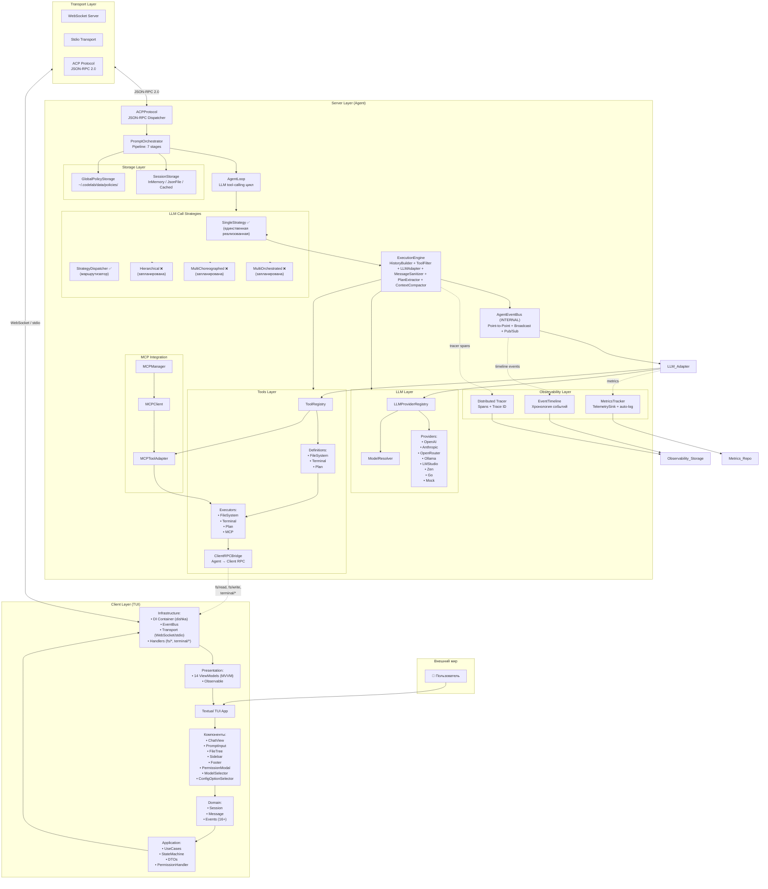
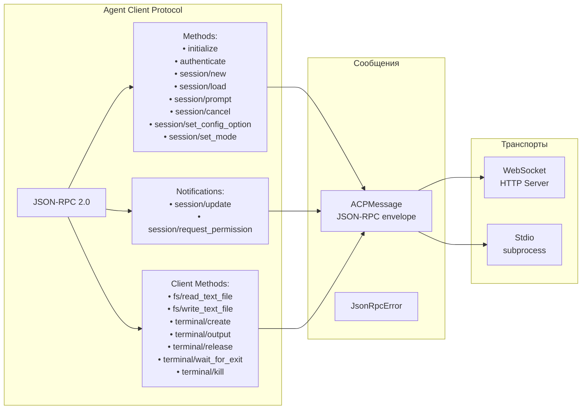
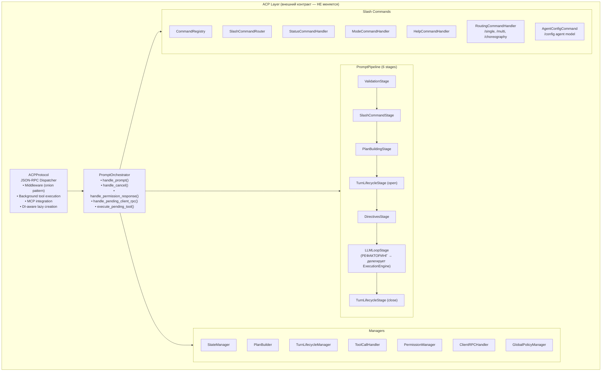
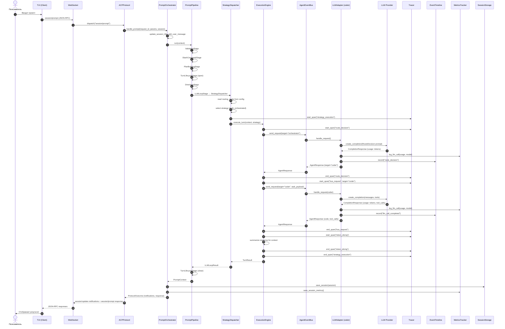
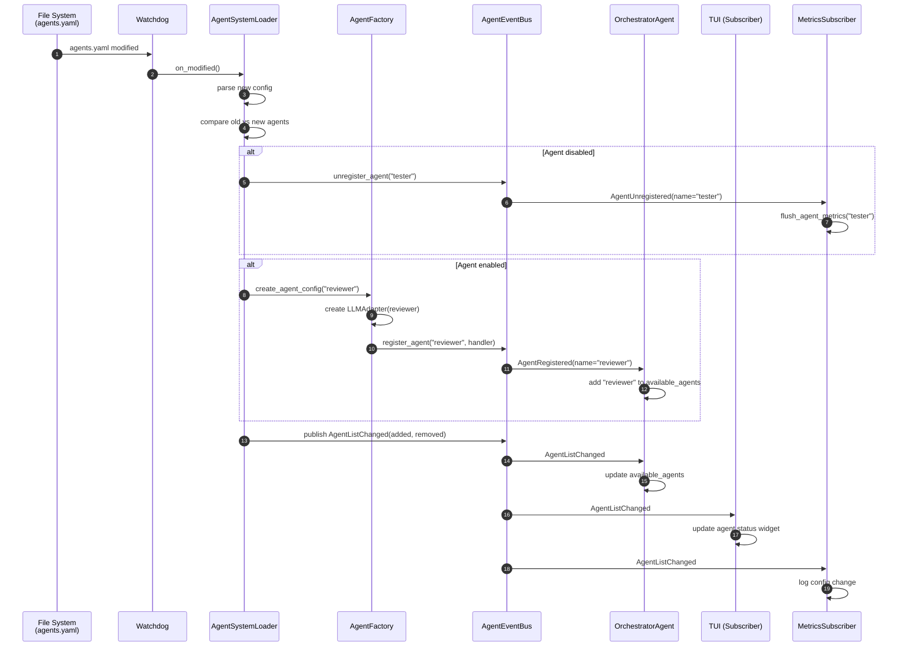
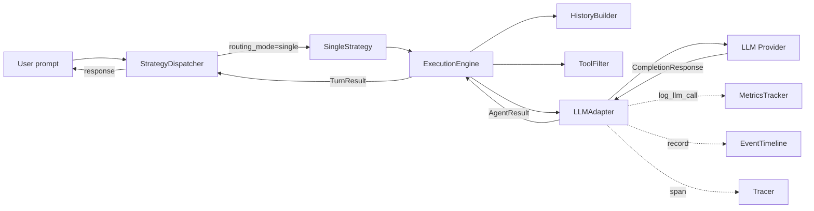
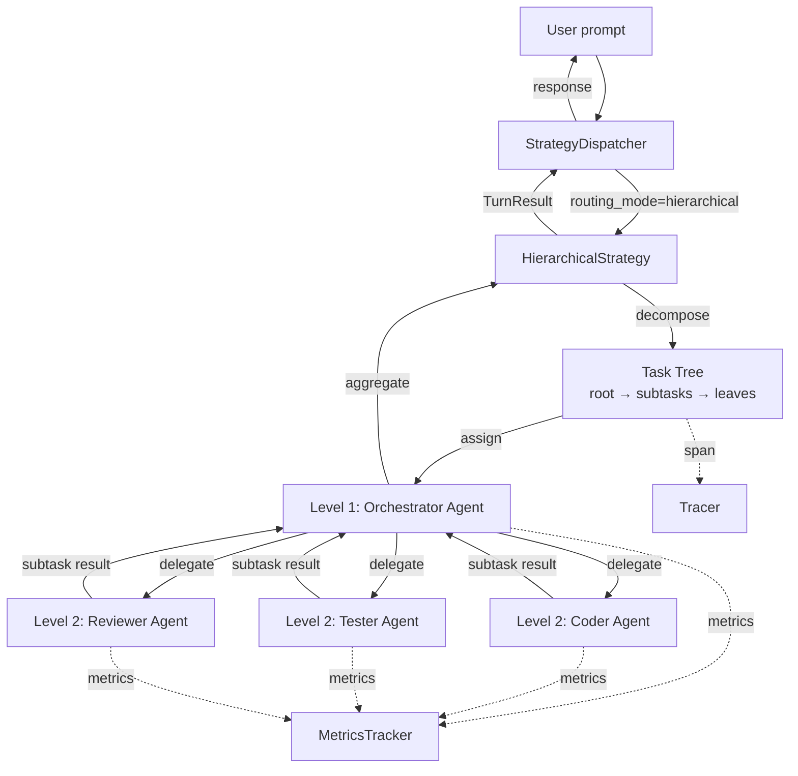

# Архитектура CodeLab — Полная схема проекта

> Документ отражает архитектуру после реализации мультиагентной экосистемы
> Версия: 1.1 | Дата: 14 июня 2026
>
> **Важно:** Диаграмма показывает целевую архитектуру. Из мультиагентных компонентов
> реализованы только `LLMAdapter` и `SingleStrategy`. `Orchestrator_Agent`, `Coder_Agent`,
> `Tester_Agent`, `multi_orchestrated`, `multi_choreographed`, `hierarchical` — запланированы,
> но не реализованы.

---

## 1. Обзор системы



---

## 2. Слои архитектуры

### 2.1. Client Layer (TUI)

```mermaid
flowchart LR
    subgraph Clean_Arch["Clean Architecture — 5 слоёв"]
        subgraph Domain["Domain Layer"]
            D1["Session entity"]
            D2["Message entity"]
            D3["Repository interfaces"]
            D4["Domain Events (15+)"]
        end
        
        subgraph Application["Application Layer"]
            A1["Use Cases"]
            A2["SessionCoordinator"]
            A3["State Machine"]
            A4["DTOs"]
            A5["PermissionHandler"]
        end
        
        subgraph Infrastructure["Infrastructure Layer"]
            I1["DI Container (dishka)"]
            I2["EventBus"]
            I3["Transport\nWebSocket / stdio"]
            I4["Handlers\nfs/*, terminal/*"]
            I5["ACPTransportService"]
            I6["RoutingQueues"]
        end
        
        subgraph Presentation["Presentation Layer (MVVM)"]
            P1["BaseViewModel"]
            P2["ChatViewModel"]
            P3["SessionViewModel"]
            P4["UIViewModel"]
            P5["PlanViewModel"]
            P6["TerminalViewModel"]
            P7["PermissionViewModel"]
        end
        
        subgraph TUI["TUI Layer (Textual)"]
            T1["ChatView"]
            T2["PromptInput"]
            T3["FileTree"]
            T4["Sidebar"]
            T5["Footer"]
            T6["ToolPanel"]
            T7["PermissionModal"]
            T8["AgentStatus"]
            T9["StepLogger"]
            T10["TraceViewer"]
        end
    end
    
    Domain --> Application
    Application --> Infrastructure
    Infrastructure --> Presentation
    Presentation --> TUI
    TUI -.->|events| Domain
```



**Ключевые файлы:**
```
codelab/src/codelab/client/
├── domain/
│   ├── entities.py          # Session, Message
│   ├── repositories.py      # Интерфейсы репозиториев
│   ├── events.py            # 15+ domain events
│   └── services.py
├── application/
│   ├── use_cases.py
│   ├── session_coordinator.py
│   ├── state_machine.py
│   ├── dto.py
│   └── permission_handler.py
├── infrastructure/
│   ├── di/
│   │   └── container_factory.py
│   ├── events/
│   │   ├── bus.py           # EventBus (Pub/Sub)
│   │   └── ...
│   ├── transport.py         # WebSocket transport
│   ├── stdio_transport.py
│   ├── acp_transport_service.py
│   ├── routing_queues.py
│   ├── handler_registry.py
│   └── handlers/
│       ├── fs/              # fs/read, fs/write
│       └── terminal/        # terminal/*
├── presentation/
│   ├── base_view_model.py
│   ├── chat_view_model.py
│   ├── session_view_model.py
│   ├── ui_view_model.py
│   ├── plan_view_model.py
│   ├── terminal_view_model.py
│   └── permission_view_model.py
└── tui/
    ├── app.py
    └── components/
        ├── chat_view.py
        ├── prompt_input.py
        ├── file_tree.py
        ├── sidebar.py
        ├── footer.py
        ├── tool_panel.py
        ├── permission_modal.py
        ├── permission_request.py
        ├── agent_status.py        # NEW
        ├── step_logger.py         # NEW
        └── trace_viewer.py        # NEW
```

---

### 2.2. Transport Layer



**Ключевые файлы:**
```
codelab/src/codelab/server/
├── messages.py              # ACPMessage, JsonRpcError
├── transport/
│   └── base.py              # Transport ABC
└── http_server.py           # WebSocket сервер
```

---

### 2.3. Server Layer (Agent)

#### 2.3.1. ACP Protocol + Pipeline



**Ключевые файлы:**
```
codelab/src/codelab/server/protocol/
├── core.py                  # ACPProtocol
├── state.py                 # SessionState, ToolCallState, ActiveTurnState, etc.
├── session_factory.py       # Фабрика сессий
├── handlers/
│   ├── prompt_orchestrator.py  # Главный оркестратор
│   ├── auth.py                 # authenticate, initialize
│   ├── session.py              # session/new, load, list
│   ├── prompt.py               # session/prompt, cancel
│   ├── permissions.py          # session/request_permission
│   ├── permission_manager.py   # Менеджер разрешений
│   ├── global_policy_manager.py
│   ├── config.py               # session/set_config_option, set_mode
│   ├── config_option_builder.py
│   ├── client_rpc_handler.py
│   ├── tool_call_handler.py
│   ├── plan_builder.py
│   ├── state_manager.py
│   ├── turn_lifecycle_manager.py
│   ├── replay_manager.py
│   └── pipeline/
│       ├── base.py             # PromptStage ABC
│       ├── context.py          # PromptContext
│       ├── runner.py           # PromptPipeline
│       └── stages/
│           ├── validation.py
│           ├── slash_commands.py
│           ├── plan_building.py
│           ├── turn_lifecycle.py
│           ├── directives.py
│           ├── llm_loop.py     # РЕФАКТОРИНГ
│           └── strategy_selection.py  # NEW
└── middleware/
    └── message_trace.py
```

#### 2.3.2. Agent Layer (НОВЫЙ)

```mermaid
flowchart TB
    subgraph Strategy_Layer["Strategy Layer"]
        SD["StrategyDispatcher\nчитает routing_mode из context.meta"]
        
        subgraph Strategies["Execution Strategies"]
            SS["SingleStrategy\nпрямой вызов LLMAdapter"]
            OS["OrchestratedStrategy\nRouteDecision → EventBus → Sub-Agent\nToken-Slicing, max_steps=7"]
            CS["ChoreographyStrategy\nBroadcast → Parallel → Conflict Resolution\nPriority Queue, coordination_overhead"]
        end
        
        subgraph Models["Strategy Models"]
            RD["RouteDecision\nreasoning, target_agent, task_payload"]
            CA["ChoreographyAnswer\naction_taken, reasoning, output, status_signal"]
        end
    end
    
    subgraph Engine_Layer["Execution Engine (замена AgentOrchestrator)"]
        EE["ExecutionEngine\nкомпозиция компонентов"]
        HB["HistoryBuilder\nsession.history → LLMMessage"]
        TF["ToolFilter\nфильтрация по capabilities"]
        MS["MessageSanitizer\norphaned tool calls recovery"]
        PE["PlanExtractor\nплан из LLM response"]
    end
    
    subbus EventBus_Layer["EventBus Layer (INTERNAL)"]
        AB["AgentEventBus\nregister_agent, unregister_agent\nsend_request (point-to-point)\nbroadcast (fan-out)\npublish (fire-and-forget)"]
        
        subbus Agents["Агенты (LLMAdapter)"]
            LA1["LLMAdapter (coder)\nmodel: claude-3-5-sonnet\ntools: fs/read, fs/write"]
            LA2["LLMAdapter (tester)\nmodel: gpt-4o-mini\ntools: terminal/*"]
            LA3["LLMAdapter (orchestrator)\nmodel: gpt-4o\ntools: none"]
        end
    end
    
    subbus Config_Layer["Configuration Layer"]
        ASL["AgentSystemLoader\nagents.yaml + watchdog\nhot reload → publish events"]
        AF["AgentFactory\nсоздаёт LLMAdapter из AgentConfig"]
        
        subbus Config_Models["Config Models"]
            AC["AgentConfig\nname, enabled, model,\nsystem_prompt, tools, priority"]
            MAC["MultiAgentConfig\nglobal, orchestrator, agents[]"]
        end
    end
    
    SD --> SS
    SD --> OS
    SD --> CS
    
    SS --> EE
    OS --> EE
    CS --> EE
    
    EE --> HB
    EE --> TF
    EE --> MS
    EE --> PE
    
    EE --> AB
    AB --> LA1
    AB --> LA2
    AB --> LA3
    
    OS --> RD
    CS --> CA
    
    ASL --> AF
    AF --> LA1
    AF --> LA2
    AF --> LA3
    ASL --> AC
    ASL --> MAC
```

**Ключевые файлы (НОВЫЕ):**
```
codelab/src/codelab/server/agent/
├── core/
│   ├── agent.py              # Agent Protocol (единый контракт)
│   ├── result.py             # AgentResult (text, tool_calls, usage, agent_name)
│   └── context.py            # TurnContext (единый контекст + correlation_id)
├── adapters/
│   ├── llm_adapter.py        # LLMAdapter (замена NaiveAgent)
│   ├── history_builder.py    # HistoryBuilder
│   ├── tool_filter.py        # ToolFilter
│   ├── message_sanitizer.py  # MessageSanitizer
│   └── plan_extractor.py     # PlanExtractor (перенос)
├── engine.py                 # ExecutionEngine (замена AgentOrchestrator)
├── factory.py                # AgentFactory
├── config.py                 # AgentConfig, MultiAgentConfig
├── loader.py                 # AgentSystemLoader (watchdog hot reload)
├── strategies/
│   ├── base.py               # ExecutionStrategy ABC
│   ├── single.py             # SingleStrategy
│   ├── orchestrated.py       # OrchestratedStrategy + RouteDecision
│   ├── choreography.py       # ChoreographyStrategy + ChoreographyAnswer
│   ├── models.py             # Pydantic модели стратегий
│   └── token_slicer.py       # TokenSlicer
└── __init__.py               # Обновлённые экспорты

УДАЛЯЮТСЯ:
├── naive.py                  → adapters/llm_adapter.py
├── orchestrator.py           → engine.py + adapters/
├── state.py                  → config.py
└── plan_extractor.py         → adapters/plan_extractor.py
```

#### 2.3.3. Observability Layer (НОВЫЙ)

```mermaid
flowchart TB
    subbus Observability["Observability Layer"]
        subbus Tracing["Distributed Tracing"]
            Tracer["Tracer\nstart_span, end_span\ncontext manager\nupdate_span"]
            Span["Span\ntrace_id, span_id, parent_span_id\noperation, agent_name, duration\nstatus, attributes, error"]
            SpanContext["SpanContext\ntrace_id, span_id"]
        end
        
        subbus Timeline_Layer["Event Timeline"]
            Timeline["EventTimeline\nrecord, get_trace,\nget_agent_timeline,\nget_full_timeline"]
            TimelineEvent["TimelineEvent\ntimestamp, event_type, session_id\ncorrelation_id, publisher, subscribers\npayload_summary, duration_ms, error"]
        end
        
        subbus Metrics_Layer["Metrics"]
            MT["MetricsTracker\ncontext manager\nреализует TelemetrySink\nlog_llm_call, set_success\nget_metrics, save"]
            EM["ExecutionMetrics\nsession_id, mode, timing\ntokens, cost, task_success\nagent_breakdown, coordination_overhead"]
            MS2["MetricsSubscriber\nподписчик на EventBus\nautomatic metrics collection"]
        end
        
        subbus Correlation["Correlation"]
            CID["CorrelationId\ngeneration, propagation\nf'turn_{session_id}_{turn_number}'"]
            CLogging["Correlation Logging\nstructlog extension\nauto-add correlation_id"]
        end
        
        subbus Debug["Debug Mode"]
            DM["DebugMode\nfull payload logging\nLLM prompt/response dump\nbroadcast audit\nconflict resolution details\ntoken slicing diff"]
            Export["Export\ntrace_{session_id}.json\ntimeline_{session_id}.json"]
            Comparative["ComparativeReport\nSingle vs Multi metrics\nfor same task"]
        end
    end
    
    Tracer --> Span
    Tracer --> SpanContext
    Timeline --> TimelineEvent
    MT --> EM
    MT --> MS2
    CID --> CLogging
    DM --> Export
    DM --> Comparative
```

**Ключевые файлы (НОВЫЕ):**
```
codelab/src/codelab/server/observability/
├── tracer.py                 # Tracer, Span, SpanContext
├── timeline.py               # EventTimeline, TimelineEvent
├── factory.py                # ObservabilityFactory
├── correlation.py            # CorrelationId generation/propagation
├── logging.py                # structlog extension
├── debug_mode.py             # DebugMode
├── export.py                 # JSON export
└── comparative.py            # ComparativeReport

codelab/src/codelab/server/metrics/
├── tracker.py                # MetricsTracker (context manager)
├── subscribers.py            # MetricsSubscriber
└── (shared/metrics/)
    ├── models.py             # ExecutionMetrics, TokenUsage
    ├── repository.py         # IMetricsRepository, JsonMetricsRepository
    └── pricing.py            # PricingEngine

storage/
├── models_price.json         # Справочник цен
├── benchmarks/               # run_{session_id}.json
└── debug/                    # trace_*.json, timeline_*.json
```

#### 2.3.4. LLM Layer

```mermaid
flowchart TB
    subbus LLM_Layer["LLM Layer"]
        Registry["LLMProviderRegistry\ncreate_provider, list_all_models"]
        Resolver["ModelResolver\nresolve, resolve_for_session\ninvalidate_session, caching"]
        
        subbus Providers["Providers"]
            OpenAI["OpenAIProvider"]
            Anthropic["AnthropicProvider"]
            OpenRouter["OpenRouterProvider"]
            Ollama["OllamaProvider"]
            LMStudio["LMStudioProvider"]
            Zen["ZenProvider"]
            Go["GoProvider"]
            Mock["MockLLMProvider"]
        end
        
        subbus Models["Models"]
            CR["CompletionRequest\nmodel, messages, tools\ntemperature, max_tokens"]
            CResp["CompletionResponse\ntext, tool_calls, stop_reason\nmodel, usage, extra"]
            LM["LLMMessage\nrole, content, tool_calls"]
            LTC["LLMToolCall\nid, name, arguments"]
            MI["ModelInfo\nid, provider_id, context_window\ncost_per_input_token,\ncost_per_output_token"]
            PI["ProviderInfo\nid, name, base_url, models"]
            SR["StopReason\nend_turn, tool_use, max_tokens\nrefusal, cancelled"]
        end
        
        subbus Telemetry["Telemetry"]
            TS["TelemetrySink (ABC)\nrecord_request, record_cost"]
            NoOp["NoOpTelemetry"]
            Hook["Telemetry Hook\nвызывается после каждого LLM call"]
        end
        
        subbus Fallback["Fallback"]
            FO["FallbackOrchestrator"]
            FS["FallbackStrategy (ABC)"]
            Seq["SequentialFallbackStrategy"]
            FC["FallbackConfig"]
        end
    end
    
    Registry --> Providers
    Registry --> Resolver
    Providers --> Models
    Providers --> Telemetry
    Registry --> Fallback
```

**Ключевые файлы:**
```
codelab/src/codelab/server/llm/
├── base.py                   # LLMProvider ABC, LLMConfig, LLMCapabilities
├── models.py                 # CompletionRequest/Response, LLMMessage, ModelInfo, etc.
├── registry.py               # LLMProviderRegistry
├── resolver.py               # ModelResolver
├── events.py                 # ProviderEventBus
├── telemetry/
│   ├── base.py               # TelemetrySink ABC
│   └── noop.py               # NoOpTelemetry
├── fallback/
│   ├── orchestrator.py       # FallbackOrchestrator
│   ├── strategy.py           # FallbackStrategy ABC
│   ├── sequential.py         # SequentialFallbackStrategy
│   └── config.py             # FallbackConfig
└── providers/
    ├── openai.py
    ├── openai_compatible.py
    ├── anthropic.py
    ├── openrouter.py
    ├── ollama.py
    ├── lmstudio.py
    ├── zen.py
    ├── go.py
    └── mock.py
```

#### 2.3.5. Tools Layer

```mermaid
flowchart TB
    subbus Tools_Layer["Tools Layer"]
        TR["ToolRegistry (ABC)\nregister, get, execute\nglobal/session-scoped"]
        STR["SimpleToolRegistry\nin-memory implementation"]
        
        subbus Definitions["Tool Definitions"]
            FS["FileSystemToolDefinitions\nfs/read_text_file\nfs/write_text_file"]
            TERM["TerminalToolDefinitions\nterminal/create\nterminal/wait_for_exit\nterminal/release\nterminal/kill"]
            PLAN["PlanToolDefinitions\nupdate_plan"]
            TD["ToolDefinition\nname, description, parameters,\nkind, requires_permission,\ndanger_level (NEW)"]
        end
        
        subbus Executors["Tool Executors"]
            TE["ToolExecutor (ABC)"]
            FSE["FileSystemToolExecutor"]
            TERME["TerminalToolExecutor"]
            PE["PlanToolExecutor"]
        end
        
        subbus Integrations["Integrations"]
            CRB["ClientRPCBridge\nAgent → Client RPC calls"]
            PC["PermissionChecker\nadapter для PermissionManager"]
            TG["ToolsGuardInterceptor (NEW)\nverify_action, register_policy\nSAFE/DANGEROUS/CRITICAL"]
        end
        
        subbus Mapping["Mapping"]
            M["acp_name_to_llm_name\nllm_name_to_acp_name\n/ ↔ _ conversion"]
        end
    end
    
    TR --> STR
    TR --> Definitions
    TR --> Executors
    Executors --> Integrations
    Definitions --> Mapping
    Integrations --> TG
```

**Ключевые файлы:**
```
codelab/src/codelab/server/tools/
├── base.py                   # ToolDefinition, ToolExecutionResult, ToolRegistry ABC
├── registry.py               # SimpleToolRegistry
├── mapping.py                # acp_name_to_llm_name, llm_name_to_acp_name
├── guard.py                  # ToolsGuardInterceptor (NEW)
├── definitions/
│   ├── filesystem.py         # FileSystemToolDefinitions
│   ├── terminal.py           # TerminalToolDefinitions
│   └── plan.py               # PlanToolDefinitions
├── executors/
│   ├── base.py               # ToolExecutor ABC
│   ├── filesystem_executor.py
│   ├── terminal_executor.py
│   └── plan_executor.py
└── integrations/
    ├── client_rpc_bridge.py
    └── permission_checker.py
```

#### 2.3.6. Storage Layer

```mermaid
flowchart TB
    subbus Storage_Layer["Storage Layer"]
        SS["SessionStorage (ABC)\nsave, load, delete, list, exists"]
        
        subbus Backends["Backends"]
            IMS["InMemoryStorage\ndev/test"]
            JFS["JsonFileStorage\nproduction\nPydantic model_dump/validate"]
            CS["CachedSessionStorage\nLRU wrapper (max_size=200)"]
        end
        
        subbus Metrics_Storage["Metrics Storage (NEW)"]
            MR["MetricsRepository (ABC)\nsave_session_metrics\nget_comparative_report\nclear_history"]
            JMR["JsonMetricsRepository\nappend-only write\n.tmp → atomic rename"]
        end
        
        subbus Observability_Storage["Observability Storage (NEW)"]
            OS["ObservabilityStorage (ABC)\nexport_trace, export_timeline"]
            JOS["JsonObservabilityStorage\nstorage/debug/"]
        end
        
        subbus Config_Storage["Config Storage"]
            ACS["AgentConfigStorage (ABC)\nload, reload, watch"]
            MDACS["MarkdownAgentConfigStorage\n~/.codelab/agents/*.md + .codelab/agents/*.md\nYAML frontmatter + body"]
        end
        
        subbus Policy_Storage["Policy Storage"]
            GPS["GlobalPolicyStorage\n~/.codelab/data/policies/\natomic writes, caching\nschema versioning"]
        end
    end
    
    SS --> IMS
    SS --> JFS
    SS --> CS
    MR --> JMR
    OS --> JOS
    ACS --> MDACS
```

**Ключевые файлы:**
```
codelab/src/codelab/server/storage/
├── base.py                   # SessionStorage ABC
├── memory.py                 # InMemoryStorage
├── json_file.py              # JsonFileStorage
├── cached.py                 # CachedSessionStorage
└── global_policy_storage.py  # GlobalPolicyStorage

codelab/src/codelab/server/agent/config/
├── loader.py                 # AgentConfigLoader (4 источника)
├── resolver.py               # AgentConfigResolver
└── models.py                 # AgentMarkdownConfig, AgentTOMLConfig

~/.codelab/
├── sessions/                 # {session_id}.json
├── data/policies/            # global_permissions.json
├── agents/                   # agent configs (*.md с YAML frontmatter)
│   ├── coder.md
│   └── tester.md
└── storage/
    ├── models_price.json
    ├── benchmarks/           # run_{session_id}.json
    └── debug/                # trace_*.json, timeline_*.json
```

#### 2.3.7. Client RPC Layer

```mermaid
flowchart TB
    subbus Client_RPC["Client RPC Layer"]
        CRS["ClientRPCService\nAgent → Client RPC calls\nfs/*, terminal/*"]
        CRSH["ClientRPCServiceHolder\nholder для per-request сервиса"]
        
        subbus RPC_Models["RPC Models"]
            RPCReq["ClientRPCRequest\nrequest_id, kind, arguments"]
            RPCResp["ClientRPCResponse\nresult, error"]
        end
        
        subbus RPC_Exceptions["RPC Exceptions"]
            RPCE["ClientRPCError"]
            TimeoutE["ClientRPCTimeoutError"]
            CancelE["ClientRPCCancelError"]
        end
    end
    
    CRS --> CRSH
    CRS --> RPC_Models
    CRS --> RPC_Exceptions
```

**Ключевые файлы:**
```
codelab/src/codelab/server/client_rpc/
├── service.py                # ClientRPCService
├── models.py                 # ClientRPCRequest/Response
└── exceptions.py             # ClientRPCError, TimeoutError, CancelError

codelab/src/codelab/server/rpc_holder.py  # ClientRPCServiceHolder
```

#### 2.3.8. MCP Layer

```mermaid
flowchart TB
    subbus MCP_Layer["MCP Layer"]
        MM["MCPManager\nlifecycle, tool discovery\nresource/prompts support"]
        MC["MCPClient\nstdio transport\nserver management"]
        MT2["MCPTool\nMCP tool definition → ACP tool"]
    end
    
    MM --> MC
    MC --> MT2
```

**Ключевые файлы:**
```
codelab/src/codelab/server/mcp/
├── manager.py                # MCPManager
└── client.py                 # MCPClient
```

---

### 2.4. DI Container

```mermaid
flowchart TB
    subbus DI["DI Container (dishka)"]
        subbus Scopes["Скоупы"]
            APP["APP scope\nсинглтоны на всё время жизни\nLLM, ToolRegistry, менеджеры,\nстадии пайплайна, стратегии"]
            REQ["REQUEST scope\nна одно WebSocket соединение\nClientRPCService, ACPProtocol"]
        end
        
        subbus Providers["Провайдеры"]
            MP["ManagersProvider\nStateManager, PlanBuilder,\nTurnLifecycleManager, etc."]
            SCP["SlashCommandsProvider\nCommandRegistry, SlashCommandRouter"]
            SP["StorageProvider\nGlobalPolicyStorage, GlobalPolicyManager"]
            LLP["LLMProvider_\nсоздаёт LLM через Registry"]
            TP["ToolsProvider\nToolRegistry"]
            AP["AgentProvider\nAgentOrchestrator (legacy)\n→ ExecutionEngine (NEW)"]
            PP["PipelineProvider\nLLMLoopStage, PromptPipeline"]
            POP["PromptOrchestratorProvider\nPromptOrchestrator"]
            RP["RegistryProvider\nLLM Registry, ConfigOptionBuilder"]
            RQP["RequestProvider\nACPProtocol per connection"]
            OP["ObservabilityProvider (NEW)\nTracer, EventTimeline, MetricsTracker"]
            STP["StrategyProvider (NEW)\nExecutionStrategy из конфига"]
        end
    end
    
    APP --> MP
    APP --> SCP
    APP --> SP
    APP --> LLP
    APP --> TP
    APP --> AP
    APP --> PP
    APP --> POP
    APP --> RP
    APP --> OP
    APP --> STP
    
    REQ --> RQP
```

**Ключевые файлы:**
```
codelab/src/codelab/server/di.py  # Все провайдеры + make_container()
```

---

## 3. Поток данных: Prompt Turn



---

## 4. Поток данных: Dynamic Agents Hot Reload



---

## 5. Режимы выполнения

### 5.1. Single Agent



### 5.2. Multi-Agent (Orchestrator)

```mermaid
flowchart TB
    U[User prompt] --> SD[StrategyDispatcher]
    SD -->|routing_mode=multi_orchestrated| OS[OrchestratedStrategy]
    
    OS -->|step 1| RD[RouteDecision via LLM]
    RD -->|target=coder| EB[AgentEventBus<br/>point-to-point]
    EB -->|request| CA[LLMAdapter (coder)]
    CA -->|response| EB
    EB -->|result| OS
    
    OS -->|Token-Slicing| TS[summarize response]
    TS -->|step 2| RD2[RouteDecision via LLM]
    RD2 -->|target=tester| EB2[AgentEventBus]
    EB2 -->|request| TA[LLMAdapter (tester)]
    TA -->|response| EB2
    EB2 -->|result| OS
    
    OS -->|step 3| RD3[RouteDecision via LLM]
    RD3 -->|target=None| Done[Задача решена]
    Done -->|TurnResult| SD
    SD -->|response| U
    
    CA -.->|metrics| M[MetricsTracker]
    TA -.->|metrics| M
    RD -.->|span| Tr[Tracer]
    RD2 -.->|span| Tr
    RD3 -.->|span| Tr
```

### 5.3. Multi-Agent (Choreography)

```mermaid
flowchart TB
    U[User prompt] --> SD[StrategyDispatcher]
    SD -->|routing_mode=multi_choreographed| CS[ChoreographyStrategy]
    
    CS -->|step 1| BC[AgentEventBus<br/>broadcast ContextBroadcast]
    BC -->|parallel| CA[LLMAdapter (coder)]
    BC -->|parallel| TA[LLMAdapter (tester)]
    BC -->|parallel| RA[LLMAdapter (reviewer)]
    
    CA -->|ChoreographyAnswer<br/>action_taken=True| CR[Conflict Resolution<br/>Priority Queue]
    TA -->|ChoreographyAnswer<br/>action_taken=False| CR
    RA -->|ChoreographyAnswer<br/>action_taken=False| CR
    
    CR -->|winner=coder| UC[Update context]
    UC -->|step 2| BC2[AgentEventBus<br/>broadcast]
    
    BC2 -->|parallel| CA2[LLMAdapter (coder)]
    BC2 -->|parallel| TA2[LLMAdapter (tester)]
    
    CA2 -->|ChoreographyAnswer<br/>action_taken=False| CR2[Conflict Resolution]
    TA2 -->|ChoreographyAnswer<br/>action_taken=True<br/>status=completed| CR2
    
    CR2 -->|winner=tester| Done[Задача решена]
    Done -->|TurnResult| SD
    SD -->|response| U
    
    CA -.->|metrics| M[MetricsTracker]
    TA -.->|coordination_overhead| M
    RA -.->|coordination_overhead| M
```

### 5.4. Multi-Agent (Hierarchical)



> **Статус:** Hierarchical strategy запланирована, но не реализована. Diagramma показывает целевую архитектуру.

---

## 6. Observability Flow

```mermaid
flowchart TB
    subgraph "Prompt Turn"
        CID[Correlation ID<br/>f'turn_{session_id}_{turn_number}']
    end
    
    subgraph "Structured Logging"
        SL[structlog + JSON<br/>все логи включают correlation_id]
    end
    
    subgraph "Distributed Tracing"
        Tr[Tracer]
        S1[Span: prompt_received]
        S2[Span: strategy_execution]
        S3[Span: route_decision]
        S4[Span: bus_request]
        S5[Span: llm_call]
        S6[Span: token_slicing]
        S7[Span: prompt_completed]
    end
    
    subgraph "Event Timeline"
        TL[EventTimeline]
        TE1[TimelineEvent: agent_registered]
        TE2[TimelineEvent: request_sent]
        TE3[TimelineEvent: response_received]
        TE4[TimelineEvent: llm_call_completed]
    end
    
    subgraph "Metrics"
        MT[MetricsTracker]
        EM[ExecutionMetrics<br/>time, tokens, cost, success]
    end
    
    CID --> SL
    CID --> Tr
    CID --> TL
    CID --> MT
    
    Tr --> S1 --> S2 --> S3 --> S4 --> S5 --> S6 --> S7
    TL --> TE1 --> TE2 --> TE3 --> TE4
    MT --> EM
    
    S5 -.->|attributes| M1[model, input_tokens,<br/>output_tokens, stop_reason]
    TE4 -.->|payload_summary| M2[agent_name, tokens, duration]
    EM --> M3[total_time, total_llm_calls,<br/>input_tokens, output_tokens,<br/>estimated_cost, agent_breakdown]
    
    S7 --> Export[Export to JSON<br/>debug/trace_{id}.json]
    TE4 --> Export2[Export to JSON<br/>debug/timeline_{id}.json]
    EM --> Export3[Save to JSON<br/>benchmarks/run_{id}.json]
```

---

## 7. Storage Structure

```
~/.codelab/
├── config/
│   └── .env                    # Environment config
│
├── sessions/                   # Session storage (JsonFileStorage)
│   ├── sess_abc123.json        # Pydantic model_dump
│   ├── sess_def456.json
│   └── ...
│
├── data/
│   └── policies/
│       └── global_permissions.json  # Global policy storage
│
├── agents/                     # Agent configurations (Markdown с YAML frontmatter)
│   ├── coder.md
│   ├── tester.md
│   └── ...
│
├── logs/
│   └── codelab.log             # Application logs
│
└── storage/                    # Metrics + debug storage
    ├── models_price.json       # Pricing reference
    ├── benchmarks/             # Session metrics
    │   ├── run_sess_abc123.json
    │   └── ...
    └── debug/                  # Debug exports (only when debug: true)
        ├── trace_sess_abc123.json
        ├── timeline_sess_abc123.json
        └── ...

<cwd>/                          # Workspace root
├── codelab.toml                # Project-level TOML config
├── codelab.local.toml          # Local overrides (не коммитится)
└── .codelab/
    └── agents/                 # Project-level agent configs (Markdown)
        ├── reviewer.md
        └── ...
```

**Источники конфигурации агентов** (приоритет от низшего к высшему):
1. `~/.codelab/codelab.toml` → `[agents.definitions.*]`
2. `~/.codelab/agents/*.md` — глобальные Markdown конфиги
3. `<cwd>/codelab.toml` → `[agents.definitions.*]`
4. `<cwd>/.codelab/agents/*.md` — проектные Markdown конфиги

Каждый Markdown файл содержит YAML frontmatter с метаданными агента (name, model, system_prompt, tools) и тело документа как описание/инструкции.

codelab/src/codelab/server/storage/
├── base.py                     # SessionStorage ABC
├── memory.py                   # InMemoryStorage
├── json_file.py                # JsonFileStorage
├── cached.py                   # CachedSessionStorage (LRU)
├── global_policy_storage.py    # GlobalPolicyStorage
├── metrics.py                  # JsonMetricsRepository (NEW)
├── observability.py            # JsonObservabilityStorage (NEW)
└── agent_config.py             # YamlAgentConfigStorage (NEW)
```

---

## 8. SessionState Structure

```python
SessionState (Pydantic BaseModel)
├── schema_version: int = 2
├── session_id: str
├── cwd: str
├── mcp_servers: list[dict]
├── title: str | None
├── updated_at: str
├── config_values: dict[str, str]           # model, mode, routing_mode, etc.
├── history: list[HistoryMessage | dict]    # + agent_name, correlation_id, step, usage
├── active_turn: ActiveTurnState | None
├── pending_prompt_response: dict | None
├── tool_call_counter: int
├── tool_calls: dict[str, ToolCallState]
├── available_commands: list[AvailableCommand]
├── latest_plan: list[PlanStep]
├── permission_policy: dict[str, str]
├── cancelled_permission_requests: set
├── cancelled_client_rpc_requests: set
├── runtime_capabilities: ClientRuntimeCapabilities | None
├── events_history: list[dict]
├── mcp_manager: MCPManager | None          # exclude=True
│
├── execution_mode: str = "single"          # NEW
├── active_agents: list[str] = []           # NEW
├── session_metrics: SessionMetrics | None  # NEW
└── current_correlation_id: str | None      # NEW

SessionMetrics (NEW)
├── total_time_sec: float
├── total_llm_calls: int
├── input_tokens: int
├── output_tokens: int
├── estimated_cost_usd: float
├── task_success: bool | None
└── agent_breakdown: dict[str, dict]
    └── {agent_name: {calls, input_tokens, output_tokens, cost}}
```

---

## 9. ACP Boundary

```
┌──────────────────────────────────────────────────────────────────────┐
│                         ACP BOUNDARY                                  │
│                                                                       │
│  Клиент НЕ знает о мультиагентности.                                  │
│  Для клиента сервер = один агент.                                     │
│  ACP контракт НЕ меняется.                                            │
│                                                                       │
│  ┌─────────────────────────────────────────────────────────────────┐ │
│  │  Client видит:                                                   │ │
│  │  • session/prompt → один запрос                                 │ │
│  │  • session/update → agent_message_chunk (текст)                 │ │
│  │  • session/update → tool_call                                   │ │
│  │  • session/request_permission → подтверждение                   │ │
│  │  • session/prompt response → stopReason                         │ │
│  │  • set_config_option(model=...) → модель оркестратора           │ │
│  │  • set_config_option(routing_mode=...) → режим (НОВАЯ)          │ │
│  └─────────────────────────────────────────────────────────────────┘ │
│                                                                       │
│  ┌─────────────────────────────────────────────────────────────────┐ │
│  │  Сервер внутри:                                                  │ │
│  │  • N вызовов субагентов через EventBus                          │ │
│  │  • RouteDecision через Structured Outputs                       │ │
│  │  • Token-Slicing для контекста                                  │ │
│  │  • Conflict Resolution для хореографии                          │ │
│  │  • Dynamic agents hot reload                                    │ │
│  │  • Distributed tracing + Event Timeline                         │ │
│  │  • Metrics aggregation                                          │ │
│  └─────────────────────────────────────────────────────────────────┘ │
└──────────────────────────────────────────────────────────────────────┘
```

---

## 10. File Structure Summary

```
codelab/src/codelab/
├── shared/
│   ├── messages.py                     # ACPMessage, JsonRpcError
│   ├── logging.py                      # structlog setup
│   ├── content/                        # ACP Content Types
│   │   ├── base.py
│   │   ├── text.py
│   │   ├── image.py
│   │   ├── audio.py
│   │   ├── embedded.py
│   │   ├── resource_link.py
│   │   ├── extractor.py
│   │   ├── validator.py
│   │   └── formatter.py
│   └── events/                         # NEW
│       ├── base.py                     # AbstractEventBus
│       ├── contracts.py                # DomainEvent, AgentRegistered, etc.
│       └── agent_bus.py                # AgentEventBus
│
├── server/
│   ├── cli.py                          # CLI entry points
│   ├── config.py                       # AppConfig
│   ├── di.py                           # DI Container (dishka)
│   ├── exceptions.py
│   ├── http_server.py                  # WebSocket server
│   ├── web_app.py                      # Web UI
│   ├── messages.py                     # ACPMessage (JSON-RPC)
│   ├── models.py                       # AvailableCommand, HistoryMessage, PlanStep
│   ├── rpc_holder.py                   # ClientRPCServiceHolder
│   │
│   ├── agent/                          # NEW (заменяет старый agent/)
│   │   ├── core/
│   │   │   ├── agent.py                # Agent Protocol
│   │   │   ├── result.py               # AgentResult
│   │   │   └── context.py              # TurnContext
│   │   ├── adapters/
│   │   │   ├── llm_adapter.py          # LLMAdapter
│   │   │   ├── history_builder.py
│   │   │   ├── tool_filter.py
│   │   │   ├── message_sanitizer.py
│   │   │   └── plan_extractor.py
│   │   ├── engine.py                   # ExecutionEngine
│   │   ├── factory.py                  # AgentFactory
│   │   ├── config.py                   # AgentConfig, MultiAgentConfig
│   │   ├── loader.py                   # AgentSystemLoader
│   │   └── strategies/
│   │       ├── base.py                 # ExecutionStrategy ABC
│   │       ├── single.py
│   │       ├── orchestrated.py
│   │       ├── choreography.py
│   │       ├── models.py
│   │       └── token_slicer.py
│   │
│   ├── protocol/
│   │   ├── core.py                     # ACPProtocol
│   │   ├── state.py                    # SessionState + новые поля
│   │   ├── session_factory.py
│   │   ├── handlers/
│   │   │   ├── prompt_orchestrator.py
│   │   │   ├── auth.py
│   │   │   ├── session.py
│   │   │   ├── prompt.py
│   │   │   ├── permissions.py
│   │   │   ├── permission_manager.py
│   │   │   ├── global_policy_manager.py
│   │   │   ├── config.py               # + routing_mode handling
│   │   │   ├── config_option_builder.py # + build_routing_mode_config_option
│   │   │   ├── client_rpc_handler.py
│   │   │   ├── tool_call_handler.py
│   │   │   ├── plan_builder.py
│   │   │   ├── state_manager.py
│   │   │   ├── turn_lifecycle_manager.py
│   │   │   ├── replay_manager.py
│   │   │   └── pipeline/
│   │   │       ├── base.py
│   │   │       ├── context.py
│   │   │       ├── runner.py
│   │   │       └── stages/
│   │   │           ├── validation.py
│   │   │           ├── slash_commands.py
│   │   │           ├── plan_building.py
│   │   │           ├── turn_lifecycle.py
│   │   │           ├── directives.py
│   │   │           ├── llm_loop.py     # РЕФАКТОРИНГ
│   │   │           └── strategy_selection.py  # NEW
│   │   └── middleware/
│   │       └── message_trace.py
│   │
│   ├── observability/                  # NEW
│   │   ├── tracer.py
│   │   ├── timeline.py
│   │   ├── factory.py
│   │   ├── correlation.py
│   │   ├── logging.py
│   │   ├── debug_mode.py
│   │   ├── export.py
│   │   └── comparative.py
│   │
│   ├── metrics/                        # NEW
│   │   ├── tracker.py
│   │   └── subscribers.py
│   │
│   ├── storage/
│   │   ├── base.py
│   │   ├── memory.py
│   │   ├── json_file.py
│   │   ├── cached.py
│   │   ├── global_policy_storage.py
│   │   ├── metrics.py                  # NEW
│   │   ├── observability.py            # NEW
│   │   └── agent_config.py             # NEW
│   │
│   ├── llm/
│   │   ├── base.py
│   │   ├── models.py
│   │   ├── registry.py
│   │   ├── resolver.py
│   │   ├── events.py
│   │   ├── telemetry/
│   │   ├── fallback/
│   │   └── providers/
│   │
│   ├── tools/
│   │   ├── base.py                     # + danger_level
│   │   ├── registry.py
│   │   ├── mapping.py
│   │   ├── guard.py                    # NEW
│   │   ├── definitions/
│   │   ├── executors/
│   │   └── integrations/
│   │
│   ├── client_rpc/
│   │   ├── service.py
│   │   ├── models.py
│   │   └── exceptions.py
│   │
│   └── mcp/
│       ├── manager.py
│       └── client.py
│
├── client/
│   ├── domain/
│   │   ├── entities.py
│   │   ├── repositories.py
│   │   ├── events.py
│   │   └── services.py
│   ├── application/
│   │   ├── use_cases.py
│   │   ├── session_coordinator.py
│   │   ├── state_machine.py
│   │   ├── dto.py
│   │   └── permission_handler.py
│   ├── infrastructure/
│   │   ├── di/
│   │   ├── events/
│   │   ├── transport.py
│   │   ├── stdio_transport.py
│   │   ├── acp_transport_service.py
│   │   ├── routing_queues.py
│   │   ├── handler_registry.py
│   │   └── handlers/
│   ├── presentation/
│   │   ├── base_view_model.py
│   │   ├── chat_view_model.py
│   │   ├── session_view_model.py
│   │   ├── ui_view_model.py
│   │   ├── plan_view_model.py
│   │   ├── terminal_view_model.py
│   │   └── permission_view_model.py
│   └── tui/
│       ├── app.py
│       └── components/
│           ├── chat_view.py
│           ├── prompt_input.py
│           ├── file_tree.py
│           ├── sidebar.py
│           ├── footer.py               # + mode indicator + live metrics
│           ├── tool_panel.py
│           ├── permission_modal.py     # + agent_name
│           ├── permission_request.py
│           ├── agent_status.py         # NEW
│           ├── step_logger.py          # NEW
│           └── trace_viewer.py         # NEW
│
└── cli.py                              # Unified CLI entry point
```
