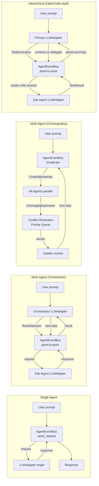
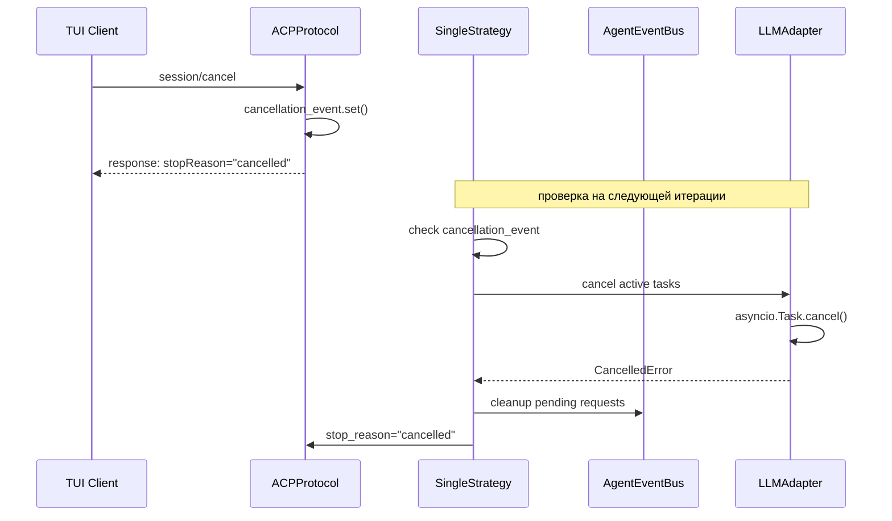
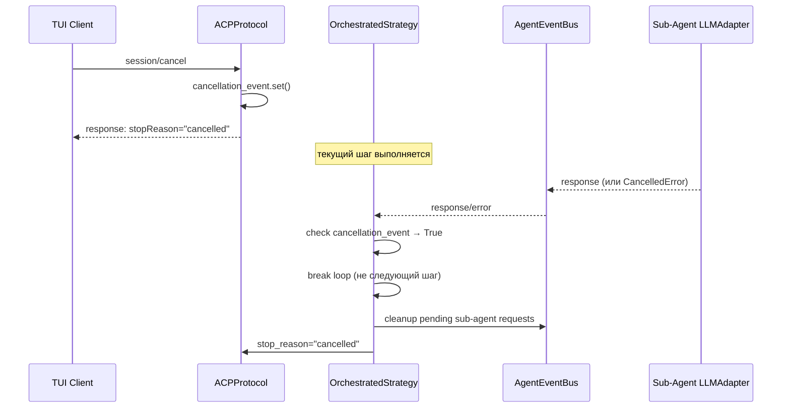
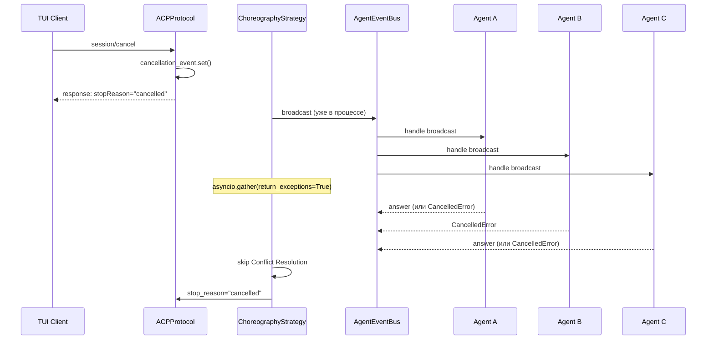
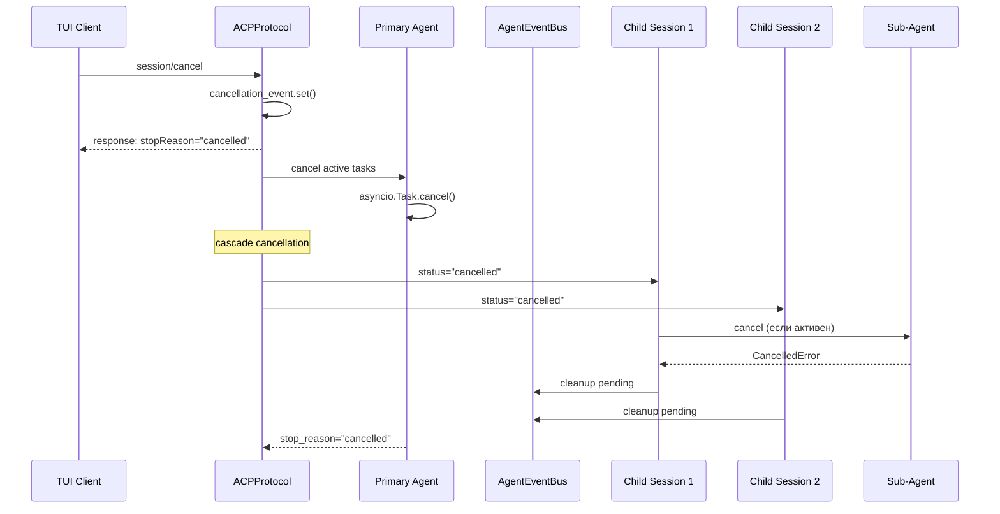

# ТЕХНИЧЕСКОЕ ЗАДАНИЕ: Мультиагентная экосистема CodeLab на базе ACP и EventBus

> Версия: 1.0
> Дата: 27 мая 2026
> Статус: Утверждено к реализации

---

## 1. ОБЩИЕ СВЕДЕНИЯ

### 1.1. Наименование проекта
CodeLab — унифицированная реализация ИИ-ассистента по протоколу Agent Client Protocol (ACP).

### 1.2. Цель изменений
Трансформация архитектуры из Single-Agent системы в гибкую мультиагентную платформу с:
- Централизованным (orchestrator) и децентрализованным (choreography) взаимодействием агентов
- In-Memory EventBus для межагентской коммуникации
- Динамическим изменением состава агентов без перезапуска
- Полной observability (tracing, timeline, metrics) с pluggable external backends
- Сохранением стабильного внешнего ACP-контракта

### 1.3. Стадия реализации
MVP (Minimum Viable Product). Все компоненты работают в одном Python-процессе с возможностью будущего выноса в микросервисы.

### 1.4. Ключевые архитектурные принципы
1. **ACP boundary** — клиент НЕ знает о мультиагентности. Для клиента сервер = один агент.
2. **EventBus-first** — всё межагентское общение проходит через шину событий.
3. **Dynamic agents** — состав агентов меняется на лету через `agents.yaml` hot reload.
4. **Observability by design** — tracing, timeline, metrics встроены через DI, pluggable exporters для OpenTelemetry/Langfuse (post-MVP).
5. **Strategy pattern** — четыре режима выполнения: single, multi_orchestrated, multi_choreographed, hierarchical.
6. **Hybrid context** — Token-Slicing для координатора + Child Sessions для деталей.
7. **Pure uniformity** — все стратегии используют единый путь через EventBus для консистентной observability и архитектуры.
8. **ACP compliance** — все кастомные элементы используют префикс `_` согласно ACP Extensibility spec.

---

## 2. АРХИТЕКТУРА СИСТЕМЫ

### 2.1. Общая схема

```
┌─────────────────┐    WebSocket / JSON-RPC 2.0    ┌──────────────────────────────┐
│   TUI (Client)  │ ◄────────────────────────────► │       Server (Agent)          │
│                 │         ACP Protocol            │                               │
│  session/prompt │                                 │  ACPProtocol                  │
│  session/update │                                 │    ↓                          │
│  session/cancel │                                 │  PromptOrchestrator (Pipeline)│
│  set_config_opt │                                 │    ↓                          │
│                 │                                 │  StrategyDispatcher            │
└─────────────────┘                                 │    ↓                          │
                                                    │  ExecutionEngine               │
                                                    │    ↓                          │
                                                    │  AgentEventBus (INTERNAL)      │
                                                    │  ├── LLMAdapter (coder)        │
                                                    │  ├── LLMAdapter (tester)       │
                                                    │  └── LLMAdapter (orchestrator) │
                                                    │                                │
                                                    │  Observability:                │
                                                    │  ├── Tracer                    │
                                                    │  ├── EventTimeline             │
                                                    │  └── MetricsTracker            │
                                                    │                                │
                                                    │  Configuration:                │
                                                    │  ├── AgentSystemLoader         │
                                                    │  └── AgentFactory              │
                                                    └──────────────────────────────┘
```

### 2.2. Границы ответственности

| Слой | Компоненты | Назначение |
|---|---|---|
| **ACP Layer** | ACPProtocol, PromptOrchestrator, Pipeline | Внешний контракт — НЕ меняется |
| **Agent Layer** | ExecutionEngine, AgentEventBus, LLMAdapter | Мультиагентность — НОВЫЙ |
| **MCP Layer** | MCPManager, MCPClient, MCPToolAdapter, MCPToolExecutor | Внешние инструменты — УЖЕ РЕАЛИЗОВАНО |
| **Observability** | Tracer, EventTimeline, MetricsTracker | Наблюдаемость — НОВЫЙ |
| **Configuration** | AgentSystemLoader, AgentFactory, ConfigOptionBuilder | Динамическая конфигурация — НОВЫЙ |
| **Storage** | SessionStorage, MetricsRepository, ObservabilityStorage | Персистентность — РАСШИРЯЕТСЯ |

### 2.3. Режимы выполнения (Strategy Pattern)

Четыре стратегии выполнения:

| Стратегия | Коммуникация | Контекст | Когда использовать |
|---|---|---|---|
| **Single** | EventBus (send_request) | Единый | Простые задачи, бенчмарк |
| **Orchestrated** | EventBus (point-to-point) | Гибрид (sliced + child) | Сложные последовательные задачи |
| **Choreography** | EventBus (broadcast) | Гибрид (опционально) | Параллельный анализ, исследование |
| **Hierarchical** | EventBus (point-to-point + child session) | Гибрид (нативный) | Делегирование с навигацией |



**Приоритет выбора режима:**
```
1. Slash command override (context.meta["routing_mode"]) — если есть
2. Config value (config_values["_routing_mode"]) — persistent режим сессии
3. Default ("single") — fallback
```

---

## 3. КОМПОНЕНТЫ

### 3.1. AgentEventBus (INTERNAL)

**Назначение:** In-Memory шина для межагентского общения внутри серверного процесса.

**Контракт:**
```python
class AgentEventBus(AbstractEventBus):
    async def register_agent(self, agent_name: str, handler: RequestHandler) -> None
    async def unregister_agent(self, agent_name: str) -> None
    async def send_request(self, request: AgentRequest, parent_span: SpanContext | None) -> AgentResponse
    async def broadcast(self, broadcast: ContextBroadcast) -> list[ChoreographyAnswer]
    def subscribe(self, event_type: type, handler: Handler) -> Subscription
```

**Два паттерна на одной шине:**

| Паттерн | Метод | Использование |
|---|---|---|
| **Point-to-Point** | `send_request()` → `AgentResponse` | Оркестратор → субагент |
| **Broadcast** | `broadcast()` → `list[ChoreographyAnswer]` | Хореография → все агенты |
| **Fire-and-forget** | `publish()` → `None` | Уведомления, метрики, логирование |

### 3.1.1. Коммуникация между агентами

**Принцип чистой uniformity:** все стратегии используют единый путь через EventBus.
Это обеспечивает консистентную observability, единообразную архитектуру и упрощает
разработку, отладку и тестирование всех стратегий.

#### Единый путь через EventBus

```python
# Все стратегии — один паттерн вызова
response = await event_bus.send_request(
    AgentRequest(target_agent=agent_name, ...),
    parent_span=context.span
)
```

**Почему все через EventBus:**
- **Uniformity** — один паттерн для всех стратегий, не нужно держать в голове "какой путь у этой"
- **Observability** — одинаковая структура трейсов: `strategy_execution → bus_request → llm_call`
- **Cross-cutting features** — rate limiting, retry, circuit breaker в одном месте
- **Testing** — один паттерн моков для всех стратегий
- **Debugging** — всегда одинаковые span'ы, проще анализировать
- **Extensibility** — добавление нового агента = регистрация в шине, без изменений стратегий

**Tradeoff:**
- ~10ms dispatch overhead для SingleStrategy
- Bus = single point of failure (митигируется тестами и мониторингом)
- Benchmark contamination (решается вычитанием baseline bus latency)

#### AgentCaller — единый интерфейс

```python
class AgentCaller:
    """Единый интерфейс для вызова агентов через EventBus."""

    async def call(
        self,
        agent_name: str,
        messages: list[Message],
        tools: list[ToolDefinition],
        parent_span: SpanContext,
        session_id: str | None = None,
    ) -> AgentResult:
        # Всегда через EventBus — uniformity
        return await self.event_bus.send_request(
            AgentRequest(
                target_agent=agent_name,
                messages=messages,
                tools=tools,
                correlation_id=self.correlation_id,
                session_id=session_id,
            ),
            parent_span=parent_span
        )
```

#### Матрица коммуникации по стратегиям

| Стратегия | Метод EventBus | LLM calls | Структура трейса | Child Sessions | Контекст |
|---|---|---|---|---|---|
| **Single** | `send_request()` | 1 | Плоская: `bus_request → llm_call` | ❌ | Единый |
| **Orchestrated** | `send_request()` | 1 + N×steps | Вложенная: `route_decision → bus_request → llm_call` (повторяется) | ✅ | Hybrid (sliced + child) |
| **Choreography** | `broadcast()` | N параллельно | Веерная: `broadcast → N×llm_call → conflict_resolution` | ✅ | Hybrid (опционально) |
| **Hierarchical** | `send_request()` | 1 + N×delegations | Дерево: `primary → task_invocation → child_session → llm_call` | ✅ | Hybrid (нативный) |

### 3.1.2. AbstractEventBus (базовый интерфейс)

**Назначение:** Абстрактный интерфейс шины событий, определяющий контракт для publish/subscribe
и point-to-point коммуникации. `AgentEventBus` — конкретная in-memory реализация.

```python
from abc import ABC, abstractmethod
from collections.abc import Callable
from dataclasses import dataclass
from typing import Protocol


@dataclass
class Subscription:
    """Подписка на события — возвращается при subscribe, используется для unsubscribe."""
    event_type: type
    handler: Callable
    is_active: bool = True

    def cancel(self) -> None:
        """Отменить подписку."""
        self.is_active = False


class Handler(Protocol):
    """Протокол обработчика событий."""
    async def __call__(self, event: DomainEvent) -> None: ...


class RequestHandler(Protocol):
    """Протокол обработчика запросов (point-to-point)."""
    async def __call__(self, request: AgentRequest, parent_span: SpanContext | None) -> AgentResponse: ...


class AbstractEventBus(ABC):
    """Базовый интерфейс шины событий для межагентской коммуникации.

    Поддерживает три паттерна:
    - publish/subscribe — fire-and-forget уведомления
    - send_request — point-to-point request/response
    - broadcast — рассылка всем зарегистрированным агентам
    """

    @abstractmethod
    def subscribe(self, event_type: type, handler: Handler) -> Subscription:
        """Подписаться на события указанного типа.

        Args:
            event_type: Класс события (DomainEvent subclass)
            handler: Асинхронный обработчик

        Returns:
            Subscription объект для последующей отписки
        """

    @abstractmethod
    def unsubscribe(self, subscription: Subscription) -> None:
        """Отменить подписку.

        Args:
            subscription: Subscription объект, полученный при subscribe
        """

    @abstractmethod
    def publish(self, event: DomainEvent) -> None:
        """Опубликовать событие — fire-and-forget.

        Все подписчики на event_type получат событие асинхронно.
        Ошибки в обработчиках логируются, но не прерывают dispatch.

        Args:
            event: Событие для публикации
        """

    @abstractmethod
    async def clear(self) -> None:
        """Очистить все подписки и зарегистрированных агентов.

        Используется для тестирования и graceful shutdown.
        """
```

**Жизненный цикл подписки:**
```
1. subscriber.subscribe(EventType, handler) → Subscription
2. EventBus.publish(EventType(...)) → handler вызывается для каждого подписчика
3. subscriber.unsubscribe(subscription) или subscription.cancel()
```

**Гарантии:**
- Подписчики вызываются параллельно (asyncio.gather с return_exceptions=True)
- Ошибка одного подписчика не влияет на остальных
- Порядок вызова подписчиков не гарантируется
- `publish` не блокирует — события dispatch'атся в event loop

---

### 3.2. Контракты сообщений

```python
# Request/Response (для оркестратора)
@dataclass(frozen=True)
class AgentRequest(DomainEvent):
    target_agent: str
    messages: list[Message]
    tools: list[ToolDefinition]
    correlation_id: str
    session_id: str

@dataclass(frozen=True)
class AgentResponse(DomainEvent):
    request_id: str
    text: str
    tool_calls: list[ToolCall]
    usage: TokenUsage          # ← СОХРАНЯЕТСЯ (было потеряно в NaiveAgent)
    stop_reason: str
    agent_name: str

# Result (для Agent Protocol — return type Agent.call())
@dataclass(frozen=True)
class AgentResult:
    """Результат вызова агента через Agent Protocol.

    Отличается от AgentResponse: AgentResponse — DomainEvent для EventBus,
    AgentResult — возвращаемое значение Agent.call().
    LLMAdapter возвращает AgentResult, EventBus оборачивает в AgentResponse.
    """
    text: str
    tool_calls: list[ToolCall]
    usage: TokenUsage          # токены — сохраняется (было потеряно в NaiveAgent)
    stop_reason: str           # "end_turn", "cancelled", "max_iterations", "tool_call"
    agent_name: str
    error: str | None = None

# Broadcast (для хореографии)
@dataclass(frozen=True)
class ContextBroadcast(DomainEvent):
    context: list[Message]
    available_agents: list[str]
    step: int
    correlation_id: str
    session_id: str

@dataclass(frozen=True)
class ChoreographyAnswer(DomainEvent):
    agent_name: str
    action_taken: bool
    reasoning: str
    output: str | None
    status_signal: Literal["continue", "completed"]
    usage: TokenUsage

# Lifecycle events (для observability)
@dataclass(frozen=True)
class AgentRegistered(DomainEvent):
    agent_name: str
    capabilities: dict

@dataclass(frozen=True)
class AgentUnregistered(DomainEvent):
    agent_name: str

@dataclass(frozen=True)
class AgentListChanged(DomainEvent):
    added: list[str]
    removed: list[str]
```

### 3.3. Agent Protocol (единый контракт)

```python
class Agent(Protocol):
    async def call(
        self,
        messages: list[Message],
        tools: list[ToolDefinition] | None = None,
        config: AgentConfig | None = None,
        parent_span: SpanContext | None = None,
    ) -> AgentResult:
        """Вызов агента с историей сообщений и опциональными инструментами."""
```

### 3.4. LLMAdapter (замена NaiveAgent)

**Что сохраняет от NaiveAgent:**
- Cancellation через `asyncio.Task` (`_active_tasks`)
- Tool name mapping (ACP `/` → LLM `_`)
- Plan extraction
- Single LLM call pattern

**Что добавляет:**
- Сохранение `usage` (токены) в `AgentResult`
- Tracer span для каждого LLM call
- Timeline event recording
- Metrics auto-log

### 3.5. ExecutionEngine (замена AgentOrchestrator)

**Композиция вместо монолита:**

| Компонент | Из старого кода | Назначение |
|---|---|---|
| `HistoryBuilder` | `AgentOrchestrator._build_history` + `_convert_to_llm_messages` | Конвертация session.history → LLMMessage |
| `ToolFilter` | `AgentOrchestrator._filter_tools_by_capabilities` | Фильтрация по client capabilities |
| `MessageSanitizer` | `AgentOrchestrator._sanitize_orphaned_tool_calls` | Восстановление orphaned tool calls |
| `PlanExtractor` | `agent/plan_extractor.py` | Извлечение плана из LLM response |
| `LLMAdapter` | `NaiveAgent` | Вызов LLM провайдера |

### 3.6. AgentSystemLoader

**Назначение:** Парсинг `agents.yaml`, hot reload через watchdog, публикация событий.

```yaml
# storage/agents.yaml
global:
  mode: "multi_orchestrated"    # single | multi_orchestrated | multi_choreographed
  default_model: "openai/gpt-4o"
  max_steps: 7
  safety_mode: true
  debug: false

orchestrator:
  model: "openai/gpt-4o"
  temperature: 0.1

agents:
  - name: "coder"
    enabled: true
    model: "anthropic/claude-3-5-sonnet"
    system_prompt: "Ты — Senior Python Developer..."
    tools: ["fs/read_text_file", "fs/write_text_file"]
    priority: 1

  - name: "tester"
    enabled: true
    model: "openai/gpt-4o-mini"
    system_prompt: "Ты — QA Engineer..."
    tools: ["terminal/create", "terminal/wait_for_exit"]
    priority: 2
```

**Hot reload flow:**
```
1. watchdog detect change → agents.yaml modified
2. AgentSystemLoader.reload() → parse new config
3. Для отключенных агентов: agent.stop() → publish AgentUnregistered
4. Для новых агентов: AgentFactory.create() → agent.start() → publish AgentRegistered
5. publish AgentListChanged(added, removed)
6. Подписчики (Orchestrator, TUI, Metrics) реагируют автоматически
```

### 3.7. Execution Strategies

#### SingleStrategy

Вызов единственного агента через EventBus. Минимальная задержка, базовый бенчмарк.

```
1. User prompt → SingleStrategy
2. AgentRequest(target_agent="single") → EventBus.send_request()
3. LLMAdapter обрабатывает запрос
4. AgentResponse → возвращается в стратегию
5. Ответ пользователю
```

**Почему через EventBus:**
- Uniformity — один паттерн для всех стратегий
- Observability — одинаковая структура трейсов
- Testing — один паттерн моков
- Extensibility — легко добавить агентов без изменений стратегии

**Управление контекстом:**
- Token-Slicing: ❌ не используется (нет субагентов)
- Compaction: ✅ fallback при достижении лимита контекста

В длинных сессиях контекст координатора растёт за счёт истории turn'ов.
При достижении `context_window_limit` срабатывает `ContextCompactor`:

```
Session flow с Compaction:
1. Turn 1: user + assistant → history += 2 messages
2. Turn 2: user + assistant → history += 2 messages
3. ...
4. Turn N: context_tokens > context_window_limit
5. ContextCompactor.compact_if_needed() → сжатие history
6. Сохраняем: system prompt + initial user prompt + compacted summary + recent messages
7. Продолжаем с компактным контекстом
```

**Почему только Compaction (без Token-Slicing):**
- Нет субагентов → нет ответов для сжатия
- Сжимать ответ самого себя = потеря информации для следующего turn
- Compaction срабатывает редко (только при переполнении) → минимальный overhead

#### OrchestratedStrategy
```
1. RouteDecision через LLM (Structured Outputs → RouteDecision Pydantic)
2. Point-to-point через EventBus.send_request()
3. Token-Slicing: суммаризация ответа субагента перед добавлением в контекст
4. max_steps предохранитель (по умолчанию 7)
5. Race condition guard: проверка available_agents перед каждым шагом
```

**RouteDecision (Structured Outputs):**
```python
class RouteDecision(BaseModel):
    reasoning: str
    target_agent: str | None    # null = задача решена
    task_payload: str | None    # атомарная задача для субагента
```

#### ChoreographyStrategy
```
1. Broadcast ContextBroadcast всем агентам параллельно
2. Сбор ChoreographyAnswer от каждого агента
3. Conflict Resolution: Priority Queue из agents.yaml
4. coordination_overhead_tokens: токены холостых опросов
5. max_steps предохранитель
```

#### HierarchicalStrategy

Стратегия иерархического делегирования (OpenCode-style Primary + Subagent):

```
1. Primary Agent получает пользовательский запрос
2. Primary LLM решает: ответить самому или делегировать через Task tool
3. При делегировании:
   a. CHECK task permissions (caller может вызывать target?)
   b. Если "ask" → session/request_permission пользователю
   c. Создать child session (изолированный контекст)
   d. TaskInvocation через EventBus.send_request()
4. Subagent выполняет в child session:
   a. Свой system prompt
   b. Свой набор инструментов
   c. Свой permissions
   d. Своя история сообщений
5. Subagent возвращает TaskResult
6. Token-Slicer суммаризует результат для parent context
7. Primary интегрирует summary, продолжает или завершает

**TaskInvocation (через EventBus):**
```python
@dataclass(frozen=True)
class TaskInvocation(DomainEvent):
    target_agent: str
    prompt: str
    tools: list[ToolDefinition]
    permission_override: dict | None = None
    correlation_id: str
    session_id: str           # parent session
    parent_span: SpanContext | None

@dataclass(frozen=True)
class TaskResult(DomainEvent):
    invocation_id: str
    success: bool
    output: str
    tool_calls: list[ToolCall]
    usage: TokenUsage
    agent_name: str
    child_session_id: str     # ID изолированной child session
```

> **Почему `parent_span` — поле в `TaskInvocation`, но параметр в методах:**
>
> | Контекст | Как передаётся | Почему |
> |---|---|---|
> | **Методы** (`send_request`, `Agent.call`, `TokenSlicer.slice`) | Отдельный параметр | Прямой вызов — tracing context propagates через стек вызовов |
> | **DomainEvent** (`TaskInvocation`, `TaskResult`) | Поле dataclass | Событие сериализуется и проходит через EventBus — tracing context должен "путешествовать" вместе с payload |
>
> Это не баг, а различие между **call-time propagation** (методы) и **event-borne context** (события). EventBus извлекает `parent_span` из `TaskInvocation` и использует его при dispatch к целевому агенту.

**Конфигурация агента для HierarchicalStrategy:**
```yaml
agents:
  - name: "coder"
    mode: "primary"           # primary | subagent | hidden
    model: "anthropic/claude-3-5-sonnet"
    tools: ["fs/*", "terminal/*"]
    permission:
      task:                   # task permissions
        "*": "deny"
        "tester": "allow"
        "reviewer": "ask"
      edit: "ask"
      bash:
        "git *": "allow"
        "*": "ask"

  - name: "tester"
    mode: "subagent"
    description: "Writes and runs tests"
    model: "openai/gpt-4o-mini"
    tools: ["terminal/*"]
    hidden: false

  - name: "compact"
    mode: "subagent"
    hidden: true              # системный агент, не виден пользователю
    model: "openai/gpt-4o-mini"
```

**Когда использовать:**
- Субагенту нужен большой контекст (Token-Slicing обрезает детали)
- Пользователь хочет видеть детали работы субагентов
- Итеративная работа с субагентом (рефоллоуап в child session)
- Чёткое разделение ответственности между агентами

### 3.8. Управление контекстом (Hybrid Context Management)

Для балансировки между скоростью выполнения и сохранностью деталей применяется
гибридный подход к управлению контекстом.

#### Три подхода

| Подход | Описание | Плюсы | Минусы |
|---|---|---|---|
| **Token-Slicing** | Суммаризация ответов субагентов перед добавлением в контекст координатора | Компактный контекст, быстрые решения | Потеря деталей, нельзя рефоллоуап |
| **Child Sessions** | Каждый субагент в изолированной сессии с полным контекстом | Полные детали, навигация | Больше storage, сложнее |
| **Гибрид** | Token-Slicing для координатора + Child Sessions для деталей | И скорость, и observability | Средняя сложность |

#### Гибридный подход (рекомендуемый)

```
┌─────────────────────────────────────────────────┐
│  Parent Session (с Token-Slicing summaries)     │
│  Для быстрых RouteDecision координатора         │
│  Для основного потока ACP history               │
└─────────────────────────────────────────────────┘
                      +
┌─────────────────────────────────────────────────┐
│  Child Sessions (полный контекст, сохранены)    │
│  Для TUI navigation и отладки                   │
│  Для рефоллоуап с субагентами                   │
│  TUI-only, не раскрывает ACP boundary           │
└─────────────────────────────────────────────────┘
```

#### Применимость по стратегиям

| Стратегия | Token-Slicing | Child Sessions | Гибрид | Ценность |
|---|---|---|---|---|
| **Single** | ❌ | ❌ | ❌ | Не нужен |
| **Orchestrated** | ✅ | ✅ | ✅ | **Высокая** |
| **Choreography** | ✅ | ✅ | ✅ | Средняя |
| **Hierarchical** | ✅ | ✅ | ✅ | **Высокая** |

#### TokenSlicer компонент

```python
@dataclass(frozen=True)
class SlicedResult:
    summary: str               # суммаризированный ответ для parent context
    child_session_id: str      # ссылка на child session с полным контекстом
    original_tokens: int       # количество токенов до сжатия
    sliced_tokens: int         # количество токенов после сжатия
    compression_ratio: float   # sliced_tokens / original_tokens
    was_skipped: bool          # True если slicing пропущен (маленький output)


class TokenSlicer:
    """Суммаризация ответов субагентов для экономии контекста координатора.

    Использует дешёвую LLM модель для создания компактных summaries.
    Полный контекст сохраняется в child session для навигации и рефоллоуап.
    """

    # Prompt template для суммаризации
    SUMMARIZE_PROMPT = """\
Summarize the following agent output for context injection into a coordinator.
Focus on: what was done, key results, important file paths, test names, error messages.
Omit: intermediate reasoning, retry attempts, verbose explanations, tool call details.
Preserve: exact file paths, function names, test names, error messages, numeric results.
Maximum {max_tokens} tokens in the summary.
"""

    # Skip threshold: если output меньше этого, не сжимаем
    SKIP_THRESHOLD_TOKENS = 300

    def __init__(
        self,
        llm: LLMProvider,
        model: str = "openai/gpt-4o-mini",  # дешёвая модель для slicing
        max_tokens: int = 120,
    ):
        self._llm = llm
        self._model = model
        self._max_tokens = max_tokens

    async def slice(
        self,
        full_output: str,
        child_session_id: str,
        parent_span: SpanContext | None = None,
    ) -> SlicedResult:
        """Суммаризует ответ субагента, сохраняя ссылку на child session.

        Args:
            full_output: Полный ответ субагента
            child_session_id: ID child session с полным контекстом
            parent_span: Span для tracing

        Returns:
            SlicedResult с summary и метриками
        """
        original_tokens = count_tokens(full_output)

        # Skip threshold: маленькие ответы не сжимаем
        if original_tokens < self.SKIP_THRESHOLD_TOKENS:
            return SlicedResult(
                summary=full_output,
                child_session_id=child_session_id,
                original_tokens=original_tokens,
                sliced_tokens=original_tokens,
                compression_ratio=1.0,
                was_skipped=True,
            )

        # LLM summarization
        prompt = self.SUMMARIZE_PROMPT.format(max_tokens=self._max_tokens)
        messages = [
            {"role": "system", "content": prompt},
            {"role": "user", "content": full_output},
        ]

        try:
            response = await self._llm.chat(
                messages=messages,
                model=self._model,
                max_tokens=self._max_tokens,
            )
            summary = response.text
        except (ProviderError, AllProvidersFailed) as e:
            # Fallback: truncate + ellipsis
            summary = self._truncate_fallback(full_output, self._max_tokens)

        sliced_tokens = count_tokens(summary)

        return SlicedResult(
            summary=summary,
            child_session_id=child_session_id,
            original_tokens=original_tokens,
            sliced_tokens=sliced_tokens,
            compression_ratio=sliced_tokens / original_tokens if original_tokens > 0 else 1.0,
            was_skipped=False,
        )

    def _truncate_fallback(self, text: str, max_tokens: int) -> str:
        """Fallback при ошибке LLM — truncate с сохранением начала и конца."""
        # Берём первые 60% и последние 40% текста
        head_len = int(max_tokens * 0.6)
        tail_len = max_tokens - head_len
        tokens = tokenize(text)
        if len(tokens) <= max_tokens:
            return text
        head = detokenize(tokens[:head_len])
        tail = detokenize(tokens[-tail_len:])
        return f"{head}\n\n... [truncated, see child session for details] ...\n\n{tail}"
```

**Конфигурация в agents.yaml:**
```yaml
global:
  max_sliced_tokens: 120        # лимит токенов для summary
  slicer_model: "openai/gpt-4o-mini"  # модель для суммаризации
  slicer_skip_threshold: 300    # не сжимать если output < N tokens
  context_window_limit: 8000    # триггер compaction (fallback)
```

**Интеграция со стратегиями:**

| Стратегия | Когда вызывается | Обязательность |
|---|---|---|
| **OrchestratedStrategy** | После каждого sub-agent response | ✅ Обязательно |
| **HierarchicalStrategy** | При возврате TaskResult из child session | ✅ Обязательно |
| **ChoreographyStrategy** | После conflict resolution (winner output) | Опционально |
| **SingleStrategy** | — | ❌ Не используется (только Compaction fallback) |

**Метрики сжатия (observability):**
```
Span: token_slicing
  attributes:
    original_tokens: 4500
    sliced_tokens: 120
    compression_ratio: 0.027        # 97.3% сжатие
    was_skipped: false
    slicer_model: "openai/gpt-4o-mini"
    slicer_latency_ms: 850
```

#### Compaction Fallback

Token-Slicing контролирует рост контекста на каждом шаге, но при длинных сессиях
контекст координатора всё равно может достичь лимита. В этом случае срабатывает
**Compaction** — механизм сжатия всего conversation history (аналогично подходу OpenCode).

```python
class ContextCompactor:
    """Сжатие всего conversation history при достижении лимита контекста.

    Fallback механизм: срабатывает только когда Token-Slicing недостаточно.
    Использует hidden compactor agent (аналогично OpenCode compaction agent).
    """

    def __init__(
        self,
        llm: LLMProvider,
        model: str = "openai/gpt-4o-mini",
        max_context_tokens: int = 8000,  # триггер
    ):
        self._llm = llm
        self._model = model
        self._max_context_tokens = max_context_tokens

    async def compact_if_needed(
        self,
        history: list[Message],
        parent_span: SpanContext | None = None,
    ) -> tuple[list[Message], bool]:
        """Сжимает history если превышает лимит.

        Returns:
            (новый history, был ли выполнен compact)
        """
        current_tokens = count_tokens(history)
        if current_tokens < self._max_context_tokens:
            return history, False

        # Compaction — сжатие всего conversation
        compacted = await self._compact_conversation(history)
        return compacted, True

    async def _compact_conversation(self, history: list[Message]) -> list[Message]:
        """Сжимает conversation в компактную summary.

        Стратегия:
        1. Сохраняем первые 2 сообщения (system + initial user prompt)
        2. Суммаризируем середину в один message
        3. Сохраняем последние N сообщений (recent context)
        """
        system_msg = history[0]
        initial_prompt = history[1]

        # Суммаризация середины
        middle = history[2:-3]  # всё кроме начала и последних 3
        summary = await self._llm.summarize_conversation(middle)

        # Последние сообщения сохраняем как есть (recent context)
        recent = history[-3:]

        return [
            system_msg,
            initial_prompt,
            {"role": "assistant", "content": f"[Compacted: {len(middle)} messages summarized]\n{summary}"},
            *recent,
        ]
```

**Когда срабатывает Compaction:**
```
1. Token-Slicing суммаризирует каждый sub-agent response
2. Контекст координатора растёт (summaries + route decisions + tool results)
3. При достижении context_window_limit → Compaction fallback
4. Compaction сжимает весь history в компактную форму
5. Child sessions сохраняют полный контекст (не теряются)
```

**Сравнение подходов:**

| Механизм | Когда | Что сжимает | LLM calls | Granularity |
|---|---|---|---|---|
| **Token-Slicing** | После каждого sub-agent response | Ответ одного субагента | N (частые) | Высокая |
| **Compaction** | При достижении лимита контекста | Весь conversation history | 1 (редкий) | Низкая |

**Вместе:** Token-Slicing — основной механизм контроля контекста для мультиагентных стратегий. Compaction — fallback когда slicing недостаточно. Это даёт лучшее из обоих подходов: гранулярный контроль + гарантию что контекст не переполнится даже при длинных сессиях.

**Применимость по стратегиям:**

| Стратегия | Token-Slicing | Compaction Fallback |
|---|---|---|
| **Single** | ❌ | ✅ |
| **Orchestrated** | ✅ | ✅ |
| **Choreography** | ✅ (опционально) | ✅ |
| **Hierarchical** | ✅ | ✅ |

#### SessionState для иерархии

```python
class SessionState(BaseModel):
    # ... существующие поля ...
    parent_session_id: str | None = None
    child_session_ids: list[str] = Field(default_factory=list)
    is_child_session: bool = False
    task_result: str | None = None
    sliced_summary: str | None = None
```

#### ACP Boundary и навигация

Session navigation — **TUI-only фича**. Сервер хранит иерархию сессий
internally, но через ACP отдаёт только merged history родительской сессии.

Через ACP (merged history):
```json
{
  "history": [
    {"role": "user", "text": "Напиши CRUD API"},
    {"role": "assistant", "text": "Делегирую coder...", "agent_name": "primary"},
    {"role": "assistant", "text": "Создал 5 файлов", "agent_name": "coder"},
    {"role": "assistant", "text": "Делегирую tester...", "agent_name": "primary"},
    {"role": "assistant", "text": "Написал 20 тестов", "agent_name": "tester"}
  ]
}
```

Только в TUI:
- Навигация parent ↔ child sessions (Leader+Left/Right)
- Просмотр полной child session history
- Debug panel с деталями субагентов

**Обоснование:** Клиент НЕ знает о мультиагентности (принцип 1). Навигация —
это UI-фича для observability, не раскрытие внутренней архитектуры.

### 3.9. MCP Integration (УЖЕ РЕАЛИЗОВАНО)

MCP (Model Context Protocol) позволяет подключать внешние серверы инструментов
к сессии агента. MCP инструменты доступны агенту наравне с нативными инструментами
CodeLab, но выполняются через отдельные процессы или HTTP-эндпоинты.

#### Архитектура MCP

```
┌─────────────────────────────────────────────────────────────┐
│  Session (per-session MCP)                                  │
│                                                             │
│  MCPManager                                                 │
│  ├── MCPClient (server: filesystem)                         │
│  │   ├── StdioTransport / HttpTransport / SseTransport      │
│  │   └── MCPToolAdapter → ToolDefinition                    │
│  ├── MCPClient (server: database)                           │
│  │   ├── StdioTransport / HttpTransport / SseTransport      │
│  │   └── MCPToolAdapter → ToolDefinition                    │
│  └── MCPClient (server: ...)                                │
│                                                             │
│  Execution:                                                 │
│  LLM call → mcp:filesystem:read_file                        │
│           ↓                                                 │
│  MCPToolExecutor.is_mcp_tool() → True                       │
│           ↓                                                 │
│  MCPManager.call_tool("filesystem", "read_file", args)      │
│           ↓                                                 │
│  MCPClient.call_tool() → JSON-RPC → subprocess/HTTP         │
└─────────────────────────────────────────────────────────────┘
```

#### Компоненты

| Компонент | Файл | Назначение |
|---|---|---|
| **MCPManager** | `server/mcp/manager.py` | Per-session менеджер MCP серверов: add/remove, get_all_tools, call_tool routing, auto-reconnect |
| **MCPClient** | `server/mcp/client.py` | Клиент для одного MCP сервера: connect, initialize, list_tools, call_tool, disconnect |
| **MCPToolAdapter** | `server/mcp/tool_adapter.py` | Конвертация MCPTool → ToolDefinition с namespace prefix |
| **MCPToolExecutor** | `server/tools/executors/mcp_executor.py` | Исполнитель MCP инструментов через ToolExecutor интерфейс |
| **MCPServerConfig** | `server/mcp/models.py` | Pydantic модель конфигурации MCP сервера |
| **Transport** | `server/mcp/transport.py` | StdioTransport, HttpTransport, SseTransport |

#### Naming Convention

MCP инструменты используют namespaced имена:

```
Формат:    mcp:{server_id}:{tool_name}
Пример:    mcp:filesystem:read_file
           mcp:database:query
           mcp:github:search_repositories

LLM формат: mcp_filesystem_read_file  (для совместимости с LLM)
```

#### MCPServerConfig

```python
class MCPServerConfig(BaseModel):
    name: str                          # Unique server identifier
    type: str = "stdio"                # Transport type: stdio, http, sse
    command: str | None = None         # Command for stdio
    args: list[str] = []               # CLI arguments for stdio
    env: list[dict[str, str]] = []     # Environment variables
    url: str | None = None             # URL for http/sse
    headers: list[dict[str, str]] = [] # HTTP headers
    max_retries: int = 5               # Retry configuration
    initial_delay: float = 1.0
    max_delay: float = 30.0
    backoff_multiplier: float = 2.0
```

> **Почему `env` и `headers` — `list[dict]` а не `dict[str, str]`:**
> Формат `list[dict]` поддерживает два стиля записи в YAML:
> ```yaml
> # Стиль 1: явные name/value (удобно для MCP CLI, читаемо)
> env:
>   - name: "API_KEY"
>     value: "secret"
>
> # Стиль 2: прямой key-value (компактно)
> env:
>   - API_KEY: "secret"
> ```
> Конвертация в `dict[str, str]` выполняется методом `get_env_dict()` (`models.py:521`), который используется при создании subprocess. Это осознанное решение для удобства ручной конфигурации — YAML-файлы читаются людьми, а `list[dict]` гибче для разных стилей записи.

#### MCP Lifecycle

```
1. session/new с params.mcpServers
   ↓
2. ACPProtocol._setup_mcp_if_needed()
   ↓
3. MCPManager(session_id) → SessionRuntimeRegistry.set_mcp_manager()
   ↓
4. Для каждого сервера:
   a. MCPClient(config)
   b. client.connect() → subprocess/HTTP
   c. client.initialize() → MCP handshake
   d. client.list_tools() → fetch tools
   e. MCPToolAdapter(server_id, client) → ToolDefinition
   ↓
5. MCP tools добавляются к агенту через mcp_manager.get_all_tools()
   ↓
6. При выполнении: MCPToolExecutor.dispatch() → mcp_manager.call_tool()
   ↓
7. При cleanup (WebSocket close): MCPManager.shutdown() → все клиенты
```

#### Integration с ExecutionEngine

```python
# Execution flow в LLMLoopStage:
if MCPToolExecutor.is_mcp_tool(tool_name):
    # MCP инструмент — через MCPManager
    mcp_executor = MCPToolExecutor(mcp_manager)
    result = await mcp_executor.execute_tool(session_id, tool_name, args)
else:
    # Нативный инструмент — через ToolRegistry
    result = await self._tool_registry.execute_tool(session_id, tool_name, args)
```

#### MCP Tools в System Message

Когда MCP серверы подключены, system message агента включает список серверов
и их инструментов:

```
Connected MCP servers:
- filesystem (stdio): read_file, write_file, list_directory, search_files
- database (stdio): query, execute_migration
```

#### MCP и ToolFilter

MCP инструменты **НЕ** фильтруются по client capabilities — они всегда доступны
если сервер подключен. Это осознанное решение: клиент сам указывает какие MCP
серверы подключить при создании сессии.

#### MCP и Permissions

MCP инструменты требуют разрешений (`requires_permission = True` в ToolDefinition).
Permissions flow работает одинаково для нативных и MCP инструментов:
- session policy → global policy → ask user
- `agent_name` передаётся через `_meta` (см. раздел 7.2)

#### MCP в ACP

MCP серверы передаются через `session/new` params:

```json
{
  "method": "session/new",
  "params": {
    "mcpServers": [
      {
        "name": "filesystem",
        "type": "stdio",
        "command": "mcp-server-filesystem",
        "args": ["/allowed/path"]
      },
      {
        "name": "database",
        "type": "http",
        "url": "http://localhost:3001/mcp"
      }
    ]
  }
}
```

MCP config сохраняется в `SessionState.mcp_servers` для session reload.

#### MCP и мультиагентность

В мультиагентных стратегиях MCP инструменты доступны всем агентам:

| Стратегия | MCP инструменты |
|---|---|
| **Single** | Доступны единственному агенту |
| **Orchestrated** | Доступны всем субагентам через EventBus |
| **Choreography** | Доступны всем агентам параллельно |
| **Hierarchical** | Доступны primary и subagent (через child session) |

MCP инструменты передаются в `AgentRequest.tools` вместе с нативными инструментами.

### 3.10. External Observability Backends (Post-MVP)

Архитектура observability спроектирована для быстрого подключения внешних бэкендов
без изменений core-кода. Интеграция **НЕ входит в MVP** — все exporters отключены
по умолчанию, MVP использует только InMemory хранилище.

#### Pluggable Exporters

```python
class SpanExporter(ABC):
    """Абстрактный экспортёр span'ов для внешних систем."""

    async def export(self, spans: list[Span]) -> None:
        """Экспортировать batch span'ов во внешнюю систему."""

class MetricsExporter(ABC):
    """Абстрактный экспортёр метрик для внешних систем."""

    async def export(self, metrics: ExecutionMetrics) -> None:
        """Экспортировать метрики во внешнюю систему."""
```

#### Поддерживаемые бэкенды (post-MVP)

| Бэкенд | Тип | Что даёт | Exporter |
|---|---|---|---|
| **OpenTelemetry** | Traces + Metrics + Logs | Vendor-neutral observability | `OTelSpanExporter` |
| **Langfuse** | LLM Observability | Token tracking, cost, model comparison | `LangfuseExporter` |
| **Jaeger** | Tracing UI | Визуализация distributed traces | Через OTel |
| **Prometheus** | Metrics | Time-series metrics + alerting | `PrometheusExporter` |

#### Конфигурация в agents.yaml

```yaml
observability:
  enabled: false                    # MVP: всегда false
  otel:
    enabled: false
    endpoint: "http://localhost:4317"
    protocol: "grpc"                # grpc | http
  langfuse:
    enabled: false
    host: "https://cloud.langfuse.com"
    public_key: "${LANGFUSE_PUBLIC_KEY}"
    secret_key: "${LANGFUSE_SECRET_KEY}"
```

#### ObservabilityFactory с DI

```python
class ObservabilityFactory:
    def __init__(self, config: ObservabilityConfig):
        self.tracer = InMemoryTracer()
        self.timeline = EventTimeline()
        self.exporters: list[SpanExporter] = []

        # Post-MVP: загрузка exporters по конфигу
        if config.otel.enabled:
            self.exporters.append(OTelSpanExporter(config.otel))
        if config.langfuse.enabled:
            self.exporters.append(LangfuseExporter(config.langfuse))

    async def export_spans(self, spans: list[Span]):
        for exporter in self.exporters:
            await exporter.export(spans)
```

#### Mapping Span → OpenTelemetry

| CodeLab Span | OpenTelemetry Attribute |
|---|---|
| `trace_id` | `trace_id` |
| `span_id` | `span_id` |
| `parent_span_id` | `parent_span_id` |
| `operation` | `span.name` |
| `agent_name` | `agent.name` |
| `attributes["model"]` | `gen_ai.request.model` |
| `attributes["input_tokens"]` | `gen_ai.usage.input_tokens` |
| `attributes["output_tokens"]` | `gen_ai.usage.output_tokens` |
| `correlation_id` | `correlation.id` |

#### Mapping Span → Langfuse

| CodeLab Span | Langfuse Field |
|---|---|
| `trace_id` | `trace.session_id` |
| `operation == "llm_call"` | `generation` |
| `attributes["prompt"]` | `generation.input` |
| `attributes["response"]` | `generation.output` |
| `usage` | `generation.usage` |
| `agent_name` | `trace.metadata.agent` |
| `start_time / end_time` | `generation.startTime / endTime` |

#### Когда интегрировать

| Фаза | Действие |
|---|---|
| **MVP** | Abstract interfaces + InMemory только |
| **Post-MVP** | OTel exporter + Jaeger/Grafana |
| **Production** | Langfuse + Prometheus + alerting |

---

### 3.11. StrategyDispatcher

**Назначение:** Диспетчер стратегий выполнения — выбирает и делегирует обработку
prompt turn соответствующей стратегии на основе `_routing_mode`.

```python
class StrategyDispatcher:
    """Выбор и выполнение стратегии на основе конфигурации."""

    def __init__(
        self,
        strategies: dict[str, ExecutionStrategy],
        default_strategy: str = "single",
    ):
        self._strategies = strategies
        self._default = default_strategy

    async def execute(
        self,
        context: TurnContext,
        routing_mode: str | None = None,
    ) -> LLMLoopResult:
        """Выбрать стратегию и выполнить.

        Priority:
        1. routing_mode из параметра (slash command override)
        2. config_values["_routing_mode"] из сессии
        3. default_strategy

        Args:
            context: TurnContext с промптом, историей, correlation_id
            routing_mode: Override режима (из slash command meta)

        Returns:
            LLMLoopResult с notifications и финальным текстом

        Raises:
            UnknownStrategyError: если routing_mode не найден в strategies
        """
        mode = routing_mode or context.config.get("_routing_mode", self._default)
        strategy = self._strategies.get(mode)
        if strategy is None:
            raise UnknownStrategyError(f"Unknown routing mode: {mode}")
        return await strategy.execute(context)

    def register(self, mode: str, strategy: ExecutionStrategy) -> None:
        """Зарегистрировать стратегию для режима."""

    def available_modes(self) -> list[str]:
        """Список доступных режимов."""
```

**Интеграция с Pipeline:**
```
PromptOrchestrator
  → Pipeline (stages)
    → StrategySelectionStage: определяет routing_mode
    → LLMLoopStage: делегирует StrategyDispatcher.execute(context)
      → StrategyDispatcher выбирает стратегию
        → ExecutionStrategy.execute(context)
          → ExecutionEngine / EventBus / LLMAdapter
```

**Доступные стратегии (MVP):**
| Режим | Класс | Описание |
|---|---|---|
| `"single"` | `SingleStrategy` | Прямой вызов LLMAdapter через EventBus |
| `"multi_orchestrated"` | `OrchestratedStrategy` | Оркестратор с RouteDecision |
| `"multi_choreographed"` | `ChoreographyStrategy` | Broadcast всем агентам |
| `"hierarchical"` | `HierarchicalStrategy` | Primary-Subagent с child sessions |

---

## 4. OBSERVABILITY

### 4.1. Три слоя наблюдаемости

| Слой | Что даёт | Где хранится | Как смотреть |
|---|---|---|---|
| **Structured Logging** | Что произошло | `logs/codelab.log` (JSON) | `grep correlation_id`, `jq` |
| **Distributed Tracing** | Как прошло, где задержка | In-memory + `debug/trace_*.json` | TUI live view, JSON export |
| **Event Timeline** | Почему произошло, полная хронология | In-memory + `debug/timeline_*.json` | TUI live view, JSON export |

### 4.2. Correlation ID

Сквозной ID для каждого prompt turn:
```
correlation_id = f"turn_{session_id}_{turn_number}"
```

Все логи, spans, timeline events включают correlation_id.

### 4.3. Distributed Tracing

```python
@dataclass
class Span:
    trace_id: str
    span_id: str
    parent_span_id: str | None
    operation: str          # "llm_call", "bus_request", "route_decision", "tool_call"
    agent_name: str
    start_time: float
    end_time: float | None
    status: Literal["ok", "error", "cancelled"]
    attributes: dict[str, Any]
    error: str | None
```

**Пример трейса:**
```
trace_id: turn_sess123_5
├─ prompt_received [0ms]
├─ strategy_execution [12500ms]
│  ├─ route_decision [2300ms] → target=coder
│  ├─ bus_request [8500ms] → coder
│  │  └─ llm_call [8200ms] claude-3-5-sonnet, 4500 in / 1200 out
│  ├─ token_slicing [50ms] 4500→120
│  └─ route_decision [1650ms] → target=tester
│     └─ bus_request [1650ms] → tester
│        └─ llm_call [1600ms] gpt-4o-mini, 2100 in / 600 out
└─ prompt_completed [0ms]
```

### 4.3.1. InMemoryTracer

**Назначение:** In-memory реализация distributed tracing для MVP. Хранит span'ы
в памяти, поддерживает контекст через `SpanContext`, экспортирует в JSON при
завершении turn (debug mode).

```python
@dataclass
class SpanContext:
    """Контекст для propagation tracing информации между компонентами."""
    trace_id: str
    span_id: str
    parent_span_id: str | None = None
    correlation_id: str | None = None

    def child(self, operation: str) -> SpanContext:
        """Создать дочерний контекст."""
        return SpanContext(
            trace_id=self.trace_id,
            span_id=generate_span_id(),
            parent_span_id=self.span_id,
            correlation_id=self.correlation_id,
        )


class InMemoryTracer:
    """In-memory tracer для MVP.

    Хранит все span'ы в памяти, экспортирует по запросу.
    Для production заменить на OTel-compatible tracer.
    """

    def __init__(self):
        self._spans: dict[str, Span] = {}
        self._active_spans: dict[str, SpanContext] = {}

    def start_span(
        self,
        operation: str,
        parent_context: SpanContext | None = None,
        agent_name: str = "",
        attributes: dict[str, Any] | None = None,
    ) -> SpanContext:
        """Начать новый span.

        Args:
            operation: Название операции ("llm_call", "bus_request", etc.)
            parent_context: Родительский контекст (None для root)
            agent_name: Имя агента
            attributes: Дополнительные атрибуты

        Returns:
            SpanContext для propagation
        """
        parent_span_id = parent_context.span_id if parent_context else None
        trace_id = parent_context.trace_id if parent_context else generate_trace_id()
        span_id = generate_span_id()

        span = Span(
            trace_id=trace_id,
            span_id=span_id,
            parent_span_id=parent_span_id,
            operation=operation,
            agent_name=agent_name,
            start_time=time.monotonic(),
            end_time=None,
            status="ok",
            attributes=attributes or {},
            error=None,
        )
        self._spans[span_id] = span
        ctx = SpanContext(
            trace_id=trace_id,
            span_id=span_id,
            parent_span_id=parent_span_id,
        )
        self._active_spans[span_id] = ctx
        return ctx

    def end_span(
        self,
        context: SpanContext,
        status: str = "ok",
        error: str | None = None,
        attributes: dict[str, Any] | None = None,
    ) -> None:
        """Завершить span.

        Args:
            context: SpanContext от start_span
            status: "ok", "error", "cancelled"
            error: Сообщение об ошибке (если status="error")
            attributes: Дополнительные атрибуты (merge с существующими)
        """
        span = self._spans.get(context.span_id)
        if span is None:
            return
        span.end_time = time.monotonic()
        span.status = status
        span.error = error
        if attributes:
            span.attributes.update(attributes)
        self._active_spans.pop(context.span_id, None)

    @contextmanager
    def trace(
        self,
        operation: str,
        parent_context: SpanContext | None = None,
        agent_name: str = "",
        attributes: dict[str, Any] | None = None,
    ) -> Generator[SpanContext, None, None]:
        """Context manager для автоматического start/end span.

        Usage:
            with tracer.trace("llm_call", parent_context, agent_name="coder") as ctx:
                # ... выполнение ...
                # span автоматически завершится при выходе из блока
        """
        ctx = self.start_span(operation, parent_context, agent_name, attributes)
        try:
            yield ctx
        except Exception as e:
            self.end_span(ctx, status="error", error=str(e))
            raise
        else:
            self.end_span(ctx)

    def get_spans(self, trace_id: str) -> list[Span]:
        """Получить все span'ы для trace_id."""
        return [s for s in self._spans.values() if s.trace_id == trace_id]

    def export(self) -> list[dict[str, Any]]:
        """Экспортировать все span'ы в serializable формат."""
        return [asdict(s) for s in self._spans.values()]

    def clear(self) -> None:
        """Очистить все span'ы."""
        self._spans.clear()
        self._active_spans.clear()
```

**Генерация ID:**
```python
def generate_trace_id() -> str:
    return f"trace_{uuid4().hex[:12]}"

def generate_span_id() -> str:
    return f"span_{uuid4().hex[:8]}"
```

**Связь с ObservabilityFactory:**
```python
class ObservabilityFactory:
    def __init__(self, config: ObservabilityConfig):
        self.tracer = InMemoryTracer()   # MVP — всегда in-memory
        self.timeline = EventTimeline()
        # ...
```

---

### 4.4. Event Timeline

```python
@dataclass
class TimelineEvent:
    timestamp: float
    event_type: str
    session_id: str
    correlation_id: str
    publisher: str
    subscribers: list[str]
    payload_summary: dict
    duration_ms: float | None
    error: str | None
```

### 4.5. Debug Mode

При `debug: true` в `agents.yaml`:
- Full payload logging (не только summary)
- LLM prompt/response dump (для анализа RouteDecision)
- Broadcast audit (все ответы при хореографии, включая "молчащих" агентов)
- Conflict Resolution details
- Token slicing diff (до/после)
- Export: `storage/debug/trace_{session_id}.json`, `timeline_{session_id}.json`

### 4.6. TUI Live View

```
┌─────────────────────────────────────────────────────────────────┐
│ CodeLab AI Terminal                              [MODE: MULTI]  │
├─────────────────────────────────────────────────────────────────┤
│ 🔄 [orchestrator] Принимаю задачу. Анализирую...               │
│ 🎯 [orchestrator] Решение: нужен coder (2.3s LLM)              │
│ 🤖 [coder] → claude-3-5-sonnet [8.2s] · 4500 in / 1200 out    │
│ 📝 [coder] Создал src/validator.py                              │
│ ✂️ [orchestrator] Контекст сжат: 4500 → 120 символов            │
│ 🎯 [orchestrator] Решение: нужен tester (1.6s LLM)             │
│ 🤖 [tester] → gpt-4o-mini [1.6s] · 2100 in / 600 out          │
│ 🧪 [tester] Написал 4 теста                                    │
│ ─────────────────────────────────────────────────────────────── │
│ 💰 $0.042 | 8400 tokens | 12.3s | 3 LLM calls                  │
└─────────────────────────────────────────────────────────────────┘

TUI Navigation (Leader+Right/Left):
┌─────────────────────────────────────────────────────────────────┐
│ [Child: coder] session/child_1                                  │
│ System: Ты — Senior Python Developer...                         │
│ Task: Напиши валидатор email                                    │
│ [полный код, tool calls, результаты]                            │
│                                                                 │
│ [Leader+Right] → [Child: tester]  |  [Leader+Left] → [Parent]  │
└─────────────────────────────────────────────────────────────────┘
```

---

## 5. STORAGE

### 5.1. Что где хранится

| Данные | Где | Формат | Когда сохраняется |
|---|---|---|---|
| **Session state + history** | `~/.codelab/sessions/{id}.json` | Pydantic model_dump | После каждого turn |
| **Child sessions** | `~/.codelab/sessions/{id}/children/` | Pydantic model_dump | При создании child session |
| **Session metrics** | `storage/benchmarks/run_{id}.json` | ExecutionMetrics | По завершении turn |
| **Event timeline** | `storage/debug/timeline_{id}.json` | list[TimelineEvent] | Только debug mode |
| **Trace spans** | `storage/debug/trace_{id}.json` | list[Span] | Только debug mode |
| **Agent config** | `storage/agents.yaml` | YAML | При старте + hot reload |
| **Observability config** | `storage/agents.yaml` (секция `observability`) | YAML | При старте + hot reload |
| **MCP server config** | `SessionState.mcp_servers` | JSON (в session state) | При session/new, сохраняется для reload |
| **Global policies** | `~/.codelab/data/policies/global_permissions.json` | JSON | При изменении |
| **Model pricing** | `storage/models_price.json` | JSON | Статический справочник |

### 5.2. Новые поля в SessionState

```python
class SessionState(BaseModel):
    # ... существующие поля ...
    execution_mode: str = "single"                    # single | multi_orchestrated | multi_choreographed | hierarchical
    active_agents: list[str] = Field(default_factory=list)
    session_metrics: SessionMetrics | None = None
    current_correlation_id: str | None = None
    # Иерархия сессий (для HierarchicalStrategy и гибридного контекста)
    parent_session_id: str | None = None
    child_session_ids: list[str] = Field(default_factory=list)
    is_child_session: bool = False
    task_result: str | None = None
    sliced_summary: str | None = None

class SessionMetrics(BaseModel):
    total_time_sec: float = 0.0
    total_llm_calls: int = 0
    input_tokens: int = 0
    output_tokens: int = 0
    estimated_cost_usd: float = 0.0
    task_success: bool | None = None
    agent_breakdown: dict[str, dict] = Field(default_factory=dict)
```

### 5.3. Мультиагентная история

```python
session.history = [
    {"role": "user", "text": "Напиши валидатор email"},
    {"role": "assistant", "text": "Анализирую...", "agent_name": "orchestrator",
     "correlation_id": "turn_sess123_5", "step": 1},
    {"role": "assistant", "text": "Создал validator.py", "agent_name": "coder",
     "correlation_id": "turn_sess123_5", "step": 2,
     "usage": {"prompt_tokens": 4500, "completion_tokens": 1200}},
    {"role": "tool", "tool_call_id": "call_001", "content": "File written",
     "agent_name": "coder"},
]
```

### 5.4. Atomic write для метрик

```
1. Пишем во временный файл: .run_{session_id}.json.tmp
2. Atomic rename: → run_{session_id}.json
```

### 5.5. Миграция существующих сессий

Существующие `SessionState` файлы **совместимы** — новые поля имеют defaults. Миграция через `model_validator`:

```python
@model_validator(mode="before")
@classmethod
def migrate_schema(cls, data: dict) -> dict:
    version = data.get("schema_version", 0)
    if version < 3:
        data.setdefault("execution_mode", "single")
        data.setdefault("active_agents", [])
        data.setdefault("session_metrics", None)
        data.setdefault("parent_session_id", None)
        data.setdefault("child_session_ids", [])
        data.setdefault("is_child_session", False)
        data.setdefault("task_result", None)
        data.setdefault("sliced_summary", None)
        data["schema_version"] = 3
    return data
```

---

## 6. ACP BOUNDARY И CONFIG OPTIONS

### 6.1. Принцип

**Клиент НЕ знает о мультиагентности.** Для клиента сервер = один агент. ACP контракт не меняется.

Все кастомные config options используют префикс `_` согласно ACP Extensibility (15-Extensibility.md):
> *"The protocol reserves any method name starting with an underscore (`_`) for custom extensions."*

### 6.2. session/set_config_option

| configId | Single режим | Multi режим | Описание |
|---|---|---|---|
| `"model"` | Модель единственного агента | Модель **оркестратора** (для RouteDecision) | Существующая |
| `"_routing_mode"` | N/A | `"single"` / `"multi_orchestrated"` / `"multi_choreographed"` | **НОВАЯ** (кастомная) |
| `"mode"` | Режим работы (code/ask) | Режим работы (code/ask) | Существующая |

### 6.2.1. Спецификация `_routing_mode`

Config option `_routing_mode` — кастомное расширение ACP для выбора режима выполнения агента.

**Формат (ACP config option):**
```json
{
  "id": "_routing_mode",
  "name": "Routing Mode",
  "description": "Agent execution mode: single, multi-orchestrated, multi-choreographed, or hierarchical",
  "type": "select",
  "currentValue": "single",
  "options": [
    {"value": "single", "name": "Single Agent", "description": "Direct LLM call"},
    {"value": "multi_orchestrated", "name": "Multi-Agent (Orchestrator)", "description": "Centralized routing via orchestrator"},
    {"value": "multi_choreographed", "name": "Multi-Agent (Choreography)", "description": "Decentralized broadcast to all agents"},
    {"value": "hierarchical", "name": "Hierarchical (OpenCode-style)", "description": "Primary-Subagent hierarchy with child sessions and navigation"}
  ]
}
```

**Без категории** — избегаем конфликта с зарезервированной категорией `mode` (ACP spec 13-Session Config Options.md):
> *"Category names that do not begin with `_` are reserved for the ACP spec."*

**Поток данных в ACP:**

1. **`session/new`** — сервер возвращает `_routing_mode` в `configOptions` (дефолт из `agents.yaml`)
2. **`session/set_config_option`** — клиент меняет режим: `{"configId": "_routing_mode", "value": "multi_orchestrated"}`
3. **`session/prompt`** — `StrategySelectionStage` читает `config_values["_routing_mode"]` и выбирает стратегию

### 6.2.2. Slash Command override

Slash commands `/single`, `/multi`, `/choreography`, `/hierarchical` — **one-shot override** для одного промпта.

**Приоритет разрешения режима:**
```
1. Slash command override (context.meta["routing_mode"]) — если есть
2. Config value (config_values["_routing_mode"]) — persistent режим сессии
3. Default ("single") — fallback
```

**Пример использования:**
```
# Сессия в режиме multi_orchestrated (дефолт из agents.yaml)
Привет!                              → multi_orchestrated

/single Объясни этот код             → single (one-shot, не меняет config)
/hierarchical Напиши валидатор и тесты → hierarchical (one-shot)
Напиши тесты                         → multi_orchestrated (вернулся к дефолту)

# Пользователь хочет сменить дефолт:
set_config_option(_routing_mode=multi_choreographed)
Теперь все промпты → multi_choreographed
```

**Реализация:**
- `SlashCommandStage` распознаёт `/single`, `/multi`, `/choreography`, `/hierarchical` → записывает в `context.meta["routing_mode"]`
- `StrategySelectionStage` читает `meta` → `config_values` → `default`
- Slash command **не мутирует** `config_values` — только override на один prompt turn

### 6.3. Модели субагентов

**НЕ управляются через ACP.** Только через:
1. `agents.yaml` hot reload (persistent)
2. TUI slash command: `/config agent coder model anthropic/claude-3-5-sonnet`

**Обоснование:** Чистая ACP граница — клиент не должен знать о внутренней мультиагентной структуре.

### 6.4. Новые ACP notifications

Сервер может отправлять дополнительные `session/update` уведомления:

```json
{
  "jsonrpc": "2.0",
  "method": "session/update",
  "params": {
    "sessionId": "sess_123",
    "update": {
      "sessionUpdate": "agent_message_chunk",
      "content": {"type": "text", "text": "[orchestrator]: Delegating to coder..."}
    }
  }
}
```

Это **не нарушение ACP** — `agent_message_chunk` — стандартный тип обновления.

---

## 7. TOOLS GUARD (БЕЗОПАСНОСТЬ)

### 7.1. Типы инструментов

В CodeLab два типа инструментов с единым интерфейсом `ToolDefinition`:

| Тип | Источник | Регистрация | Naming | Execution |
|---|---|---|---|---|
| **Нативные** | `server/tools/definitions/` | `ToolRegistry` | `fs/read_text_file`, `terminal/create` | `ToolRegistry.execute_tool()` |
| **MCP** | Внешние MCP серверы | `MCPManager` (per-session) | `mcp:{server_id}:{tool_name}` | `MCPToolExecutor.execute_tool()` |

Оба типа используют единый permission flow и danger level систему.

### 7.2. Расширение существующей permission системы

| Компонент | Текущее состояние | Что добавляется |
|---|---|---|
| `ToolDefinition` | `requires_permission: bool` | `danger_level: Literal["SAFE", "DANGEROUS", "CRITICAL"]` |
| Permission flow | 3-tier: session → global → ask | + `agent_name` через `_meta` в `session/request_permission` |
| Global policies | По `tool_kind` | + по `tool_name` + danger level |
| TUI ModalScreen | Generic Allow/Reject | + danger-aware styling, agent name из `_meta` |

**Передача `agent_name` через ACP `_meta`:**

Согласно [15-Extensibility.md](../Agent%20Client%20Protocol/protocol/15-Extensibility.md), все типы в протоколе включают `_meta` field для кастомной информации. `agent_name` передаётся в `session/request_permission`:

```json
{
  "method": "session/request_permission",
  "params": {
    "sessionId": "sess_abc123",
    "toolCall": { "toolCallId": "call_001" },
    "options": [
      { "optionId": "allow-once", "name": "Allow once", "kind": "allow_once" },
      { "optionId": "reject-once", "name": "Reject", "kind": "reject_once" }
    ],
    "_meta": {
      "agent_name": "coder"
    }
  }
}
```

Клиент (TUI) извлекает `agent_name` из `_meta` и отображает в модалке подтверждения. Это не нарушает ACP boundary — `_meta` игнорируется клиентами, которые его не понимают.

### 7.3. Danger levels

| Level | Примеры | Поведение |
|---|---|---|
| **SAFE** | `fs/read_text_file`, git status | Auto-execute |
| **DANGEROUS** | `fs/write_text_file`, package install | Policy validation |
| **CRITICAL** | `terminal/create` (rm -rf, curl | sh) | Manual user confirmation |

---

## 8. ПЛАН РЕАЛИЗАЦИИ

> **MCP Integration уже реализована** — модуль `server/mcp/` полностью работает.
> В плане ниже MCP отмечен как существующий компонент. Новые задачи — интеграция
> MCP с мультиагентными стратегиями.

### Фаза 0: Foundation — контракты + observability core

| # | Файл | Описание |
|---|---|---|
| 0.1 | `shared/events/base.py` | `AbstractEventBus` — subscribe, unsubscribe, publish, clear |
| 0.2 | `shared/events/contracts.py` | `DomainEvent`, `AgentRegistered`, `AgentUnregistered`, `AgentListChanged` |
| 0.3 | `shared/events/agent_bus.py` | `AgentEventBus(AbstractEventBus)` — register_agent, send_request, broadcast |
| 0.4 | `shared/metrics/models.py` | `ExecutionMetrics`, `TokenUsage` (Pydantic) |
| 0.5 | `shared/metrics/repository.py` | `IMetricsRepository` ABC + `JsonMetricsRepository` |
| 0.6 | `shared/metrics/pricing.py` | `PricingEngine` — `models_price.json`, расчёт cost |
| 0.7 | `storage/models_price.json` | Справочник цен |
| 0.8 | `storage/agents.yaml` | Sample конфигурация |
| 0.9 | `server/observability/tracer.py` | `Tracer` — distributed tracing: Span, SpanContext, context manager |
| 0.10 | `server/observability/timeline.py` | `EventTimeline` — хронология всех событий сессии |
| 0.11 | `server/observability/factory.py` | `ObservabilityFactory` — создаёт Tracer + Timeline + Metrics |
| 0.12 | `server/observability/correlation.py` | `CorrelationId` — генерация и propagation |
| 0.13 | `server/observability/logging.py` | Расширение structlog — correlation_id во все логи |
| 0.14 | `server/storage/metrics.py` | `JsonMetricsRepository` — сохранение в `storage/benchmarks/` |
| 0.15 | `server/storage/observability.py` | `JsonObservabilityStorage` — export в `storage/debug/` |
| 0.16 | `server/storage/agent_config.py` | `YamlAgentConfigStorage` — загрузка agents.yaml с watchdog |
| 0.17 | `tests/server/shared/events/` | Unit-тесты EventBus |
| 0.18 | `tests/server/observability/` | Unit-тесты Tracer, EventTimeline, CorrelationId |
| 0.19 | `server/observability/exporters/base.py` | `SpanExporter`, `MetricsExporter` ABC — pluggable interfaces (post-MVP ready) |
| 0.20 | `server/observability/config.py` | `ObservabilityConfig` — Pydantic для секции observability в agents.yaml |

### Фаза 1: Новый agent layer (замена NaiveAgent + AgentOrchestrator)

| # | Файл | Описание |
|---|---|---|
| 1.1 | `server/agent/core/agent.py` | `Agent` Protocol — `async call(messages, tools, config, parent_span) → AgentResult` |
| 1.2 | `server/agent/core/result.py` | `AgentResult` — text, tool_calls, **usage**, stop_reason, agent_name |
| 1.3 | `server/agent/core/context.py` | `TurnContext` — единый контекст + correlation_id |
| 1.4 | `server/agent/adapters/llm_adapter.py` | `LLMAdapter` — замена NaiveAgent, сохраняет usage, tracer span |
| 1.5 | `server/agent/adapters/history_builder.py` | `HistoryBuilder` — из AgentOrchestrator._build_history |
| 1.6 | `server/agent/adapters/tool_filter.py` | `ToolFilter` — из AgentOrchestrator._filter_tools_by_capabilities |
| 1.7 | `server/agent/adapters/message_sanitizer.py` | `MessageSanitizer` — из AgentOrchestrator._sanitize_orphaned_tool_calls |
| 1.8 | `server/agent/adapters/plan_extractor.py` | `PlanExtractor` — перенос из agent/plan_extractor.py |
| 1.9 | `server/agent/engine.py` | `ExecutionEngine` — замена AgentOrchestrator, tracer span |
| 1.10 | `server/agent/factory.py` | `AgentFactory` — создаёт LLMAdapter из AgentConfig |
| 1.11 | `server/agent/adapters/llm_adapter.py` | LLMAdapter создаёт tracer span для каждого LLM call (latency, tokens, cost, status) |
| 1.12 | `server/protocol/state.py` | Новые поля: execution_mode, active_agents, session_metrics, correlation_id |
| 1.13 | `server/protocol/history.py` | Утилиты для мультиагентной истории: add_agent_message(), add_tool_call() |
| 1.14 | `tests/server/agent/` | Unit-тесты нового agent layer |

### Фаза 2: Мультиагентность + Dynamic Agents

| # | Файл | Описание |
|---|---|---|
| 2.1 | `server/agent/config.py` | `AgentConfig`, `MultiAgentConfig` — Pydantic для agents.yaml |
| 2.2 | `server/agent/loader.py` | `AgentSystemLoader` — парсинг YAML, watchdog hot reload, публикация событий |
| 2.3 | `server/agent/strategies/base.py` | `ExecutionStrategy` ABC — parent_span propagation, hybrid context support |
| 2.4 | `server/agent/strategies/single.py` | `SingleStrategy` — прямой вызов LLMAdapter |
| 2.5 | `server/agent/strategies/orchestrated.py` | `OrchestratedStrategy` — RouteDecision, point-to-point, Token-Slicing, max_steps |
| 2.6 | `server/agent/strategies/choreography.py` | `ChoreographyStrategy` — broadcast, parallel, Conflict Resolution |
| 2.7 | `server/agent/strategies/models.py` | `RouteDecision`, `ChoreographyAnswer`, `TaskInvocation`, `TaskResult` — Pydantic |
| 2.8 | `server/agent/strategies/token_slicer.py` | `TokenSlicer` — суммаризация, tracer span с diff |
| 2.9 | `server/agent/strategies/hierarchical.py` | `HierarchicalStrategy` — Primary-Subagent, Task tool, child sessions, task permissions |
| 2.10 | `server/agent/core/caller.py` | `AgentCaller` — единый интерфейс вызова через EventBus |
| 2.11 | `server/agent/core/context_manager.py` | `HybridContextManager` — Token-Slicing + Child Sessions, SessionState hierarchy |
| 2.12 | `tests/server/agent/strategies/` | Unit-тесты всех 4 стратегий |
| 2.13 | `server/mcp/` | **УЖЕ РЕАЛИЗОВАНО** — MCPManager, MCPClient, MCPToolAdapter, MCPToolExecutor |
| 2.14 | `server/agent/strategies/mcp_integration.py` | Интеграция MCP tools в мультиагентные стратегии: MCP tools в AgentRequest.tools |
| 2.15 | `server/agent/strategies/mcp_context.py` | MCP Manager propagation через EventBus в child sessions |

### Фаза 3: MetricsTracker (cross-cutting observability)

| # | Файл | Описание |
|---|---|---|
| 3.1 | `server/metrics/tracker.py` | `MetricsTracker` — context manager, auto-log через Tracer span attributes |
| 3.2 | `server/metrics/subscribers.py` | `MetricsSubscriber` — подписчик на EventBus события |
| 3.3 | `tests/server/metrics/` | Unit-тесты MetricsTracker |

### Фаза 4: ToolsGuard (расширение существующего)

| # | Файл | Описание |
|---|---|---|
| 4.1 | `server/tools/base.py` | Добавить `danger_level` в `ToolDefinition` |
| 4.2 | `server/tools/guard.py` | `ToolsGuardInterceptor` — tracer span для verify_action |
| 4.3 | `server/tools/definitions/*.py` | Разметить danger levels |
| 4.4 | `server/protocol/handlers/permissions.py` | Добавить `agent_name` в `_meta` при `session/request_permission` |
| 4.5 | `client/tui/components/permission_modal.py` | Извлечь agent_name из `_meta`, показать в UI |
| 4.6 | `tests/server/tools/` | Unit-тесты guard + `_meta` propagation |

### Фаза 5: Интеграция в pipeline

| # | Файл | Описание |
|---|---|---|
| 5.1 | `server/protocol/handlers/pipeline/stages/strategy_selection.py` | `StrategySelectionStage` — читает `_routing_mode` с приоритетом: slash override > config_values > default |
| 5.2 | `server/protocol/handlers/pipeline/stages/llm_loop.py` | РЕФАКТОРИНГ: делегирует ExecutionEngine + StrategyDispatcher |
| 5.3 | `server/di.py` | Новые провайдеры: AgentEventBus, AgentSystemLoader, ExecutionEngine, ObservabilityFactory, AgentCaller |
| 5.4 | `server/protocol/handlers/config.py` | Обработка `_routing_mode`, расширенная обработка `model` |
| 5.5 | `server/protocol/handlers/config_option_builder.py` | `build_routing_mode_config_option()` — spec для `_routing_mode` |
| 5.6 | `server/protocol/handlers/slash_commands/routing.py` | Slash commands `/single`, `/multi`, `/choreography`, `/hierarchical` (one-shot override) |
| 5.7 | `server/protocol/handlers/slash_commands/agent_config.py` | `/config agent <name> model <ref>` |
| 5.8 | `server/protocol/handlers/permissions.py` | Task permissions resolution для HierarchicalStrategy |
| 5.9 | `tests/server/protocol/` | Integration tests pipeline + strategies + slash commands |

### Фаза 6: TUI — live observability view

| # | Файл | Описание |
|---|---|---|
| 6.1 | `client/tui/components/footer.py` | Mode indicator + live metrics |
| 6.2 | `client/tui/components/agent_status.py` | Widget: список активных агентов |
| 6.3 | `client/tui/components/step_logger.py` | Live timeline мультиагентности |
| 6.4 | `client/tui/components/trace_viewer.py` | Debug panel: просмотр spans |
| 6.5 | `client/tui/components/session_navigation.py` | Навигация parent ↔ child sessions (Leader+Left/Right) |
| 6.6 | `client/tui/app.py` | Hotkey для переключения режимов + toggle debug panel + session navigation |

### Фаза 7: Debug Mode + Export

| # | Файл | Описание |
|---|---|---|
| 7.1 | `server/observability/debug_mode.py` | `DebugMode` — full payload logging, LLM dump, broadcast audit |
| 7.2 | `server/observability/export.py` | Export trace + timeline в JSON |
| 7.3 | `server/observability/comparative.py` | `ComparativeReport` — Single vs Multi метрики |
| 7.4 | `storage/debug/` | Директория для debug exports |
| 7.5 | `tests/server/observability/` | Unit-тесты debug mode + export |

### Фаза 8: Тесты + миграция + cleanup

| # | Файл | Описание |
|---|---|---|
| 8.1 | `tests/` | Все ~1800 существующих тестов проходят |
| 8.2 | `server/agent/` | Удаление: naive.py, orchestrator.py, state.py, plan_extractor.py |
| 8.3 | `server/agent/__init__.py` | Обновление экспортов |
| 8.4 | `Makefile` | `make check` проходит |

---

## 9. МАТРИЦА ПРИЁМКИ (КРИТЕРИИ УСПЕШНОСТИ MVP)

### 9.1. Функциональные критерии

| # | Критерий | Проверка |
|---|---|---|
| 1 | Приложение считывает `agents.yaml`, отключает/включает агентов без падения | Hot reload test |
| 2 | Прогон задачи во всех 4 режимах завершается успешно | Integration test |
| 3 | Генерируются валидные JSON-файлы метрик в `storage/benchmarks/` | File validation |
| 4 | В режиме Orchestrator модель строго подчиняется списку активных агентов | Unit test |
| 5 | Cancellation (`session/cancel`) работает во всех режимах | Integration test |
| 6 | `session/set_config_option(model=...)` меняет модель оркестратора | Unit test |
| 7 | `session/set_config_option(_routing_mode=...)` переключает режим | Unit test |
| 8 | Slash commands `/single`, `/multi`, `/choreography`, `/hierarchical` работают как one-shot override | Integration test |
| 9 | ~1800 существующих тестов не сломаны | `make check` |

### 9.2. Observability критерии

| # | Критерий | Проверка |
|---|---|---|
| 10 | Correlation ID присутствует во всех логах prompt turn | Log grep test |
| 11 | Distributed trace содержит spans для всех операций | Trace validation |
| 12 | Event Timeline записывает все события сессии | Timeline validation |
| 13 | Debug mode экспортирует trace + timeline в JSON | File existence test |
| 14 | TUI показывает live timeline и метрики | Manual / visual test |
| 15 | Child sessions сохраняются и доступны для навигации | Integration test |
| 16 | Token-Slicing корректно суммаризирует ответы | Unit test |
| 17 | Abstract exporter interfaces готовы для post-MVP интеграции | Unit test |
| 18 | ObservabilityConfig парсится из agents.yaml | Unit test |

### 9.3. Performance критерии

| # | Критерий | Ожидание |
|---|---|---|
| 15 | EventBus dispatch latency ≤ 10ms | Benchmark |
| 16 | Single Agent latency ≤ baseline + bus overhead | Benchmark |
| 17 | Orchestrated overhead ≤ 2x Single Agent | Benchmark |
| 18 | Choreography overhead ≤ 3x Single Agent | Benchmark |
| 19 | Hierarchical overhead ≤ 2x Single Agent | Benchmark |

---

## 10. УДАЛЯЕМЫЕ КОМПОНЕНТЫ

| Файл | Причина | Функциональность перенесена в |
|---|---|---|
| `server/agent/naive.py` | Замена на LLMAdapter | `server/agent/adapters/llm_adapter.py` |
| `server/agent/orchestrator.py` | Замена на ExecutionEngine | `server/agent/engine.py` + adapters |
| `server/agent/state.py` | Замена на MultiAgentConfig | `server/agent/config.py` |
| `server/agent/plan_extractor.py` | Перенос в adapters | `server/agent/adapters/plan_extractor.py` |
| `server/agent/base.py` | Замена Agent Protocol | `server/agent/core/agent.py` |
| `server/llm/telemetry/` | Замена на InMemoryTracer | `server/observability/tracer.py` — InMemoryTracer покрывает всё + tracing, correlation, exporters |

---

## 11. РИСКИ И МИТИГАЦИЯ

| Риск | Вероятность | Влияние | Митигация |
|---|---|---|---|
| Поломка существующих тестов | Высокая | Среднее | Поэтапный рефакторинг, тесты на каждом шаге |
| Race condition при hot reload | Средняя | Высокое | asyncio.Lock, проверка available_agents перед каждым шагом |
| Переполнение контекста координатора | Средняя | Среднее | Token-Slicing на каждом шаге |
| Бесконечные циклы в хореографии | Низкая | Высокое | max_steps предохранитель (7) |
| Потеря метрик при краше | Средняя | Среднее | Append-only write + atomic rename |
| Leaky ACP boundary | Средняя | Высокое | Code review, тесты на изоляцию клиента, navigation только в TUI |
| Конфликт имён с будущими ACP версиями | Низкая | Высокое | Все кастомные элементы с префиксом `_` |
| Утечка памяти в child sessions | Средняя | Среднее | TTL для child sessions, cleanup по завершении turn |
| Конфликт danger_level vs permissions | Средняя | Высокое | Чёткий priority: deny > ask > allow |
| Сложность post-MVP интеграции exporters | Низкая | Среднее | Abstract interfaces с MVP, mapping documented |
| EventBus single point of failure | Низкая | Высокое | Тесты, мониторинг, graceful degradation |
| MCP tools в child sessions | Средняя | Среднее | MCP Manager propagation через EventBus, тесты на isolation |

---

## 12. MIGRATION PLAN (single → multi-agent)

### 12.1. Стратегия миграции

Миграция проводится **без обратной совместимости** — старый код удаляется сразу после замены новым. Ключевой принцип: **сначала refactoring single, затем multi-agent поверх**.

**Преимущества:**
- Нет «мёртвого кода» — старый удаляется сразу после замены
- Нет сложности поддержки двух параллельных систем
- Тесты гарантируют идентичное поведение
- Если что-то сломалось — `git revert`, не feature flag

### 12.2. Этапы миграции

#### Этап 1: Refactor Single (Phase 0-1 из плана реализации)

**Цель:** Заменить NaiveAgent + AgentOrchestrator на новую архитектуру, сохранив поведение single-agent идентичным.

| Действие | Результат |
|---|---|
| Создать EventBus, LLMAdapter, ExecutionEngine, Tracer | Новая инфраструктура готова |
| SingleStrategy через EventBus → LLMAdapter | Заменяет NaiveAgent |
| ExecutionEngine заменяет AgentOrchestrator | Композиция из HistoryBuilder, ToolFilter, MessageSanitizer |
| **Все ~1800 тестов проходят** | Поведение идентично |
| Бенчмарк: latency ≤ baseline + 10ms bus overhead | Performance acceptable |
| Удалить `naive.py`, `orchestrator.py`, `state.py`, `plan_extractor.py` | Old code gone |

**Критерий перехода к этапу 2:**
- ✅ Все существующие тесты проходят
- ✅ Бенчмарк single mode ≤ baseline + 10%
- ✅ `make check` проходит без ошибок
- ✅ Старые файлы удалены

#### Этап 2: Add Multi-Agent (Phase 2-3)

**Цель:** Добавить мультиагентные стратегии поверх новой single-архитектуры.

| Действие | Результат |
|---|---|
| AgentSystemLoader + agents.yaml hot reload | Динамическая конфигурация |
| OrchestratedStrategy | RouteDecision, point-to-point, Token-Slicing |
| ChoreographyStrategy | Broadcast, parallel, Conflict Resolution |
| HierarchicalStrategy | Primary-Subagent, child sessions |
| AgentCaller — единый интерфейс | Все стратегии через EventBus |
| MetricsTracker | Cross-cutting observability |
| Тесты для всех 4 стратегий | Unit + integration |

**По умолчанию:** `_routing_mode = "single"` — мультиагентность доступна, но не включена.

#### Этап 3: Integration (Phase 4-5)

**Цель:** Интеграция в pipeline, TUI observability, end-to-end tests.

| Действие | Результат |
|---|---|
| StrategySelectionStage в pipeline | Выбор стратегии по `_routing_mode` |
| Slash commands `/single`, `/multi`, `/choreography`, `/hierarchical` | One-shot override |
| `_routing_mode` config option | Persistent режим сессии |
| TUI live view: mode indicator, metrics, timeline | Observability для пользователя |
| Session navigation (parent ↔ child) | TUI-only feature |
| Integration tests pipeline + strategies | End-to-end coverage |

#### Этап 4: Cleanup (Phase 6-8)

**Цель:** Debug mode, export, финальная проверка.

| Действие | Результат |
|---|---|
| Debug mode: full payload logging, LLM dump | Для анализа проблем |
| Export trace + timeline в JSON | Offline analysis |
| Comparative report: Single vs Multi метрики | Бенчмарки |
| Все тесты проходят | ~1800 + новые |
| `make check` проходит | CI ready |

### 12.3. Data Migration

#### SessionState Schema v1 → v3

Существующие session файлы **совместимы** — новые поля имеют defaults:

```python
@model_validator(mode="before")
@classmethod
def migrate_schema(cls, data: dict) -> dict:
    version = data.get("schema_version", 0)
    if version < 3:
        data.setdefault("execution_mode", "single")
        data.setdefault("active_agents", [])
        data.setdefault("session_metrics", None)
        data.setdefault("current_correlation_id", None)
        data.setdefault("parent_session_id", None)
        data.setdefault("child_session_ids", [])
        data.setdefault("is_child_session", False)
        data.setdefault("task_result", None)
        data.setdefault("sliced_summary", None)
        data["schema_version"] = 3
    return data
```

#### Child Sessions
- Создаются в OrchestratedStrategy, HierarchicalStrategy, опционально в ChoreographyStrategy
- **Не создаются** в Single mode (один агент, один контекст)
- Хранятся в `~/.codelab/sessions/{id}/children/`
- Не влияют на существующие сессии

#### Метрики
- Старые benchmark файлы (если есть) игнорируются
- Новые файлы: `storage/benchmarks/run_{id}.json`
- Формат: `ExecutionMetrics` (Pydantic)

### 12.4. Rollback Plan

Если на любом этапе возникают проблемы:

| Этап | Rollback |
|---|---|
| **Этап 1** (refactor single) | `git revert` коммита удаления NaiveAgent |
| **Этап 2** (add multi-agent) | `_routing_mode = "single"` — мультиагентность не используется |
| **Этап 3** (integration) | Убрать slash commands, config option — single mode работает |
| **Этап 4** (cleanup) | Нечего откатывать — только observability |

**Мгновенный rollback в production:**
```bash
# Через config:
set_config_option(_routing_mode="single")

# Через agents.yaml:
global:
  mode: "single"

# Через TUI slash command:
/single
```

### 12.5. Testing Strategy During Migration

| Этап | Тесты | Критерий |
|---|---|---|
| **Этап 1** | Все ~1800 существующих тестов | 100% pass |
| **Этап 2** | Unit-тесты для каждой стратегии + integration | Все новые тесты pass |
| **Этап 3** | Integration: pipeline + slash commands + config | End-to-end pass |
| **Этап 4** | Full suite: старые + новые | ~1800 + новые = 100% pass |

**Бенчмарки на каждом этапе:**
- Single mode latency (baseline)
- EventBus dispatch overhead
- Memory usage (tracer, timeline, child sessions)

### 12.6. Deprecation Timeline

| Фаза | Состояние |
|---|---|
| **Этап 1 завершён** | Single mode на новой архитектуре, old code удалён |
| **Этап 2 завершён** | Multi-agent доступен, single = default |
| **Этап 3 завершён** | Multi-agent fully integrated, TUI observability |
| **MVP release** | Multi-agent available, single = default |
| **Post-MVP** | Рассмотреть смену default на multi_orchestrated |

---

## 13. ERROR HANDLING & RECOVERY

### 12.1. Иерархия исключений

Система использует многоуровневую иерархию исключений, разделённую по доменам:

```
ACPError (базовое — server/exceptions.py)
├── ValidationError              — некорректные параметры, формат
├── AuthenticationError          — неверные credentials
├── AuthorizationError
│   └── PermissionDeniedError    — отказ в tool call, file access
├── StorageError
│   ├── SessionNotFoundError     — сессия не найдена
│   └── SessionAlreadyExistsError — дубликат session_id
├── AgentProcessingError
│   └── ToolExecutionError       — ошибка выполнения инструмента
├── ProtocolError
│   └── InvalidStateError        — операция невозможна в текущем состоянии
└── UnknownStrategyError         — неизвестный routing_mode (НОВАЯ)

ProviderError (LLM layer — server/llm/errors.py)
├── ProviderNotFoundError
├── ModelNotFoundError
└── AllProvidersFailed

ClientRPCError (client RPC layer — server/client_rpc/exceptions.py)
├── ClientRPCTimeoutError
├── ClientRPCCancelledError
├── ClientCapabilityMissingError
└── ClientRPCResponseError

AgentBusError (EventBus layer — НОВАЯ)
├── AgentNotFoundError           — target_agent не зарегистрирован
├── AgentDispatchError           — ошибка dispatch (handler упал)
└── BroadcastPartialFailure      — часть агентов в broadcast упала
```

### 12.2. Стратегия обработки ошибок по слоям

| Слой | Тип ошибки | Действие | ACP response |
|---|---|---|---|
| **ACP Protocol** | ValidationError | Reject сразу | JSON-RPC error (-32602) |
| **ACP Protocol** | SessionNotFoundError | Reject | JSON-RPC error (-32001) |
| **LLM Provider** | ProviderError (retryable) | Fallback к следующему провайдеру | — |
| **LLM Provider** | AllProvidersFailed | Завершить turn с ошибкой | agent_message_chunk с ошибкой |
| **EventBus** | AgentNotFoundError | Завершить turn с ошибкой | agent_message_chunk с ошибкой |
| **EventBus** | AgentDispatchError | Retry 1 раз → завершить turn | agent_message_chunk с ошибкой |
| **Tool Execution** | ToolExecutionError | Продолжить loop, передать ошибку в LLM | tool_call_update с error |
| **Client RPC** | ClientRPCTimeoutError | Retry с увеличенным timeout | — |
| **Client RPC** | ClientRPCCancelledError | Завершить turn (cancelled) | prompt_completed (cancelled) |
| **Strategy** | max_steps exceeded | Завершить turn | prompt_completed (max_steps) |

### 12.3. LLM Provider Fallback

Система поддерживает fallback-цепочку провайдеров (уже реализовано в `server/llm/fallback/`):

```
1. Запрос к primary провайдеру
2. При ProviderError (retryable):
   a. Circuit breaker check (не долбить упавший провайдер)
   b. Retry с exponential backoff (max 2 попытки)
   c. Если retry failed → fallback к следующему провайдеру
3. При ProviderError (NOT retryable):
   a. Сразу fallback к следующему провайдеру
4. Если все провайдеры упали → AllProvidersFailed
```

**Circuit Breaker:**
```
State: CLOSED → OPEN → HALF_OPEN → CLOSED
- CLOSED: нормальная работа
- OPEN: провайдер заблокирован (failure_threshold превышен)
- HALF_OPEN: пробный запрос после recovery_timeout
- Threshold: 5 failures за 60s → OPEN на 120s
```

### 12.4. EventBus Error Handling

#### AgentNotFoundError
```python
# Когда target_agent не зарегистрирован в шине
try:
    response = await bus.send_request(request, parent_span)
except AgentNotFoundError as e:
    tracer.end_span(ctx, status="error", error=str(e))
    return LLMLoopResult(
        stop_reason="error",
        final_text=f"Agent '{e.agent_name}' is not available. Check agents.yaml configuration.",
    )
```

#### AgentDispatchError (handler упал)
```python
# Retry policy: 1 retry с задержкой 500ms
try:
    response = await handler(request, parent_span)
except Exception as e:
    if retry_count == 0:
        await asyncio.sleep(0.5)
        response = await handler(request, parent_span)  # retry
    else:
        raise AgentDispatchError(agent_name, e) from e
```

#### Broadcast Partial Failure
```python
# В ChoreographyStrategy: часть агентов упала, часть ответила
answers = await asyncio.gather(
    *[agent.handle(broadcast) for agent in agents],
    return_exceptions=True,
)

successful = [a for a in answers if not isinstance(a, Exception)]
failed = [a for a in answers if isinstance(a, Exception)]

if failed:
    logger.warning(
        f"Broadcast partial failure: {len(failed)}/{len(agents)} agents failed",
        errors=[str(e) for e in failed],
    )

# Conflict Resolution работает только с успешными ответами
```

### 12.5. Cancellation Flow

#### 12.5.1. Общий механизм cancellation

Все стратегии используют единый механизм отмены через `asyncio.Event`:

```python
# ActiveTurnState (server/protocol/state.py)
class ActiveTurnState(BaseModel):
    cancel_requested: bool = False
    # ...

# Cancellation signal
cancellation_event = asyncio.Event()

# Проверка в каждой стратегии
if cancellation_event.is_set():
    return LLMLoopResult(stop_reason="cancelled")
```

**Поток отмены:**
```
1. Клиент отправляет session/cancel
2. ACPProtocol._handle_cancel() → cancellation_event.set()
3. Текущая стратегия проверяет cancellation_event
4. Все активные задачи отменяются через asyncio.Task.cancel()
5. Cleanup ресурсов (child sessions, pending requests, spans)
6. Response клиенту: {"stopReason": "cancelled"}
```

#### 12.5.2. SingleStrategy



**Детали:**
- `NaiveAgent._cancel_active_tasks()` — отмена всех активных `asyncio.Task`
- LLM provider request прерывается (если поддерживает cancellation)
- Tool execution на клиенте **не отменяется** — результат игнорируется

#### 12.5.3. OrchestratedStrategy



**Детали:**
- Текущий agent call **не прерывается** — ждём completion или timeout
- Проверка `cancellation_event` **перед каждым шагом** loop
- Частично выполненные шаги **сохраняются в history**
- Все pending `send_request` в шине отменяются

#### 12.5.4. ChoreographyStrategy



**Детали:**
- `asyncio.gather(*tasks, return_exceptions=True)` — все параллельные calls
- Каждый agent task отменяется через `task.cancel()`
- Conflict Resolution **полностью пропускается**
- Частичные результаты **игнорируются** (даже если некоторые агенты успели ответить)

#### 12.5.5. HierarchicalStrategy



**Детали:**
- Cascade cancellation: primary → все child sessions → sub-agents
- Child sessions помечаются `status="cancelled"` в storage
- Token-Slicing прерывается (если в процессе)
- Child session history **сохраняется** (для навигации в TUI)
- Все pending `send_request` для sub-agents отменяются

#### 12.5.6. Edge Cases

| Сценарий | Поведение |
|---|---|
| **Cancel во время tool execution** | Tool продолжает выполняться на клиенте, результат игнорируется. ToolCallState → status="cancelled" |
| **Cancel во время permission request** | Permission request закрывается, tool не выполняется. `session/request_permission` → отмена |
| **Cancel во время broadcast** | Часть агентов уже ответила — результаты игнорируются. Все pending tasks отменяются |
| **Cancel во время Token-Slicing** | Суммаризация прерывается, child session сохраняется с полным контекстом |
| **Race: cancel + completion одновременно** | Completion wins если уже начал отправку response. Иначе cancel wins |
| **Cancel во время LLM fallback** | Все pending fallback attempts отменяются. Circuit breaker не триггерится |
| **Cancel во время MCP server call** | MCP call продолжает выполняться, результат игнорируется |
| **Двойной cancel** | Второй cancel игнорируется (idempotent). `cancellation_event` уже set |

#### 12.5.7. Cleanup при отмене

При завершении turn с `stop_reason="cancelled"`:

```python
# 1. SessionState cleanup
state.active_turn = None
state.pending_prompt_response = None

# 2. Child sessions (HierarchicalStrategy)
for child_id in state.child_session_ids:
    child_state = storage.get(child_id)
    if child_state and not child_state.is_finalized:
        child_state.status = "cancelled"
        storage.save(child_state)

# 3. Tracer — закрыть все активные spans
for span_ctx in tracer._active_spans.values():
    tracer.end_span(span_ctx, status="cancelled")

# 4. Metrics — записать что успело
metrics = metrics_tracker.get_partial_metrics()
metrics.task_success = False
metrics_repository.save(metrics)

# 5. EventBus — удалить pending requests
bus.clear_pending_requests(correlation_id)

# 6. Timeline — записать событие cancellation
timeline.record(TimelineEvent(
    event_type="turn_cancelled",
    session_id=session_id,
    correlation_id=correlation_id,
    publisher="ACPProtocol",
    payload_summary={"reason": "user_cancelled"},
))
```

**Гарантии:**
- `active_turn` всегда очищается после отмены
- Child sessions сохраняются для навигации в TUI
- Spans закрываются (не leak в memory)
- Metrics записываются частично (для observability)
- EventBus очищает pending requests (не leak)

### 12.6. Recovery после краша процесса

#### Session State Recovery
```
1. При старте сервера: загрузка всех session JSON из storage
2. Миграция schema (model_validator) — новые поля с defaults
3. Сессии с active_turn.phase="running" помечаются как "interrupted"
4. Пользователь видит уведомление при reconnect
```

#### Metrics Recovery
```
1. Append-only write: метрики пишутся в конец файла
2. Atomic rename: .tmp → .json только после полной записи
3. При краше: .tmp файл может быть повреждён — игнорируется
4. Завершённые .json файлы всегда консистентны
```

#### EventBus Recovery
```
1. EventBus — in-memory, не требует recovery
2. При рестарте: все агенты перерегистрируются через AgentSystemLoader
3. Pending requests теряются — acceptable (stateless bus)
```

### 12.7. Error Reporting в ACP

При ошибке во время prompt turn сервер отправляет:

```json
{
  "jsonrpc": "2.0",
  "method": "session/update",
  "params": {
    "sessionId": "sess_123",
    "update": {
      "sessionUpdate": "agent_message_chunk",
      "content": {
        "type": "text",
        "text": "Error: Agent 'coder' is not available. Check agents.yaml configuration."
      }
    }
  }
}
```

Затем завершающий response:
```json
{
  "jsonrpc": "2.0",
  "id": "req_456",
  "result": {
    "stopReason": "error"
  }
}
```

### 12.8. Observability ошибок

Все ошибки записываются в tracing и timeline:

```
Span status: "error"
Span error: "AgentNotFoundError: Agent 'coder' not registered"
Span attributes:
  error_type: "AgentNotFoundError"
  retry_count: 1
  fallback_attempted: true

TimelineEvent:
  event_type: "agent_dispatch_error"
  error: "Agent 'coder' not registered"
  publisher: "AgentEventBus"
```

---

## 14. ГЛОССАРИЙ

| Термин | Определение |
|---|---|
| **ACP** | Agent Client Protocol — внешний контракт клиент-сервер |
| **EventBus** | In-Memory шина для межагентского общения |
| **Orchestrator** | Агент-маршрутизатор (централизованное управление) |
| **Choreography** | Децентрализованное взаимодействие агентов |
| **Hierarchical** | Иерархическое делегирование Primary → Subagent с child sessions |
| **Token-Slicing** | Суммаризация ответов субагентов для контекста координатора |
| **Child Session** | Изолированная сессия субагента с полным контекстом |
| **Hybrid Context** | Token-Slicing для координатора + Child Sessions для деталей |
| **AgentCaller** | Единый интерфейс вызова агентов через EventBus |
| **Correlation ID** | Сквозной ID для observability одного prompt turn |
| **Span** | Единица distributed tracing (операция с duration) |
| **Timeline** | Хронология всех событий сессии |
| **Hot Reload** | Перезагрузка конфигурации без перезапуска |
| **LLMAdapter** | Адаптер LLM провайдера → Agent Protocol (замена NaiveAgent) |
| **ExecutionEngine** | Композиция компонентов для выполнения turn (замена AgentOrchestrator) |
| **`_routing_mode`** | Кастомная config option для выбора режима выполнения (ACP-compliant) |
| **Slash Override** | One-shot override режима через `/single`, `/multi`, `/choreography`, `/hierarchical` |
| **Task tool** | Инструмент делегирования Primary → Subagent в HierarchicalStrategy |
| **Task Permissions** | Контроль каких субагентов агент может вызывать |
| **SpanExporter** | Абстрактный интерфейс для экспорта span'ов во внешние системы |
| **MetricsExporter** | Абстрактный интерфейс для экспорта метрик во внешние системы |
| **ObservabilityConfig** | Конфигурация observability бэкендов в agents.yaml |
| **MCP** | Model Context Protocol — протокол для подключения внешних инструментов |
| **MCPManager** | Per-session менеджер MCP серверов (уже реализовано) |
| **MCPToolAdapter** | Конвертация MCPTool → ToolDefinition с namespace prefix |
| **MCPToolExecutor** | Исполнитель MCP инструментов через ToolExecutor интерфейс |
| **MCPServerConfig** | Pydantic модель конфигурации MCP сервера |
