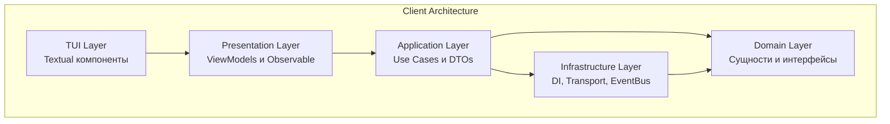
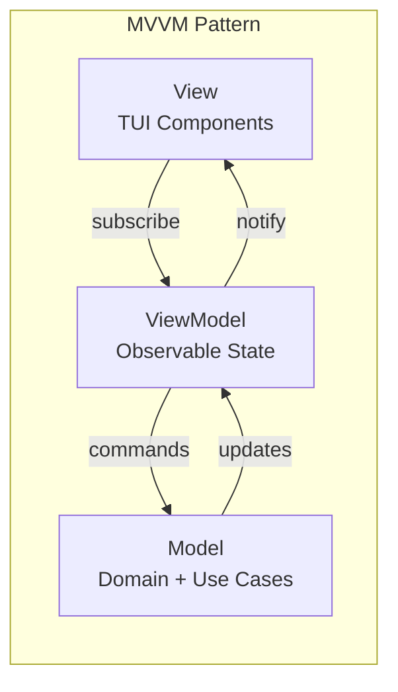
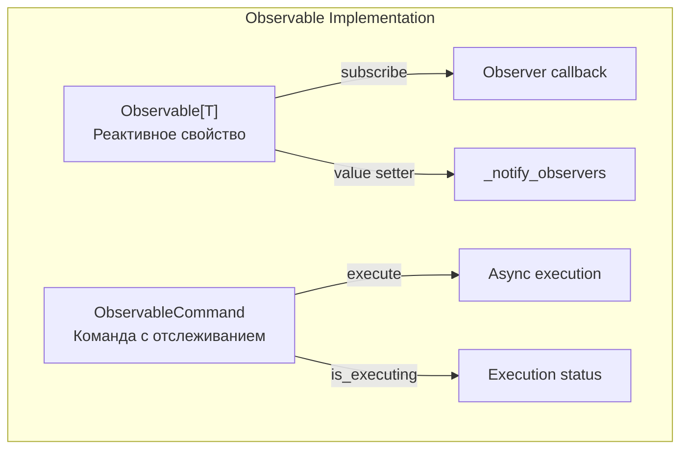
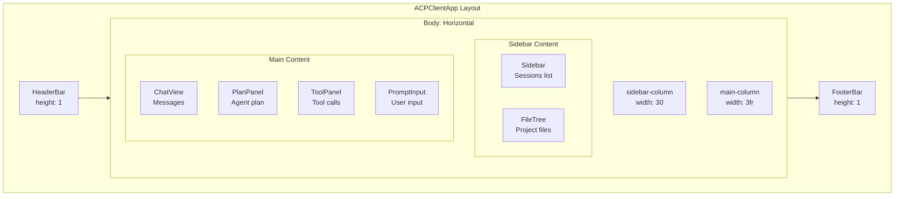
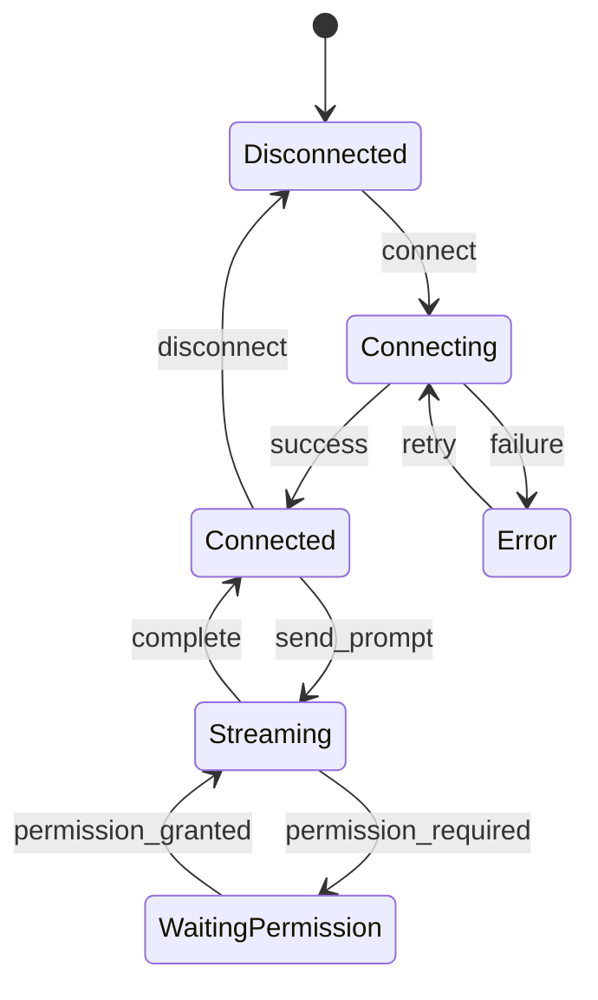
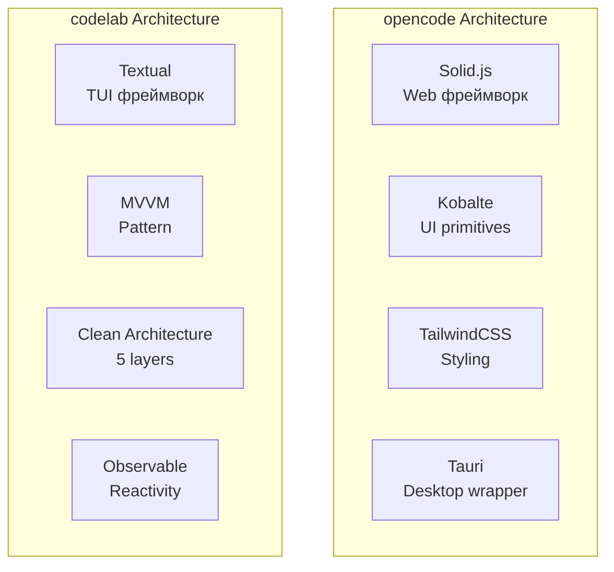

# Анализ архитектуры codelab TUI

Дата анализа: 2026-04-24

## 1. Обзор архитектуры codelab TUI

### 1.1 Технологический стек

| Технология | Назначение |
|------------|------------|
| **Textual** | TUI фреймворк на базе Rich |
| **MVVM** | Архитектурный паттерн для UI |
| **Clean Architecture** | 5-слойная архитектура |
| **Observable Pattern** | Реактивные обновления UI |
| **asyncio** | Асинхронное взаимодействие |
| **structlog** | Структурированное логирование |

### 1.2 Структура слоёв Clean Architecture

### 1.3 Архитектура MVVM

## 2. Каталог существующих компонентов

### 2.1 TUI компоненты

| Компонент | Файл | Назначение | ViewModel |
|-----------|------|------------|-----------|
| **ACPClientApp** | [`app.py`](codelab/src/codelab/client/tui/app.py) | Главное Textual приложение | UIViewModel, SessionViewModel, ChatViewModel, etc. |
| **ChatView** | [`chat_view.py`](codelab/src/codelab/client/tui/components/chat_view.py) | История сообщений чата | ChatViewModel |
| **ChatViewPermissionManager** | [`chat_view_permission_manager.py`](codelab/src/codelab/client/tui/components/chat_view_permission_manager.py) | Менеджер разрешений в чате | PermissionViewModel |
| **Sidebar** | [`sidebar.py`](codelab/src/codelab/client/tui/components/sidebar.py) | Панель сессий/файлов | SessionViewModel, UIViewModel |
| **FileTree** | [`file_tree.py`](codelab/src/codelab/client/tui/components/file_tree.py) | Дерево файлов проекта | FileSystemViewModel |
| **FileViewer** | [`file_viewer.py`](codelab/src/codelab/client/tui/components/file_viewer.py) | Просмотр содержимого файла | FileViewerViewModel |
| **PromptInput** | [`prompt_input.py`](codelab/src/codelab/client/tui/components/prompt_input.py) | Поле ввода промпта | ChatViewModel |
| **PlanPanel** | [`plan_panel.py`](codelab/src/codelab/client/tui/components/plan_panel.py) | Панель плана агента | PlanViewModel |
| **ToolPanel** | [`tool_panel.py`](codelab/src/codelab/client/tui/components/tool_panel.py) | Панель tool calls | ChatViewModel |
| **PermissionModal** | [`permission_modal.py`](codelab/src/codelab/client/tui/components/permission_modal.py) | Модальное окно разрешений | PermissionViewModel |
| **InlinePermissionWidget** | [`inline_permission_widget.py`](codelab/src/codelab/client/tui/components/inline_permission_widget.py) | Inline виджет разрешений | PermissionViewModel |
| **TerminalOutput** | [`terminal_output.py`](codelab/src/codelab/client/tui/components/terminal_output.py) | Вывод терминала | TerminalViewModel |
| **TerminalLogModal** | [`terminal_log_modal.py`](codelab/src/codelab/client/tui/components/terminal_log_modal.py) | Модальное окно логов терминала | TerminalLogViewModel |
| **HeaderBar** | [`header.py`](codelab/src/codelab/client/tui/components/header.py) | Верхняя панель | UIViewModel |
| **FooterBar** | [`footer.py`](codelab/src/codelab/client/tui/components/footer.py) | Нижняя панель | UIViewModel |
| **HelpModal** | [`help_modal.py`](codelab/src/codelab/client/tui/components/help_modal.py) | Модальное окно справки | - |

### 2.2 ViewModels (Presentation Layer)

| ViewModel | Файл | Назначение | Observable свойства |
|-----------|------|------------|---------------------|
| **UIViewModel** | [`ui_view_model.py`](codelab/src/codelab/client/presentation/ui_view_model.py) | Глобальное UI состояние | `connection_status`, `sidebar_tab`, `is_loading`, `error_message`, `active_modal` |
| **SessionViewModel** | [`session_view_model.py`](codelab/src/codelab/client/presentation/session_view_model.py) | Управление сессиями | `sessions`, `selected_session_id`, `is_loading_sessions`, `session_count` |
| **ChatViewModel** | [`chat_view_model.py`](codelab/src/codelab/client/presentation/chat_view_model.py) | Чат и prompt-turn | `messages`, `tool_calls`, `is_streaming`, `streaming_text`, `pending_permissions` |
| **PlanViewModel** | [`plan_view_model.py`](codelab/src/codelab/client/presentation/plan_view_model.py) | План агента | `plan_text`, `has_plan`, `plan_entries` |
| **FileSystemViewModel** | [`filesystem_view_model.py`](codelab/src/codelab/client/presentation/filesystem_view_model.py) | Файловая система | `root_path`, `selected_path`, `is_loading` |
| **FileViewerViewModel** | [`file_viewer_view_model.py`](codelab/src/codelab/client/presentation/file_viewer_view_model.py) | Просмотр файлов | `file_path`, `content`, `is_loading` |
| **PermissionViewModel** | [`permission_view_model.py`](codelab/src/codelab/client/presentation/permission_view_model.py) | Разрешения | `permission_type`, `resource`, `message`, `is_visible`, `options` |
| **TerminalViewModel** | [`terminal_view_model.py`](codelab/src/codelab/client/presentation/terminal_view_model.py) | Терминал | `output`, `is_running`, `exit_code` |
| **TerminalLogViewModel** | [`terminal_log_view_model.py`](codelab/src/codelab/client/presentation/terminal_log_view_model.py) | Логи терминала | `logs`, `is_visible` |

### 2.3 Observable Pattern

Ключевые методы:
- [`Observable.subscribe()`](codelab/src/codelab/client/presentation/observable.py:57) — подписка на изменения
- [`Observable.value`](codelab/src/codelab/client/presentation/observable.py:39) — геттер/сеттер значения
- [`ObservableCommand.execute()`](codelab/src/codelab/client/presentation/observable.py:99) — выполнение команды

## 3. Экраны и навигация

### 3.1 Структура главного экрана

### 3.2 Система навигации

| Модуль | Файл | Назначение |
|--------|------|------------|
| **NavigationManager** | [`manager.py`](codelab/src/codelab/client/tui/navigation/manager.py) | Централизованное управление навигацией |
| **OperationQueue** | [`queue.py`](codelab/src/codelab/client/tui/navigation/queue.py) | Очередь навигационных операций |
| **NavigationOperation** | [`operations.py`](codelab/src/codelab/client/tui/navigation/operations.py) | Типы навигационных операций |
| **ModalWindowTracker** | [`tracker.py`](codelab/src/codelab/client/tui/navigation/tracker.py) | Отслеживание модальных окон |

### 3.3 Модальные окна

| Модальное окно | Триггер | Назначение |
|----------------|---------|------------|
| **PermissionModal** | `session/request_permission` | Запрос разрешения от агента |
| **HelpModal** | `Ctrl+H` | Справка и горячие клавиши |
| **TerminalLogModal** | `Ctrl+T` | Логи выполнения команд терминала |
| **FileViewerModal** | Клик по файлу | Просмотр содержимого файла |

### 3.4 Горячие клавиши

| Клавиша | Действие |
|---------|----------|
| `Ctrl+Q` | Выход |
| `Ctrl+N` | Новая сессия |
| `Ctrl+R` | Повторить промпт |
| `Ctrl+B` | Фокус на sidebar |
| `Ctrl+J/K` | Следующая/предыдущая сессия |
| `Ctrl+L` | Очистить чат |
| `Ctrl+H` | Справка |
| `Ctrl+T` | Логи терминала |
| `Ctrl+Enter` | Отправить промпт |
| `Tab` | Переключение фокуса |
| `Ctrl+C` | Отмена промпта |

## 4. Стили и темизация

### 4.1 TCSS структура

Основной файл стилей: [`app.tcss`](codelab/src/codelab/client/tui/styles/app.tcss)

| Селектор | Назначение | Ключевые свойства |
|----------|------------|-------------------|
| `Screen` | Главный экран | `background: #f3f4f7`, `color: #141a22` |
| `#header` | Верхняя панель | `height: 1`, `background: #dfe6f5` |
| `#sidebar` | Боковая панель | `background: #ebeff7`, `border: round #6d7f9a` |
| `#chat-view` | Область чата | `background: #ffffff`, `border: round #6d7f9a` |
| `#prompt-textarea` | Поле ввода | `background: #ffffff`, `:focus` меняет border на `#1d4ed8` |
| `#plan-panel` | Панель плана | `height: 8`, `background: #f8fafc` |
| `#permission-modal` | Модальное окно | `width: 80`, `background: #f6f9ff` |

### 4.2 Цветовая палитра

| Цвет | Hex | Использование |
|------|-----|---------------|
| Фон экрана | `#f3f4f7` | Основной фон |
| Текст | `#141a22` | Основной текст |
| Header/Footer | `#dfe6f5` | Фон панелей |
| Sidebar | `#ebeff7` | Фон sidebar |
| Белый | `#ffffff` | Контентные области |
| Accent | `#1d4ed8` | Focus border |
| Border | `#6d7f9a` | Границы элементов |

### 4.3 Текущие ограничения стилей

- Отсутствует поддержка тёмной темы
- Нет системы CSS-переменных для тем
- Ограниченные анимации (только базовые Textual)
- Нет responsive breakpoints

## 5. Application Layer

### 5.1 Use Cases

| Use Case | Файл | Назначение |
|----------|------|------------|
| **InitializeUseCase** | [`use_cases.py`](codelab/src/codelab/client/application/use_cases.py:47) | Инициализация соединения |
| **CreateSessionUseCase** | [`use_cases.py`](codelab/src/codelab/client/application/use_cases.py) | Создание новой сессии |
| **LoadSessionUseCase** | [`use_cases.py`](codelab/src/codelab/client/application/use_cases.py) | Загрузка существующей сессии |
| **ListSessionsUseCase** | [`use_cases.py`](codelab/src/codelab/client/application/use_cases.py) | Получение списка сессий |
| **SendPromptUseCase** | [`use_cases.py`](codelab/src/codelab/client/application/use_cases.py) | Отправка промпта |

### 5.2 DTOs

| DTO | Назначение |
|-----|------------|
| `CreateSessionRequest/Response` | Создание сессии |
| `LoadSessionRequest/Response` | Загрузка сессии |
| `SendPromptRequest/Response` | Отправка промпта |
| `InitializeResponse` | Результат инициализации |

### 5.3 State Machine и Coordinator

## 6. Gap Analysis: сравнение с opencode

### 6.1 Реализованные компоненты

| opencode компонент | codelab аналог | Статус |
|--------------------|----------------|--------|
| SessionTurn | ChatView | ✅ Реализован |
| DockPrompt | PromptInput | ✅ Реализован |
| Sidebar | Sidebar | ✅ Реализован |
| FileTree | FileTree | ✅ Реализован |
| PermissionDock | PermissionModal + InlinePermissionWidget | ✅ Реализован |
| Header | HeaderBar | ✅ Реализован |
| Footer | FooterBar | ✅ Реализован |
| Dialog | HelpModal, PermissionModal | ✅ Реализован |

### 6.2 Отсутствующие компоненты

| opencode компонент | Назначение | Приоритет |
|--------------------|------------|-----------|
| **Markdown** | Рендеринг Markdown в сообщениях | 🔴 Высокий |
| **DiffChanges** | Отображение diff изменений | 🔴 Высокий |
| **Spinner** | Индикатор загрузки | 🟡 Средний |
| **Progress** | Прогресс-бар | 🟡 Средний |
| **Typewriter** | Анимация печати | 🟢 Низкий |
| **TextShimmer** | Мерцающий текст loading | 🟢 Низкий |
| **Avatar** | Аватар пользователя | 🟢 Низкий |
| **Toast** | Всплывающие уведомления | 🟡 Средний |
| **Tooltip** | Подсказки | 🟢 Низкий |
| **Tabs** | Вкладки | 🟡 Средний |
| **ImagePreview** | Превью изображений | 🟡 Средний |
| **BasicTool** | Отображение tool call | 🔴 Высокий |
| **ToolStatusTitle** | Статус инструмента | 🟡 Средний |
| **ToolErrorCard** | Карточка ошибки | 🟡 Средний |
| **ResizeHandle** | Изменение размера панелей | 🟢 Низкий |
| **Keybind** | Отображение горячих клавиш | 🟢 Низкий |
| **SessionReview** | Обзор изменений сессии | 🟡 Средний |
| **SessionRetry** | UI для повтора запроса | 🟡 Средний |

### 6.3 Компоненты требующие доработки

| Компонент | Текущее состояние | Требуется |
|-----------|-------------------|-----------|
| **ChatView** | Простой Static текст | Markdown рендеринг, syntax highlighting |
| **ToolPanel** | Базовое отображение | Статусы, ошибки, прогресс |
| **Sidebar** | Только Sessions/Files | Settings tab, collapsible sections |
| **FileTree** | Базовое дерево | Иконки файлов, контекстное меню |
| **Стили** | Только светлая тема | Темная тема, CSS переменные |
| **Animations** | Отсутствуют | Loading states, transitions |

### 6.4 Архитектурные различия

| Аспект | opencode | codelab |
|--------|----------|---------|
| Рендеринг | DOM + Virtual DOM | Terminal cells |
| Стилизация | TailwindCSS | TCSS |
| Реактивность | Solid.js signals | Observable pattern |
| Компоненты | Function components | Class-based widgets |
| Routing | SolidJS Router | NavigationManager |
| State | Context + Stores | ViewModels |

### 6.5 Рекомендации по миграции

1. **Высокий приоритет:**
   - Реализовать Markdown рендеринг в ChatView
   - Добавить компонент DiffChanges для отображения изменений файлов
   - Улучшить отображение tool calls с статусами и ошибками

2. **Средний приоритет:**
   - Добавить Toast уведомления
   - Реализовать Tabs для sidebar
   - Добавить ImagePreview для изображений в чате
   - Улучшить SessionRetry UX

3. **Низкий приоритет:**
   - Анимации (Typewriter, TextShimmer)
   - Косметические улучшения (Avatar, Keybind display)
   - Resize handles

## 7. Выводы

### 7.1 Сильные стороны codelab TUI

1. **Чистая архитектура** — 5-слойная Clean Architecture с четким разделением ответственности
2. **MVVM паттерн** — ViewModels изолируют UI от бизнес-логики
3. **Observable реактивность** — Простая и эффективная система подписок
4. **Навигация** — Централизованный NavigationManager с очередью операций
5. **Покрытие тестами** — ~1100 тестов клиента

### 7.2 Области для улучшения

1. **Визуальная составляющая** — Нужен Markdown, syntax highlighting, diff view
2. **UX полировка** — Loading states, анимации, Toast уведомления
3. **Темизация** — Отсутствует тёмная тема и система CSS переменных
4. **Tool UX** — Требуется улучшить отображение tool calls

### 7.3 Рекомендуемый порядок работ

1. Markdown компонент для ChatView
2. DiffChanges компонент
3. Улучшенный ToolPanel с статусами
4. Toast уведомления
5. Тёмная тема
