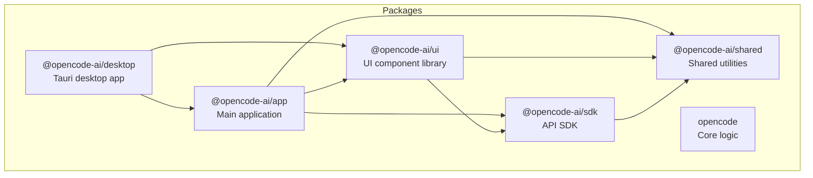
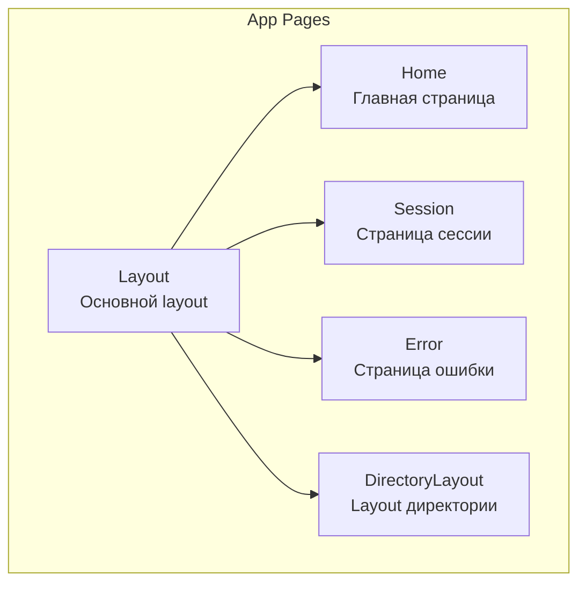
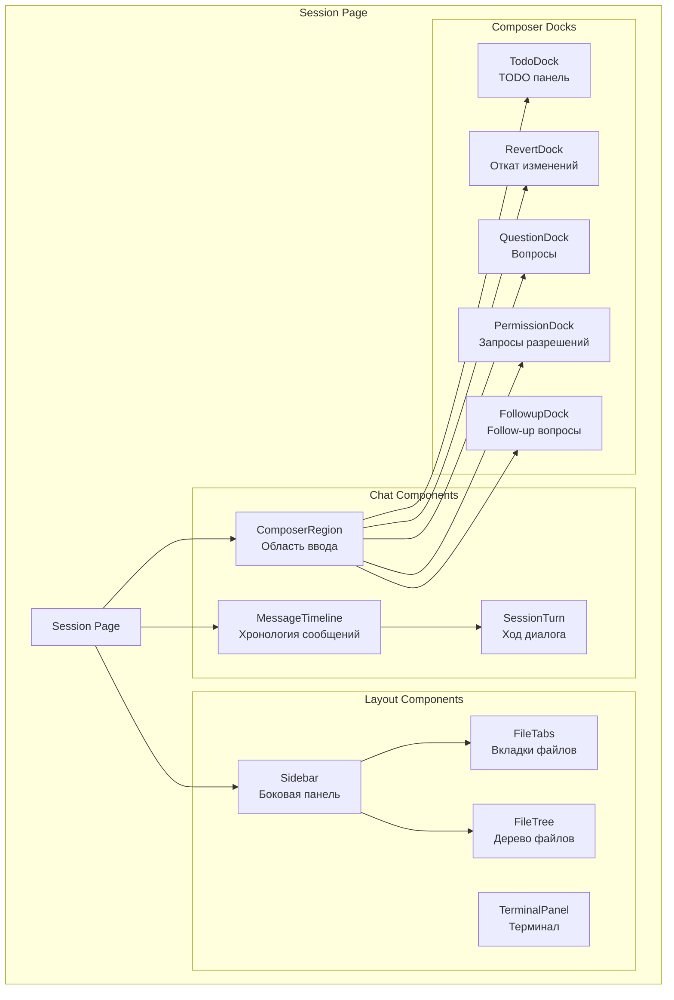
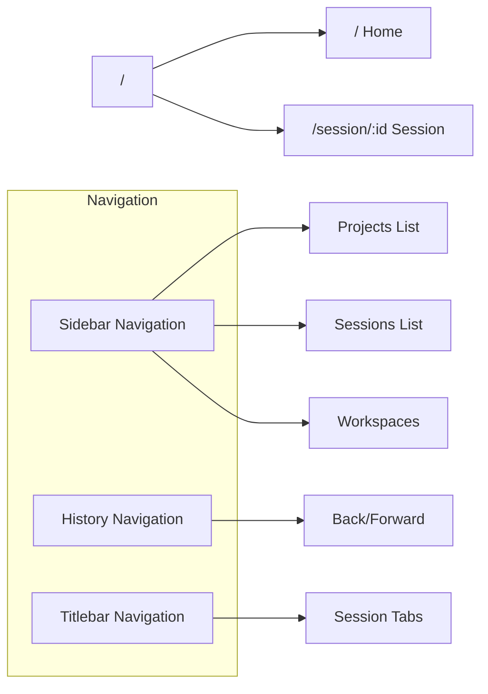
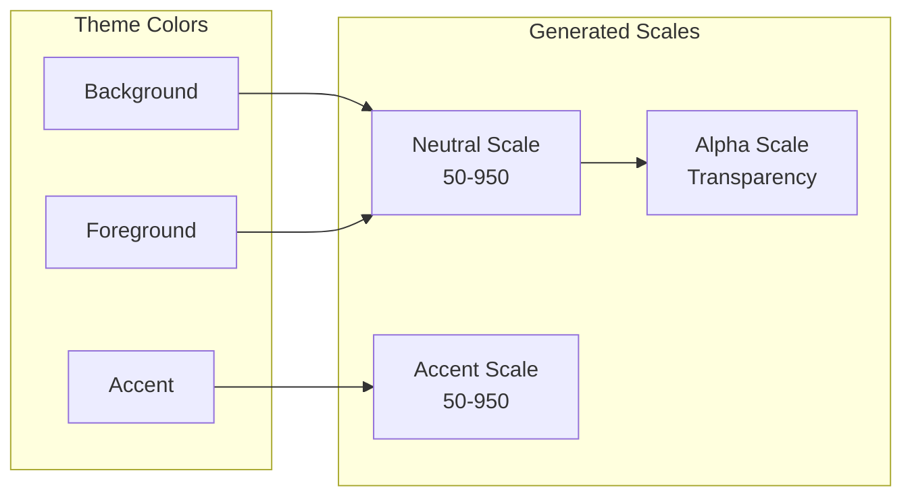
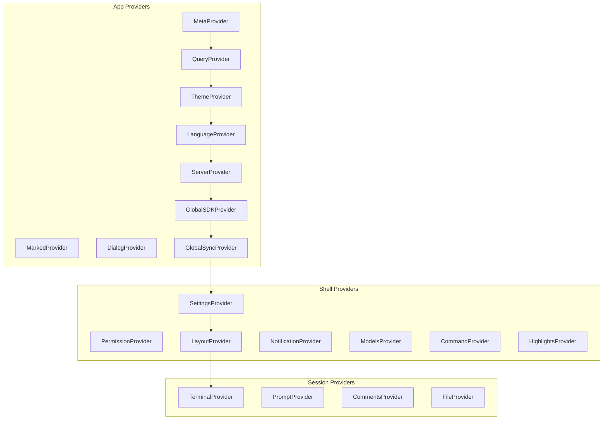

# Анализ UI компонентов OpenCode Desktop

Дата анализа: 2026-04-24

## 1. Обзор архитектуры UI OpenCode

### 1.1 Технологический стек

| Технология | Версия | Назначение |
|------------|--------|------------|
| **Solid.js** | 1.9.x | Реактивный UI фреймворк (альтернатива React) |
| **Kobalte** | - | Headless UI примитивы для Solid.js |
| **TailwindCSS** | 4.x | Utility-first CSS фреймворк |
| **Vite** | - | Сборщик и dev-сервер |
| **Tauri** | 2.x | Desktop обертка (Rust backend) |
| **Shiki** | - | Подсветка синтаксиса кода |
| **Marked** | - | Рендеринг Markdown |
| **Effect** | - | Функциональные эффекты |
| **TanStack Query** | 5.x | Управление серверным состоянием |

### 1.2 Структура монорепозитория



### 1.3 Зависимости между пакетами

| Пакет | Зависит от |
|-------|------------|
| `@opencode-ai/desktop` | `@opencode-ai/app`, `@opencode-ai/ui`, Tauri plugins |
| `@opencode-ai/app` | `@opencode-ai/ui`, `@opencode-ai/sdk`, `@opencode-ai/shared` |
| `@opencode-ai/ui` | `@opencode-ai/sdk`, `@opencode-ai/shared`, Kobalte, Shiki |
| `@opencode-ai/sdk` | `@opencode-ai/shared`, Effect |

## 2. Каталог UI компонентов

### 2.1 Базовые компоненты формы

| Компонент | Файл | Назначение | Props |
|-----------|------|------------|-------|
| **Button** | [`button.tsx`](opencode/packages/ui/src/components/button.tsx) | Кнопка действия | `size: small/normal/large`, `variant: primary/secondary/ghost`, `icon` |
| **IconButton** | [`icon-button.tsx`](opencode/packages/ui/src/components/icon-button.tsx) | Кнопка-иконка | `icon`, `size`, `variant` |
| **Checkbox** | [`checkbox.tsx`](opencode/packages/ui/src/components/checkbox.tsx) | Чекбокс | `checked`, `onChange`, `disabled` |
| **Switch** | [`switch.tsx`](opencode/packages/ui/src/components/switch.tsx) | Переключатель | `checked`, `onChange` |
| **RadioGroup** | [`radio-group.tsx`](opencode/packages/ui/src/components/radio-group.tsx) | Группа радио-кнопок | `value`, `options`, `onChange` |
| **Select** | [`select.tsx`](opencode/packages/ui/src/components/select.tsx) | Выпадающий список | `value`, `options`, `onChange` |
| **TextField** | [`text-field.tsx`](opencode/packages/ui/src/components/text-field.tsx) | Текстовое поле | `value`, `onChange`, `placeholder` |
| **InlineInput** | [`inline-input.tsx`](opencode/packages/ui/src/components/inline-input.tsx) | Inline редактирование | `value`, `onSubmit` |

### 2.2 Layout компоненты

| Компонент | Файл | Назначение |
|-----------|------|------------|
| **Card** | [`card.tsx`](opencode/packages/ui/src/components/card.tsx) | Контейнер-карточка |
| **Accordion** | [`accordion.tsx`](opencode/packages/ui/src/components/accordion.tsx) | Раскрывающиеся секции |
| **Collapsible** | [`collapsible.tsx`](opencode/packages/ui/src/components/collapsible.tsx) | Сворачиваемый контент |
| **Tabs** | [`tabs.tsx`](opencode/packages/ui/src/components/tabs.tsx) | Вкладки |
| **List** | [`list.tsx`](opencode/packages/ui/src/components/list.tsx) | Виртуализированный список |
| **ScrollView** | [`scroll-view.tsx`](opencode/packages/ui/src/components/scroll-view.tsx) | Скроллируемый контейнер |
| **ResizeHandle** | [`resize-handle.tsx`](opencode/packages/ui/src/components/resize-handle.tsx) | Ручка изменения размера |
| **StickyAccordionHeader** | [`sticky-accordion-header.tsx`](opencode/packages/ui/src/components/sticky-accordion-header.tsx) | Прилипающий заголовок |

### 2.3 Overlay компоненты

| Компонент | Файл | Назначение |
|-----------|------|------------|
| **Dialog** | [`dialog.tsx`](opencode/packages/ui/src/components/dialog.tsx) | Модальное окно |
| **Popover** | [`popover.tsx`](opencode/packages/ui/src/components/popover.tsx) | Всплывающий контент |
| **DropdownMenu** | [`dropdown-menu.tsx`](opencode/packages/ui/src/components/dropdown-menu.tsx) | Выпадающее меню |
| **ContextMenu** | [`context-menu.tsx`](opencode/packages/ui/src/components/context-menu.tsx) | Контекстное меню |
| **Tooltip** | [`tooltip.tsx`](opencode/packages/ui/src/components/tooltip.tsx) | Подсказка |
| **HoverCard** | [`hover-card.tsx`](opencode/packages/ui/src/components/hover-card.tsx) | Карточка при наведении |
| **Toast** | [`toast.tsx`](opencode/packages/ui/src/components/toast.tsx) | Уведомления |

### 2.4 Session компоненты (ключевые для чата)

| Компонент | Файл | Назначение |
|-----------|------|------------|
| **SessionTurn** | [`session-turn.tsx`](opencode/packages/ui/src/components/session-turn.tsx:1) | Отображение хода диалога (user/assistant) |
| **SessionReview** | [`session-review.tsx`](opencode/packages/ui/src/components/session-review.tsx) | Обзор изменений сессии |
| **SessionRetry** | [`session-retry.tsx`](opencode/packages/ui/src/components/session-retry.tsx) | UI для повтора запроса |
| **MessagePart** | [`message-part.tsx`](opencode/packages/ui/src/components/message-part.tsx) | Часть сообщения (text, code, tool) |
| **MessageNav** | [`message-nav.tsx`](opencode/packages/ui/src/components/message-nav.tsx) | Навигация по сообщениям |
| **DockPrompt** | [`dock-prompt.tsx`](opencode/packages/ui/src/components/dock-prompt.tsx) | Dock для ввода промпта |
| **DockSurface** | [`dock-surface.tsx`](opencode/packages/ui/src/components/dock-surface.tsx) | Поверхность dock панели |

### 2.5 Visualization компоненты

| Компонент | Файл | Назначение |
|-----------|------|------------|
| **DiffChanges** | [`diff-changes.tsx`](opencode/packages/ui/src/components/diff-changes.tsx) | Отображение diff |
| **Markdown** | [`markdown.tsx`](opencode/packages/ui/src/components/markdown.tsx) | Рендеринг Markdown |
| **Progress** | [`progress.tsx`](opencode/packages/ui/src/components/progress.tsx) | Прогресс-бар |
| **ProgressCircle** | [`progress-circle.tsx`](opencode/packages/ui/src/components/progress-circle.tsx) | Круговой прогресс |
| **Spinner** | [`spinner.tsx`](opencode/packages/ui/src/components/spinner.tsx) | Индикатор загрузки |
| **ImagePreview** | [`image-preview.tsx`](opencode/packages/ui/src/components/image-preview.tsx) | Превью изображения |

### 2.6 Icon компоненты

| Компонент | Файл | Назначение |
|-----------|------|------------|
| **Icon** | [`icon.tsx`](opencode/packages/ui/src/components/icon.tsx) | Базовая иконка |
| **FileIcon** | [`file-icon.tsx`](opencode/packages/ui/src/components/file-icon.tsx) | Иконка файла по типу |
| **ProviderIcon** | [`provider-icon.tsx`](opencode/packages/ui/src/components/provider-icon.tsx) | Иконка провайдера LLM |
| **AppIcon** | [`app-icon.tsx`](opencode/packages/ui/src/components/app-icon.tsx) | Иконка приложения |
| **Logo** | [`logo.tsx`](opencode/packages/ui/src/components/logo.tsx) | Логотип OpenCode |
| **Favicon** | [`favicon.tsx`](opencode/packages/ui/src/components/favicon.tsx) | Favicon |

### 2.7 Animation компоненты

| Компонент | Файл | Назначение |
|-----------|------|------------|
| **TextShimmer** | [`text-shimmer.tsx`](opencode/packages/ui/src/components/text-shimmer.tsx) | Мерцающий текст (loading) |
| **TextReveal** | [`text-reveal.tsx`](opencode/packages/ui/src/components/text-reveal.tsx) | Появление текста |
| **TextStrikethrough** | [`text-strikethrough.tsx`](opencode/packages/ui/src/components/text-strikethrough.tsx) | Зачеркнутый текст |
| **Typewriter** | [`typewriter.tsx`](opencode/packages/ui/src/components/typewriter.tsx) | Эффект печатной машинки |
| **AnimatedNumber** | [`animated-number.tsx`](opencode/packages/ui/src/components/animated-number.tsx) | Анимированное число |
| **MotionSpring** | [`motion-spring.tsx`](opencode/packages/ui/src/components/motion-spring.tsx) | Spring анимации |

### 2.8 Tool компоненты

| Компонент | Файл | Назначение |
|-----------|------|------------|
| **BasicTool** | [`basic-tool.tsx`](opencode/packages/ui/src/components/basic-tool.tsx) | Базовое отображение инструмента |
| **ToolCountLabel** | [`tool-count-label.tsx`](opencode/packages/ui/src/components/tool-count-label.tsx) | Счетчик инструментов |
| **ToolCountSummary** | [`tool-count-summary.tsx`](opencode/packages/ui/src/components/tool-count-summary.tsx) | Сводка по инструментам |
| **ToolErrorCard** | [`tool-error-card.tsx`](opencode/packages/ui/src/components/tool-error-card.tsx) | Карточка ошибки |
| **ToolStatusTitle** | [`tool-status-title.tsx`](opencode/packages/ui/src/components/tool-status-title.tsx) | Заголовок статуса |

### 2.9 Other компоненты

| Компонент | Файл | Назначение |
|-----------|------|------------|
| **Avatar** | [`avatar.tsx`](opencode/packages/ui/src/components/avatar.tsx) | Аватар пользователя |
| **Tag** | [`tag.tsx`](opencode/packages/ui/src/components/tag.tsx) | Тег/метка |
| **Keybind** | [`keybind.tsx`](opencode/packages/ui/src/components/keybind.tsx) | Отображение горячих клавиш |
| **Font** | [`font.tsx`](opencode/packages/ui/src/components/font.tsx) | Управление шрифтами |
| **LineComment** | [`line-comment.tsx`](opencode/packages/ui/src/components/line-comment.tsx) | Комментарии к строкам кода |

## 3. Экраны и навигация

### 3.1 Структура страниц приложения



### 3.2 Компоненты страницы Session



### 3.3 Диалоговые окна приложения

| Диалог | Файл | Назначение |
|--------|------|------------|
| **DialogConnectProvider** | [`dialog-connect-provider.tsx`](opencode/packages/app/src/components/dialog-connect-provider.tsx) | Подключение провайдера |
| **DialogCustomProvider** | [`dialog-custom-provider.tsx`](opencode/packages/app/src/components/dialog-custom-provider.tsx) | Кастомный провайдер |
| **DialogEditProject** | [`dialog-edit-project.tsx`](opencode/packages/app/src/components/dialog-edit-project.tsx) | Редактирование проекта |
| **DialogFork** | [`dialog-fork.tsx`](opencode/packages/app/src/components/dialog-fork.tsx) | Fork сессии |
| **DialogManageModels** | [`dialog-manage-models.tsx`](opencode/packages/app/src/components/dialog-manage-models.tsx) | Управление моделями |
| **DialogReleaseNotes** | [`dialog-release-notes.tsx`](opencode/packages/app/src/components/dialog-release-notes.tsx) | Release notes |
| **DialogSelectDirectory** | [`dialog-select-directory.tsx`](opencode/packages/app/src/components/dialog-select-directory.tsx) | Выбор директории |
| **DialogSelectFile** | [`dialog-select-file.tsx`](opencode/packages/app/src/components/dialog-select-file.tsx) | Выбор файла |
| **DialogSelectMcp** | [`dialog-select-mcp.tsx`](opencode/packages/app/src/components/dialog-select-mcp.tsx) | Выбор MCP сервера |
| **DialogSelectModel** | [`dialog-select-model.tsx`](opencode/packages/app/src/components/dialog-select-model.tsx) | Выбор модели |
| **DialogSelectProvider** | [`dialog-select-provider.tsx`](opencode/packages/app/src/components/dialog-select-provider.tsx) | Выбор провайдера |
| **DialogSelectServer** | [`dialog-select-server.tsx`](opencode/packages/app/src/components/dialog-select-server.tsx) | Выбор сервера |
| **DialogSettings** | [`dialog-settings.tsx`](opencode/packages/app/src/components/dialog-settings.tsx) | Настройки |

### 3.4 Навигация и роутинг



## 4. Стили и темизация

### 4.1 Система стилей

OpenCode использует **TailwindCSS v4** с CSS Variables для темизации.

Структура стилей:
```
opencode/packages/ui/src/styles/
├── index.css          # Главный файл стилей
└── tailwind/
    └── index.css      # Tailwind конфигурация
```

Каждый компонент имеет свой CSS файл:
```
opencode/packages/ui/src/components/
├── button.css
├── button.tsx
├── card.css
├── card.tsx
└── ...
```

### 4.2 Система тем

OpenCode поддерживает **30+ встроенных тем**:

| Тема | Описание |
|------|----------|
| opencode | Дефолтная тема |
| catppuccin | Catppuccin Mocha |
| catppuccin-frappe | Catppuccin Frappe |
| catppuccin-macchiato | Catppuccin Macchiato |
| dracula | Dracula |
| nord | Nord |
| tokyonight | Tokyo Night |
| gruvbox | Gruvbox |
| monokai | Monokai |
| one-dark | One Dark |
| github | GitHub |
| solarized | Solarized |
| amoled | AMOLED (pure black) |
| material | Material |
| и другие... | |

### 4.3 Структура темы

Темы определяются в JSON формате:

```typescript
interface DesktopTheme {
  name: string
  appearance: "light" | "dark"
  seed: ThemeSeedColors
  palette?: Partial<ThemePaletteColors>
}

interface ThemeSeedColors {
  accent: HexColor
  background: HexColor
  foreground: HexColor
}
```

### 4.4 CSS Variables

Тема применяется через CSS переменные:

```css
:root {
  --color-background: oklch(...);
  --color-foreground: oklch(...);
  --color-accent: oklch(...);
  --color-neutral-50: oklch(...);
  --color-neutral-100: oklch(...);
  /* ... */
}
```

### 4.5 Цветовая схема



## 5. Интернационализация (i18n)

### 5.1 Поддерживаемые языки

OpenCode поддерживает **16+ языков**:

| Код | Язык |
|-----|------|
| en | English |
| ru | Русский |
| de | Deutsch |
| fr | Français |
| es | Español |
| ja | 日本語 |
| ko | 한국어 |
| zh | 简体中文 |
| zht | 繁體中文 |
| ar | العربية |
| br | Português (Brasil) |
| bs | Bosanski |
| da | Dansk |
| no | Norsk |
| pl | Polski |
| th | ไทย |
| tr | Türkçe |

### 5.2 Структура i18n

```
opencode/packages/desktop/src/i18n/
├── index.ts           # Инициализация i18n
├── en.ts              # English (base)
├── ru.ts              # Russian
├── de.ts              # German
└── ...
```

### 5.3 Формат переводов

```typescript
// en.ts
export const dict = {
  "desktop.menu.checkForUpdates": "Check for Updates...",
  "desktop.menu.installCli": "Install CLI...",
  "desktop.dialog.chooseFolder": "Choose a folder",
  // ...
}
```

### 5.4 Использование

```tsx
import { useLanguage } from "@/context/language"

function MyComponent() {
  const { t } = useLanguage()
  return <button>{t("desktop.menu.checkForUpdates")}</button>
}
```

## 6. Context Providers

### 6.1 Иерархия провайдеров



### 6.2 Ключевые контексты

| Context | Назначение |
|---------|------------|
| **ServerContext** | Подключение к серверу OpenCode |
| **GlobalSDKContext** | SDK для API вызовов |
| **GlobalSyncContext** | Синхронизация состояния |
| **LayoutContext** | Layout и навигация |
| **SettingsContext** | Пользовательские настройки |
| **PermissionContext** | Управление разрешениями |
| **TerminalContext** | Терминалы сессии |
| **PromptContext** | Ввод промптов |
| **CommandContext** | Command palette |
| **ThemeContext** | Темизация |
| **LanguageContext** | i18n |

## 7. Storybook компоненты

OpenCode использует Storybook для документации и тестирования компонентов.

### 7.1 Структура

```
opencode/packages/storybook/
├── .storybook/
│   ├── main.ts
│   ├── manager.ts
│   ├── preview.tsx
│   └── mocks/
└── package.json
```

### 7.2 Stories

Каждый UI компонент имеет `.stories.tsx` файл:

```
opencode/packages/ui/src/components/
├── button.stories.tsx
├── card.stories.tsx
├── dialog.stories.tsx
├── session-turn.stories.tsx
└── ...
```

## 8. Рекомендации по миграции в Codelab TUI

### 8.1 Mapping компонентов

| OpenCode (Solid.js) | Codelab TUI (Textual) |
|---------------------|----------------------|
| Button | `textual.widgets.Button` |
| Checkbox | `textual.widgets.Checkbox` |
| Switch | `textual.widgets.Switch` |
| TextField | `textual.widgets.Input` |
| Select | `textual.widgets.Select` |
| Dialog | `textual.screen.ModalScreen` |
| Tabs | `textual.widgets.TabbedContent` |
| List | `textual.widgets.ListView` |
| Progress | `textual.widgets.ProgressBar` |
| Markdown | `textual.widgets.Markdown` |
| Tree (FileTree) | `textual.widgets.Tree` |

### 8.2 Ключевые компоненты для реализации

1. **SessionTurn** - основной компонент для отображения диалога
2. **MessagePart** - части сообщения (text, code, tool results)
3. **DiffChanges** - отображение изменений в коде
4. **FileTree** - дерево файлов проекта
5. **PromptInput** - ввод промптов с attachments
6. **TerminalPanel** - встроенный терминал
7. **PermissionDock** - запросы разрешений

### 8.3 Архитектурные паттерны для адаптации

1. **Reactive State** - Solid.js Signals → Textual Reactive
2. **Context Providers** - Solid.js Context → Textual App.compose()
3. **CSS-in-JS** - TailwindCSS → Textual CSS (TCSS)
4. **Virtual Lists** - virtua → Textual ListView с виртуализацией
5. **Themes** - CSS Variables → Textual Theme system

## 9. Заключение

OpenCode Desktop использует современный стек на базе Solid.js с компонентным подходом. Ключевые особенности:

- **~60+ UI компонентов** с четким разделением ответственности
- **Headless UI** через Kobalte для максимальной кастомизации
- **Reactive state** через Solid.js Signals
- **30+ встроенных тем** с поддержкой кастомных
- **16+ языков** локализации
- **Storybook** для документации компонентов

Для миграции в Codelab TUI необходимо:
1. Адаптировать компонентную структуру под Textual виджеты
2. Перенести логику темизации в Textual CSS
3. Реализовать ключевые компоненты чата (SessionTurn, MessagePart)
4. Адаптировать систему контекстов под архитектуру Textual App
