# План полной миграции UI из OpenCode в Codelab TUI

**Дата создания:** 2026-04-24  
**Версия:** 1.0

## 1. Цель проекта

### 1.1 Главная цель

**Полное воссоздание UI OpenCode Desktop в Codelab TUI** — перенос всех layouts, features и UX-паттернов из Solid.js/Tauri приложения в Python Textual TUI.

### 1.2 Ключевые требования

- 100% покрытие функциональности UI OpenCode
- Сохранение UX-паттернов и пользовательского опыта
- Адаптация под терминальное окружение без потери функциональности
- Поддержка тёмной и светлой темы
- Полная система горячих клавиш
- Интернационализация (i18n)

### 1.3 Метрики успеха

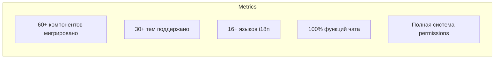

## 2. Полный каталог UI-элементов для миграции

### 2.1 Базовые компоненты форм (Forms)

| # | OpenCode компонент | Исходный файл | Назначение | Textual реализация | Codelab файл | Сложность | Зависимости |
|---|-------------------|---------------|------------|-------------------|--------------|-----------|-------------|
| 1 | **Button** | `ui/src/components/button.tsx` | Кнопка действия | `textual.widgets.Button` + custom styling | `tui/components/button.py` | S | TCSS темы |
| 2 | **IconButton** | `ui/src/components/icon-button.tsx` | Кнопка-иконка | Custom Widget с emoji/символами | `tui/components/icon_button.py` | S | Icon |
| 3 | **Checkbox** | `ui/src/components/checkbox.tsx` | Чекбокс | `textual.widgets.Checkbox` | - встроен | S | - |
| 4 | **Switch** | `ui/src/components/switch.tsx` | Переключатель | `textual.widgets.Switch` | - встроен | S | - |
| 5 | **RadioGroup** | `ui/src/components/radio-group.tsx` | Группа радио | `textual.widgets.RadioSet` | - встроен | S | - |
| 6 | **Select** | `ui/src/components/select.tsx` | Выпадающий список | `textual.widgets.Select` | - встроен | S | - |
| 7 | **TextField** | `ui/src/components/text-field.tsx` | Текстовое поле | `textual.widgets.Input` | - встроен | S | - |
| 8 | **InlineInput** | `ui/src/components/inline-input.tsx` | Inline редактирование | Custom Widget с Input | `tui/components/inline_input.py` | M | TextField |

### 2.2 Layout компоненты

| # | OpenCode компонент | Исходный файл | Назначение | Textual реализация | Codelab файл | Сложность | Зависимости |
|---|-------------------|---------------|------------|-------------------|--------------|-----------|-------------|
| 9 | **Card** | `ui/src/components/card.tsx` | Контейнер-карточка | Custom Container + border | `tui/components/card.py` | S | TCSS |
| 10 | **Accordion** | `ui/src/components/accordion.tsx` | Раскрывающиеся секции | `textual.widgets.Collapsible` группа | `tui/components/accordion.py` | M | Collapsible |
| 11 | **Collapsible** | `ui/src/components/collapsible.tsx` | Сворачиваемый контент | `textual.widgets.Collapsible` | - встроен | S | - |
| 12 | **Tabs** | `ui/src/components/tabs.tsx` | Вкладки | `textual.widgets.TabbedContent` | `tui/components/tabs.py` | M | - |
| 13 | **List** | `ui/src/components/list.tsx` | Виртуализированный список | `textual.widgets.ListView` | - встроен | S | - |
| 14 | **ScrollView** | `ui/src/components/scroll-view.tsx` | Скроллируемый контейнер | `textual.widgets.ScrollableContainer` | - встроен | S | - |
| 15 | **ResizeHandle** | `ui/src/components/resize-handle.tsx` | Ручка изменения размера | Custom Widget с mouse events | `tui/components/resize_handle.py` | L | Mouse tracking |
| 16 | **StickyAccordionHeader** | `ui/src/components/sticky-accordion-header.tsx` | Прилипающий заголовок | Custom Static с position | `tui/components/sticky_header.py` | M | Accordion |

### 2.3 Overlay компоненты

| # | OpenCode компонент | Исходный файл | Назначение | Textual реализация | Codelab файл | Сложность | Зависимости |
|---|-------------------|---------------|------------|-------------------|--------------|-----------|-------------|
| 17 | **Dialog** | `ui/src/components/dialog.tsx` | Модальное окно | `textual.screen.ModalScreen` | `tui/components/dialog.py` | M | Navigation |
| 18 | **Popover** | `ui/src/components/popover.tsx` | Всплывающий контент | Custom Container + positioning | `tui/components/popover.py` | L | Z-order |
| 19 | **DropdownMenu** | `ui/src/components/dropdown-menu.tsx` | Выпадающее меню | Custom Widget + OptionList | `tui/components/dropdown_menu.py` | M | Popover |
| 20 | **ContextMenu** | `ui/src/components/context-menu.tsx` | Контекстное меню | Custom Widget + mouse right-click | `tui/components/context_menu.py` | L | DropdownMenu |
| 21 | **Tooltip** | `ui/src/components/tooltip.tsx` | Подсказка | `textual.widgets.Tooltip` или Custom | `tui/components/tooltip.py` | S | - |
| 22 | **HoverCard** | `ui/src/components/hover-card.tsx` | Карточка при наведении | Custom Widget + hover detection | `tui/components/hover_card.py` | M | Card, Tooltip |
| 23 | **Toast** | `ui/src/components/toast.tsx` | Уведомления | `textual.widgets.Toast` + queue | `tui/components/toast.py` | M | Animation |

### 2.4 Session компоненты (Core)

| # | OpenCode компонент | Исходный файл | Назначение | Textual реализация | Codelab файл | Сложность | Зависимости |
|---|-------------------|---------------|------------|-------------------|--------------|-----------|-------------|
| 24 | **SessionTurn** | `ui/src/components/session-turn.tsx` | Ход диалога user/assistant | Custom Widget с Markdown | `tui/components/session_turn.py` | XL | MessagePart, Avatar, Markdown |
| 25 | **SessionReview** | `ui/src/components/session-review.tsx` | Обзор изменений сессии | Custom Container с DiffChanges | `tui/components/session_review.py` | L | DiffChanges, Accordion |
| 26 | **SessionRetry** | `ui/src/components/session-retry.tsx` | UI для повтора запроса | Custom Widget с Button | `tui/components/session_retry.py` | M | Button |
| 27 | **MessagePart** | `ui/src/components/message-part.tsx` | Часть сообщения | Custom Widget | `tui/components/message_part.py` | XL | Markdown, Code, Tool |
| 28 | **MessageNav** | `ui/src/components/message-nav.tsx` | Навигация по сообщениям | Custom Widget с Button | `tui/components/message_nav.py` | M | IconButton |
| 29 | **DockPrompt** | `ui/src/components/dock-prompt.tsx` | Dock для ввода промпта | Custom Container | `tui/components/dock_prompt.py` | L | PromptInput, Attachments |
| 30 | **DockSurface** | `ui/src/components/dock-surface.tsx` | Поверхность dock панели | Custom Container | `tui/components/dock_surface.py` | M | TCSS |

### 2.5 Visualization компоненты

| # | OpenCode компонент | Исходный файл | Назначение | Textual реализация | Codelab файл | Сложность | Зависимости |
|---|-------------------|---------------|------------|-------------------|--------------|-----------|-------------|
| 31 | **DiffChanges** | `ui/src/components/diff-changes.tsx` | Отображение diff | Custom Widget с Rich | `tui/components/diff_changes.py` | XL | Syntax highlighting |
| 32 | **Markdown** | `ui/src/components/markdown.tsx` | Рендеринг Markdown | `textual.widgets.Markdown` enhanced | `tui/components/markdown.py` | L | Code blocks |
| 33 | **Progress** | `ui/src/components/progress.tsx` | Прогресс-бар | `textual.widgets.ProgressBar` | - встроен | S | - |
| 34 | **ProgressCircle** | `ui/src/components/progress-circle.tsx` | Круговой прогресс | Custom Widget с Rich | `tui/components/progress_circle.py` | M | Animation |
| 35 | **Spinner** | `ui/src/components/spinner.tsx` | Индикатор загрузки | `textual.widgets.LoadingIndicator` | - встроен | S | - |
| 36 | **ImagePreview** | `ui/src/components/image-preview.tsx` | Превью изображения | ASCII art или Sixel | `tui/components/image_preview.py` | L | Terminal capabilities |

### 2.6 Icon компоненты

| # | OpenCode компонент | Исходный файл | Назначение | Textual реализация | Codelab файл | Сложность | Зависимости |
|---|-------------------|---------------|------------|-------------------|--------------|-----------|-------------|
| 37 | **Icon** | `ui/src/components/icon.tsx` | Базовая иконка | Unicode/Emoji mapping | `tui/components/icon.py` | M | Icon set |
| 38 | **FileIcon** | `ui/src/components/file-icon.tsx` | Иконка файла по типу | Unicode + extension mapping | `tui/components/file_icon.py` | M | Icon |
| 39 | **ProviderIcon** | `ui/src/components/provider-icon.tsx` | Иконка провайдера LLM | Custom symbols | `tui/components/provider_icon.py` | S | Icon |
| 40 | **AppIcon** | `ui/src/components/app-icon.tsx` | Иконка приложения | ASCII art | `tui/components/app_icon.py` | S | - |
| 41 | **Logo** | `ui/src/components/logo.tsx` | Логотип OpenCode | ASCII art | `tui/components/logo.py` | S | - |

### 2.7 Animation компоненты

| # | OpenCode компонент | Исходный файл | Назначение | Textual реализация | Codelab файл | Сложность | Зависимости |
|---|-------------------|---------------|------------|-------------------|--------------|-----------|-------------|
| 42 | **TextShimmer** | `ui/src/components/text-shimmer.tsx` | Мерцающий текст loading | Textual animation | `tui/components/text_shimmer.py` | M | Timer |
| 43 | **TextReveal** | `ui/src/components/text-reveal.tsx` | Появление текста | Textual animation | `tui/components/text_reveal.py` | M | Timer |
| 44 | **TextStrikethrough** | `ui/src/components/text-strikethrough.tsx` | Зачеркнутый текст | Rich markup | `tui/components/text_strikethrough.py` | S | Rich |
| 45 | **Typewriter** | `ui/src/components/typewriter.tsx` | Эффект печатной машинки | Textual animation | `tui/components/typewriter.py` | M | Timer |
| 46 | **AnimatedNumber** | `ui/src/components/animated-number.tsx` | Анимированное число | Textual animation | `tui/components/animated_number.py` | M | Timer |

### 2.8 Tool компоненты

| # | OpenCode компонент | Исходный файл | Назначение | Textual реализация | Codelab файл | Сложность | Зависимости |
|---|-------------------|---------------|------------|-------------------|--------------|-----------|-------------|
| 47 | **BasicTool** | `ui/src/components/basic-tool.tsx` | Базовое отображение tool | Custom Widget | `tui/components/basic_tool.py` | L | Icon, Card |
| 48 | **ToolCountLabel** | `ui/src/components/tool-count-label.tsx` | Счетчик инструментов | Custom Label | `tui/components/tool_count_label.py` | S | - |
| 49 | **ToolCountSummary** | `ui/src/components/tool-count-summary.tsx` | Сводка по инструментам | Custom Widget | `tui/components/tool_count_summary.py` | M | ToolCountLabel |
| 50 | **ToolErrorCard** | `ui/src/components/tool-error-card.tsx` | Карточка ошибки tool | Custom Card | `tui/components/tool_error_card.py` | M | Card |
| 51 | **ToolStatusTitle** | `ui/src/components/tool-status-title.tsx` | Заголовок статуса tool | Custom Static | `tui/components/tool_status_title.py` | S | Icon |

### 2.9 Other компоненты

| # | OpenCode компонент | Исходный файл | Назначение | Textual реализация | Codelab файл | Сложность | Зависимости |
|---|-------------------|---------------|------------|-------------------|--------------|-----------|-------------|
| 52 | **Avatar** | `ui/src/components/avatar.tsx` | Аватар пользователя | Unicode/ASCII | `tui/components/avatar.py` | S | - |
| 53 | **Tag** | `ui/src/components/tag.tsx` | Тег/метка | Custom Label + border | `tui/components/tag.py` | S | TCSS |
| 54 | **Keybind** | `ui/src/components/keybind.tsx` | Отображение горячих клавиш | Custom Static | `tui/components/keybind.py` | S | - |
| 55 | **LineComment** | `ui/src/components/line-comment.tsx` | Комментарии к строкам кода | Custom Widget | `tui/components/line_comment.py` | M | DiffChanges |

### 2.10 App-level компоненты

| # | OpenCode компонент | Исходный файл | Назначение | Textual реализация | Codelab файл | Сложность | Зависимости |
|---|-------------------|---------------|------------|-------------------|--------------|-----------|-------------|
| 56 | **FileTree** | `app/src/components/file-tree.tsx` | Дерево файлов | `textual.widgets.DirectoryTree` enhanced | `tui/components/file_tree.py` | L | FileIcon, ContextMenu |
| 57 | **Terminal** | `app/src/components/terminal.tsx` | Встроенный терминал | Custom Widget + PTY | `tui/components/terminal.py` | XL | PTY integration |
| 58 | **Titlebar** | `app/src/components/titlebar.tsx` | Заголовок окна | Custom Header | `tui/components/header.py` | M | Tabs, History |
| 59 | **StatusPopover** | `app/src/components/status-popover.tsx` | Popover статуса | Popover + metrics | `tui/components/status_popover.py` | M | Popover |
| 60 | **PromptInput** | `app/src/components/prompt-input.tsx` | Ввод промпта | `textual.widgets.TextArea` enhanced | `tui/components/prompt_input.py` | XL | Attachments, SlashPopover |

### 2.11 Dialog компоненты

| # | OpenCode компонент | Исходный файл | Назначение | Textual реализация | Codelab файл | Сложность | Зависимости |
|---|-------------------|---------------|------------|-------------------|--------------|-----------|-------------|
| 61 | **DialogSettings** | `app/src/components/dialog-settings.tsx` | Настройки | ModalScreen + Tabs | `tui/screens/settings_screen.py` | XL | All settings components |
| 62 | **DialogSelectModel** | `app/src/components/dialog-select-model.tsx` | Выбор модели | ModalScreen + List | `tui/screens/select_model_screen.py` | M | ProviderIcon |
| 63 | **DialogSelectProvider** | `app/src/components/dialog-select-provider.tsx` | Выбор провайдера | ModalScreen + List | `tui/screens/select_provider_screen.py` | M | ProviderIcon |
| 64 | **DialogSelectMcp** | `app/src/components/dialog-select-mcp.tsx` | Выбор MCP сервера | ModalScreen + List | `tui/screens/select_mcp_screen.py` | M | - |
| 65 | **DialogSelectFile** | `app/src/components/dialog-select-file.tsx` | Выбор файла | ModalScreen + FileTree | `tui/screens/select_file_screen.py` | L | FileTree |
| 66 | **DialogSelectDirectory** | `app/src/components/dialog-select-directory.tsx` | Выбор директории | ModalScreen + DirectoryTree | `tui/screens/select_dir_screen.py` | L | FileTree |
| 67 | **DialogFork** | `app/src/components/dialog-fork.tsx` | Fork сессии | ModalScreen | `tui/screens/fork_screen.py` | M | - |
| 68 | **DialogReleaseNotes** | `app/src/components/dialog-release-notes.tsx` | Release notes | ModalScreen + Markdown | `tui/screens/release_notes_screen.py` | S | Markdown |

### 2.12 Prompt Input подкомпоненты

| # | OpenCode компонент | Исходный файл | Назначение | Textual реализация | Codelab файл | Сложность | Зависимости |
|---|-------------------|---------------|------------|-------------------|--------------|-----------|-------------|
| 69 | **Attachments** | `app/src/components/prompt-input/attachments.ts` | Управление вложениями | State management | `tui/components/prompt/attachments.py` | M | - |
| 70 | **ContextItems** | `app/src/components/prompt-input/context-items.tsx` | Контекстные элементы | Custom Widget | `tui/components/prompt/context_items.py` | M | Tag |
| 71 | **ImageAttachments** | `app/src/components/prompt-input/image-attachments.tsx` | Вложенные изображения | Custom Widget | `tui/components/prompt/image_attachments.py` | M | ImagePreview |
| 72 | **SlashPopover** | `app/src/components/prompt-input/slash-popover.tsx` | Slash-команды | Popover + List | `tui/components/prompt/slash_popover.py` | L | Popover |
| 73 | **History** | `app/src/components/prompt-input/history.ts` | История промптов | State management | `tui/components/prompt/history.py` | M | - |

### 2.13 Session подкомпоненты

| # | OpenCode компонент | Исходный файл | Назначение | Textual реализация | Codelab файл | Сложность | Зависимости |
|---|-------------------|---------------|------------|-------------------|--------------|-----------|-------------|
| 74 | **SessionHeader** | `app/src/components/session/session-header.tsx` | Заголовок сессии | Custom Static | `tui/components/session/session_header.py` | M | Avatar, Tag |
| 75 | **SessionContextTab** | `app/src/components/session/session-context-tab.tsx` | Вкладка контекста | Tab content | `tui/components/session/context_tab.py` | M | Metrics |
| 76 | **SessionContextMetrics** | `app/src/components/session/session-context-metrics.ts` | Метрики контекста | Data processing | `tui/components/session/context_metrics.py` | M | - |
| 77 | **SessionNewView** | `app/src/components/session/session-new-view.tsx` | Новая сессия view | Screen | `tui/screens/new_session_screen.py` | L | PromptInput |

### 2.14 Settings подкомпоненты

| # | OpenCode компонент | Исходный файл | Назначение | Textual реализация | Codelab файл | Сложность | Зависимости |
|---|-------------------|---------------|------------|-------------------|--------------|-----------|-------------|
| 78 | **SettingsGeneral** | `app/src/components/settings-general.tsx` | Общие настройки | Container | `tui/components/settings/general.py` | M | Form components |
| 79 | **SettingsModels** | `app/src/components/settings-models.tsx` | Настройки моделей | Container | `tui/components/settings/models.py` | M | List |
| 80 | **SettingsProviders** | `app/src/components/settings-providers.tsx` | Настройки провайдеров | Container | `tui/components/settings/providers.py` | M | List |
| 81 | **SettingsKeybinds** | `app/src/components/settings-keybinds.tsx` | Настройки горячих клавиш | Container | `tui/components/settings/keybinds.py` | L | Keybind |

## 3. Layout система

### 3.1 Главный Layout OpenCode

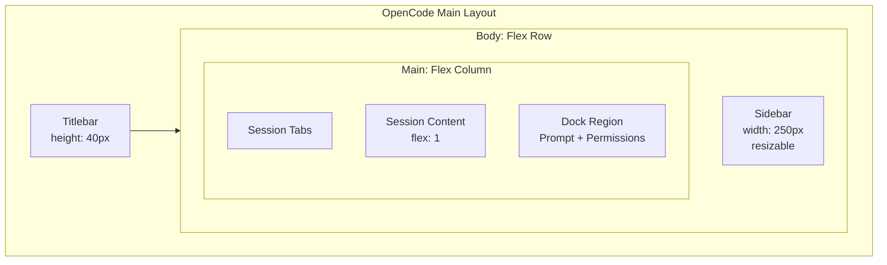

### 3.2 Session Content Layout

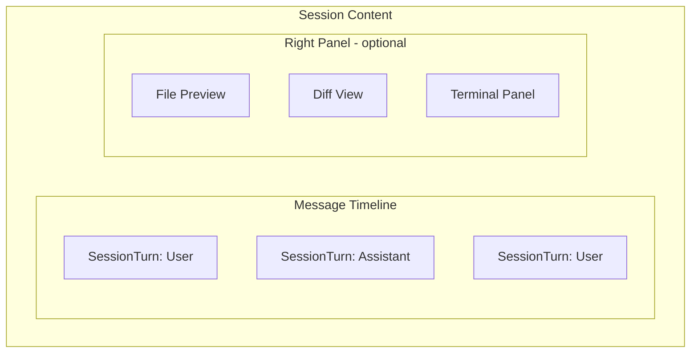

### 3.3 Textual Layout эквивалент

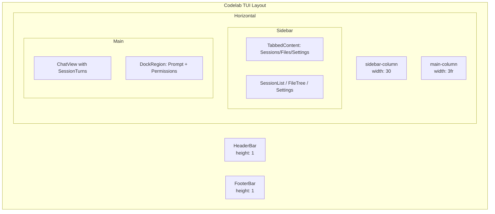

### 3.4 Responsive поведение

| Breakpoint | OpenCode | Codelab TUI |
|------------|----------|-------------|
| **Wide (>120 cols)** | Sidebar visible, right panel optional | Sidebar visible, full chat |
| **Medium (80-120 cols)** | Sidebar collapsible | Sidebar collapsible (Ctrl+B) |
| **Narrow (<80 cols)** | Sidebar hidden, fullscreen chat | Sidebar hidden, full chat |

### 3.5 Layout миграция

```python
# Codelab TUI main layout structure
class ACPClientApp(App):
    def compose(self):
        yield HeaderBar()
        with Horizontal(id="body"):
            with Vertical(id="sidebar-column"):
                yield TabbedContent(
                    TabPane("Sessions", SessionList()),
                    TabPane("Files", FileTree()),
                    TabPane("Settings", SettingsPanel()),
                )
            with Vertical(id="main-column"):
                yield ChatView()
                yield DockRegion()  # Prompt + Permission docks
        yield FooterBar()
```

## 4. Компоненты по категориям

### 4.1 Forms (8 компонентов)

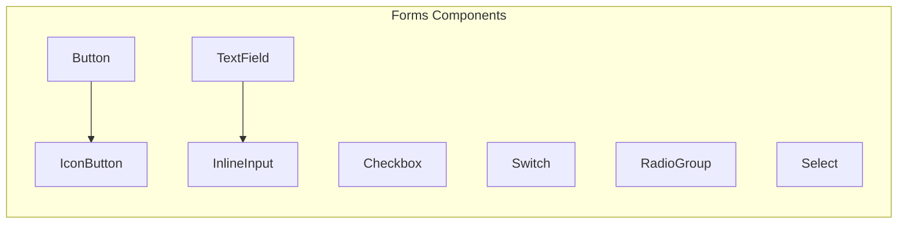

**Приоритет:** M - большинство встроены в Textual

### 4.2 Layout (8 компонентов)

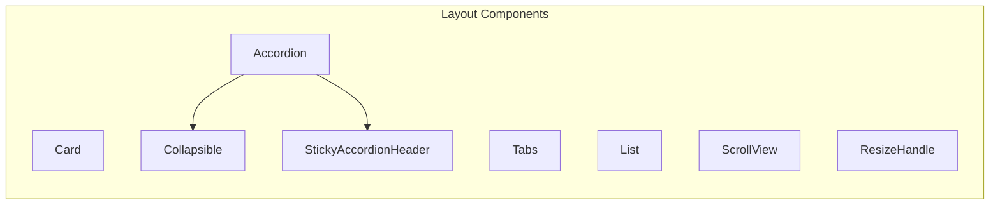

**Приоритет:** H - критичны для структуры

### 4.3 Overlay (7 компонентов)

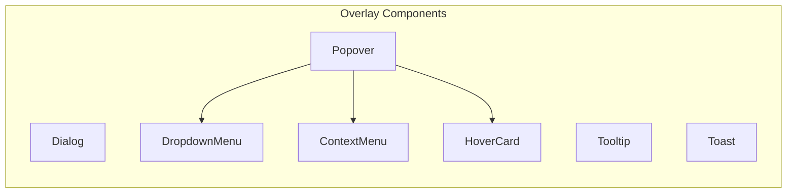

**Приоритет:** H - важны для UX

### 4.4 Session (7 компонентов)

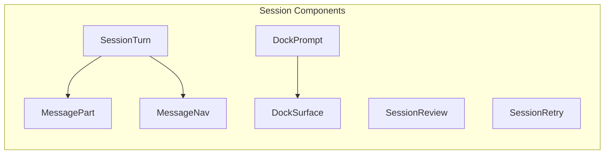

**Приоритет:** Critical - ядро функциональности

### 4.5 Visualization (6 компонентов)

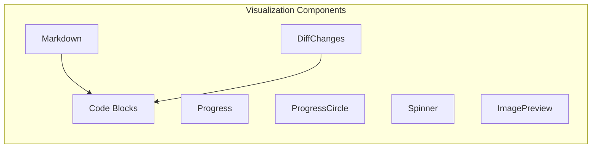

**Приоритет:** H - необходимы для отображения контента

### 4.6 Tools (5 компонентов)

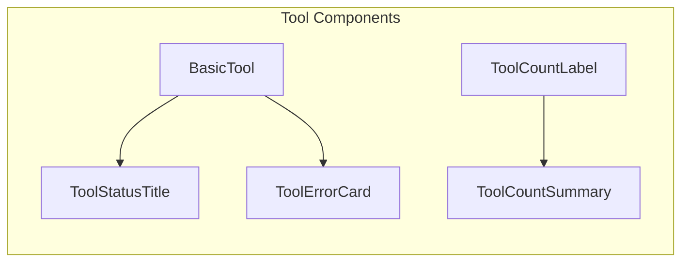

**Приоритет:** H - необходимы для отображения tool calls

### 4.7 Navigation (включая dialogs)

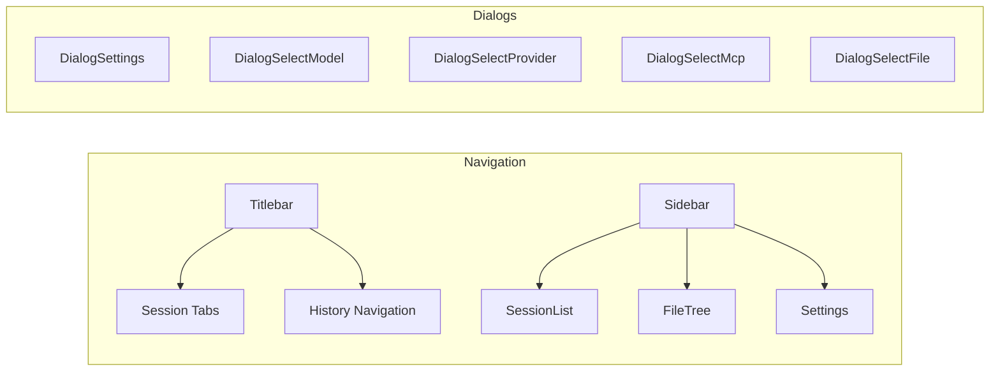

**Приоритет:** M - улучшают UX

## 5. Features для миграции

### 5.1 Тёмная/светлая тема

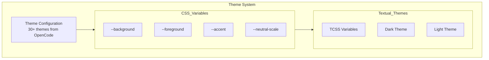

**Реализация:**
- Создать `tui/themes/` директорию
- Портировать 30+ тем из OpenCode в TCSS
- Поддержать dark/light switch через Textual's `dark` property

### 5.2 Система горячих клавиш

| OpenCode | Codelab TUI | Действие |
|----------|-------------|----------|
| `Ctrl+N` | `Ctrl+N` | Новая сессия |
| `Ctrl+Enter` | `Ctrl+Enter` | Отправить промпт |
| `Ctrl+C` | `Ctrl+C` | Отмена prompt-turn |
| `Escape` | `Escape` | Закрыть modal/отменить |
| `Ctrl+K` | `Ctrl+K` | Command palette |
| `Ctrl+,` | `Ctrl+,` | Настройки |
| `Ctrl+B` | `Ctrl+B` | Toggle sidebar |
| `Ctrl+J/K` | `Ctrl+J/K` | Навигация по сессиям |
| `Ctrl+Shift+P` | `Ctrl+Shift+P` | Provider selection |
| `Ctrl+M` | `Ctrl+M` | Model selection |

### 5.3 Terminal panel

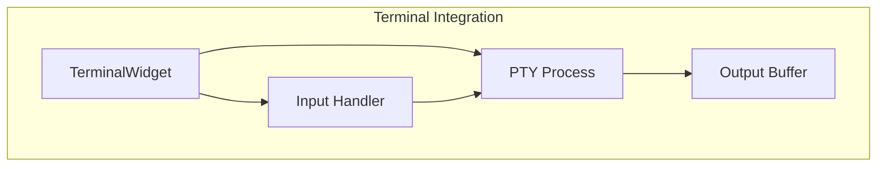

**Реализация:**
- Использовать `ptyprocess` для PTY
- Custom Widget для отображения
- Поддержка ANSI escape codes через Rich

### 5.4 File tree с операциями

| Операция | OpenCode | Codelab TUI |
|----------|----------|-------------|
| Просмотр дерева | ✓ | ✓ (DirectoryTree) |
| Открытие файла | ✓ | ✓ (FileViewer) |
| Создание файла | ✓ | TBD |
| Удаление файла | ✓ | TBD |
| Переименование | ✓ | TBD |
| Контекстное меню | ✓ | TBD (ContextMenu) |
| Поиск в дереве | ✓ | TBD |
| Git статус | ✓ | TBD |

### 5.5 Session management

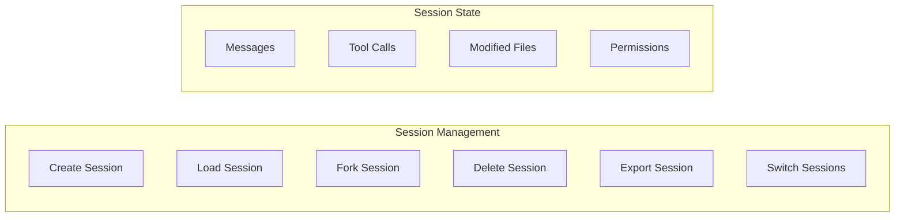

### 5.6 MCP integrations

- Отображение списка MCP серверов
- Подключение/отключение серверов
- Просмотр доступных tools от MCP
- Управление настройками MCP

### 5.7 Command Palette

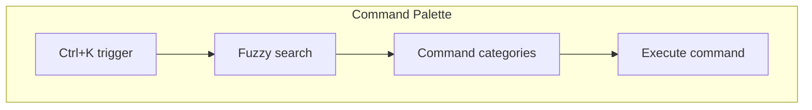

## 6. Фазы реализации

### 6.1 Фаза 1: Core Layout

**Цель:** Воссоздание базовой структуры приложения

**Компоненты:**
- [ ] Layout система (Horizontal/Vertical containers)
- [ ] HeaderBar улучшения
- [ ] FooterBar улучшения  
- [ ] TabbedContent для Sidebar
- [ ] ResizeHandle для панелей
- [ ] Базовые Card/Accordion

**Результат:** Структура UI совпадает с OpenCode

### 6.2 Фаза 2: Session Components

**Цель:** Полноценное отображение чата

**Компоненты:**
- [ ] SessionTurn с Markdown
- [ ] MessagePart (text, code, tool)
- [ ] MessageNav
- [ ] Avatar
- [ ] SessionReview
- [ ] SessionRetry
- [ ] DockPrompt улучшения

**Результат:** Чат выглядит и работает как в OpenCode

### 6.3 Фаза 3: Tool Components

**Цель:** Отображение tool calls и permissions

**Компоненты:**
- [ ] BasicTool
- [ ] ToolStatusTitle
- [ ] ToolErrorCard
- [ ] ToolCountLabel/Summary
- [ ] Permission Docks (улучшение существующих)
- [ ] DiffChanges

**Результат:** Tool calls отображаются полноценно

### 6.4 Фаза 4: Advanced Features

**Цель:** Расширенная функциональность

**Компоненты:**
- [ ] Terminal panel (PTY)
- [ ] ImagePreview
- [ ] FileTree улучшения (ContextMenu, Git status)
- [ ] Command Palette
- [ ] Toast notifications
- [ ] All Dialog screens

**Результат:** Полная функциональность OpenCode

### 6.5 Фаза 5: Polish

**Цель:** Финальная полировка UX

**Компоненты:**
- [ ] 30+ тем из OpenCode
- [ ] Все анимации (TextShimmer, Typewriter, etc.)
- [ ] i18n (16+ языков)
- [ ] Keyboard shortcuts (полный набор)
- [ ] Accessibility

**Результат:** Production-ready TUI

## 7. Техническое соответствие

### 7.1 OpenCode → Textual Widget mapping

| OpenCode компонент | Textual виджет | Примечания |
|-------------------|----------------|------------|
| `Button` | `textual.widgets.Button` | Добавить variants через TCSS |
| `Checkbox` | `textual.widgets.Checkbox` | Встроен |
| `Switch` | `textual.widgets.Switch` | Встроен |
| `TextField` | `textual.widgets.Input` | Встроен |
| `Select` | `textual.widgets.Select` | Встроен |
| `RadioGroup` | `textual.widgets.RadioSet` | Встроен |
| `Dialog` | `textual.screen.ModalScreen` | Custom screen |
| `Tabs` | `textual.widgets.TabbedContent` | Встроен |
| `List` | `textual.widgets.ListView` | Встроен |
| `Tree` | `textual.widgets.Tree` | Встроен |
| `Progress` | `textual.widgets.ProgressBar` | Встроен |
| `Markdown` | `textual.widgets.Markdown` | Нужно расширить |
| `Spinner` | `textual.widgets.LoadingIndicator` | Встроен |
| `Toast` | `textual.widgets.Toast` | Встроен с Textual 0.40+ |

### 7.2 Solid.js Signal → Observable Pattern

```python
# OpenCode (Solid.js)
const [count, setCount] = createSignal(0)

# Codelab TUI (Observable)
class ViewModel:
    def __init__(self):
        self._count = Observable(0)
    
    @property
    def count(self) -> Observable[int]:
        return self._count
```

### 7.3 TailwindCSS → TCSS mapping

| TailwindCSS | TCSS | Примечания |
|-------------|------|------------|
| `bg-neutral-900` | `background: $neutral-900;` | Через CSS переменные |
| `text-white` | `color: white;` | Прямой маппинг |
| `p-4` | `padding: 1;` | 1 = 1 cell в TUI |
| `rounded-lg` | `border: round;` | Textual border style |
| `flex` | `layout: horizontal;` | Container layout |
| `gap-2` | `grid-gutter: 1;` | Grid spacing |
| `hover:bg-blue-500` | `.button:hover { ... }` | Pseudo-class |

### 7.4 JSX → Python compose

```tsx
// OpenCode JSX
<Card>
  <Button onClick={handleClick}>
    Click me
  </Button>
</Card>
```

```python
# Codelab TUI
class MyWidget(Widget):
    def compose(self) -> ComposeResult:
        with Card():
            yield Button("Click me")
    
    def on_button_pressed(self, event: Button.Pressed) -> None:
        self.handle_click()
```

### 7.5 Context Providers → Textual DI/App

| OpenCode Context | Codelab TUI | Реализация |
|------------------|-------------|------------|
| `ThemeContext` | `App.dark` + TCSS | Встроен в Textual |
| `SettingsContext` | `SettingsViewModel` | ViewModel layer |
| `PermissionContext` | `PermissionViewModel` | ViewModel layer |
| `PromptContext` | `ChatViewModel` | ViewModel layer |
| `ServerContext` | `ACPTransportService` | Infrastructure layer |
| `TerminalContext` | `TerminalViewModel` | ViewModel layer |

## 8. Roadmap

### 8.1 Gantt диаграмма

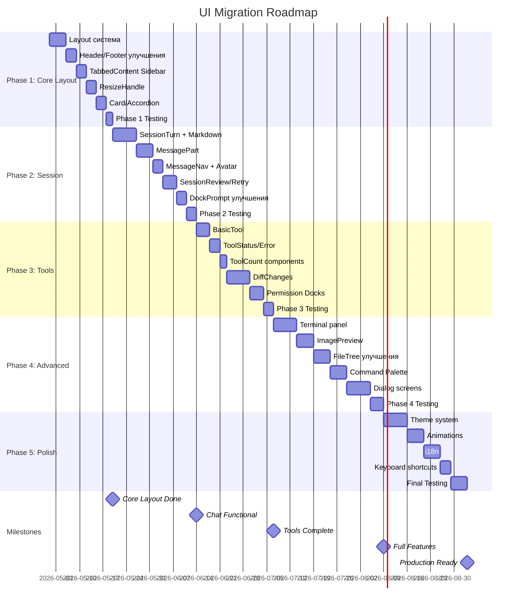

### 8.2 Milestones

| Milestone | Описание | Критерии завершения |
|-----------|----------|---------------------|
| **M1: Core Layout** | Базовая структура | Layout совпадает с OpenCode, resize работает |
| **M2: Chat Functional** | Работающий чат | Markdown, code blocks, streaming работают |
| **M3: Tools Complete** | Tool calls | Все tool calls отображаются корректно |
| **M4: Full Features** | Вся функциональность | Terminal, dialogs, command palette работают |
| **M5: Production Ready** | Готов к релизу | Темы, i18n, accessibility, тесты пройдены |

### 8.3 Зависимости между фазами

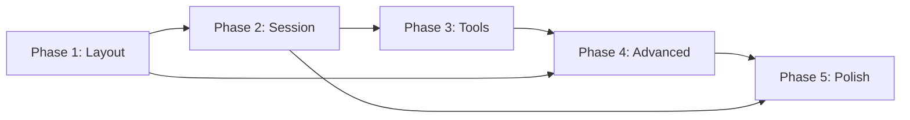

## 9. Риски и митигации

| Риск | Вероятность | Влияние | Митигация |
|------|-------------|---------|-----------|
| Terminal PTY сложность | Высокая | Высокое | Использовать существующие библиотеки (ptyprocess) |
| Ограничения Textual | Средняя | Среднее | Создавать custom widgets где нужно |
| Performance при большом чате | Средняя | Высокое | Виртуализация ListView |
| Image rendering в терминале | Высокая | Низкое | ASCII art fallback, Sixel где поддерживается |
| Сложность тем | Низкая | Низкое | Автоматическая генерация TCSS из OpenCode тем |

## 10. Структура директорий после миграции

```
codelab/src/codelab/client/tui/
├── app.py                      # Главное приложение
├── styles/
│   ├── app.tcss               # Главные стили
│   └── themes/                # 30+ тем
│       ├── opencode.tcss
│       ├── catppuccin.tcss
│       ├── dracula.tcss
│       └── ...
├── components/
│   ├── __init__.py
│   ├── forms/                 # Form компоненты
│   │   ├── button.py
│   │   ├── icon_button.py
│   │   └── inline_input.py
│   ├── layout/                # Layout компоненты
│   │   ├── card.py
│   │   ├── accordion.py
│   │   ├── tabs.py
│   │   └── resize_handle.py
│   ├── overlay/               # Overlay компоненты
│   │   ├── dialog.py
│   │   ├── popover.py
│   │   ├── dropdown_menu.py
│   │   ├── context_menu.py
│   │   ├── tooltip.py
│   │   └── toast.py
│   ├── session/               # Session компоненты
│   │   ├── session_turn.py
│   │   ├── session_review.py
│   │   ├── message_part.py
│   │   ├── message_nav.py
│   │   ├── dock_prompt.py
│   │   └── dock_surface.py
│   ├── visualization/         # Visualization компоненты
│   │   ├── diff_changes.py
│   │   ├── markdown.py
│   │   ├── progress_circle.py
│   │   └── image_preview.py
│   ├── icons/                 # Icon компоненты
│   │   ├── icon.py
│   │   ├── file_icon.py
│   │   └── provider_icon.py
│   ├── animation/             # Animation компоненты
│   │   ├── text_shimmer.py
│   │   ├── typewriter.py
│   │   └── animated_number.py
│   ├── tools/                 # Tool компоненты
│   │   ├── basic_tool.py
│   │   ├── tool_status.py
│   │   └── tool_error.py
│   ├── prompt/                # Prompt input компоненты
│   │   ├── attachments.py
│   │   ├── context_items.py
│   │   ├── slash_popover.py
│   │   └── history.py
│   └── settings/              # Settings компоненты
│       ├── general.py
│       ├── models.py
│       ├── providers.py
│       └── keybinds.py
├── screens/                   # Modal screens
│   ├── settings_screen.py
│   ├── select_model_screen.py
│   ├── select_provider_screen.py
│   ├── select_mcp_screen.py
│   ├── select_file_screen.py
│   └── command_palette_screen.py
├── navigation/                # Navigation (существует)
│   ├── manager.py
│   └── ...
└── i18n/                      # Интернационализация
    ├── __init__.py
    ├── en.py
    ├── ru.py
    └── ...
```

## 11. Заключение

Данный план обеспечивает полную миграцию UI из OpenCode Desktop в Codelab TUI с сохранением всех функций, layouts и UX-паттернов. 

**Ключевые цифры:**
- **81 компонент** для миграции
- **5 фаз** реализации
- **30+ тем** для поддержки
- **16+ языков** i18n

План структурирован для последовательной реализации с четкими milestone'ами и критериями завершения каждой фазы.
