# Архитектура ACP Protocol — Детальное руководство

## Оглавление

1. [Введение](#введение)
2. [Обзор системы](#обзор-системы)
3. [Архитектура на уровне компонентов](#архитектура-на-уровне-компонентов)
4. [Domain и Mapping слои в codelab.server](#domain-и-mapping-слои)
5. [Потоки данных](#потоки-данных)
6. [Транспортный слой](#транспортный-слой)
7. [Двухуровневая история в codelab.server](#двухуровневая-история)
8. [Background Receive Loop в codelab.client](#background-receive-loop)
9. [MCP Integration](#mcp-integration)
10. [Observability Layer](#observability-layer)
11. [LLM Call Strategies](#llm-call-strategies)
12. [Критические архитектурные решения](#критические-архитектурные-решения)
13. [Расширение и интеграция](#расширение-и-интеграция)

---

## Введение

ACP (Agent Client Protocol) — стандартный протокол взаимодействия между LLM-агентами и клиентами для выполнения задач с инструментами.

Проект реализован как **монорепозиторий** с двумя независимыми Python-компонентами:
- **[codelab/server](src/codelab/server/)** — серверная реализация протокола с LLM-агентом и управлением сессиями
- **[codelab/client](src/codelab/client/)** — клиентская реализация с TUI интерфейсом на базе Clean Architecture

---

## Обзор системы

### Диаграмма высокоуровневой архитектуры

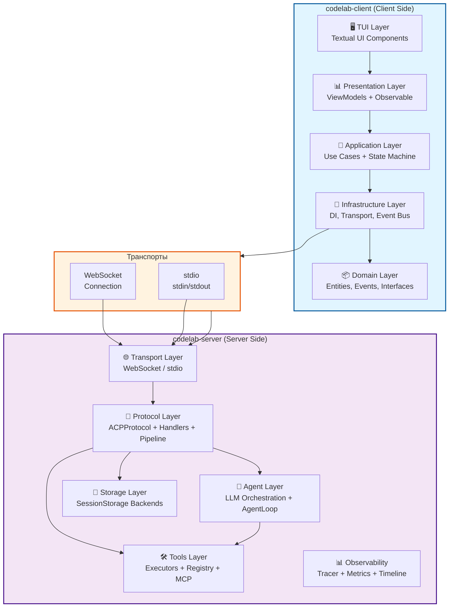

### Таблица компонентов

| Компонент | Слой | Ответственность | Файлы |
|-----------|------|-----------------|-------|
| **TUI** | Presentation | Textual компоненты, User Interaction | `src/codelab/client/tui/` |
| **ViewModels** | Presentation | MVVM паттерн, Observable state (14 ViewModels) | `src/codelab/client/presentation/` |
| **Use Cases** | Application | Business scenarios, DTOs | `src/codelab/client/application/` |
| **DIContainer** | Infrastructure | Dependency Injection (dishka) | [`src/codelab/client/infrastructure/di_container.py`](src/codelab/client/infrastructure/di_container.py:33) |
| **BackgroundReceiveLoop** | Infrastructure | Единственный receive() на транспорт | [`src/codelab/client/infrastructure/services/background_receive_loop.py`](src/codelab/client/infrastructure/services/background_receive_loop.py:22) |
| **MessageRouter** | Infrastructure | Маршрутизация сообщений | [`src/codelab/client/infrastructure/services/message_router.py`](src/codelab/client/infrastructure/services/message_router.py:26) |
| **EventBus** | Infrastructure | Pub/Sub система событий | [`src/codelab/client/infrastructure/events/bus.py`](src/codelab/client/infrastructure/events/bus.py) |
| **StdioClientTransport** | Infrastructure | stdio транспорт (subprocess) | [`src/codelab/client/infrastructure/stdio_transport.py`](src/codelab/client/infrastructure/stdio_transport.py) |
| **ACPProtocol** | Protocol | Диспетчер методов ACP, `handle_and_process` для фоновых задач | [`src/codelab/server/protocol/core.py`](src/codelab/server/protocol/core.py:39) |
| **Handlers** | Protocol | Обработчики методов (auth, session, prompt) | [`src/codelab/server/protocol/handlers/`](src/codelab/server/protocol/handlers/) |
| **PromptPipeline** | Protocol | 7-stage pipeline: Validation → SlashCommand → PlanBuilding → TurnLifecycle(open) → Directives → LLMLoop → TurnLifecycle(close) | [`src/codelab/server/protocol/handlers/pipeline/`](src/codelab/server/protocol/handlers/pipeline/) |
| **PromptOrchestrator** | Protocol | Главный оркестратор prompt-turn | [`src/codelab/server/protocol/handlers/prompt_orchestrator.py`](src/codelab/server/protocol/handlers/prompt_orchestrator.py:32) |
| **AgentLoop** | Agent | Цикл LLM tool-calling итераций | [`src/codelab/server/protocol/handlers/pipeline/stages/agent_loop.py`](src/codelab/server/protocol/handlers/pipeline/stages/agent_loop.py) |
| **ExecutionEngine** | Agent | Композиция HistoryBuilder, ToolFilter, LLMAdapter, MessageSanitizer, PlanExtractor, ContextCompactor | [`src/codelab/server/agent/execution_engine.py`](src/codelab/server/agent/execution_engine.py) |
| **ToolRegistry** | Tools | Регистрация и управление инструментами | [`src/codelab/server/tools/registry.py`](src/codelab/server/tools/registry.py) |
| **ToolMapping** | Tools | Маппинг имён ACP ↔ LLM (fs/read → fs_read) | [`src/codelab/server/tools/mapping.py`](src/codelab/server/tools/mapping.py) |
| **MCPManager** | MCP | Управление MCP-серверами (stdio/HTTP/SSE, auto-reconnect, roots) | [`src/codelab/server/mcp/manager.py`](src/codelab/server/mcp/manager.py) |
| **Storage** | Storage | Persistence для сессий | [`src/codelab/server/storage/`](src/codelab/server/storage/) |
| **WebSocketTransport** | Transport | WebSocket endpoint | [`src/codelab/server/transport/websocket.py`](src/codelab/server/transport/websocket.py) |
| **StdioServerTransport** | Transport | stdio транспорт (stdin/stdout) | [`src/codelab/server/transport/stdio.py`](src/codelab/server/transport/stdio.py) |
| **StdioRunner** | Transport | Запуск stdio сервера с DI | [`src/codelab/server/transport/stdio_runner.py`](src/codelab/server/transport/stdio_runner.py) |
| **Tracer** | Observability | Distributed tracing | [`src/codelab/server/observability/tracer.py`](src/codelab/server/observability/tracer.py) |
| **MetricsTracker** | Observability | Metrics collection + auto-log | [`src/codelab/server/observability/metrics_tracker.py`](src/codelab/server/observability/metrics_tracker.py) |
| **EventTimeline** | Observability | Хронология событий | [`src/codelab/server/observability/event_timeline.py`](src/codelab/server/observability/event_timeline.py) |

---

## Domain и Mapping слои

### Обзор

Серверная часть (`codelab.server`) реализует **трёхслойную архитектуру** для разделения бизнес-логики и протокольных моделей:

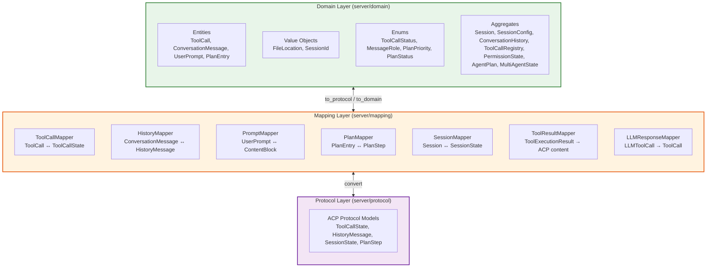

### Принципы разделения

| Слой | Назначение | Примеры | Зависимости |
|------|------------|---------|-------------|
| **Domain** | Бизнес-сущности с логикой | `ToolCall`, `Session`, `PlanEntry` | Не зависит от protocol/infrastructure |
| **Protocol** | ACP wire format (Pydantic) | `ToolCallState`, `SessionState` | Сериализация/десериализация |
| **Mapping** | Конвертеры между слоями | `ToolCallMapper`, `SessionMapper` | Зависит от domain и protocol |

### Domain модели

#### ToolCall и ToolResult

```python
# Domain model (server/domain/tool_call.py)
@dataclass(frozen=True)
class ToolCall:
    id: str
    tool_name: str
    arguments: dict[str, Any]
    status: ToolCallStatus  # PENDING, RUNNING, COMPLETED, FAILED
    result: ToolResult | None
    locations: list[FileLocation]
    raw_output: dict[str, Any]
    
    @property
    def is_terminal(self) -> bool: ...

@dataclass(frozen=True)
class ToolResult:
    locations: list[FileLocation]
    raw_output: dict[str, Any]
```

#### ConversationMessage и MessageContent

```python
# Domain model (server/domain/conversation.py)
@dataclass(frozen=True)
class ConversationMessage:
    role: MessageRole  # USER, ASSISTANT, SYSTEM, TOOL
    content: MessageContent
    timestamp: datetime
    tool_calls: list[ToolCall]
    tool_call_id: str | None

@dataclass(frozen=True)
class MessageContent:
    text: str
    resources: list[Resource]
    images: list[Image]
```

#### Session Aggregate

```python
# Aggregate root (server/domain/session.py)
@dataclass
class Session:
    id: SessionId
    config: SessionConfig
    history: ConversationHistory
    tool_calls: ToolCallRegistry
    permissions: PermissionState
    plan: AgentPlan
    multi_agent: MultiAgentState
    
    # Business logic methods
    def add_message(self, message: ConversationMessage) -> None: ...
    def create_tool_call(self, tool_name: str, arguments: dict) -> ToolCall: ...
    def update_tool_call(self, tool_call_id: str, **kwargs) -> None: ...
    def set_permission_policy(self, kind: str, policy: str) -> None: ...
```

### Mapping layer

Mapper'ы обеспечивают двустороннюю конвертацию между domain и protocol моделями:

```python
# Пример: ToolCallMapper (server/mapping/tool_call_mapper.py)
class ToolCallMapper:
    @staticmethod
    def to_protocol(domain: ToolCall) -> ToolCallState:
        """Domain → Protocol (для отправки клиенту)"""
        return ToolCallState(
            tool_call_id=domain.id,
            title=domain.tool_name,
            status=domain.status.value,
            raw_input=domain.arguments,
            raw_output=domain.raw_output,
            locations=[{"path": loc.path, "line": loc.line} for loc in domain.locations],
        )
    
    @staticmethod
    def to_domain(protocol: ToolCallState) -> ToolCall:
        """Protocol → Domain (для бизнес-логики)"""
        return ToolCall(
            id=protocol.tool_call_id,
            tool_name=protocol.title,
            status=ToolCallStatus(protocol.status),
            arguments=dict(protocol.raw_input),
            raw_output=dict(protocol.raw_output),
            locations=[FileLocation(path=loc["path"], line=loc.get("line")) 
                       for loc in protocol.locations],
        )
```

### Таблица соответствия моделей

| Domain Model | ACP Protocol Model | Mapper | ACP Spec |
|--------------|-------------------|--------|----------|
| `ToolCall` | `ToolCallState` | `ToolCallMapper` | 08-Tool Calls |
| `ConversationMessage` | `HistoryMessage` | `HistoryMapper` | 05-Prompt Turn |
| `PlanEntry` | `PlanStep` | `PlanMapper` | 11-Agent Plan |
| `UserPrompt` | `ContentBlock` | `PromptMapper` | 06-Content |
| `Session` | `SessionState` | `SessionMapper` | 03-Session Setup |

### ToolExecutionResult

`ToolExecutionResult` (server/tools/base.py) — domain модель результата выполнения инструмента:

```python
@dataclass
class ToolExecutionResult:
    success: bool
    output: str | None
    error: str | None
    metadata: dict[str, Any] | None
    locations: list[FileLocation]  # Затронутые файлы
    raw_output: dict[str, Any]     # Исходный результат для ACP rawOutput
```

**Примеры использования:**

| Tool | `locations` | `raw_output` |
|------|-------------|--------------|
| `fs/read_text_file` | `[FileLocation(path, line)]` | `{"content": "...", "bytes_read": 1024}` |
| `fs/write_text_file` | `[FileLocation(path)]` | `{"bytes_written": 512, "diff": "..."}` |
| `terminal/create` | `[]` | `{"terminal_id": "term_xyz"}` |
| `terminal/wait_for_exit` | `[]` | `{"exit_code": 0, "signal": null, "output": "..."}` |
| MCP tools | `[]` | `{"result": {...}}` |

### Follow-along сервис

Клиентский `FollowAlongService` (client/infrastructure/services/follow_along.py) автоматически открывает файлы в IDE при обновлении tool calls:

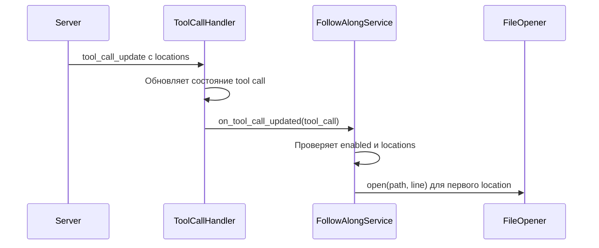

**Ключевые особенности:**
- `FileOpener` Protocol — абстракция для открытия файлов в IDE
- `StubFileOpener` — реализация для тестов
- Feature flag не нужен — если locations пуст, follow-along не срабатывает

---

## Архитектура на уровне компонентов

### codelab-server: Внутренняя структура

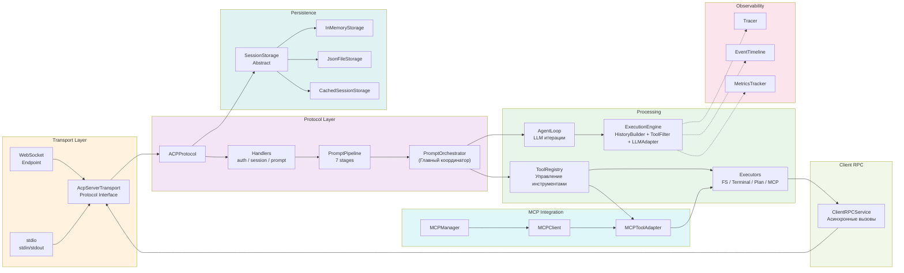

### codelab-client: Clean Architecture в 5 слоев

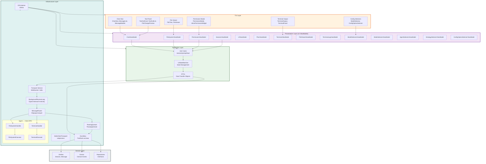

---

## Потоки данных

### 1. Отправка промпта (Client → Server)

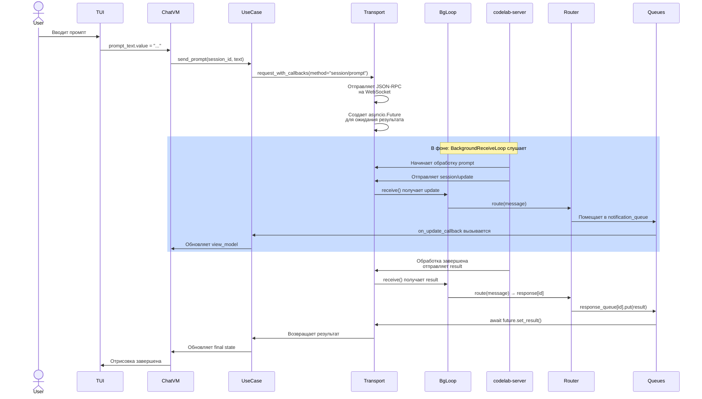

### 2. Обработка session/prompt на сервере

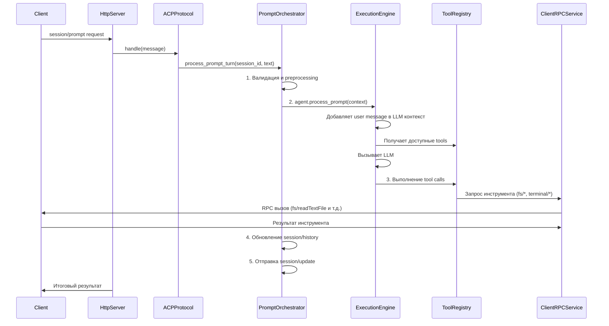

### 3. Обработка permission request на клиенте

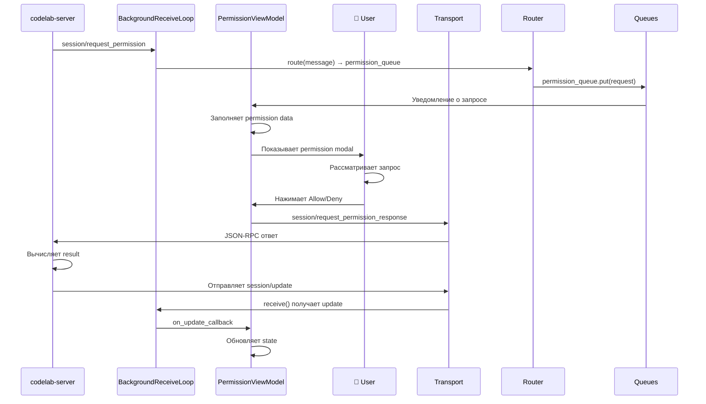

### 4. Background Receive Loop: Маршрутизация сообщений

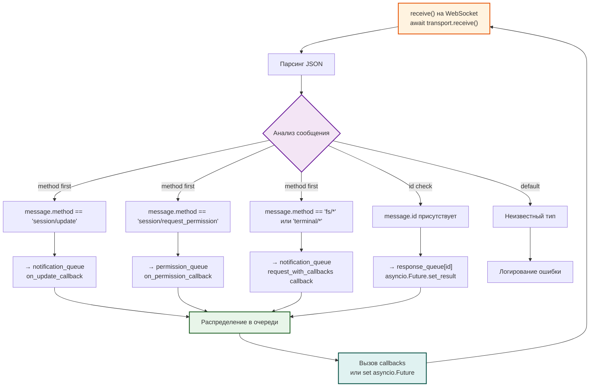

---

## Транспортный слой

### Архитектура транспорта

`ACPProtocol` (dispatcher) **не зависит от транспорта** — он принимает `ACPMessage` и возвращает `ProtocolOutcome`. Транспортный слой реализует передачу сообщений между клиентом и сервером.

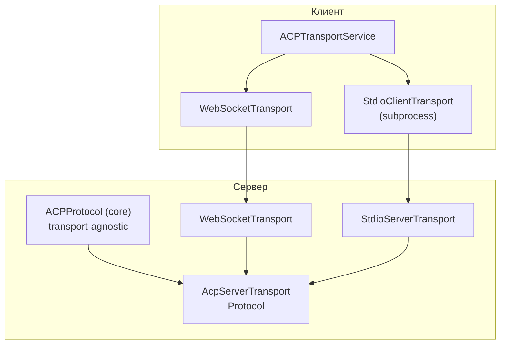

### Режимы работы

| Режим | Команда | Транспорт | Описание |
|-------|---------|-----------|----------|
| **Локальный** | `codelab` | stdio (subprocess) | Сервер запускается как subprocess, TUI подключается через stdio |
| **WebSocket сервер** | `codelab serve` | WebSocket | Сервер слушает ws://host:port/acp/ws |
| **stdio сервер** | `codelab serve --stdio` | stdio | Сервер читает stdin, пишет stdout (для IDE plugins) |
| **WebSocket клиент** | `codelab connect` | WebSocket | TUI подключается к удалённому серверу |
| **stdio клиент** | `codelab connect --stdio` | stdio (subprocess) | TUI запускает агент как subprocess |

### Серверный транспорт

**Интерфейс `AcpServerTransport`:**

```python
class AcpServerTransport(Protocol):
    async def run(
        self,
        on_message: Callable[[ACPMessage], Awaitable[ProtocolOutcome]],
    ) -> None: ...

    async def send(self, message: ACPMessage) -> None: ...
    async def close(self) -> None: ...
```

**Реализации:**

| Транспорт | Файл | Особенности |
|-----------|------|-------------|
| `WebSocketTransport` | `server/transport/websocket.py` | aiohttp WebSocket, Web UI |
| `StdioServerTransport` | `server/transport/stdio.py` | stdin/stdout, newline-delimited JSON-RPC |

**Ключевые детали stdio сервера:**

| Аспект | Решение |
|--------|---------|
| **Логирование** | ТОЛЬКО в stderr. Structlog handler на stderr |
| **Buffering** | `line_buffering=True` + ручной flush после каждого сообщения |
| **Agent→Client RPC** | Единый `asyncio.Lock` на запись в stdout |
| **EOF** | Graceful exit из цикла, cleanup pending operations |
| **SIGTERM/SIGINT** | Signal handlers → `close()` + `sys.exit(0)` |
| **Background Prompt** | `session/prompt` выполняется в `asyncio.create_task`, receive-loop продолжает читать stdin |

### Клиентский транспорт

**Интерфейс `Transport`:**

```python
class Transport(Protocol):
    async def connect(self) -> None: ...
    async def disconnect(self) -> None: ...
    async def send_str(self, data: str) -> None: ...
    async def receive_text(self) -> str: ...
    def is_connected(self) -> bool: ...
```

**Реализации:**

| Транспорт | Файл | Особенности |
|-----------|------|-------------|
| `WebSocketTransport` | `client/infrastructure/transport.py` | aiohttp WebSocket |
| `StdioClientTransport` | `client/infrastructure/stdio_transport.py` | asyncio subprocess, background reader |

**Ключевые детали stdio клиента:**

| Аспект | Решение |
|--------|---------|
| **Запуск** | `asyncio.create_subprocess_exec(command, *args, stdin=PIPE, stdout=PIPE, stderr=PIPE)` |
| **stdout reader** | Background task → `asyncio.Queue[str]` |
| **stderr reader** | Background task → логирование |
| **Graceful shutdown** | Close stdin → wait 5s → kill if needed |
| **Process exit** | Если процесс завершился → error при `receive_text()` |

---

## Двухуровневая история

### SessionState.history vs events_history

На сервере в codelab.server существует **двухуровневая система истории**:

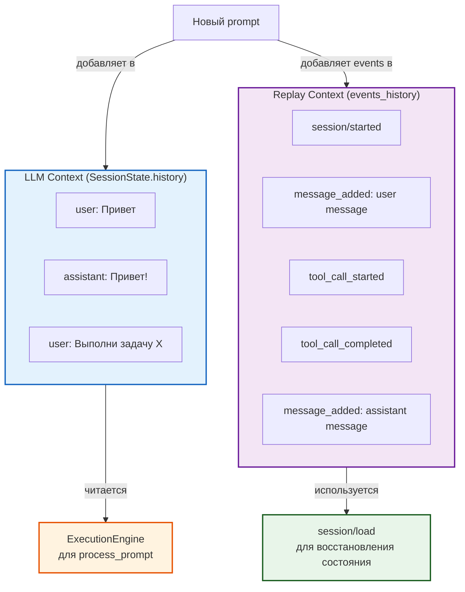

**Ключевые различия:**

| Аспект | SessionState.history | events_history |
|--------|----------------------|-----------------|
| **Содержание** | Message objects (user/assistant) | Structured events (started, added, completed) |
| **Использование** | Передача LLM для контекста | Восстановление state при load |
| **Обновление** | Централизованно в PromptOrchestrator | Через TurnLifecycleManager |
| **Размер** | Компактный (только сообщения) | Расширенный (все события) |
| **Воспроизведение** | Невозможно (информация потеряна) | Полное восстановление через replay |

**Архитектурное решение:**
- **ExecutionEngine.process_prompt()** — **НЕ** модифицирует SessionState
- **PromptOrchestrator** отвечает за добавление messages в history
- **TurnLifecycleManager** добавляет события в events_history
- Это обеспечивает **разделение ответственности** и **централизованное управление**

---

## Background Receive Loop

### Проблема: Race Condition при конкурентном доступе к WebSocket

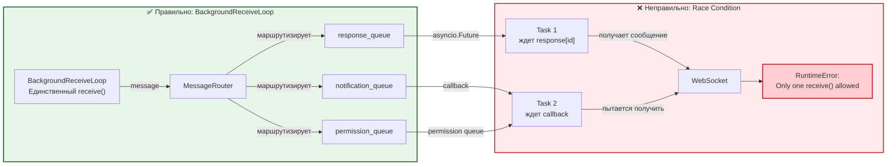

### Архитектура BackgroundReceiveLoop

```
┌─────────────────────────────────────────────────────────┐
│         BackgroundReceiveLoop                           │
│                                                          │
│  ┌──────────────────────────────────────────────┐      │
│  │ Главный цикл (asyncio.Task)                  │      │
│  │                                               │      │
│  │  while not should_stop:                      │      │
│  │    message = await transport.receive()       │      │
│  │    routing_key = router.route(message)       │      │
│  │    queue = queues.get(routing_key)           │      │
│  │    queue.put(message)                        │      │
│  └──────────────────────────────────────────────┘      │
│                     │                                   │
│    ┌────────────────┼────────────────┐                 │
│    ▼                ▼                ▼                 │
│  ┌──────────┐  ┌──────────┐  ┌──────────────┐         │
│  │Response  │  │Notif.    │  │Permission    │         │
│  │Queue     │  │Queue     │  │Queue         │         │
│  │          │  │          │  │              │         │
│  │[id1]:    │  │events:   │  │requests:     │         │
│  │Future    │  │list      │  │list          │         │
│  │[id2]:    │  │          │  │              │         │
│  │Future    │  │          │  │              │         │
│  └──────────┘  └──────────┘  └──────────────┘         │
│      ▲              ▲              ▲                   │
│      │              │              │                   │
│  ┌───┴──────────────┴──────────────┴─────┐            │
│  │ Потребители:                          │            │
│  │ - request_with_callbacks              │            │
│  │ - on_update_callback                  │            │
│  │ - on_permission_callback              │            │
│  └───────────────────────────────────────┘            │
│                                                          │
└─────────────────────────────────────────────────────────┘
```

**Ключевые особенности:**

1. **Единственный receive()** — избегает RuntimeError при конкурентном доступе
2. **Маршрутизация на основе сообщения** — router.route() определяет очередь
3. **Три типа очередей:**
   - **response_queue** — RPC ответы (по id)
   - **notification_queue** — асинхронные уведомления (session/update, fs/*, terminal/*)
   - **permission_queue** — запросы разрешений
4. **Graceful shutdown** — await stop() дожидается завершения loop
5. **Диагностика** — счетчики сообщений и ошибок для мониторинга
6. **Async callbacks** — callbacks поддерживают как sync так и async функции через `_call_callback()`, что предотвращает блокировку event loop в stdio режиме

---

## MCP Integration

CodeLab поддерживает Model Context Protocol (MCP) для подключения внешних инструментов, ресурсов и промптов.

### Компоненты

| Компонент | Файл | Ответственность |
|-----------|------|-----------------|
| `MCPManager` | `server/mcp/manager.py` | Управление несколькими MCP-серверами на сессию, auto-reconnect с backoff |
| `MCPClient` | `server/mcp/client.py` | Подключение к одному MCP-серверу с state machine |
| `MCPToolAdapter` | `server/mcp/tool_adapter.py` | Адаптация MCP tools → ACP ToolDefinition, kind inference |
| `MCPResourceMapper` | `server/mcp/resource_mapper.py` | Маппинг MCP resources → ACP ResourceLinkContent |
| `MCPPromptMapper` | `server/mcp/prompt_mapper.py` | Маппинг MCP prompts → slash commands |
| `MCPContentMapper` | `server/mcp/content_mapper.py` | Конвертация MCP content → ACP content |

### Транспорты

| Транспорт | Протокол | Статус |
|-----------|----------|--------|
| Stdio | subprocess stdin/stdout | ✅ Полностью |
| HTTP | HTTP POST/GET | ✅ Полностью |
| SSE | Server-Sent Events | ✅ Полностью |

### Функциональность

- **Tools**: MCP инструменты регистрируются в ToolRegistry с namespace `mcp:server_id:tool_name`
- **Resources**: MCP resources доступны через ResourceLinkContent
- **Prompts**: MCP prompts доступны как slash commands
- **Notifications**: Поддержка `tools/list_changed`, `resources/list_changed`, `prompts/list_changed`, progress notifications
- **Auto-reconnect**: С exponential backoff и health checks
- **Roots**: Поддержка `roots/list` и notifications
- **TOML Config**: Загрузка MCP-серверов из `codelab.toml` с env variable expansion

### Интеграция в pipeline

MCP инструменты интегрируются в `LLMLoopStage` — доступны агенту наравне с нативными инструментами. Permission flow для MCP инструментов использует kind inference для определения типа разрешения.

---

## Observability Layer

Сервер предоставляет абстрактный observability layer для трассировки, метрик и хронологии событий.

### Компоненты

| Компонент | Файл | Ответственность |
|-----------|------|-----------------|
| `Tracer` | `server/observability/tracer.py` | Distributed tracing с spans и trace IDs |
| `EventTimeline` | `server/observability/event_timeline.py` | Хронология событий сессии |
| `MetricsTracker` | `server/observability/metrics_tracker.py` | Сбор метрик + auto-log, TelemetrySink |

### Exporters

| Exporter | Файл | Формат |
|----------|------|--------|
| `FileEventExporter` | `server/observability/exporters/file_event_exporter.py` | JSON events в файл |
| `FileMetricsExporter` | `server/observability/exporters/file_metrics_exporter.py` | JSON metrics в файл |
| `FileSpanExporter` | `server/observability/exporters/file_span_exporter.py` | JSON spans в файл |

### Интеграция

Observability компоненты инжектируются через DI-контейнер и используются в `ExecutionEngine`, `AgentLoop`, `LLMAdapter` для трассировки LLM-вызовов, tool execution, и prompt turns.

---

## LLM Call Strategies

Система стратегий вызова LLM обеспечивает гибкость в управлении циклом tool-calling итераций.

### Архитектура

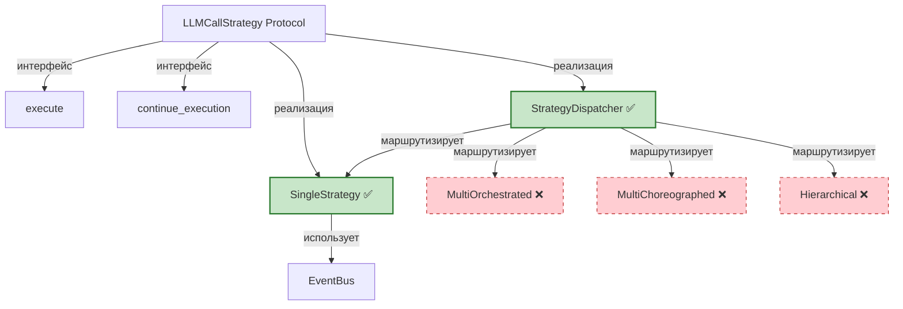

### Реализованные стратегии

| Стратегия | Файл | Статус | Описание |
|-----------|------|--------|----------|
| `SingleStrategy` | `protocol/handlers/strategies/single_strategy.py` | ✅ | Единственная реализованная стратегия. Один LLM-вызов → обработка tool calls → повтор |
| `StrategyDispatcher` | `agent/strategies/dispatcher.py` | ✅ | Диспетчер стратегий с priority chain + fallback. Маршрутизирует к зарегистрированным стратегиям |

### Запланированные (не реализованы)

| Стратегия | Статус | Описание |
|-----------|--------|----------|
| `MultiOrchestrated` | ❌ | Мультиагент с оркестратором |
| `MultiChoreographed` | ❌ | Мультиагент без оркестратора (choreography) |
| `Hierarchical` | ❌ | Иерархическая мультиагентная стратегия |

> **Важно:** Config specs ссылаются на `multi_orchestrated`, `multi_choreographed`, `hierarchical` стратегии, но только `single` имеет конкретную реализацию. Попытка использовать незавершённые стратегии приведёт к ошибке.

---

## Критические архитектурные решения

### 1. Абстракция SessionStorage в codelab.server

**Проблема:** Нужна гибкость в выборе хранилища (в памяти для dev, на диске для prod).

**Решение:** [`SessionStorage(ABC)`](src/codelab/server/storage/base.py) — интерфейс с двумя реализациями:

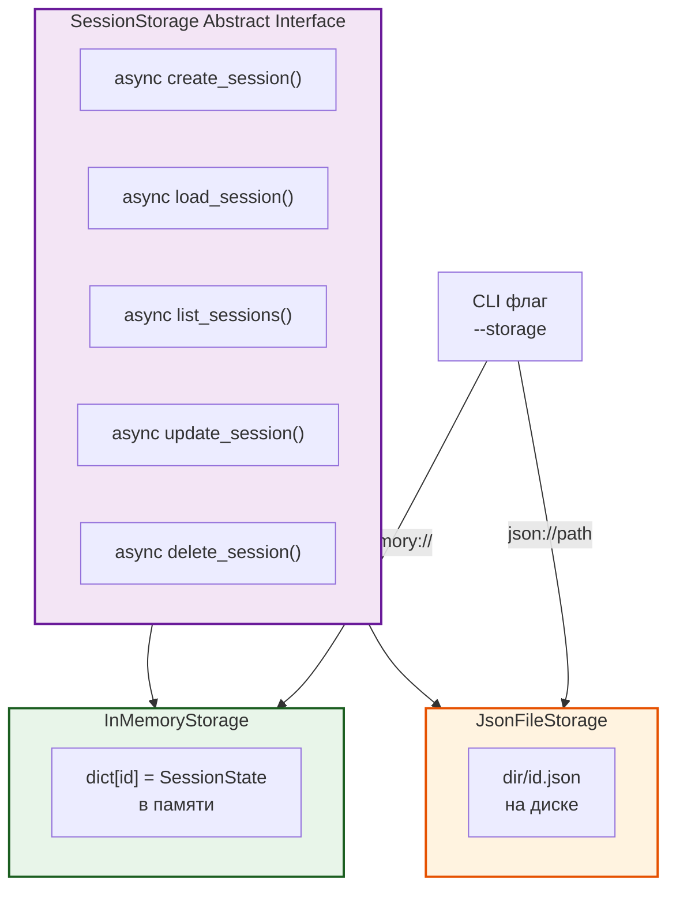

**Преимущества:**
- ✅ Easy testing (InMemoryStorage)
- ✅ Production persistence (JsonFileStorage)
- ✅ Plug-and-play новых backends (Redis, PostgreSQL)
- ✅ Изоляция логики хранения от протокола

### 2. Транспортная абстракция

**Проблема:** Нужна поддержка нескольких транспортов (WebSocket, stdio) без дублирования бизнес-логики.

**Решение:** `ACPProtocol` transport-agnostic, транспорт реализует единый интерфейс:

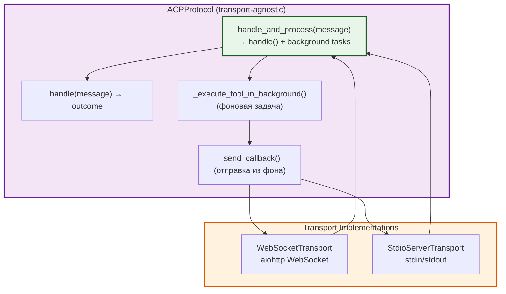

**Преимущества:**
- ✅ Единая бизнес-логика для всех транспортов
- ✅ Локальный режим использует stdio (соответствует spec ACP)
- ✅ `codelab serve --stdio` для интеграции с IDE plugins
- ✅ Изолированный процесс сервера в local mode

### Маппинг имён инструментов ACP ↔ LLM

**Проблема:** ACP протокол использует имена инструментов с `/` (например `fs/read_text_file`, `terminal/create`), но некоторые LLM провайдеры (Azure через OpenRouter) не поддерживают символ `/` в именах функций. Допустимый паттерн: `^[a-zA-Z0-9_\.-]+$`.

**Решение:** [`tools/mapping.py`](src/codelab/server/tools/mapping.py) обеспечивает двусторонний маппинг:

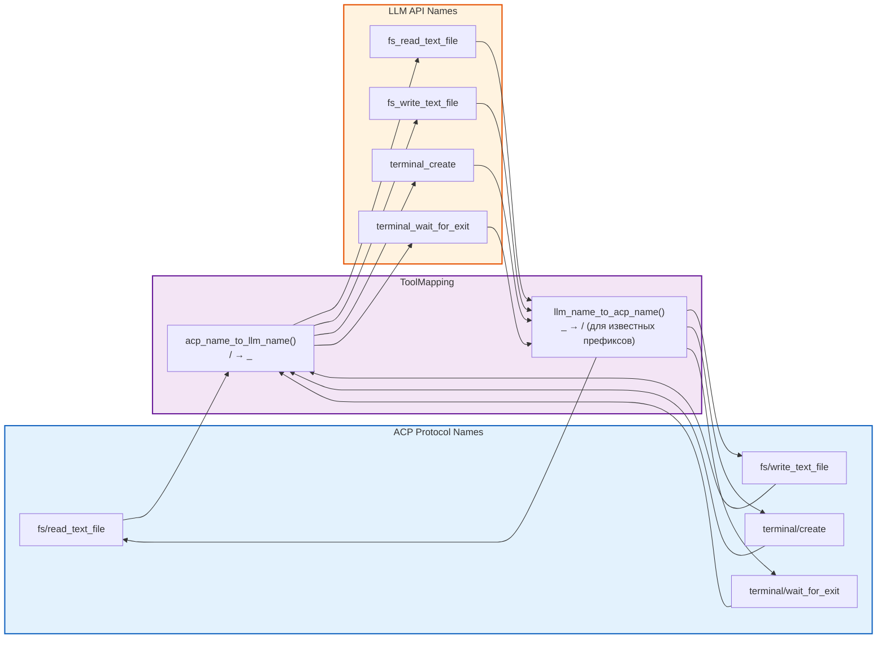

**Где применяется:**

| Место | Направление | Описание |
|-------|-------------|----------|
| `LLMAdapter._convert_tools()` | ACP → LLM | При отправке инструментов в LLM API |
| `SimpleToolRegistry.to_llm_tools()` | ACP → LLM | При конвертации для LLM |
| `SimpleToolRegistry.execute_tool()` | LLM → ACP | При выполнении инструмента (lookup в registry) |
| `LLMLoopStage._process_tool_calls()` | LLM → ACP | При обработке tool calls от LLM |

**Пример:**
```python
>>> acp_name_to_llm_name("fs/read_text_file")
"fs_read_text_file"
>>> llm_name_to_acp_name("fs_read_text_file")
"fs/read_text_file"
```

### 3. Фильтрация инструментов по ClientRuntimeCapabilities

**Проблема:** Не все клиенты поддерживают все инструменты (например, некоторые не поддерживают file system операции).

**Решение:** [`ClientRuntimeCapabilities`](src/codelab/server/protocol/state.py) для фильтрации:

```python
# Пример из PromptOrchestrator
available_tools = [
    tool for tool in all_tools
    if client_capabilities.supports_tool(tool.id)
]
```

**Ключевые возможности:**
- `supports_filesystem`: Поддержка fs операций
- `supports_terminal`: Поддержка terminal операций
- `max_tool_call_iterations`: Максимальное количество итераций tool calls

### 4. ClientRPCService для асинхронных вызовов

**Проблема:** Инструменты (fs/*, terminal/*) должны выполняться асинхронно на клиенте, а сервер ждет результата.

**Решение:** [`ClientRPCService`](src/codelab/server/client_rpc/service.py) управляет [`asyncio.Future`](src/codelab/server/client_rpc/models.py):

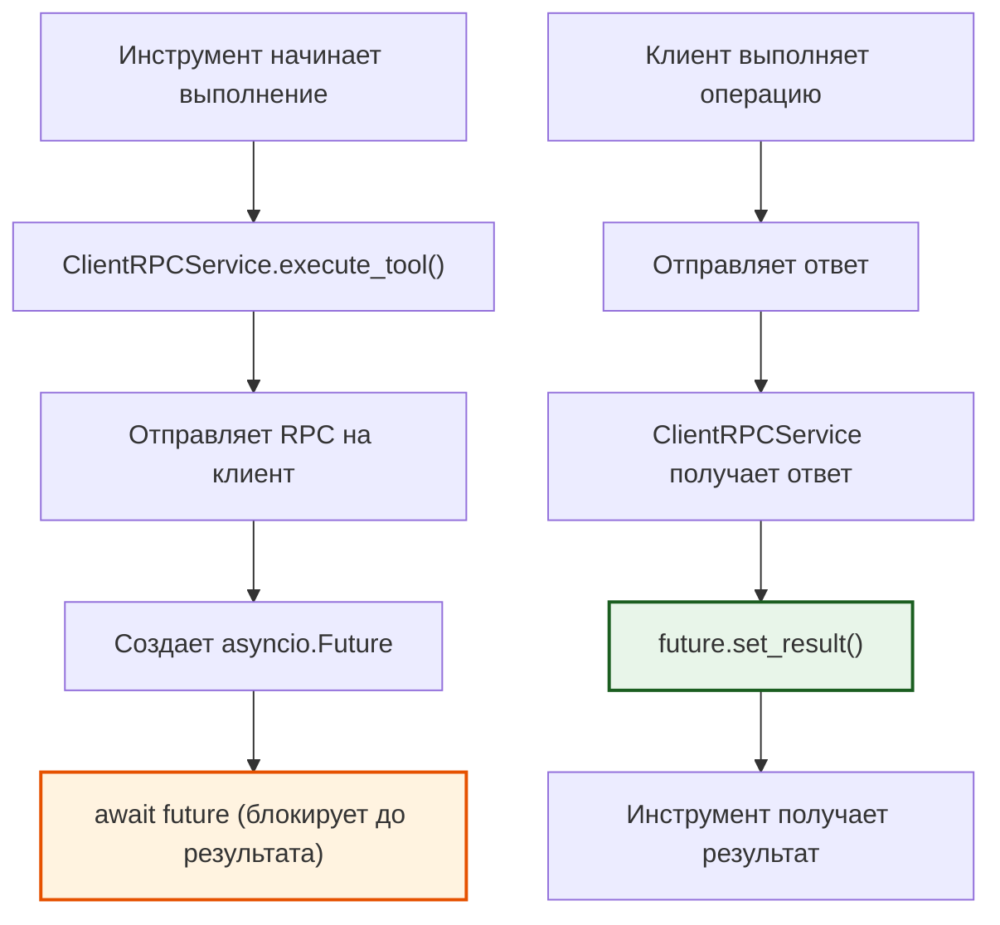

### 4.1. Terminal output flow (по ACP spec)

**Проблема:** По спецификации ACP `terminal/wait_for_exit` возвращает только `exitCode` и `signal` — без output. Output получается через отдельный метод `terminal/output`.

**Решение:** [`TerminalToolExecutor.execute_wait_for_exit()`](src/codelab/server/tools/executors/terminal_executor.py) реализует корректный flow:

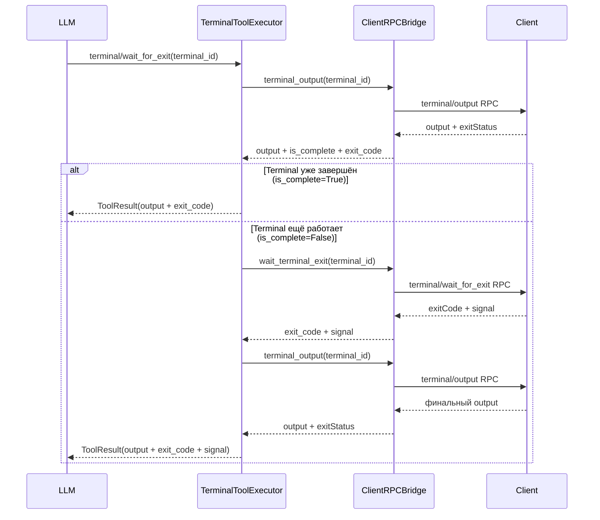

**Ключевые изменения (2026-05-21):**
- `TerminalWaitForExitResponse` — только `exitCode` и `signal` (по spec)
- `TerminalOutputResponse` — `output`, `truncated`, `exitStatus` (по spec)
- `ClientRPCBridge.terminal_output()` — новый метод для получения output
- `ToolResult` передаёт `output` в LLM (исправлена потеря output)

### 5. PromptOrchestrator как центральный координатор

**Проблема:** Обработка prompt-turn включает множество этапов (валидация, LLM, tools, permissions, обновления).

**Решение:** [`PromptOrchestrator`](src/codelab/server/protocol/handlers/prompt_orchestrator.py) интегрирует все компоненты:

```python
class PromptOrchestrator:
    def __init__(
        self,
        state_manager: StateManager,
        plan_builder: PlanBuilder,
        turn_lifecycle_manager: TurnLifecycleManager,
        tool_call_handler: ToolCallHandler,
        permission_manager: PermissionManager,
        client_rpc_handler: ClientRPCHandler,
        tool_registry: ToolRegistry,
    ):
        # Все компоненты инжектированы
        self.state_manager = state_manager
        self.plan_builder = plan_builder
        # ...
```

**Координирует:**
1. Валидацию входных данных
2. Преобразование контекста для LLM
3. Вызов агента
4. Управление tool calls
5. Проверку разрешений
6. Обновление состояния сессии
7. Отправку events в историю

### 6. Background Prompt Execution в StdioServerTransport (устранение deadlock в bypass mode)

**Проблема:** В bypass mode (без permission gate) агент отправляет `fs/read_text_file` клиенту через Agent→Client RPC и синхронно ждёт ответа. До фикса `session/prompt` обрабатывался синхронно внутри `await on_message()` — receive-loop был заблокирован и не читал stdin. Ответ клиента приходил на stdin, но никто его не читал → **deadlock на 44+ секунд**.

```mermaid
graph TB
    subgraph Before["❌ До фикса: Deadlock"]
        A1["stdin: session/prompt"]
        A2["on_message() → BLOCKED"]
        A3["AgentLoop: fs/read_text_file"]
        A4["await client RPC response"]
        A5["stdin: client response → ❌ Никто не читает!"]
        
        A1 --> A2 --> A3 --> A4 --> A5
        A5 -.x.-> A4
        
        style A5 fill:#ffcdd2,stroke:#b71c1c,stroke-width:2px
    end
    
    subgraph After["✅ После фикса: Background execution"]
        B1["stdin: session/prompt"]
        B2["asyncio.create_task(prompt)"]
        B3["prompt task: await client RPC"]
        B4["receive-loop: продолжает читать stdin"]
        B5["stdin: client response → ✅ Доставлен!"]
        B6["prompt task: получает ответ → завершается"]
        
        B1 --> B2
        B2 --> B3
        B2 --> B4
        B4 --> B5
        B5 --> B3
        B3 --> B6
        
        style B5 fill:#c8e6c9,stroke:#2e7d32,stroke-width:2px
        style B6 fill:#c8e6c9,stroke:#2e7d32,stroke-width:2px
    end
    
    Before --> After
```

**Решение:** `StdioServerTransport.run()` теперь запускает `session/prompt` в фоновой задаче через `asyncio.create_task()`, зеркально логике `WebSocketTransport`. Receive-loop продолжает читать stdin и маршрутизирует client RPC responses (`method=None, id=<rpc_id>`) в `on_message()`, где `protocol.handle()` перенаправляет на `handle_client_response()`.

**Интеграция без прямой зависимости от ACPProtocol:** Transport принимает 4 опциональных callback в `__init__`:

| Callback | Назначение | Вызывается когда |
|----------|------------|-------------------|
| `should_auto_complete` | Проверка автозавершения turn | `session/prompt` вернул outcome без response |
| `complete_active_turn` | Завершение turn + финальный response | Deferred prompt completion (после guard delay 50ms) |
| `load_pending_prompt_response` | Построение response при cancel | `session/cancel` отменяет deferred prompt task |

> **Важно:** `pending_tool_execution` обрабатывается в `protocol.handle_and_process()`,
> а не в транспорте. Транспорт только отправляет outcome — это предотвращает
> двойное выполнение tool (ранее и protocol, и transport schedule'или задачу).

**Полный паритет с WebSocketTransport:**

| Фича | WebSocket | Stdio |
|------|-----------|-------|
| Background `session/prompt` | ✅ `_process_prompt_request_in_background` | ✅ `_process_prompt_request_in_background` |
| Deferred prompt completion | ✅ `_complete_deferred_prompt` | ✅ `_complete_deferred_prompt` |
| Pending tool execution | ✅ `handle_and_process()` | ✅ `handle_and_process()` |
| `session/cancel` → отмена deferred | ✅ | ✅ |
| Cleanup при disconnect | ✅ `prompt_request_tasks` cleanup | ✅ `_cleanup_background_tasks` |

**Файлы:**
- [`src/codelab/server/transport/stdio.py`](src/codelab/server/transport/stdio.py) — основная логика
- [`src/codelab/server/transport/stdio_runner.py`](src/codelab/server/transport/stdio_runner.py) — проброс callbacks из `ACPProtocol`

**Тесты:** 14 новых unit-тестов в [`tests/server/transport/test_stdio.py`](tests/server/transport/test_stdio.py), включая регрессионный тест `test_bypass_mode_client_rpc_response_routes_during_prompt`.

---

## Расширение и интеграция

### Добавление нового инструмента в codelab.server

1. **Определить инструмент** в `tools/definitions/`
2. **Реализовать executor** в `tools/executors/`
3. **Зарегистрировать** в `PromptOrchestrator`

Пример:

```python
from acp_server.tools.base import ToolDefinition, ToolExecutor

class MyToolDefinition(ToolDefinition):
    id = "my/tool"
    name = "My Tool"
    
    async def execute(self, input_schema: dict) -> dict:
        # Реализация
        pass

class MyToolExecutor(ToolExecutor):
    async def execute(self, name: str, arguments: dict) -> dict:
        # Выполнение
        pass

# В PromptOrchestrator.__init__():
tool_registry.register("my/tool", MyToolDefinition(), MyToolExecutor())
```

### Добавление нового обработчика в codelab.client

1. **Создать handler** в `infrastructure/handlers/`
2. **Зарегистрировать** в [`HandlerRegistry`](src/codelab/client/infrastructure/handler_registry.py)
3. **Добавить tests** в `tests/`

Пример:

```python
from acp_client.infrastructure.handler_registry import HandlerRegistry

class MyHandler:
    async def handle(self, request: dict) -> dict:
        # Обработка запроса
        pass

# Регистрация:
registry = HandlerRegistry()
registry.register("my/method", MyHandler())
```

### Интеграция нового LLM провайдера

1. **Наследовать** [`BaseLLMProvider`](src/codelab/server/llm/base.py)
2. **Реализовать** `async generate()` метод
3. **Зарегистрировать** в CLI флаге `--llm-provider`

Пример:

```python
from acp_server.llm.base import BaseLLMProvider, LLMMessage

class MyLLMProvider(BaseLLMProvider):
    async def generate(self, messages: list[LLMMessage]) -> str:
        # Вызов API
        response = await my_api.generate(messages)
        return response.text
```

---

## Документы проекта

### Справочная документация

- **[codelab/README.md](codelab/README.md)** — основная документация проекта
- **[doc/product/developer-guide/](doc/product/developer-guide/)** — руководство разработчика

### Специальные документы

- **[AGENTS.md](AGENTS.md)** — инструкции для агентных ассистентов
- **[doc/architecture/ACP_IMPLEMENTATION_VERIFICATION.md](doc/architecture/ACP_IMPLEMENTATION_VERIFICATION.md)** — верифицированная матрица соответствия ACP спецификации (3,302 теста)
- **[doc/architecture/FULL_ARCHITECTURE.md](doc/architecture/FULL_ARCHITECTURE.md)** — полная схема проекта с мультиагентной экосистемой
- **[doc/Agent Client Protocol/](doc/Agent%20Client%20Protocol/)** — официальная спецификация ACP (не менять!)

---

## Заключение

Архитектура Codelab разработана для:
- ✅ **Модульности** — каждый компонент отвечает за одно
- ✅ **Расширяемости** — добавление новых компонентов не требует изменений существующих
- ✅ **Тестируемости** — все слои имеют интерфейсы для mock-объектов
- ✅ **Производительности** — асинхронность, потоковые обновления, оптимальные структуры данных
- ✅ **Безопасности** — валидация, аутентификация, логирование всех операций
