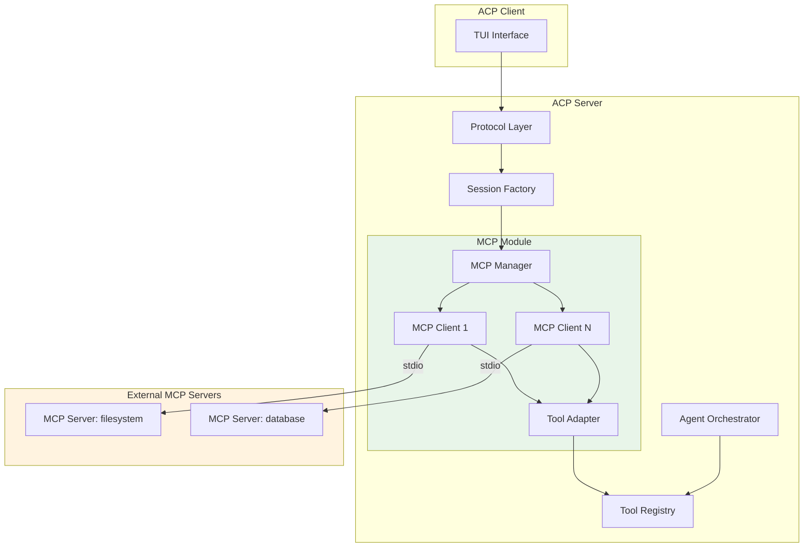
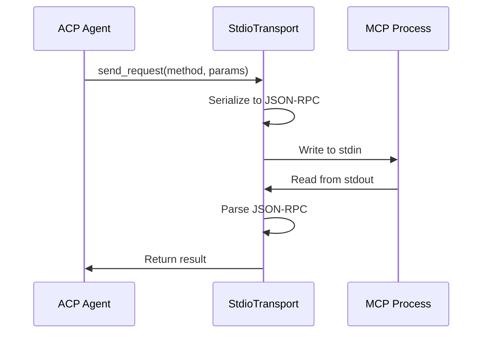
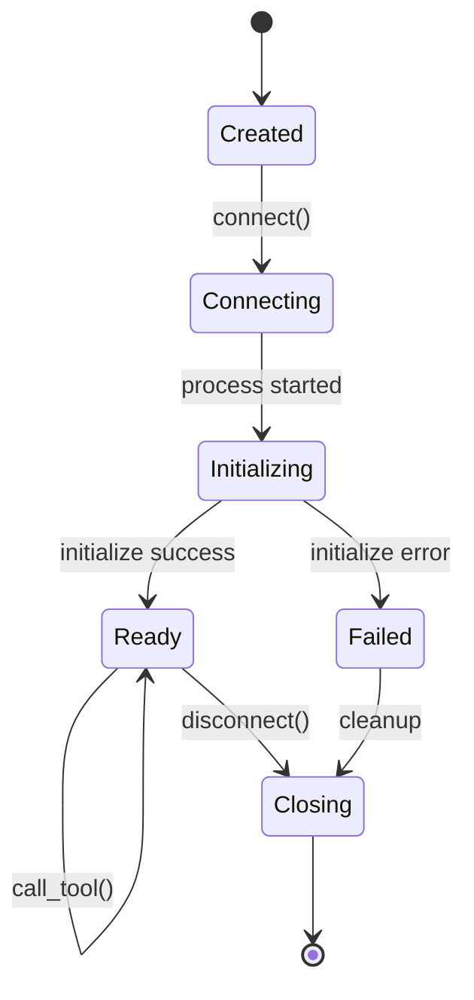
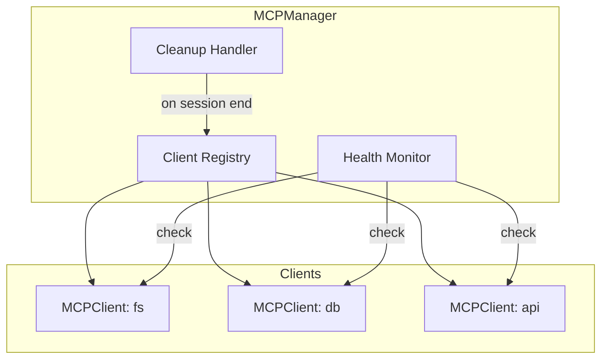
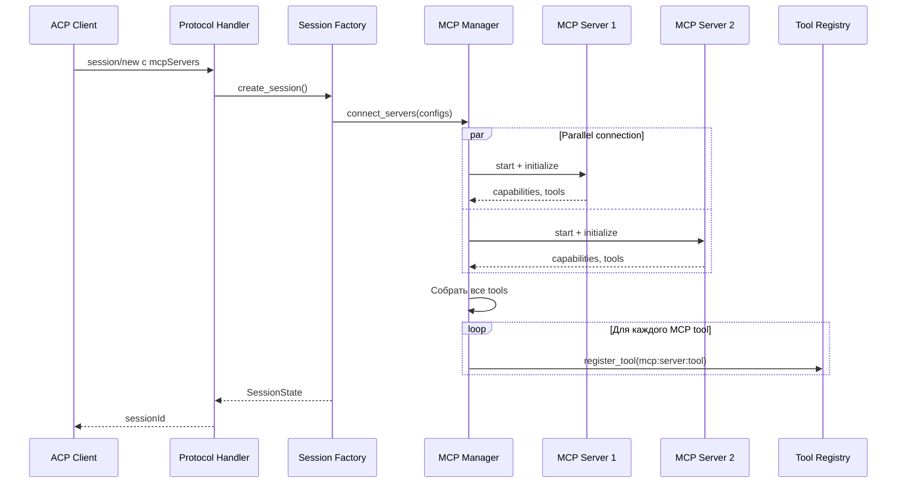
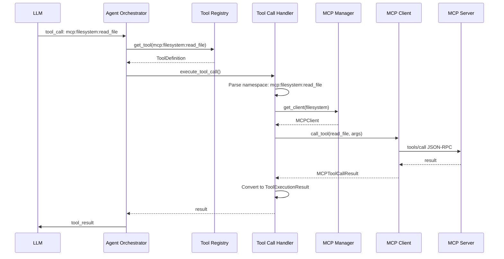
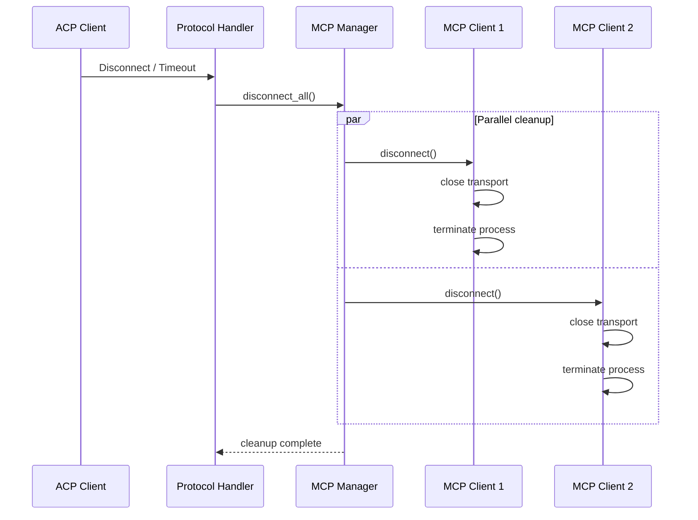
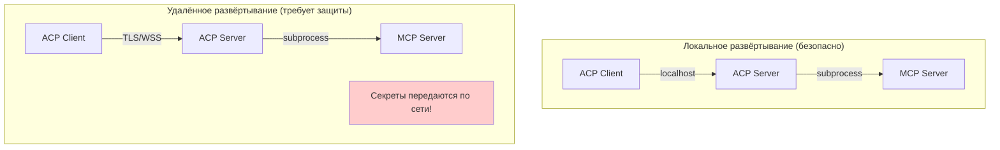

# Архитектура MCP интеграции

## Обзор

Этот документ описывает архитектуру интеграции Model Context Protocol (MCP) в ACP сервер. MCP позволяет агенту подключаться к внешним MCP серверам и использовать их инструменты наравне со встроенными.

---

## Контекст

### Что такое MCP?

Model Context Protocol — стандартный протокол для расширения возможностей LLM-агентов через внешние серверы. MCP серверы предоставляют:
- **Tools** — инструменты для выполнения действий
- **Resources** — доступ к данным и файлам  
- **Prompts** — шаблоны промптов

### Требования ACP протокола

Согласно спецификации ACP, клиент передаёт список MCP серверов при создании сессии:

```json
{
  "method": "session/new",
  "params": {
    "cwd": "/home/user/project",
    "mcpServers": [
      {
        "name": "filesystem",
        "command": "/path/to/mcp-server",
        "args": ["--stdio"],
        "env": []
      }
    ]
  }
}
```

---

## Архитектура компонентов

### Общая диаграмма



---

## Компоненты

### 1. MCPServerConfig

Модель конфигурации MCP сервера, получаемая от клиента.

```python
from pydantic import BaseModel

class MCPServerConfig(BaseModel):
    """Конфигурация MCP сервера из session/new параметров."""
    name: str                          # Уникальное имя сервера
    command: str                       # Путь к исполняемому файлу
    args: list[str] = []              # Аргументы командной строки
    env: list[dict[str, str]] = []    # Переменные окружения
```

### 2. StdioTransport

Транспортный слой для коммуникации с MCP сервером через stdio.



**API:**

```python
class StdioTransport:
    """Асинхронный stdio транспорт для MCP."""
    
    async def start(self, command: str, args: list[str], env: dict[str, str]) -> None:
        """Запустить MCP сервер как subprocess."""
    
    async def send_request(self, method: str, params: dict) -> dict:
        """Отправить JSON-RPC запрос и получить ответ."""
    
    async def send_notification(self, method: str, params: dict) -> None:
        """Отправить JSON-RPC нотификацию без ожидания ответа."""
    
    async def close(self) -> None:
        """Закрыть соединение и завершить процесс."""
```

### 3. MCPClient

Клиент для взаимодействия с одним MCP сервером.



**API:**

```python
class MCPClient:
    """Клиент для одного MCP сервера."""
    
    def __init__(self, config: MCPServerConfig):
        self.config = config
        self.transport: StdioTransport | None = None
        self.capabilities: MCPCapabilities | None = None
        self.tools: list[MCPToolDefinition] = []
    
    async def connect(self) -> None:
        """Запустить MCP сервер и установить соединение."""
    
    async def initialize(self) -> MCPCapabilities:
        """Выполнить MCP initialize handshake."""
    
    async def list_tools(self) -> list[MCPToolDefinition]:
        """Получить список доступных инструментов."""
    
    async def call_tool(self, name: str, arguments: dict) -> MCPToolCallResult:
        """Вызвать инструмент MCP сервера."""
    
    async def disconnect(self) -> None:
        """Закрыть соединение с MCP сервером."""
```

### 4. MCPManager

Менеджер для управления множеством MCP клиентов в рамках сессии.



**API:**

```python
class MCPManager:
    """Менеджер MCP клиентов для сессии."""
    
    def __init__(self):
        self._clients: dict[str, MCPClient] = {}
    
    async def connect_servers(self, configs: list[MCPServerConfig]) -> dict[str, MCPClient]:
        """Подключиться ко всем MCP серверам параллельно."""
    
    def get_client(self, server_name: str) -> MCPClient | None:
        """Получить клиент по имени сервера."""
    
    def get_all_tools(self) -> list[tuple[str, MCPToolDefinition]]:
        """Получить все инструменты со всех серверов."""
    
    async def disconnect_all(self) -> None:
        """Отключиться от всех серверов."""
```

### 5. MCPToolAdapter

Адаптер для преобразования MCP tools в формат ACP ToolRegistry.

```mermaid
graph LR
    MCP[MCPToolDefinition] --> Adapter[MCPToolAdapter]
    Adapter --> ACP[ToolDefinition]
    
    subgraph MCPToolDefinition
        M_name[name: read_file]
        M_desc[description: Reads a file]
        M_schema[inputSchema: JSON Schema]
    end
    
    subgraph ToolDefinition
        A_name[name: mcp:filesystem:read_file]
        A_desc[description: Reads a file]
        A_params[parameters: ...]
        A_kind[kind: inferred (read/edit/execute/other)]
    end
```

**API:**

```python
class MCPToolAdapter:
    """Адаптер MCP инструментов для ACP ToolRegistry."""
    
    @staticmethod
    def to_tool_definition(
        server_name: str,
        mcp_tool: MCPToolDefinition,
    ) -> ToolDefinition:
        """Преобразовать MCP tool в ToolDefinition."""
    
    @staticmethod
    def create_executor(
        mcp_client: MCPClient,
        tool_name: str,
    ) -> Callable:
        """Создать executor для MCP tool."""
```

---

## Потоки данных

### Flow 1: Создание сессии с MCP серверами



### Flow 2: Выполнение MCP Tool Call



### Flow 3: Завершение сессии



---

## Модели данных

### MCP Protocol Models

```python
from pydantic import BaseModel
from typing import Any

class MCPCapabilities(BaseModel):
    """Capabilities MCP сервера."""
    tools: dict[str, Any] | None = None
    resources: dict[str, Any] | None = None
    prompts: dict[str, Any] | None = None

class MCPToolDefinition(BaseModel):
    """Определение инструмента MCP."""
    name: str
    description: str | None = None
    inputSchema: dict[str, Any]

class MCPContent(BaseModel):
    """Контент в результате MCP tool call."""
    type: str  # text, image, resource
    text: str | None = None
    data: str | None = None
    mimeType: str | None = None

class MCPToolCallResult(BaseModel):
    """Результат вызова MCP tool."""
    content: list[MCPContent]
    isError: bool = False
```

### Internal Models

```python
from dataclasses import dataclass
from enum import Enum

class MCPClientState(Enum):
    """Состояние MCP клиента."""
    CREATED = "created"
    CONNECTING = "connecting"
    READY = "ready"
    ERROR = "error"
    CLOSING = "closing"

@dataclass
class MCPToolNamespace:
    """Разобранный namespace MCP tool."""
    prefix: str      # mcp
    server: str      # filesystem
    tool: str        # read_file
    
    @classmethod
    def parse(cls, name: str) -> MCPToolNamespace | None:
        """Разобрать имя вида mcp:server:tool."""
        parts = name.split(":")
        if len(parts) == 3 and parts[0] == "mcp":
            return cls(prefix=parts[0], server=parts[1], tool=parts[2])
        return None
    
    def __str__(self) -> str:
        return f"{self.prefix}:{self.server}:{self.tool}"
```

---

## Интеграция с существующими компонентами

### SessionState

Добавить поле для хранения MCP Manager:

```python
@dataclass
class SessionState:
    session_id: str
    cwd: str
    mcp_servers: list[dict[str, Any]]
    # ... существующие поля ...
    
    # Новое поле
    mcp_manager: MCPManager | None = None
```

### SessionFactory

Расширить логику создания сессии:

```python
class SessionFactory:
    @staticmethod
    async def create_session(
        cwd: str,
        mcp_servers: list[dict[str, Any]] | None = None,
        tool_registry: ToolRegistry | None = None,
        ...
    ) -> SessionState:
        # Существующая валидация
        SessionFactory.validate_session_params(...)
        
        session = SessionState(
            session_id=...,
            cwd=cwd,
            mcp_servers=mcp_servers or [],
            ...
        )
        
        # Новая логика: подключение MCP
        if mcp_servers:
            manager = MCPManager()
            configs = [MCPServerConfig(**srv) for srv in mcp_servers]
            
            try:
                await manager.connect_servers(configs)
                session.mcp_manager = manager
                
                # Регистрация tools
                if tool_registry:
                    for server_name, tool in manager.get_all_tools():
                        tool_def = MCPToolAdapter.to_tool_definition(server_name, tool)
                        executor = MCPToolAdapter.create_executor(
                            manager.get_client(server_name),
                            tool.name
                        )
                        tool_registry.register(tool_def, executor)
            except Exception as e:
                logger.warning("MCP connection failed", error=str(e))
        
        return session
```

### ToolRegistry

Добавить поддержку MCP tools:

```python
class SimpleToolRegistry(ToolRegistry):
    async def execute_async(
        self,
        name: str,
        arguments: dict[str, Any],
    ) -> ToolExecutionResult:
        """Асинхронное выполнение для MCP tools."""
        # Проверить, является ли tool MCP
        ns = MCPToolNamespace.parse(name)
        if ns:
            # Получить MCP executor и вызвать асинхронно
            handler = self._handlers.get(name)
            if handler and inspect.iscoroutinefunction(handler):
                return await handler(**arguments)
        
        # Fallback на синхронное выполнение
        return self.execute(name, arguments)
```

---

## Обработка ошибок

### Типы ошибок

```python
class MCPError(Exception):
    """Базовое исключение для MCP ошибок."""

class MCPConnectionError(MCPError):
    """Ошибка подключения к MCP серверу."""

class MCPTimeoutError(MCPError):
    """Timeout при операции с MCP."""

class MCPProtocolError(MCPError):
    """Ошибка протокола MCP."""

class MCPToolError(MCPError):
    """Ошибка выполнения MCP tool."""
```

### Стратегии обработки

| Сценарий | Действие |
|----------|----------|
| MCP сервер не запускается | Логировать, создать сессию без этого сервера |
| Initialize timeout | Retry 3 раза, затем пропустить сервер |
| Tool call timeout | Вернуть ошибку в LLM |
| MCP процесс завершился | Попытка reconnect при следующем вызове |
| Некорректный JSON-RPC | MCPProtocolError, логировать детали |

---

## Безопасность

### Критический вопрос: передача секретов

Согласно спецификации ACP, `mcpServers` передаются от клиента к агенту при создании сессии. 
Это включает переменные окружения с секретами (API ключи, токены).

**Сценарии развёртывания:**



**Варианты решения для удалённого развёртывания:**

| Вариант | Описание | Плюсы | Минусы |
|---------|----------|-------|--------|
| **1. TLS обязательно** | WSS соединение между Client и Server | Простота | Секреты всё равно на сервере |
| **2. Серверные секреты** | MCP секреты хранятся на сервере, клиент указывает только имя профиля | Секреты не передаются | Требует настройки сервера |

> **Важно:** Вариант "Client-side MCP" (запуск MCP серверов на клиенте) **нарушает протокол ACP**.
> Согласно спецификации: "All Agents **MUST** support the stdio transport" — именно Agent 
> запускает и управляет MCP серверами, а не Client.

**Рекомендация для production:**

Вариант 2 — серверные секреты:

```json
// Клиент отправляет:
{
  "mcpServers": [
    {
      "name": "figma",
      "command": "npx",
      "args": ["-y", "@anthropics/mcp-server-figma"],
      "envProfile": "figma-production"  // Ссылка на серверный профиль
    }
  ]
}

// Сервер загружает секреты из ~/.acp/mcp-secrets.json:
{
  "figma-production": {
    "FIGMA_ACCESS_TOKEN": "figd_xxx..."
  }
}
```

### Ограничения

1. **Изоляция процессов:** MCP серверы запускаются как отдельные subprocess
2. **Timeout:** Все операции имеют timeout для предотвращения зависания
3. **Валидация:** Все данные от MCP серверов валидируются через Pydantic
4. **Permissions:** MCP tools проходят через стандартный permission flow ACP
5. **TLS обязательно:** Для удалённых подключений требуется WSS

### Рекомендации

- **Никогда** не передавать секреты по незащищённому соединению
- Не запускать произвольные команды от пользователя без валидации
- Использовать серверные профили секретов для production
- Логировать все MCP операции для аудита (без секретов!)
- Использовать sandbox для MCP процессов (если возможно)
- Ротировать API ключи регулярно

---

## Мониторинг и логирование

### Структурированные логи

```python
logger.info(
    "mcp_server_connected",
    server_name="filesystem",
    tools_count=5,
    connection_time_ms=150
)

logger.info(
    "mcp_tool_call",
    server_name="filesystem",
    tool_name="read_file",
    arguments={"path": "/tmp/test.txt"},
    duration_ms=50,
    success=True
)

logger.warning(
    "mcp_server_error",
    server_name="database",
    error="Connection timeout",
    retry_count=2
)
```

### Метрики

Рекомендуемые метрики для мониторинга:
- `mcp_connections_total` — количество подключений
- `mcp_tool_calls_total` — количество вызовов tools
- `mcp_tool_call_duration_seconds` — время выполнения
- `mcp_errors_total` — количество ошибок по типам

---

## Примеры использования

### Пример 1: Сессия с MCP файловой системой

```json
// Запрос от клиента
{
  "jsonrpc": "2.0",
  "id": 1,
  "method": "session/new",
  "params": {
    "cwd": "/home/user/project",
    "mcpServers": [
      {
        "name": "filesystem",
        "command": "npx",
        "args": ["-y", "@modelcontextprotocol/server-filesystem", "/home/user/project"],
        "env": []
      }
    ]
  }
}

// После создания сессии, LLM видит:
// - Все встроенные tools (fs/read, terminal/create, ...)
// - MCP tools: mcp:filesystem:read_file, mcp:filesystem:write_file, ...
```

### Пример 2: Tool call в MCP

```python
# LLM возвращает tool call
tool_call = {
    "name": "mcp:filesystem:read_file",
    "arguments": {
        "path": "/home/user/project/README.md"
    }
}

# ACP Agent обрабатывает:
# 1. Распознаёт mcp: prefix
# 2. Находит MCPClient для "filesystem"
# 3. Вызывает mcp_client.call_tool("read_file", arguments)
# 4. Конвертирует результат в формат ACP
# 5. Передаёт обратно в LLM
```

---

## Расширяемость

### Добавление новых MCP транспортов

Текущая архитектура поддерживает только stdio. Для добавления SSE или HTTP:

```python
from abc import ABC, abstractmethod

class MCPTransport(ABC):
    """Базовый класс для MCP транспортов."""
    
    @abstractmethod
    async def connect(self) -> None: ...
    
    @abstractmethod
    async def send_request(self, method: str, params: dict) -> dict: ...
    
    @abstractmethod
    async def close(self) -> None: ...

class StdioTransport(MCPTransport): ...
class SSETransport(MCPTransport): ...  # Future
class HTTPTransport(MCPTransport): ...  # Future
```

### Добавление MCP Resources

В текущей реализации поддерживаются только MCP Tools. Для Resources:

```python
class MCPClient:
    async def list_resources(self) -> list[MCPResource]: ...
    async def read_resource(self, uri: str) -> MCPResourceContent: ...
```

---

## Ссылки

- [MCP Specification](https://modelcontextprotocol.io/)
- [ACP Session Setup](../Agent%20Client%20Protocol/protocol/03-Session%20Setup.md)
- [ACP Extensibility](../Agent%20Client%20Protocol/protocol/15-Extensibility.md)
- [Tool Registry](../../src/codelab/server/tools/registry.py)
- [Session Factory](../../src/codelab/server/protocol/session_factory.py)
