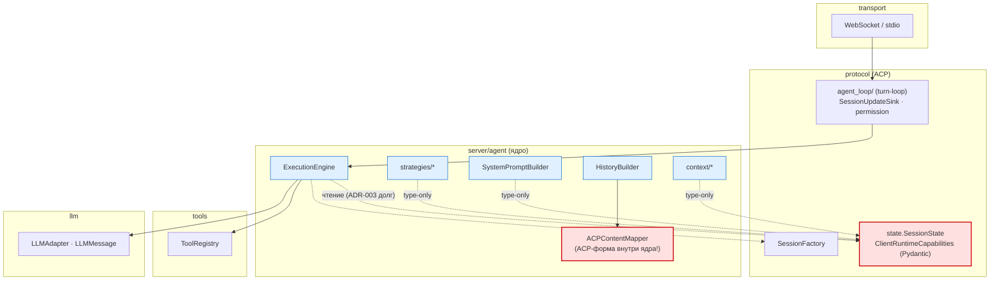
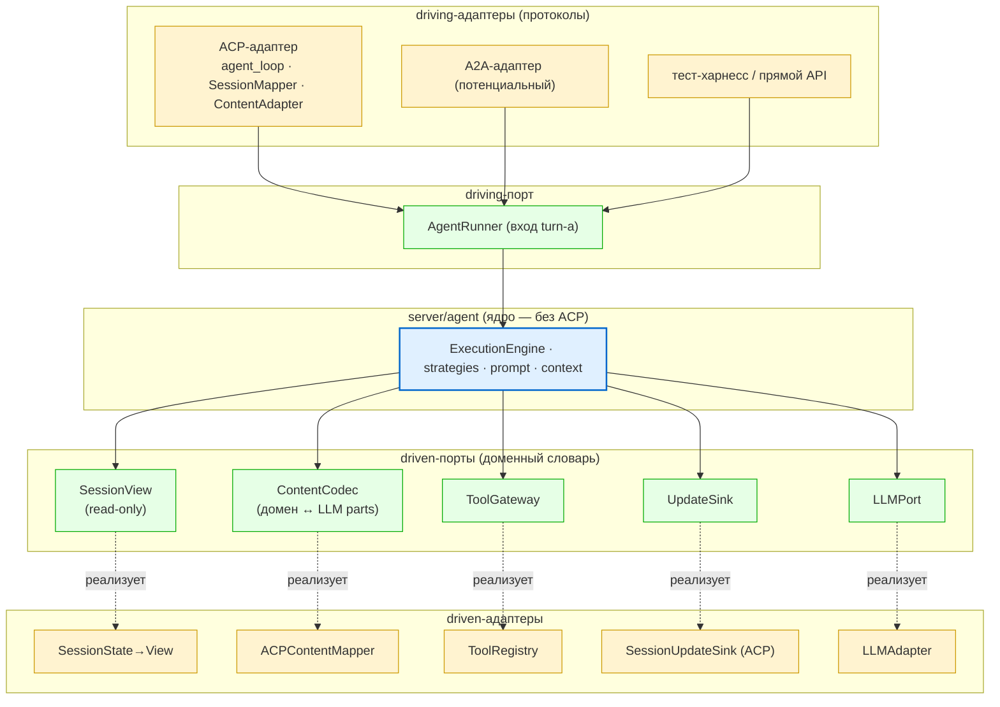

# ADR-005: ACP-независимое ядро агента (hexagonal driven-ports)

**Дата:** 22 июля 2026
**Статус:** Предложено
**Контекст:** Связь ядра агента (`server/agent/`) с ACP-обвязкой (`server/protocol/`)
**Авторы:** —
**Связанные документы:**
- ADR-003 — миграция `SessionState` в domain (вариант B, read-фаза = порт `SessionView`)
- ADR-001 — `LLMAdapter` single-call (уже существующая граница LLM)
- `src/codelab/server/agent/` — ядро: `ExecutionEngine`, `strategies`, `system_prompt_builder`, `history_builder`, `context/`
- `src/codelab/server/agent/acp_content_mapper.py` — `ACPContentMapper` (ACP-форма контента внутри ядра)
- `src/codelab/server/protocol/handlers/pipeline/stages/agent_loop/` — turn-loop (driving-адаптер)
- `pyproject.toml` — `[tool.importlinter]`, контракт «Server layers»
- tech-debt P2-32 (дублирование capabilities), P1-33 (конфиг)

---

## Контекст

Вопрос: можно ли сделать ядро агента независимым от ACP-обвязки, чтобы его можно было
исполнять под другим драйвером (A2A, прямой API, тест-харнесс) без ACP?

Анализ фактических импортов `server/agent/` показал, что ядро **уже структурно отделено
на ~80%**: turn-loop, эмиссия `SessionUpdate` и permission-flow живут **не** в `agent/`,
а в `protocol/handlers/pipeline/stages/agent_loop/`. Протокол *вызывает* ядро, а не наоборот.

### Фактические швы связи ядра с ACP

| # | Шов | Где | Оценка |
|---|-----|-----|--------|
| 1 | `protocol.state.SessionState` / `ClientRuntimeCapabilities` | `base`, `execution_engine`, `strategies/*`, `system_prompt_builder`, `file_cache_decorator`, `tool_filter` (type-only) | = долг ADR-003 |
| 2 | `ACPContentMapper` | `agent/acp_content_mapper.py`, используется `history_builder` | **ACP-форма контента внутри ядра — главный шов** |
| 3 | `protocol.session_factory.SessionFactory` | `context/child_session` | тип фабрики |

Уже развязано (НЕ ACP):
- `ToolRegistry` — из `server.tools.base` (ACP-I/O спрятан за абстракцией tools).
- `LLMAdapter` / `llm.models.LLMMessage` — самостоятельная граница (ADR-001).
- Turn-loop / `SessionUpdateSink` / permission — в `protocol/`, ядра не касаются.

Вывод: «дорогая» часть независимости — не `SessionState` (спроектировано в ADR-003), а
`ACPContentMapper` (шов №2), которого в ADR-003 нет.

## Как сейчас

## Целевое решение — гексагон с driven-портами

Ядро зависит только от портов в **доменном словаре**; ACP становится **одним** адаптером.

### Порты

| Порт (владеет agent/domain) | Заменяет | Статус |
|---|---|---|
| `SessionView` (read-only, домен) | `SessionState` | спроектирован в ADR-003 (вариант B, read-фаза) |
| `ContentCodec` (домен ↔ LLM parts) | `ACPContentMapper` внутри agent | **новый шов — главная работа** |
| `ToolGateway` | `ToolRegistry` | уже фактически порт |
| `UpdateSink` | `SessionUpdateSink` | эмиссия обновлений за портом |
| `LLMPort` | `LLMAdapter` | уже порт (ADR-001) |
| `AgentRunner` (driving) | точка входа turn-а | turn-loop становится адаптером |

## Последствия

- **Инверсия направления:** было `agent → protocol.state`, станет `agent → порт ← ACP-адаптер`.
  Цель по `import-linter` — рёбер `agent → protocol` **ноль** (сейчас в `ignore_imports`).
- `ACPContentMapper` и `SessionState→View` **уезжают из ядра** в driven-адаптеры (`protocol/`).
- Turn-loop из `protocol` — driving-адаптер за портом `AgentRunner`; рядом подключаются A2A/тесты.
- **Стоимость / оговорки:**
  - Главная работа — `ContentCodec`, а не `SessionState`. Ядру нужен собственный content-VO
    (или канон `llm.ContentPart`), ACP-форма мапится на границе.
  - Дублирование представлений (как capabilities, tech-debt P2-32) — цена синхронизации
    ещё одного маппера, риск асимметрии (ср. схлопывание роли `tool` в `SessionMapper`).
  - CLAUDE.md фиксирует «всё I/O через ACP `ToolRegistry`» для context-manager. Формально
    не мешает (`ToolRegistry` = порт, ACP за ним), но правило нужно читать как «через
    `ToolGateway`-порт».
  - **Оправданность зависит от второго драйвера.** У проекта есть A2A и roadmap на hosted
    multi-user — второй потребитель ядра правдоподобен, тогда независимость окупается. Без
    него — YAGNI-риск: инверсия под гипотетический драйвер дороже осознанного одного шва (ACP).

## Порядок работ (инкрементально, без большого взрыва)

1. **ADR-003 read-фаза** (`SessionView`) — снимает шов №1; ядро говорит доменным словарём про сессию.
2. **`ContentCodec`** — вынести `ACPContentMapper` за порт (шов №2). Самый весомый шаг к «без ACP».
3. **`ToolGateway` / `UpdateSink`** — формализовать как порты (в основном сужение/переименование существующего).
4. **`AgentRunner`** — turn-loop оформить как driving-адаптер; проверить `import-linter`
   (цель: `agent → protocol` = 0), ACP-адаптер живёт в `protocol/`.

## Связь с долгом

- ADR-003 (вариант B, read-фаза) — предусловие шага 1.
- tech-debt P2-32 (capabilities) — тот же класс дублирования, что и content.
- Полная реализация — отдельный эпик, соразмерный появлению второго драйвера.
