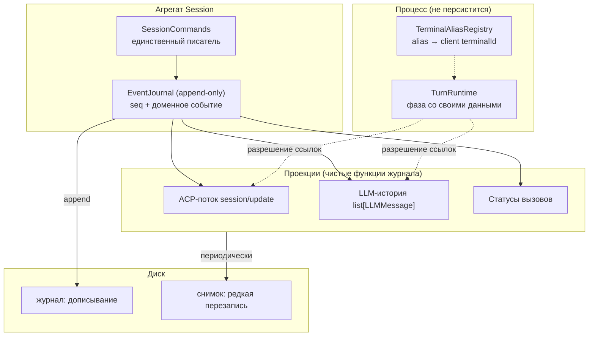

# ADR-008. Журнал как единственный источник, проекции как виды

**Статус:** черновик (2026-08-06)

**Связано:** ADR-003 (домен независим от ACP), ADR-006 (фазы write-пути, постоянные wire-границы),
ADR-007 (владение состоянием сессии), `openspec/changes/session-hot-cold-split/`,
`openspec/changes/multimodal-tool-results/` (такт 2), tech-debt P2-42, P2-46, P2-55, P2-58, P1-56.

## Контекст

ADR-007 разложил «расщепление горячего и холодного» на три оси: носитель, избыточность,
гранулярность записи. Разведка B2 и разбор живого прогона 2026-08-06 (`pid 62680`,
`sess_232a2ca43bec`) дали пять находок, и все пять — следствия одной причины, а не независимые
дефекты.

**Измерено, а не выведено:**

* **Тройная копия.** Документ `sess_7512e714be29` (v10, ревизия 283, 302 230 Б, 31 вызов): из 29
  крупных уникальных текстов 28 присутствуют во всех трёх коллекциях, вес датума байт-в-байт
  одинаков в каждой — 61 537 Б. Итого 184 611 Б = **61.1% документа занимает один датум в трёх
  копиях**. Единственный источник даёт ≈179 КБ вместо 302 КБ.
* **Два пространства идентификаторов.** В `sess_232a2ca43bec` коллекции `tool_calls` и
  `events_history` ключуются ACP-идентификаторами (`call_001`…`call_004`), а `history` — как
  `role=tool.tool_call_id`, так и `assistant.tool_calls[].id` — идентификаторами модели
  (`chatcmpl-tool-…`). В `sess_7512e714be29` **все три** использовали идентификатор модели. Ключ
  коллекции — тот, который передал создатель.
* **Фаза turn'а лжёт.** `active_turn.phase = "awaiting_permission"` при
  `permission_request_id = null` и `permission_tool_call_id = null`, когда оба разрешения давно
  отвечены и последующие вызовы завершены. Причина в коде: `prompt/permission_response.py:62-63`
  снимает оба идентификатора и **не возвращает** фазу в `running`, хотя матрица переходов такой
  переход разрешает (`turn_lifecycle_manager.py:341-342`).
* **`term_1` выдан дважды в одной сессии** — Context Manager'ом (07:03:27) и моделью (07:09:30),
  разным терминалам, в одном процессе, без рестарта. `terminal_counter` в документе равен 2 и
  покрывает только вызовы модели.
* **348 клиентских `fs/read_text_file` не оставили в состоянии ни одной записи.**

### Общая причина

`SessionDocument` смешивает три сущности с несовместимыми законами жизни:

| Сущность | Закон | Частота изменений | Должна переживать рестарт |
|---|---|---|---|
| **Журнал** (что произошло) | append-only, неизменяем | +N за turn | да |
| **Проекции** (статусы, история для LLM, ACP-поток) | производное, восстановимо | пересчитываются | нет |
| **Горячее** (`active_turn`, фаза, permission-ожидание, alias'ы) | mutable, привязано к процессу | много раз в секунду | **нет** |

Смешение объясняет каждую находку. Тройная копия — три проекции, записанные как независимые
источники. Два пространства id — нет слоя, где идентичность определяется один раз, поэтому её
доопределяет каждый потребитель (`effective_id = tool_call_id_from_llm or tool_call_id` — восемь раз
в `tool_processor.py`, плюс `session.py:104` и `tool_call_handler.py:251`). Врущая фаза — mutable-поле
без инварианта, персистируемое как факт. Двойной `term_1` — распределитель идентификаторов лежит в
документе, а инкремент теряется на пути, который документ не сохраняет.

## Решение

### 1. Журнал доменных событий — единственный источник; проекции — виды

Единственный источник истины — упорядоченный журнал **доменных** событий. `tool_calls`, `history`,
`events_history` перестают быть источниками и становятся проекциями: чистыми функциями журнала (плюс
горячего состояния — для разрешения ссылок на эфемерные ресурсы, шаг A.2 ADR-007).

Инвариант: **проекцию всегда можно выбросить и пересчитать.** Она хранится как кеш, не как истина.

Опора на известные решения: event sourcing / CQRS (журнал + read models), log-structured storage со
снимками (SQLite WAL, Kafka log compaction, git objects+refs), явный перевод идентичности на границе
(idempotency keys, `Correlation-Id`).



**Развилка с ADR-006 закрыта явно.** `event_history_writer.py` объявляет себя «постоянной
wire-границей (ADR-006)», и элементы `events_history` — готовые ACP-нотификации в camelCase. Это
решение **отменяется**: журнал становится доменным, ACP — проекцией. Замер цены (2026-08-06)
показал, что связанность узкая: форму элемента журнала знают три места, и работу делает одно —
`session_replayer.py:73-87`, где реплей сейчас pass-through. 134 упоминания `sessionUpdate`/
`toolCallId` в 36 файлах — это обычный путь нотификаций, а не читатели журнала.

### 2. Идентичность вызова: три роли, один владелец

| Роль | Кто задаёт | Где живёт |
|---|---|---|
| **Внутренняя** `ToolCallId` | агрегат (`tool_call_counter`) | ключ журнала и всех проекций |
| **LLM-корреляция** | ответ модели (`chatcmpl-…`) | атрибут события создания |
| **ACP-идентификатор** | то, что уходит клиенту | атрибут проекции |

`ToolCallId` — единственный ключ. Внешние идентификаторы становятся атрибутами события
`ToolCallStarted{id, llm_id, acp_id}`, перевод делает один компонент внутри агрегата. Десять мест с
`a or b` удаляются, потому что выбирать нечего.

Почему не сделать `chatcmpl-…` единым ключом: это чужое пространство имён, которым мы не управляем,
и его нет на путях без LLM (отмена, ответ клиента, служебные вызовы).

### 3. Фаза turn'а: illegal states unrepresentable

Фаза несёт свои данные:

```python
type TurnPhase = (
    Running
    | AwaitingPermission   # request_id, tool_call_id — обязательные поля
    | AwaitingClientRpc    # request_id
    | Cancelling
    | Completing
)
```

«Жду разрешения, но не знаю какого» перестаёт быть выразимым: снятие идентификаторов **есть**
переход в `Running`. Это устраняет и различение «процесс умер на реальной паузе» против
«идентификатор не сняли», которое сейчас требует покадрового снимка файла сессии (P2-46), и
расхождение `waiting_permission`/`awaiting_permission`, помеченное долгом в `domain/session.py:306`.

Правка «дописать `phase = "running"`» отклонена: лечит один сайт, оставляет механизм.

`TurnPhase` — горячее состояние, живёт в процессе. На диск уезжают доменные события
`TurnPaused`/`TurnResumed`, если они нужны реплею.

### 4. Alias'ы терминалов: уникальность по конструкции

**Решение (2026-08-06): alias включает идентификатор процесса** — `term_<epoch>_<n>`.

Постановка «Context Manager аллоцирует мимо сейма» **опровергнута кодом**: оба пути идут через
`TerminalAliasRegistry.register()` → `Session.allocate_terminal_alias()`. Дефект — потерянная запись:
Context Manager мутирует переданный объект сессии, и на его пути мутация не сохраняется, тогда как в
turn-пути её доносит слияние `tool_processor.py:69-70`. Отсюда `term_1` дважды и счётчик 2 вместо 3.

Эпоха убирает саму потребность персистировать счётчик: столкновение alias'а из восстановленной
истории с живым становится невозможным **по построению**, а не маловероятным. Решение ADR-007 A.1.2
(счётчик остаётся в документе) тем самым становится ненужным, и шаг A доводится до конца.

Цена проверена по коду: **формат alias'а нигде не парсится** — `register` возвращает строку,
`resolve`/`release` ищут её в словаре. Исходное ограничение (tech-debt #18) — краткость, не
монотонность: модель теряла символы, ретранслируя 36-символьный UUID. `term_7_3` — 8 символов.
Детерминизм prompt cache сохраняется: выданные alias'ы в истории не переписываются.

Отклонено — «персистировать счётчик честно со всех путей»: требует обязательной записи на горячем
пути сбора контекста, у которого graceful degradation заявлена принципом, и оставляет гарантию
дисциплинарной.

### 5. Носитель: сначала порт, потом бэкенд

**Решение (2026-08-06): сменить порт хранилища, реализовать JSONL-журнал + JSON-снимок; SQLite
отложить.**

Сегодняшний порт документо-ориентирован (`save_session(document)` / `load_session(id)`). Журналу
нужен другой:

```
append_events(session_id, events, expected_seq) -> seq
read_events(session_id, after_seq) -> list[Event]
save_snapshot(session_id, snapshot, at_seq)
load_snapshot(session_id) -> (snapshot, seq) | None
```

Вся стоимость шага здесь; после смены порта выбор бэкенда — обратимая замена реализации (`memory`
обслуживает тесты, `json_file` — читаемость). `seq` монотонен в сессии и даёт дешёвый CAS
(«ожидаю `seq=N`») вместо сверки ревизии целого документа — основа для нескольких воркеров хостинга.

Почему JSONL первым: приёмка шагов в этом проекте — живой прогон и **разбор документа сессии
глазами**. Все пять находок этого ADR получены чтением файла; с SQLite каждая стоила бы дороже.
Читаемость носителя здесь часть рабочего процесса, а не удобство.

SQLite (`sqlite3` — stdlib, новой зависимости нет) осмыслен там, где появляются конкурентные
писатели, то есть в многопользовательском хостинге. Это отдельное решение с другими требованиями;
с расщеплением не смешивается.

### 6. Клиентские RPC в журнал не попадают

348 `fs/read_text_file` за прогон — исполнение инструмента, а не факт диалога. В журнал попадает
только то, что модель или пользователь увидят при реплее; наблюдаемость чтений — в
`data/observability/`, которая уже существует. Решение принимается явно, чтобы «журнал — единственный
источник» не оказалось неправдой.

## Отклонённые варианты

* **Оставить три коллекции и синхронизировать аккуратнее.** Это делается сейчас; сессия дала три
  дефекта именно на рассинхроне. Синхронизация N копий дисциплиной не масштабируется.
* **Чистый event sourcing без снимка.** Реплей на `session/load` стал бы O(журнал) при сессиях на
  сотни событий. Снимок обязателен — это гибрид.
* **`chatcmpl-…` как единый ключ.** Впускает чужое пространство имён в агрегат, отсутствует на
  путях без LLM.
* **Присваивание `phase = "running"` в обработчике разрешения.** Симптоматическая правка.

## Порядок работ

Порядок вынужденный: каждый шаг самостоятельно ценен и проверяем, но следующий опирается на
предыдущий.

| Шаг | Содержание | Почему здесь |
|---|---|---|
| 1 | `ToolCallId` + перевод идентичности в одном компоненте | до журнала: иначе журнал унаследует два пространства ключей и потребует двух миграций |
| 2 | `TurnPhase` как размеченное объединение | независим от журнала, чинит найденный дефект по конструкции, малый |
| 3 | Журнал доменных событий + проекция ACP | здесь отменяется запись ADR-006 о постоянной wire-границе и решается судьба `session_info_update` |
| 4 | Проекции `history` и статусов | тройная копия исчезает |
| 5 | Горячее уезжает из документа: `TurnRuntime`, alias'ы с эпохой | завершает шаг A ADR-007 |
| 6 | Гранулярность записи: журнал дописывается, снимок редок | окупается только после 4 |

**Гейты на каждом шаге**, помимо `make check` и `lint-imports`:

* golden-тест байт-идентичности wire-нотификаций и LLM-payload'а (иначе рушится prompt cache);
* тест «проекция из журнала == текущее состояние» на записанных сессиях;
* живой прогон `--stdio` через Zed с разбором `~/.codelab/logs/*`.

**Отдельно про приёмку статусов.** Ни в одном замере до сих пор нет статусов `cancelled` и `failed`:
отмена 2026-08-06 пришлась на turn без вызовов инструментов. Дешёвый способ их получить — **отказ в
разрешении**: `permission_response.py:74` даёт `ToolCallStatus.CANCELLED`. Шаг 4 не считается
закрытым без прогона с отказом.

## Что осталось за рамками

* **P1-56** (гейт разрешений у вызывающего) — отложен решением пользователя 2026-08-06, заблокирован
  вопросом политики разрешений целиком.
* **Такт 2 `multimodal-tool-results`** — заблокирован; шаг 4 обязан задать для `role=tool` форму
  `content: list[dict]`, иначе такт будет заблокирован повторно уже своей проекцией.
* **Вторая половина P2-58** (владение освобождением терминалов) — прогон 2026-08-06 уточнил:
  Context Manager создаёт 2 и освобождает 2, turn-путь создаёт 2 и освобождает 0. Течёт turn-путь.
* **SQLite-бэкенд** — под многопользовательский хостинг, за тем же портом.
