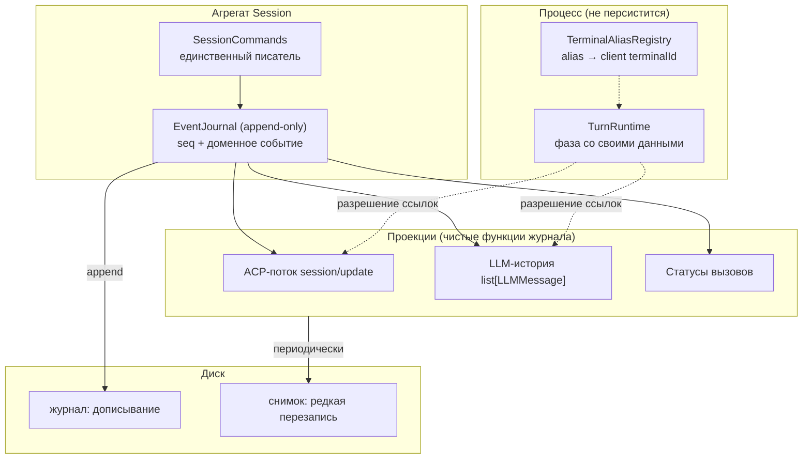

# ADR-008. Журнал как единственный источник, проекции как виды

**Статус:** черновик (2026-08-06)

**Связано:** ADR-003 (домен независим от ACP), ADR-006 (фазы write-пути, постоянные wire-границы),
ADR-007 (владение состоянием сессии), `openspec/changes/session-hot-cold-split/`,
`openspec/changes/multimodal-tool-results/` (такт 2), tech-debt P2-42, P2-46, P2-55, P2-58, P1-56, P1-61.

## Контекст

ADR-007 разложил «расщепление горячего и холодного» на три оси: носитель, избыточность,
гранулярность записи. Разведка B2 и разбор живого прогона 2026-08-06 (`pid 62680`,
`sess_232a2ca43bec`) дали пять находок, и все пять — следствия одной причины, а не независимые
дефекты.

**Измерено, а не выведено:**

* **Тройная копия.** Документ `sess_7512e714be29` (v10, ревизия 283, 302 230 Б, 31 вызов): из 29
  крупных уникальных текстов 28 присутствуют во всех трёх коллекциях, вес датума байт-в-байт
  одинаков в каждой — 61 537 Б. Итого 184 611 Б = **61.1% документа занимает один датум в трёх
  копиях**. Единственный источник даёт ≈179 КБ вместо 302 КБ.
* **Два пространства идентификаторов, но не две конвенции.** `tool_calls` и `events_history`
  ключуются ACP-идентификаторами (`call_001`…`call_004`), `history` — идентификаторами модели
  (`chatcmpl-tool-…`), и то же в `assistant.tool_calls[].id`. Мост существует и персистируется:
  `tool_calls[call_001].tool_call_id_from_llm = "chatcmpl-tool-998a85…"`.

  > **Первая формулировка этого пункта опровергнута разведкой на коде (2026-08-06).** Я утверждал,
  > что ключ коллекции — «тот, который передал создатель», и что в `sess_7512e714be29` все три
  > коллекции использовали идентификатор модели. И то, и другое неверно. Единственный путь создания
  > вызова — `ToolCallRegistry.create` (`domain/session.py:116-117`), он всегда выдаёт
  > `call_{counter:03d}`; `update` и `update_status` при неизвестном id ничего не вставляют. Ключами
  > `tool_calls` не могут быть `chatcmpl-…`. Строки `chatcmpl-…`, по которым я это заключил,
  > печатались из записей `history`; ключи `tool_calls` того документа я не печатал.
  >
  > **Что осталось настоящим дефектом после проверки:** перевод «внутренняя идентичность → идентичность
  > для модели» продублирован **десятью** одинаковыми выражениями `tool_call_id_from_llm or tool_call_id`
  > (восемь в `tool_processor.py`, плюс `session.py:104`, `tool_call_handler.py:251`), и **обратного
  > индекса** `llm_id → ToolCallId` не существует. Каждое из десяти мест семантически верно:
  > ответ модели адресуется её идентификатором, а fallback покрывает пути, где его нет вовсе
  > (client-RPC, отмена, служебные вызовы). Проблема не в конвенции, а в том, что перевод не
  > принадлежит никому и не имеет обратной стороны, — а именно она понадобится проекции `history`.
* **Фаза turn'а лжёт.** `active_turn.phase = "awaiting_permission"` при
  `permission_request_id = null` и `permission_tool_call_id = null`, когда оба разрешения давно
  отвечены и последующие вызовы завершены. Причина в коде: `prompt/permission_response.py:62-63`
  снимает оба идентификатора и **не возвращает** фазу в `running`, хотя матрица переходов такой
  переход разрешает (`turn_lifecycle_manager.py:341-342`).
* **`term_1` выдан дважды в одной сессии** — Context Manager'ом (07:03:27) и моделью (07:09:30),
  разным терминалам, в одном процессе, без рестарта. `terminal_counter` в документе равен 2 и
  покрывает только вызовы модели.
* **348 клиентских `fs/read_text_file` не оставили в состоянии ни одной записи.**

### Общая причина

`SessionDocument` смешивает три сущности с несовместимыми законами жизни:

| Сущность | Закон | Частота изменений | Должна переживать рестарт |
|---|---|---|---|
| **Журнал** (что произошло) | append-only, неизменяем | +N за turn | да |
| **Проекции** (статусы, история для LLM, ACP-поток) | производное, восстановимо | пересчитываются | нет |
| **Горячее** (`active_turn`, фаза, permission-ожидание, alias'ы) | mutable, привязано к процессу | много раз в секунду | **нет** |

Смешение объясняет каждую находку. Тройная копия — три проекции, записанные как независимые
источники. Два пространства id — нет слоя, где идентичность определяется один раз, поэтому её
доопределяет каждый потребитель (`effective_id = tool_call_id_from_llm or tool_call_id` — восемь раз
в `tool_processor.py`, плюс `session.py:104` и `tool_call_handler.py:251`). Врущая фаза — mutable-поле
без инварианта, персистируемое как факт. Двойной `term_1` — распределитель идентификаторов лежит в
документе, а инкремент теряется на пути, который документ не сохраняет.

## Решение

### 1. Журнал доменных событий — единственный источник; проекции — виды

Единственный источник истины — упорядоченный журнал **доменных** событий. `tool_calls`, `history`,
`events_history` перестают быть источниками и становятся проекциями: чистыми функциями журнала (плюс
горячего состояния — для разрешения ссылок на эфемерные ресурсы, шаг A.2 ADR-007).

Инвариант: **проекцию всегда можно выбросить и пересчитать.** Она хранится как кеш, не как истина.

Опора на известные решения: event sourcing / CQRS (журнал + read models), log-structured storage со
снимками (SQLite WAL, Kafka log compaction, git objects+refs), явный перевод идентичности на границе
(idempotency keys, `Correlation-Id`).



**Развилка с ADR-006 закрыта явно.** `event_history_writer.py` объявляет себя «постоянной
wire-границей (ADR-006)», и элементы `events_history` — готовые ACP-нотификации в camelCase. Это
решение **отменяется**: журнал становится доменным, ACP — проекцией. Замер цены (2026-08-06)
показал, что связанность узкая: форму элемента журнала знают три места, и работу делает одно —
`session_replayer.py:73-87`, где реплей сейчас pass-through. 134 упоминания `sessionUpdate`/
`toolCallId` в 36 файлах — это обычный путь нотификаций, а не читатели журнала.

### 2. Идентичность вызова: три роли, один владелец

| Роль | Кто задаёт | Где живёт |
|---|---|---|
| **Внутренняя** `ToolCallId` | агрегат (`tool_call_counter`) | ключ журнала и всех проекций |
| **LLM-корреляция** | ответ модели (`chatcmpl-…`) | атрибут события создания |
| **ACP-идентификатор** | то, что уходит клиенту | атрибут проекции |

`ToolCallId` — единственный ключ; **им он уже фактически является** (`call_{counter:03d}` из
единственного пути создания), поэтому миграция ключей документа не нужна — это уточнение разведки,
и оно сокращает шаг.

Вводится ровно то, чего нет:

1. **Владелец перевода.** Один аксессор в домене (`ToolCall.answer_id` — «идентификатор, которым
   вызов адресуется модели»), инкапсулирующий `tool_call_id_from_llm or id`. Десять дублирующих
   выражений заменяются на обращение к нему; поведение не меняется, включая fallback для путей без
   LLM.
2. **Обратный индекс** `llm_id → ToolCallId` — нужен проекции `history`, но **вводится вместе с ней
   (шаг 4), а не здесь**: индекс без потребителя — то же «поле без читателя», на котором проект уже
   дважды обжигался (`result_content`, `terminals_owner`). Дополнительное условие для него: сегодня
   `session_mapper.py:297` пишет в `ToolCallRegistry.calls` напрямую, минуя реестр, поэтому хранимый
   индекс рассинхронизировался бы при загрузке. Инкапсуляцию `calls` придётся закрыть тем же шагом.

Почему не сделать `chatcmpl-…` единым ключом: это чужое пространство имён, которым мы не управляем,
и его нет на путях без LLM (отмена, ответ клиента, служебные вызовы) — там `answer_id` и падает на
внутренний идентификатор.

### 3. Фаза turn'а: illegal states unrepresentable

Фаза несёт свои данные:

```python
type TurnPhase = (
    Running
    | AwaitingPermission   # request_id, tool_call_id — обязательные поля
    | AwaitingClientRpc    # request_id
    | Cancelling
    | Completing
)
```

«Жду разрешения, но не знаю какого» перестаёт быть выразимым: снятие идентификаторов **есть**
переход в `Running`. Это устраняет и различение «процесс умер на реальной паузе» против
«идентификатор не сняли», которое сейчас требует покадрового снимка файла сессии (P2-46), и
расхождение `waiting_permission`/`awaiting_permission`, помеченное долгом в `domain/session.py:306`.

Правка «дописать `phase = "running"`» отклонена: лечит один сайт, оставляет механизм.

`TurnPhase` — горячее состояние, живёт в процессе. На диск уезжают доменные события
`TurnPaused`/`TurnResumed`, если они нужны реплею.

### 4. Alias'ы терминалов: уникальность по конструкции

**Решение (2026-08-06): alias включает идентификатор процесса** — `term_<epoch>_<n>`.

Постановка «Context Manager аллоцирует мимо сейма» **опровергнута кодом**: оба пути идут через
`TerminalAliasRegistry.register()` → `Session.allocate_terminal_alias()`. Дефект — потерянная запись:
Context Manager мутирует переданный объект сессии, и на его пути мутация не сохраняется, тогда как в
turn-пути её доносит слияние `tool_processor.py:69-70`. Отсюда `term_1` дважды и счётчик 2 вместо 3.

Эпоха убирает саму потребность персистировать счётчик: столкновение alias'а из восстановленной
истории с живым становится невозможным **по построению**, а не маловероятным. Решение ADR-007 A.1.2
(счётчик остаётся в документе) тем самым становится ненужным, и шаг A доводится до конца.

Цена проверена по коду: **формат alias'а нигде не парсится** — `register` возвращает строку,
`resolve`/`release` ищут её в словаре. Исходное ограничение (tech-debt #18) — краткость, не
монотонность: модель теряла символы, ретранслируя 36-символьный UUID. `term_7_3` — 8 символов.
Детерминизм prompt cache сохраняется: выданные alias'ы в истории не переписываются.

Отклонено — «персистировать счётчик честно со всех путей»: требует обязательной записи на горячем
пути сбора контекста, у которого graceful degradation заявлена принципом, и оставляет гарантию
дисциплинарной.

### 5. Носитель: сначала порт, потом бэкенд

**Решение (2026-08-06): сменить порт хранилища, реализовать JSONL-журнал + JSON-снимок; SQLite
отложить.**

Сегодняшний порт документо-ориентирован (`save_session(document)` / `load_session(id)`). Журналу
нужен другой:

```
append_events(session_id, events, expected_seq) -> seq
read_events(session_id, after_seq) -> list[Event]
save_snapshot(session_id, snapshot, at_seq)
load_snapshot(session_id) -> (snapshot, seq) | None
```

Вся стоимость шага здесь; после смены порта выбор бэкенда — обратимая замена реализации (`memory`
обслуживает тесты, `json_file` — читаемость). `seq` монотонен в сессии и даёт дешёвый CAS
(«ожидаю `seq=N`») вместо сверки ревизии целого документа — основа для нескольких воркеров хостинга.

Почему JSONL первым: приёмка шагов в этом проекте — живой прогон и **разбор документа сессии
глазами**. Все пять находок этого ADR получены чтением файла; с SQLite каждая стоила бы дороже.
Читаемость носителя здесь часть рабочего процесса, а не удобство.

SQLite (`sqlite3` — stdlib, новой зависимости нет) осмыслен там, где появляются конкурентные
писатели, то есть в многопользовательском хостинге. Это отдельное решение с другими требованиями;
с расщеплением не смешивается.

### 6. Клиентские RPC в журнал не попадают

348 `fs/read_text_file` за прогон — исполнение инструмента, а не факт диалога. В журнал попадает
только то, что модель или пользователь увидят при реплее; наблюдаемость чтений — в
`data/observability/`, которая уже существует. Решение принимается явно, чтобы «журнал — единственный
источник» не оказалось неправдой.

### 7. Ожидание разрешения — процессное состояние, ключ — идентификатор запроса

**Решение (2026-08-07): множество незакрытых запросов в процессном реестре вместо одного слота в
документе.** Основание — живой прогон, потерявший вызов (P1-61), и **прямое требование
спецификации**, которое проект до сих пор не выполнял (`05-Prompt Turn.md:301`):

> The Client **MUST** respond to **all pending** `session/request_permission` requests with the
> `cancelled` outcome.

`all pending` — множественное число. Один слот на turn противоречит протоколу, который мы
реализуем; матрица шага 2 это обнажила, отклонив законный переход
`AwaitingPermission → AwaitingPermission`.

**Три факта проверены по коду, а не выведены:**

1. `PendingRequestRegistry` (`protocol/pending_registry.py`) уже существует и описан как «реестр
   ожидающих `asyncio.Future` **для permission requests**, которые не должны присутствовать в
   персистируемом `SessionDocument`». То есть решение однажды уже было принято — и не доведено.
2. **У реестра нет писателя:** `create()` в продакшене не вызывается ни разу, вызывается только
   `has()` — в `session_load.py:105`. Реестр всегда пуст, поэтому ветка «сирота» срабатывает при
   любом незакрытом разрешении. Зеркальный случай `result_content`: не поле без читателя, а реестр
   без писателя.
3. **Персистированная корреляция ничего не даёт через рестарт:** там же, где `has()` отвечает
   `False`, `active_turn` очищается. `permission_request_id` переживает рестарт затем, чтобы быть
   выброшенным.

**Опора на известную модель.** В Claude Code разрешение — свойство конкретной инвокации
инструмента, а не состояние сессии: решение запрашивается на каждый вызов, ожидание живёт у того,
кто ждёт (континуация), несколько проверок висят одновременно, а на диск уходят **правила**
(allow_always) и **исходы**, но никогда «кто на что сейчас ждёт»; рестарт убивает незавершённые
ожидания по определению. Это же — корректный JSON-RPC: корреляция ответа с запросом принадлежит
уровню транспорта и ключуется идентификатором запроса, а не состоянию домена.

**И этот проект уже принимал такое решение однажды.** ADR-007, шаг A: связка alias'ов терминалов
уехала из документа в процессный реестр, потому что «осмысленна только внутри процесса, который её
создал». Ожидание разрешения — та же форма, третий жилец того же переезда.

Устройство:

* `build_permission_request` регистрирует запрос в `PendingRequestRegistry` — реестр получает
  писателя, ради которого написан. Запись несёт корреляцию `request_id → (session_id, tool_call_id)`.
* Маршрутизация ответа идёт через реестр за O(1) по идентификатору вместо нынешнего перебора всех
  сессий из хранилища (`find_session_by_permission_request_id`). Побочно исчезает линейный скан
  диска на каждый ответ.
* `AwaitingPermission` несёт **непустое множество** незакрытых запросов вместо одного. Тогда
  `AwaitingPermission → AwaitingPermission` — законный переход («к ожиданию присоединился ещё
  один»), и матрица перестаёт отклонять разрешённое протоколом. Инвариант шага 2 сохраняется
  полностью: «жду разрешения, не зная какого» по-прежнему невыразимо, потому что множество не
  может быть пустым.
* На отмене закрываются **все** незакрытые запросы, как требует спецификация, а не один.
* На загрузке сессии незакрытое разрешение закрывается детерминированно — как и сейчас, но теперь
  это следствие модели (континуаций после рестарта не существует), а не потеря.

Граница проходит по той же линии, что и в таблице «журнал / проекции / горячее»:

| Живёт в процессе | Персистируется |
|---|---|
| Множество незакрытых запросов, `request_id → (session, tool_call)` | Политики разрешений (`permission_policy`, allow_always) |
| Континуация ожидания | Исход вызова: статус `ToolCall`, ответ `role: tool` |
| Фаза turn'а | Надгробия отменённых запросов (`cancelled_permission_requests`) |

Надгробия остаются на диске сознательно: это **исход**, а не ожидание, и поздний ответ может
прийти после рестарта.

Отклонено:

* **Разрешить самопереход в матрице.** Вернёт прежнее поведение — побеждает новый запрос, молча
  теряется старый. Лечит строку лога, а не дефект.
* **Не запускать второй цикл, пока висит разрешение.** Сериализует агента ради дефекта состояния;
  меняет поведение шире, чем требуется, и не выполняет требование спецификации о нескольких
  незакрытых запросах.

## Отклонённые варианты

* **Оставить три коллекции и синхронизировать аккуратнее.** Это делается сейчас; сессия дала три
  дефекта именно на рассинхроне. Синхронизация N копий дисциплиной не масштабируется.
* **Чистый event sourcing без снимка.** Реплей на `session/load` стал бы O(журнал) при сессиях на
  сотни событий. Снимок обязателен — это гибрид.
* **`chatcmpl-…` как единый ключ.** Впускает чужое пространство имён в агрегат, отсутствует на
  путях без LLM.
* **Присваивание `phase = "running"` в обработчике разрешения.** Симптоматическая правка.

## Порядок работ

Порядок вынужденный: каждый шаг самостоятельно ценен и проверяем, но следующий опирается на
предыдущий.

| Шаг | Содержание | Почему здесь |
|---|---|---|
| 1 | `answer_id` как владелец перевода + обратный индекс `llm_id → ToolCallId` | до журнала: проекции `history` обратный индекс нужен по построению. Разведка сняла из шага миграцию ключей — они уже единообразны |
| 2 | `TurnPhase` как размеченное объединение | независим от журнала, чинит найденный дефект по конструкции, малый |
| 3a | Доменная модель события + проекция ACP; формат документа не меняется | здесь отменяется запись ADR-006 о постоянной wire-границе и решается судьба `session_info_update`. Приёмка — уже снятый golden-гейт, миграции нет |
| 3b | Формат хранения становится доменным: `schema_version` 10→11, миграция, терпимый читатель старых документов | после 3a это механическая замена сериализации: модель и проекции уже на месте |
| 5 | Горячее уезжает из документа: `TurnRuntime`, alias'ы с эпохой, **множество незакрытых разрешений** (раздел 7), **освобождение терминалов на границе turn'а** | завершает шаг A ADR-007. **Поднят перед шагом 4 решением 2026-08-07:** шаг 4 про объём документа, а здесь — потеря вызова и несоответствие спецификации (P1-61). Кроме того, шаг 4 обязан выдать `role: tool` на каждый вызов, а потерянный вызов его не получает |
| 4 | Проекции `history` и статусов | тройная копия исчезает |
| 6 | Гранулярность записи: журнал дописывается, снимок редок | окупается только после 4 |

**Гейты на каждом шаге**, помимо `make check` и `lint-imports`:

* golden-тест байт-идентичности wire-нотификаций и LLM-payload'а (иначе рушится prompt cache);
* тест «проекция из журнала == текущее состояние» на записанных сессиях;
* живой прогон `--stdio` через Zed с разбором `~/.codelab/logs/*`.

**Отдельно про приёмку статусов — дыра закрыта полем (2026-08-07).** Прежняя запись гласила, что
`cancelled` и `failed` не встречались ни в одном замере, и предлагала добывать их отказом в
разрешении. `cancelled` получен 2026-08-06 (шаг 1), а `failed` — прогоном `sess_d6501a707159`, и
**без отказа в разрешении**: модель галлюцинировала путь вне рабочего каталога
(`/home/user/app/README.md`), сервер отказал внятным текстом, `call_010` стал `failed`. Статусы
прогона: 22 `completed`, 2 `cancelled`, 1 `failed`, 1 `pending` (живое ожидание); расхождений
«статус ↔ последнее событие журнала» 0, событий-сирот 0. Предусловие шага 4 снято.

## Ход реализации

### Шаг 1: владелец перевода идентичности — ✅ сделано и подтверждено живьём

Разведка сократила шаг: миграция ключей документа не нужна, потому что ключи уже единообразны
(см. опровержение в «Контексте»). Осталось ровно введение владельца правила.

- `answer_tool_call_id(tool_call_id_from_llm, tool_call_id)` в `domain/tool_call.py` — единственный
  владелец правила; `ToolCall.answer_id` делегирует ему. Две точки входа, одно правило: для
  вызывающих с объектом на руках и для тех, у кого только пара идентификаторов.
- Все **десять** дублирующих выражений заменены: `session.py:104` и `tool_call_handler.py:251` — на
  `tool_call.answer_id`; восемь в `tool_processor.py` — на вызов функции. Поведение не изменено,
  включая fallback: в `session.py` замена эквивалентна, потому что там `tool_call_id = tool_call.id`.
- Fallback описан в докстринге как **рабочая ветка**, а не подстраховка: у путей без LLM
  (client-RPC, отмена, служебные вызовы) идентификатора модели не существует, и ответ всё равно
  обязателен — иначе вызов остаётся без `role: tool` (P2-38).
- Тесты: `TestAnswerToolCallId` — предпочтение id модели, fallback при `None` и при пустой строке,
  совпадение обеих точек входа. `make check` — 7607 passed, `lint-imports` — 4 контракта kept.
- **Подтверждено живьём** (`sess_da5df087b4d6`, 2026-08-06, stdio через Zed, `pid 78177`, ревизия 202,
  146 814 Б): 23 вызова, 22 ответа модели, 21 запрос разрешения, 39 клиентских чтений; ноль
  `error`/`critical`, ноль `tool_call_status_transition_rejected`. Все 22 ответа ушли под
  идентификатором модели — ветка предпочтения.
- ⚠️ **Ветка fallback прогоном не покрыта:** мост `tool_call_id_from_llm` был заполнен у всех 23
  вызовов, путей без него в прогоне не случилось. Ветка закрыта тестами, но не полем. Живой случай
  даст либо client-RPC, либо отмена до регистрации вызова.

**Побочно тем же прогоном закрыта дыра в замерах статусов.** Впервые получен `cancelled`
(`call_023`, `fs/read_text_file`, события `['pending', 'cancelled']`): статус равен последнему
событию, по всем 23 вызовам расхождений с журналом нет, событий-сирот нет. Это половина B2.1,
висевшая открытой три прогона. `failed` не наблюдался ни разу до сих пор.

### Шаг 2: `TurnPhase` как размеченное объединение — ✅ сделано и подтверждено живьём

**Разведка нашла картину шире, чем дефект, и переопределила шаг.** `set_turn_phase` и
`get_turn_phase` **не вызывались из продакшена** — только из тестов, поэтому матрица переходов
(`_validate_phase_transition`) не применялась ни разу, а все пять записей фазы были прямыми
присваиваниями. Значения разошлись с матрицей: `awaiting_client_rpc` числился в ней и не писался
никем, а `waiting_client_rpc`, `waiting_permission`, `waiting_tool_completion` и `cancelled`
писались, но в матрице не значились. Одно состояние «жду разрешения» писалось **тремя строками из
двух модулей**. Функциональный читатель у фазы был **один** — `should_auto_complete_active_turn`.

Из четырёх рассмотренных вариантов взят «матрица — единственный писатель» (решение пользователя):
богатое объединение ради поля с одним читателем закрепило бы почти неиспользуемое поле, а удаление
API потеряло бы диагностику P2-46, нужную журналу.

- `TurnPhase` = `Running | AwaitingPermission | AwaitingClientRpc | TurnCancelled | Completing`
  (`domain/value_objects.py`). Матрица переехала туда же и **применяется**:
  `TurnState.transition_to` — единственный путь записи, отказ логируется
  (`turn_phase_transition_rejected`), как у `ToolCallRegistry.update_status`.
- Три написания сведены в одно: `keep_tool_pending` — поле значения, а не имя фазы.
- `permission_request_id`/`permission_tool_call_id` стали **выводимыми** из фазы. Около пятнадцати
  читателей, включая поиск сессии по `permission_request_id`, не изменились; запись идёт только
  через переход. `AwaitingPermission` требует `request_id` (от него зависит корреляция) и допускает
  отсутствие `tool_call_id`.
- Найденный живьём дефект закрыт по конструкции: снятие идентификаторов в
  `permission_response.py` **есть** переход в `Running`.
- `_cleanup_session_state` читает идентификатор **до** перехода: он часть значения фазы, и после
  перехода в `cancelled` отменять было бы нечего. Порядок стал значимым — отмечено в коде.
- **Переход доведён до конца:** `finalize_active_turn`, `complete_active_turn` и
  `should_auto_complete_active_turn` работают с доменным агрегатом, `BackgroundExecutor` грузит его
  через уже имевшийся `_repository`. Строка осталась только как формат документа.
- ⚠️ **Поведение записи намеренно не изменено:** очистка turn'а в этом пути на диск не попадает и
  раньше — документ грузился только для чтения. Сделать её настоящей записью — отдельное решение с
  собственным живым прогоном; отмечено в докстринге `finalize_active_turn`.

**Две настоящие регрессии поймали тесты, и обе — про чтение уже сохранённых сессий.** Первая:
документ с `phase = running` при заполненных идентификаторах (их писал `permission_manager`, а фазу
отдельно `tool_processor`) терял их, и разрешение становилось необрабатываемым. Вторая: документ с
`request_id` без `tool_call_id` терял идентификатор, и отмена не писала tombstone — поздний ответ дал
бы `-32603`. Отсюда правило читателя: **идентификаторы важнее имени фазы**, а обязателен именно тот,
от которого зависит корреляция.

**Формат документа не изменён, но множество записываемых значений сузилось:** `waiting_permission`
больше не пишется (читается по-прежнему), это же зафиксировано в roundtrip-гейте.

- Тесты: `TestTurnPhaseFromWire` — гейт на каждое наблюдавшееся сочетание полей; переходы и отказы —
  в `test_turn_lifecycle_manager`. Тест «невалидная строка фазы» заменён на «отказ матрицы не меняет
  фазу»: набор фаз закрыт типом, поэтому прежний случай невыразим.
  `make check` — 7616 passed, `lint-imports` — 4 контракта kept.
- ✅ **Подтверждено живьём** прогоном шага 3a (`sess_2c4726e9007e`, 2026-08-06): две отмены
  различились по `phase_on_cancel`/`permission_tombstone_written`, отказов матрицы переходов —
  ноль. Подробности в записи шага 3a.

### Шаг 3: предусловие взято — golden-поток `session/load` — ✅ сделано

Гейт снят **до** правки намеренно: golden, написанный после, закрепляет новое поведение вместо
проверки совместимости (урок ADR-006 — гейт D0.1 снимался до write-фазы).

`tests/server/protocol/test_session_load_replay_golden.py` фиксирует все **три** источника
клиентского потока порознь, потому что шаг 3 затрагивает их по-разному: `replay_history` (журнал,
именно здесь pass-through), `replay_latest_plan` (план хранится отдельно) и
`_replay_tool_calls_fallback` (совместимость со старыми сессиями). Документ фикстуры содержит все
шесть видов событий, которые умеет писать `EventHistoryWriter`.

Закреплены как **текущее** поведение, а не как правильное, две известные асимметрии — чтобы шаг 3
менял их осознанно, а не «ломал тест»:

* `session_info_update` пишется и персистируется, но не реплеится (`_REPLAYABLE_UPDATE_TYPES`
  перечисляет пять видов из шести);
* fallback реплеит вызов как `pending` независимо от настоящего статуса, досылая его отдельным
  `tool_call_update` (P2-42).

**Гейт проверен на пригодность:** внесена типичная для проекции ошибка — метка времени журнала
протащена в wire, — два теста упали, после откатки снова зелено. Гейт, который не ловит поломку,
хуже отсутствующего.

`make check` — 7624 passed, `lint-imports` — 4 контракта kept. Кода не менялось.

### Разведка формы доменного события (2026-08-06)

Событие обязано покрыть **обе** коллекции, поэтому разведка шла от писателей, а не от формы.
Журнал пишут шесть методов `EventHistoryWriter`, историю — четыре доменных сейма
(`add_user_message`, `add_assistant_message`, `add_assistant_tool_call_message`, `add_tool_result`).

**Гранулярность оказалась не проблемой — премиса снята замером.** Я ожидал, что журнал хранит
поток (чанки стрима), а история — сообщения, и что 1:1 не будет. На живом документе
`agent_message_chunk` ровно по одному на текст (3 события, 3 текста), `user_message_chunk` — по
одному на промпт (5 и 5). То есть событие может быть на уровне сообщения, и ACP-проекции не нужно
пере-разбивать поток.

**Зато замер нашёл дефект в самой проецируемой коллекции — P1-60 (новый, P1).** Текст ассистента
попадает в историю **дважды**, когда модель вернула текст вместе с вызовами: в `loop.py` два
писателя идут последовательно, а не по ветвям (`add_assistant_message` на строке 324 и
`add_assistant_tool_call_message` на 361). Три turn'а из трёх; сумма текстов assistant 428 против
214 в журнале — ровно вдвое. Журнал не дублирует.

**Следствие для шага 4, обязательное:** проекция из журнала выдала бы одну запись, то есть «сама»
исправила бы дубль и изменила LLM-payload. Значит **P1-60 правится до шага 4** — иначе
golden-payload закрепит дефект, а сброс prompt cache спрячется внутри крупного шага вместо того,
чтобы быть отдельным осознанным изменением.

**Сделано и подтверждено живьём (2026-08-06).** P1-60 закрыт снятием второго писателя: историю в
цикле пишет только `add_assistant_tool_call_message`. Замер на `sess_2f34d036629f` — сумма длин
`agent_message_chunk` равна сумме длин текстов assistant (112 = 112), дублей ноль. Путь к шагу 4
свободен: golden-payload можно снимать, он закрепит исправленную форму.

Что из этого следует для формы события (предварительно, до решения):

* уровень — **сообщение**, не чанк; ACP-чанк остаётся деталью проекции;
* ключ вызова — внутренний `ToolCallId` (шаг 1), внешние идентификаторы — атрибуты;
* события «ответ модели на нерегистрированный вызов» обязательны (см. ниже), иначе `history`
  невыводима;
* `session_info_update` пишется и не реплеится — судьба решается здесь.

### Шаг 3a: доменное событие и проекция, формат не меняется — ✅ сделано и подтверждено живьём

**Шаг 3 разделён надвое решением пользователя (2026-08-06).** В нём были смешаны две вещи с
разной ценой: семантика (доменная модель события) и носитель (формат `schema_version` 10→11).
Смешение обесценивает главную приёмку проекта — живой прогон: расхождение объяснялось бы и
проекцией, и сериализацией сразу. После разделения расхождение после 3a относится только к
проекции, после 3b — только к сериализации. Плюс миграция формата необратима иначе, чем ещё
одной миграцией, а модель — обратима.

- `domain/journal.py` — шесть доменных событий (`UserMessageRecorded`, `AgentMessageRecorded`,
  `ToolCallStarted`, `ToolCallStatusChanged`, `PlanRecorded`, `SessionInfoRecorded`) и
  `JournalEntry` (событие + метка времени). Гранулярность — **сообщение**, как показала
  разведка. Блоки контента остаются непрозрачными `dict`: их форма принадлежит ACP Content
  Types, и пересборка сломала бы байт-идентичность.
- `mapping/journal_mapper.py` — **единственный** владелец формы: `to_wire` (запись документа),
  `to_acp_update` (нотификация), `to_replay_update` (поток загрузки), `from_wire` (разбор).
  Писатель и реплеер теперь ходят через одну проекцию, поэтому «в turn-е клиент видел одно, а
  на `session/load` другое» перестало быть выразимым — до 3a это держалось на том, что реплей
  был pass-through.
- **Судьба `session_info_update` решена: пишется, не реплеится — как и было, но по
  конструкции.** У `SessionInfoRecorded` просто нет реплей-формы, а набор
  `_REPLAYABLE_UPDATE_TYPES` (пять строк из шести видов) снят. Основание прежнее и оно из
  спецификации: это патч-канал метаданных, а не conversation, и `session/load` в конце реплея
  сам эмитит свежее значение. Вариант «реплеить» отклонён — он отдал бы клиенту устаревший
  заголовок перед свежим.
- **Терпимость к записанному сделана явной, а не подразумеваемой.** `from_wire` распознаёт
  событие только при **точном** совпадении набора полей; всё остальное — включая знакомый
  `sessionUpdate` с лишним полем и необратимый `"content": []` — становится
  `UnknownUpdateRecorded` и проходит проекцию **дословно**. Иначе реплей сессии, записанной
  прежней версией, потерял бы поля. Отдельный гейт проверяет обратное направление: то, что
  пишем мы, модель описывает всегда, — иначе шаг 3b унёс бы нашу же запись в новый формат
  непрозрачным `dict`.
- Формат документа не изменён: `to_wire` даёт ту же запись. Миграции нет.
- Тесты: `tests/server/mapping/test_journal_mapper.py` — обратимость на всех шести видах,
  опускание пустого контента, дословный проход нераспознанного, битая метка времени не теряет
  событие. `make check` — 7664 passed, `lint-imports` — 4 контракта kept.
- **Гейт проверен возвратом дефекта, дважды.** Проекция, заполняющая пустой контент `null` →
  падают 3 теста (включая golden байт-идентичности). `SessionInfoRecorded`, получившее
  реплей-форму, → падают 5, в том числе оба теста судьбы поля. Гейт, который не ловит
  поломку, хуже отсутствующего.
- ✅ **Подтверждено живьём** (`sess_2c4726e9007e`, 2026-08-06, stdio через Zed, `pid 68748` затем
  `71010` после рестарта). Копия pipx сверена с деревом до разбора: расхождение — только пустой
  `__pycache__`, `journal.py` и `journal_mapper.py` на месте, установка 14:41:54Z, а все записи
  журнала — с 14:45:09Z, то есть писал их новый код.
  - **Разница на загрузке объясняется целиком судьбой `session_info_update`, и это посчитано, а
    не выведено.** `session_loaded`: `events_history=44`, `history_notifications=41`. Записей до
    момента загрузки — 44, из них `session_info_update` ровно 3, остальных 41. Потерь нет,
    лишнего нет.
  - **Обратимость проекции на живом журнале: 108 записей из 108.** `from_wire → to_acp_update`
    тождественно на каждой; `UnknownUpdateRecorded` — **ноль**, то есть всё, что пишет писатель,
    модель описывает (гейт «то, что пишем мы, модель описывает» подтверждён полем, не только
    тестом). Все шесть видов событий встретились: `ToolCallStatusChanged` 51,
    `ToolCallStarted` 43, `AgentMessageRecorded` 5, `UserMessageRecorded` 4,
    `SessionInfoRecorded` 4, `PlanRecorded` 1.
  - Ноль `error`/`critical`, ноль `tool_call_status_transition_rejected`, ноль
    `turn_phase_transition_rejected`. Статусы: 42 `completed`, 1 `cancelled`; расхождений
    «статус вызова ↔ последнее событие журнала» — 0, событий-сирот — 0.
  - **P1-60 подтверждён вторично, на сессии крупнее прежней:** сумма текстов assistant 4107 =
    сумма `agent_message_chunk` 4107, пять непустых текстов против пяти чанков, множества
    совпадают, дублей ноль (первый замер был 112 = 112).
  - `role=tool` записей 43 при 43 вызовах — контрпримера шага 4 (ответы нерегистрированным
    вызовам) этот прогон не дал.
- ⚠️ **Совместимость с документами, записанными до 3a, полем не проверена:** в
  `~/.codelab/data/sessions/` остался единственный документ, и он написан уже новым кодом
  (прежние сессии удалены, отсюда же `session_load_not_found sess_2f34d036629f` при старте
  68748 — Zed просил сессию, которой на диске нет). Дословный проход `UnknownUpdateRecorded`
  закрыт только тестами. Живой случай даст либо старый документ, либо шаг 3b.

**Шаг 2 закрыт этим же прогоном.** Две отмены различились ровно теми полями, которые шаг 2 и
добавил: `phase_on_cancel=running` с `permission_tombstone_written=False` и
`phase_on_cancel=awaiting_permission` с `permission_tombstone_written=True`. `active_turn` после
отмены — `phase: running` при обоих идентификаторах `null`, то есть дефект «жду разрешения, не
зная какого» в поле не воспроизводится.

Побочно: `event=` в вызове `logger.debug` — зарезервированный ключ structlog (`TypeError:
got multiple values for argument 'event'`), поймано тестами сразу; поле названо `event_type`.

### Шаг 3b: формат хранения стал доменным — ✅ сделано и подтверждено живьём

**Форма записи выбрана замером цены, а не вкусом.** Из трёх рассмотренных вариантов взят
**конверт** `{event, at, data}` (решение пользователя): плоская запись читается в файле лучше,
но кладёт поля журнала и события в одно пространство имён — `kind` вызова инструмента оказался бы
рядом с видом записи, а `seq` из шага 6 рисковал бы столкнуться с полем события. Вариант «оставить
`type`/`update`, сменить содержимое» отклонён: имя `update` врало бы, внутри уже не ACP-обновление.

`seq` **не введён**: его потребители (CAS и дописывание журнала) появляются в шаге 6, а поле без
читателя — то, на чём проект уже дважды обжигался (`result_content`, `terminals_owner`).

- `schema_version` 10 → 11; миграция `_migrate_to_v11` встала строкой в таблицу
  `_SCHEMA_MIGRATIONS`. Версия названа константой `CURRENT_SCHEMA_VERSION`: число жило литералами
  в модели и в **семнадцати** утверждениях тестов, и поднятие версии валило их пачкой, не объясняя
  причину.
- Миграция не пишет собственного разбора формы: она читает запись `JournalMapper.from_wire` и
  пишет `to_wire`. Отсюда идемпотентность по построению — а она обязательна, потому что миграция
  срабатывает на **каждой** валидации документа, то есть на каждой загрузке.
- **Терпимость: миграция ничего не выбрасывает.** Знакомый вид с лишним полем уезжает видом
  `acp_update_verbatim` с исходным обновлением внутри и дословно же реплеится. Запись, которая
  журналом не является вовсе (`type` не `session_update`, битая, не-словарь), остаётся как была:
  журнал ею не владеет, и «сменить формат» — не то же самое, что «выбросить чужие данные».
- **Третье место, которое 3b мог сломать молча, найдено проверкой кода до планирования.**
  `_replay_tool_calls_fallback` решал «есть ли в журнале вызовы» по строке `sessionUpdate`. В v11
  такой строки нет, поэтому проверка тихо решила бы, что вызовов не было, и досылала бы их
  **вдобавок** к обычному реплею — клиент увидел бы каждый вызов дважды. Ветка переведена на
  доменное событие (`isinstance(entry.event, ToolCallStarted)`).
  **Снятый заранее гейт этого не ловил:** его фикстура была в форме v10, где строка на месте.
  Случай v11 добавлен вместе с шагом — и проверен возвратом дефекта: со старой проверкой падает
  ровно он, остальные девять остаются зелёными.
- Гейты: `test_journal_migration_v11.py` (17 тестов — версия, форма, «ничего не потеряно»,
  идемпотентность, терпимость), golden `TestReplayHistoryFromV11Golden` сравнивает поток из
  документа v11 **с потоком из v10**, а не с константой: так проверяется эквивалентность
  носителей, и константу нельзя подогнать под новую реализацию.
- **Гейт миграции проверен возвратом дефекта:** миграция, выбрасывающая нераспознанную запись,
  валит 4 теста терпимости.
- Цена в тестах — **41 упавшее утверждение в 13 файлах**, и каждое разобрано, а не подогнано: 17
  сверяли константу версии, остальные читали форму записи напрямую. Утверждения о самой
  ACP-нотификации не менялись — их форма и есть то, что 3b обязан сохранить. Фикстуры журнала в
  форме v10 внутри тестов оставлены как есть: они теперь работают через терпимую ветку чтения и
  тем самым покрывают совместимость.
  Одно утверждение снято осознанно: «запись НЕ должна иметь поля `event`» запрещало легаси-форму,
  в которой `event` несла тип ACP-нотификации; в v11 это имя занято видом доменного события, и
  вместо запрета проверяется отсутствие ACP-имён на диске.
- `make check` — 7696 passed, `lint-imports` — 4 контракта kept.
- **Проверено на настоящем документе с диска** (`sess_2c4726e9007e`, v10, 108 записей): после
  миграции поток реплея совпал с потоком до неё — 104 нотификации, побайтно равные;
  `acp_update_verbatim` — ноль, то есть все 108 записей описаны моделью; ветка fallback молчит;
  журнал стал на 3 656 Б легче (99 594 → 95 938), потому что camelCase-имена ACP сменились
  доменными.
- ✅ **Подтверждено живьём** (`sess_3c411dd82bae`, 2026-08-07, stdio через Zed, `pid 34612`,
  затем `37118`; копия pipx сверена с деревом, установка 05:06:27Z). В документе
  `schema_version: 11`, все 31 запись в форме `{event, at, data}`, `acp_update_verbatim` — ноль.
  `session_loaded`: 12 записей, 11 нотификаций — до момента загрузки в журнале ровно один
  `session_info_recorded`, разница объясняется целиком им. Расхождений «статус ↔ журнал» 0,
  событий-сирот 0, `error`/`critical` 0. P1-60 держится третий прогон: 201 = 201.
- ⚠️ **Миграция v10 → v11 полем не проверена:** вчерашний документ был удалён (отсюда
  `session_load_not_found sess_2c4726e9007e` при старте), а новая сессия родилась сразу v11.
  Миграция закрыта тестами и офлайн-прогоном по настоящему документу (108 записей, поток реплея
  побайтно равен), но не полем.

**Тем же прогоном найден P1-61 — потерянный вызов.** Два цикла агента разошлись на 110 мс, оба
запросили разрешение; матрица отклонила `AwaitingPermission → AwaitingPermission`, второй запрос
ушёл клиенту, а его идентификатор сервер не сохранил. `call_008` остался `pending` навсегда и без
`role: tool`. Разбор и решение — раздел 7; шаг 5 поднят перед шагом 4. Существенно, что **шаг 2
дефект не создал**: до него идентификаторы затирались присваиванием, и терялся бы первый запрос
вместо второго — так же, но молча. Строка `turn_phase_transition_rejected`, по которой дефект
нашёлся, появилась вместе с матрицей.

### Шаг 5 (часть «разрешения»): сделано, статические гейты

Шаг разбит по причинам, как 3a/3b: разрешения (P1-61) — отдельно от `TurnRuntime` и
alias'ов с эпохой, чтобы расхождение на живом прогоне имело одно объяснение.

**Разведка опровергла собственный план дважды, и оба раза замером.**

1. *«Доменной модели достаточно».* Неверно: маршрутизация ответа сравнивала единственный
   `permission_request_id`, поэтому ответ на любой запрос, кроме последнего, сессию не находил.
2. *«Достаточно домена и реестра».* Тоже неверно, и это главное. Замер: два ожидания,
   заведённые в фазе, после круга «сохранить → загрузить» превращались в **одно**. Документ —
   носитель состояния turn'а между запросом и ответом (та же причина, по которой в `active_turn`
   живёт `pending_batch`), поэтому пережить запись обязаны **все** ожидания. Реестр отвечает
   «чья сессия», но фаза, восстановленная из документа, о старом запросе уже не знала.

Отсюда решение по формату, уточняющее раздел 7: **пока `active_turn` живёт в документе, в нём
живут и ожидания** (v12, список вместо пары полей). Это не противоречит «горячее уезжает из
документа»: ожидания уедут вместе со всем `active_turn`, одной миграцией, а не отдельной.

- `PendingRequestRegistry` получил писателя, ради которого был написан: `record_outgoing` /
  `session_for` / `forget` / `forget_session`. Точка записи — **транспорт**, момент отправки:
  мимо неё не проходит ни один путь, потому что и `outcome.notifications`, и шина нотификаций
  фоновых задач ведут в один и тот же `send`. Регистрация в месте создания запроса такой
  гарантии не даёт: запрос строит `PermissionManager` (APP-scope), а реестр живёт на соединение.
- Маршрутизация ответа идёт через реестр за O(1); полный скан хранилища остался фолбэком для
  сессий, записанных прежней версией. `has()` наконец отвечает по существу — до появления
  писателя он всегда возвращал `False`, и сиротой считалось **любое** незакрытое разрешение.
- `ActiveTurnState.permission_waits` — список; прежние `permission_request_id` и
  `permission_tool_call_id` стали **выводимыми свойствами** (их читают около десятка мест), а
  прежняя пара остаётся допустимым **входом** конструктора. Поиск сессии спрашивает членство
  (`awaits_permission_request`), а не равенство последнему.
- Миграция `_migrate_to_v12` сворачивает пару в список и явно отбрасывает плоские поля — как v9
  и v10: удаление данных должно быть видно в цепочке.

**Найден и исправлен дефект, который обесценил бы всю правку.** У `PendingRequestRegistry` есть
`__len__`, поэтому **пустой реестр ложен**, а идиома `pending_registry or PendingRequestRegistry()`
(в `ACPProtocol` и `session_load`) молча подменяла переданный из DI экземпляр новым. Транспорт
писал бы в один реестр, маршрутизация читала бы из другого — при зелёных тестах. Заменено на
`is None`; гейт закрепляет и причину, и следствие.

- Гейты: `test_concurrent_permissions.py` (домен, 10), `test_outgoing_request_registry.py`
  (корреляция, 12), `test_permission_waits_migration_v12.py` (v12 и круг через документ, 11),
  `test_concurrent_permission_routing.py` (роутер, 4). Проверены возвратом дефекта: прежняя
  матрица — падает 5 из 10; выключенный писатель реестра — 3; запись на диск только последнего
  ожидания — 3.
- `make check` — 7734 passed, `lint-imports` — 4 контракта kept.
- ✅ **Прогон 2026-08-07 подтвердил v12 и нашёл утечку в самой правке.** Документ
  `sess_f24ef1fe0355`: `schema_version: 12`, `permission_waits` списком, плоских полей в
  `active_turn` нет; 32 вызова, расхождений «статус ↔ журнал» 0, без `role: tool` только живой
  вызов, P1-60 721 = 721, ноль `error`, ноль отказов матрицы, ноль «неизвестных запросов».
  **Но `outstanding_requests` рос монотонно — 5, 6, … 30, 41, 42 при одном живом ожидании.**
  Реестр заводится на любой исходящий запрос, а снималось только разрешение: клиентские RPC
  (603 `fs/read_text_file`, 51 `terminal/create` за прогон) разрешает `ClientRPCService`, минуя
  ту ветку. Снятие перенесено в `handle_client_response` — единственную точку, куда приходят
  **все** ответы; запись и снятие стали симметричны. Поле `outstanding_requests` в
  `permission_response_applied` для того и добавлялось: без него утечка была бы неразличима.
- **Снят `forget_session` — структура без потребителя.** Метод не вызывался ниоткуда; отмена
  закрывается ответами клиента, которые по спецификации обязаны прийти на все незакрытые
  запросы. Четвёртый случай того же рода в проекте после `result_content`, `terminals_owner` и
  самих futures этого реестра.
- ⏳ **Сценарий двух одновременных разрешений живьём так и не воспроизведён:** за три прогона он
  случился один раз. Батч его не даёт — на первом же требующем разрешения вызове цикл встаёт, а
  хвост уходит в `tool_calls_deferred_to_resume`.
- ✅ **Приёмка поставлена намеренно, а не в ожидании совпадения.** Гейт
  `test_concurrent_permission_routing.py` проводит ответ через настоящий `ACPProtocol`,
  маршрутизацию и круг «сохранить → загрузить», и проверяет то, чего не хватало первой версии:
  ответ на **старый** запрос не просто находит сессию, а **применяется** и возобновляет свой
  вызов (`pending_tool_execution.tool_call_id == call_007`), второе ожидание при этом остаётся,
  а после обоих ответов turn возвращается в `running` с пустым списком. Первая версия гейта
  проверяла лишь содержимое реестра — то есть не поймала бы ни один из двух настоящих дефектов.
  Проверено возвратом: «ответ будит turn целиком» — падает 2 теста здесь, «документ помнит одно
  ожидание» — 3 теста в `test_permission_waits_migration_v12.py`.

### P2-62 (хвост шага 5 на пути загрузки): решение снято, осталась диагностика

Последний читатель, принимавший решение по `permission_request_id`, — правка P1-61 не была донесена
до `session/load`. **Разведка опровергла и постановку долга, и собственное направление правки
замером до планирования:** «сохранять живые ожидания» на этом пути невыполнимо, потому что
`_cleanup_session_state` безусловно отменяет активный turn целиком — `session/load` не сохраняет
ожиданий вовсе.

Настоящий дефект оказался тяжелее: `clear_active_turn()` в ветке сироты стоял **до** очистки, и та
не находила turn'а. Замер «с веткой против без неё» на двух ожиданиях и отложенном хвосте батча: 0
надгробий против 2 и 1 ответ `role: tool` против 2. То есть ветка отменяла и запись надгробий (без
них поздний ответ — `-32603`, регрессия шага 2), и ответ отложенному хвосту (P2-38/P2-40).

Решение из ветки убрано, лог сохранён — он нужен P2-46 — и переведён на `outstanding_permissions`:
перечисляет все осиротевшие запросы, а не «последний». Гейт
`test_orphaned_permission_does_not_preempt_cleanup` держит живое ожидание **первым**, чтобы решение
по «последнему» было неверным; проверен возвратом дефекта — падает ровно он.
`make check` — 7748 passed, `lint-imports` — 4 контракта kept. ⏳ Живьём не подтверждено: нужна
загрузка тем же процессом при незакрытом ожидании, прогон с рестартом дефекта не даёт.

### Шаг 5 (часть «alias'ы терминалов»): сделано, статические гейты

Раздел 4 исполнен: alias несёт эпоху процесса — `term_<epoch>_<n>`, где эпоха по умолчанию pid.

- **Счётчик выдачи уехал из документа в `TerminalAliasRegistry`** — туда же, где живёт связка.
  Это и есть исправление P2-58: гарантия монотонности была дисциплинарной и однажды не
  сработала, потому что счётчик лежал в документе, а Context Manager мутирует переданный объект
  сессии и на его пути мутация не сохранялась (`term_1` дважды при счётчике 2 вместо 3). Теперь
  терять инкремент негде: он не пересекает границу процесса.
- **v13 отбрасывает `terminal_counter`** явно, как v9 и v10. Вместе с ним ушёл шов слияния в
  `tool_processor` — он существовал ровно ради переноса счётчика между копиями сессии.
  Регистрация терминала больше **не меняет документ вовсе**.
- **Честная оговорка про «по построению».** ADR обещал невозможность столкновения по
  построению; pid переиспользуется системой, поэтому строго это не так. Но совпасть должны и
  pid, и порядковый номер, а в новом процессе реестр пуст — разрешение чужого alias'а даёт
  `None`, то есть «неизвестный терминал», а не чужой вывод. Выбор pid не случаен: он стоит в
  каждой строке лога, поэтому alias сразу указывает на выдавший его процесс.
- Краткость (исходное ограничение #18) сохранена: `term_7_3` — 8 символов против 36 у UUID;
  гейт на длину добавлен.
- **Два теста кодировали прежнее правило и заменены осознанно:** «счётчик переживает миграцию» и
  «`term_1` из истории не выдаётся заново, ради этого счётчик и персистится». Первое стало
  «счётчик снят v13», второе — «alias нового процесса отличается эпохой».
- Гейты проверены возвратом дефекта: alias без эпохи роняет 7 тестов в двух файлах.
- `make check` — 7738 passed, `lint-imports` — 4 контракта kept.
- ✅ **Подтверждено живьём идеальным случаем** (`sess_6331fef2a19f`, 2026-08-07, stdio через Zed,
  `pid 29166`, затем `31425` после рестарта **внутри одной сессии** — именно то сочетание, на
  котором прежняя дисциплинарная гарантия и не сработала). В документе `schema_version: 13`,
  полей `terminal_counter` и `terminals` нет вовсе. Alias'ы двух процессов сосуществуют в одной
  сессии без столкновения: `term_29166_1..3` и `term_31425_1`; повторной выдачи одного alias'а
  нет, `terminal_alias_not_found` — ноль.

### Вторая половина P2-58 (владение освобождением): владелец назван, замер поставлен

**Разведка опровергла первую рекомендацию — «освобождать сразу после `wait_for_exit` плюс
подметание на границе turn'а», — и опровергла её замером по коду, до планирования.**

Что говорит спецификация (проверено дословно, а не по памяти): обязанность лежит на **агенте** —
«The Agent **MUST** release the terminal using `terminal/release` when it's no longer needed»
(`10-Terminal.md:109-111`), «The Agent is responsible for releasing the terminal»
(`17-Schema.md:861-862`). Модель стороной протокола не является, поэтому делегирование MUST ей —
не исполнение спецификации, а его вероятностная имитация: замер 2026-08-07 даёт 0 освобождений на
3 терминала turn-пути. Момента спецификация не называет вовсе; она называет **порядок** — «Use
`terminal/wait_for_exit` to wait for the command to exit before releasing the terminal»
(`17-Schema.md:1060-1062`), потому что освобождение убивает ещё идущую команду.

**Почему eager-release отвергнут.** Context Manager ходит через тот же `ToolRegistry` и уже владеет
терминалом правильно: `create` → `wait_for_exit` → `release` в `finally` (`gatherer.py:597-601`).
Освобождение внутри `wait_for_exit` дало бы одному терминалу **двух владельцев**, и `finally`
gatherer'а начал бы освобождать уже освобождённый alias, вырождаясь в `debug`-строку
(`gatherer.py:616-621`). Кроме того, эта правка была бы верна лишь **потому что** `terminal/output`
и `terminal/kill` модели не зарегистрированы, — то есть держалась бы на дисциплине, как держался
`terminal_counter`, который однажды не сработал.

**Владелец назван: правило — «освобождает тот, кто создал».** Для Context Manager'а это уже так и
работает. Модель этому правилу подчиниться не может в принципе — у неё нет `finally` и нет control
flow; фактический приобретатель ресурса от её лица — **turn**. Не сессия (переживает turn без
потребителя) и не процесс (в stdio умирает вместе с клиентом, то есть момент почти не наступает).

**Отсюда вывод, меняющий порядок работ: вторая половина P2-58 — не задача перед `TurnRuntime`, а его
первый настоящий потребитель.** Единственного шва завершения turn'а сегодня нет: финализация
размазана по четырём выходам — `background_executor.py:115`, `stdio.py:454`, `websocket.py:719`,
отмена через `turn_lifecycle_manager.py:206`, — все синхронные, клиентский RPC из них не сделать, а
`finalize_active_turn` вообще продублирован в двух модулях (`prompt/turn_state.py:20` и
`turn_lifecycle_manager.py:206`). Проверено по коду, что стадия `close` не годится: `should_stop`
прерывает pipeline (`runner.py:41-47`), поэтому при уходе на разрешение она не исполняется.
Повесить подметание на четыре выхода — ещё одна компенсация того же класса, что `terminals_owner` и
`_drop_terminals_from_previous_process`, которые проект только что удалил.

**Сделано сейчас — замер, а не политика.** Случай «терминал жив к концу turn'а» не наблюдался ни в
одном прогоне, поэтому «убивать ли живую команду» решалось бы догадкой. `TerminalAliasRegistry`
теперь держит признак ожидания **в записи alias'а**, а executor пишет `terminal_ownership` с
`live`/`unwaited` на каждую смену владения — та же техника, которой нашлась утечка
`outstanding_requests`: утечка видна монотонным ростом `live`, а `unwaited` отвечает, случается ли
`create` без `wait_for_exit`. DI-подъём реестра замеру не понадобился и остаётся `TurnRuntime`, где
у него появится потребитель.

- **Форму признака выбрал возврат дефекта, а не вкус.** Первая версия держала отметки отдельным
  множеством и снимала их в `release`; гейт эту строку **не поймал**, и это правильно: alias'ы
  монотонны в пределах эпохи, поэтому осиротевшая отметка не может совпасть ни с одним будущим
  alias'ом — строка была кодом без наблюдаемого следствия (шестой случай того же рода после
  `result_content`, `terminals_owner`, futures реестра, `forget_session`). Признак перенесён в
  запись alias'а, и дефект «отметка пережила освобождение» стал невыразимым.
- **`terminal/kill` и `terminal/output` модели не регистрируются.** P2-58 про владение, а не про
  возможности; потребителя у тайм-аутов сегодня нет; расширение терминальной поверхности для LLM
  имеет в проекте плохую историю (P2-27 — потерянные alias'ы, P2-36 — каскад фантомных терминалов).
  Существенно, что выбранное решение **не зависит от их отсутствия**, а отвергнутое зависело.
- Гейты: `TestOwnershipMeasurement` (реестр, 5), `TestTerminalOwnershipMeasurement` (executor, 4).
  Проверены возвратом дефекта: снятая отметка в ветке «уже завершён» — 1 падение, снятая после
  настоящего ожидания — 1, отметка на **неудачном** ожидании — 1, всегда пустой замер — 5.
  `make check` — 7747 passed, `lint-imports` — 4 контракта kept.
- ✅ **Замер снят живьём и ответил на вопрос политики** (`sess_d6501a707159`, 2026-08-07, stdio через
  Zed, `pid 50990`, затем `54166`; копия pipx сверена с деревом, установка 16:23:30 против записей с
  16:28). Четыре терминала: Context Manager создал 1 и освободил его через 167 мс (сбалансирован),
  turn-путь создал 3 и освободил **0** — `live` вырос 1 → 2 и вниз не вернулся.
  **Ответ: `unwaited` возвращался в 0 за полсекунды во всех 4 случаях из 4** (ожидание завершалось
  через 151–483 мс после создания). Значит остаток на границе turn'а состоит из терминалов с уже
  завершившимися командами, и освобождение там ничего не убивает.
- **Замер сузил риск до точной формулировки, и это его главный результат.** Единственное окно, в
  котором освобождение убило бы идущую команду, — те 433–483 мс между `create` и завершением
  ожидания; turn может закончиться внутри него практически только **отменой**. Поэтому политика
  `TurnRuntime` формулируется так: остаток освобождается на границе turn'а, а путь отмены
  рассматривается отдельно — он единственный попадает в окно живой команды. Нормальное завершение
  turn'а его не даёт ни в одном наблюдении.
- ✅ **Окно наступило живьём (2026-08-10, `sess_8dd8e1a96105`), и предсказание подтвердилось
  буквально.** `term_96847_1`: `create` 05:48:13.52, ожидание **отменено пользователем** 05:48:15.04
  — через 1.5 с, то есть ровно внутри окна. Освобождение остатка на границе turn'а убило бы здесь
  живую команду. Политика перестала быть выводом из отсутствия наблюдений: путь отмены обязан
  освобождать не раньше, чем исполнитель развернёт своё ожидание.
- ⚠️ **У замера найдено слепое пятно — записи эмитируются только на `create` и `release`**
  (`terminal_executor.py:210,481`). Снятие `unwaited` по завершении ожидания собственной записи не
  порождает и видно лишь в полях **следующей** записи того же процесса; у последнего терминала
  процесса финальное состояние ненаблюдаемо вовсе. В прогоне 2026-08-10 таких 2 из 3, и завершение
  `term_94476_2` пришлось выводить косвенно — по успеху `wait_for_exit` через 567 мс. Прежнее
  «`unwaited` возвращался в 0 в 4 случаях из 4» читалось только потому, что записи случайно
  следовали одна за другой; как гарантия наблюдаемости это не годится. Если `TurnRuntime` будет
  принимать решение по `unwaited`, замеру нужна запись на завершение ожидания.
- **Баланс владения повторился третьим прогоном:** Context Manager создал 1 и освободил 1
  (`term_94476_1`, ожидание 80 мс), turn-путь создал 2 и освободил 0.

### Шаг 5.1: завершение ожидания стало наблюдаемым — сделано, статические гейты

Слепое пятно замера, названное выше, закрыто: запись `terminal_ownership` эмитируется на **три**
смены владения — `create`, `waited`, `release`. Прежде снятие `unwaited` собственной записи не
порождало, читалось лишь в полях следующей записи, а у последнего терминала процесса финальное
состояние было ненаблюдаемо вовсе (2 случая из 3 в прогоне 2026-08-10). Решение об освобождении
принимается именно по этому признаку, поэтому его наблюдаемость перестала быть случайной.

Запись есть в обеих ветках ожидания, включая «терминал уже завершён», и **нет** на неудачном
ожидании: признак там не менялся. Гейт проверен возвратом дефекта. `make check` — 7793 passed.

### Шаг 5.2: у завершения turn'а появился владелец — сделано, статические гейты

**Разведка по коду поправила премису этого ADR.** Он называл четыре выхода, «все синхронные,
клиентский RPC из них не сделать». По коду:

* мест, снимавших `active_turn`, было **восемь**, а не четыре: штатное завершение, закрывающая
  стадия пайплайна, ошибка пайплайна, отмена, отказ в разрешении, переключение сессии, ответ
  клиента, снятие устаревшего turn'а при новом промпте;
* три штатных выхода **уже сведены** в один асинхронный шов
  (`BackgroundExecutor.complete_active_turn`), и клиентский RPC из него как раз возможен;
* `TurnLifecycleManager.finalize_active_turn`, названный второй копией, оказался **мёртвым кодом** —
  в продакшене его не звал никто, единственный вызов был из теста.

Существенным осталось «владельца нет», а не «выходов четыре». Владелец введён:
`protocol/turn_runtime.py` — `finish_turn(session, cause, stop_reason)`, единственная точка снятия.

- **Причина завершения (`TurnEndCause`) — наблюдаемость, а не ветвление.** До этого шага в логах не
  было видно, **кто** снял turn: P2-62 и P2-46 искались по косвенным следам. Теперь каждое
  завершение пишет `turn_finished` с причиной.
- **Форма — модуль, а не класс.** У завершения сегодня нет ни одной зависимости; класс с восемью
  точками внедрения был бы абстракцией ради названия. Объект появится в шаге 5.3, когда завершению
  понадобятся реестр alias'ов и клиентский RPC.
- **Мёртвые дубликаты удалены** — `finalize_active_turn` и `clear_active_turn` у
  `TurnLifecycleManager`. Это то самое дублирование, ради которого шаг и затевался; удалено вместе с
  переносом, а не отдельным решением.
- **Асимметрия сохранена дословно и отмечена как хвост:** два пути (`turn_state`,
  `client_rpc_response`) turn **без** идентификатора исходного запроса не снимали. Снятие там было бы
  изменением поведения, а шаг обязан быть нулевым; поведение оставлено как есть, вопрос — в 5.3.

**Гейт: шов нельзя обойти.** `test_seam_cannot_be_bypassed` сканирует `src/codelab/server` и требует,
чтобы `clear_active_turn(` не вызывался нигде, кроме шва. Проверен возвратом дефекта: возвращённый
прямой вызов в `handlers/session.py` валит ровно его. Без этого гейта работа конца turn'а досталась
бы не всем путям — тот же класс, что рукописная граница каталога (ADR-009, шаг 2б).

✅ **Подтверждено живьём** (`sess_1fb7b8156367`, 2026-08-11, stdio через Zed, `pid 23768`, затем
`29509` после рестарта внутри одной сессии; копия pipx сверена с деревом, установка 11:29:13Z против
старта процесса 11:29:46Z). Три завершения turn'а — три записи, по одной на каждое:

| Причина | Запись | Чем подтверждена |
|---|---|---|
| отмена | `cause=cancelled answered=False` | `active_turn_cleared=True`, `deferred_prompt_answered=True`, `followup_count=1` — ответ ушёл ровно один раз |
| переключение сессии | `cause=session_switched answered=False` | эмитирована **после** `deferred_tool_calls_answered_on_turn_end` (4 ответа) — порядок P2-62 держится |
| штатное завершение | `cause=completed answered=True stop_reason=end_turn` | ответ на `session/prompt` построен швом |

Ни одного лишнего или потерянного завершения; ошибок за оба процесса ноль; документ — 41 ответ
`role: tool` на 41 уникального адресата, дублей нет (P2-63 держится).

**Наблюдение, которое стоит зафиксировать: `active_turn` на диске лжёт после штатного завершения.**
В документе `phase: running` при уже закрытом turn'е — потому что снятие в этом пути не
персистируется (`BackgroundExecutor` грузит сессию read-only и не сохраняет), а следующий промпт
снимает его как `stale`. Это **не регрессия шага** — так было и до него, о чём стоит предупреждение в
`turn_state.py`. Но теперь у поведения есть владелец, и превратить снятие в настоящую запись стало
дешёвым: это тот же класс, что «фаза turn'а лжёт» из контекста этого ADR, и решаться должен вместе с
шагом 4.

Заодно шаг 5.1 подтверждён полностью: у всех терминалов появилась запись `waited`, и слепое пятно
исчезло буквально — `term_23768_2` и `term_23768_3` показали `create → waited` без `release`, то есть
команды завершились, а терминалы остались висеть. Прежним замером это было бы ненаблюдаемо (2 случая
из 3). Это и есть вход для шага 5.3.

### Наблюдение к шагу 5.3: модель иногда освобождает терминалы сама (2026-08-11)

Прогон `sess_f50f426f9619` дал случай, которого не было в пяти предыдущих: **все три терминала turn'а
освобождены**, причём два из них — самой моделью (`terminal/release subject=model`), `live` вернулся
в 0. То есть «модель не освобождает никогда» — не свойство, а частота: за шесть прогонов пять раз не
освобождала и один раз освободила.

Для политики 5.3 это меняет ожидаемый объём работы, но не её обоснование: гарантия, держащаяся на
том, что модель вспомнит про `release`, остаётся вероятностной, а спецификация возлагает обязанность
на **агента**. Существенное следствие практическое: на таком прогоне освобождению остатка нечего
делать, поэтому приёмка 5.3 не может опираться на «остаток освободился» — нужен прогон, где остаток
действительно есть, и его придётся получать намеренно (промпт с командой в терминале без
последующего `release`).

### Шаг 4: требование, найденное живым прогоном (2026-08-06)

Прогон дал **контрпример к выводимости `history` из журнала**, которого не было ни в одном замере.
В `sess_da5df087b4d6` записей `history` с `role=tool` — 26, а вызовов — 23. Три лишние отвечают
вызовам, которых **нет ни в `tool_calls`, ни в `events_history`**: их содержимое — «Вызов не
выполнялся: turn отменён пользователем», то есть ответы `_answer_unprocessed_tool_calls` по остатку
прерванного батча. Контракт LLM-API требует `role: tool` на каждый id из assistant-сообщения,
поэтому ответ уходит и тем вызовам, которые никогда не регистрировались как `ToolCall`.

Это тот же механизм, что дал расхождение «55 против 54», отмеченное в B3.1 как «сойтись обязано».
**Оно не обязано:** сходиться нечему, пока ответ на нерегистрированный вызов не является событием.

Следствие для шага 4, обязательное к исполнению: **«ответ модели на необработанный вызов» должен
стать доменным событием журнала.** Иначе проекция `history` невыводима, и шаг упрётся в эти три
записи. Тот же вывод покрывает `_answer_nameless_tool_call` — вызов без имени инструмента тоже
получает ответ, не будучи зарегистрированным.

**Воспроизведено вторично (2026-08-07, `sess_d6501a707159`):** 28 записей `role=tool` против 26
зарегистрированных вызовов — три ответа адресованы вызовам, которых нет ни в `tool_calls`, ни в
журнале. Требование перестало опираться на единственное наблюдение.

**Третье воспроизведение и второй блокер (2026-08-10, `sess_8dd8e1a96105`):** 39 записей `role=tool`
против 35 вызовов. Разложение расхождения оказалось не тем, что раньше: три ответа — прежние
«вызовам, которых нет», а **четвёртый — дубль**. Один вызов получил два ответа при одном объявлении
в assistant-сообщении (P2-63): отмена turn'а отвечает за вызов, который в этот момент исполняется, а
следом исполнитель отвечает за него сам.

Для шага 4 это блокер того же рода, что P1-60, и по той же причине: **проекция обязана выдать один
ответ на вызов, а из журнала дубль невыводим** — второго ответа в журнале нет. Значит либо шаг 4
«сам» исправит историю, изменив LLM-payload незаметно внутри крупного шага, либо golden-payload
закрепит дефект. **P2-63 правится до шага 4**, как правился P1-60.

## Что осталось за рамками

* **P1-56** (гейт разрешений у вызывающего) — отложен решением пользователя 2026-08-06, заблокирован
  вопросом политики разрешений целиком.
* **Такт 2 `multimodal-tool-results`** — заблокирован; шаг 4 обязан задать для `role=tool` форму
  `content: list[dict]`, иначе такт будет заблокирован повторно уже своей проекцией.
* **Вторая половина P2-58** (владение освобождением терминалов) — владелец назван (turn), замер
  поставлен, само освобождение ждёт единственного шва завершения turn'а, то есть `TurnRuntime`.
  Замер 2026-08-07: Context Manager создаёт 1 и освобождает 1, turn-путь создаёт 3 и освобождает 0.
  Разбор — в «Ходе реализации».
* **SQLite-бэкенд** — под многопользовательский хостинг, за тем же портом.
