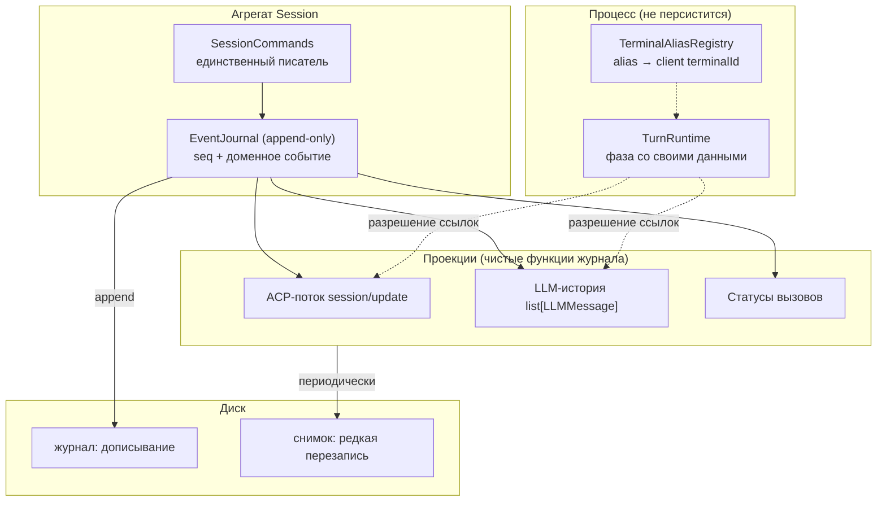

# ADR-008. Журнал как единственный источник, проекции как виды

**Статус:** черновик (2026-08-06)

**Связано:** ADR-003 (домен независим от ACP), ADR-006 (фазы write-пути, постоянные wire-границы),
ADR-007 (владение состоянием сессии), `openspec/changes/session-hot-cold-split/`,
`openspec/changes/multimodal-tool-results/` (такт 2), tech-debt P2-42, P2-46, P2-55, P2-58, P1-56.

## Контекст

ADR-007 разложил «расщепление горячего и холодного» на три оси: носитель, избыточность,
гранулярность записи. Разведка B2 и разбор живого прогона 2026-08-06 (`pid 62680`,
`sess_232a2ca43bec`) дали пять находок, и все пять — следствия одной причины, а не независимые
дефекты.

**Измерено, а не выведено:**

* **Тройная копия.** Документ `sess_7512e714be29` (v10, ревизия 283, 302 230 Б, 31 вызов): из 29
  крупных уникальных текстов 28 присутствуют во всех трёх коллекциях, вес датума байт-в-байт
  одинаков в каждой — 61 537 Б. Итого 184 611 Б = **61.1% документа занимает один датум в трёх
  копиях**. Единственный источник даёт ≈179 КБ вместо 302 КБ.
* **Два пространства идентификаторов, но не две конвенции.** `tool_calls` и `events_history`
  ключуются ACP-идентификаторами (`call_001`…`call_004`), `history` — идентификаторами модели
  (`chatcmpl-tool-…`), и то же в `assistant.tool_calls[].id`. Мост существует и персистируется:
  `tool_calls[call_001].tool_call_id_from_llm = "chatcmpl-tool-998a85…"`.

  > **Первая формулировка этого пункта опровергнута разведкой на коде (2026-08-06).** Я утверждал,
  > что ключ коллекции — «тот, который передал создатель», и что в `sess_7512e714be29` все три
  > коллекции использовали идентификатор модели. И то, и другое неверно. Единственный путь создания
  > вызова — `ToolCallRegistry.create` (`domain/session.py:116-117`), он всегда выдаёт
  > `call_{counter:03d}`; `update` и `update_status` при неизвестном id ничего не вставляют. Ключами
  > `tool_calls` не могут быть `chatcmpl-…`. Строки `chatcmpl-…`, по которым я это заключил,
  > печатались из записей `history`; ключи `tool_calls` того документа я не печатал.
  >
  > **Что осталось настоящим дефектом после проверки:** перевод «внутренняя идентичность → идентичность
  > для модели» продублирован **десятью** одинаковыми выражениями `tool_call_id_from_llm or tool_call_id`
  > (восемь в `tool_processor.py`, плюс `session.py:104`, `tool_call_handler.py:251`), и **обратного
  > индекса** `llm_id → ToolCallId` не существует. Каждое из десяти мест семантически верно:
  > ответ модели адресуется её идентификатором, а fallback покрывает пути, где его нет вовсе
  > (client-RPC, отмена, служебные вызовы). Проблема не в конвенции, а в том, что перевод не
  > принадлежит никому и не имеет обратной стороны, — а именно она понадобится проекции `history`.
* **Фаза turn'а лжёт.** `active_turn.phase = "awaiting_permission"` при
  `permission_request_id = null` и `permission_tool_call_id = null`, когда оба разрешения давно
  отвечены и последующие вызовы завершены. Причина в коде: `prompt/permission_response.py:62-63`
  снимает оба идентификатора и **не возвращает** фазу в `running`, хотя матрица переходов такой
  переход разрешает (`turn_lifecycle_manager.py:341-342`).
* **`term_1` выдан дважды в одной сессии** — Context Manager'ом (07:03:27) и моделью (07:09:30),
  разным терминалам, в одном процессе, без рестарта. `terminal_counter` в документе равен 2 и
  покрывает только вызовы модели.
* **348 клиентских `fs/read_text_file` не оставили в состоянии ни одной записи.**

### Общая причина

`SessionDocument` смешивает три сущности с несовместимыми законами жизни:

| Сущность | Закон | Частота изменений | Должна переживать рестарт |
|---|---|---|---|
| **Журнал** (что произошло) | append-only, неизменяем | +N за turn | да |
| **Проекции** (статусы, история для LLM, ACP-поток) | производное, восстановимо | пересчитываются | нет |
| **Горячее** (`active_turn`, фаза, permission-ожидание, alias'ы) | mutable, привязано к процессу | много раз в секунду | **нет** |

Смешение объясняет каждую находку. Тройная копия — три проекции, записанные как независимые
источники. Два пространства id — нет слоя, где идентичность определяется один раз, поэтому её
доопределяет каждый потребитель (`effective_id = tool_call_id_from_llm or tool_call_id` — восемь раз
в `tool_processor.py`, плюс `session.py:104` и `tool_call_handler.py:251`). Врущая фаза — mutable-поле
без инварианта, персистируемое как факт. Двойной `term_1` — распределитель идентификаторов лежит в
документе, а инкремент теряется на пути, который документ не сохраняет.

## Решение

### 1. Журнал доменных событий — единственный источник; проекции — виды

Единственный источник истины — упорядоченный журнал **доменных** событий. `tool_calls`, `history`,
`events_history` перестают быть источниками и становятся проекциями: чистыми функциями журнала (плюс
горячего состояния — для разрешения ссылок на эфемерные ресурсы, шаг A.2 ADR-007).

Инвариант: **проекцию всегда можно выбросить и пересчитать.** Она хранится как кеш, не как истина.

Опора на известные решения: event sourcing / CQRS (журнал + read models), log-structured storage со
снимками (SQLite WAL, Kafka log compaction, git objects+refs), явный перевод идентичности на границе
(idempotency keys, `Correlation-Id`).



**Развилка с ADR-006 закрыта явно.** `event_history_writer.py` объявляет себя «постоянной
wire-границей (ADR-006)», и элементы `events_history` — готовые ACP-нотификации в camelCase. Это
решение **отменяется**: журнал становится доменным, ACP — проекцией. Замер цены (2026-08-06)
показал, что связанность узкая: форму элемента журнала знают три места, и работу делает одно —
`session_replayer.py:73-87`, где реплей сейчас pass-through. 134 упоминания `sessionUpdate`/
`toolCallId` в 36 файлах — это обычный путь нотификаций, а не читатели журнала.

### 2. Идентичность вызова: три роли, один владелец

| Роль | Кто задаёт | Где живёт |
|---|---|---|
| **Внутренняя** `ToolCallId` | агрегат (`tool_call_counter`) | ключ журнала и всех проекций |
| **LLM-корреляция** | ответ модели (`chatcmpl-…`) | атрибут события создания |
| **ACP-идентификатор** | то, что уходит клиенту | атрибут проекции |

`ToolCallId` — единственный ключ; **им он уже фактически является** (`call_{counter:03d}` из
единственного пути создания), поэтому миграция ключей документа не нужна — это уточнение разведки,
и оно сокращает шаг.

Вводится ровно то, чего нет:

1. **Владелец перевода.** Один аксессор в домене (`ToolCall.answer_id` — «идентификатор, которым
   вызов адресуется модели»), инкапсулирующий `tool_call_id_from_llm or id`. Десять дублирующих
   выражений заменяются на обращение к нему; поведение не меняется, включая fallback для путей без
   LLM.
2. **Обратный индекс** `llm_id → ToolCallId` — нужен проекции `history`, но **вводится вместе с ней
   (шаг 4), а не здесь**: индекс без потребителя — то же «поле без читателя», на котором проект уже
   дважды обжигался (`result_content`, `terminals_owner`). Дополнительное условие для него: сегодня
   `session_mapper.py:297` пишет в `ToolCallRegistry.calls` напрямую, минуя реестр, поэтому хранимый
   индекс рассинхронизировался бы при загрузке. Инкапсуляцию `calls` придётся закрыть тем же шагом.

Почему не сделать `chatcmpl-…` единым ключом: это чужое пространство имён, которым мы не управляем,
и его нет на путях без LLM (отмена, ответ клиента, служебные вызовы) — там `answer_id` и падает на
внутренний идентификатор.

### 3. Фаза turn'а: illegal states unrepresentable

Фаза несёт свои данные:

```python
type TurnPhase = (
    Running
    | AwaitingPermission   # request_id, tool_call_id — обязательные поля
    | AwaitingClientRpc    # request_id
    | Cancelling
    | Completing
)
```

«Жду разрешения, но не знаю какого» перестаёт быть выразимым: снятие идентификаторов **есть**
переход в `Running`. Это устраняет и различение «процесс умер на реальной паузе» против
«идентификатор не сняли», которое сейчас требует покадрового снимка файла сессии (P2-46), и
расхождение `waiting_permission`/`awaiting_permission`, помеченное долгом в `domain/session.py:306`.

Правка «дописать `phase = "running"`» отклонена: лечит один сайт, оставляет механизм.

`TurnPhase` — горячее состояние, живёт в процессе. На диск уезжают доменные события
`TurnPaused`/`TurnResumed`, если они нужны реплею.

### 4. Alias'ы терминалов: уникальность по конструкции

**Решение (2026-08-06): alias включает идентификатор процесса** — `term_<epoch>_<n>`.

Постановка «Context Manager аллоцирует мимо сейма» **опровергнута кодом**: оба пути идут через
`TerminalAliasRegistry.register()` → `Session.allocate_terminal_alias()`. Дефект — потерянная запись:
Context Manager мутирует переданный объект сессии, и на его пути мутация не сохраняется, тогда как в
turn-пути её доносит слияние `tool_processor.py:69-70`. Отсюда `term_1` дважды и счётчик 2 вместо 3.

Эпоха убирает саму потребность персистировать счётчик: столкновение alias'а из восстановленной
истории с живым становится невозможным **по построению**, а не маловероятным. Решение ADR-007 A.1.2
(счётчик остаётся в документе) тем самым становится ненужным, и шаг A доводится до конца.

Цена проверена по коду: **формат alias'а нигде не парсится** — `register` возвращает строку,
`resolve`/`release` ищут её в словаре. Исходное ограничение (tech-debt #18) — краткость, не
монотонность: модель теряла символы, ретранслируя 36-символьный UUID. `term_7_3` — 8 символов.
Детерминизм prompt cache сохраняется: выданные alias'ы в истории не переписываются.

Отклонено — «персистировать счётчик честно со всех путей»: требует обязательной записи на горячем
пути сбора контекста, у которого graceful degradation заявлена принципом, и оставляет гарантию
дисциплинарной.

### 5. Носитель: сначала порт, потом бэкенд

**Решение (2026-08-06): сменить порт хранилища, реализовать JSONL-журнал + JSON-снимок; SQLite
отложить.**

Сегодняшний порт документо-ориентирован (`save_session(document)` / `load_session(id)`). Журналу
нужен другой:

```
append_events(session_id, events, expected_seq) -> seq
read_events(session_id, after_seq) -> list[Event]
save_snapshot(session_id, snapshot, at_seq)
load_snapshot(session_id) -> (snapshot, seq) | None
```

Вся стоимость шага здесь; после смены порта выбор бэкенда — обратимая замена реализации (`memory`
обслуживает тесты, `json_file` — читаемость). `seq` монотонен в сессии и даёт дешёвый CAS
(«ожидаю `seq=N`») вместо сверки ревизии целого документа — основа для нескольких воркеров хостинга.

Почему JSONL первым: приёмка шагов в этом проекте — живой прогон и **разбор документа сессии
глазами**. Все пять находок этого ADR получены чтением файла; с SQLite каждая стоила бы дороже.
Читаемость носителя здесь часть рабочего процесса, а не удобство.

SQLite (`sqlite3` — stdlib, новой зависимости нет) осмыслен там, где появляются конкурентные
писатели, то есть в многопользовательском хостинге. Это отдельное решение с другими требованиями;
с расщеплением не смешивается.

### 6. Клиентские RPC в журнал не попадают

348 `fs/read_text_file` за прогон — исполнение инструмента, а не факт диалога. В журнал попадает
только то, что модель или пользователь увидят при реплее; наблюдаемость чтений — в
`data/observability/`, которая уже существует. Решение принимается явно, чтобы «журнал — единственный
источник» не оказалось неправдой.

## Отклонённые варианты

* **Оставить три коллекции и синхронизировать аккуратнее.** Это делается сейчас; сессия дала три
  дефекта именно на рассинхроне. Синхронизация N копий дисциплиной не масштабируется.
* **Чистый event sourcing без снимка.** Реплей на `session/load` стал бы O(журнал) при сессиях на
  сотни событий. Снимок обязателен — это гибрид.
* **`chatcmpl-…` как единый ключ.** Впускает чужое пространство имён в агрегат, отсутствует на
  путях без LLM.
* **Присваивание `phase = "running"` в обработчике разрешения.** Симптоматическая правка.

## Порядок работ

Порядок вынужденный: каждый шаг самостоятельно ценен и проверяем, но следующий опирается на
предыдущий.

| Шаг | Содержание | Почему здесь |
|---|---|---|
| 1 | `answer_id` как владелец перевода + обратный индекс `llm_id → ToolCallId` | до журнала: проекции `history` обратный индекс нужен по построению. Разведка сняла из шага миграцию ключей — они уже единообразны |
| 2 | `TurnPhase` как размеченное объединение | независим от журнала, чинит найденный дефект по конструкции, малый |
| 3 | Журнал доменных событий + проекция ACP | здесь отменяется запись ADR-006 о постоянной wire-границе и решается судьба `session_info_update` |
| 4 | Проекции `history` и статусов | тройная копия исчезает |
| 5 | Горячее уезжает из документа: `TurnRuntime`, alias'ы с эпохой | завершает шаг A ADR-007 |
| 6 | Гранулярность записи: журнал дописывается, снимок редок | окупается только после 4 |

**Гейты на каждом шаге**, помимо `make check` и `lint-imports`:

* golden-тест байт-идентичности wire-нотификаций и LLM-payload'а (иначе рушится prompt cache);
* тест «проекция из журнала == текущее состояние» на записанных сессиях;
* живой прогон `--stdio` через Zed с разбором `~/.codelab/logs/*`.

**Отдельно про приёмку статусов.** Ни в одном замере до сих пор нет статусов `cancelled` и `failed`:
отмена 2026-08-06 пришлась на turn без вызовов инструментов. Дешёвый способ их получить — **отказ в
разрешении**: `permission_response.py:74` даёт `ToolCallStatus.CANCELLED`. Шаг 4 не считается
закрытым без прогона с отказом.

## Ход реализации

### Шаг 1: владелец перевода идентичности — ✅ сделано и подтверждено живьём

Разведка сократила шаг: миграция ключей документа не нужна, потому что ключи уже единообразны
(см. опровержение в «Контексте»). Осталось ровно введение владельца правила.

- `answer_tool_call_id(tool_call_id_from_llm, tool_call_id)` в `domain/tool_call.py` — единственный
  владелец правила; `ToolCall.answer_id` делегирует ему. Две точки входа, одно правило: для
  вызывающих с объектом на руках и для тех, у кого только пара идентификаторов.
- Все **десять** дублирующих выражений заменены: `session.py:104` и `tool_call_handler.py:251` — на
  `tool_call.answer_id`; восемь в `tool_processor.py` — на вызов функции. Поведение не изменено,
  включая fallback: в `session.py` замена эквивалентна, потому что там `tool_call_id = tool_call.id`.
- Fallback описан в докстринге как **рабочая ветка**, а не подстраховка: у путей без LLM
  (client-RPC, отмена, служебные вызовы) идентификатора модели не существует, и ответ всё равно
  обязателен — иначе вызов остаётся без `role: tool` (P2-38).
- Тесты: `TestAnswerToolCallId` — предпочтение id модели, fallback при `None` и при пустой строке,
  совпадение обеих точек входа. `make check` — 7607 passed, `lint-imports` — 4 контракта kept.
- **Подтверждено живьём** (`sess_da5df087b4d6`, 2026-08-06, stdio через Zed, `pid 78177`, ревизия 202,
  146 814 Б): 23 вызова, 22 ответа модели, 21 запрос разрешения, 39 клиентских чтений; ноль
  `error`/`critical`, ноль `tool_call_status_transition_rejected`. Все 22 ответа ушли под
  идентификатором модели — ветка предпочтения.
- ⚠️ **Ветка fallback прогоном не покрыта:** мост `tool_call_id_from_llm` был заполнен у всех 23
  вызовов, путей без него в прогоне не случилось. Ветка закрыта тестами, но не полем. Живой случай
  даст либо client-RPC, либо отмена до регистрации вызова.

**Побочно тем же прогоном закрыта дыра в замерах статусов.** Впервые получен `cancelled`
(`call_023`, `fs/read_text_file`, события `['pending', 'cancelled']`): статус равен последнему
событию, по всем 23 вызовам расхождений с журналом нет, событий-сирот нет. Это половина B2.1,
висевшая открытой три прогона. `failed` не наблюдался ни разу до сих пор.

### Шаг 2: `TurnPhase` как размеченное объединение — ✅ сделано (статические гейты)

**Разведка нашла картину шире, чем дефект, и переопределила шаг.** `set_turn_phase` и
`get_turn_phase` **не вызывались из продакшена** — только из тестов, поэтому матрица переходов
(`_validate_phase_transition`) не применялась ни разу, а все пять записей фазы были прямыми
присваиваниями. Значения разошлись с матрицей: `awaiting_client_rpc` числился в ней и не писался
никем, а `waiting_client_rpc`, `waiting_permission`, `waiting_tool_completion` и `cancelled`
писались, но в матрице не значились. Одно состояние «жду разрешения» писалось **тремя строками из
двух модулей**. Функциональный читатель у фазы был **один** — `should_auto_complete_active_turn`.

Из четырёх рассмотренных вариантов взят «матрица — единственный писатель» (решение пользователя):
богатое объединение ради поля с одним читателем закрепило бы почти неиспользуемое поле, а удаление
API потеряло бы диагностику P2-46, нужную журналу.

- `TurnPhase` = `Running | AwaitingPermission | AwaitingClientRpc | TurnCancelled | Completing`
  (`domain/value_objects.py`). Матрица переехала туда же и **применяется**:
  `TurnState.transition_to` — единственный путь записи, отказ логируется
  (`turn_phase_transition_rejected`), как у `ToolCallRegistry.update_status`.
- Три написания сведены в одно: `keep_tool_pending` — поле значения, а не имя фазы.
- `permission_request_id`/`permission_tool_call_id` стали **выводимыми** из фазы. Около пятнадцати
  читателей, включая поиск сессии по `permission_request_id`, не изменились; запись идёт только
  через переход. `AwaitingPermission` требует `request_id` (от него зависит корреляция) и допускает
  отсутствие `tool_call_id`.
- Найденный живьём дефект закрыт по конструкции: снятие идентификаторов в
  `permission_response.py` **есть** переход в `Running`.
- `_cleanup_session_state` читает идентификатор **до** перехода: он часть значения фазы, и после
  перехода в `cancelled` отменять было бы нечего. Порядок стал значимым — отмечено в коде.
- **Переход доведён до конца:** `finalize_active_turn`, `complete_active_turn` и
  `should_auto_complete_active_turn` работают с доменным агрегатом, `BackgroundExecutor` грузит его
  через уже имевшийся `_repository`. Строка осталась только как формат документа.
- ⚠️ **Поведение записи намеренно не изменено:** очистка turn'а в этом пути на диск не попадает и
  раньше — документ грузился только для чтения. Сделать её настоящей записью — отдельное решение с
  собственным живым прогоном; отмечено в докстринге `finalize_active_turn`.

**Две настоящие регрессии поймали тесты, и обе — про чтение уже сохранённых сессий.** Первая:
документ с `phase = running` при заполненных идентификаторах (их писал `permission_manager`, а фазу
отдельно `tool_processor`) терял их, и разрешение становилось необрабатываемым. Вторая: документ с
`request_id` без `tool_call_id` терял идентификатор, и отмена не писала tombstone — поздний ответ дал
бы `-32603`. Отсюда правило читателя: **идентификаторы важнее имени фазы**, а обязателен именно тот,
от которого зависит корреляция.

**Формат документа не изменён, но множество записываемых значений сузилось:** `waiting_permission`
больше не пишется (читается по-прежнему), это же зафиксировано в roundtrip-гейте.

- Тесты: `TestTurnPhaseFromWire` — гейт на каждое наблюдавшееся сочетание полей; переходы и отказы —
  в `test_turn_lifecycle_manager`. Тест «невалидная строка фазы» заменён на «отказ матрицы не меняет
  фазу»: набор фаз закрыт типом, поэтому прежний случай невыразим.
  `make check` — 7616 passed, `lint-imports` — 4 контракта kept.
- ⏳ **Живой прогон не проведён.** Шаг не считается закрытым без него.

### Шаг 3: предусловие взято — golden-поток `session/load` — ✅ сделано

Гейт снят **до** правки намеренно: golden, написанный после, закрепляет новое поведение вместо
проверки совместимости (урок ADR-006 — гейт D0.1 снимался до write-фазы).

`tests/server/protocol/test_session_load_replay_golden.py` фиксирует все **три** источника
клиентского потока порознь, потому что шаг 3 затрагивает их по-разному: `replay_history` (журнал,
именно здесь pass-through), `replay_latest_plan` (план хранится отдельно) и
`_replay_tool_calls_fallback` (совместимость со старыми сессиями). Документ фикстуры содержит все
шесть видов событий, которые умеет писать `EventHistoryWriter`.

Закреплены как **текущее** поведение, а не как правильное, две известные асимметрии — чтобы шаг 3
менял их осознанно, а не «ломал тест»:

* `session_info_update` пишется и персистируется, но не реплеится (`_REPLAYABLE_UPDATE_TYPES`
  перечисляет пять видов из шести);
* fallback реплеит вызов как `pending` независимо от настоящего статуса, досылая его отдельным
  `tool_call_update` (P2-42).

**Гейт проверен на пригодность:** внесена типичная для проекции ошибка — метка времени журнала
протащена в wire, — два теста упали, после откатки снова зелено. Гейт, который не ловит поломку,
хуже отсутствующего.

`make check` — 7624 passed, `lint-imports` — 4 контракта kept. Кода не менялось.

### Шаг 4: требование, найденное живым прогоном (2026-08-06)

Прогон дал **контрпример к выводимости `history` из журнала**, которого не было ни в одном замере.
В `sess_da5df087b4d6` записей `history` с `role=tool` — 26, а вызовов — 23. Три лишние отвечают
вызовам, которых **нет ни в `tool_calls`, ни в `events_history`**: их содержимое — «Вызов не
выполнялся: turn отменён пользователем», то есть ответы `_answer_unprocessed_tool_calls` по остатку
прерванного батча. Контракт LLM-API требует `role: tool` на каждый id из assistant-сообщения,
поэтому ответ уходит и тем вызовам, которые никогда не регистрировались как `ToolCall`.

Это тот же механизм, что дал расхождение «55 против 54», отмеченное в B3.1 как «сойтись обязано».
**Оно не обязано:** сходиться нечему, пока ответ на нерегистрированный вызов не является событием.

Следствие для шага 4, обязательное к исполнению: **«ответ модели на необработанный вызов» должен
стать доменным событием журнала.** Иначе проекция `history` невыводима, и шаг упрётся в эти три
записи. Тот же вывод покрывает `_answer_nameless_tool_call` — вызов без имени инструмента тоже
получает ответ, не будучи зарегистрированным.

## Что осталось за рамками

* **P1-56** (гейт разрешений у вызывающего) — отложен решением пользователя 2026-08-06, заблокирован
  вопросом политики разрешений целиком.
* **Такт 2 `multimodal-tool-results`** — заблокирован; шаг 4 обязан задать для `role=tool` форму
  `content: list[dict]`, иначе такт будет заблокирован повторно уже своей проекцией.
* **Вторая половина P2-58** (владение освобождением терминалов) — прогон 2026-08-06 уточнил:
  Context Manager создаёт 2 и освобождает 2, turn-путь создаёт 2 и освобождает 0. Течёт turn-путь.
* **SQLite-бэкенд** — под многопользовательский хостинг, за тем же портом.
