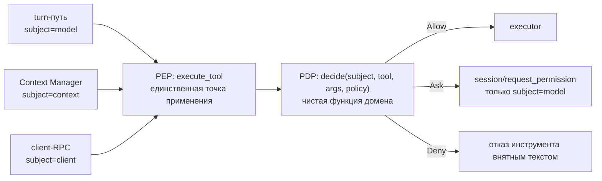

# ADR-009. Разрешение на инструмент — свойство инвокации, проверяемое на шве исполнения

**Статус:** черновик (2026-08-10)

**Связано:** P1-56 (гейт разрешений живёт у вызывающего — дефект, ради которого написан этот ADR),
P2-57 (окупаемость Context Manager), P2-34 (O(термы × файлы) чтений), ADR-008 раздел 7 (разрешение
как свойство инвокации, а не состояния сессии), ADR-002 (консолидация Context Manager),
`doc/Model Context Protocol/` (tool annotations), `doc/Agent Client Protocol/05-Prompt Turn.md`
(`session/request_permission`).

## Контекст

### Измерено, а не выведено

Гейт разрешений применяется только к вызовам модели. Всё, что исполняет Context Manager, идёт мимо
него — и это не оценка, а счёт по четырём живым прогонам:

| Прогон | Исполнений `fs/read_text_file` | Зарегистрировано вызовов | Мимо гейта |
|---|---|---|---|
| 2026-08-04 | 560 | 28 | 95.0% |
| 2026-08-07 | 658 | 17 | 97.4% |
| 2026-08-10 (утро) | 660 | 30 | 95.5% |
| 2026-08-10 (день) | 603 | 9 | **98.5%** |

В тот же класс попадает `terminal/release`: 1 исполнение, 0 зарегистрированных вызовов. Доля растёт
не потому, что дефект усугубляется, а потому, что Context Manager читает всё больше — то есть
единственный путь без гейта и есть основной потребитель файловой системы.

Существенно, **чего измерения не говорят:** пути в логах не печатаются вовсе (замер 2026-08-10 —
ноль вхождений `path=`), поэтому «сколько чтений уходит за пределы рабочего каталога» сегодня
**неизвестно**. Это не деталь: именно от неё зависит цена шага 2, и она обязана быть измерена до
него, а не узнана из прогона.

### Причина в коде, а не в дисциплине

Проверка принадлежит **вызывающему**: решение принимает `tool_processor.py:435`, читая
`tool_definition.requires_permission`. Поэтому вызывающий, который проверку не делает, её и не
делает — Context Manager обращается к реестру напрямую и молча исполняет защищённые инструменты.

При этом **шов исполнения уже единственный**, и это проверено по коду:

* turn-путь — `tool_processor.py:1081` → `ToolRegistry.execute_tool`;
* Context Manager — `gatherer.py:409,524,550,610` и `manager.py:202` → тот же `execute_tool`;
* MCP — второй вход, `MCPToolExecutor.execute_tool`.

То есть переносить нужно не архитектуру, а место проверки: точка, через которую проходят все,
существует и используется обоими путями.

### Декларация тоже уже есть, но одна ось и рукописная

`requires_permission` объявлена на самом инструменте (`base.py:19`, `registry.py:125`) — это верное
место. Но:

* MCP-адаптер ставит её `True` **всем** инструментам подряд (`tool_adapter.py:209`);
* аннотации MCP при этом **разобраны** (`models.py:213-216,245`) и уже признаны достаточно
  надёжными, чтобы выводить по ним `kind` (`tool_adapter.py:157-159`, «Приоритет 1: Аннотации MCP»);
* у флага есть **второй потребитель** — `registry.py:149` фильтрует по нему набор инструментов,
  отдаваемый модели. Значит смена смысла флага задевает и выдачу инструментов, а не только гейт.

### Граница каталога уже есть — первая редакция этого ADR утверждала обратное

**Опровергнуто по коду до реализации (2026-08-10).** Я писал, что путь Context Manager может
прочитать файл вне `cwd` без следа. Это неверно: `fs/read_text_file` нормализует путь и отклоняет
выход за рабочий каталог **внутри обработчика** (`filesystem.py:180-187`), `fs/write_text_file` —
там же (`:208-215`). Обработчик один на всех вызывающих, поэтому граница действует и для Context
Manager.

Из этого следуют три поправки, и они меняют не решение, а его обоснование и порядок:

1. **Модель ущерба другая.** Незагейченные чтения ограничены рабочим каталогом. Нарушено не «можно
   прочитать что угодно», а «политика разрешений пользователя (deny-правила, выбор `allow_always`)
   не применяется к чтениям Context Manager внутри каталога».
2. **Граница дисциплинарная, а не структурная.** Она написана руками в двух обработчиках. Новый
   файловый инструмент её не получит, и никто об этом не узнает — тот же класс, что
   `terminal_counter` (P2-58) и «договорённость шести писателей» (P2-63).
3. **Тяжесть переехала с `fs/*` на `terminal/*`.** У терминала границы пути нет и быть не может:
   команда исполняется целиком. Context Manager создаёт терминалы (`gatherer.py:524`) и запускает
   команды (`find . -type f` в прогоне 2026-08-10), а `terminal/create` объявлен
   `requires_permission=True` (`terminal.py:72`). То есть пользователь, включивший запрос разрешения
   на исполнение команд, его не получает — и вот это настоящее нарушение обещания, а не чтения.

### Почему это единственный открытый долг, нарушающий обещание пользователю

Остальные открытые записи — внутренняя корректность, размер документа, шум в логах. Здесь же
пользователь включает политику разрешений, а она применяется к 1.5% исполнений, и в число
незагейченных попадает запуск команд в терминале.

## Решение

### 1. Точка применения одна: PEP на `execute_tool`

Проверка переезжает в `ToolRegistry.execute_tool` и становится **единственной**. MCP-вход
оборачивается тем же приёмом — иначе появится третий путь мимо гейта, того же класса, что нынешний.



Опора — разделение **точки применения** (PEP) и **точки решения** (PDP), стандартное в authz-практике
(XACML, OPA). Ценность здесь ровно та, которой не хватает: применение нельзя обойти, потому что оно
на шве, а решение можно тестировать таблицей, потому что оно чистое.

### 2. Субъект передаётся явно, а не выводится

`execute_tool(..., subject: ToolInvocationSubject)` — `model | context | client | system`.

Ambient authority («реестр догадывается, кто звонит») — это нынешний дефект в другой форме, поэтому
субъект обязателен параметром. Это же принцип наименьших полномочий: вызывающий предъявляет, от чьего
имени действует, а не полагается на то, что за него решат.

Отсюда снимается вопрос, который блокировал P1-56 с 2026-08-06: политика не одна на всех, она
**функция субъекта**, и «Context Manager начнёт спрашивать разрешение» перестаёт быть следствием
включения гейта.

### 3. Точка решения — чистая функция; `Ask` для контекста невыразим

`decide(subject, tool, arguments, session_policy) -> Allow | Ask | Deny`. Без I/O, без записи в
сессию. Существующий `PermissionManager` становится её **потребителем**, а не второй политикой:
две копии политики разошлись бы, как разошлись три копии матрицы статусов (фаза D ADR-006) и как
дублировался перевод идентичности (шаг 1 ADR-008).

| Субъект | `Allow` | `Ask` | `Deny` |
|---|---|---|---|
| `model` | исполняем | `session/request_permission` | отказ текстом в `role: tool` |
| `context` | исполняем | **невозможен** → `Deny` | файл пропущен, сборка продолжается |
| `client` | исполняем | не применим: инициатор — пользователь | отказ RPC |
| `system` | исполняем | невозможен | отказ |

`Ask` для `context` запрещён **по конструкции, а не по договорённости**: у Context Manager заявлена
graceful degradation и нет континуации, на которой можно ждать ответа. Разрешить ему спрашивать
значило бы либо повесить сборку контекста, либо получить третий вид ожидания разрешения — ровно там,
где ADR-008 только что свёл их к одному реестру.

### 4. Политика — граница каталога централизованно, а не в каждом обработчике

`read` внутри `cwd` → `Allow`; вне `cwd` → `Ask` для модели, `Deny` для контекста.

Это то, что делает «все чтения через гейт» дешёвым: 603 чтения проходят проверку и разрешаются
автоматически, не порождая ни одного вопроса пользователю.

**Выигрыш здесь не в новой границе — она уже есть (`filesystem.py:180-187`), — а в том, что граница
перестаёт быть рукописной в каждом обработчике.** Сегодня её получает тот инструмент, чей автор о ней
вспомнил; после переноса в PDP её получает каждый по построению, включая будущие. И `Deny` для
контекста становится выразимым: сейчас обработчик отвечает одинаково всем, потому что не знает, кто
его позвал.

Для `terminal/*` граница пути неприменима — команда исполняется целиком, — поэтому там политика
опирается на субъект и на риск инструмента, а не на путь. Это и есть случай, ради которого субъект
нужен: запуск команд Context Manager'ом должен решаться политикой явно, а не отсутствием проверки.

Опора — модель Claude Code: разрешение решается на границе инвокации инструмента единообразно для
всех вызывающих, включая подагентов; чтения внутри рабочего каталога разрешены политикой, а гейт
сосредоточен на записи, исполнении и выходе за границу каталога. **Граница знания названа прямо:**
пользовательская модель Claude Code (режимы, allow/deny-правила, хуки, поведение на выходе за `cwd`)
здесь взята как образец сознательно; детали её внутренней реализации в это решение не заложены.

### 5. Риск — из аннотаций инструмента, флаг остаётся переопределением

Ось «требует разрешения» одна и рукописная, а MCP определяет четыре: `readOnlyHint`,
`destructiveHint`, `idempotentHint`, `openWorldHint`. Политика по умолчанию выводится из них.

Шаг дешевле, чем казался: аннотации **уже разобраны и уже используются** для вывода `kind`. Речь не о
новой поддержке спецификации, а о том, чтобы вторая ось перестала игнорировать данные, которым первая
ось уже доверяет.

## Отклонённые варианты

* **Оставить проверку у вызывающих, добавить её в Context Manager.** Это статус-кво плюс ещё одна
  копия правила. Гарантия остаётся дисциплинарной — а проект уже дважды получил дефект именно там,
  где гарантия держалась на дисциплине (`terminal_counter` в P2-58, «договорённость» шести писателей
  ответа в P2-63). Новый вызывающий снова окажется без гейта.
* **Привилегированный системный читатель.** Аналога в современных агентных реализациях нет: там
  отсутствует не-модельный читатель с расширенными правами, и это скорее довод против такой сущности.
  Вариант также требует определить, что именно ему позволено, — то есть ту же политику, но в обход
  общей.
* **Оставить как есть и задокументировать.** Обещание «разрешения на чтение файлов» остаётся
  неправдой ради проблемы, которая решается политикой (`Allow` внутри `cwd`), а не архитектурой.
* **Запретить Context Manager файловые чтения вовсе.** Убивает функциональность ради границы;
  сборка контекста — это и есть чтение файлов.
* **Гейт в каждом исполнителе.** Размножает применение по числу исполнителей вместо одной точки и
  сталкивается с MCP, где исполнители внешние.

## Порядок работ

Порядок вынужденный: вся цена — в переносе шва, политика после него становится обратимой заменой
данных. Тот же приём, что «сначала порт, потом бэкенд» (ADR-008 §5) и что разделение 3a/3b.

| Шаг | Содержание | Почему здесь |
|---|---|---|
| 0 | Замер: субъект, инструмент, путь и `inside_cwd` на шве; распределение по субъектам | вопрос шага 2 сменился после опровержения: не «сколько чтений вне `cwd`» (их нет — граница уже действует), а «что именно исполняется мимо гейта и насколько это опасно» |
| 1 | `ToolInvocationSubject`, PDP, PEP на `execute_tool` и MCP-входе; политика **тождественна нынешнему поведению** | шов отдельно от политики: иначе расхождение на прогоне объяснялось бы и тем, и другим |
| 2 | Перенос границы `cwd` из обработчиков в PDP + политика для `terminal/*` по субъекту | граница перестаёт быть рукописной; исполнение команд Context Manager'ом становится решением, а не умолчанием |
| 3 | Риск из аннотаций MCP; `requires_permission` — явное переопределение | требует внимания ко второму потребителю флага (`registry.py:149`) |

**Шаг 1 обязан быть нулевым по поведению.** Приёмка — распределение решений совпало с замером шага 0,
golden на LLM-payload не сдвинулся, живой прогон без новых запросов разрешения.

### Гейты на каждом шаге

Помимо `make check` и `lint-imports`:

* **таблица решений PDP** — по одному тесту на клетку матрицы «субъект × исход», включая
  «`Ask` для `context` невыразим»;
* **гейт необходимости шва:** вызов `execute_tool` без субъекта не компилируется/не проходит типовую
  проверку — иначе новый вызывающий снова окажется без гейта молча;
* **гейт возвратом дефекта:** Context Manager, читающий вне `cwd`, обязан валить тест шага 2;
* **golden на LLM-payload** — шаг 2 может сократить набор собранных файлов, а это меняет контекст и
  сбрасывает prompt cache; сброс должен быть осознанным решением, а не побочным эффектом;
* **живой прогон `--stdio` через Zed** с разбором `~/.codelab/logs/*`: распределение решений по
  субъектам, ноль чтений вне `cwd`, отсутствие деградации сборки контекста.

## Ход реализации

### Шаг 0: замер на шве — ✅ сделано, статические гейты

- `ToolInvocationSubject` (`domain/value_objects.py`) — `model | context | client | system | unknown`.
  Положен в домен, потому что шаг 1 разместит там же PDP, а домен импортируем всеми.
- `execute_tool(..., subject=UNKNOWN)` на ABC (`tools/base.py`) и в реализации; субъект называют
  turn-путь (`tool_processor.py:1081` — `MODEL`) и Context Manager (`gatherer.py` ×4, `manager.py` —
  `CONTEXT`).
- `_probe_invocation` пишет `tool_invocation_probe`: субъект, инструмент, `requires_permission`,
  `gated`, путь, `inside_cwd`, превью команды. Ничего не решает и **не вправе ронять** горячий путь.
- `gated = requires_permission and subject is MODEL` — это P1-56 в одной строке замера.

**Гейт, поймавший собственную дыру.** Первая версия проверяла реестр в изоляции, и снятие
`subject=CONTEXT` у `ContextGatherer` не роняло **ни одного из 596** тестов: места вызова были
ничем не защищены. Добавлен гейт на **настоящего** вызывающего — подменяется только реестр, путь
сбора контекста исполняется свой. После этого возврат дефекта валит ровно его.

Это тот же класс, что `terminal_counter` (P2-58) и «договорённость шести писателей» (P2-63):
гарантия держалась бы на том, что автор нового вызова не забудет.

- ⚠️ **`UNKNOWN` — умолчание сигнальное, а не разрешительное.** Оно существует, чтобы неназвавшийся
  путь был виден в замере; типовой проверкой оно не запрещено, поэтому «гейт необходимости шва» из
  списка ниже остаётся невыполненным и переезжает в шаг 1, где `UNKNOWN` можно будет отклонять
  политикой.
- Цена в существующих тестах — 10 дублёров реестра в 8 файлах: сигнатура ABC изменилась, и фейки
  обязаны её повторять. Сигнатуры дописаны явным параметром, а не `**kwargs`, чтобы будущий тест мог
  утверждать субъект.
- `make check` — 7760 passed, `lint-imports` — 4 контракта kept.
- ✅ **Замер снят живьём** (`sess_981b683455b0`, 2026-08-10, stdio через Zed, `pid 63526`, затем
  `65427`; копия pipx сверена с деревом, установка 11:32:37Z против записей с 11:33Z). 518 инвокаций,
  **ни одной `unknown`** — неучтённых вызывающих не существует, то есть замер полон.

| | `context` | `model` |
|---|---|---|
| инвокаций | 487 (94%) | 31 (6%) |
| защищённых, но `gated=False` | **485** | 0 |
| прошло гейт | 0 | 28 |

`requires_permission=True` при `gated=False` — **485 из 513**, то есть **94.5% защищённых инвокаций
исполняются мимо решения пользователя**. Оставшиеся 5 незагейченных законны: `requires_permission=False`.

**Одна строка замера показывает дефект чище любого описания.** `terminal/create` объявлен
`requires_permission=True` и вызван четырежды:

```
subject=context  command='find . -type f'                          gated=False
subject=model    command='ls -la'                                  gated=True
subject=model    command='find lib -type f -name "*.dart" | sort'  gated=True
subject=model    command='find test -type f -name "*.dart" | sort' gated=True
```

Один инструмент, одна декларация, разная судьба — исключительно по вызывающему.

**Граница каталога подтверждена окончательно:** `inside_cwd=True` в 509 случаях из 509, где путь
вообще есть; 9 `None` — терминалы, где путь неприменим. Выходов за рабочий каталог ноль.

**Замер уточнил тяжесть долга, и это его главный результат.** Она не в 485 чтениях: они ограничены
рабочим каталогом и по риску близки к нулю. Она в **одном запуске команды** — там границы пути не
существует по природе инструмента. Поэтому шаг 2 не вправе продавать себя как «закрыть дыру с
чтениями»: дыры там нет, а ценность в переносе границы из рукописных обработчиков в PDP и в политике
для `terminal/*`.

- Замер ничего не сломал: 518 инвокаций прошли, `tool_invocation_probe_failed` не появился ни разу;
  ноль `error`/`critical`, ноль отказов матриц.

## Что осталось за рамками

* **Окупаемость Context Manager (P2-57) и O(термы × файлы) (P2-34).** Гейт делает чтения видимыми, но
  их количество — отдельный вопрос эффективности, и смешивать его с авторизацией нельзя: иначе
  «стало меньше чтений» и «стало меньше разрешённых чтений» будут неразличимы на прогоне.
* **Политика записи и исполнения.** Здесь решается ось чтения, потому что дефект измерен на ней.
  Запись и `terminal/*` проходят тем же PEP, но их политика по умолчанию не меняется.
* **Правила в конфигурации (allow/deny-паттерны, хуки).** PDP делает их выразимыми, но формат правил
  и его миграция — отдельное решение с собственной совместимостью.
* **Наблюдаемость решений.** Куда писать отказы и разрешения на длительное хранение
  (`data/observability/`), решается вместе с правилами, а не здесь.
