# Federated Context Manager — Архитектура и интеграция

> **Версия:** 2.3  
> **Дата:** 25 июня 2026  
> **Статус:** Design Document  
> **PoC:** См. документ "Техническое задание и Архитектурный дизайн: Федеративный Менеджер Контекста"
>
> **Изменения в v2.3:**
> - Добавлены явные ABC `ContextManager` и `ContextCompactor` (§3.7)
> - Унифицирована единственная сигнатура `FederatedContextManager`
>   `(token_counter, skeletonizer, compactor, file_cache, event_bus, tracer)`
>   в §8.1; удалены устаревшие методы `get_from_cache/set_cache`
> - `TokenCounter` приведён к ABC + `create_token_counter()` (§5A.4);
>   убран конкретный класс из ранних версий
> - `ACPCache` заменён на `FileContentCache` (§5A.7, §5A.5 топология);
>   удалён оборванный Mermaid-фрагмент и устаревший пример `ContextCompactor`
> - Перенумерованы дублирующие главы/разделы (вторая глава «Подсистемы» → §5A,
>   разделы жизненного цикла/топологии → §5.4/§5.5, AgentEventBus → §6.4)
>
> **Изменения в v2.0:**
> - Слоистая архитектура (Layer 1/2/3)
> - ABC вместо Protocol (соответствие стилю проекта)
> - Паттерны проектирования: Strategy, Template Method, Composite, Mediator, Factory Method
> - Перенос `ContextCompactor` в `context/compactor.py`

---

## Оглавление

1. [Введение](#1-введение)
2. [Обзор проблемы](#2-обзор-проблемы)
3. [Слоистая архитектура](#3-слоистая-архитектура)
4. [Паттерны проектирования](#4-паттерны-проектирования)
5. [Подсистемы FCM](#5-подсистемы-fcm)
6. [Интеграция с существующими компонентами](#6-интеграция-с-существующими-компонентами)
7. [Путь внедрения](#7-путь-внедрения)
8. [API Reference](#8-api-reference)
9. [Tradeoffs и ограничения](#9-tradeoffs-и-ограничения)

---

## 1. Введение

### 1.1. Назначение документа

Этот документ описывает архитектуру Federated Context Manager (FCM) — компонента для управления контекстом в мультиагентной системе CodeLab. Документ предназначен для разработчиков, которые будут внедрять FCM в проект.

### 1.2. Что такое FCM

**Federated Context Manager** — это компонент, который решает три ключевые проблемы:

1. **Дублирование ACP RPC запросов** — когда search_agent прочитал файл, а coder_agent хочет его же прочитать, данные копируются в RAM без повторного запроса к клиенту.

2. **Потеря контекста при сжатии** — текущий `ContextCompactor` удаляет старые tool results целиком. FCM сжимает код до AST-скелета (сигнатуры классов/функций), сохраняя структуру.

3. **Отсутствие приоритетов** — все данные в `session.history` равнозначны. FCM позволяет назначать приоритеты элементам контекста.

### 1.3. Целевая аудитория

- Разработчики, внедряющие FCM в проект
- Архитекторы, принимающие решения по интеграции
- Reviewers, проверяющие корректность реализации

---

## 2. Обзор проблемы

### 2.1. Текущая архитектура (до FCM)


```mermaid
graph TB
    subgraph Current["Текущая архитектура"]
        User["Пользователь<br/>(Файловая система)"]
        Client["Client<br/>(ACP Transport)"]
        Server["Server<br/>(Agent Loop)"]
        
        subgraph Strategies["Стратегии"]
            Single["SingleStrategy"]
            Orch["OrchestratedStrategy"]
            Chor["ChoreographyStrategy"]
            Hier["HierarchicalStrategy"]
        end
        
        subgraph Engine["ExecutionEngine"]
            Builder["HistoryBuilder"]
            Compactor["ContextCompactor<br/>(Prune + Summarize)"]
        end
        
        subgraph EventBus["AgentEventBus"]
            Bus["In-Memory Bus"]
            Agents["LLMAdapter (coder)<br/>LLMAdapter (tester)<br/>LLMAdapter (orchestrator)"]
        end
    end
    
    User -->|"RPC: fs/read"| Client
    Client -->|"Результат"| Server
    Server --> Strategies
    Strategies --> Engine
    Engine --> EventBus
    EventBus --> Agents
    
    style Current fill:#fff3e0,stroke:#e65100,stroke-width:2px
```

### 2.2. Проблемы текущей архитектуры

| № | Проблема | Последствия |
|---|----------|-------------|
| 1 | **Повторные RPC запросы** | Каждый агент запрашивает файл заново → задержка, нагрузка на клиент |
| 2 | **Грубая оценка токенов** | `len(content) // 4` может ошибаться в 2-3 раза → перерасход или недоиспользование контекста |
| 3 | **Потеря структуры при сжатии** | `ContextCompactor` удаляет tool results целиком → модель теряет понимание архитектуры кода |
| 4 | **Нет приоритетов** | Все сообщения в истории равнозначны → важные данные могут быть вытеснены |
| 5 | **Общий контекст** | Все агенты делят одну `session.history` → конфликты, шум |

### 2.3. Целевая архитектура (с FCM)

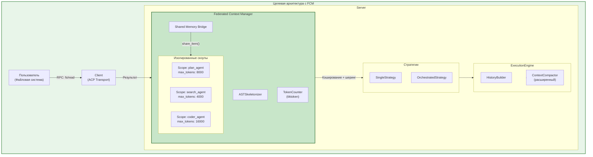
```mermaid
graph TB
    subgraph Target["Целевая архитектура с FCM"]
        User["Пользователь<br/>(Файловая система)"]
        Client["Client<br/>(ACP Transport)"]
        
        subgraph Server["Server"]
            subgraph FCM["Federated Context Manager"]
                Bridge["Shared Memory Bridge"]
                
                subgraph Scopes["Изолированные скоупы"]
                    ScopePlan["Scope: plan_agent<br/>max_tokens: 8000"]
                    ScopeSearch["Scope: search_agent<br/>max_tokens: 4000"]
                    ScopeCoder["Scope: coder_agent<br/>max_tokens: 16000"]
                end
                
                Skeletonizer["ASTSkeletonizer"]
                TokenCounter["TokenCounter<br/>(tiktoken)"]
            end
            
            subgraph Strategies["Стратегии"]
                Single["SingleStrategy"]
                Orch["OrchestratedStrategy"]
            end
            
            subgraph Engine["ExecutionEngine"]
                Builder["HistoryBuilder"]
                Compactor["ContextCompactor<br/>(расширенный)"]
            end
        end
    end
    
    User -->|"RPC: fs/read"| Client
    Client -->|"Результат"| FCM
    FCM -->|"Кэширование + шеринг"| Strategies
    Strategies --> Engine
    Engine --> Compactor
    
    Bridge -->|"share_item()"| Scopes
    
    style Target fill:#e8f5e9,stroke:#2e7d32,stroke-width:2px
    style FCM fill:#c8e6c9,stroke:#1b5e20,stroke-width:2px
```

### 2.4. Что получает пользователь

| Преимущество | Описание |
|--------------|----------|
| **Скорость** | Нет повторных RPC запросов — данные копируются в RAM за 0 мс |
| **Качество** | AST-скелетирование сохраняет структуру кода при сжатии |
| **Предсказуемость** | Каждый агент работает в своём лимите токенов |
| **Экономия** | Точный подсчёт токенов через tiktoken |

---

## 3. Слоистая архитектура

### 3.1. Обзор слоёв

FCM организован в три слоя с чётким разделением ответственностей. Каждый слой зависит только от нижележащих слоёв (Dependency Rule).

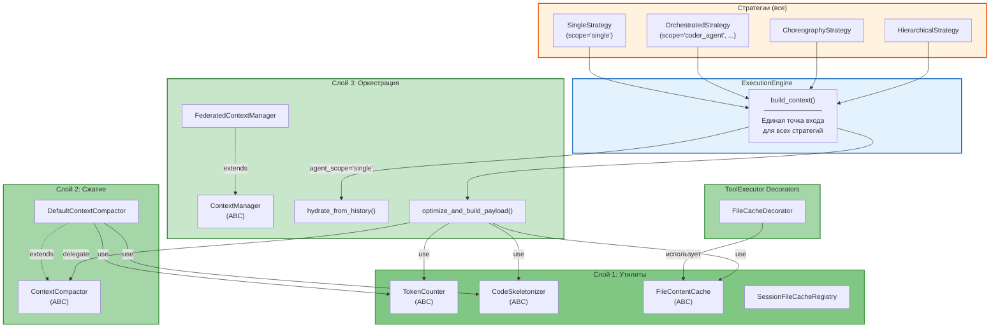
```mermaid
graph TB
    subgraph Strategies["Стратегии (все)"]
        Single["SingleStrategy<br/>(scope='single')"]
        Orch["OrchestratedStrategy<br/>(scope='coder_agent', ...)"]
        Chor["ChoreographyStrategy"]
        Hier["HierarchicalStrategy"]
    end
    
    subgraph EE["ExecutionEngine"]
        BC["build_context()<br/>────────────<br/>Единая точка входа<br/>для всех стратегий"]
    end
    
    subgraph Layer3["Слой 3: Оркестрация"]
        CM["ContextManager<br/>(ABC)"]
        FCM["FederatedContextManager"]
        HS["hydrate_from_history()"]
        OBP["optimize_and_build_payload()"]
        
        FCM -.->|"extends"| CM
    end
    
    subgraph Layer2["Слой 2: Сжатие"]
        CC["ContextCompactor<br/>(ABC)"]
        DCC["DefaultContextCompactor"]
        
        DCC -.->|"extends"| CC
    end
    
    subgraph Layer1["Слой 1: Утилиты"]
        TC["TokenCounter<br/>(ABC)"]
        SK["CodeSkeletonizer<br/>(ABC)"]
        FCC["FileContentCache<br/>(ABC)"]
        SFCC["SessionFileCacheRegistry"]
    end
    
    subgraph Decorators["ToolExecutor Decorators"]
        CID["FileCacheDecorator"]
        CID -->|"использует"| FCC
    end
    
    Single --> BC
    Orch --> BC
    Chor --> BC
    Hier --> BC
    
    BC -->|"agent_scope='single'"| HS
    BC --> OBP
    OBP -->|"delegate"| CC
    OBP -->|"use"| TC
    OBP -->|"use"| SK
    OBP -->|"use"| FCC
    DCC -->|"use"| TC
    DCC -->|"use"| SK
    
    style Strategies fill:#fff3e0,stroke:#e65100,stroke-width:2px
    style EE fill:#e3f2fd,stroke:#1565c0,stroke-width:2px
    style Layer3 fill:#c8e6c9,stroke:#2e7d32,stroke-width:2px
    style Layer2 fill:#a5d6a7,stroke:#388e3c,stroke-width:2px
    style Layer1 fill:#81c784,stroke:#43a047,stroke-width:2px
    style Decorators fill:#a5d6a7,stroke:#388e3c,stroke-width:2px
```

### 3.1.1. Единый путь формирования payload

Все стратегии используют **единый путь** через `ExecutionEngine.build_context()` → `FCM`:

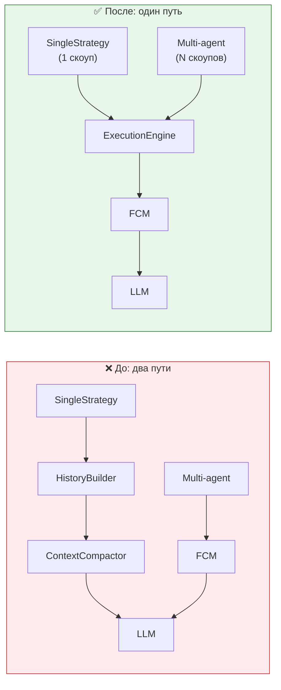
```mermaid
graph LR
    subgraph Before["❌ До: два пути"]
        S1["SingleStrategy"] --> S2["HistoryBuilder"]
        S2 --> S3["ContextCompactor"]
        S3 --> S4["LLM"]
        
        M1["Multi-agent"] --> M2["FCM"]
        M2 --> S4
    end
    
    subgraph After["✅ После: один путь"]
        U1["SingleStrategy<br/>(1 скоуп)"] --> U2["ExecutionEngine"]
        U3["Multi-agent<br/>(N скоупов)"] --> U2
        U2 --> U4["FCM"]
        U4 --> U5["LLM"]
    end
    
    style Before fill:#ffebee,stroke:#c62828
    style After fill:#e8f5e9,stroke:#2e7d32
```

**Преимущества единого пути:**

| Преимущество | Описание |
|--------------|----------|
| **Кэш файлов** | Все стратегии получают кэш (не только multi-agent) |
| **AST-скелетирование** | Все стратегии получают сжатие кода |
| **Приоритеты** | Все стратегии получают приоритизацию |
| **Единый код** | Одна логика формирования payload |
| **Переключение стратегии** | Контекст в FCM — можно переключаться без потери |

### 3.1.2. SingleStrategy vs Multi-agent

Разница — только в количестве скоупов:

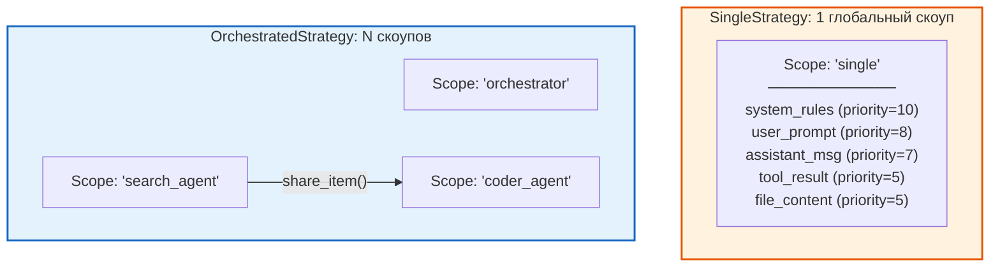
```mermaid
graph TB
    subgraph Single["SingleStrategy: 1 глобальный скоуп"]
        SS["Scope: 'single'<br/>────────────<br/>system_rules (priority=10)<br/>user_prompt (priority=8)<br/>assistant_msg (priority=7)<br/>tool_result (priority=5)<br/>file_content (priority=5)"]
    end
    
    subgraph Orch["OrchestratedStrategy: N скоупов"]
        OS1["Scope: 'orchestrator'"]
        OS2["Scope: 'search_agent'"]
        OS3["Scope: 'coder_agent'"]
        
        OS2 -->|"share_item()"| OS3
    end
    
    style Single fill:#fff3e0,stroke:#e65100,stroke-width:2px
    style Orch fill:#e3f2fd,stroke:#1565c0,stroke-width:2px
```

**Поток данных для SingleStrategy:**

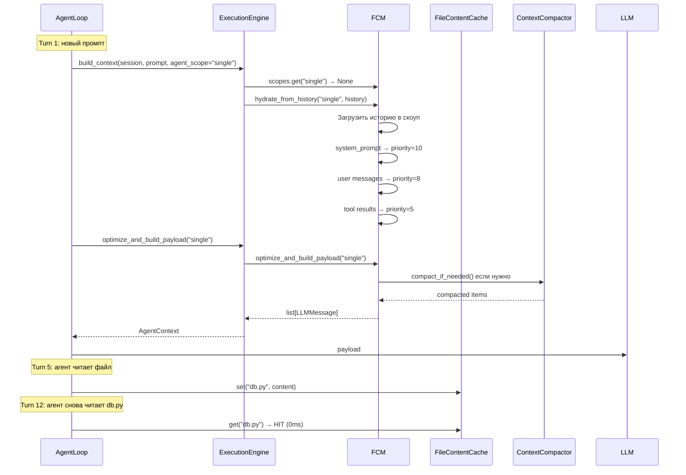
```mermaid
sequenceDiagram
    participant AL as AgentLoop
    participant EE as ExecutionEngine
    participant FCM
    participant Cache as FileContentCache
    participant CC as ContextCompactor
    participant LLM
    
    Note over AL: Turn 1: новый промпт
    AL->>EE: build_context(session, prompt, agent_scope="single")
    EE->>FCM: scopes.get("single") → None
    EE->>FCM: hydrate_from_history("single", history)
    FCM->>FCM: Загрузить историю в скоуп
    FCM->>FCM: system_prompt → priority=10
    FCM->>FCM: user messages → priority=8
    FCM->>FCM: tool results → priority=5
    
    AL->>EE: optimize_and_build_payload("single")
    EE->>FCM: optimize_and_build_payload("single")
    FCM->>CC: compact_if_needed() если нужно
    CC-->>FCM: compacted items
    FCM-->>EE: list[LLMMessage]
    EE-->>AL: AgentContext
    AL->>LLM: payload
    
    Note over AL: Turn 5: агент читает файл
    AL->>Cache: set("db.py", content)
    
    Note over AL: Turn 12: агент снова читает db.py
    AL->>Cache: get("db.py") → HIT (0ms)
```

**Поток данных для Multi-agent (OrchestratedStrategy):**

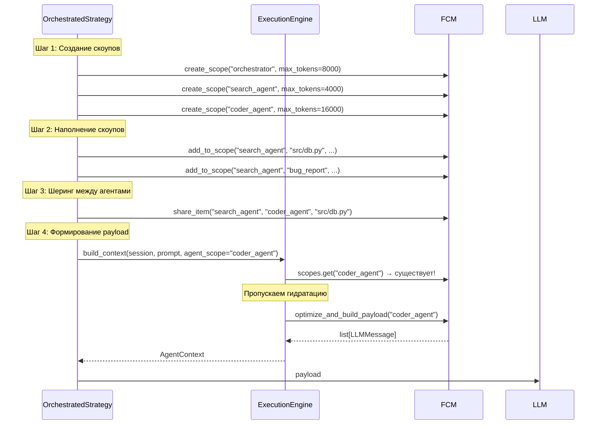
```mermaid
sequenceDiagram
    participant Strategy as OrchestratedStrategy
    participant EE as ExecutionEngine
    participant FCM
    participant LLM
    
    Note over Strategy: Шаг 1: Создание скоупов
    Strategy->>FCM: create_scope("orchestrator", max_tokens=8000)
    Strategy->>FCM: create_scope("search_agent", max_tokens=4000)
    Strategy->>FCM: create_scope("coder_agent", max_tokens=16000)
    
    Note over Strategy: Шаг 2: Наполнение скоупов
    Strategy->>FCM: add_to_scope("search_agent", "src/db.py", ...)
    Strategy->>FCM: add_to_scope("search_agent", "bug_report", ...)
    
    Note over Strategy: Шаг 3: Шеринг между агентами
    Strategy->>FCM: share_item("search_agent", "coder_agent", "src/db.py")
    
    Note over Strategy: Шаг 4: Формирование payload
    Strategy->>EE: build_context(session, prompt, agent_scope="coder_agent")
    EE->>FCM: scopes.get("coder_agent") → существует!
    Note over EE: Пропускаем гидратацию
    EE->>FCM: optimize_and_build_payload("coder_agent")
    FCM-->>EE: list[LLMMessage]
    EE-->>Strategy: AgentContext
    Strategy->>LLM: payload
```

### 3.2. Слой 1: Утилиты (Low-level)

Переиспользуемые компоненты без бизнес-логики.

| Компонент | ABC | Реализации | Паттерн |
|-----------|-----|------------|---------|
| `TokenCounter` | Подсчёт токенов | `TiktokenCounter`, `ApproximateTokenCounter` | Strategy |
| `CodeSkeletonizer` | Сжатие кода | `PythonASTSkeletonizer` | Strategy |
| `FileContentCache` | Кэш содержимого файлов | `InMemoryFileCache` | Repository |
| `SessionFileCacheRegistry` | Реестр кэшей по сессиям | — | Registry |

**Принципы:**
- Не зависят от других слоёв
- Не знают о скоупах, агентах, истории
- Тестируются изолированно

#### FileContentCache

Кэш содержимого файлов для предотвращения повторных RPC запросов к клиенту.

```python
class FileContentCache(ABC):
    """Абстракция для кэша содержимого файлов.
    
    Паттерн: Repository — инкапсулирует хранение кэшированных данных.
    """
    
    @abstractmethod
    def get(self, path: str) -> str | None: ...
    
    @abstractmethod
    def set(self, path: str, content: str) -> None: ...
    
    @abstractmethod
    def invalidate(self, path: str) -> None: ...
    
    @abstractmethod
    def clear(self) -> None: ...


class InMemoryFileCache(FileContentCache):
    """In-Memory реализация с LRU eviction."""
    
    def __init__(self, max_size: int = 1000) -> None:
        self._cache: OrderedDict[str, str] = OrderedDict()
        self._max_size = max_size
    
    def get(self, path: str) -> str | None:
        if path in self._cache:
            self._cache.move_to_end(path)  # LRU
            return self._cache[path]
        return None
    
    def set(self, path: str, content: str) -> None:
        if path in self._cache:
            self._cache.move_to_end(path)
        self._cache[path] = content
        if len(self._cache) > self._max_size:
            self._cache.popitem(last=False)  # evict oldest
    
    def invalidate(self, path: str) -> None:
        self._cache.pop(path, None)
    
    def clear(self) -> None:
        self._cache.clear()
```

#### SessionFileCacheRegistry

Реестр кэшей файлов, привязанный к сессиям. Каждая сессия имеет свой изолированный кэш.

```python
class SessionFileCacheRegistry:
    """Реестр кэшей файлов по сессиям.
    
    Паттерн: Registry (как ToolRegistry, AgentRegistry).
    
    Lifecycle:
    - session/new → get_or_create() → новый кэш
    - session/delete → remove() → кэш удалён
    """
    
    def __init__(self, max_cache_size: int = 1000) -> None:
        self._caches: dict[str, FileContentCache] = {}
        self._max_cache_size = max_cache_size
    
    def get_or_create(self, session_id: str) -> FileContentCache:
        """Получить или создать кэш для сессии."""
        if session_id not in self._caches:
            self._caches[session_id] = InMemoryFileCache(
                max_size=self._max_cache_size,
            )
        return self._caches[session_id]
    
    def get(self, session_id: str) -> FileContentCache | None:
        """Получить кэш сессии (None если не существует)."""
        return self._caches.get(session_id)
    
    def remove(self, session_id: str) -> None:
        """Удалить кэш сессии (при удалении сессии)."""
        cache = self._caches.pop(session_id, None)
        if cache:
            cache.clear()
    
    def clear(self) -> None:
        """Очистить все кэши (graceful shutdown)."""
        for cache in self._caches.values():
            cache.clear()
        self._caches.clear()
```

#### FileCacheDecorator

Единый декоратор для `ToolExecutor`, обслуживающий весь жизненный цикл
кэша файлов (объединяет ранее планировавшиеся `FCMCachingDecorator` и
`CacheInvalidationDecorator` — см. `INTEGRATION_GUIDE.md §2.6`).

Ответственности:
- успешный `fs/read` (полный файл) → `FileContentCache.set()` + опц. `FCM.add_to_scope("file_content")`,
- успешный `fs/read` (partial, `line`/`limit`) → только опц. `FCM.add_to_scope` с составным `item_id`,
- успешный `fs/write` → `FileContentCache.invalidate()`,
- успешный `terminal/*` → опц. `FCM.add_to_scope("terminal_output")`.

`context_manager` опционален — без него декоратор работает как pure
file cache (read-cache + invalidation), что нужно для feature flag
`agents.context.enable_fcm=false`.

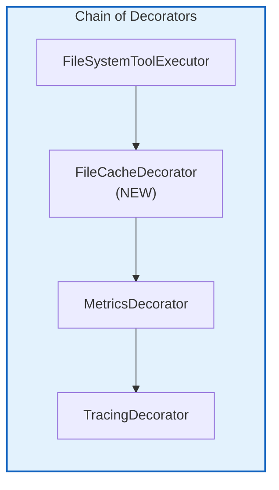
```mermaid
graph LR
    subgraph Chain["Chain of Decorators"]
        Base["FileSystemToolExecutor"]
        FC["FileCacheDecorator<br/>(NEW)"]
        Metrics["MetricsDecorator"]
        Tracing["TracingDecorator"]

        Base --> FC
        FC --> Metrics
        Metrics --> Tracing
    end

    style Chain fill:#e3f2fd,stroke:#1565c0,stroke-width:2px
```

```python
class FileCacheDecorator(ToolExecutorDecorator):
    """Read-cache + write-invalidation + опц. регистрация в FCM scope.

    Полная реализация и тесты приведены в INTEGRATION_GUIDE.md §2.6.
    """

    _READ_OPERATIONS = frozenset({"read"})
    _WRITE_OPERATIONS = frozenset({"write"})

    def __init__(
        self,
        wrapped: ToolExecutorProtocol,
        file_cache: FileContentCache,
        context_manager: ContextManager | None = None,
    ) -> None:
        super().__init__(wrapped)
        self._file_cache = file_cache
        self._context_manager = context_manager

    async def execute(self, session, arguments):
        result = await self._wrapped.execute(session, arguments)
        if not result.success:
            return result
        # _on_read / _on_write / _on_terminal — см. INTEGRATION_GUIDE.md
        ...
        return result
```

**Почему один декоратор, а не два?**

| Критерий | Один `FileCacheDecorator` | Два декоратора |
|----------|--------------------------|----------------|
| **Конфигурация** | ✅ Один объект в цепочке | ❌ Порядок имеет значение |
| **SRP** | ✅ «Жизненный цикл кэша файлов» — одна ответственность | ⚠️ Искусственное расщепление вокруг одного state |
| **Зависимости** | ✅ Один `FileContentCache` | ⚠️ Два декоратора делят один кэш |
| **Тесты** | ✅ Один набор fixtures | ❌ Дублирование setup |
| **Расширение (terminal_output)** | ✅ В том же `_on_terminal` | ❌ Нужен ещё один декоратор |

**Почему Decorator, а не прямая модификация Executor?**

| Критерий | Decorator | Прямая модификация Executor |
|----------|-----------|---------------------------|
| **SRP** | ✅ Executor не знает о кэше | ❌ Executor зависит от кэша |
| **OCP** | ✅ Не меняем существующий код | ❌ Меняем существующий код |
| **Стиль проекта** | ✅ Уже есть 4 декоратора | ❌ Нет такого паттерна |
| **Тестируемость** | ✅ Изолированный тест | ⚠️ Нужно мокать executor |

### 3.3. Слой 2: Сжатие (Mid-level)

Управление сжатием истории сообщений.

| Компонент | ABC | Реализации | Паттерн |
|-----------|-----|------------|---------|
| `ContextCompactor` | Сжатие истории | `DefaultContextCompactor` | Template Method, Composite |

**Фазы сжатия в `DefaultContextCompactor`:**
1. **Prune** — FIFO удаление старых tool outputs
2. **Skeletonize** — AST-сжатие кода (NEW)
3. **Summarize** — LLM-суммаризация

**Принципы:**
- Зависит только от Слоя 1
- Не знает о скоупах и агентах
- Работает с `list[LLMMessage]`

### 3.4. Слой 3: Оркестрация (High-level)

Управление контекстом агентов.

| Компонент | ABC | Реализации | Паттерн |
|-----------|-----|------------|---------|
| `ContextManager` | Оркестрация контекста | `FederatedContextManager` | Mediator, Facade |

**Ответственности:**
- Изолированные скоупы для каждого агента
- Шеринг данных между агентами
- Приоритизация элементов
- ACP-кэш для предотвращения повторных RPC

**Принципы:**
- Зависит от Слоёв 1 и 2
- Делегирует сжатие в `ContextCompactor`
- Координирует взаимодействие агентов

### 3.5. Структура файлов

```
src/codelab/server/agent/context/
├── __init__.py                    # Экспорты
│
├── # Слой 1: Утилиты (ABC + реализации)
├── token_counter.py               # TokenCounter(ABC), TiktokenCounter, ApproximateTokenCounter
├── ast_skeletonizer.py            # CodeSkeletonizer(ABC), PythonASTSkeletonizer
├── file_cache.py                  # FileContentCache(ABC), InMemoryFileCache, SessionFileCacheRegistry
│
├── # Слой 2: Сжатие (ABC + реализация)
├── compactor.py                   # ContextCompactor(ABC), DefaultContextCompactor
│
├── # Слой 3: Оркестрация (ABC + реализация)
├── items.py                       # ContextItem, ContextType (dataclasses)
├── scope.py                       # AgentContextScope
└── manager.py                     # ContextManager(ABC), FederatedContextManager

src/codelab/server/tools/executors/decorators/
├── base.py                        # ToolExecutorDecorator (существующий)
├── metrics.py                     # MetricsDecorator (существующий)
├── timeout.py                     # TimeoutDecorator (существующий)
├── retry.py                       # RetryDecorator (существующий)
├── tracing.py                     # TracingDecorator (существующий)
└── file_cache.py          # FileCacheDecorator (NEW)
```

### 3.6. Почему ABC, а не Protocol?

| Критерий | Protocol | ABC (выбрано) |
|----------|----------|---------------|
| **Стиль проекта** | ❌ Не используется | ✅ `SessionStorage(ABC)`, `ToolRegistry` |
| **Явность** | ❌ Structural typing (duck typing) | ✅ Nominal typing (extends) |
| **Runtime проверка** | ✅ С `@runtime_checkable` | ✅ Всегда через `isinstance()` |
| **IDE поддержка** | ✅ Хорошая | ✅ Отличная |
| **Документация** | ❌ Неявный контракт | ✅ Явный контракт через наследование |

**Решение:** ABC соответствует стилю проекта и обеспечивает явный контракт.

### 3.7. Базовые ABC: канонические определения

Ниже приведены полные сигнатуры базовых классов слоёв 2 и 3, которые ранее
существовали только в виде Mermaid-диаграмм. Эти определения — единственный
источник истины для реализации.

#### Слой 2: `ContextCompactor`

**Файл:** `src/codelab/server/agent/context/compactor.py`

```python
from __future__ import annotations

from abc import ABC, abstractmethod

from codelab.server.llm.models import LLMMessage


class ContextCompactor(ABC):
    """Сжатие истории сообщений (Template Method).

    Контракт:
    - Принимает текущую историю сообщений.
    - Возвращает (new_history, was_compacted, mode), где
      * new_history — список сообщений после сжатия,
      * was_compacted — была ли применена компакция,
      * mode — короткий ярлык применённой стратегии
        ("noop" | "pruned" | "skeletonized" | "summarized").
    - Не мутирует входной список.
    - Гарантирует idempotency: повторный вызов на уже сжатой истории
      не должен приводить к дополнительной потере информации.
    """

    @abstractmethod
    async def compact_if_needed(
        self,
        history: list[LLMMessage],
    ) -> tuple[list[LLMMessage], bool, str]: ...
```

`DefaultContextCompactor` реализует фазы Prune → Skeletonize → Summarize
(см. §5.2).

#### Слой 3: `ContextManager`

**Файл:** `src/codelab/server/agent/context/manager.py`

```python
from __future__ import annotations

from abc import ABC, abstractmethod

from codelab.server.acp.types import ConversationMessage
from codelab.server.agent.context.items import ContextType
from codelab.server.agent.context.scope import AgentContextScope
from codelab.server.llm.models import LLMMessage


class ContextManager(ABC):
    """Оркестрация контекста агентов (Mediator + Facade).

    Контракт:
    - Управляет жизненным циклом изолированных скоупов (`AgentContextScope`).
    - Предоставляет операции наполнения, шеринга, гидратации и формирования
      payload для LLM.
    - Не выполняет tool execution и не обращается напрямую к ACP клиенту.
    """

    scopes: dict[str, AgentContextScope]

    @abstractmethod
    async def create_scope(
        self,
        scope_name: str,
        max_tokens: int = 4000,
    ) -> AgentContextScope: ...

    @abstractmethod
    async def add_to_scope(
        self,
        scope_name: str,
        item_id: str,
        content_type: ContextType,
        content: str,
        priority: int = 5,
    ) -> None: ...

    @abstractmethod
    async def share_item(
        self,
        source_scope: str,
        target_scope: str,
        item_id: str,
        new_priority: int | None = None,
    ) -> None: ...

    @abstractmethod
    async def hydrate_from_history(
        self,
        scope_name: str,
        history: list[ConversationMessage],
        system_prompt: str | None = None,
    ) -> None:
        """Загрузить историю сессии в скоуп.

        Вызывается из `ExecutionEngine.build_context()` автоматически,
        когда скоуп ещё не существует (SingleStrategy).
        """

    @abstractmethod
    async def optimize_and_build_payload(
        self,
        scope_name: str,
    ) -> list[LLMMessage]: ...
```

`FederatedContextManager` — единственная in-tree реализация (см. §5.3).

---

## 4. Паттерны проектирования

### 4.1. Strategy (Слой 1)

**Проблема:** Разные способы подсчёта токенов и скелетирования.

**Решение:** Семейство алгоритмов, инкапсулированное в отдельных классах.

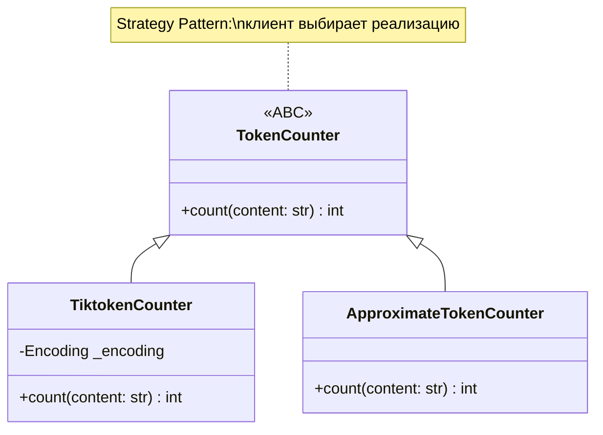
```mermaid
classDiagram
    class TokenCounter {
        <<ABC>>
        +count(content: str) int
    }
    
    class TiktokenCounter {
        -Encoding _encoding
        +count(content: str) int
    }
    
    class ApproximateTokenCounter {
        +count(content: str) int
    }
    
    TokenCounter <|-- TiktokenCounter
    TokenCounter <|-- ApproximateTokenCounter
    
    note for TokenCounter "Strategy Pattern:\nклиент выбирает реализацию"
```

```python
# Использование
counter: TokenCounter = create_token_counter()  # Factory Method
tokens = counter.count("Hello, world!")
```

### 4.2. Template Method (Слой 2)

**Проблема:** Алгоритм сжатия имеет фиксированную структуру, но фазы могут варьироваться.

**Решение:** Базовый класс определяет скелет алгоритма, подклассы — детали.

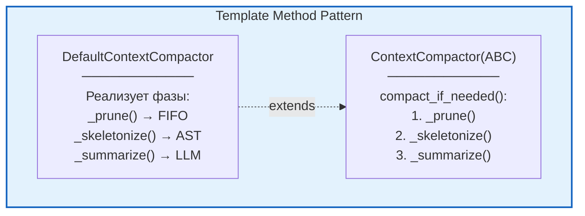
```mermaid
graph TD
    subgraph TemplateMethod["Template Method Pattern"]
        Base["ContextCompactor(ABC)<br/>────────────<br/>compact_if_needed():<br/>  1. _prune()<br/>  2. _skeletonize()<br/>  3. _summarize()"]
        
        Impl["DefaultContextCompactor<br/>────────────<br/>Реализует фазы:<br/>  _prune() → FIFO<br/>  _skeletonize() → AST<br/>  _summarize() → LLM"]
    end
    
    Impl -.->|"extends"| Base
    
    style TemplateMethod fill:#e3f2fd,stroke:#1565c0,stroke-width:2px
```

### 4.3. Composite (Слой 2)

**Проблема:** Сжатие — композиция нескольких стратегий.

**Решение:** `DefaultContextCompactor` компонирует `TokenCounter` и `CodeSkeletonizer`.

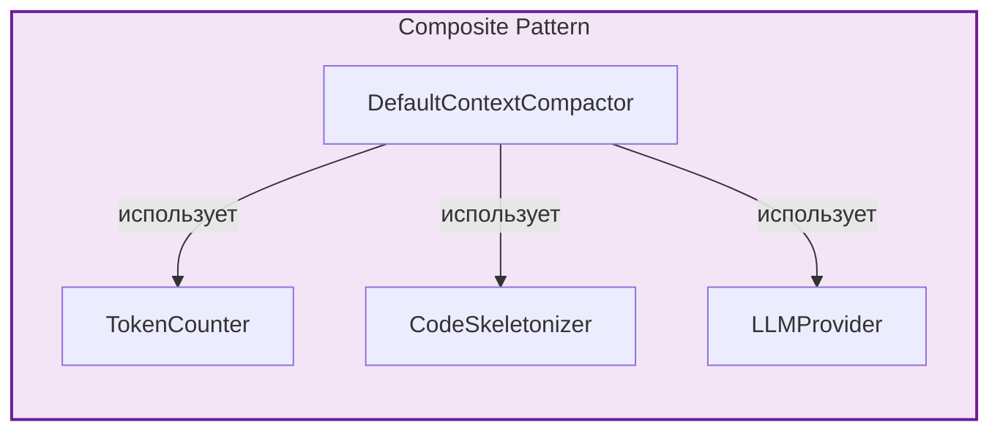
```mermaid
graph LR
    subgraph Composite["Composite Pattern"]
        Compactor["DefaultContextCompactor"]
        
        TC["TokenCounter"]
        SK["CodeSkeletonizer"]
        LLM["LLMProvider"]
        
        Compactor -->|"использует"| TC
        Compactor -->|"использует"| SK
        Compactor -->|"использует"| LLM
    end
    
    style Composite fill:#f3e5f5,stroke:#6a1b9a,stroke-width:2px
```

### 4.4. Mediator (Слой 3)

**Проблема:** Агенты не должны общаться напрямую.

**Решение:** `FederatedContextManager` — посредник, координирующий взаимодействие.

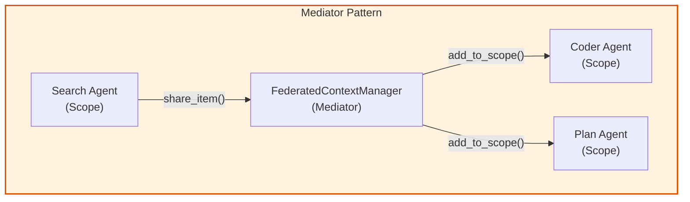
```mermaid
graph TB
    subgraph Mediator["Mediator Pattern"]
        FCM["FederatedContextManager<br/>(Mediator)"]
        
        Search["Search Agent<br/>(Scope)"]
        Coder["Coder Agent<br/>(Scope)"]
        Plan["Plan Agent<br/>(Scope)"]
        
        Search -->|"share_item()"| FCM
        FCM -->|"add_to_scope()"| Coder
        FCM -->|"add_to_scope()"| Plan
    end
    
    style Mediator fill:#fff3e0,stroke:#e65100,stroke-width:2px
```

### 4.5. Factory Method (Слой 1)

**Проблема:** Создание `TokenCounter` с проверкой доступности tiktoken.

**Решение:** Factory функция выбирает реализацию.

```python
def create_token_counter() -> TokenCounter:
    """Factory Method: создать лучший доступный TokenCounter."""
    try:
        return TiktokenCounter()
    except ImportError:
        return ApproximateTokenCounter()
```

### 4.6. Сводная таблица паттернов

| Паттерн | Слой | Компонент | Назначение |
|---------|------|-----------|------------|
| **Strategy** | 1 | `TokenCounter`, `CodeSkeletonizer` | Семейство алгоритмов |
| **Repository** | 1 | `FileContentCache` | Инкапсуляция кэша файлов |
| **Registry** | 1 | `SessionFileCacheRegistry` | Управление кэшами по сессиям |
| **Decorator** | 1 | `FileCacheDecorator` | Read-cache + write-invalidation + опц. регистрация в FCM scope |
| **Template Method** | 2 | `ContextCompactor` | Скелет алгоритма |
| **Composite** | 2 | `DefaultContextCompactor` | Композиция стратегий |
| **Mediator** | 3 | `FederatedContextManager` | Координация агентов |
| **Facade** | 3 | `FederatedContextManager` | Упрощённый интерфейс |
| **Factory Method** | 1 | `create_token_counter()` | Создание объектов |

---

## 5. Подсистемы FCM

### 5.1. Слой 1: Утилиты

#### TokenCounter (Strategy Pattern)

**Назначение:** Подсчёт токенов с возможностью выбора реализации.

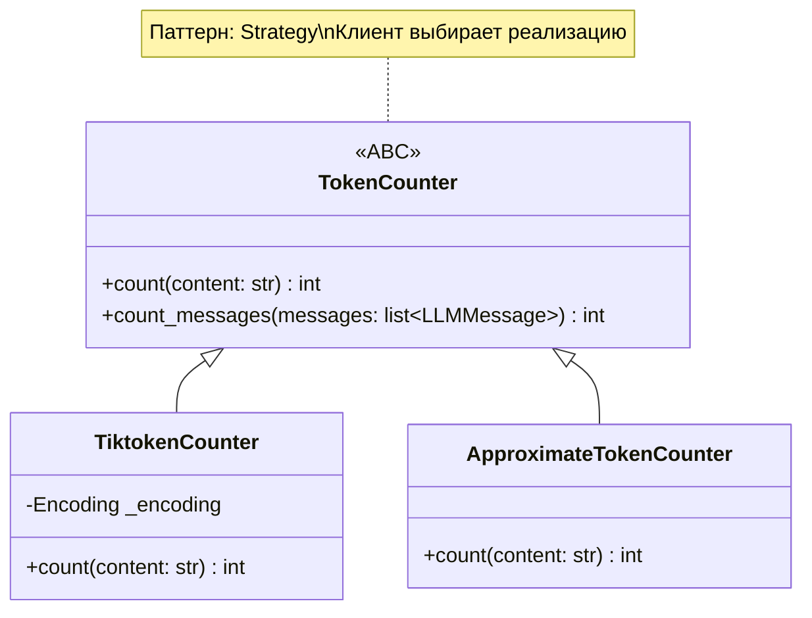
```mermaid
classDiagram
    class TokenCounter {
        <<ABC>>
        +count(content: str) int
        +count_messages(messages: list~LLMMessage~) int
    }
    
    class TiktokenCounter {
        -Encoding _encoding
        +count(content: str) int
    }
    
    class ApproximateTokenCounter {
        +count(content: str) int
    }
    
    TokenCounter <|-- TiktokenCounter
    TokenCounter <|-- ApproximateTokenCounter
    
    note for TokenCounter "Паттерн: Strategy\nКлиент выбирает реализацию"
```

**Реализации:**

| Класс | Точность | Зависимости | Когда использовать |
|-------|----------|-------------|-------------------|
| `TiktokenCounter` | 100% | `tiktoken` | Production |
| `ApproximateTokenCounter` | ~70-130% | Нет | Fallback, тесты |

```python
# Использование
counter: TokenCounter = create_token_counter()  # Factory Method
tokens = counter.count("Hello, world!")
```

#### CodeSkeletonizer (Strategy Pattern)

**Назначение:** Сжатие кода до скелета (сигнатуры классов/функций).

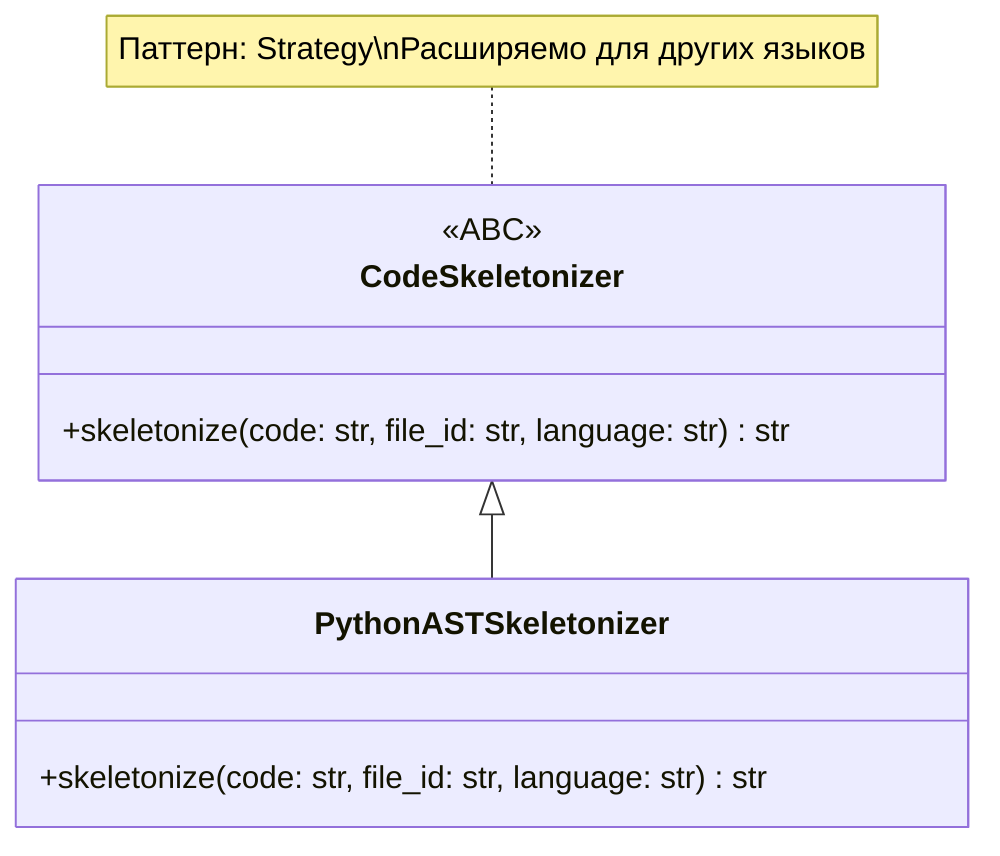
```mermaid
classDiagram
    class CodeSkeletonizer {
        <<ABC>>
        +skeletonize(code: str, file_id: str, language: str) str
    }
    
    class PythonASTSkeletonizer {
        +skeletonize(code: str, file_id: str, language: str) str
    }
    
    CodeSkeletonizer <|-- PythonASTSkeletonizer
    
    note for CodeSkeletonizer "Паттерн: Strategy\nРасширяемо для других языков"
```

**Пример:**

```python
# Исходный код: 200 токенов
code = """
class DatabaseConnector:
    def connect(self):
        print("Connecting...")
        # 50 строк логики
        
    def execute_query(self, query: str) -> dict:
        if not query:
            raise ValueError("Empty query")
        return {"status": "executed"}
"""

# Скелет: 30 токенов
skeletonizer = PythonASTSkeletonizer()
result = skeletonizer.skeletonize(code, "db.py")
# class DatabaseConnector:
#     def connect(self): ...
#     def execute_query(self, query: str) -> dict: ...
```

### 5.2. Слой 2: Сжатие

#### ContextCompactor (Template Method + Composite)

**Назначение:** Сжатие истории сообщений при превышении лимита.

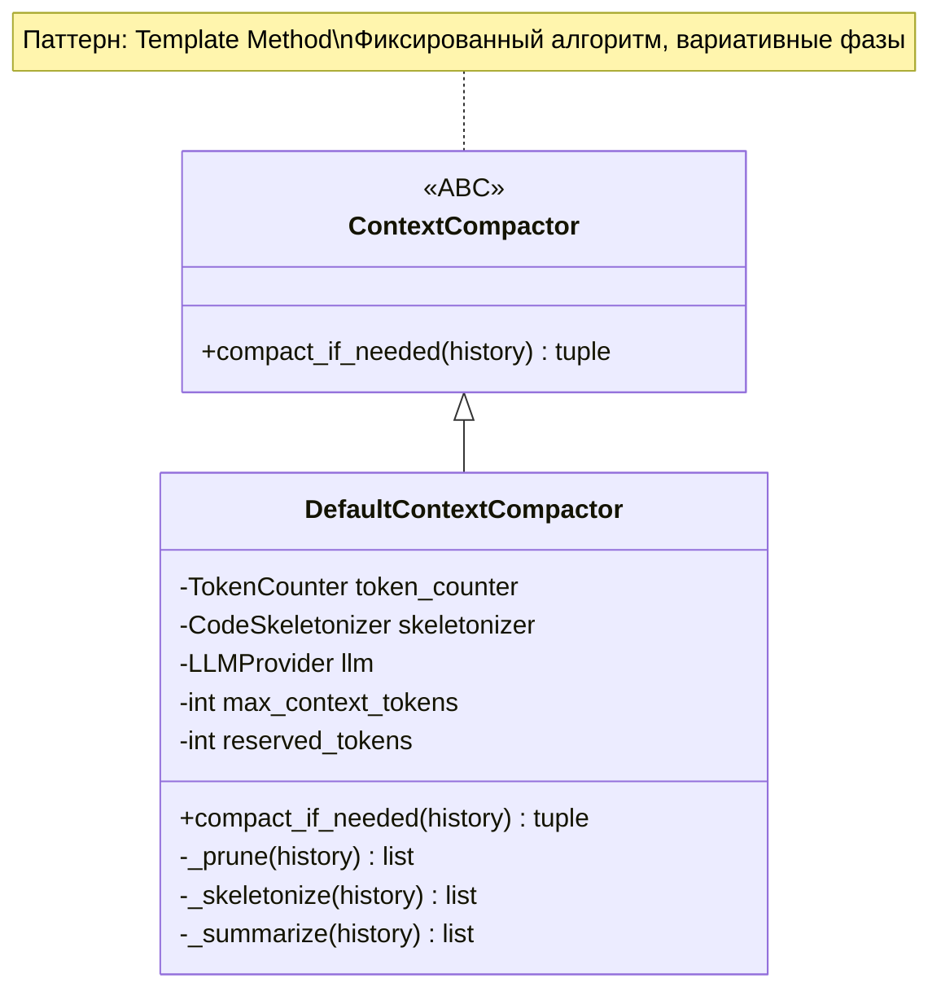
```mermaid
classDiagram
    class ContextCompactor {
        <<ABC>>
        +compact_if_needed(history) tuple
    }
    
    class DefaultContextCompactor {
        -TokenCounter token_counter
        -CodeSkeletonizer skeletonizer
        -LLMProvider llm
        -int max_context_tokens
        -int reserved_tokens
        +compact_if_needed(history) tuple
        -_prune(history) list
        -_skeletonize(history) list
        -_summarize(history) list
    }
    
    ContextCompactor <|-- DefaultContextCompactor
    
    note for ContextCompactor "Паттерн: Template Method\nФиксированный алгоритм, вариативные фазы"
```

**Фазы сжатия:**

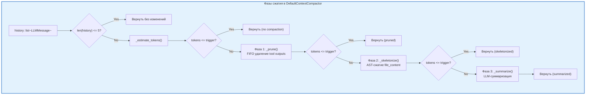
```mermaid
graph TD
    subgraph Phases["Фазы сжатия в DefaultContextCompactor"]
        Input["history: list~LLMMessage~"]
        
        Check{"len(history) <= 5?"}
        ShortCircuit["Вернуть без изменений"]
        
        Estimate["_estimate_tokens()"]
        WithinLimit{"tokens <= trigger?"}
        ReturnOk["Вернуть (no compaction)"]
        
        Phase1["Фаза 1: _prune()<br/>FIFO удаление tool outputs"]
        PrunedOk{"tokens <= trigger?"}
        ReturnPruned["Вернуть (pruned)"]
        
        Phase2["Фаза 2: _skeletonize()<br/>AST-сжатие file_content"]
        SkeletonOk{"tokens <= trigger?"}
        ReturnSkeleton["Вернуть (skeletonized)"]
        
        Phase3["Фаза 3: _summarize()<br/>LLM-суммаризация"]
        ReturnSummarized["Вернуть (summarized)"]
    end
    
    Input --> Check
    Check -->|Yes| ShortCircuit
    Check -->|No| Estimate
    Estimate --> WithinLimit
    WithinLimit -->|Yes| ReturnOk
    WithinLimit -->|No| Phase1
    Phase1 --> PrunedOk
    PrunedOk -->|Yes| ReturnPruned
    PrunedOk -->|No| Phase2
    Phase2 --> SkeletonOk
    SkeletonOk -->|Yes| ReturnSkeleton
    SkeletonOk -->|No| Phase3
    Phase3 --> ReturnSummarized
    
    style Phases fill:#e3f2fd,stroke:#1565c0,stroke-width:2px
```

### 5.3. Слой 3: Оркестрация

#### ContextManager (Mediator + Facade)

**Назначение:** Управление контекстом агентов — скоупы, шеринг, приоритизация.

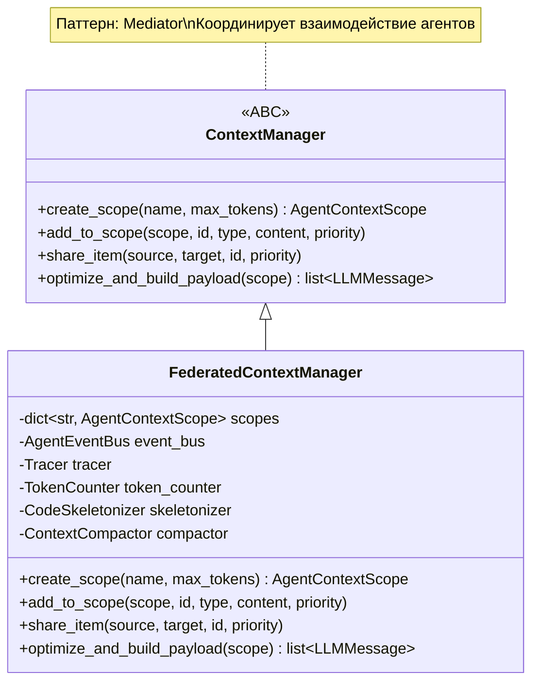
```mermaid
classDiagram
    class ContextManager {
        <<ABC>>
        +create_scope(name, max_tokens) AgentContextScope
        +add_to_scope(scope, id, type, content, priority)
        +share_item(source, target, id, priority)
        +optimize_and_build_payload(scope) list~LLMMessage~
    }
    
    class FederatedContextManager {
        -dict~str, AgentContextScope~ scopes
        -AgentEventBus event_bus
        -Tracer tracer
        -TokenCounter token_counter
        -CodeSkeletonizer skeletonizer
        -ContextCompactor compactor
        +create_scope(name, max_tokens) AgentContextScope
        +add_to_scope(scope, id, type, content, priority)
        +share_item(source, target, id, priority)
        +optimize_and_build_payload(scope) list~LLMMessage~
    }
    
    ContextManager <|-- FederatedContextManager
    
    note for ContextManager "Паттерн: Mediator\nКоординирует взаимодействие агентов"
```

**Взаимодействие со слоями:**

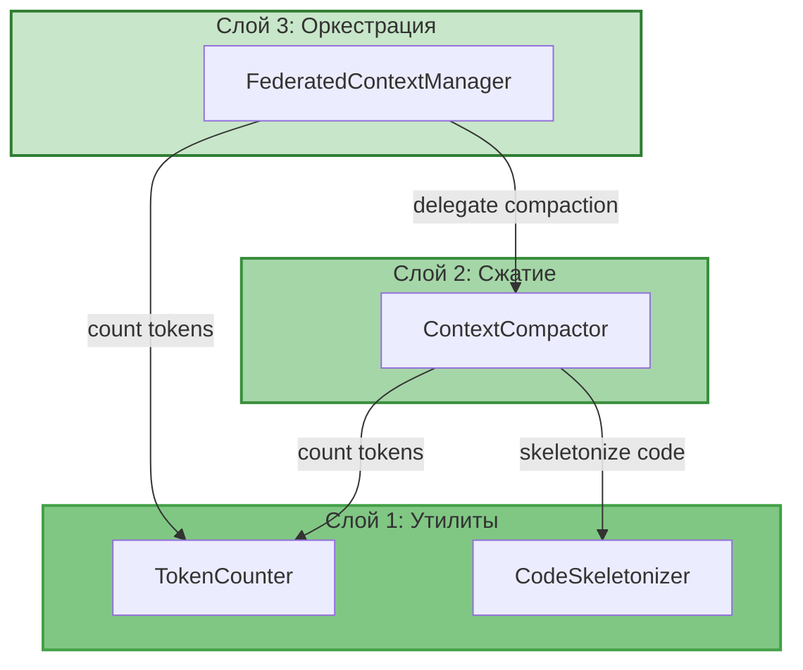
```mermaid
graph TB
    subgraph Layer3["Слой 3: Оркестрация"]
        FCM["FederatedContextManager"]
    end
    
    subgraph Layer2["Слой 2: Сжатие"]
        CC["ContextCompactor"]
    end
    
    subgraph Layer1["Слой 1: Утилиты"]
        TC["TokenCounter"]
        SK["CodeSkeletonizer"]
    end
    
    FCM -->|"delegate compaction"| CC
    FCM -->|"count tokens"| TC
    CC -->|"count tokens"| TC
    CC -->|"skeletonize code"| SK
    
    style Layer3 fill:#c8e6c9,stroke:#2e7d32,stroke-width:2px
    style Layer2 fill:#a5d6a7,stroke:#388e3c,stroke-width:2px
    style Layer1 fill:#81c784,stroke:#43a047,stroke-width:2px
```

#### ContextItem и AgentContextScope

**ContextItem** — единица информации (frozen dataclass):

```python
@dataclass(frozen=True)
class ContextItem:
    id: str
    type: ContextType
    content: str
    priority: int = 5
    owner_scope: str = "global"
    last_accessed: float = field(default_factory=time.time)
    token_count: int = 0
```

**AgentContextScope** — изолированная область агента:

```python
class AgentContextScope:
    def __init__(self, scope_name: str, max_tokens: int) -> None:
        self.scope_name = scope_name
        self.max_tokens = max_tokens
        self.registry: dict[str, ContextItem] = {}
    
    def add(self, item: ContextItem) -> None: ...
    def get(self, item_id: str) -> ContextItem | None: ...
    def remove(self, item_id: str) -> None: ...
    def get_total_tokens(self) -> int: ...
```

### 5.4. Жизненный цикл контекста

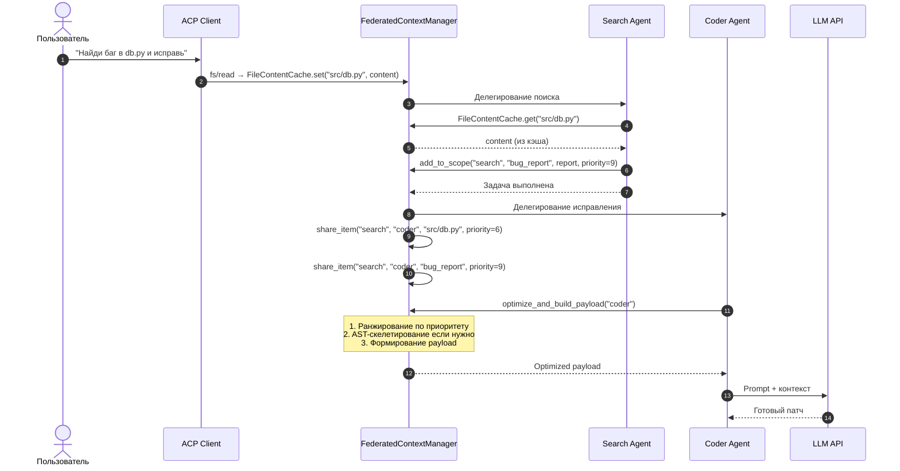
```mermaid
sequenceDiagram
    autonumber
    actor User as Пользователь
    participant Client as ACP Client
    participant FCM as FederatedContextManager
    participant Search as Search Agent
    participant Coder as Coder Agent
    participant LLM as LLM API
    
    User->>Client: "Найди баг в db.py и исправь"
    Client->>FCM: fs/read → FileContentCache.set("src/db.py", content)
    
    FCM->>Search: Делегирование поиска
    Search->>FCM: FileContentCache.get("src/db.py")
    FCM-->>Search: content (из кэша)
    Search->>FCM: add_to_scope("search", "bug_report", report, priority=9)
    Search-->>FCM: Задача выполнена
    
    FCM->>Coder: Делегирование исправления
    FCM->>FCM: share_item("search", "coder", "src/db.py", priority=6)
    FCM->>FCM: share_item("search", "coder", "bug_report", priority=9)
    
    Coder->>FCM: optimize_and_build_payload("coder")
    Note over FCM: 1. Ранжирование по приоритету<br/>2. AST-скелетирование если нужно<br/>3. Формирование payload
    FCM-->>Coder: Optimized payload
    Coder->>LLM: Prompt + контекст
    LLM-->>Coder: Готовый патч
```

### 5.5. Топология скоупов

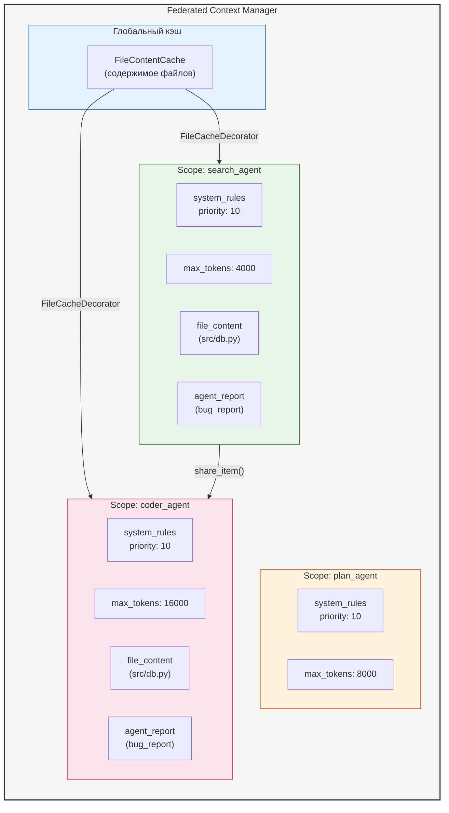
```mermaid
graph LR
    subgraph FCM["Federated Context Manager"]
        subgraph Global["Глобальный кэш"]
            Cache["FileContentCache<br/>(содержимое файлов)"]
        end
        
        subgraph PlanScope["Scope: plan_agent"]
            PlanRules["system_rules<br/>priority: 10"]
            PlanBudget["max_tokens: 8000"]
        end
        
        subgraph SearchScope["Scope: search_agent"]
            SearchRules["system_rules<br/>priority: 10"]
            SearchBudget["max_tokens: 4000"]
            SearchFiles["file_content<br/>(src/db.py)"]
            SearchReports["agent_report<br/>(bug_report)"]
        end
        
        subgraph CoderScope["Scope: coder_agent"]
            CoderRules["system_rules<br/>priority: 10"]
            CoderBudget["max_tokens: 16000"]
            CoderFiles["file_content<br/>(src/db.py)"]
            CoderReports["agent_report<br/>(bug_report)"]
        end
    end
    
    Cache -->|"FileCacheDecorator"| SearchScope
    Cache -->|"FileCacheDecorator"| CoderScope
    
    SearchScope -->|"share_item()"| CoderScope
    
    style FCM fill:#f5f5f5,stroke:#333,stroke-width:2px
    style Global fill:#e3f2fd,stroke:#1565c0
    style PlanScope fill:#fff3e0,stroke:#e65100
    style SearchScope fill:#e8f5e9,stroke:#2e7d32
    style CoderScope fill:#fce4ec,stroke:#c2185b
```

---

## 5A. Подсистемы FCM — детальная спецификация (структуры данных и алгоритмы)

> Глава дополняет §5 (компоненты по слоям) детальными структурами данных,
> алгоритмами и потоками. Нумерация §5A.x локальна для этой главы.

### 5A.1. ContextItem — единица информации

**Назначение:** Минимальная единица информации в памяти FCM.

```mermaid
classDiagram
    class ContextItem {
        +str id
        +ContextType type
        +str content
        +int priority
        +str owner_scope
        +float last_accessed
        +int token_count
        +touch()
        +_calculate_tokens() int
    }
    
    class ContextType {
        <<enumeration>>
        file_content
        file_skeleton
        terminal_output
        user_prompt
        system_rules
        agent_report
    }
    
    ContextItem --> ContextType : type
    
    note for ContextItem "Frozen dataclass\nImmutable после создания"
    note for ContextType "Literal type для типобезопасности"
```

**Поля:**

| Поле | Тип | Описание |
|------|-----|----------|
| `id` | `str` | Уникальный идентификатор (путь к файлу, ID отчёта) |
| `type` | `ContextType` | Тип данных (file_content, agent_report, ...) |
| `content` | `str` | Текстовое содержимое |
| `priority` | `int` | Приоритет: 0-4 (низкий), 5-9 (высокий), 10+ (критический) |
| `owner_scope` | `str` | Идентификатор скоупа-владельца |
| `last_accessed` | `float` | Метка времени для LRU-вытеснения |
| `token_count` | `int` | Вес элемента в токенах |

**Приоритеты:**

| Диапазон | Значение | Примеры |
|----------|----------|---------|
| 0-4 | Низкий | Старые логи, устаревшие отчёты |
| 5-9 | Высокий | Текущие файлы, активные отчёты |
| 10+ | Критический | System rules, не вытесняются |

### 5A.2. AgentContextScope — изолированная область агента

**Назначение:** Изолированное пространство памяти для конкретного агента.

```mermaid
classDiagram
    class AgentContextScope {
        +str scope_name
        +int max_tokens
        +dict~str, ContextItem~ registry
        +add(item: ContextItem)
        +get(item_id: str) ContextItem | None
        +remove(item_id: str)
        +get_total_tokens() int
        +get_items_by_priority() list~ContextItem~
    }
    
    class ContextItem {
        +str id
        +str content
        +int priority
    }
    
    AgentContextScope "1" *-- "*" ContextItem : registry
    
    note for AgentContextScope "Изолированная область\nОдин скоуп = один агент"
```

**Методы:**

| Метод | Описание |
|-------|----------|
| `add(item)` | Добавить элемент в скоуп |
| `get(item_id)` | Получить элемент по ID (обновляет `last_accessed`) |
| `remove(item_id)` | Удалить элемент из скоупа |
| `get_total_tokens()` | Сумма токенов всех элементов |
| `get_items_by_priority()` | Сортировка по приоритету (DESC) и LRU |

**Жизненный цикл скоупа:**

```mermaid
stateDiagram-v2
    [*] --> Created: create_scope()
    Created --> Active: Агент зарегистрирован
    Active --> Active: add() / get() / share_item()
    Active --> Destroyed: Агент удалён
    Destroyed --> [*]
    
    note right of Created
        Инициализация:
        - scope_name
        - max_tokens
        - empty registry
    end note
    
    note right of Active
        Активная фаза:
        - Добавление элементов
        - Чтение элементов
        - Шеринг между агентами
    end note
```

### 5A.3. ASTSkeletonizer — сжатие кода

**Назначение:** Сжатие исходного кода до сигнатур классов и функций для экономии токенов.

```mermaid
graph LR
    subgraph Input["Исходный код"]
        Code["class DatabaseConnector:<br/>    def connect(self):<br/>        print('Connecting...')<br/>        # 100 строк логики<br/>    <br/>    def execute_query(self, query: str):<br/>        if not query:<br/>            raise ValueError(...)<br/>        # 50 строк логики"]
    end
    
    subgraph Skeletonizer["ASTSkeletonizer"]
        Parse["ast.parse()"]
        Visit["NodeVisitor"]
        Extract["Извлечение сигнатур"]
    end
    
    subgraph Output["Скелет"]
        Skeleton["class DatabaseConnector:<br/>    def connect(self): ...<br/>    <br/>    def execute_query(self, query: str): ..."]
    end
    
    Code --> Parse
    Parse --> Visit
    Visit --> Extract
    Extract --> Skeleton
    
    style Input fill:#ffebee,stroke:#c62828
    style Skeletonizer fill:#e3f2fd,stroke:#1565c0
    style Output fill:#e8f5e9,stroke:#2e7d32
```

**Алгоритм:**

1. Парсинг кода через `ast.parse()`
2. Обход AST через `NodeVisitor`
3. Извлечение:
   - Классы (с декораторами)
   - Функции/методы (с аргументами и return type)
   - Async функции
4. Генерация скелета с `...` вместо тел

**Пример использования:**

```python
# Исходный код: 200 токенов
code = """
class DatabaseConnector:
    @connection_watcher
    def connect(self):
        print("Connecting to secure cluster...")
        # ... 50 строк логики
        
    def execute_query(self, query: str) -> dict:
        if not query: 
            raise ValueError("Query parameters cannot be empty string")
        return {"status": "executed", "data": []}
"""

# После скелетирования: 30 токенов
skeleton = """
class DatabaseConnector:
    @connection_watcher
    def connect(self): ...
    
    def execute_query(self, query: str) -> dict: ...
"""

# Экономия: 85% токенов
```

### 5A.4. TokenCounter — точный подсчёт токенов

**Назначение:** Точный подсчёт токенов с fallback на грубую оценку.

`TokenCounter` — это **ABC** (см. §3.2, §5.1). Конкретные реализации —
`TiktokenCounter` и `ApproximateTokenCounter`; выбор делает фабрика
`create_token_counter()`. Прямое инстанцирование `TokenCounter()` запрещено
(ABC).

```mermaid
graph TD
    subgraph Factory["create_token_counter() (Factory Method)"]
        Try["import tiktoken"]
        Ok["TiktokenCounter<br/>(точный)"]
        Fallback["ApproximateTokenCounter<br/>(len // 4)"]
    end

    Try -->|"успех"| Ok
    Try -->|"ImportError"| Fallback

    style Factory fill:#e3f2fd,stroke:#1565c0,stroke-width:2px
```

**Реализация (канон — INTEGRATION_GUIDE §4, Шаг 1):**

```python
class TokenCounter(ABC):
    @abstractmethod
    def count(self, content: str) -> int: ...


class TiktokenCounter(TokenCounter):
    def __init__(self, encoding_name: str = "cl100k_base") -> None:
        import tiktoken
        self._encoding = tiktoken.get_encoding(encoding_name)

    def count(self, content: str) -> int:
        return len(self._encoding.encode(content)) if content else 0


class ApproximateTokenCounter(TokenCounter):
    def count(self, content: str) -> int:
        return len(content) // 4 if content else 0


def create_token_counter() -> TokenCounter:
    try:
        return TiktokenCounter()
    except ImportError:
        return ApproximateTokenCounter()
```

**Сравнение методов:**

| Метод | Точность | Скорость | Зависимости |
|-------|----------|----------|-------------|
| `tiktoken` | 100% | Медленнее | `tiktoken` (optional) |
| `len // 4` | ~70-130% | Быстрее | Нет |

### 5A.5. Shared Memory Bridge — межагентский шеринг

**Назначение:** Передача данных между агентами без повторных RPC запросов.

```mermaid
sequenceDiagram
    participant Orch as Orchestrator
    participant FCM as FederatedContextManager
    participant Source as Source Scope<br/>(search_agent)
    participant Target as Target Scope<br/>(coder_agent)
    
    Orch->>FCM: share_item(source, target, item_id, new_priority)
    
    FCM->>Source: get(item_id)
    Source-->>FCM: item
    
    Note over FCM: Создание копии<br/>с новым owner_scope<br/>и опциональным priority
    
    FCM->>Target: add(shared_item)
    Target-->>FCM: OK
    
    FCM-->>Orch: Success
    
    Note over Orch,Target: Данные переданы в RAM<br/>без RPC запросов к клиенту
```

**Алгоритм share_item:**

1. Проверить существование source и target скоупов
2. Получить элемент из source скоупа
3. Создать копию элемента с:
   - Новым `owner_scope` = target
   - Опциональным новым `priority`
4. Добавить копию в target скоуп
5. Опубликовать `ContextSharedEvent` в EventBus (для observability)

### 5A.6. Priority Scoring — ранжирование элементов

**Назначение:** Определение порядка элементов в payload для LLM.

```mermaid
graph TD
    subgraph Scoring["Priority Scoring"]
        Items["Элементы контекста"]
        
        Sort["Сортировка:<br/>1. priority DESC<br/>2. last_accessed DESC"]
        
        SystemItems["system_items<br/>priority >= 10<br/>(не вытесняются)"]
        DynamicItems["dynamic_items<br/>priority < 10<br/>(могут быть вытеснены)"]
        
        Budget["Token Budget<br/>max_tokens - system_tokens"]
        
        Fit{"item.token_count <= budget?"}
        
        Include["Включить в payload"]
        Skeletonize["AST-скелетирование<br/>(если file_content)"]
        Evict["Вытеснить"]
    end
    
    Items --> Sort
    Sort --> SystemItems
    Sort --> DynamicItems
    SystemItems --> Budget
    DynamicItems --> Fit
    Fit -->|Yes| Include
    Fit -->|No, file_content| Skeletonize
    Fit -->|No, not file_content| Evict
    Skeletonize -->|Skeleton fits| Include
    Skeletonize -->|Skeleton doesn't fit| Evict
    
    style Scoring fill:#f3e5f5,stroke:#6a1b9a,stroke-width:2px
```

**Алгоритм optimize_and_build_payload:**

```python
async def optimize_and_build_payload(self, scope_name: str) -> list[LLMMessage]:
    """Сформировать оптимизированный payload для LLM."""
    scope = self.scopes[scope_name]
    
    # 1. Разделить на системные и динамические
    system_items = [i for i in scope.registry.values() if i.priority >= 10]
    dynamic_items = [i for i in scope.registry.values() if i.priority < 10]
    
    # 2. Вычислить доступный бюджет
    system_tokens = sum(i.token_count for i in system_items)
    available_budget = scope.max_tokens - system_tokens
    
    # 3. Сортировка: priority DESC, last_accessed DESC
    dynamic_items.sort(
        key=lambda x: (x.priority, x.last_accessed),
        reverse=True
    )
    
    # 4. Заполнение бюджета
    final_items = []
    current_tokens = 0
    
    for item in dynamic_items:
        if current_tokens + item.token_count <= available_budget:
            # Полное вхождение
            final_items.append(item)
            current_tokens += item.token_count
        elif item.type == "file_content":
            # Попытка скелетирования
            skeleton = await self._skeletonize(item)
            if current_tokens + skeleton.token_count <= available_budget:
                final_items.append(skeleton)
                current_tokens += skeleton.token_count
        # Иначе: вытеснение
    
    # 5. Формирование messages
    messages = [{"role": "system", "content": i.content} for i in system_items]
    context_block = self._build_context_block(final_items)
    messages.append({"role": "user", "content": context_block})
    
    return messages
```

### 5A.7. FileContentCache — кэш содержимого файлов

**Назначение:** Кэширование содержимого файлов для предотвращения повторных
RPC-запросов к клиенту. Заменяет `ACPCache` из ранних версий.

Канонический компонент Слоя 1 (`FileContentCache(ABC)` + `InMemoryFileCache`,
см. §3.2 и INTEGRATION_GUIDE §2.5). Наполнение и инвалидация — через
`FileCacheDecorator`; проверка кэша **перед** RPC — в `ClientRPCBridge`
(см. AGENT_LOOP_INTEGRATION §4 и ADR-4).

```mermaid
graph LR
    subgraph Flow["Поток данных (полный read)"]
        Agent["Агент / Tool call"]
        Dec["FileCacheDecorator"]
        Bridge["ClientRPCBridge"]
        Cache["FileContentCache"]
        Client["ACP Client"]
    end

    Agent -->|"fs/read(path)"| Bridge
    Bridge -->|"cache.get(path)"| Cache

    alt Hit
        Cache -->|"content (0ms, без RPC)"| Bridge
    else Miss
        Bridge -->|"RPC"| Client
        Client -->|"content"| Bridge
        Bridge -->|"cache.set(path, content)"| Cache
    end

    Bridge -->|"result"| Dec
    Dec -->|"add_to_scope(file_content)"| Agent

    style Flow fill:#e0f7fa,stroke:#00838f,stroke-width:2px
```

**Интерфейс (Слой 1):**

```python
class FileContentCache(ABC):
    """Кэш содержимого файлов (Repository)."""

    @abstractmethod
    def get(self, path: str) -> str | None: ...

    @abstractmethod
    def set(self, path: str, content: str) -> None: ...

    @abstractmethod
    def invalidate(self, path: str) -> None: ...

    @abstractmethod
    def clear(self) -> None: ...
```

---

## 6. Интеграция с существующими компонентами

### 6.1. Интеграция с ExecutionEngine

**Целевая архитектура: единый путь через FCM**

```mermaid
graph LR
    subgraph Target["ExecutionEngine с FCM (единый путь)"]
        Engine["ExecutionEngine"]
        Builder["HistoryBuilder"]
        Filter["ToolFilter"]
        Sanitizer["MessageSanitizer"]
        
        subgraph Layer3["Слой 3"]
            CM["ContextManager<br/>(ABC)"]
            FCM["FederatedContextManager"]
            HS["hydrate_from_history()"]
            OBP["optimize_and_build_payload()"]
        end
        
        subgraph Layer2["Слой 2"]
            CC["ContextCompactor<br/>(ABC)"]
        end
    end
    
    Engine --> Builder
    Engine --> Filter
    Engine --> Sanitizer
    Engine -->|"все стратегии"| FCM
    FCM --> HS
    FCM --> OBP
    OBP -->|"delegate"| CC
    
    style Target fill:#e8f5e9,stroke:#2e7d32
    style Layer3 fill:#c8e6c9,stroke:#2e7d32
    style Layer2 fill:#a5d6a7,stroke:#388e3c
```

**Ключевые изменения в ExecutionEngine:**

```python
from codelab.server.agent.context.manager import ContextManager


class ExecutionEngine:
    """Композиционный движок выполнения.
    
    Все стратегии (Single, Orchestrated, Choreography, Hierarchical)
    используют единый путь формирования payload через FCM.
    """
    
    def __init__(
        self,
        tool_registry: ToolRegistry,
        context_manager: ContextManager | None = None,  # Слой 3 (FCM)
        history_builder: HistoryBuilder | None = None,
        tool_filter: ToolFilter | None = None,
        sanitizer: MessageSanitizer | None = None,
        plan_extractor: PlanExtractor | None = None,
        # compactor убран — теперь внутри FCM
    ) -> None:
        self.tool_registry = tool_registry
        self.context_manager = context_manager
        self.history_builder = history_builder or HistoryBuilder()
        self.tool_filter = tool_filter or ToolFilter()
        self.sanitizer = sanitizer or MessageSanitizer()
        self.plan_extractor = plan_extractor or PlanExtractor()
    
    async def build_context(
        self,
        session: SessionState,
        prompt: str,
        system_prompt: str | None = None,
        mcp_manager: Any | None = None,
        content_parts: list[Any] | None = None,
        agent_scope: str = "single",  # NEW: по умолчанию глобальный скоуп
    ) -> AgentContext:
        """Собрать AgentContext из сессии и промпта.
        
        Единая точка входа для всех стратегий:
        - SingleStrategy: agent_scope="single" (1 глобальный скоуп)
        - OrchestratedStrategy: agent_scope="coder_agent" (N скоупов)
        
        Автоматически гидратирует скоуп из истории если он не существует.
        """
        # Фильтрация инструментов (без изменений)
        available_tools = self._filter_tools(session, mcp_manager)
        
        if self.context_manager:
            # Единый путь через FCM (все стратегии)
            messages = await self._build_via_fcm(
                session=session,
                system_prompt=system_prompt,
                agent_scope=agent_scope,
            )
        else:
            # Fallback: старый путь без FCM (обратная совместимость)
            messages = await self._build_legacy(session, system_prompt)
        
        # Формирование prompt блоков (без изменений)
        prompt_blocks = self._build_prompt_blocks(prompt, content_parts)
        
        return AgentContext(
            session_id=session.session_id,
            session=session,
            prompt=prompt_blocks,
            conversation_history=messages,
            available_tools=available_tools,
            config=session.config_values,
            model=session.config_values.get("model", ""),
        )
    
    async def _build_via_fcm(
        self,
        session: SessionState,
        system_prompt: str | None,
        agent_scope: str,
    ) -> list[LLMMessage]:
        """Построить контекст через FCM.
        
        Логика:
        1. Проверить существует ли скоуп
        2. Если нет — гидратировать из истории (SingleStrategy)
        3. Если есть — использовать как есть (Multi-agent уже наполнил)
        4. Сформировать payload через optimize_and_build_payload
        """
        scope = self.context_manager.scopes.get(agent_scope)
        
        if scope is None:
            # Скоуп не существует → гидратировать из истории
            # (SingleStrategy всегда сюда попадает)
            await self.context_manager.hydrate_from_history(
                scope_name=agent_scope,
                history=session.history,
                system_prompt=system_prompt,
            )
        # else: скоуп уже создан оркестратором (Multi-agent)
        #   → используем его без гидратации
        
        return await self.context_manager.optimize_and_build_payload(agent_scope)
    
    async def _build_legacy(
        self,
        session: SessionState,
        system_prompt: str | None,
    ) -> list[LLMMessage]:
        """Fallback: старый путь без FCM (обратная совместимость)."""
        history = self.history_builder.build(session.history, system_prompt)
        history = self.sanitizer.sanitize(history)
        # Без compactor — просто возвращаем историю
        return history
```

**Как это работает для разных стратегий:**

| Стратегия | agent_scope | Гидратация | Результат |
|-----------|-------------|------------|-----------|
| **SingleStrategy** | `"single"` | ✅ Автоматическая из history | 1 скоуп с полной историей |
| **OrchestratedStrategy** | `"coder_agent"` | ❌ Пропускается (скоуп создан оркестратором) | Скоуп с данными от search_agent |
| **ChoreographyStrategy** | `"agent_a"` | ❌ Пропускается | Скоуп с данными broadcast |
| **HierarchicalStrategy** | `"sub_agent"` | ❌ Пропускается | Скоуп с данными от primary |

### 6.2. FederatedContextManager.hydrate_from_history()

Метод для загрузки истории сессии в скоуп FCM.

```python
class FederatedContextManager(ContextManager):
    async def hydrate_from_history(
        self,
        scope_name: str,
        history: list[ConversationMessage],
        system_prompt: str | None = None,
    ) -> None:
        """Загрузить историю сессии в скоуп FCM.
        
        Вызывается автоматически в ExecutionEngine.build_context()
        когда скоуп не существует (SingleStrategy).
        
        Для Multi-agent скоупы создаются оркестратором вручную,
        и гидратация НЕ вызывается.
        
        Args:
            scope_name: Имя скоупа (обычно "single" для SingleStrategy).
            history: История сессии из SessionState.history.
            system_prompt: Системный промпт (добавляется с priority=10).
        """
        # Создать скоуп если не существует
        if scope_name not in self.scopes:
            await self.create_scope(scope_name)
        
        scope = self.scopes[scope_name]
        
        # Очистить старые элементы из истории (сохранить system_rules)
        await self._clear_history_items(scope_name)
        
        # System prompt — критический приоритет (не вытесняется)
        if system_prompt:
            await self.add_to_scope(
                scope_name,
                item_id="system_prompt",
                content_type="system_rules",
                content=system_prompt,
                priority=10,
            )
        
        # Загрузить историю с приоритетами по ролям
        for i, msg in enumerate(history):
            priority = self._priority_for_role(msg.role)
            content_type = self._type_for_role(msg.role)
            
            await self.add_to_scope(
                scope_name,
                item_id=f"history_{i}",
                content_type=content_type,
                content=msg.content,
                priority=priority,
            )
    
    @staticmethod
    def _priority_for_role(role: str) -> int:
        """Приоритет для роли сообщения."""
        return {
            "system": 10,      # Не вытесняется
            "user": 8,         # Высокий приоритет
            "assistant": 7,    # Средний приоритет
            "tool": 5,         # Может быть вытеснен при нехватке токенов
        }.get(role, 5)
    
    @staticmethod
    def _type_for_role(role: str) -> ContextType:
        """Тип контента для роли сообщения."""
        return {
            "system": "system_rules",
            "user": "user_prompt",
            "assistant": "agent_report",
            "tool": "terminal_output",  # tool results как terminal output
        }.get(role, "agent_report")
    
    async def _clear_history_items(self, scope_name: str) -> None:
        """Очистить элементы истории из скоупа (сохранить system_rules)."""
        scope = self.scopes.get(scope_name)
        if not scope:
            return
        
        items_to_remove = [
            item_id for item_id, item in scope.registry.items()
            if item.priority < 10  # Сохранить system_rules (priority=10)
        ]
        for item_id in items_to_remove:
            scope.remove(item_id)
```

### 6.3. ContextCompactor — отдельный компонент (Слой 2)

**Архитектурное решение:** `ContextCompactor` остаётся отдельным компонентом Слоя 2, но вызывается через FCM.

**Обоснование по SOLID:**

| Принцип | Обоснование |
|---------|-------------|
| **SRP** | Compactor отвечает за сжатие (prune, skeletonize, summarize). FCM отвечает за оркестрацию (скоупы, шеринг, приоритеты). Разные ответственности → разные компоненты. |
| **OCP** | Compactor можно расширить (добавить фазу сжатия) без изменения FCM. FCM можно расширить (добавить новый тип скоупа) без изменения Compactor. |
| **DIP** | FCM зависит от `ContextCompactor(ABC)`, а не от `DefaultContextCompactor`. Можно подменить реализацию. |
| **Тестируемость** | Compactor тестируется изолированно (вход: `list[LLMMessage]`, выход: `list[LLMMessage]`). FCM тестируется с моком Compactor. |

```mermaid
graph TB
    subgraph EE["ExecutionEngine"]
        BC["build_context()"]
    end
    
    subgraph FCM["FCM (Слой 3)"]
        OBP["optimize_and_build_payload()"]
    end
    
    subgraph L2["Слой 2: Сжатие"]
        CC["ContextCompactor(ABC)"]
        DCC["DefaultContextCompactor"]
    end
    
    subgraph L1["Слой 1: Утилиты"]
        TC["TokenCounter"]
        SK["CodeSkeletonizer"]
    end
    
    BC -->|"использует"| FCM
    FCM -->|"delegate сжатие"| CC
    DCC -.->|"extends"| CC
    DCC -->|"использует"| TC
    DCC -->|"использует"| SK
    
    Note1["ExecutionEngine НЕ знает<br/>про ContextCompactor напрямую"]
    Note2["FCM делегирует сжатие<br/>в ContextCompactor"]
    
    style EE fill:#e3f2fd,stroke:#1565c0,stroke-width:2px
    style FCM fill:#c8e6c9,stroke:#2e7d32,stroke-width:2px
    style L2 fill:#a5d6a7,stroke:#388e3c,stroke-width:2px
    style L1 fill:#81c784,stroke:#43a047,stroke-width:2px
```

**Код FederatedContextManager с делегированием в Compactor:**

```python
class FederatedContextManager(ContextManager):
    def __init__(
        self,
        compactor: ContextCompactor | None = None,  # DI из Слоя 2
        token_counter: TokenCounter | None = None,
        skeletonizer: CodeSkeletonizer | None = None,
        file_cache: FileContentCache | None = None,
        event_bus: AgentEventBus | None = None,
    ) -> None:
        self.compactor = compactor  # Отдельный компонент, не "внутренний"
        self.token_counter = token_counter or create_token_counter()
        self.skeletonizer = skeletonizer or PythonASTSkeletonizer()
        self.file_cache = file_cache
        self.event_bus = event_bus
        self.scopes: dict[str, AgentContextScope] = {}
    
    async def optimize_and_build_payload(
        self,
        scope_name: str,
    ) -> list[LLMMessage]:
        """Сформировать оптимизированный payload для LLM.
        
        1. Собрать items в LLMMessage
        2. Делегировать сжатие в ContextCompactor (Слой 2)
        3. Применить приоритеты и скелетирование (логика FCM)
        """
        scope = self.scopes.get(scope_name)
        if not scope:
            return []
        
        # 1. Собрать items в LLMMessage
        messages = self._items_to_messages(scope)
        
        # 2. Делегировать сжатие в ContextCompactor (Слой 2)
        if self.compactor:
            messages, _, _ = await self.compactor.compact_if_needed(messages)
        
        # 3. Применить приоритеты FCM (системные vs динамические)
        messages = self._apply_priorities(messages, scope)
        
        return messages
```

**Миграция существующего ContextCompactor:**

```mermaid
graph LR
    subgraph Before["До"]
        Old["server/agent/context_compactor.py<br/>ContextCompactor (class)"]
    end
    
    subgraph After["После"]
        New1["server/agent/context/compactor.py<br/>ContextCompactor (ABC)"]
        New2["server/agent/context/compactor.py<br/>DefaultContextCompactor (impl)"]
        OldCompat["server/agent/context_compactor.py<br/># DEPRECATED: import from context/"]
    end
    
    Before --> After
    
    style Before fill:#ffebee,stroke:#c62828
    style After fill:#e8f5e9,stroke:#2e7d32
```
> Канонический код `DefaultContextCompactor` (три фазы Prune → Skeletonize →
> Summarize) — в `MIGRATION_PLAN.md` Phase 2 и `INTEGRATION_GUIDE.md §4`.
> Контракт `compact_if_needed` (включая допустимые `mode`) — в §3.7.

### 6.4. Интеграция с AgentEventBus

**Новые Domain Events:**

```python
@dataclass(frozen=True)
class ContextItemAdded(DomainEvent):
    """Событие: элемент добавлен в скоуп."""
    scope_name: str = ""
    item_id: str = ""
    item_type: str = ""
    token_count: int = 0


@dataclass(frozen=True)
class ContextShared(DomainEvent):
    """Событие: элемент передан между агентами."""
    source_scope: str = ""
    target_scope: str = ""
    item_id: str = ""
    new_priority: int = 0


@dataclass(frozen=True)
class ContextOverflow(DomainEvent):
    """Событие: превышен лимит токенов в скоупе."""
    scope_name: str = ""
    max_tokens: int = 0
    current_tokens: int = 0
    evicted_items: list[str] = field(default_factory=list)
```

**Публикация событий:**

```python
class FederatedContextManager(ContextManager):  # частичная иллюстрация, полная сигнатура — §8.1
    def __init__(self, event_bus: AgentEventBus | None = None) -> None:
        self.event_bus = event_bus
    
    async def add_to_scope(self, ...) -> None:
        # ... добавление элемента
        if self.event_bus:
            await self.event_bus.publish(ContextItemAdded(
                scope_name=scope_name,
                item_id=item_id,
                item_type=content_type,
                token_count=item.token_count,
            ))
    
    async def share_item(self, ...) -> None:
        # ... шеринг элемента
        if self.event_bus:
            await self.event_bus.publish(ContextShared(
                source_scope=source_scope,
                target_scope=target_scope,
                item_id=item_id,
                new_priority=new_priority or item.priority,
            ))
```

### 6.5. Интеграция со стратегиями

**Использование FCM в OrchestratedStrategy:**

```python
class OrchestratedStrategy:
    def __init__(
        self,
        event_bus: AgentEventBus,
        execution_engine: ExecutionEngine,
        context_manager: FederatedContextManager | None = None,  # NEW
        ...
    ) -> None:
        self.context_manager = context_manager
    
    async def execute(self, session: SessionState, prompt: str, ...) -> AgentResponse:
        # 1. Оркестратор анализирует запрос
        orchestrator_scope = "orchestrator"
        await self.context_manager.add_to_scope(
            orchestrator_scope, "user_prompt", "user_prompt", prompt, priority=9
        )
        
        # 2. Делегирование search_agent
        search_scope = "search_agent"
        await self.context_manager.create_scope(search_scope, max_tokens=4000)
        
        # 3. Search agent запрашивает файл
        file_content = await self._fetch_file("src/db.py")
        await self.context_manager.add_to_scope(
            search_scope, "src/db.py", "file_content", file_content, priority=5
        )
        
        # 4. Search agent формирует отчёт
        await self.context_manager.add_to_scope(
            search_scope, "bug_report", "agent_report", report, priority=9
        )
        
        # 5. Шеринг с coder_agent
        coder_scope = "coder_agent"
        await self.context_manager.create_scope(coder_scope, max_tokens=16000)
        await self.context_manager.share_item(search_scope, coder_scope, "src/db.py")
        await self.context_manager.share_item(search_scope, coder_scope, "bug_report")
        
        # 6. Coder agent получает оптимизированный контекст
        coder_payload = await self.context_manager.optimize_and_build_payload(coder_scope)
        
        # ... продолжение
```

### 6.6. Интеграция с Observability

**Метрики FCM:**

```python
class FCMetricsTracker:
    """Метрики Federated Context Manager."""
    
    def __init__(self, sink: TelemetrySink) -> None:
        self.sink = sink
    
    def record_cache_hit(self, scope: str, item_id: str) -> None:
        self.sink.emit("fcm.cache.hit", {"scope": scope, "item_id": item_id})
    
    def record_cache_miss(self, scope: str, item_id: str) -> None:
        self.sink.emit("fcm.cache.miss", {"scope": scope, "item_id": item_id})
    
    def record_share(self, source: str, target: str, tokens: int) -> None:
        self.sink.emit("fcm.share", {
            "source": source,
            "target": target,
            "tokens": tokens,
        })
    
    def record_eviction(self, scope: str, item_id: str, tokens: int) -> None:
        self.sink.emit("fcm.eviction", {
            "scope": scope,
            "item_id": item_id,
            "tokens": tokens,
        })
    
    def record_skeletonization(self, original_tokens: int, skeleton_tokens: int) -> None:
        saving_pct = (1 - skeleton_tokens / original_tokens) * 100
        self.sink.emit("fcm.skeletonization", {
            "original_tokens": original_tokens,
            "skeleton_tokens": skeleton_tokens,
            "saving_percent": saving_pct,
        })
```

**Tracing:**

```python
class FederatedContextManager(ContextManager):  # частичная иллюстрация, полная сигнатура — §8.1
    def __init__(self, tracer: Tracer | None = None, ...) -> None:
        self.tracer = tracer
    
    async def share_item(self, source: str, target: str, item_id: str, ...) -> None:
        span = None
        if self.tracer:
            span = self.tracer.start_span(
                "fcm.share_item",
                attributes={
                    "source_scope": source,
                    "target_scope": target,
                    "item_id": item_id,
                }
            )
        
        try:
            # ... логика шеринга
            pass
        finally:
            if span and self.tracer:
                self.tracer.end_span(span)
```

---

## 7. Путь внедрения

> **Источник истины по roadmap — [MIGRATION_PLAN.md](./MIGRATION_PLAN.md)
> (Phase 0–5).** Раздел ниже — историческая черновая разбивка по фазам и
> сохранён как справка по объёму работ. При расхождении приоритет имеет
> MIGRATION_PLAN: там актуальные фазы (Слой 1/2/3), acceptance criteria,
> feature-flag rollout и порядок «Слой 1 → Слой 2 → Слой 3», а не
> «ASTSkeletonizer-first» из черновика.

### 7.1. Фазы внедрения

Канонический график (Phase 0–5) и Gantt — в
[MIGRATION_PLAN.md](./MIGRATION_PLAN.md) (Appendix B, «Rollout Timeline»).
Дублирующая Gantt-диаграмма из черновика удалена, чтобы не было двух
расходящихся планов (черновик использовал устаревшую схему «ASTSkeletonizer →
TokenCounter → …» вместо «Слой 1 → Слой 2 → Слой 3»).

### 7.2. Фаза 1: ASTSkeletonizer

**Цель:** Добавить AST-сжатие как третью фазу в ContextCompactor.

**Файлы:**
- `src/codelab/server/agent/ast_skeletonizer.py` — реализация
- `tests/server/agent/test_ast_skeletonizer.py` — тесты

**Чек-лист:**
- [ ] Реализовать `ASTSkeletonizer(ast.NodeVisitor)`
- [ ] Поддержка `ClassDef`, `FunctionDef`, `AsyncFunctionDef`
- [ ] Обработка декораторов
- [ ] Обработка аргументов и return type
- [ ] Fallback при ошибках парсинга
- [ ] Интеграция в `ContextCompactor._skeletonize_code()`
- [ ] Unit тесты (>90% coverage)

### 7.3. Фаза 2: TokenCounter

**Цель:** Заменить грубую оценку на точный подсчёт.

**Файлы:**
- `src/codelab/server/agent/token_counter.py` — реализация
- `tests/server/agent/test_token_counter.py` — тесты

**Чек-лист:**
- [ ] Реализовать `TokenCounter` с tiktoken
- [ ] Fallback на `len // 4` если tiktoken недоступен
- [ ] Заменить `_estimate_tokens` в `ContextCompactor`
- [ ] Unit тесты

### 7.4. Фаза 3: ContextItem + AgentContextScope

**Цель:** Реализовать базовые структуры данных FCM.

**Файлы:**
- `src/codelab/server/agent/context/items.py` — ContextItem
- `src/codelab/server/agent/context/scope.py` — AgentContextScope
- `tests/server/agent/context/test_items.py`
- `tests/server/agent/context/test_scope.py`

**Чек-лист:**
- [ ] `ContextItem` как frozen dataclass
- [ ] `ContextType` как Literal
- [ ] `AgentContextScope` с registry
- [ ] Методы `add`, `get`, `remove`, `get_total_tokens`
- [ ] LRU через `last_accessed`
- [ ] Unit тесты

### 7.5. Фаза 4: FederatedContextManager

**Цель:** Реализовать глобальный координатор FCM.

**Файлы:**
- `src/codelab/server/agent/context/manager.py` — реализация
- `tests/server/agent/context/test_manager.py`

**Чек-лист:**
- [ ] `FederatedContextManager` с scopes dict
- [ ] Делегирование сжатия в `ContextCompactor` (Слой 2)
- [ ] Методы `create_scope`, `add_to_scope`, `share_item`, `hydrate_from_history`
- [ ] `optimize_and_build_payload` с приоритетами
- [ ] Интеграция с `CodeSkeletonizer`
- [ ] Интеграция с `TokenCounter`
- [ ] Публикация событий в EventBus
- [ ] Unit тесты

### 7.6. Фаза 5: Интеграция со стратегиями

**Цель:** Интегрировать FCM в ExecutionEngine и стратегии.

**Файлы:**
- `src/codelab/server/agent/execution_engine.py` — изменения
- `src/codelab/server/protocol/handlers/strategies/orchestrated_strategy.py` — изменения
- `tests/server/agent/test_execution_engine_fcm.py`
- `tests/server/strategies/test_orchestrated_fcm.py`

**Чек-лист:**
- [ ] Добавить `context_manager` параметр в `ExecutionEngine`
- [ ] Добавить `agent_scope` параметр в `build_context`
- [ ] Интеграция в `OrchestratedStrategy`
- [ ] Feature flag для включения FCM
- [ ] E2E тесты
- [ ] Benchmark сравнение с/без FCM

### 7.7. Критерии готовности

| Фаза | Критерий | Проверка |
|------|----------|----------|
| 1 | ASTSkeletonizer работает | `pytest tests/server/agent/test_ast_skeletonizer.py` |
| 2 | TokenCounter точный | `pytest tests/server/agent/test_token_counter.py` |
| 3 | Scope изолирован | `pytest tests/server/agent/context/` |
| 4 | FCM координирует | `pytest tests/server/agent/context/test_manager.py` |
| 5 | Стратегии используют FCM | `pytest tests/server/strategies/` |

---

## 8. API Reference

### 8.1. FederatedContextManager

```python
class FederatedContextManager(ContextManager):
    """Глобальный менеджер контекста для мультиагентной системы.

    Единственная каноническая сигнатура (см. INTEGRATION_GUIDE §4).
    Кэш файлов — отдельный компонент Слоя 1 (`FileContentCache`),
    а не методы FCM.
    """

    def __init__(
        self,
        token_counter: TokenCounter | None = None,
        skeletonizer: CodeSkeletonizer | None = None,
        compactor: ContextCompactor | None = None,
        file_cache: FileContentCache | None = None,
        event_bus: AgentEventBus | None = None,
        tracer: Tracer | None = None,
    ) -> None: ...

    async def create_scope(
        self,
        scope_name: str,
        max_tokens: int = 4000,
    ) -> AgentContextScope:
        """Создать новый скоуп для агента."""

    async def add_to_scope(
        self,
        scope_name: str,
        item_id: str,
        content_type: ContextType,
        content: str,
        priority: int = 5,
    ) -> None:
        """Добавить элемент в скоуп."""

    async def share_item(
        self,
        source_scope: str,
        target_scope: str,
        item_id: str,
        new_priority: int | None = None,
    ) -> None:
        """Передать элемент между скоупами."""

    async def hydrate_from_history(
        self,
        scope_name: str,
        history: list[ConversationMessage],
        system_prompt: str | None = None,
    ) -> None:
        """Загрузить историю сессии в скоуп (SingleStrategy)."""

    async def optimize_and_build_payload(
        self,
        scope_name: str,
    ) -> list[LLMMessage]:
        """Сформировать оптимизированный payload для LLM."""
```

### 8.2. ContextItem

```python
@dataclass(frozen=True)
class ContextItem:
    """Единица информации в памяти FCM."""
    
    id: str
    type: ContextType
    content: str
    priority: int = 5
    owner_scope: str = "global"
    last_accessed: float = field(default_factory=time.time)
    token_count: int = 0
    
    def touch(self) -> ContextItem:
        """Обновить last_accessed (возвращает новую копию)."""
```

### 8.3. AgentContextScope

```python
class AgentContextScope:
    """Изолированная область памяти агента."""
    
    def __init__(self, scope_name: str, max_tokens: int) -> None: ...
    
    def add(self, item: ContextItem) -> None:
        """Добавить элемент."""
    
    def get(self, item_id: str) -> ContextItem | None:
        """Получить элемент (обновляет last_accessed)."""
    
    def remove(self, item_id: str) -> None:
        """Удалить элемент."""
    
    def get_total_tokens(self) -> int:
        """Сумма токенов всех элементов."""
```

---

## 9. Tradeoffs и ограничения

### 9.1. Преимущества

| Преимущество | Описание |
|--------------|----------|
| **Скорость** | Нет повторных RPC запросов — данные в RAM |
| **Качество** | AST-скелетирование сохраняет структуру кода |
| **Экономия** | Точный подсчёт токенов через tiktoken |
| **Изоляция** | Каждый агент в своём лимите |
| **Приоритеты** | Критические данные не вытесняются |

### 9.2. Ограничения

| Ограничение | Митигация |
|-------------|-----------|
| **In-Memory только** | Соответствует Zero-FS Access принципу |
| **Нет персистентности** | FCM — кэш, данные восстанавливаются из session.history |
| **Thread safety** | Async-first дизайн, нет конкурентного доступа |
| **tiktoken optional** | Fallback на грубую оценку |

### 9.3. Риски

| Риск | Вероятность | Влияние | Митигация |
|------|-------------|---------|-----------|
| Утечка памяти при большом кэше | Средняя | Высокое | LRU eviction, лимиты |
| Неточный подсчёт токенов без tiktoken | Высокое | Среднее | Документация, рекомендация установить tiktoken |
| Сложность отладки | Средняя | Среднее | Observability integration, tracing |

---

## Приложение A: Примеры использования

### A.1. Базовое использование

```python
from codelab.server.agent.context import FederatedContextManager

# Инициализация
fcm = FederatedContextManager()

# Создание скоупов
await fcm.create_scope("search_agent", max_tokens=4000)
await fcm.create_scope("coder_agent", max_tokens=16000)

# Добавление данных
await fcm.add_to_scope(
    "search_agent",
    "src/db.py",
    "file_content",
    file_content,
    priority=5,
)

await fcm.add_to_scope(
    "search_agent",
    "bug_report",
    "agent_report",
    "Найдена уязвимость в db.py",
    priority=9,
)

# Шеринг
await fcm.share_item("search_agent", "coder_agent", "src/db.py")
await fcm.share_item("search_agent", "coder_agent", "bug_report")

# Получение payload
payload = await fcm.optimize_and_build_payload("coder_agent")
```

### A.2. Интеграция со стратегией

```python
class OrchestratedStrategy:
    async def execute(self, session: SessionState, prompt: str, ...) -> AgentResponse:
        # Создание скоупа для оркестратора
        await self.fcm.create_scope("orchestrator", max_tokens=8000)
        await self.fcm.add_to_scope("orchestrator", "prompt", "user_prompt", prompt)
        
        # Делегирование search_agent
        await self.fcm.create_scope("search_agent", max_tokens=4000)
        # ... search agent работает
        
        # Шеринг результатов с coder_agent
        await self.fcm.create_scope("coder_agent", max_tokens=16000)
        await self.fcm.share_item("search_agent", "coder_agent", "findings")
        
        # Получение оптимизированного контекста
        payload = await self.fcm.optimize_and_build_payload("coder_agent")
        # ... отправка в LLM
```

---

## Приложение B: Конфигурация

### B.1. TOML конфигурация

```toml
# codelab.toml
[agents.context]
# Включить FCM
enabled = true

# Лимит кэша (количество элементов)
cache_max_size = 1000

# Модель для LLM суммаризации (если AST недостаточно)
summarization_model = "openai/gpt-4o-mini"

# Приоритеты по умолчанию
default_priorities = { file_content = 5, agent_report = 7, system_rules = 10 }

# Настройки AST скелетирования
[agents.context.skeletonization]
enabled = true
# Минимальная экономия для применения (в процентах)
min_saving_percent = 50
```

---

## Приложение C: Миграция

### C.1. Миграция с текущего ContextCompactor

Текущий код:
```python
compactor = ContextCompactor(llm=llm, max_context_tokens=128000)
history, compacted, reason = await compactor.compact_if_needed(history)
```

Новый код:
```python
compactor = ContextCompactor(
    llm=llm,
    max_context_tokens=128000,
    skeletonizer=ASTSkeletonizer(),  # NEW
)
history, compacted, reason = await compactor.compact_if_needed(history)
```

### C.2. Feature flag

```python
# Включение FCM через конфигурацию (каноническое имя — см. FEATURE_FLAGS.md)
if config.agents.context.enable_fcm:
    context_manager = FederatedContextManager(event_bus=event_bus)
else:
    context_manager = None

engine = ExecutionEngine(
    tool_registry=tool_registry,
    compactor=compactor,
    context_manager=context_manager,  # None если FCM выключен
)
```
