# Federated Context Manager — Архитектура и интеграция

> **Версия:** 1.0  
> **Дата:** 24 июня 2026  
> **Статус:** Design Document  
> **PoC:** См. документ "Техническое задание и Архитектурный дизайн: Федеративный Менеджер Контекста"

---

## Оглавление

1. [Введение](#1-введение)
2. [Обзор проблемы](#2-обзор-проблемы)
3. [Архитектурные принципы](#3-архитектурные-принципы)
4. [Общая архитектура](#4-общая-архитектура)
5. [Подсистемы FCM](#5-подсистемы-fcm)
6. [Интеграция с существующими компонентами](#6-интеграция-с-существующими-компонентами)
7. [Путь внедрения](#7-путь-внедрения)
8. [API Reference](#8-api-reference)
9. [Tradeoffs и ограничения](#9-tradeoffs-и-ограничения)

---

## 1. Введение

### 1.1. Назначение документа

Этот документ описывает архитектуру Federated Context Manager (FCM) — компонента для управления контекстом в мультиагентной системе CodeLab. Документ предназначен для разработчиков, которые будут внедрять FCM в проект.

### 1.2. Что такое FCM

**Federated Context Manager** — это компонент, который решает три ключевые проблемы:

1. **Дублирование ACP RPC запросов** — когда search_agent прочитал файл, а coder_agent хочет его же прочитать, данные копируются в RAM без повторного запроса к клиенту.

2. **Потеря контекста при сжатии** — текущий `ContextCompactor` удаляет старые tool results целиком. FCM сжимает код до AST-скелета (сигнатуры классов/функций), сохраняя структуру.

3. **Отсутствие приоритетов** — все данные в `session.history` равнозначны. FCM позволяет назначать приоритеты элементам контекста.

### 1.3. Целевая аудитория

- Разработчики, внедряющие FCM в проект
- Архитекторы, принимающие решения по интеграции
- Reviewers, проверяющие корректность реализации

---

## 2. Обзор проблемы

### 2.1. Текущая архитектура (до FCM)

```mermaid
graph TB
    subgraph Current["Текущая архитектура"]
        User["Пользователь<br/>(Файловая система)"]
        Client["Client<br/>(ACP Transport)"]
        Server["Server<br/>(Agent Loop)"]
        
        subgraph Strategies["Стратегии"]
            Single["SingleStrategy"]
            Orch["OrchestratedStrategy"]
            Chor["ChoreographyStrategy"]
            Hier["HierarchicalStrategy"]
        end
        
        subgraph Engine["ExecutionEngine"]
            Builder["HistoryBuilder"]
            Compactor["ContextCompactor<br/>(Prune + Summarize)"]
        end
        
        subgraph EventBus["AgentEventBus"]
            Bus["In-Memory Bus"]
            Agents["LLMAdapter (coder)<br/>LLMAdapter (tester)<br/>LLMAdapter (orchestrator)"]
        end
    end
    
    User -->|"RPC: fs/read"| Client
    Client -->|"Результат"| Server
    Server --> Strategies
    Strategies --> Engine
    Engine --> EventBus
    EventBus --> Agents
    
    style Current fill:#fff3e0,stroke:#e65100,stroke-width:2px
```

### 2.2. Проблемы текущей архитектуры

| № | Проблема | Последствия |
|---|----------|-------------|
| 1 | **Повторные RPC запросы** | Каждый агент запрашивает файл заново → задержка, нагрузка на клиент |
| 2 | **Грубая оценка токенов** | `len(content) // 4` может ошибаться в 2-3 раза → перерасход или недоиспользование контекста |
| 3 | **Потеря структуры при сжатии** | `ContextCompactor` удаляет tool results целиком → модель теряет понимание архитектуры кода |
| 4 | **Нет приоритетов** | Все сообщения в истории равнозначны → важные данные могут быть вытеснены |
| 5 | **Общий контекст** | Все агенты делят одну `session.history` → конфликты, шум |

### 2.3. Целевая архитектура (с FCM)

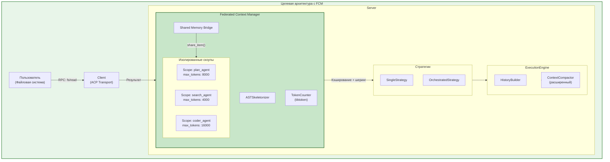

### 2.4. Что получает пользователь

| Преимущество | Описание |
|--------------|----------|
| **Скорость** | Нет повторных RPC запросов — данные копируются в RAM за 0 мс |
| **Качество** | AST-скелетирование сохраняет структуру кода при сжатии |
| **Предсказуемость** | Каждый агент работает в своём лимите токенов |
| **Экономия** | Точный подсчёт токенов через tiktoken |

---

## 3. Архитектурные принципы

### 3.1. Принципы проектирования FCM

| Принцип | Описание | Применение |
|---------|----------|------------|
| **Изоляция** | Каждый агент имеет свой скоуп с независимым контекстом | `AgentContextScope` |
| **Шеринг без копирования** | Данные передаются по ссылке в RAM | `share_item()` |
| **Приоритизация** | Элементы имеют приоритет (0-10+), критические не вытесняются | `ContextItem.priority` |
| **Ленивая загрузка** | LLM может запросить полный код через инструмент | `tool_hydrate_context_item` |
| **Совместимость** | FCM — опциональное расширение, не ломает существующий код | Feature flag |

### 3.2. Ограничения

| Ограничение | Обоснование |
|-------------|-------------|
| **In-Memory только** | Соответствует Zero-FS Access принципу ACP |
| **Python 3.12+** | Использование современных type hints |
| **Async-first** | Все операции асинхронные для совместимости с EventBus |
| **Frozen dataclass** | Immutable контракты для безопасности |

---

## 4. Общая архитектура

### 4.1. Диаграмма компонентов

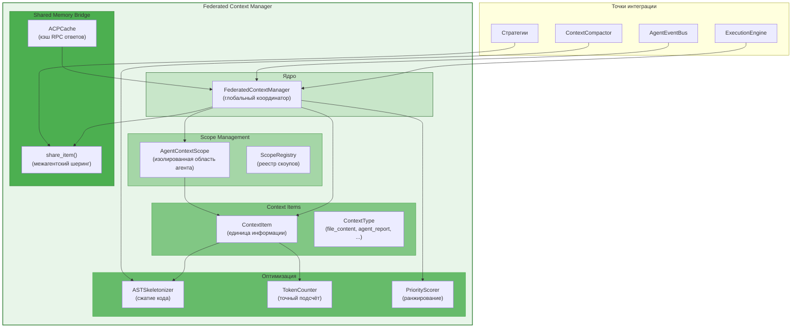

### 4.2. Жизненный цикл контекста

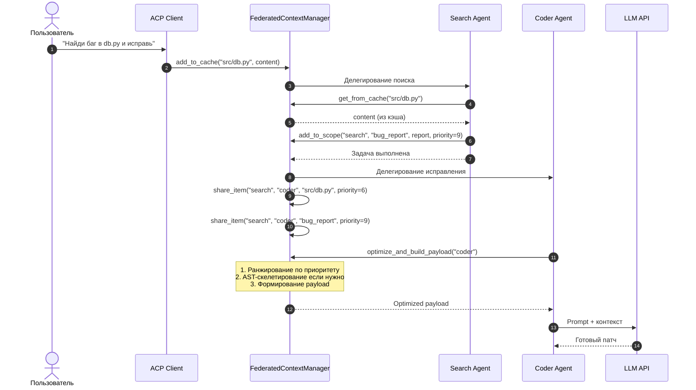

### 4.3. Топология скоупов

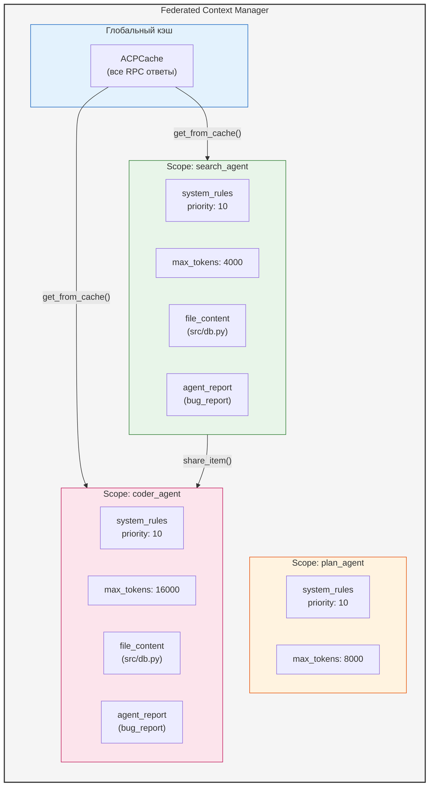

---

## 5. Подсистемы FCM

### 5.1. ContextItem — единица информации

**Назначение:** Минимальная единица информации в памяти FCM.

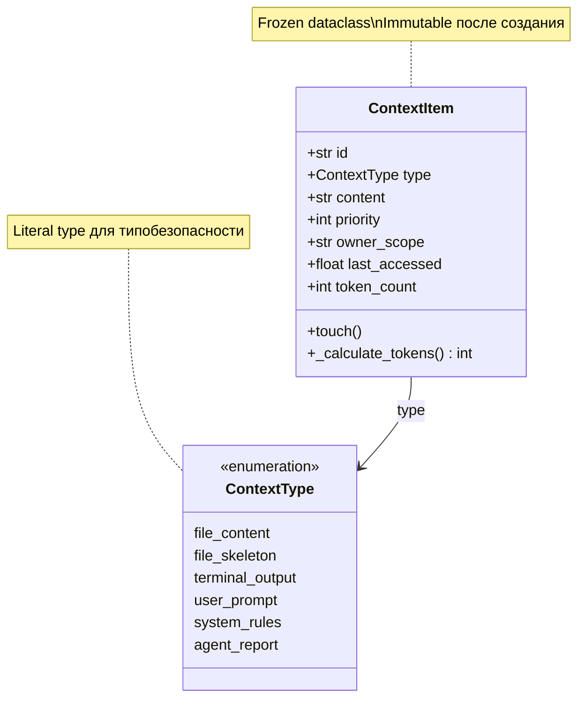

**Поля:**

| Поле | Тип | Описание |
|------|-----|----------|
| `id` | `str` | Уникальный идентификатор (путь к файлу, ID отчёта) |
| `type` | `ContextType` | Тип данных (file_content, agent_report, ...) |
| `content` | `str` | Текстовое содержимое |
| `priority` | `int` | Приоритет: 0-4 (низкий), 5-9 (высокий), 10+ (критический) |
| `owner_scope` | `str` | Идентификатор скоупа-владельца |
| `last_accessed` | `float` | Метка времени для LRU-вытеснения |
| `token_count` | `int` | Вес элемента в токенах |

**Приоритеты:**

| Диапазон | Значение | Примеры |
|----------|----------|---------|
| 0-4 | Низкий | Старые логи, устаревшие отчёты |
| 5-9 | Высокий | Текущие файлы, активные отчёты |
| 10+ | Критический | System rules, не вытесняются |

### 5.2. AgentContextScope — изолированная область агента

**Назначение:** Изолированное пространство памяти для конкретного агента.

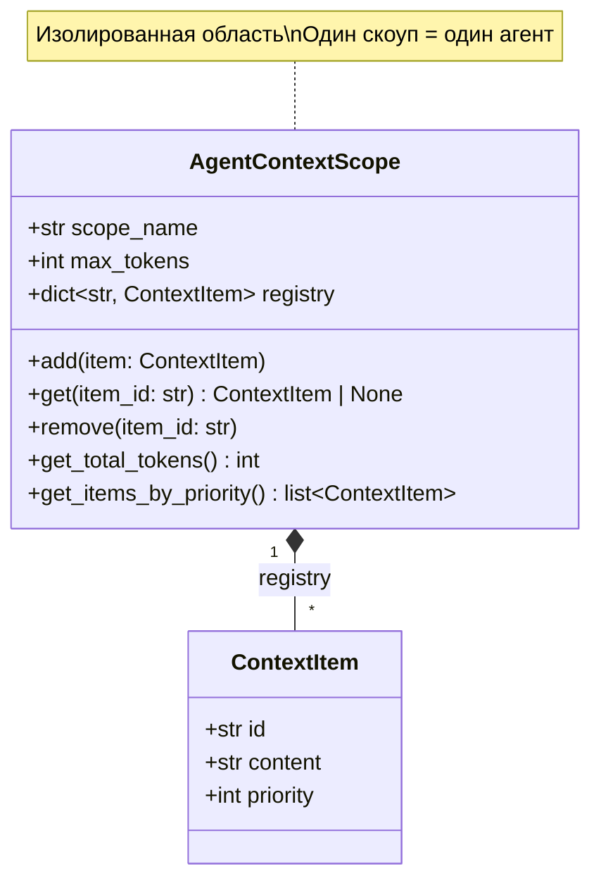

**Методы:**

| Метод | Описание |
|-------|----------|
| `add(item)` | Добавить элемент в скоуп |
| `get(item_id)` | Получить элемент по ID (обновляет `last_accessed`) |
| `remove(item_id)` | Удалить элемент из скоупа |
| `get_total_tokens()` | Сумма токенов всех элементов |
| `get_items_by_priority()` | Сортировка по приоритету (DESC) и LRU |

**Жизненный цикл скоупа:**

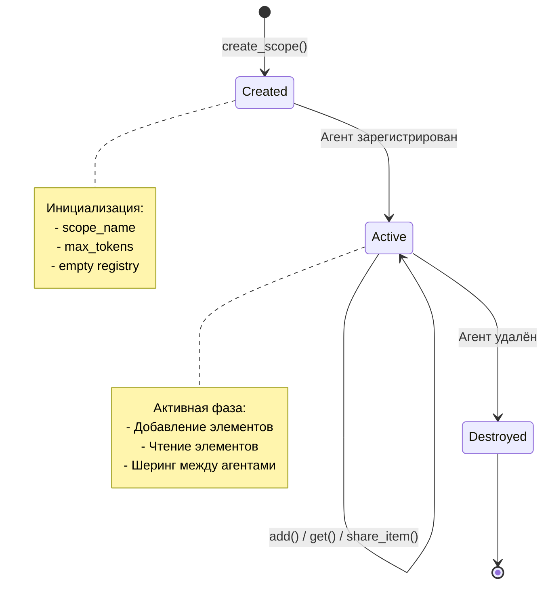

### 5.3. ASTSkeletonizer — сжатие кода

**Назначение:** Сжатие исходного кода до сигнатур классов и функций для экономии токенов.

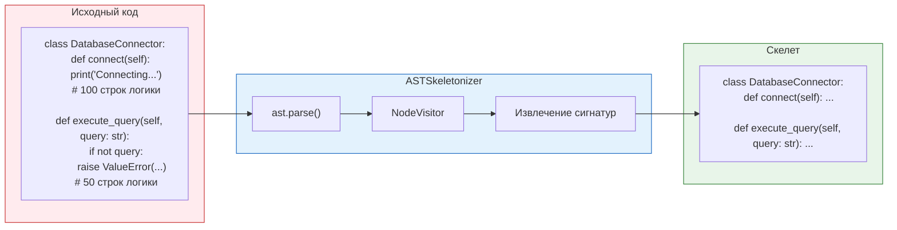

**Алгоритм:**

1. Парсинг кода через `ast.parse()`
2. Обход AST через `NodeVisitor`
3. Извлечение:
   - Классы (с декораторами)
   - Функции/методы (с аргументами и return type)
   - Async функции
4. Генерация скелета с `...` вместо тел

**Пример использования:**

```python
# Исходный код: 200 токенов
code = """
class DatabaseConnector:
    @connection_watcher
    def connect(self):
        print("Connecting to secure cluster...")
        # ... 50 строк логики
        
    def execute_query(self, query: str) -> dict:
        if not query: 
            raise ValueError("Query parameters cannot be empty string")
        return {"status": "executed", "data": []}
"""

# После скелетирования: 30 токенов
skeleton = """
class DatabaseConnector:
    @connection_watcher
    def connect(self): ...
    
    def execute_query(self, query: str) -> dict: ...
"""

# Экономия: 85% токенов
```

### 5.4. TokenCounter — точный подсчёт токенов

**Назначение:** Точный подсчёт токенов с fallback на грубую оценку.

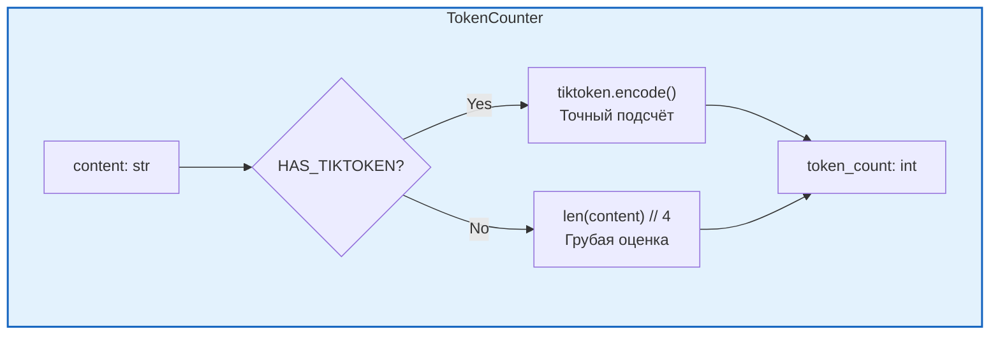

**Реализация:**

```python
class TokenCounter:
    """Точный или аппроксимированный подсчёт токенов."""
    
    def __init__(self) -> None:
        self._encoding = None
        try:
            import tiktoken
            self._encoding = tiktoken.get_encoding("cl100k_base")
        except ImportError:
            pass
    
    def count(self, content: str) -> int:
        """Подсчитать токены в содержимом."""
        if self._encoding is not None:
            return len(self._encoding.encode(content))
        # Fallback: ~4 символа на токен
        return len(content) // 4
```

**Сравнение методов:**

| Метод | Точность | Скорость | Зависимости |
|-------|----------|----------|-------------|
| `tiktoken` | 100% | Медленнее | `tiktoken` (optional) |
| `len // 4` | ~70-130% | Быстрее | Нет |

### 5.5. Shared Memory Bridge — межагентский шеринг

**Назначение:** Передача данных между агентами без повторных RPC запросов.

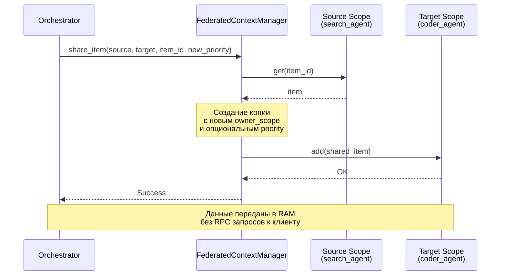

**Алгоритм share_item:**

1. Проверить существование source и target скоупов
2. Получить элемент из source скоупа
3. Создать копию элемента с:
   - Новым `owner_scope` = target
   - Опциональным новым `priority`
4. Добавить копию в target скоуп
5. Опубликовать `ContextSharedEvent` в EventBus (для observability)

### 5.6. Priority Scoring — ранжирование элементов

**Назначение:** Определение порядка элементов в payload для LLM.

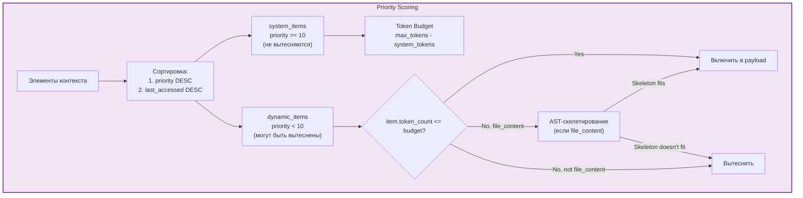

**Алгоритм optimize_and_build_payload:**

```python
async def optimize_and_build_payload(self, scope_name: str) -> list[LLMMessage]:
    """Сформировать оптимизированный payload для LLM."""
    scope = self.scopes[scope_name]
    
    # 1. Разделить на системные и динамические
    system_items = [i for i in scope.registry.values() if i.priority >= 10]
    dynamic_items = [i for i in scope.registry.values() if i.priority < 10]
    
    # 2. Вычислить доступный бюджет
    system_tokens = sum(i.token_count for i in system_items)
    available_budget = scope.max_tokens - system_tokens
    
    # 3. Сортировка: priority DESC, last_accessed DESC
    dynamic_items.sort(
        key=lambda x: (x.priority, x.last_accessed),
        reverse=True
    )
    
    # 4. Заполнение бюджета
    final_items = []
    current_tokens = 0
    
    for item in dynamic_items:
        if current_tokens + item.token_count <= available_budget:
            # Полное вхождение
            final_items.append(item)
            current_tokens += item.token_count
        elif item.type == "file_content":
            # Попытка скелетирования
            skeleton = await self._skeletonize(item)
            if current_tokens + skeleton.token_count <= available_budget:
                final_items.append(skeleton)
                current_tokens += skeleton.token_count
        # Иначе: вытеснение
    
    # 5. Формирование messages
    messages = [{"role": "system", "content": i.content} for i in system_items]
    context_block = self._build_context_block(final_items)
    messages.append({"role": "user", "content": context_block})
    
    return messages
```

### 5.7. ACP Cache — кэш RPC ответов

**Назначение:** Кэширование ответов от клиента для предотвращения повторных запросов.

```mermaid
graph LR
    subgraph Flow["Поток данных"]
        Agent["Агент"]
        FCM["FederatedContextManager"]
        Cache["ACPCache"]
        Client["ACP Client"]
        User["Пользователь<br/>(Файловая система)"]
    end
    
    Agent -->|"1. get_file(path)"| FCM
    FCM -->|"2. cache.get(path)"| Cache
    
    alt Hit
        Cache -->|"3a. content"| FCM
        FCM -->|"4a. content"| Agent
    else Miss
        Cache -->|"3b. None"| FCM
        FCM -->|"4b. RPC request"| Client
        Client -->|"5. RPC to user"| User
        User -->|"6. file content"| Client
        Client -->|"7. content"| FCM
        FCM -->|"8. cache.set(path, content)"| Cache
        FCM -->|"9. content"| Agent
    end
    
    style Flow fill:#e0f7fa,stroke:#00838f,stroke-width:2px
```

**Интерфейс:**

```python
class ACPCache:
    """Кэш ответов от ACP клиента."""
    
    def get(self, key: str) -> str | None:
        """Получить из кэша."""
        
    def set(self, key: str, content: str) -> None:
        """Сохранить в кэш."""
        
    def invalidate(self, key: str) -> None:
        """Инвалидировать запись."""
        
    def clear(self) -> None:
        """Очистить весь кэш."""
```

---

## 6. Интеграция с существующими компонентами

### 6.1. Интеграция с ExecutionEngine

**Текущая архитектура:**

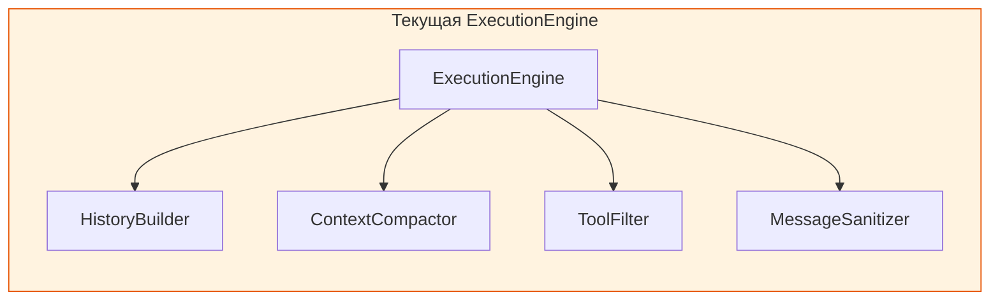

**Целевая архитектура:**

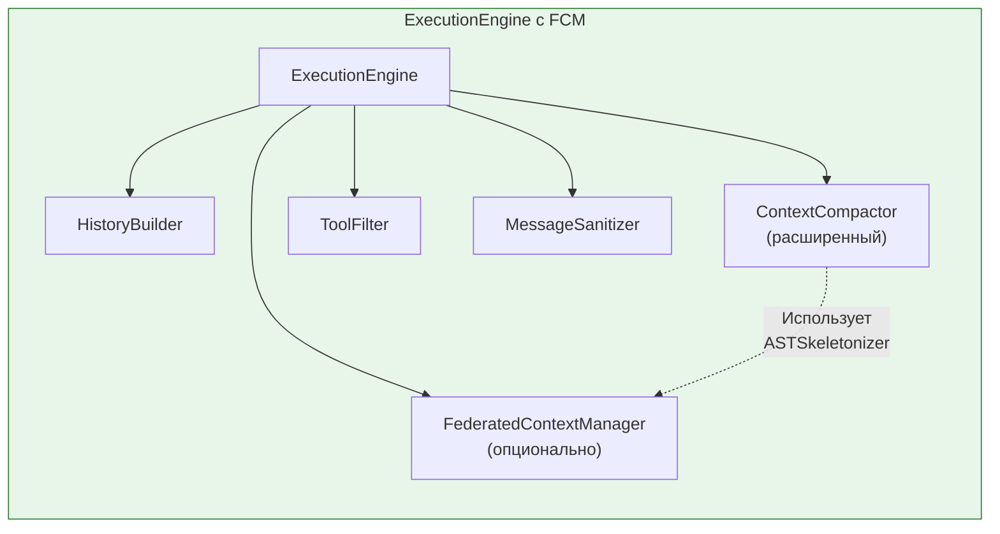

**Изменения в ExecutionEngine:**

```python
class ExecutionEngine:
    def __init__(
        self,
        tool_registry: ToolRegistry,
        compactor: ContextCompactor | None = None,
        history_builder: HistoryBuilder | None = None,
        tool_filter: ToolFilter | None = None,
        sanitizer: MessageSanitizer | None = None,
        plan_extractor: PlanExtractor | None = None,
        context_manager: FederatedContextManager | None = None,  # NEW
    ) -> None:
        # ... существующая инициализация
        self.context_manager = context_manager
    
    async def build_context(
        self,
        session: SessionState,
        prompt: str,
        system_prompt: str | None = None,
        mcp_manager: Any | None = None,
        content_parts: list[Any] | None = None,
        agent_scope: str | None = None,  # NEW: имя скоупа агента
    ) -> AgentContext:
        # Если FCM доступен и указан скоуп — использовать его
        if self.context_manager and agent_scope:
            messages = await self.context_manager.optimize_and_build_payload(agent_scope)
            # Конвертация в формат AgentContext
            ...
        
        # Иначе: стандартный путь
        # ... существующая логика
```

### 6.2. Интеграция с ContextCompactor

**Расширение ContextCompactor:**

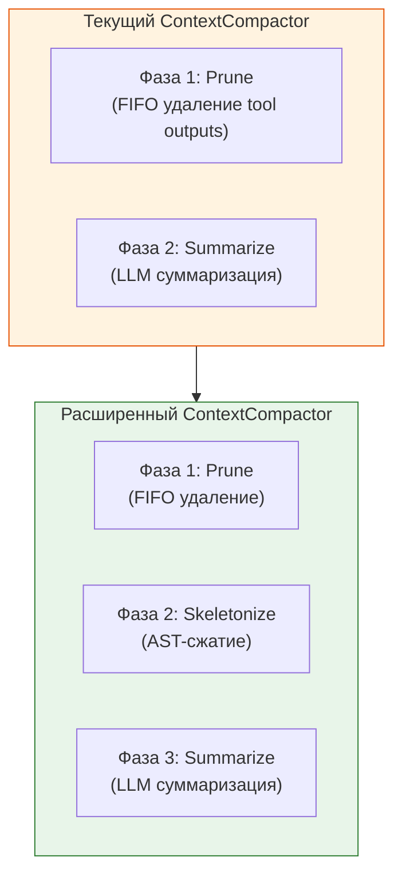

**Изменения:**

```python
class ContextCompactor:
    def __init__(
        self,
        llm: LLMProvider | None = None,
        model: str = "openai/gpt-4o-mini",
        max_context_tokens: int = 128000,
        reserved_tokens: int = 4096,
        skeletonizer: ASTSkeletonizer | None = None,  # NEW
    ) -> None:
        # ... существующая инициализация
        self.skeletonizer = skeletonizer
    
    async def compact_if_needed(
        self,
        history: list[LLMMessage],
    ) -> tuple[list[LLMMessage], bool, str]:
        # ... существующая логика
        
        # Фаза 1.5: AST Skeletonize (NEW)
        if self.skeletonizer and pruned_tokens > trigger:
            skeletonized = self._skeletonize_code(pruned)
            skeleton_tokens = self._estimate_tokens(skeletonized)
            if skeleton_tokens <= trigger:
                return skeletonized, True, "skeletonized"
            pruned = skeletonized
        
        # ... остальная логика
```

### 6.3. Интеграция с AgentEventBus

**Новые Domain Events:**

```python
@dataclass(frozen=True)
class ContextItemAdded(DomainEvent):
    """Событие: элемент добавлен в скоуп."""
    scope_name: str = ""
    item_id: str = ""
    item_type: str = ""
    token_count: int = 0


@dataclass(frozen=True)
class ContextShared(DomainEvent):
    """Событие: элемент передан между агентами."""
    source_scope: str = ""
    target_scope: str = ""
    item_id: str = ""
    new_priority: int = 0


@dataclass(frozen=True)
class ContextOverflow(DomainEvent):
    """Событие: превышен лимит токенов в скоупе."""
    scope_name: str = ""
    max_tokens: int = 0
    current_tokens: int = 0
    evicted_items: list[str] = field(default_factory=list)
```

**Публикация событий:**

```python
class FederatedContextManager:
    def __init__(self, event_bus: AgentEventBus | None = None) -> None:
        self.event_bus = event_bus
    
    async def add_to_scope(self, ...) -> None:
        # ... добавление элемента
        if self.event_bus:
            await self.event_bus.publish(ContextItemAdded(
                scope_name=scope_name,
                item_id=item_id,
                item_type=content_type,
                token_count=item.token_count,
            ))
    
    async def share_item(self, ...) -> None:
        # ... шеринг элемента
        if self.event_bus:
            await self.event_bus.publish(ContextShared(
                source_scope=source_scope,
                target_scope=target_scope,
                item_id=item_id,
                new_priority=new_priority or item.priority,
            ))
```

### 6.4. Интеграция со стратегиями

**Использование FCM в OrchestratedStrategy:**

```python
class OrchestratedStrategy:
    def __init__(
        self,
        event_bus: AgentEventBus,
        execution_engine: ExecutionEngine,
        context_manager: FederatedContextManager | None = None,  # NEW
        ...
    ) -> None:
        self.context_manager = context_manager
    
    async def execute(self, session: SessionState, prompt: str, ...) -> AgentResponse:
        # 1. Оркестратор анализирует запрос
        orchestrator_scope = "orchestrator"
        await self.context_manager.add_to_scope(
            orchestrator_scope, "user_prompt", "user_prompt", prompt, priority=9
        )
        
        # 2. Делегирование search_agent
        search_scope = "search_agent"
        await self.context_manager.create_scope(search_scope, max_tokens=4000)
        
        # 3. Search agent запрашивает файл
        file_content = await self._fetch_file("src/db.py")
        await self.context_manager.add_to_scope(
            search_scope, "src/db.py", "file_content", file_content, priority=5
        )
        
        # 4. Search agent формирует отчёт
        await self.context_manager.add_to_scope(
            search_scope, "bug_report", "agent_report", report, priority=9
        )
        
        # 5. Шеринг с coder_agent
        coder_scope = "coder_agent"
        await self.context_manager.create_scope(coder_scope, max_tokens=16000)
        await self.context_manager.share_item(search_scope, coder_scope, "src/db.py")
        await self.context_manager.share_item(search_scope, coder_scope, "bug_report")
        
        # 6. Coder agent получает оптимизированный контекст
        coder_payload = await self.context_manager.optimize_and_build_payload(coder_scope)
        
        # ... продолжение
```

### 6.5. Интеграция с Observability

**Метрики FCM:**

```python
class FCMetricsTracker:
    """Метрики Federated Context Manager."""
    
    def __init__(self, sink: TelemetrySink) -> None:
        self.sink = sink
    
    def record_cache_hit(self, scope: str, item_id: str) -> None:
        self.sink.emit("fcm.cache.hit", {"scope": scope, "item_id": item_id})
    
    def record_cache_miss(self, scope: str, item_id: str) -> None:
        self.sink.emit("fcm.cache.miss", {"scope": scope, "item_id": item_id})
    
    def record_share(self, source: str, target: str, tokens: int) -> None:
        self.sink.emit("fcm.share", {
            "source": source,
            "target": target,
            "tokens": tokens,
        })
    
    def record_eviction(self, scope: str, item_id: str, tokens: int) -> None:
        self.sink.emit("fcm.eviction", {
            "scope": scope,
            "item_id": item_id,
            "tokens": tokens,
        })
    
    def record_skeletonization(self, original_tokens: int, skeleton_tokens: int) -> None:
        saving_pct = (1 - skeleton_tokens / original_tokens) * 100
        self.sink.emit("fcm.skeletonization", {
            "original_tokens": original_tokens,
            "skeleton_tokens": skeleton_tokens,
            "saving_percent": saving_pct,
        })
```

**Tracing:**

```python
class FederatedContextManager:
    def __init__(self, tracer: Tracer | None = None, ...) -> None:
        self.tracer = tracer
    
    async def share_item(self, source: str, target: str, item_id: str, ...) -> None:
        span = None
        if self.tracer:
            span = self.tracer.start_span(
                "fcm.share_item",
                attributes={
                    "source_scope": source,
                    "target_scope": target,
                    "item_id": item_id,
                }
            )
        
        try:
            # ... логика шеринга
            pass
        finally:
            if span and self.tracer:
                self.tracer.end_span(span)
```

---

## 7. Путь внедрения

### 7.1. Фазы внедрения

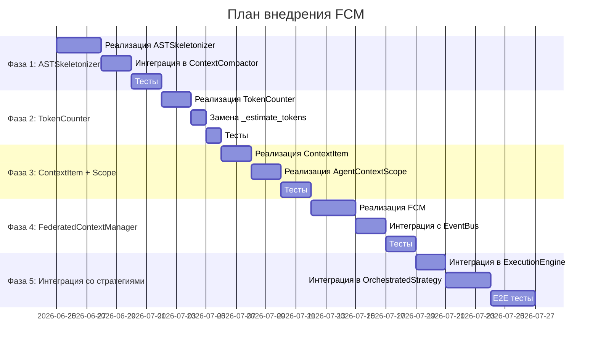

### 7.2. Фаза 1: ASTSkeletonizer

**Цель:** Добавить AST-сжатие как третью фазу в ContextCompactor.

**Файлы:**
- `src/codelab/server/agent/ast_skeletonizer.py` — реализация
- `tests/server/agent/test_ast_skeletonizer.py` — тесты

**Чек-лист:**
- [ ] Реализовать `ASTSkeletonizer(ast.NodeVisitor)`
- [ ] Поддержка `ClassDef`, `FunctionDef`, `AsyncFunctionDef`
- [ ] Обработка декораторов
- [ ] Обработка аргументов и return type
- [ ] Fallback при ошибках парсинга
- [ ] Интеграция в `ContextCompactor._skeletonize_code()`
- [ ] Unit тесты (>90% coverage)

### 7.3. Фаза 2: TokenCounter

**Цель:** Заменить грубую оценку на точный подсчёт.

**Файлы:**
- `src/codelab/server/agent/token_counter.py` — реализация
- `tests/server/agent/test_token_counter.py` — тесты

**Чек-лист:**
- [ ] Реализовать `TokenCounter` с tiktoken
- [ ] Fallback на `len // 4` если tiktoken недоступен
- [ ] Заменить `_estimate_tokens` в `ContextCompactor`
- [ ] Unit тесты

### 7.4. Фаза 3: ContextItem + AgentContextScope

**Цель:** Реализовать базовые структуры данных FCM.

**Файлы:**
- `src/codelab/server/agent/context/items.py` — ContextItem
- `src/codelab/server/agent/context/scope.py` — AgentContextScope
- `tests/server/agent/context/test_items.py`
- `tests/server/agent/context/test_scope.py`

**Чек-лист:**
- [ ] `ContextItem` как frozen dataclass
- [ ] `ContextType` как Literal
- [ ] `AgentContextScope` с registry
- [ ] Методы `add`, `get`, `remove`, `get_total_tokens`
- [ ] LRU через `last_accessed`
- [ ] Unit тесты

### 7.5. Фаза 4: FederatedContextManager

**Цель:** Реализовать глобальный координатор FCM.

**Файлы:**
- `src/codelab/server/agent/context/manager.py` — реализация
- `src/codelab/server/agent/context/cache.py` — ACPCache
- `tests/server/agent/context/test_manager.py`
- `tests/server/agent/context/test_cache.py`

**Чек-лист:**
- [ ] `FederatedContextManager` с scopes dict
- [ ] `ACPCache` для кэширования RPC ответов
- [ ] Методы `create_scope`, `add_to_scope`, `share_item`
- [ ] `optimize_and_build_payload` с приоритетами
- [ ] Интеграция с `ASTSkeletonizer`
- [ ] Интеграция с `TokenCounter`
- [ ] Публикация событий в EventBus
- [ ] Unit тесты

### 7.6. Фаза 5: Интеграция со стратегиями

**Цель:** Интегрировать FCM в ExecutionEngine и стратегии.

**Файлы:**
- `src/codelab/server/agent/execution_engine.py` — изменения
- `src/codelab/server/protocol/handlers/strategies/orchestrated_strategy.py` — изменения
- `tests/server/agent/test_execution_engine_fcm.py`
- `tests/server/strategies/test_orchestrated_fcm.py`

**Чек-лист:**
- [ ] Добавить `context_manager` параметр в `ExecutionEngine`
- [ ] Добавить `agent_scope` параметр в `build_context`
- [ ] Интеграция в `OrchestratedStrategy`
- [ ] Feature flag для включения FCM
- [ ] E2E тесты
- [ ] Benchmark сравнение с/без FCM

### 7.7. Критерии готовности

| Фаза | Критерий | Проверка |
|------|----------|----------|
| 1 | ASTSkeletonizer работает | `pytest tests/server/agent/test_ast_skeletonizer.py` |
| 2 | TokenCounter точный | `pytest tests/server/agent/test_token_counter.py` |
| 3 | Scope изолирован | `pytest tests/server/agent/context/` |
| 4 | FCM координирует | `pytest tests/server/agent/context/test_manager.py` |
| 5 | Стратегии используют FCM | `pytest tests/server/strategies/` |

---

## 8. API Reference

### 8.1. FederatedContextManager

```python
class FederatedContextManager:
    """Глобальный менеджер контекста для мультиагентной системы."""
    
    def __init__(
        self,
        event_bus: AgentEventBus | None = None,
        tracer: Tracer | None = None,
        skeletonizer: ASTSkeletonizer | None = None,
        token_counter: TokenCounter | None = None,
    ) -> None: ...
    
    async def create_scope(
        self,
        scope_name: str,
        max_tokens: int = 4000,
    ) -> AgentContextScope:
        """Создать новый скоуп для агента."""
    
    async def add_to_scope(
        self,
        scope_name: str,
        item_id: str,
        content_type: ContextType,
        content: str,
        priority: int = 5,
    ) -> None:
        """Добавить элемент в скоуп."""
    
    async def share_item(
        self,
        source_scope: str,
        target_scope: str,
        item_id: str,
        new_priority: int | None = None,
    ) -> None:
        """Передать элемент между скоупами."""
    
    async def optimize_and_build_payload(
        self,
        scope_name: str,
    ) -> list[LLMMessage]:
        """Сформировать оптимизированный payload для LLM."""
    
    async def get_from_cache(self, key: str) -> str | None:
        """Получить из ACP кэша."""
    
    async def set_cache(self, key: str, content: str) -> None:
        """Сохранить в ACP кэш."""
```

### 8.2. ContextItem

```python
@dataclass(frozen=True)
class ContextItem:
    """Единица информации в памяти FCM."""
    
    id: str
    type: ContextType
    content: str
    priority: int = 5
    owner_scope: str = "global"
    last_accessed: float = field(default_factory=time.time)
    token_count: int = 0
    
    def touch(self) -> ContextItem:
        """Обновить last_accessed (возвращает новую копию)."""
```

### 8.3. AgentContextScope

```python
class AgentContextScope:
    """Изолированная область памяти агента."""
    
    def __init__(self, scope_name: str, max_tokens: int) -> None: ...
    
    def add(self, item: ContextItem) -> None:
        """Добавить элемент."""
    
    def get(self, item_id: str) -> ContextItem | None:
        """Получить элемент (обновляет last_accessed)."""
    
    def remove(self, item_id: str) -> None:
        """Удалить элемент."""
    
    def get_total_tokens(self) -> int:
        """Сумма токенов всех элементов."""
```

---

## 9. Tradeoffs и ограничения

### 9.1. Преимущества

| Преимущество | Описание |
|--------------|----------|
| **Скорость** | Нет повторных RPC запросов — данные в RAM |
| **Качество** | AST-скелетирование сохраняет структуру кода |
| **Экономия** | Точный подсчёт токенов через tiktoken |
| **Изоляция** | Каждый агент в своём лимите |
| **Приоритеты** | Критические данные не вытесняются |

### 9.2. Ограничения

| Ограничение | Митигация |
|-------------|-----------|
| **In-Memory только** | Соответствует Zero-FS Access принципу |
| **Нет персистентности** | FCM — кэш, данные восстанавливаются из session.history |
| **Thread safety** | Async-first дизайн, нет конкурентного доступа |
| **tiktoken optional** | Fallback на грубую оценку |

### 9.3. Риски

| Риск | Вероятность | Влияние | Митигация |
|------|-------------|---------|-----------|
| Утечка памяти при большом кэше | Средняя | Высокое | LRU eviction, лимиты |
| Неточный подсчёт токенов без tiktoken | Высокое | Среднее | Документация, рекомендация установить tiktoken |
| Сложность отладки | Средняя | Среднее | Observability integration, tracing |

---

## Приложение A: Примеры использования

### A.1. Базовое использование

```python
from codelab.server.agent.context import FederatedContextManager

# Инициализация
fcm = FederatedContextManager()

# Создание скоупов
await fcm.create_scope("search_agent", max_tokens=4000)
await fcm.create_scope("coder_agent", max_tokens=16000)

# Добавление данных
await fcm.add_to_scope(
    "search_agent",
    "src/db.py",
    "file_content",
    file_content,
    priority=5,
)

await fcm.add_to_scope(
    "search_agent",
    "bug_report",
    "agent_report",
    "Найдена уязвимость в db.py",
    priority=9,
)

# Шеринг
await fcm.share_item("search_agent", "coder_agent", "src/db.py")
await fcm.share_item("search_agent", "coder_agent", "bug_report")

# Получение payload
payload = await fcm.optimize_and_build_payload("coder_agent")
```

### A.2. Интеграция со стратегией

```python
class OrchestratedStrategy:
    async def execute(self, session: SessionState, prompt: str, ...) -> AgentResponse:
        # Создание скоупа для оркестратора
        await self.fcm.create_scope("orchestrator", max_tokens=8000)
        await self.fcm.add_to_scope("orchestrator", "prompt", "user_prompt", prompt)
        
        # Делегирование search_agent
        await self.fcm.create_scope("search_agent", max_tokens=4000)
        # ... search agent работает
        
        # Шеринг результатов с coder_agent
        await self.fcm.create_scope("coder_agent", max_tokens=16000)
        await self.fcm.share_item("search_agent", "coder_agent", "findings")
        
        # Получение оптимизированного контекста
        payload = await self.fcm.optimize_and_build_payload("coder_agent")
        # ... отправка в LLM
```

---

## Приложение B: Конфигурация

### B.1. TOML конфигурация

```toml
# codelab.toml
[agents.context]
# Включить FCM
enabled = true

# Лимит кэша (количество элементов)
cache_max_size = 1000

# Модель для LLM суммаризации (если AST недостаточно)
summarization_model = "openai/gpt-4o-mini"

# Приоритеты по умолчанию
default_priorities = { file_content = 5, agent_report = 7, system_rules = 10 }

# Настройки AST скелетирования
[agents.context.skeletonization]
enabled = true
# Минимальная экономия для применения (в процентах)
min_saving_percent = 50
```

---

## Приложение C: Миграция

### C.1. Миграция с текущего ContextCompactor

Текущий код:
```python
compactor = ContextCompactor(llm=llm, max_context_tokens=128000)
history, compacted, reason = await compactor.compact_if_needed(history)
```

Новый код:
```python
compactor = ContextCompactor(
    llm=llm,
    max_context_tokens=128000,
    skeletonizer=ASTSkeletonizer(),  # NEW
)
history, compacted, reason = await compactor.compact_if_needed(history)
```

### C.2. Feature flag

```python
# Включение FCM через конфигурацию
if config.agents.context.enabled:
    context_manager = FederatedContextManager(event_bus=event_bus)
else:
    context_manager = None

engine = ExecutionEngine(
    tool_registry=tool_registry,
    compactor=compactor,
    context_manager=context_manager,  # None если FCM выключен
)
```
