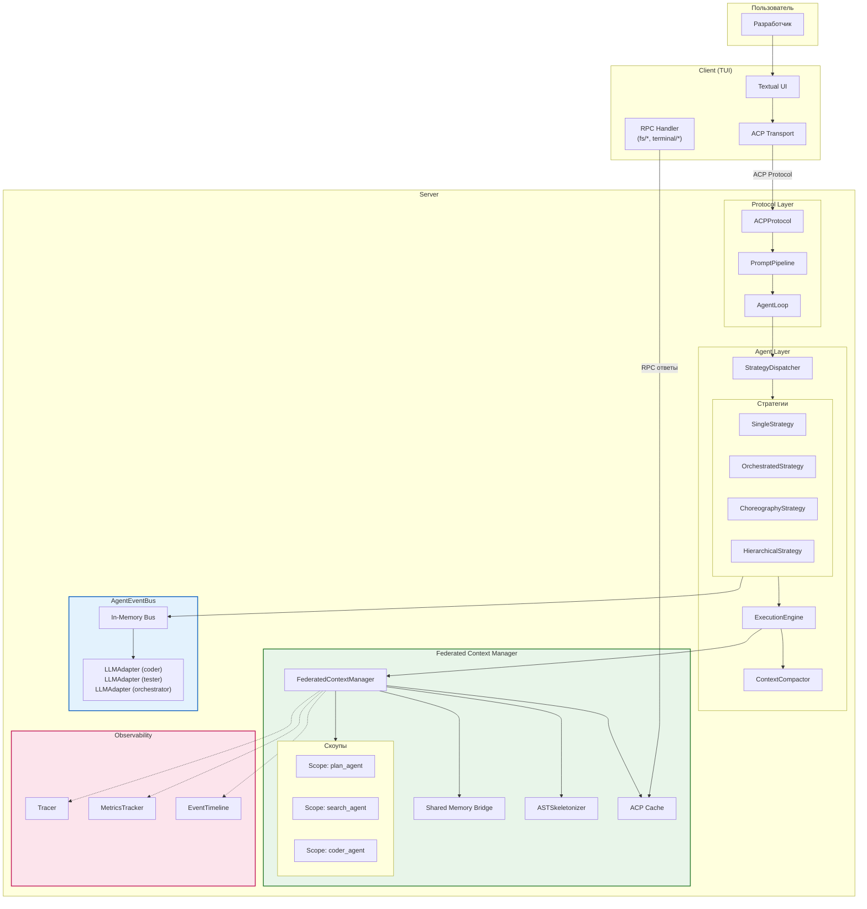
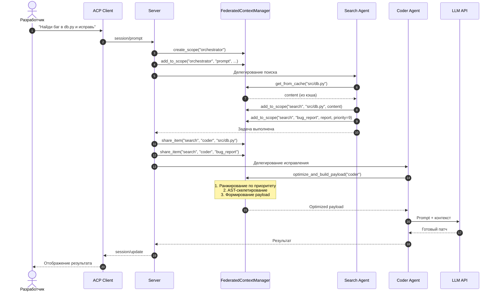
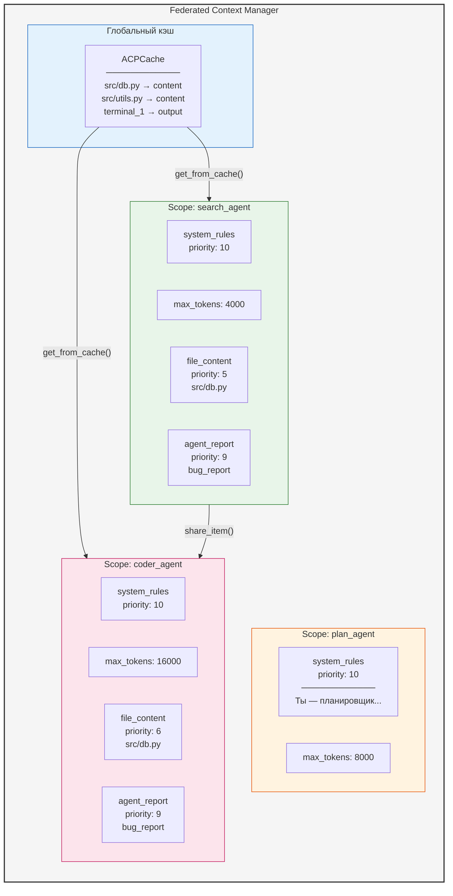
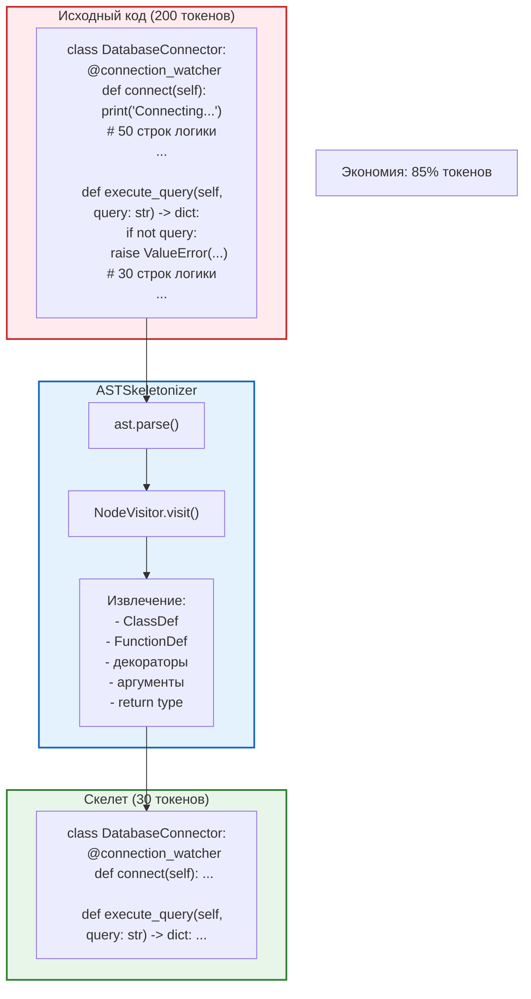
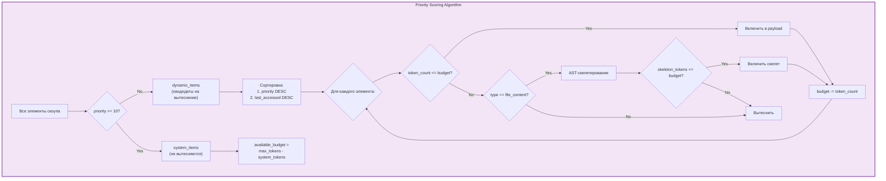
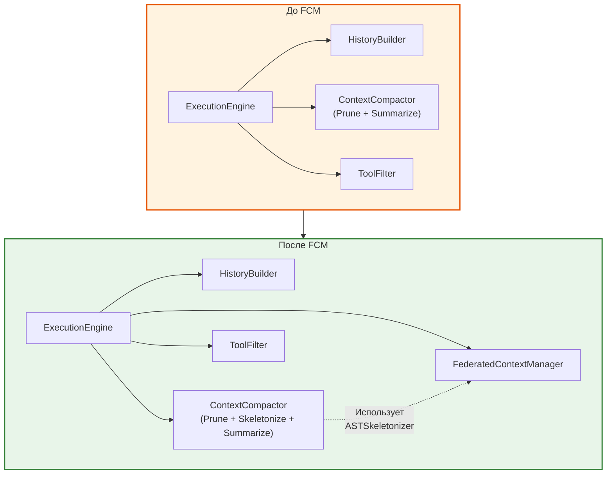
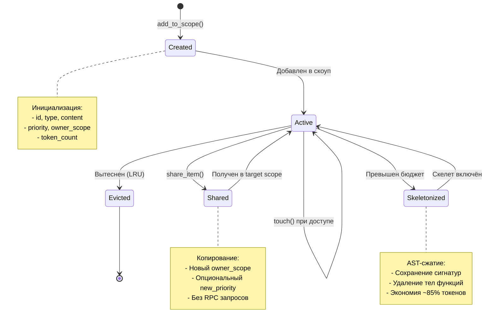
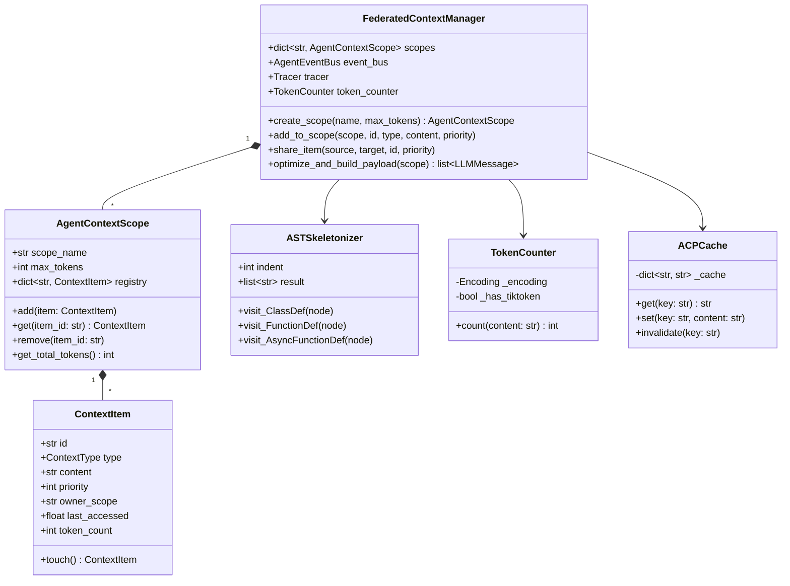
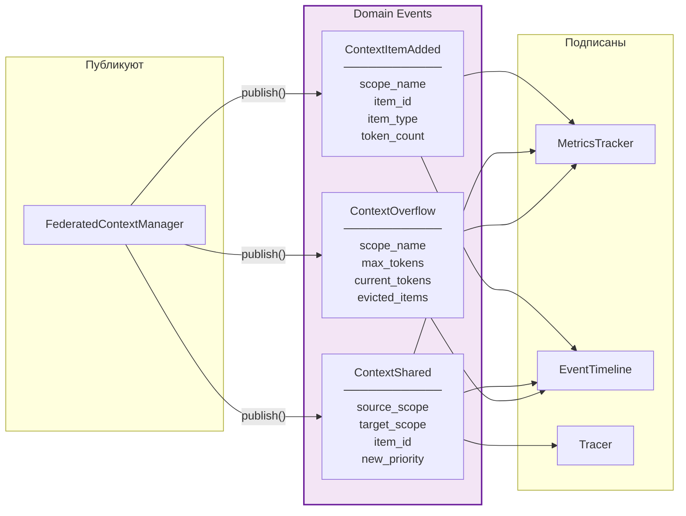
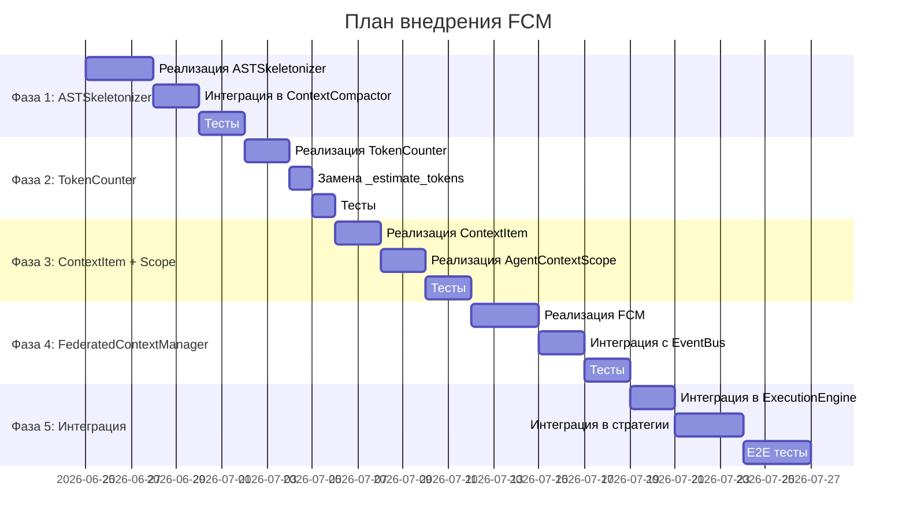

# Federated Context Manager — Диаграммы

> **Версия:** 1.0  
> **Дата:** 24 июня 2026

---

## 1. Общая архитектура системы

---

## 2. Поток данных при мультиагентном запросе

---

## 3. Структура скоупов в памяти

---

## 4. AST-скелетирование

---

## 5. Приоритизация и вытеснение

---

## 6. Интеграция с ExecutionEngine

---

## 7. Жизненный цикл элемента контекста

---

## 8. Компоненты FCM

---

## 9. События EventBus

---

## 10. Путь внедрения (Gantt)

