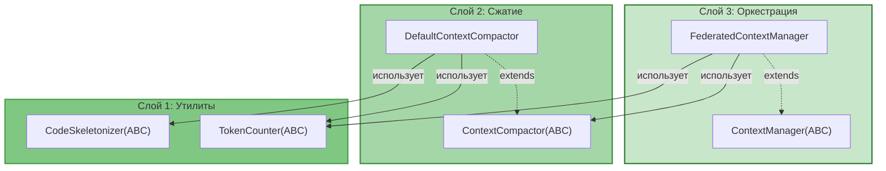

# Federated Context Manager — Руководство по интеграции

> **Версия:** 2.0  
> **Дата:** 24 июня 2026  
> **Для кого:** Разработчики, внедряющие FCM в проект
> 
> **Изменения в v2.0:**
> - Слоистая архитектура (Layer 1/2/3)
> - ABC вместо Protocol (соответствие стилю проекта)
> - Паттерны проектирования: Strategy, Template Method, Composite, Mediator

---

## Оглавление

1. [Быстрый старт](#1-быстрый-старт)
2. [Слоистая архитектура](#2-слоистая-архитектура)
3. [Пошаговое внедрение](#3-пошаговое-внедрение)
4. [Интеграция с существующим кодом](#4-интеграция-с-существующим-кодом)
5. [Тестирование](#5-тестирование)
6. [Отладка и мониторинг](#6-отладка-и-мониторинг)
7. [Часто задаваемые вопросы](#7-часто-задаваемые-вопросы)
8. [Чек-лист готовности](#8-чек-лист-готовности)

---

## 1. Быстрый старт

### 1.1. Что нужно знать перед началом

| Требование | Описание |
|------------|----------|
| Python | 3.12+ |
| Зависимости | `tiktoken` (опционально, для точного подсчёта токенов) |
| Знания | ABC, EventBus, Strategy Pattern, dataclass |
| Время | ~2 недели на полное внедрение |

### 1.2. Структура файлов (слоистая архитектура)

```
src/codelab/server/agent/context/
├── __init__.py                    # Экспорты
│
├── # Слой 1: Утилиты (ABC + реализации)
├── token_counter.py               # TokenCounter(ABC), TiktokenCounter, ApproximateTokenCounter
├── ast_skeletonizer.py            # CodeSkeletonizer(ABC), PythonASTSkeletonizer
│
├── # Слой 2: Сжатие (ABC + реализация)
├── compactor.py                   # ContextCompactor(ABC), DefaultContextCompactor
│
├── # Слой 3: Оркестрация (ABC + реализация)
├── items.py                       # ContextItem, ContextType (dataclasses)
├── scope.py                       # AgentContextScope
├── manager.py                     # ContextManager(ABC), FederatedContextManager
└── cache.py                       # ACPCache

tests/server/agent/context/
├── __init__.py
├── test_token_counter.py          # Слой 1
├── test_ast_skeletonizer.py       # Слой 1
├── test_compactor.py              # Слой 2
├── test_items.py                  # Слой 3
├── test_scope.py                  # Слой 3
├── test_manager.py                # Слой 3
└── test_cache.py                  # Слой 3
```

### 1.3. Минимальный пример

```python
from codelab.server.agent.context import (
    FederatedContextManager,
    create_token_counter,
    PythonASTSkeletonizer,
    DefaultContextCompactor,
)

async def main():
    # 1. Создать компоненты (Слой 1)
    token_counter = create_token_counter()  # Factory Method
    skeletonizer = PythonASTSkeletonizer()
    
    # 2. Создать ContextCompactor (Слой 2)
    compactor = DefaultContextCompactor(
        token_counter=token_counter,
        skeletonizer=skeletonizer,
    )
    
    # 3. Создать FederatedContextManager (Слой 3)
    fcm = FederatedContextManager(
        token_counter=token_counter,
        skeletonizer=skeletonizer,
        compactor=compactor,
    )
    
    # 4. Использовать
    await fcm.create_scope("search_agent", max_tokens=4000)
    await fcm.create_scope("coder_agent", max_tokens=16000)
    
    await fcm.add_to_scope(
        "search_agent",
        "src/db.py",
        "file_content",
        "class Database:\n    def query(self): ...",
        priority=5,
    )
    
    await fcm.share_item("search_agent", "coder_agent", "src/db.py")
    
    payload = await fcm.optimize_and_build_payload("coder_agent")
    print(payload)
```

---

## 2. Слоистая архитектура

### 2.1. Обзор слоёв



### 2.2. Правила зависимостей

| Слой | Может зависеть от | Не может зависеть от |
|------|-------------------|---------------------|
| **1. Утилиты** | Ничего | Слой 2, Слой 3 |
| **2. Сжатие** | Слой 1 | Слой 3 |
| **3. Оркестрация** | Слой 1, Слой 2 | — |

### 2.3. ABC и паттерны

| Слой | ABC | Реализации | Паттерн |
|------|-----|------------|---------|
| 1 | `TokenCounter` | `TiktokenCounter`, `ApproximateTokenCounter` | Strategy |
| 1 | `CodeSkeletonizer` | `PythonASTSkeletonizer` | Strategy |
| 2 | `ContextCompactor` | `DefaultContextCompactor` | Template Method, Composite |
| 3 | `ContextManager` | `FederatedContextManager` | Mediator, Facade |

---

## 3. Пошаговое внедрение

### Шаг 1: Слой 1 — TokenCounter (Strategy Pattern)

**Файл:** `src/codelab/server/agent/context/token_counter.py`

```python
"""TokenCounter — абстракция для подсчёта токенов (Слой 1)."""

from __future__ import annotations

import logging
from abc import ABC, abstractmethod

logger = logging.getLogger(__name__)


class TokenCounter(ABC):
    """Абстракция для подсчёта токенов.
    
    Паттерн: Strategy — разные реализации для разных backend'ов.
    """
    
    @abstractmethod
    def count(self, content: str) -> int:
        """Подсчитать токены в содержимом."""
        ...


class TiktokenCounter(TokenCounter):
    """Точный подсчёт через tiktoken."""
    
    def __init__(self, encoding_name: str = "cl100k_base") -> None:
        import tiktoken
        self._encoding = tiktoken.get_encoding(encoding_name)
    
    def count(self, content: str) -> int:
        if not content:
            return 0
        return len(self._encoding.encode(content))


class ApproximateTokenCounter(TokenCounter):
    """Приближённый подсчёт (~4 символа на токен). Fallback."""
    
    def count(self, content: str) -> int:
        if not content:
            return 0
        return len(content) // 4


def create_token_counter() -> TokenCounter:
    """Factory Method: создать лучший доступный TokenCounter."""
    try:
        return TiktokenCounter()
    except ImportError:
        logger.debug("tiktoken not available, using ApproximateTokenCounter")
        return ApproximateTokenCounter()
```

**Тесты:** `tests/server/agent/context/test_token_counter.py`

```python
import pytest
from codelab.server.agent.context.token_counter import (
    TokenCounter,
    TiktokenCounter,
    ApproximateTokenCounter,
    create_token_counter,
)


class TestTokenCounter:
    def test_count_empty(self):
        counter = create_token_counter()
        assert counter.count("") == 0
    
    def test_count_returns_positive(self):
        counter = create_token_counter()
        assert counter.count("Hello, world!") > 0
    
    def test_approximate_counter(self):
        counter = ApproximateTokenCounter()
        assert counter.count("x" * 100) == 25
    
    def test_factory_returns_counter(self):
        counter = create_token_counter()
        assert isinstance(counter, TokenCounter)
```

---

### Шаг 2: Слой 1 — CodeSkeletonizer (Strategy Pattern)

**Файл:** `src/codelab/server/agent/context/ast_skeletonizer.py`

```python
"""CodeSkeletonizer — абстракция для скелетирования кода (Слой 1)."""

from __future__ import annotations

import ast
import logging
from abc import ABC, abstractmethod

logger = logging.getLogger(__name__)


class CodeSkeletonizer(ABC):
    """Абстракция для скелетирования кода.
    
    Паттерн: Strategy — разные языки/подходы.
    """
    
    @abstractmethod
    def skeletonize(self, code: str, file_id: str = "", language: str = "python") -> str:
        """Сжать код до скелета."""
        ...


class PythonASTSkeletonizer(CodeSkeletonizer):
    """Скелетирование Python-кода через AST."""
    
    def skeletonize(self, code: str, file_id: str = "", language: str = "python") -> str:
        if language != "python":
            return f"# Скелетирование для {language} не поддерживается\n{code}"
        
        try:
            tree = ast.parse(code)
            visitor = _ASTVisitor()
            visitor.visit(tree)
            skeleton = "\n".join(visitor.result)
            return f"# [СЖАТО: структура файла {file_id}]\n{skeleton}"
        except Exception as e:
            logger.warning("Failed to skeletonize %s: %s", file_id, e)
            return f"# [ОШИБКА СЖАТИЯ] {file_id}: {e}"


class _ASTVisitor(ast.NodeVisitor):
    """Внутренний visitor для AST."""
    
    def __init__(self) -> None:
        self.indent = 0
        self.result: list[str] = []
    
    def visit_ClassDef(self, node: ast.ClassDef) -> None:
        indent_str = "    " * self.indent
        for dec in node.decorator_list:
            try:
                self.result.append(f"{indent_str}@{ast.unparse(dec)}")
            except Exception:
                self.result.append(f"{indent_str}@decorator")
        self.result.append(f"{indent_str}class {node.name}:")
        self.indent += 1
        self.generic_visit(node)
        self.indent -= 1
    
    def visit_FunctionDef(self, node: ast.FunctionDef) -> None:
        self._visit_function(node, is_async=False)
    
    def visit_AsyncFunctionDef(self, node: ast.AsyncFunctionDef) -> None:
        self._visit_function(node, is_async=True)
    
    def _visit_function(self, node, is_async: bool) -> None:
        indent_str = "    " * self.indent
        for dec in node.decorator_list:
            try:
                self.result.append(f"{indent_str}@{ast.unparse(dec)}")
            except Exception:
                self.result.append(f"{indent_str}@decorator")
        try:
            args = ast.unparse(node.args)
            ret = f" -> {ast.unparse(node.returns)}" if node.returns else ""
        except Exception:
            args = "..."
            ret = ""
        prefix = "async def" if is_async else "def"
        self.result.append(f"{indent_str}{prefix} {node.name}({args}){ret}: ...")
```
    
    Returns:
        Сжатый код или оригинал при ошибке.
    """
    try:
        tree = ast.parse(code)
        visitor = ASTSkeletonizer()
        visitor.visit(tree)
        skeleton = "\n".join(visitor.result)
        return f"# [СЖАТО: структура файла {file_id}]\n{skeleton}"
    except Exception as e:
        logger.warning("Failed to skeletonize %s: %s", file_id, e)
        return f"# [ОШИБКА СЖАТИЯ] {file_id}: {e}"
```

**Тесты:** `tests/server/agent/context/test_ast_skeletonizer.py`

```python
import pytest
from codelab.server.agent.context.ast_skeletonizer import ASTSkeletonizer, skeletonize


class TestASTSkeletonizer:
    def test_class_with_methods(self):
        code = '''
class MyClass:
    def method(self, x: int) -> str:
        return str(x)
    
    async def async_method(self):
        pass
'''
        result = skeletonize(code)
        assert "class MyClass:" in result
        assert "def method(self, x: int) -> str: ..." in result
        assert "async def async_method(self): ..." in result
    
    def test_decorators(self):
        code = '''
class MyClass:
    @staticmethod
    def method():
        pass
'''
        result = skeletonize(code)
        assert "@staticmethod" in result
    
    def test_invalid_code_returns_error(self):
        code = "this is not valid python"
        result = skeletonize(code, "test.py")
        assert "ОШИБКА СЖАТИЯ" in result
```

---

### Шаг 2: Реализация TokenCounter

**Файл:** `src/codelab/server/agent/context/token_counter.py`

```python
"""TokenCounter — точный подсчёт токенов."""

from __future__ import annotations

import logging
from typing import Protocol

logger = logging.getLogger(__name__)


class TokenCountable(Protocol):
    """Протокол для объектов с подсчётом токенов."""
    
    def count_tokens(self, content: str) -> int: ...


class TokenCounter:
    """Подсчёт токенов с tiktoken или fallback.
    
    Если tiktoken установлен — использует точный подсчёт.
    Иначе — грубую оценку (~4 символа на токен).
    """
    
    def __init__(self) -> None:
        self._encoding = None
        self._has_tiktoken = False
        
        try:
            import tiktoken
            self._encoding = tiktoken.get_encoding("cl100k_base")
            self._has_tiktoken = True
            logger.debug("TokenCounter: using tiktoken (cl100k_base)")
        except ImportError:
            logger.debug("TokenCounter: tiktoken not available, using fallback")
    
    @property
    def has_tiktoken(self) -> bool:
        """Доступен ли tiktoken."""
        return self._has_tiktoken
    
    def count(self, content: str) -> int:
        """Подсчитать токены в содержимом.
        
        Args:
            content: Текст для подсчёта.
        
        Returns:
            Количество токенов.
        """
        if not content:
            return 0
        
        if self._encoding is not None:
            return len(self._encoding.encode(content))
        
        # Fallback: ~4 символа на токен
        return len(content) // 4
```

**Тесты:** `tests/server/agent/context/test_token_counter.py`

```python
import pytest
from codelab.server.agent.context.token_counter import TokenCounter


class TestTokenCounter:
    def test_count_empty(self):
        counter = TokenCounter()
        assert counter.count("") == 0
    
    def test_count_returns_positive(self):
        counter = TokenCounter()
        result = counter.count("Hello, world!")
        assert result > 0
    
    def test_fallback_mode(self):
        counter = TokenCounter()
        # Fallback: len // 4
        content = "x" * 100
        if not counter.has_tiktoken:
            assert counter.count(content) == 25
```

---

### Шаг 3: Реализация ContextItem и AgentContextScope

**Файл:** `src/codelab/server/agent/context/items.py`

```python
"""ContextItem — единица информации в FCM."""

from __future__ import annotations

import time
from dataclasses import dataclass, field
from typing import Literal

# Допустимые типы контекста
ContextType = Literal[
    "file_content",
    "file_skeleton",
    "terminal_output",
    "user_prompt",
    "system_rules",
    "agent_report",
]


@dataclass(frozen=True)
class ContextItem:
    """Единица информации в памяти FCM.
    
    Attributes:
        id: Уникальный идентификатор (путь к файлу, ID отчёта).
        type: Тип данных.
        content: Текстовое содержимое.
        priority: Приоритет (0-4 низкий, 5-9 высокий, 10+ критический).
        owner_scope: Идентификатор скоупа-владельца.
        last_accessed: Метка времени для LRU.
        token_count: Вес в токенах.
    """
    
    id: str
    type: ContextType
    content: str
    priority: int = 5
    owner_scope: str = "global"
    last_accessed: float = field(default_factory=time.time)
    token_count: int = 0
    
    def touch(self) -> ContextItem:
        """Обновить last_accessed.
        
        Returns:
            Новая копия с обновлённым last_accessed.
        """
        return ContextItem(
            id=self.id,
            type=self.type,
            content=self.content,
            priority=self.priority,
            owner_scope=self.owner_scope,
            last_accessed=time.time(),
            token_count=self.token_count,
        )
```

**Файл:** `src/codelab/server/agent/context/scope.py`

```python
"""AgentContextScope — изолированная область памяти агента."""

from __future__ import annotations

import logging
from typing import TYPE_CHECKING

if TYPE_CHECKING:
    from .items import ContextItem

logger = logging.getLogger(__name__)


class AgentContextScope:
    """Изолированная область памяти агента.
    
    Каждый агент имеет свой скоуп с независимым контекстом.
    
    Attributes:
        scope_name: Имя скоупа (обычно = имя агента).
        max_tokens: Лимит токенов.
        registry: Словарь элементов (id → ContextItem).
    """
    
    def __init__(self, scope_name: str, max_tokens: int = 4000) -> None:
        self.scope_name = scope_name
        self.max_tokens = max_tokens
        self.registry: dict[str, ContextItem] = {}
    
    def add(self, item: ContextItem) -> None:
        """Добавить элемент в скоуп.
        
        Args:
            item: Элемент для добавления.
        """
        # Обновляем owner_scope
        from .items import ContextItem
        updated = ContextItem(
            id=item.id,
            type=item.type,
            content=item.content,
            priority=item.priority,
            owner_scope=self.scope_name,
            last_accessed=item.last_accessed,
            token_count=item.token_count,
        )
        self.registry[item.id] = updated
        logger.debug(
            "Added item to scope %s: %s (%d tokens)",
            self.scope_name,
            item.id,
            item.token_count,
        )
    
    def get(self, item_id: str) -> ContextItem | None:
        """Получить элемент по ID.
        
        Обновляет last_accessed для LRU.
        
        Args:
            item_id: Идентификатор элемента.
        
        Returns:
            Элемент или None.
        """
        item = self.registry.get(item_id)
        if item is not None:
            self.registry[item_id] = item.touch()
        return item
    
    def remove(self, item_id: str) -> None:
        """Удалить элемент из скоупа.
        
        Args:
            item_id: Идентификатор элемента.
        """
        if item_id in self.registry:
            del self.registry[item_id]
            logger.debug("Removed item from scope %s: %s", self.scope_name, item_id)
    
    def get_total_tokens(self) -> int:
        """Сумма токенов всех элементов."""
        return sum(item.token_count for item in self.registry.values())
    
    def get_items_by_priority(self) -> list[ContextItem]:
        """Получить элементы, отсортированные по приоритету и LRU.
        
        Returns:
            Список элементов (priority DESC, last_accessed DESC).
        """
        return sorted(
            self.registry.values(),
            key=lambda x: (x.priority, x.last_accessed),
            reverse=True,
        )
```

**Тесты:** `tests/server/agent/context/test_items.py`, `test_scope.py`

---

### Шаг 4: Реализация FederatedContextManager

**Файл:** `src/codelab/server/agent/context/manager.py`

```python
"""FederatedContextManager — глобальный координатор FCM."""

from __future__ import annotations

import logging
from typing import TYPE_CHECKING, Any

from .ast_skeletonizer import skeletonize
from .items import ContextItem, ContextType
from .scope import AgentContextScope
from .token_counter import TokenCounter

if TYPE_CHECKING:
    from codelab.server.agent.event_bus.bus import AgentEventBus
    from codelab.server.llm.models import LLMMessage
    from codelab.server.observability.tracer import Tracer

logger = logging.getLogger(__name__)


class FederatedContextManager:
    """Глобальный менеджер контекста для мультиагентной системы.
    
    Координирует скоупы агентов, кэширование, шеринг и оптимизацию.
    
    Attributes:
        scopes: Словарь скоупов (name → AgentContextScope).
        event_bus: Шина событий для публикации Domain Events.
        tracer: Трейсер для observability.
        token_counter: Подсчёт токенов.
    """
    
    def __init__(
        self,
        event_bus: AgentEventBus | None = None,
        tracer: Tracer | None = None,
        token_counter: TokenCounter | None = None,
    ) -> None:
        self.scopes: dict[str, AgentContextScope] = {}
        self.event_bus = event_bus
        self.tracer = tracer
        self.token_counter = token_counter or TokenCounter()
    
    async def create_scope(
        self,
        scope_name: str,
        max_tokens: int = 4000,
    ) -> AgentContextScope:
        """Создать новый скоуп для агента.
        
        Args:
            scope_name: Имя скоупа.
            max_tokens: Лимит токенов.
        
        Returns:
            Созданный скоуп.
        """
        scope = AgentContextScope(scope_name, max_tokens)
        self.scopes[scope_name] = scope
        logger.info("Created scope: %s (max_tokens=%d)", scope_name, max_tokens)
        return scope
    
    async def add_to_scope(
        self,
        scope_name: str,
        item_id: str,
        content_type: ContextType,
        content: str,
        priority: int = 5,
    ) -> None:
        """Добавить элемент в скоуп.
        
        Автоматически создаёт скоуп если не существует.
        
        Args:
            scope_name: Имя скоупа.
            item_id: Идентификатор элемента.
            content_type: Тип данных.
            content: Содержимое.
            priority: Приоритет (0-10+).
        """
        if scope_name not in self.scopes:
            await self.create_scope(scope_name)
        
        token_count = self.token_counter.count(content)
        
        item = ContextItem(
            id=item_id,
            type=content_type,
            content=content,
            priority=priority,
            owner_scope=scope_name,
            token_count=token_count,
        )
        
        self.scopes[scope_name].add(item)
        
        # Публикация события
        if self.event_bus:
            from codelab.server.agent.contracts.base import DomainEvent
            
            class ContextItemAdded(DomainEvent):
                scope_name: str = ""
                item_id: str = ""
                item_type: str = ""
                token_count: int = 0
            
            await self.event_bus.publish(ContextItemAdded(
                scope_name=scope_name,
                item_id=item_id,
                item_type=content_type,
                token_count=token_count,
            ))
    
    async def share_item(
        self,
        source_scope: str,
        target_scope: str,
        item_id: str,
        new_priority: int | None = None,
    ) -> None:
        """Передать элемент между скоупами.
        
        Копирует элемент из source в target без повторных RPC запросов.
        
        Args:
            source_scope: Исходный скоуп.
            target_scope: Целевой скоуп.
            item_id: Идентификатор элемента.
            new_priority: Новый приоритет (опционально).
        """
        if source_scope not in self.scopes:
            logger.error("Source scope not found: %s", source_scope)
            return
        
        if target_scope not in self.scopes:
            logger.error("Target scope not found: %s", target_scope)
            return
        
        source = self.scopes[source_scope]
        target = self.scopes[target_scope]
        
        item = source.get(item_id)
        if item is None:
            logger.error("Item not found in source scope: %s", item_id)
            return
        
        # Создание копии с новым owner_scope
        shared_item = ContextItem(
            id=item.id,
            type=item.type,
            content=item.content,
            priority=new_priority if new_priority is not None else item.priority,
            owner_scope=target_scope,
            last_accessed=item.last_accessed,
            token_count=item.token_count,
        )
        
        target.add(shared_item)
        
        logger.info(
            "Shared item '%s': %s → %s (priority=%d)",
            item_id,
            source_scope,
            target_scope,
            shared_item.priority,
        )
        
        # Публикация события
        if self.event_bus:
            from codelab.server.agent.contracts.base import DomainEvent
            
            class ContextShared(DomainEvent):
                source_scope: str = ""
                target_scope: str = ""
                item_id: str = ""
                new_priority: int = 0
            
            await self.event_bus.publish(ContextShared(
                source_scope=source_scope,
                target_scope=target_scope,
                item_id=item_id,
                new_priority=shared_item.priority,
            ))
    
    async def optimize_and_build_payload(
        self,
        scope_name: str,
    ) -> list[LLMMessage]:
        """Сформировать оптимизированный payload для LLM.
        
        Выполняет:
        1. Разделение на системные и динамические элементы
        2. Сортировку по приоритету и LRU
        3. AST-скелетирование при превышении бюджета
        4. Формирование messages
        
        Args:
            scope_name: Имя скоупа.
        
        Returns:
            Список сообщений для LLM.
        """
        from codelab.server.llm.models import LLMMessage
        
        scope = self.scopes.get(scope_name)
        if scope is None:
            logger.warning("Scope not found: %s", scope_name)
            return []
        
        # Разделение
        system_items = [
            item for item in scope.registry.values()
            if item.priority >= 10
        ]
        dynamic_items = [
            item for item in scope.registry.values()
            if item.priority < 10
        ]
        
        # Бюджет
        system_tokens = sum(item.token_count for item in system_items)
        available_budget = scope.max_tokens - system_tokens
        
        # Сортировка
        dynamic_items.sort(
            key=lambda x: (x.priority, x.last_accessed),
            reverse=True,
        )
        
        # Заполнение бюджета
        final_dynamic: list[ContextItem] = []
        current_tokens = 0
        
        for item in dynamic_items:
            if current_tokens + item.token_count <= available_budget:
                # Полное вхождение
                final_dynamic.append(item)
                current_tokens += item.token_count
            elif item.type == "file_content":
                # Попытка скелетирования
                skeleton_text = skeletonize(item.content, item.id)
                skeleton_tokens = self.token_counter.count(skeleton_text)
                
                if current_tokens + skeleton_tokens <= available_budget:
                    skeleton_item = ContextItem(
                        id=f"{item.id}:skeleton",
                        type="file_skeleton",
                        content=skeleton_text,
                        priority=item.priority,
                        owner_scope=scope_name,
                        token_count=skeleton_tokens,
                    )
                    final_dynamic.append(skeleton_item)
                    current_tokens += skeleton_tokens
                    logger.debug(
                        "Skeletonized %s: %d → %d tokens",
                        item.id,
                        item.token_count,
                        skeleton_tokens,
                    )
                else:
                    logger.debug(
                        "Evicted %s (even skeleton doesn't fit)",
                        item.id,
                    )
            else:
                logger.debug("Evicted %s", item.id)
        
        # Формирование messages
        messages: list[LLMMessage] = []
        
        for item in system_items:
            messages.append(LLMMessage(role="system", content=item.content))
        
        if final_dynamic:
            context_block = f"--- КОНТЕКСТ АГЕНТА [{scope_name.upper()}] ---\n"
            for item in final_dynamic:
                context_block += f"\n[{item.type.upper()}] {item.id}\n{item.content}\n"
            context_block += "-------------------------------------------\n"
            
            messages.append(LLMMessage(role="user", content=context_block))
        
        return messages
```

---

### Шаг 5: Интеграция с ExecutionEngine

**Файл:** `src/codelab/server/agent/execution_engine.py`

Добавить параметр `context_manager`:

```python
class ExecutionEngine:
    def __init__(
        self,
        tool_registry: ToolRegistry,
        compactor: ContextCompactor | None = None,
        history_builder: HistoryBuilder | None = None,
        tool_filter: ToolFilter | None = None,
        sanitizer: MessageSanitizer | None = None,
        plan_extractor: PlanExtractor | None = None,
        context_manager: FederatedContextManager | None = None,  # NEW
    ) -> None:
        self.tool_registry = tool_registry
        self.compactor = compactor
        self.history_builder = history_builder or HistoryBuilder()
        self.tool_filter = tool_filter or ToolFilter()
        self.sanitizer = sanitizer or MessageSanitizer()
        self.plan_extractor = plan_extractor or PlanExtractor()
        self.context_manager = context_manager  # NEW
    
    async def build_context(
        self,
        session: SessionState,
        prompt: str,
        system_prompt: str | None = None,
        mcp_manager: Any | None = None,
        content_parts: list[Any] | None = None,
        agent_scope: str | None = None,  # NEW
    ) -> AgentContext:
        # Если FCM доступен и указан скоуп — использовать его
        if self.context_manager and agent_scope:
            messages = await self.context_manager.optimize_and_build_payload(agent_scope)
            # Конвертация в формат AgentContext
            # ...
        
        # Иначе: стандартный путь
        # ... существующая логика
```

---

## 3. Интеграция с существующим кодом

### 3.1. DI контейнер

**Файл:** `src/codelab/server/di/container.py` (или аналог)

```python
from codelab.server.agent.context import FederatedContextManager, TokenCounter

# Регистрация в DI контейнере
def register_fcm(container: Container) -> None:
    container.register(
        TokenCounter,
        factory=lambda: TokenCounter(),
    )
    container.register(
        FederatedContextManager,
        factory=lambda: FederatedContextManager(
            event_bus=container.get(AgentEventBus),
            tracer=container.get(Tracer),
            token_counter=container.get(TokenCounter),
        ),
    )
```

### 3.2. Feature flag

**Файл:** `src/codelab/server/config.py`

```python
@dataclass
class ContextConfig:
    """Конфигурация FCM."""
    enabled: bool = False
    cache_max_size: int = 1000
    summarization_model: str = "openai/gpt-4o-mini"

# В AppConfig
@dataclass
class AppConfig:
    # ...
    context: ContextConfig = field(default_factory=ContextConfig)
```

**Использование:**

```python
# В factory или runner
if config.context.enabled:
    context_manager = FederatedContextManager(
        event_bus=event_bus,
        tracer=tracer,
    )
else:
    context_manager = None

engine = ExecutionEngine(
    tool_registry=tool_registry,
    compactor=compactor,
    context_manager=context_manager,
)
```

### 3.3. Конфигурация в TOML

**Файл:** `codelab.toml`

```toml
[agents.context]
enabled = true
cache_max_size = 1000
summarization_model = "openai/gpt-4o-mini"

[agents.context.skeletonization]
enabled = true
min_saving_percent = 50
```

---

## 4. Тестирование

### 4.1. Unit тесты

**Запуск:**

```bash
# Все тесты FCM
pytest tests/server/agent/context/ -v

# Конкретный модуль
pytest tests/server/agent/context/test_manager.py -v

# С coverage
pytest tests/server/agent/context/ --cov=codelab.server.agent.context --cov-report=term-missing
```

### 4.2. Интеграционные тесты

**Файл:** `tests/server/agent/test_execution_engine_fcm.py`

```python
import pytest
from codelab.server.agent.context import FederatedContextManager
from codelab.server.agent.execution_engine import ExecutionEngine


class TestExecutionEngineWithFCM:
    @pytest.fixture
    def fcm(self):
        return FederatedContextManager()
    
    @pytest.fixture
    def engine(self, fcm, tool_registry):
        return ExecutionEngine(
            tool_registry=tool_registry,
            context_manager=fcm,
        )
    
    async def test_build_context_with_fcm(self, engine, fcm, session):
        # Подготовка
        await fcm.create_scope("test_agent", max_tokens=4000)
        await fcm.add_to_scope(
            "test_agent",
            "test_file.py",
            "file_content",
            "def hello(): pass",
            priority=5,
        )
        
        # Выполнение
        context = await engine.build_context(
            session=session,
            prompt="test",
            agent_scope="test_agent",
        )
        
        # Проверка
        assert context is not None
        assert len(context.conversation_history) > 0
```

### 4.3. E2E тесты

**Файл:** `tests/server/test_e2e_fcm.py`

```python
class TestE2EFCM:
    async def test_full_flow(self, server_client):
        """Полный поток: промпт → FCM → LLM → ответ."""
        # 1. Настройка FCM
        # 2. Отправка промпта
        # 3. Проверка что FCM использовался
        # 4. Проверка ответа
        pass
```

---

## 5. Отладка и мониторинг

### 5.1. Логирование

FCM использует `structlog` для структурированного логирования:

```python
logger.info(
    "Shared item",
    source_scope="search_agent",
    target_scope="coder_agent",
    item_id="src/db.py",
    tokens=150,
)
```

**Уровни:**

| Уровень | Когда |
|---------|-------|
| `DEBUG` | Добавление/удаление элементов, скелетирование |
| `INFO` | Создание скоупов, шеринг, оптимизация |
| `WARNING` | Превышение бюджета, вытеснение |
| `ERROR` | Несуществующие скоупы/элементы |

### 5.2. Tracing

```python
# В FederatedContextManager
span = self.tracer.start_span(
    "fcm.share_item",
    attributes={
        "source_scope": source_scope,
        "target_scope": target_scope,
        "item_id": item_id,
    }
)
# ... логика
self.tracer.end_span(span)
```

### 5.3. Метрики

```python
# Ключевые метрики
fcm.cache.hit          # Попадания в кэш
fcm.cache.miss         # Промахи
fcm.share              # Операции шеринга
fcm.eviction           # Вытеснения
fcm.skeletonization    # Сжатие через AST
```

---

## 6. Часто задаваемые вопросы

### Q: Когда использовать FCM?

**A:** FCM полезен когда:
- Есть мультиагентная система с обменом данными
- Агенты запрашивают одни и те же файлы
- Нужно сохранять структуру кода при сжатии
- Важны приоритеты контекста

### Q: FCM заменяет ContextCompactor?

**A:** Нет, FCM дополняет его. `ContextCompactor` работает с `session.history`, а FCM — с контекстом агентов. Можно использовать оба.

### Q: Что если tiktoken не установлен?

**A:** FCM автоматически переключится на fallback (`len // 4`). Рекомендуется установить tiktoken для точного подсчёта.

### Q: Как отключить FCM?

**A:** Установить `context.enabled = false` в конфигурации или не передавать `context_manager` в `ExecutionEngine`.

### Q: FCM работает с single стратегией?

**A:** Да, но эффект минимален. FCM наиболее полезен для Orchestrated, Choreography и Hierarchical стратегий.

---

## 7. Чек-лист готовности

### Фаза 1: ASTSkeletonizer

- [ ] Реализован `ASTSkeletonizer`
- [ ] Поддержка `ClassDef`, `FunctionDef`, `AsyncFunctionDef`
- [ ] Обработка декораторов
- [ ] Fallback при ошибках
- [ ] Unit тесты (>90% coverage)

### Фаза 2: TokenCounter

- [ ] Реализован `TokenCounter`
- [ ] tiktoken интеграция
- [ ] Fallback режим
- [ ] Unit тесты

### Фаза 3: ContextItem + Scope

- [ ] `ContextItem` как frozen dataclass
- [ ] `AgentContextScope` с registry
- [ ] Методы `add`, `get`, `remove`
- [ ] LRU через `last_accessed`
- [ ] Unit тесты

### Фаза 4: FederatedContextManager

- [ ] `FederatedContextManager` реализован
- [ ] `create_scope`, `add_to_scope`, `share_item`
- [ ] `optimize_and_build_payload`
- [ ] Интеграция с EventBus
- [ ] Unit тесты

### Фаза 5: Интеграция

- [ ] `ExecutionEngine` расширен
- [ ] Стратегии используют FCM
- [ ] Feature flag работает
- [ ] E2E тесты
- [ ] Документация обновлена

### Финальная проверка

```bash
# Все тесты проходят
pytest tests/server/agent/context/ -v
pytest tests/server/agent/test_execution_engine_fcm.py -v

# Линтер
ruff check src/codelab/server/agent/context/

# Type check
ty check src/codelab/server/agent/context/

# Coverage > 90%
pytest tests/server/agent/context/ --cov=codelab.server.agent.context
```

---

## Дополнительные ресурсы

- [Архитектура FCM](./ARCHITECTURE.md) — детальное описание архитектуры
- [MULTIAGENT_TECHNICAL_SPECIFICATION.md](../MULTIAGENT_TECHNICAL_SPECIFICATION.md) — мультиагентная система
- [ARCHITECTURE.md](../ARCHITECTURE.md) — общая архитектура проекта
