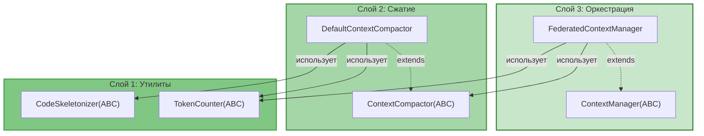
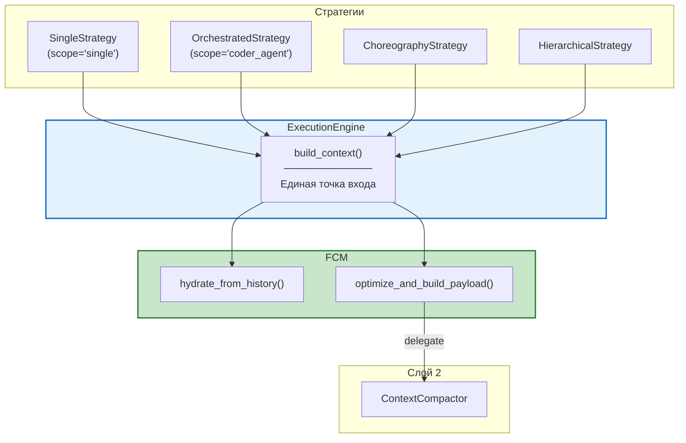

# Federated Context Manager — Руководство по интеграции

> **Версия:** 2.2  
> **Дата:** 24 июня 2026  
> **Для кого:** Разработчики, внедряющие FCM в проект
> 
> **Изменения в v2.2:**
> - Единый путь формирования payload через FCM для всех стратегий
> - `hydrate_from_history()` автоматически в `ExecutionEngine.build_context()`
> - `ContextCompactor` — отдельный компонент (Слой 2), вызывается через FCM
> 
> **Изменения в v2.1:**
> - Добавлен `FileContentCache` — кэш содержимого файлов (Слой 1)
> - Добавлен `SessionFileCacheRegistry` — реестр кэшей по сессиям
> - Добавлен `FileCacheDecorator` — единый декоратор: кэширование `read`,
>   инвалидация при `write`, опциональная регистрация в FCM scope
>   (объединяет ранее раздельные `FCMCachingDecorator` и `CacheInvalidationDecorator`)
> 
> **Изменения в v2.0:**
> - Слоистая архитектура (Layer 1/2/3)
> - ABC вместо Protocol (соответствие стилю проекта)
> - Паттерны проектирования: Strategy, Template Method, Composite, Mediator

---

## Оглавление

1. [Быстрый старт](#1-быстрый-старт)
2. [Слоистая архитектура](#2-слоистая-архитектура)
3. [Единый путь формирования payload](#3-единый-путь-формирования-payload)
4. [Пошаговое внедрение](#4-пошаговое-внедрение)
5. [Интеграция с существующим кодом](#5-интеграция-с-существующим-кодом)
6. [Тестирование](#6-тестирование)
7. [Отладка и мониторинг](#7-отладка-и-мониторинг)
8. [Часто задаваемые вопросы](#8-часто-задаваемые-вопросы)
9. [Чек-лист готовности](#9-чек-лист-готовности)

---

## 1. Быстрый старт

### 1.1. Что нужно знать перед началом

| Требование | Описание |
|------------|----------|
| Python | 3.12+ |
| Зависимости | `tiktoken` (опционально, для точного подсчёта токенов) |
| Знания | ABC, EventBus, Strategy Pattern, dataclass |
| Время | ~2 недели на полное внедрение |

### 1.2. Структура файлов (слоистая архитектура)

```
src/codelab/server/agent/context/
├── __init__.py                    # Экспорты
│
├── # Слой 1: Утилиты (ABC + реализации)
├── token_counter.py               # TokenCounter(ABC), TiktokenCounter, ApproximateTokenCounter
├── ast_skeletonizer.py            # CodeSkeletonizer(ABC), PythonASTSkeletonizer
├── file_cache.py                  # FileContentCache(ABC), InMemoryFileCache, SessionFileCacheRegistry
│
├── # Слой 2: Сжатие (ABC + реализация)
├── compactor.py                   # ContextCompactor(ABC), DefaultContextCompactor
│
├── # Слой 3: Оркестрация (ABC + реализация)
├── items.py                       # ContextItem, ContextType (dataclasses)
├── scope.py                       # AgentContextScope
├── manager.py                     # ContextManager(ABC), FederatedContextManager
└── cache.py                       # ACPCache

src/codelab/server/tools/executors/decorators/
├── base.py                        # ToolExecutorDecorator (существующий)
├── file_cache.py                  # FileCacheDecorator (NEW)
└── ...

tests/server/agent/context/
├── __init__.py
├── test_token_counter.py          # Слой 1
├── test_ast_skeletonizer.py       # Слой 1
├── test_file_cache.py             # Слой 1
├── test_compactor.py              # Слой 2
├── test_items.py                  # Слой 3
├── test_scope.py                  # Слой 3
├── test_manager.py                # Слой 3
└── test_cache.py                  # Слой 3

tests/server/tools/executors/decorators/
└── test_file_cache.py             # Decorator
```

### 1.3. Минимальный пример

```python
from codelab.server.agent.context import (
    FederatedContextManager,
    create_token_counter,
    PythonASTSkeletonizer,
    DefaultContextCompactor,
)

async def main():
    # 1. Создать компоненты (Слой 1)
    token_counter = create_token_counter()  # Factory Method
    skeletonizer = PythonASTSkeletonizer()
    
    # 2. Создать ContextCompactor (Слой 2)
    compactor = DefaultContextCompactor(
        token_counter=token_counter,
        skeletonizer=skeletonizer,
    )
    
    # 3. Создать FederatedContextManager (Слой 3)
    fcm = FederatedContextManager(
        token_counter=token_counter,
        skeletonizer=skeletonizer,
        compactor=compactor,
    )
    
    # 4. Использовать
    await fcm.create_scope("search_agent", max_tokens=4000)
    await fcm.create_scope("coder_agent", max_tokens=16000)
    
    await fcm.add_to_scope(
        "search_agent",
        "src/db.py",
        "file_content",
        "class Database:\n    def query(self): ...",
        priority=5,
    )
    
    await fcm.share_item("search_agent", "coder_agent", "src/db.py")
    
    payload = await fcm.optimize_and_build_payload("coder_agent")
    print(payload)
```

---

## 2. Слоистая архитектура

### 2.1. Обзор слоёв



### 2.2. Правила зависимостей

| Слой | Может зависеть от | Не может зависеть от |
|------|-------------------|---------------------|
| **1. Утилиты** | Ничего | Слой 2, Слой 3 |
| **2. Сжатие** | Слой 1 | Слой 3 |
| **3. Оркестрация** | Слой 1, Слой 2 | — |

### 2.3. ABC и паттерны

| Слой | ABC | Реализации | Паттерн |
|------|-----|------------|---------|
| 1 | `TokenCounter` | `TiktokenCounter`, `ApproximateTokenCounter` | Strategy |
| 1 | `CodeSkeletonizer` | `PythonASTSkeletonizer` | Strategy |
| 1 | `FileContentCache` | `InMemoryFileCache` | Repository |
| 1 | `SessionFileCacheRegistry` | — | Registry |
| 1 | `FileCacheDecorator` | — | Decorator |
| 2 | `ContextCompactor` | `DefaultContextCompactor` | Template Method, Composite |
| 3 | `ContextManager` | `FederatedContextManager` | Mediator, Facade |

---

## 3. Единый путь формирования payload

### 3.1. Концепция

Все стратегии (Single, Orchestrated, Choreography, Hierarchical) используют **единый путь** через `ExecutionEngine.build_context()` → `FCM`:



### 3.2. SingleStrategy vs Multi-agent

Разница — только в количестве скоупов и логике гидратации:

| Стратегия | agent_scope | Гидратация | Результат |
|-----------|-------------|------------|-----------|
| **SingleStrategy** | `"single"` | ✅ Автоматическая из history | 1 скоуп с полной историей |
| **OrchestratedStrategy** | `"coder_agent"` | ❌ Пропускается (скоуп создан оркестратором) | Скоуп с данными от search_agent |
| **ChoreographyStrategy** | `"agent_a"` | ❌ Пропускается | Скоуп с данными broadcast |
| **HierarchicalStrategy** | `"sub_agent"` | ❌ Пропускается | Скоуп с данными от primary |

### 3.3. ExecutionEngine.build_context()

```python
class ExecutionEngine:
    """Композиционный движок выполнения.
    
    Все стратегии используют единый путь формирования payload через FCM.
    """
    
    def __init__(
        self,
        tool_registry: ToolRegistry,
        context_manager: ContextManager | None = None,  # FCM (Слой 3)
        history_builder: HistoryBuilder | None = None,
        tool_filter: ToolFilter | None = None,
        sanitizer: MessageSanitizer | None = None,
        plan_extractor: PlanExtractor | None = None,
        # compactor убран — теперь внутри FCM
    ) -> None:
        self.tool_registry = tool_registry
        self.context_manager = context_manager
        self.history_builder = history_builder or HistoryBuilder()
        self.tool_filter = tool_filter or ToolFilter()
        self.sanitizer = sanitizer or MessageSanitizer()
        self.plan_extractor = plan_extractor or PlanExtractor()
    
    async def build_context(
        self,
        session: SessionState,
        prompt: str,
        system_prompt: str | None = None,
        mcp_manager: Any | None = None,
        content_parts: list[Any] | None = None,
        agent_scope: str = "single",  # NEW: по умолчанию глобальный скоуп
    ) -> AgentContext:
        """Собрать AgentContext из сессии и промпта.
        
        Единая точка входа для всех стратегий.
        Автоматически гидратирует скоуп из истории если он не существует.
        """
        # Фильтрация инструментов (без изменений)
        available_tools = self._filter_tools(session, mcp_manager)
        
        if self.context_manager:
            # Единый путь через FCM (все стратегии)
            messages = await self._build_via_fcm(
                session=session,
                system_prompt=system_prompt,
                agent_scope=agent_scope,
            )
        else:
            # Fallback: старый путь без FCM (обратная совместимость)
            messages = await self._build_legacy(session, system_prompt)
        
        # Формирование prompt блоков (без изменений)
        prompt_blocks = self._build_prompt_blocks(prompt, content_parts)
        
        return AgentContext(
            session_id=session.session_id,
            session=session,
            prompt=prompt_blocks,
            conversation_history=messages,
            available_tools=available_tools,
            config=session.config_values,
            model=session.config_values.get("model", ""),
        )
    
    async def _build_via_fcm(
        self,
        session: SessionState,
        system_prompt: str | None,
        agent_scope: str,
    ) -> list[LLMMessage]:
        """Построить контекст через FCM.
        
        Логика:
        1. Проверить существует ли скоуп
        2. Если нет — гидратировать из истории (SingleStrategy)
        3. Если есть — использовать как есть (Multi-agent уже наполнил)
        4. Сформировать payload через optimize_and_build_payload
        """
        scope = self.context_manager.scopes.get(agent_scope)
        
        if scope is None:
            # Скоуп не существует → гидратировать из истории
            # (SingleStrategy всегда сюда попадает)
            await self.context_manager.hydrate_from_history(
                scope_name=agent_scope,
                history=session.history,
                system_prompt=system_prompt,
            )
        # else: скоуп уже создан оркестратором (Multi-agent)
        #   → используем его без гидратации
        
        return await self.context_manager.optimize_and_build_payload(agent_scope)
```

### 3.4. FederatedContextManager.hydrate_from_history()

```python
class FederatedContextManager(ContextManager):
    async def hydrate_from_history(
        self,
        scope_name: str,
        history: list[ConversationMessage],
        system_prompt: str | None = None,
    ) -> None:
        """Загрузить историю сессии в скоуп FCM.
        
        Вызывается автоматически в ExecutionEngine.build_context()
        когда скоуп не существует (SingleStrategy).
        
        Для Multi-agent скоупы создаются оркестратором вручную,
        и гидратация НЕ вызывается.
        """
        # Создать скоуп если не существует
        if scope_name not in self.scopes:
            await self.create_scope(scope_name)
        
        scope = self.scopes[scope_name]
        
        # Очистить старые элементы из истории (сохранить system_rules)
        await self._clear_history_items(scope_name)
        
        # System prompt — критический приоритет (не вытесняется)
        if system_prompt:
            await self.add_to_scope(
                scope_name,
                item_id="system_prompt",
                content_type="system_rules",
                content=system_prompt,
                priority=10,
            )
        
        # Загрузить историю с приоритетами по ролям
        for i, msg in enumerate(history):
            priority = self._priority_for_role(msg.role)
            content_type = self._type_for_role(msg.role)
            
            await self.add_to_scope(
                scope_name,
                item_id=f"history_{i}",
                content_type=content_type,
                content=msg.content,
                priority=priority,
            )
    
    @staticmethod
    def _priority_for_role(role: str) -> int:
        """Приоритет для роли сообщения."""
        return {
            "system": 10,      # Не вытесняется
            "user": 8,         # Высокий приоритет
            "assistant": 7,    # Средний приоритет
            "tool": 5,         # Может быть вытеснен при нехватке токенов
        }.get(role, 5)
```

### 3.5. Преимущества единого пути

| Преимущество | Описание |
|--------------|----------|
| **Кэш файлов** | Все стратегии получают кэш (не только multi-agent) |
| **AST-скелетирование** | Все стратегии получают сжатие кода |
| **Приоритеты** | Все стратегии получают приоритизацию |
| **Единый код** | Одна логика формирования payload |
| **Переключение стратегии** | Контекст в FCM — можно переключаться без потери |

### 3.6. MVP: гидратация каждый раз

Для MVP **не нужна** оптимизация "не гидрировать если скоуп актуален":

| Критерий | MVP (гидратировать всегда) | Post-MVP (оптимизация) |
|----------|---------------------------|----------------------|
| **Сложность** | ✅ Простая логика | ⚠️ Версионирование, хеши |
| **Предсказуемость** | ✅ Всегда актуальные данные | ⚠️ Риск stale data |
| **Overhead** | O(n) по истории (~1ms для 100 сообщений) | ✅ O(1) проверка версии |
| **Тестируемость** | ✅ Простые тесты | ⚠️ Тесты edge cases |

**Почему overhead приемлем для MVP:**
1. `HistoryBuilder.build()` уже делает O(n) проход — это та же работа
2. Гидратация — это просто копирование данных в dict (быстро)
3. Для типичной сессии (< 100 сообщений) — незаметно
4. `optimize_and_build_payload()` — вот где реальная работа (сортировка, скелетирование)

---

## 4. Пошаговое внедрение

### Шаг 1: Слой 1 — TokenCounter (Strategy Pattern)

**Файл:** `src/codelab/server/agent/context/token_counter.py`

```python
"""TokenCounter — абстракция для подсчёта токенов (Слой 1)."""

from __future__ import annotations

import logging
from abc import ABC, abstractmethod

logger = logging.getLogger(__name__)


class TokenCounter(ABC):
    """Абстракция для подсчёта токенов.
    
    Паттерн: Strategy — разные реализации для разных backend'ов.
    """
    
    @abstractmethod
    def count(self, content: str) -> int:
        """Подсчитать токены в содержимом."""
        ...


class TiktokenCounter(TokenCounter):
    """Точный подсчёт через tiktoken."""
    
    def __init__(self, encoding_name: str = "cl100k_base") -> None:
        import tiktoken
        self._encoding = tiktoken.get_encoding(encoding_name)
    
    def count(self, content: str) -> int:
        if not content:
            return 0
        return len(self._encoding.encode(content))


class ApproximateTokenCounter(TokenCounter):
    """Приближённый подсчёт (~4 символа на токен). Fallback."""
    
    def count(self, content: str) -> int:
        if not content:
            return 0
        return len(content) // 4


def create_token_counter() -> TokenCounter:
    """Factory Method: создать лучший доступный TokenCounter."""
    try:
        return TiktokenCounter()
    except ImportError:
        logger.debug("tiktoken not available, using ApproximateTokenCounter")
        return ApproximateTokenCounter()
```

**Тесты:** `tests/server/agent/context/test_token_counter.py`

```python
import pytest
from codelab.server.agent.context.token_counter import (
    TokenCounter,
    TiktokenCounter,
    ApproximateTokenCounter,
    create_token_counter,
)


class TestTokenCounter:
    def test_count_empty(self):
        counter = create_token_counter()
        assert counter.count("") == 0
    
    def test_count_returns_positive(self):
        counter = create_token_counter()
        assert counter.count("Hello, world!") > 0
    
    def test_approximate_counter(self):
        counter = ApproximateTokenCounter()
        assert counter.count("x" * 100) == 25
    
    def test_factory_returns_counter(self):
        counter = create_token_counter()
        assert isinstance(counter, TokenCounter)
```

---

### Шаг 2: Слой 1 — CodeSkeletonizer (Strategy Pattern)

**Файл:** `src/codelab/server/agent/context/ast_skeletonizer.py`

```python
"""CodeSkeletonizer — абстракция для скелетирования кода (Слой 1)."""

from __future__ import annotations

import ast
import logging
from abc import ABC, abstractmethod

logger = logging.getLogger(__name__)


class CodeSkeletonizer(ABC):
    """Абстракция для скелетирования кода.
    
    Паттерн: Strategy — разные языки/подходы.
    """
    
    @abstractmethod
    def skeletonize(self, code: str, file_id: str = "", language: str = "python") -> str:
        """Сжать код до скелета."""
        ...


class PythonASTSkeletonizer(CodeSkeletonizer):
    """Скелетирование Python-кода через AST."""
    
    def skeletonize(self, code: str, file_id: str = "", language: str = "python") -> str:
        if language != "python":
            return f"# Скелетирование для {language} не поддерживается\n{code}"
        
        try:
            tree = ast.parse(code)
            visitor = _ASTVisitor()
            visitor.visit(tree)
            skeleton = "\n".join(visitor.result)
            return f"# [СЖАТО: структура файла {file_id}]\n{skeleton}"
        except Exception as e:
            logger.warning("Failed to skeletonize %s: %s", file_id, e)
            return f"# [ОШИБКА СЖАТИЯ] {file_id}: {e}"


class _ASTVisitor(ast.NodeVisitor):
    """Внутренний visitor для AST."""
    
    def __init__(self) -> None:
        self.indent = 0
        self.result: list[str] = []
    
    def visit_ClassDef(self, node: ast.ClassDef) -> None:
        indent_str = "    " * self.indent
        for dec in node.decorator_list:
            try:
                self.result.append(f"{indent_str}@{ast.unparse(dec)}")
            except Exception:
                self.result.append(f"{indent_str}@decorator")
        self.result.append(f"{indent_str}class {node.name}:")
        self.indent += 1
        self.generic_visit(node)
        self.indent -= 1
    
    def visit_FunctionDef(self, node: ast.FunctionDef) -> None:
        self._visit_function(node, is_async=False)
    
    def visit_AsyncFunctionDef(self, node: ast.AsyncFunctionDef) -> None:
        self._visit_function(node, is_async=True)
    
    def _visit_function(self, node, is_async: bool) -> None:
        indent_str = "    " * self.indent
        for dec in node.decorator_list:
            try:
                self.result.append(f"{indent_str}@{ast.unparse(dec)}")
            except Exception:
                self.result.append(f"{indent_str}@decorator")
        try:
            args = ast.unparse(node.args)
            ret = f" -> {ast.unparse(node.returns)}" if node.returns else ""
        except Exception:
            args = "..."
            ret = ""
        prefix = "async def" if is_async else "def"
        self.result.append(f"{indent_str}{prefix} {node.name}({args}){ret}: ...")
```

**Тесты:** `tests/server/agent/context/test_ast_skeletonizer.py`

```python
import pytest
from codelab.server.agent.context.ast_skeletonizer import PythonASTSkeletonizer


class TestPythonASTSkeletonizer:
    def test_class_with_methods(self):
        code = '''
class MyClass:
    def method(self, x: int) -> str:
        return str(x)

    async def async_method(self):
        pass
'''
        skeletonizer = PythonASTSkeletonizer()
        result = skeletonizer.skeletonize(code, "my.py")
        assert "class MyClass:" in result
        assert "def method(self, x: int) -> str: ..." in result
        assert "async def async_method(self): ..." in result

    def test_decorators(self):
        code = '''
class MyClass:
    @staticmethod
    def method():
        pass
'''
        skeletonizer = PythonASTSkeletonizer()
        result = skeletonizer.skeletonize(code, "deco.py")
        assert "@staticmethod" in result

    def test_invalid_code_returns_error(self):
        skeletonizer = PythonASTSkeletonizer()
        result = skeletonizer.skeletonize("this is not valid python", "bad.py")
        assert "ОШИБКА СЖАТИЯ" in result or "ERROR" in result
```

> **Замечание.** Полная реализация `TokenCounter` уже приведена в Шаге 1.
> Раньше здесь дублировалось альтернативное определение через `typing.Protocol` —
> оно удалено: проект использует `ABC` (см. `ARCHITECTURE.md §3.6`), поэтому
> единственный канонический вариант — `class TokenCounter(ABC)` + реализации
> `TiktokenCounter` и `ApproximateTokenCounter`.

---

### Шаг 2.5: Слой 1 — FileContentCache и SessionFileCacheRegistry

**Файл:** `src/codelab/server/agent/context/file_cache.py`

```python
"""FileContentCache — кэш содержимого файлов (Слой 1)."""

from __future__ import annotations

import logging
from abc import ABC, abstractmethod
from collections import OrderedDict

logger = logging.getLogger(__name__)


class FileContentCache(ABC):
    """Абстракция для кэша содержимого файлов.
    
    Паттерн: Repository — инкапсулирует хранение кэшированных данных.
    """
    
    @abstractmethod
    def get(self, path: str) -> str | None:
        """Получить содержимое файла из кэша."""
        ...
    
    @abstractmethod
    def set(self, path: str, content: str) -> None:
        """Сохранить содержимое файла в кэш."""
        ...
    
    @abstractmethod
    def invalidate(self, path: str) -> None:
        """Инвалидировать запись в кэше."""
        ...
    
    @abstractmethod
    def clear(self) -> None:
        """Очистить весь кэш."""
        ...


class InMemoryFileCache(FileContentCache):
    """In-Memory реализация с LRU eviction."""
    
    def __init__(self, max_size: int = 1000) -> None:
        self._cache: OrderedDict[str, str] = OrderedDict()
        self._max_size = max_size
    
    def get(self, path: str) -> str | None:
        if path in self._cache:
            self._cache.move_to_end(path)  # LRU
            return self._cache[path]
        return None
    
    def set(self, path: str, content: str) -> None:
        if path in self._cache:
            self._cache.move_to_end(path)
        self._cache[path] = content
        if len(self._cache) > self._max_size:
            self._cache.popitem(last=False)  # evict oldest
    
    def invalidate(self, path: str) -> None:
        self._cache.pop(path, None)
    
    def clear(self) -> None:
        self._cache.clear()


class SessionFileCacheRegistry:
    """Реестр кэшей файлов по сессиям.
    
    Паттерн: Registry (как ToolRegistry, AgentRegistry).
    Каждая сессия имеет свой изолированный кэш.
    """
    
    def __init__(self, max_cache_size: int = 1000) -> None:
        self._caches: dict[str, FileContentCache] = {}
        self._max_cache_size = max_cache_size
    
    def get_or_create(self, session_id: str) -> FileContentCache:
        """Получить или создать кэш для сессии."""
        if session_id not in self._caches:
            self._caches[session_id] = InMemoryFileCache(
                max_size=self._max_cache_size,
            )
        return self._caches[session_id]
    
    def get(self, session_id: str) -> FileContentCache | None:
        """Получить кэш сессии (None если не существует)."""
        return self._caches.get(session_id)
    
    def remove(self, session_id: str) -> None:
        """Удалить кэш сессии (при удалении сессии)."""
        cache = self._caches.pop(session_id, None)
        if cache:
            cache.clear()
    
    def clear(self) -> None:
        """Очистить все кэши (graceful shutdown)."""
        for cache in self._caches.values():
            cache.clear()
        self._caches.clear()
```

**Тесты:** `tests/server/agent/context/test_file_cache.py`

```python
import pytest
from codelab.server.agent.context.file_cache import (
    FileContentCache,
    InMemoryFileCache,
    SessionFileCacheRegistry,
)


class TestInMemoryFileCache:
    def test_get_miss(self):
        cache = InMemoryFileCache()
        assert cache.get("nonexistent.py") is None
    
    def test_set_and_get(self):
        cache = InMemoryFileCache()
        cache.set("test.py", "content")
        assert cache.get("test.py") == "content"
    
    def test_invalidate(self):
        cache = InMemoryFileCache()
        cache.set("test.py", "content")
        cache.invalidate("test.py")
        assert cache.get("test.py") is None
    
    def test_lru_eviction(self):
        cache = InMemoryFileCache(max_size=2)
        cache.set("a.py", "a")
        cache.set("b.py", "b")
        cache.set("c.py", "c")  # evicts a.py
        assert cache.get("a.py") is None
        assert cache.get("b.py") == "b"
        assert cache.get("c.py") == "c"


class TestSessionFileCacheRegistry:
    def test_get_or_create(self):
        registry = SessionFileCacheRegistry()
        cache = registry.get_or_create("session_1")
        assert isinstance(cache, FileContentCache)
    
    def test_same_session_same_cache(self):
        registry = SessionFileCacheRegistry()
        cache1 = registry.get_or_create("session_1")
        cache2 = registry.get_or_create("session_1")
        assert cache1 is cache2
    
    def test_different_sessions_different_caches(self):
        registry = SessionFileCacheRegistry()
        cache1 = registry.get_or_create("session_1")
        cache2 = registry.get_or_create("session_2")
        assert cache1 is not cache2
    
    def test_remove_session(self):
        registry = SessionFileCacheRegistry()
        cache = registry.get_or_create("session_1")
        cache.set("test.py", "content")
        registry.remove("session_1")
        assert registry.get("session_1") is None
```

---

### Шаг 2.6: FileCacheDecorator (Decorator Pattern)

> **Решение по архитектуре (v2.3).** Ранее проектом предусматривались два
> отдельных декоратора — `FCMCachingDecorator` (кэширование `read`+регистрация
> в FCM scope) и `CacheInvalidationDecorator` (инвалидация при `write`). Оба
> оборачивают один и тот же `FileSystemToolExecutor`, работают с одним
> `FileContentCache` и логически обслуживают единый жизненный цикл «кэш файлов».
> Чтобы не плодить конфигурационную сложность и порядок декораторов в цепочке,
> они объединены в **один компонент `FileCacheDecorator`** с двумя ветками:
> успешный `read` → `cache.set()` + опциональный `FCM.add_to_scope()`,
> успешный `write` → `cache.invalidate()`.

**Файл:** `src/codelab/server/tools/executors/decorators/file_cache.py`

```python
"""FileCacheDecorator — единый декоратор для работы с FileContentCache.

Объединяет:
- кэширование результатов `fs/read` (полный файл),
- регистрацию контента в текущем FCM scope (опционально),
- инвалидацию кэша при `fs/write`,
- регистрацию `terminal_output` в FCM scope (опционально).
"""

from __future__ import annotations

from typing import Any

import structlog

from codelab.server.agent.context.file_cache import FileContentCache
from codelab.server.agent.context.manager import ContextManager
from codelab.server.protocol.state import SessionState
from codelab.server.tools.base import ToolExecutionResult
from codelab.server.tools.executors.decorators.base import (
    ToolExecutorDecorator,
    ToolExecutorProtocol,
)

logger = structlog.get_logger()


class FileCacheDecorator(ToolExecutorDecorator):
    """Единый декоратор кэширования контента файлов.

    Паттерн: Decorator (соответствует существующей архитектуре проекта).

    Ответственности:
    - `fs/read` (success, полный файл) → `cache.set()` + `FCM.add_to_scope(file_content)`
    - `fs/read` (success, partial)     → `FCM.add_to_scope(file_content)`, без кэша
    - `fs/write` (success)             → `cache.invalidate()`
    - `terminal/*` (success)           → `FCM.add_to_scope(terminal_output)`, без кэша

    `context_manager` — опционален: без него декоратор работает как pure
    file cache (read-cache + invalidation), что обеспечивает backward
    compatibility и feature flag `enable_fcm=false`.
    """

    _READ_OPERATIONS = frozenset({"read"})
    _WRITE_OPERATIONS = frozenset({"write"})

    def __init__(
        self,
        wrapped: ToolExecutorProtocol,
        file_cache: FileContentCache,
        context_manager: ContextManager | None = None,
    ) -> None:
        super().__init__(wrapped)
        self._file_cache = file_cache
        self._context_manager = context_manager

    async def execute(
        self,
        session: SessionState,
        arguments: dict[str, Any],
    ) -> ToolExecutionResult:
        result = await self._wrapped.execute(session, arguments)
        if not result.success:
            return result

        operation = arguments.get("operation", "")
        tool_name = arguments.get("tool_name", "")
        path = arguments.get("path", "")

        if operation in self._READ_OPERATIONS and result.output and path:
            await self._on_read(session, arguments, result.output)
        elif operation in self._WRITE_OPERATIONS and path:
            self._on_write(session, path)
        elif "terminal" in tool_name and result.output:
            await self._on_terminal(session, result.output)

        return result

    async def _on_read(
        self,
        session: SessionState,
        arguments: dict[str, Any],
        output: str,
    ) -> None:
        path = arguments["path"]
        line = arguments.get("line")
        limit = arguments.get("limit")
        is_full_read = line is None and limit is None

        if is_full_read:
            self._file_cache.set(path, output)
            item_id = path
        else:
            item_id = f"{path}:{line}:{limit}"

        if self._context_manager is not None:
            scope_name = getattr(session, "current_agent_scope", "single") or "single"
            await self._context_manager.add_to_scope(
                scope_name=scope_name,
                item_id=item_id,
                content_type="file_content",
                content=output,
                priority=5,
            )

    def _on_write(self, session: SessionState, path: str) -> None:
        try:
            self._file_cache.invalidate(path)
            logger.debug(
                "file_cache_invalidated",
                session_id=session.session_id,
                path=path,
            )
        except Exception as e:
            # Stale cache лучше, чем упавший tool execution
            logger.error(
                "file_cache_invalidation_failed",
                path=path,
                error_type=type(e).__name__,
                exc_info=e,
            )

    async def _on_terminal(self, session: SessionState, output: str) -> None:
        if self._context_manager is None:
            return
        scope_name = getattr(session, "current_agent_scope", "single") or "single"
        terminal_id = f"terminal_{session.session_id}_{id(output)}"
        await self._context_manager.add_to_scope(
            scope_name=scope_name,
            item_id=terminal_id,
            content_type="terminal_output",
            content=output,
            priority=5,
        )
```

**Тесты:** `tests/server/tools/executors/decorators/test_file_cache.py`

```python
import pytest
from unittest.mock import AsyncMock, MagicMock

from codelab.server.agent.context.file_cache import InMemoryFileCache
from codelab.server.tools.base import ToolExecutionResult
from codelab.server.tools.executors.decorators.file_cache import (
    FileCacheDecorator,
)


@pytest.fixture
def mock_executor():
    executor = MagicMock()
    executor.execute = AsyncMock()
    return executor


@pytest.fixture
def file_cache():
    return InMemoryFileCache()


class TestFileCacheDecorator:
    async def test_successful_read_caches_full_file(self, mock_executor, file_cache):
        mock_executor.execute.return_value = ToolExecutionResult(
            success=True, output="content"
        )
        decorator = FileCacheDecorator(mock_executor, file_cache)

        await decorator.execute(
            session=MagicMock(session_id="s1"),
            arguments={"operation": "read", "path": "test.py"},
        )

        assert file_cache.get("test.py") == "content"

    async def test_successful_partial_read_does_not_cache(
        self, mock_executor, file_cache
    ):
        mock_executor.execute.return_value = ToolExecutionResult(
            success=True, output="lines"
        )
        decorator = FileCacheDecorator(mock_executor, file_cache)

        await decorator.execute(
            session=MagicMock(session_id="s1"),
            arguments={
                "operation": "read",
                "path": "test.py",
                "line": 10,
                "limit": 50,
            },
        )
        assert file_cache.get("test.py") is None

    async def test_successful_write_invalidates(self, mock_executor, file_cache):
        file_cache.set("test.py", "old")
        mock_executor.execute.return_value = ToolExecutionResult(success=True)
        decorator = FileCacheDecorator(mock_executor, file_cache)

        await decorator.execute(
            session=MagicMock(session_id="s1"),
            arguments={"operation": "write", "path": "test.py"},
        )
        assert file_cache.get("test.py") is None

    async def test_failed_write_does_not_invalidate(self, mock_executor, file_cache):
        file_cache.set("test.py", "content")
        mock_executor.execute.return_value = ToolExecutionResult(success=False)
        decorator = FileCacheDecorator(mock_executor, file_cache)

        await decorator.execute(
            session=MagicMock(session_id="s1"),
            arguments={"operation": "write", "path": "test.py"},
        )
        assert file_cache.get("test.py") == "content"

    async def test_invalidation_failure_does_not_propagate(
        self, mock_executor, file_cache
    ):
        broken_cache = MagicMock(spec=InMemoryFileCache)
        broken_cache.invalidate.side_effect = RuntimeError("boom")
        mock_executor.execute.return_value = ToolExecutionResult(success=True)
        decorator = FileCacheDecorator(mock_executor, broken_cache)

        result = await decorator.execute(
            session=MagicMock(session_id="s1"),
            arguments={"operation": "write", "path": "test.py"},
        )
        assert result.success  # ошибка инвалидации не ломает результат

    async def test_read_with_fcm_registers_in_scope(self, mock_executor, file_cache):
        mock_executor.execute.return_value = ToolExecutionResult(
            success=True, output="content"
        )
        fcm = MagicMock()
        fcm.add_to_scope = AsyncMock()
        decorator = FileCacheDecorator(mock_executor, file_cache, context_manager=fcm)

        session = MagicMock(session_id="s1")
        session.current_agent_scope = "search_agent"

        await decorator.execute(
            session=session,
            arguments={"operation": "read", "path": "test.py"},
        )

        fcm.add_to_scope.assert_awaited_once()
        kwargs = fcm.add_to_scope.await_args.kwargs
        assert kwargs["scope_name"] == "search_agent"
        assert kwargs["item_id"] == "test.py"
        assert kwargs["content_type"] == "file_content"
```

---

### Шаг 3: Реализация ContextItem и AgentContextScope

**Файл:** `src/codelab/server/agent/context/items.py`

```python
"""ContextItem — единица информации в FCM."""

from __future__ import annotations

import time
from dataclasses import dataclass, field
from typing import Literal

# Допустимые типы контекста
ContextType = Literal[
    "file_content",
    "file_skeleton",
    "terminal_output",
    "user_prompt",
    "system_rules",
    "agent_report",
]


@dataclass(frozen=True)
class ContextItem:
    """Единица информации в памяти FCM.
    
    Attributes:
        id: Уникальный идентификатор (путь к файлу, ID отчёта).
        type: Тип данных.
        content: Текстовое содержимое.
        priority: Приоритет (0-4 низкий, 5-9 высокий, 10+ критический).
        owner_scope: Идентификатор скоупа-владельца.
        last_accessed: Метка времени для LRU.
        token_count: Вес в токенах.
    """
    
    id: str
    type: ContextType
    content: str
    priority: int = 5
    owner_scope: str = "global"
    last_accessed: float = field(default_factory=time.time)
    token_count: int = 0
    
    def touch(self) -> ContextItem:
        """Обновить last_accessed.
        
        Returns:
            Новая копия с обновлённым last_accessed.
        """
        return ContextItem(
            id=self.id,
            type=self.type,
            content=self.content,
            priority=self.priority,
            owner_scope=self.owner_scope,
            last_accessed=time.time(),
            token_count=self.token_count,
        )
```

**Файл:** `src/codelab/server/agent/context/scope.py`

```python
"""AgentContextScope — изолированная область памяти агента."""

from __future__ import annotations

import logging
from typing import TYPE_CHECKING

if TYPE_CHECKING:
    from .items import ContextItem

logger = logging.getLogger(__name__)


class AgentContextScope:
    """Изолированная область памяти агента.
    
    Каждый агент имеет свой скоуп с независимым контекстом.
    
    Attributes:
        scope_name: Имя скоупа (обычно = имя агента).
        max_tokens: Лимит токенов.
        registry: Словарь элементов (id → ContextItem).
    """
    
    def __init__(self, scope_name: str, max_tokens: int = 4000) -> None:
        self.scope_name = scope_name
        self.max_tokens = max_tokens
        self.registry: dict[str, ContextItem] = {}
    
    def add(self, item: ContextItem) -> None:
        """Добавить элемент в скоуп.
        
        Args:
            item: Элемент для добавления.
        """
        # Обновляем owner_scope
        from .items import ContextItem
        updated = ContextItem(
            id=item.id,
            type=item.type,
            content=item.content,
            priority=item.priority,
            owner_scope=self.scope_name,
            last_accessed=item.last_accessed,
            token_count=item.token_count,
        )
        self.registry[item.id] = updated
        logger.debug(
            "Added item to scope %s: %s (%d tokens)",
            self.scope_name,
            item.id,
            item.token_count,
        )
    
    def get(self, item_id: str) -> ContextItem | None:
        """Получить элемент по ID.
        
        Обновляет last_accessed для LRU.
        
        Args:
            item_id: Идентификатор элемента.
        
        Returns:
            Элемент или None.
        """
        item = self.registry.get(item_id)
        if item is not None:
            self.registry[item_id] = item.touch()
        return item
    
    def remove(self, item_id: str) -> None:
        """Удалить элемент из скоупа.
        
        Args:
            item_id: Идентификатор элемента.
        """
        if item_id in self.registry:
            del self.registry[item_id]
            logger.debug("Removed item from scope %s: %s", self.scope_name, item_id)
    
    def get_total_tokens(self) -> int:
        """Сумма токенов всех элементов."""
        return sum(item.token_count for item in self.registry.values())
    
    def get_items_by_priority(self) -> list[ContextItem]:
        """Получить элементы, отсортированные по приоритету и LRU.
        
        Returns:
            Список элементов (priority DESC, last_accessed DESC).
        """
        return sorted(
            self.registry.values(),
            key=lambda x: (x.priority, x.last_accessed),
            reverse=True,
        )
```

**Тесты:** `tests/server/agent/context/test_items.py`, `test_scope.py`

---

### Шаг 4: Реализация FederatedContextManager

**Файл:** `src/codelab/server/agent/context/manager.py`

```python
"""FederatedContextManager — глобальный координатор FCM."""

from __future__ import annotations

import logging
from typing import TYPE_CHECKING, Any

from .ast_skeletonizer import skeletonize
from .items import ContextItem, ContextType
from .scope import AgentContextScope
from .token_counter import TokenCounter

if TYPE_CHECKING:
    from codelab.server.agent.event_bus.bus import AgentEventBus
    from codelab.server.llm.models import LLMMessage
    from codelab.server.observability.tracer import Tracer

logger = logging.getLogger(__name__)


class FederatedContextManager:
    """Глобальный менеджер контекста для мультиагентной системы.
    
    Координирует скоупы агентов, кэширование, шеринг и оптимизацию.
    
    Attributes:
        scopes: Словарь скоупов (name → AgentContextScope).
        event_bus: Шина событий для публикации Domain Events.
        tracer: Трейсер для observability.
        token_counter: Подсчёт токенов.
    """
    
    def __init__(
        self,
        event_bus: AgentEventBus | None = None,
        tracer: Tracer | None = None,
        token_counter: TokenCounter | None = None,
    ) -> None:
        self.scopes: dict[str, AgentContextScope] = {}
        self.event_bus = event_bus
        self.tracer = tracer
        self.token_counter = token_counter or TokenCounter()
    
    async def create_scope(
        self,
        scope_name: str,
        max_tokens: int = 4000,
    ) -> AgentContextScope:
        """Создать новый скоуп для агента.
        
        Args:
            scope_name: Имя скоупа.
            max_tokens: Лимит токенов.
        
        Returns:
            Созданный скоуп.
        """
        scope = AgentContextScope(scope_name, max_tokens)
        self.scopes[scope_name] = scope
        logger.info("Created scope: %s (max_tokens=%d)", scope_name, max_tokens)
        return scope
    
    async def add_to_scope(
        self,
        scope_name: str,
        item_id: str,
        content_type: ContextType,
        content: str,
        priority: int = 5,
    ) -> None:
        """Добавить элемент в скоуп.
        
        Автоматически создаёт скоуп если не существует.
        
        Args:
            scope_name: Имя скоупа.
            item_id: Идентификатор элемента.
            content_type: Тип данных.
            content: Содержимое.
            priority: Приоритет (0-10+).
        """
        if scope_name not in self.scopes:
            await self.create_scope(scope_name)
        
        token_count = self.token_counter.count(content)
        
        item = ContextItem(
            id=item_id,
            type=content_type,
            content=content,
            priority=priority,
            owner_scope=scope_name,
            token_count=token_count,
        )
        
        self.scopes[scope_name].add(item)
        
        # Публикация события
        if self.event_bus:
            from codelab.server.agent.contracts.base import DomainEvent
            
            class ContextItemAdded(DomainEvent):
                scope_name: str = ""
                item_id: str = ""
                item_type: str = ""
                token_count: int = 0
            
            await self.event_bus.publish(ContextItemAdded(
                scope_name=scope_name,
                item_id=item_id,
                item_type=content_type,
                token_count=token_count,
            ))
    
    async def share_item(
        self,
        source_scope: str,
        target_scope: str,
        item_id: str,
        new_priority: int | None = None,
    ) -> None:
        """Передать элемент между скоупами.
        
        Копирует элемент из source в target без повторных RPC запросов.
        
        Args:
            source_scope: Исходный скоуп.
            target_scope: Целевой скоуп.
            item_id: Идентификатор элемента.
            new_priority: Новый приоритет (опционально).
        """
        if source_scope not in self.scopes:
            logger.error("Source scope not found: %s", source_scope)
            return
        
        if target_scope not in self.scopes:
            logger.error("Target scope not found: %s", target_scope)
            return
        
        source = self.scopes[source_scope]
        target = self.scopes[target_scope]
        
        item = source.get(item_id)
        if item is None:
            logger.error("Item not found in source scope: %s", item_id)
            return
        
        # Создание копии с новым owner_scope
        shared_item = ContextItem(
            id=item.id,
            type=item.type,
            content=item.content,
            priority=new_priority if new_priority is not None else item.priority,
            owner_scope=target_scope,
            last_accessed=item.last_accessed,
            token_count=item.token_count,
        )
        
        target.add(shared_item)
        
        logger.info(
            "Shared item '%s': %s → %s (priority=%d)",
            item_id,
            source_scope,
            target_scope,
            shared_item.priority,
        )
        
        # Публикация события
        if self.event_bus:
            from codelab.server.agent.contracts.base import DomainEvent
            
            class ContextShared(DomainEvent):
                source_scope: str = ""
                target_scope: str = ""
                item_id: str = ""
                new_priority: int = 0
            
            await self.event_bus.publish(ContextShared(
                source_scope=source_scope,
                target_scope=target_scope,
                item_id=item_id,
                new_priority=shared_item.priority,
            ))
    
    async def optimize_and_build_payload(
        self,
        scope_name: str,
    ) -> list[LLMMessage]:
        """Сформировать оптимизированный payload для LLM.
        
        Выполняет:
        1. Разделение на системные и динамические элементы
        2. Сортировку по приоритету и LRU
        3. AST-скелетирование при превышении бюджета
        4. Формирование messages
        
        Args:
            scope_name: Имя скоупа.
        
        Returns:
            Список сообщений для LLM.
        """
        from codelab.server.llm.models import LLMMessage
        
        scope = self.scopes.get(scope_name)
        if scope is None:
            logger.warning("Scope not found: %s", scope_name)
            return []
        
        # Разделение
        system_items = [
            item for item in scope.registry.values()
            if item.priority >= 10
        ]
        dynamic_items = [
            item for item in scope.registry.values()
            if item.priority < 10
        ]
        
        # Бюджет
        system_tokens = sum(item.token_count for item in system_items)
        available_budget = scope.max_tokens - system_tokens
        
        # Сортировка
        dynamic_items.sort(
            key=lambda x: (x.priority, x.last_accessed),
            reverse=True,
        )
        
        # Заполнение бюджета
        final_dynamic: list[ContextItem] = []
        current_tokens = 0
        
        for item in dynamic_items:
            if current_tokens + item.token_count <= available_budget:
                # Полное вхождение
                final_dynamic.append(item)
                current_tokens += item.token_count
            elif item.type == "file_content":
                # Попытка скелетирования
                skeleton_text = skeletonize(item.content, item.id)
                skeleton_tokens = self.token_counter.count(skeleton_text)
                
                if current_tokens + skeleton_tokens <= available_budget:
                    skeleton_item = ContextItem(
                        id=f"{item.id}:skeleton",
                        type="file_skeleton",
                        content=skeleton_text,
                        priority=item.priority,
                        owner_scope=scope_name,
                        token_count=skeleton_tokens,
                    )
                    final_dynamic.append(skeleton_item)
                    current_tokens += skeleton_tokens
                    logger.debug(
                        "Skeletonized %s: %d → %d tokens",
                        item.id,
                        item.token_count,
                        skeleton_tokens,
                    )
                else:
                    logger.debug(
                        "Evicted %s (even skeleton doesn't fit)",
                        item.id,
                    )
            else:
                logger.debug("Evicted %s", item.id)
        
        # Формирование messages
        messages: list[LLMMessage] = []
        
        for item in system_items:
            messages.append(LLMMessage(role="system", content=item.content))
        
        if final_dynamic:
            context_block = f"--- КОНТЕКСТ АГЕНТА [{scope_name.upper()}] ---\n"
            for item in final_dynamic:
                context_block += f"\n[{item.type.upper()}] {item.id}\n{item.content}\n"
            context_block += "-------------------------------------------\n"
            
            messages.append(LLMMessage(role="user", content=context_block))
        
        return messages
```

---

### Шаг 5: Интеграция с ExecutionEngine

**Файл:** `src/codelab/server/agent/execution_engine.py`

`ExecutionEngine` принимает `context_manager` и реализует **единый путь**
формирования payload через FCM (см. §3.3). Параметр `compactor` сохраняется
для обратной совместимости (deprecated, удаляется в Phase 5 миграции).

```python
class ExecutionEngine:
    def __init__(
        self,
        tool_registry: ToolRegistry,
        compactor: ContextCompactor | None = None,         # deprecated
        context_manager: ContextManager | None = None,     # NEW (Слой 3)
        history_builder: HistoryBuilder | None = None,
        tool_filter: ToolFilter | None = None,
        sanitizer: MessageSanitizer | None = None,
        plan_extractor: PlanExtractor | None = None,
    ) -> None:
        if compactor is not None and context_manager is not None:
            raise ValueError(
                "ExecutionEngine: use either compactor (legacy) "
                "or context_manager (FCM), not both"
            )
        self.tool_registry = tool_registry
        self.compactor = compactor
        self.context_manager = context_manager
        self.history_builder = history_builder or HistoryBuilder()
        self.tool_filter = tool_filter or ToolFilter()
        self.sanitizer = sanitizer or MessageSanitizer()
        self.plan_extractor = plan_extractor or PlanExtractor()

    async def build_context(
        self,
        session: SessionState,
        prompt: str,
        system_prompt: str | None = None,
        mcp_manager: Any | None = None,
        content_parts: list[Any] | None = None,
        agent_scope: str = "single",   # NEW: единая точка входа для всех стратегий
    ) -> AgentContext:
        if self.context_manager is not None:
            messages = await self._build_via_fcm(session, system_prompt, agent_scope)
        else:
            # Legacy fallback (enable_fcm=false)
            messages = self.history_builder.build(
                session.history, system_prompt=system_prompt
            )
            messages = self.sanitizer.sanitize(messages)
            if self.compactor is not None:
                messages, _, _ = await self.compactor.compact_if_needed(messages)
        # ... формирование AgentContext (prompt_blocks, tools, ...) ...

    async def _build_via_fcm(
        self,
        session: SessionState,
        system_prompt: str | None,
        agent_scope: str,
    ) -> list[LLMMessage]:
        scope = self.context_manager.scopes.get(agent_scope)
        if scope is None:
            # SingleStrategy: скоупа нет → гидратация из истории.
            await self.context_manager.hydrate_from_history(
                scope_name=agent_scope,
                history=session.history,
                system_prompt=system_prompt,
            )
        # Multi-agent: скоуп уже создан стратегией — используем как есть.
        return await self.context_manager.optimize_and_build_payload(agent_scope)
```

---

## 5. Интеграция с существующим кодом

### 3.1. DI контейнер

**Файл:** `src/codelab/server/di/container.py` (или аналог)

```python
from codelab.server.agent.context.token_counter import (
    TokenCounter,
    create_token_counter,
)
from codelab.server.agent.context.ast_skeletonizer import (
    CodeSkeletonizer,
    PythonASTSkeletonizer,
)
from codelab.server.agent.context.compactor import (
    ContextCompactor,
    DefaultContextCompactor,
)
from codelab.server.agent.context.manager import (
    ContextManager,
    FederatedContextManager,
)


def register_fcm(container: Container) -> None:
    container.register(TokenCounter,    factory=lambda: create_token_counter())
    container.register(CodeSkeletonizer, factory=lambda: PythonASTSkeletonizer())
    container.register(
        ContextCompactor,
        factory=lambda: DefaultContextCompactor(
            token_counter=container.get(TokenCounter),
            skeletonizer=container.get(CodeSkeletonizer),
            llm=container.get(LLMProvider),
        ),
    )
    container.register(
        ContextManager,
        factory=lambda: FederatedContextManager(
            event_bus=container.get(AgentEventBus),
            tracer=container.get(Tracer),
            token_counter=container.get(TokenCounter),
            skeletonizer=container.get(CodeSkeletonizer),
            compactor=container.get(ContextCompactor),
        ),
    )
```

### 3.2. Feature flag

**Каноническое имя — `agents.context.enable_fcm`** (см. `FEATURE_FLAGS.md` §1).
Никаких альтернативных имён (`context.enabled`, `agents.context.enabled`)
проект не использует.

```python
@dataclass
class ContextCacheConfig:
    max_size: int = 1000


@dataclass
class ContextCompactionConfig:
    max_context_tokens: int = 128_000
    reserved_tokens: int = 4096


@dataclass
class ContextConfig:
    """Конфигурация FCM (`[agents.context]`)."""
    enable_fcm: bool = False                    # master switch
    use_tiktoken: bool = True
    enable_ast_skeletonization: bool = True
    enable_file_cache: bool = True
    cache: ContextCacheConfig = field(default_factory=ContextCacheConfig)
    compaction: ContextCompactionConfig = field(default_factory=ContextCompactionConfig)


@dataclass
class AgentsConfig:
    context: ContextConfig = field(default_factory=ContextConfig)
```

**Использование:**

```python
if config.agents.context.enable_fcm:
    context_manager = FederatedContextManager(...)
    engine = ExecutionEngine(
        tool_registry=tool_registry,
        context_manager=context_manager,
    )
else:
    engine = ExecutionEngine(
        tool_registry=tool_registry,
        compactor=ContextCompactor(...),   # legacy путь
    )
```

### 3.3. Конфигурация в TOML

**Файл:** `codelab.toml`

```toml
[agents.context]
enable_fcm = true
use_tiktoken = true
enable_ast_skeletonization = true
enable_file_cache = true

[agents.context.cache]
max_size = 1000

[agents.context.compaction]
max_context_tokens = 128000
reserved_tokens = 4096
```

---

## 6. Тестирование

### 4.1. Unit тесты

**Запуск:**

```bash
# Все тесты FCM
pytest tests/server/agent/context/ -v

# Конкретный модуль
pytest tests/server/agent/context/test_manager.py -v

# С coverage
pytest tests/server/agent/context/ --cov=codelab.server.agent.context --cov-report=term-missing
```

### 4.2. Интеграционные тесты

**Файл:** `tests/server/agent/test_execution_engine_fcm.py`

```python
import pytest
from codelab.server.agent.context import FederatedContextManager
from codelab.server.agent.execution_engine import ExecutionEngine


class TestExecutionEngineWithFCM:
    @pytest.fixture
    def fcm(self):
        return FederatedContextManager()
    
    @pytest.fixture
    def engine(self, fcm, tool_registry):
        return ExecutionEngine(
            tool_registry=tool_registry,
            context_manager=fcm,
        )
    
    async def test_build_context_with_fcm(self, engine, fcm, session):
        # Подготовка
        await fcm.create_scope("test_agent", max_tokens=4000)
        await fcm.add_to_scope(
            "test_agent",
            "test_file.py",
            "file_content",
            "def hello(): pass",
            priority=5,
        )
        
        # Выполнение
        context = await engine.build_context(
            session=session,
            prompt="test",
            agent_scope="test_agent",
        )
        
        # Проверка
        assert context is not None
        assert len(context.conversation_history) > 0
```

### 4.3. E2E тесты

**Файл:** `tests/server/test_e2e_fcm.py`

```python
class TestE2EFCM:
    async def test_full_flow(self, server_client):
        """Полный поток: промпт → FCM → LLM → ответ."""
        # 1. Настройка FCM
        # 2. Отправка промпта
        # 3. Проверка что FCM использовался
        # 4. Проверка ответа
        pass
```

---

## 7. Отладка и мониторинг

### 5.1. Логирование

FCM использует `structlog` для структурированного логирования:

```python
logger.info(
    "Shared item",
    source_scope="search_agent",
    target_scope="coder_agent",
    item_id="src/db.py",
    tokens=150,
)
```

**Уровни:**

| Уровень | Когда |
|---------|-------|
| `DEBUG` | Добавление/удаление элементов, скелетирование |
| `INFO` | Создание скоупов, шеринг, оптимизация |
| `WARNING` | Превышение бюджета, вытеснение |
| `ERROR` | Несуществующие скоупы/элементы |

### 5.2. Tracing

```python
# В FederatedContextManager
span = self.tracer.start_span(
    "fcm.share_item",
    attributes={
        "source_scope": source_scope,
        "target_scope": target_scope,
        "item_id": item_id,
    }
)
# ... логика
self.tracer.end_span(span)
```

### 5.3. Метрики

```python
# Ключевые метрики
fcm.cache.hit          # Попадания в кэш
fcm.cache.miss         # Промахи
fcm.share              # Операции шеринга
fcm.eviction           # Вытеснения
fcm.skeletonization    # Сжатие через AST
```

---

## 8. Часто задаваемые вопросы

### Q: Когда использовать FCM?

**A:** FCM полезен когда:
- Есть мультиагентная система с обменом данными
- Агенты запрашивают одни и те же файлы
- Нужно сохранять структуру кода при сжатии
- Важны приоритеты контекста

### Q: FCM заменяет ContextCompactor?

**A:** Нет, FCM дополняет его. `ContextCompactor` работает с `session.history`, а FCM — с контекстом агентов. Можно использовать оба.

### Q: Что если tiktoken не установлен?

**A:** FCM автоматически переключится на fallback (`len // 4`). Рекомендуется установить tiktoken для точного подсчёта.

### Q: Как отключить FCM?

**A:** Установить `agents.context.enable_fcm = false` в конфигурации (или env-override `CODELAB_FCM_ENABLED=false`) — `ExecutionEngine` получит `compactor` вместо `context_manager` и пойдёт по legacy пути.

### Q: FCM работает с single стратегией?

**A:** Да, но эффект минимален. FCM наиболее полезен для Orchestrated, Choreography и Hierarchical стратегий.

---

## 9. Чек-лист готовности

### Фаза 1: ASTSkeletonizer

- [ ] Реализован `ASTSkeletonizer`
- [ ] Поддержка `ClassDef`, `FunctionDef`, `AsyncFunctionDef`
- [ ] Обработка декораторов
- [ ] Fallback при ошибках
- [ ] Unit тесты (>90% coverage)

### Фаза 2: TokenCounter

- [ ] Реализован `TokenCounter`
- [ ] tiktoken интеграция
- [ ] Fallback режим
- [ ] Unit тесты

### Фаза 3: ContextItem + Scope

- [ ] `ContextItem` как frozen dataclass
- [ ] `AgentContextScope` с registry
- [ ] Методы `add`, `get`, `remove`
- [ ] LRU через `last_accessed`
- [ ] Unit тесты

### Фаза 4: FederatedContextManager

- [ ] `FederatedContextManager` реализован
- [ ] `create_scope`, `add_to_scope`, `share_item`
- [ ] `optimize_and_build_payload`
- [ ] Интеграция с EventBus
- [ ] Unit тесты

### Фаза 5: Интеграция

- [ ] `ExecutionEngine` расширен
- [ ] Стратегии используют FCM
- [ ] Feature flag работает
- [ ] E2E тесты
- [ ] Документация обновлена

### Финальная проверка

```bash
# Все тесты проходят
pytest tests/server/agent/context/ -v
pytest tests/server/agent/test_execution_engine_fcm.py -v

# Линтер
ruff check src/codelab/server/agent/context/

# Type check
ty check src/codelab/server/agent/context/

# Coverage > 90%
pytest tests/server/agent/context/ --cov=codelab.server.agent.context
```

---

## Дополнительные ресурсы

- [Архитектура FCM](./ARCHITECTURE.md) — детальное описание архитектуры
- [MULTIAGENT_TECHNICAL_SPECIFICATION.md](../MULTIAGENT_TECHNICAL_SPECIFICATION.md) — мультиагентная система
- [ARCHITECTURE.md](../ARCHITECTURE.md) — общая архитектура проекта
