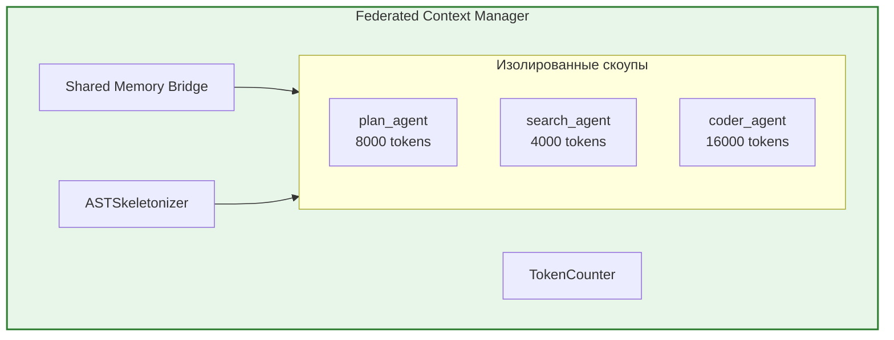

# Federated Context Manager — Документация

> **Статус:** Design Document  
> **Версия:** 1.0  
> **Дата:** 24 июня 2026

---

## Обзор

Federated Context Manager (FCM) — компонент для управления контекстом в мультиагентной системе CodeLab. Решает проблемы дублирования RPC запросов, потери контекста при сжатии и отсутствия приоритетов.

## Документы

| Документ | Описание | Для кого |
|----------|----------|----------|
| [ARCHITECTURE.md](./ARCHITECTURE.md) | Полная архитектура FCM с Mermaid диаграммами | Архитекторы, reviewers |
| [INTEGRATION_GUIDE.md](./INTEGRATION_GUIDE.md) | Пошаговое руководство по внедрению | Разработчики |
| [DIAGRAMS.md](./DIAGRAMS.md) | Все Mermaid диаграммы в одном месте | Визуальное понимание |
| [CHEAT_SHEET.md](./CHEAT_SHEET.md) | Краткая шпаргалка с примерами кода | Быстрый старт |

## Ключевые преимущества

| Преимущество | Описание |
|--------------|----------|
| **Скорость** | Нет повторных RPC запросов — данные копируются в RAM за 0 мс |
| **Качество** | AST-скелетирование сохраняет структуру кода при сжатии |
| **Экономия** | Точный подсчёт токенов через tiktoken |
| **Изоляция** | Каждый агент работает в своём лимите токенов |

## Быстрый старт

```python
from codelab.server.agent.context import FederatedContextManager

# Создание FCM
fcm = FederatedContextManager()

# Создание скоупов
await fcm.create_scope("search_agent", max_tokens=4000)
await fcm.create_scope("coder_agent", max_tokens=16000)

# Добавление данных
await fcm.add_to_scope("search_agent", "src/db.py", "file_content", code, priority=5)

# Шеринг между агентами
await fcm.share_item("search_agent", "coder_agent", "src/db.py")

# Получение оптимизированного payload
payload = await fcm.optimize_and_build_payload("coder_agent")
```

## Архитектура



## Путь внедрения

1. **Фаза 1:** ASTSkeletonizer — сжатие кода до сигнатур
2. **Фаза 2:** TokenCounter — точный подсчёт токенов
3. **Фаза 3:** ContextItem + Scope — базовые структуры
4. **Фаза 4:** FederatedContextManager — координатор
5. **Фаза 5:** Интеграция со стратегиями

Подробности в [INTEGRATION_GUIDE.md](./INTEGRATION_GUIDE.md).

## Связанные документы

- [Мультиагентная техническая спецификация](../MULTIAGENT_TECHNICAL_SPECIFICATION.md)
- [Архитектура ACP Protocol](../ARCHITECTURE.md)
- [PoC документ](../../../../docs/poc/fcm-poc.md) (если существует)
