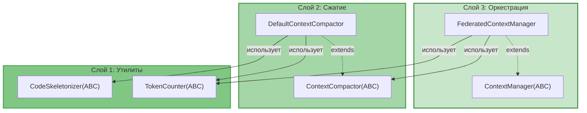

# Federated Context Manager — Документация

> **Статус:** Design Document  
> **Версия:** 2.0  
> **Дата:** 24 июня 2026
> 
> **Изменения в v2.0:**
> - Слоистая архитектура (Layer 1/2/3)
> - ABC вместо Protocol (соответствие стилю проекта)
> - Паттерны проектирования: Strategy, Template Method, Composite, Mediator

---

## Обзор

Federated Context Manager (FCM) — компонент для управления контекстом в мультиагентной системе CodeLab. Решает проблемы дублирования RPC запросов, потери контекста при сжатии и отсутствия приоритетов.

## Архитектура (v2.0)



## Паттерны проектирования

| Паттерн | Слой | Компонент |
|---------|------|-----------|
| **Strategy** | 1 | `TokenCounter`, `CodeSkeletonizer` |
| **Template Method** | 2 | `ContextCompactor` |
| **Composite** | 2 | `DefaultContextCompactor` |
| **Mediator** | 3 | `FederatedContextManager` |
| **Factory Method** | 1 | `create_token_counter()` |

## Документы

| Документ | Описание | Для кого |
|----------|----------|----------|
| [ARCHITECTURE.md](./ARCHITECTURE.md) | Полная архитектура FCM с Mermaid диаграммами | Архитекторы, reviewers |
| [INTEGRATION_GUIDE.md](./INTEGRATION_GUIDE.md) | Пошаговое руководство по внедрению | Разработчики |
| [DIAGRAMS.md](./DIAGRAMS.md) | Все Mermaid диаграммы в одном месте | Визуальное понимание |
| [CHEAT_SHEET.md](./CHEAT_SHEET.md) | Краткая шпаргалка с примерами кода | Быстрый старт |

## Ключевые преимущества

| Преимущество | Описание |
|--------------|----------|
| **Скорость** | Нет повторных RPC запросов — данные копируются в RAM за 0 мс |
| **Качество** | AST-скелетирование сохраняет структуру кода при сжатии |
| **Экономия** | Точный подсчёт токенов через tiktoken |
| **Изоляция** | Каждый агент работает в своём лимите токенов |

## Быстрый старт

```python
from codelab.server.agent.context.token_counter import create_token_counter
from codelab.server.agent.context.ast_skeletonizer import PythonASTSkeletonizer
from codelab.server.agent.context.compactor import DefaultContextCompactor
from codelab.server.agent.context.manager import FederatedContextManager

# Слой 1: Утилиты
token_counter = create_token_counter()
skeletonizer = PythonASTSkeletonizer()

# Слой 2: Сжатие
compactor = DefaultContextCompactor(
    token_counter=token_counter,
    skeletonizer=skeletonizer,
)

# Слой 3: Оркестрация
fcm = FederatedContextManager(
    token_counter=token_counter,
    skeletonizer=skeletonizer,
    compactor=compactor,
)

# Использование
await fcm.create_scope("search_agent", max_tokens=4000)
await fcm.create_scope("coder_agent", max_tokens=16000)
await fcm.add_to_scope("search_agent", "src/db.py", "file_content", code, priority=5)
await fcm.share_item("search_agent", "coder_agent", "src/db.py")
payload = await fcm.optimize_and_build_payload("coder_agent")
```

## Структура файлов

```
src/codelab/server/agent/context/
├── # Слой 1: Утилиты
├── token_counter.py          # TokenCounter(ABC), TiktokenCounter, ApproximateTokenCounter
├── ast_skeletonizer.py       # CodeSkeletonizer(ABC), PythonASTSkeletonizer
│
├── # Слой 2: Сжатие
├── compactor.py              # ContextCompactor(ABC), DefaultContextCompactor
│
├── # Слой 3: Оркестрация
├── items.py                  # ContextItem, ContextType
├── scope.py                  # AgentContextScope
├── manager.py                # ContextManager(ABC), FederatedContextManager
└── cache.py                  # ACPCache
```

## Путь внедрения

1. **Слой 1 — Утилиты:** `TokenCounter`, `CodeSkeletonizer` (Strategy Pattern)
2. **Слой 2 — Сжатие:** `ContextCompactor` с AST-скелетированием (Template Method)
3. **Слой 3 — Оркестрация:** `ContextManager`, `FederatedContextManager` (Mediator)
4. **Интеграция:** `ExecutionEngine`, стратегии (Orchestrated, Hierarchical)

Подробности в [INTEGRATION_GUIDE.md](./INTEGRATION_GUIDE.md).

## Связанные документы

- [Мультиагентная техническая спецификация](../MULTIAGENT_TECHNICAL_SPECIFICATION.md)
- [Архитектура ACP Protocol](../ARCHITECTURE.md)
- [PoC документ](../../../../docs/poc/fcm-poc.md) (если существует)
