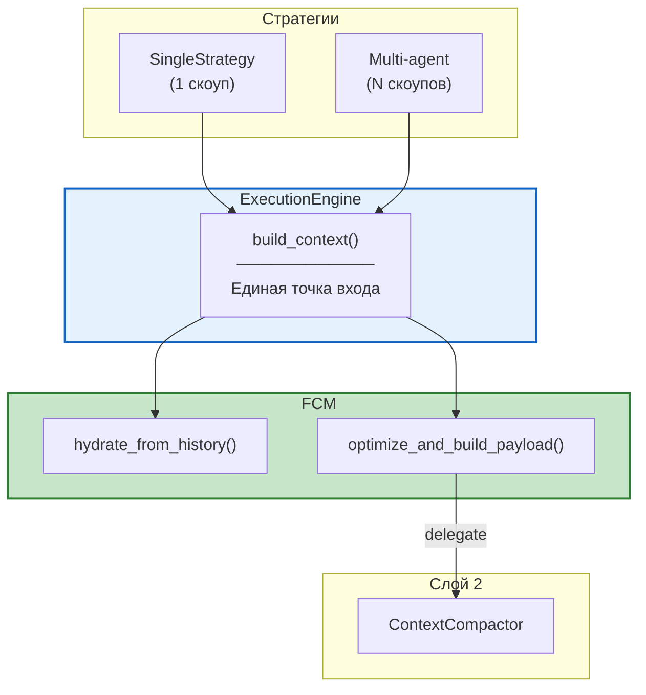
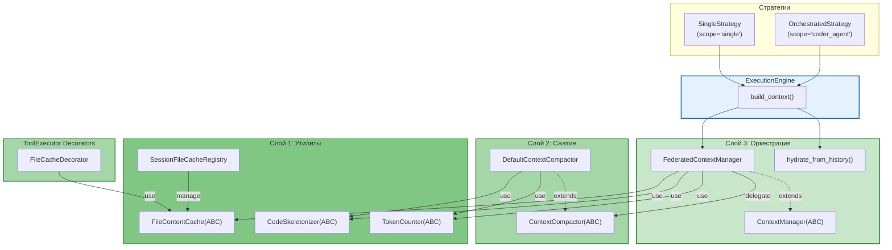

# Federated Context Manager — Документация

> **Статус:** Design Document  
> **Версия:** 2.3  
> **Дата:** 25 июня 2026
>
> **Изменения в v2.3:**
> - `FCMCachingDecorator` + `CacheInvalidationDecorator` объединены в единый
>   `FileCacheDecorator` (read-cache + write-invalidation + опц. FCM scope)
> - Унификация конфига: единственное имя master switch — `agents.context.enable_fcm`
> - Добавлены явные ABC `ContextManager` и `ContextCompactor`
>   (`ARCHITECTURE.md §3.7`) — теперь не только Mermaid, но и канонический Python-код
> - `INTEGRATION_GUIDE.md` Шаги 1–2: убран дубликат `TokenCounter` через `Protocol`,
>   починен оборванный фрагмент после `_ASTVisitor`
> - README указывает `MIGRATION_PLAN.md` как roadmap-источник истины
>
> **Изменения в v2.2:**
> - Единый путь формирования payload через FCM для всех стратегий
> - `hydrate_from_history()` автоматически в `ExecutionEngine.build_context()`
> - `ContextCompactor` — отдельный компонент (Слой 2), вызывается через FCM
> 
> **Изменения в v2.1:**
> - Добавлен `FileContentCache` — кэш содержимого файлов (Слой 1)
> - Добавлен `SessionFileCacheRegistry` — реестр кэшей по сессиям
> - Декоратор инвалидации кэша (в v2.3 слит с `FileCacheDecorator`)
> 
> **Изменения в v2.0:**
> - Слоистая архитектура (Layer 1/2/3)
> - ABC вместо Protocol (соответствие стилю проекта)
> - Паттерны проектирования: Strategy, Template Method, Composite, Mediator

---

## Обзор

Federated Context Manager (FCM) — компонент для управления контекстом в мультиагентной системе CodeLab. Решает проблемы дублирования RPC запросов, потери контекста при сжатии и отсутствия приоритетов.

## Ключевая концепция: единый путь

Все стратегии (Single, Orchestrated, Choreography, Hierarchical) используют **единый путь** формирования payload через `ExecutionEngine.build_context()` → `FCM`:



**Разница между стратегиями — только в количестве скоупов:**
- SingleStrategy → 1 глобальный скоуп (`agent_scope="single"`)
- Multi-agent → N скоупов + шеринг между ними

## Архитектура (v2.2)



## Паттерны проектирования

| Паттерн | Слой | Компонент |
|---------|------|-----------|
| **Strategy** | 1 | `TokenCounter`, `CodeSkeletonizer` |
| **Repository** | 1 | `FileContentCache` |
| **Registry** | 1 | `SessionFileCacheRegistry` |
| **Decorator** | 1 | `FileCacheDecorator` |
| **Template Method** | 2 | `ContextCompactor` |
| **Composite** | 2 | `DefaultContextCompactor` |
| **Mediator** | 3 | `FederatedContextManager` |
| **Factory Method** | 1 | `create_token_counter()` |

## Документы

| Документ | Описание | Для кого |
|----------|----------|----------|
| [ARCHITECTURE.md](./ARCHITECTURE.md) | Полная архитектура FCM с Mermaid диаграммами | Архитекторы, reviewers |
| [INTEGRATION_GUIDE.md](./INTEGRATION_GUIDE.md) | Пошаговое руководство по внедрению | Разработчики |
| [DIAGRAMS.md](./DIAGRAMS.md) | Все Mermaid диаграммы в одном месте | Визуальное понимание |
| [CHEAT_SHEET.md](./CHEAT_SHEET.md) | Краткая шпаргалка с примерами кода | Быстрый старт |

## Ключевые преимущества

| Преимущество | Описание |
|--------------|----------|
| **Скорость** | Нет повторных RPC запросов — данные копируются в RAM за 0 мс |
| **Качество** | AST-скелетирование сохраняет структуру кода при сжатии |
| **Экономия** | Точный подсчёт токенов через tiktoken |
| **Изоляция** | Каждый агент работает в своём лимите токенов |

## Быстрый старт

```python
from codelab.server.agent.context.token_counter import create_token_counter
from codelab.server.agent.context.ast_skeletonizer import PythonASTSkeletonizer
from codelab.server.agent.context.file_cache import InMemoryFileCache, SessionFileCacheRegistry
from codelab.server.agent.context.compactor import DefaultContextCompactor
from codelab.server.agent.context.manager import FederatedContextManager

# Слой 1: Утилиты
token_counter = create_token_counter()
skeletonizer = PythonASTSkeletonizer()
cache_registry = SessionFileCacheRegistry()
file_cache = cache_registry.get_or_create("session_123")

# Слой 2: Сжатие
compactor = DefaultContextCompactor(
    token_counter=token_counter,
    skeletonizer=skeletonizer,
)

# Слой 3: Оркестрация
fcm = FederatedContextManager(
    token_counter=token_counter,
    skeletonizer=skeletonizer,
    compactor=compactor,
    file_cache=file_cache,
)

# Использование
await fcm.create_scope("search_agent", max_tokens=4000)
await fcm.create_scope("coder_agent", max_tokens=16000)
await fcm.add_to_scope("search_agent", "src/db.py", "file_content", code, priority=5)
await fcm.share_item("search_agent", "coder_agent", "src/db.py")
payload = await fcm.optimize_and_build_payload("coder_agent")
```

## Структура файлов

```
src/codelab/server/agent/context/
├── # Слой 1: Утилиты
├── token_counter.py          # TokenCounter(ABC), TiktokenCounter, ApproximateTokenCounter
├── ast_skeletonizer.py       # CodeSkeletonizer(ABC), PythonASTSkeletonizer
├── file_cache.py             # FileContentCache(ABC), InMemoryFileCache, SessionFileCacheRegistry
│
├── # Слой 2: Сжатие
├── compactor.py              # ContextCompactor(ABC), DefaultContextCompactor
│
├── # Слой 3: Оркестрация
├── items.py                  # ContextItem, ContextType
├── scope.py                  # AgentContextScope
└── manager.py                # ContextManager(ABC), FederatedContextManager

src/codelab/server/tools/executors/decorators/
└── file_cache.py             # FileCacheDecorator (NEW: read-cache + write-invalidation + опц. FCM scope)

# Изменяемые файлы
src/codelab/server/agent/execution_engine.py      # +_build_via_fcm()
src/codelab/server/protocol/state.py              # +current_agent_scope
src/codelab/server/tools/integrations/
└── client_rpc_bridge.py                          # +FileContentCache integration
```

## Путь внедрения

> **Roadmap-источник истины:** [MIGRATION_PLAN.md](./MIGRATION_PLAN.md), Phase 0–5.
> Этот раздел — краткая сводка; конкретные задачи, acceptance criteria и
> сроки приведены в плане миграции. Начинать с Phase 0 (расширение
> `ExecutionEngine.__init__` + `agent_scope`) и Phase 1 (Слой 1 — утилиты).

1. **Слой 1 — Утилиты:** `TokenCounter`, `CodeSkeletonizer`, `FileContentCache` (Strategy, Repository)
2. **Слой 1 — Registry:** `SessionFileCacheRegistry` (Registry)
3. **Слой 1 — Decorator:** `FileCacheDecorator` (Decorator) — read-cache + write-invalidation + опц. FCM scope
4. **Слой 2 — Сжатие:** `ContextCompactor` с AST-скелетированием (Template Method)
5. **Слой 3 — Оркестрация:** `ContextManager`, `FederatedContextManager` (Mediator)
6. **SessionState:** Добавить `current_agent_scope`
7. **ClientRPCBridge:** Интегрировать `FileContentCache` (cache before RPC)
8. **Интеграция:** `ExecutionEngine.build_context()` → единый путь для всех стратегий
9. **Гидратация:** `hydrate_from_history()` автоматически в `ExecutionEngine`
10. **Multi-agent стратегии:** `OrchestratedStrategy`, `HierarchicalStrategy`, `ChoreographyStrategy`

Подробности в [INTEGRATION_GUIDE.md](./INTEGRATION_GUIDE.md) и [AGENT_LOOP_INTEGRATION.md](./AGENT_LOOP_INTEGRATION.md).

## Связанные документы

### Критические (P0) — Read Before Implementing
- [AGENT_LOOP_INTEGRATION.md](./AGENT_LOOP_INTEGRATION.md) — **FCM flow в AgentLoop + все стратегии + ClientRPC → FCM**
- [MIGRATION_PLAN.md](./MIGRATION_PLAN.md) — пошаговый план внедрения (7-8 недель)
- [ERROR_HANDLING.md](./ERROR_HANDLING.md) — стратегия обработки ошибок
- [EDGE_CASES.md](./EDGE_CASES.md) — спецификация 10 edge cases

### High Priority (P1)
- [FEATURE_FLAGS.md](./FEATURE_FLAGS.md) — конфигурация и rollout
- [PERFORMANCE_REQUIREMENTS.md](./PERFORMANCE_REQUIREMENTS.md) — SLOs и бенчмарки

### Reference
- [ARCHITECTURE.md](./ARCHITECTURE.md) — полная архитектура FCM
- [INTEGRATION_GUIDE.md](./INTEGRATION_GUIDE.md) — пошаговое руководство
- [DIAGRAMS.md](./DIAGRAMS.md) — все Mermaid диаграммы
- [CHEAT_SHEET.md](./CHEAT_SHEET.md) — краткая шпаргалка

### Внешние
- [Мультиагентная техническая спецификация](../MULTIAGENT_TECHNICAL_SPECIFICATION.md)
- [Архитектура ACP Protocol](../ARCHITECTURE.md)
