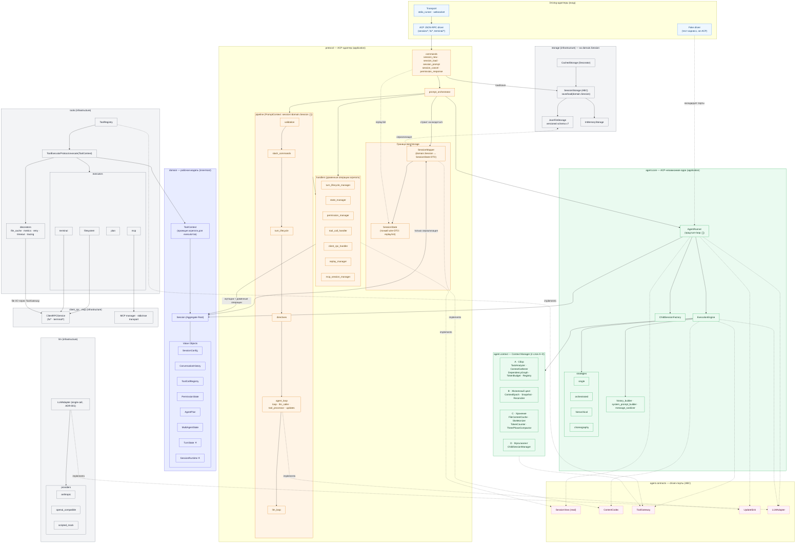
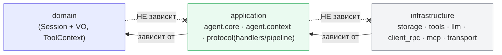

# Серверная архитектура — целевое состояние (post write-фаза)

> **Статус:** целевое (to-be). Отражает состояние серверной части **после** завершения
> доменной миграции сессии (ADR-006, write-фаза) и разблокированных ей Workstream ADR-005
> **C** (прод turn-loop через `AgentRunner`) и **B** (доменная эмиссия `UpdateSink`).
>
> **Основание:** ADR-003 (вариант B), ADR-005 (ACP-независимое ядро, порты), ADR-006 (write-фаза),
> `openspec/changes/session-domain-write-phase/{proposal,design}.md`, карта D4.1
> (`d4.1-mutation-map.md`), раздел «Архитектура» в `CLAUDE.md`.
>
> Помечено ✳ — вводится write-фазой (ADR-006 D4-a: `TurnState`/`SessionRuntime`).
> Помечено ⓒ/ⓑ — достигается после Workstream C/B соответственно.
>
> Этот документ — целевой референс; питает задачу **D.3** (синхронизация канонического
> `ARCHITECTURE.md` и его Mermaid после реализации).

## 1. Компоненты по слоям и зависимости

**Легенда рёбер:** сплошное — поток данных/вызовов; `-.->` — зависимость от driven-порта;
`-. implements .->` — реализация порта в адаптере/инфраструктуре.

## 2. Правило зависимостей (import-linter «Server layers», после закрытия ADR-003)

**Инвариант достигнут (2026-08-03, ADR-006 фаза D):** `agent.core` → **0 рёбер** к `protocol`;
`ignore_imports` **пуст** (сняты `file_cache_decorator`, `tools.executors.decorators.base` и
`storage.base` → `protocol.state`). Документ сессии живёт не в `protocol`, а в
`storage/document.py` под именем `SessionDocument`: «состояние сессии» — это доменный `Session`,
а на диске лежит документ.

## 3. Ключевые сдвиги относительно as-is

| Аспект | Было (as-is) | Стало (target) |
|---|---|---|
| Рабочая модель turn'а | `protocol.SessionState` (Pydantic, мутируется по стадиям) | `domain.Session` (агрегат, доменные операции) |
| Документ сессии | source-of-truth + сериализация под именем `SessionState` | **`SessionDocument`** в `storage/`, только сериализация |
| Точка конвертации | размазана | единственная — `SessionMapper` |
| `storage` типизирован на | `SessionState` (рантайм-импорт из `protocol`) | `domain.Session` на порту, `SessionDocument` внутри |
| Executor'ы получают | `SessionState` | доменный `ToolContext` (проекция) |
| `agent.core → protocol` | остаточные рёбра в `ignore_imports` | **0 рёбер**, `ignore_imports` пуст |
| turn-loop | внутри protocol-пайплайна | прод-loop через `AgentRunner` (ⓒ) |
| Эмиссия `session/update` | сборка wire в ядре | доменная эмиссия через порт `UpdateSink` (ⓑ) |

## 4. Паттерны (DDD/hexagonal)

- **Aggregate Root** — `domain.Session`: полная рабочая+персистируемая модель (состояние сессии
  + turn-runtime как доменные VO `TurnState`/`SessionRuntime`), доменные инварианты и операции;
  тредится одной ссылкой (`PromptContext.session`).
- **Anti-Corruption / Mapper** — `SessionMapper`: единственная точка `domain ↔ wire/storage`,
  round-trip без потерь; апгрейд версий формата хранения.
- **Repository** — `SessionStorage` над `domain.Session`; `JsonFile`/`InMemory` + **Decorator**
  `CachedStorage`.
- **Ports & Adapters (hexagonal)** — driven-порты `SessionView`/`ContentCodec`/`ToolGateway`/
  `UpdateSink`/`LLMAdapter` (заморожены, ADR-005); driving-адаптеры ACP-driver и fake driver.
- **Adapter** — `ToolContext`: проекция агрегата для executor'ов.
- **Wire-DTO** — `SessionState` (в `protocol`): тонкий маппинг для ACP-подмножества (replay/init);
  `available_commands` — ACP wire-DTO; `mcp_prompt_handlers` — transient (`exclude=True`).
</content>
