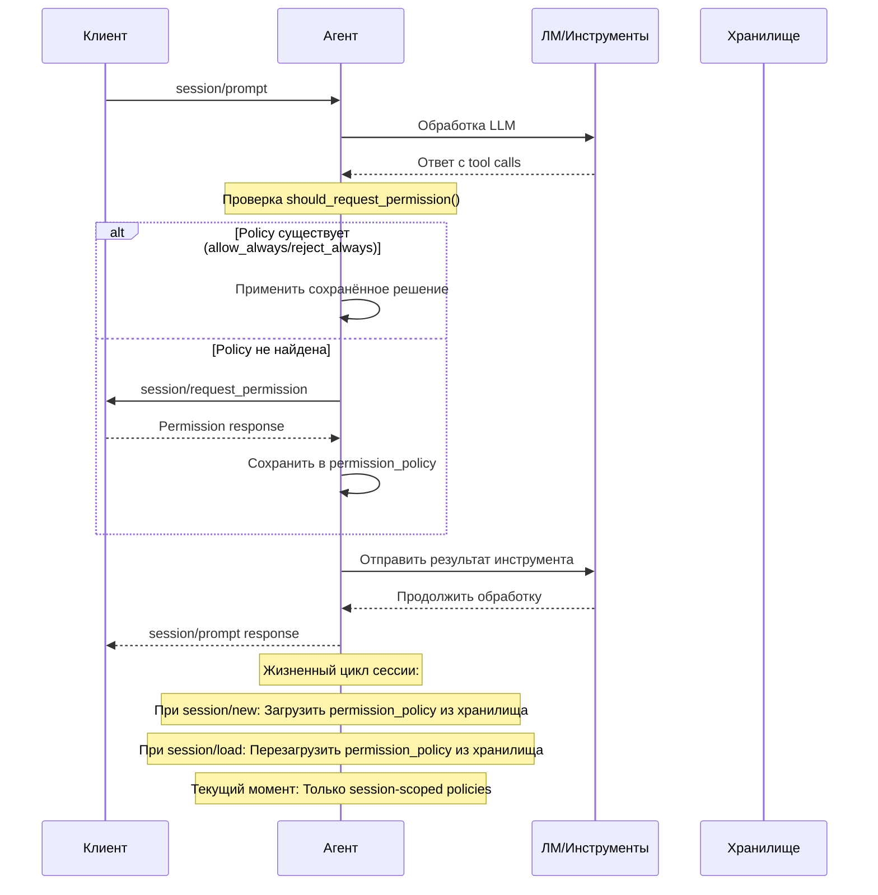
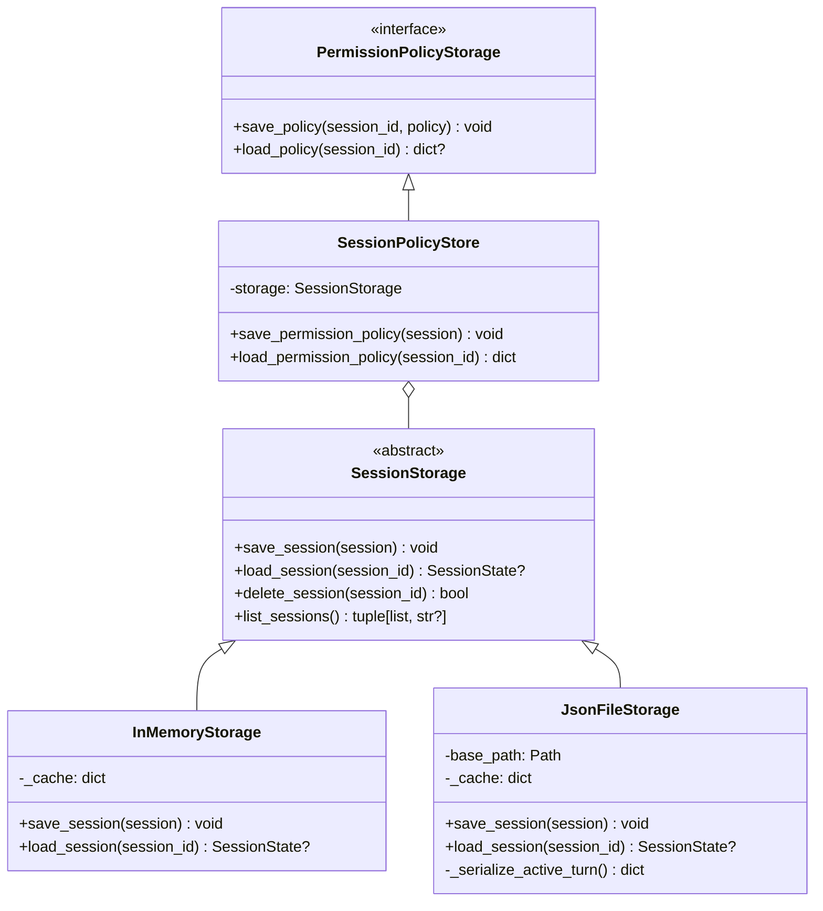
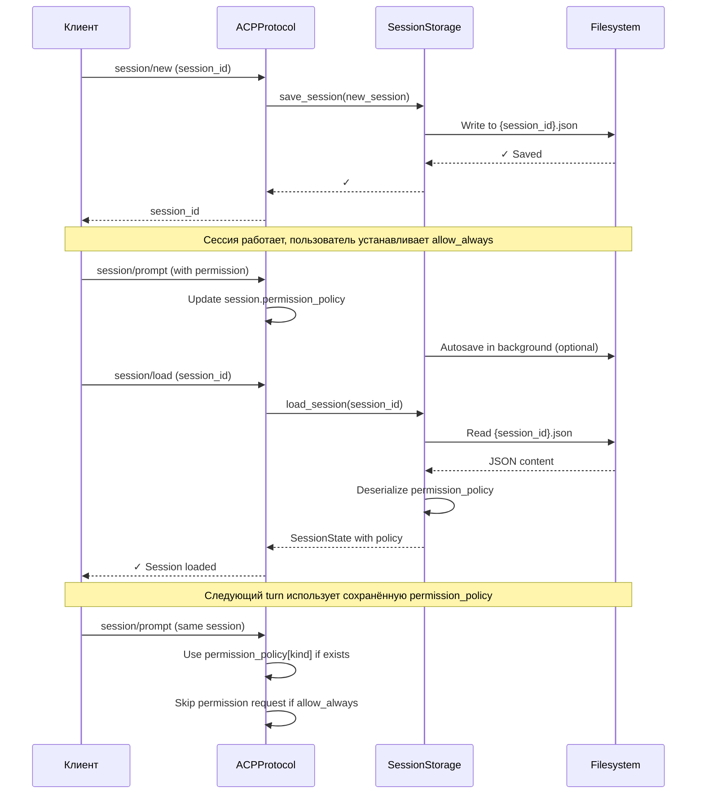
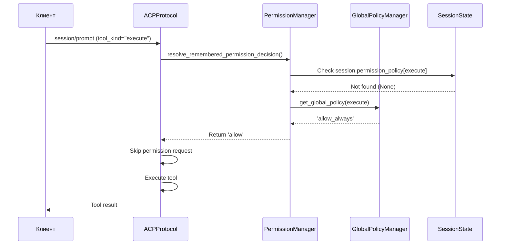
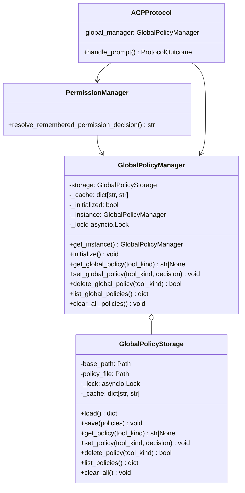

# Архитектура Advanced Permission Management (Этап 5)

## Обзор

Документ описывает архитектуру для **Advanced Permission Management** — системы управления разрешениями с поддержкой:
- **Policy Persistence**: сохранение разрешений между сессиями
- **Allow_Always механизм**: постоянные разрешения по tool kind
- **Storage Integration**: интеграция с SessionStorage
- **Backward Compatibility**: полная совместимость с текущей реализацией

---

## 1. Анализ текущей реализации

### 1.1 Существующие компоненты

#### SessionState (state.py, строка 51)
```python
permission_policy: dict[str, str] = field(default_factory=dict)
```
- **Назначение**: Хранит персистентные permission-решения по kind (например, `allow_always`)
- **Область**: Только в памяти, теряется при завершении сессии
- **Формат**: `{"tool_kind": "allow_always" | "reject_always"}`

#### PermissionManager (permission_manager.py)
Основные методы:
- `should_request_permission(session, tool_kind)` — проверка нужен ли запрос
- `get_remembered_permission(session, tool_kind)` — получение сохранённого решения
- `build_permission_request()` — создание notification о требуемом разрешении
- `build_permission_acceptance_updates()` — обновление policy при выборе allow_always/reject_always
- `extract_permission_outcome()` — парсинг response от клиента
- `extract_permission_option_id()` — парсинг выбранной опции

#### Permission Options (4 варианта)
```
allow_once:      Выполнить один раз
allow_always:    Запомнить, всегда разрешать
reject_once:     Отклонить один раз
reject_always:   Запомнить, всегда отклонять
```

#### JsonFileStorage (json_file.py)
- Уже сериализует/десериализует `permission_policy` при save/load session
- Используется в production для persistence сессий

### 1.2 Текущий flow (High-level)



### 1.3 Проблемы текущей реализации

| Проблема | Влияние | Приоритет |
|----------|--------|----------|
| **Session-scoped policies** | allow_always теряется при завершении сессии | HIGH |
| **No cross-session policies** | Нельзя применить разрешение к нескольким сессиям | HIGH |
| **No policy versioning** | Нет механизма для обновления/миграции policies | MEDIUM |
| **No policy metadata** | Нет информации о when/who set permission | LOW |
| **Manual policy management** | Нет UI/API для управления сохранённых policies | MEDIUM |

---

## 2. Требования протокола ACP

### 2.1 Из документации (05-Prompt Turn.md)

**Permission Request (строки 206-207)**
```
"Before proceeding with execution, the Agent MAY request permission 
from the Client via the session/request_permission method."
```

**Permission Options (стандартные)**
- `allow_once`: Выполнить один раз, не сохранять
- `allow_always`: Запомнить и всегда разрешать (PERSISTENCE ТРЕБУЕТСЯ)
- `reject_once`: Отклонить один раз
- `reject_always`: Запомнить и всегда отклонять (PERSISTENCE ТРЕБУЕТСЯ)

**Cancellation (строки 301)**
```
"The Client MUST respond to all pending session/request_permission 
requests with the cancelled outcome."
```

### 2.2 Инварианты протокола

1. **Policy Application**: Если для tool kind установлена `allow_always`/`reject_always`, больше не запрашивать разрешение
2. **Tool Kind Scoping**: Policy привязана к tool kind, не к specific tool (например, `execute` применяется ко всем execute tools)
3. **Per-Session Isolation**: Policy не должна пересекаться между сессиями (each session has own scope)
4. **User Override**: Клиент всегда может изменить policy через выбор в permission_request

---

## 3. Архитектура Policy Persistence

### 3.1 Storage Layer Architecture



### 3.2 План реализации Policy Persistence

#### Фаза 1: Session-Level Persistence (Уже существует)
- **Статус**: ✅ Реализовано
- **Область**: Session-scoped permission policies
- **Хранилище**: SessionState.permission_policy сериализуется в JSON
- **Механизм**: 
  - Save: `JsonFileStorage.save_session()` → `{session_id}.json`
  - Load: `JsonFileStorage.load_session()` → restore `permission_policy` dict
- **Поток данных**:
  ```
  permission_policy dict → JSON serialization → file system → JSON deserialization → SessionState
  ```

#### Фаза 2: Session History Persistence (Планируется)
- **Область**: Allow_always policies across session loads/reloads
- **Требование**: When loading an existing session, restore its permission_policy
- **Точки интеграции**:
  - `session/load` handler: Load permission_policy from stored JSON
  - `session/new` handler: Initialize empty permission_policy (or from template)
- **Backward Compatibility**: Empty permission_policy dict for sessions created before Phase 2

#### Фаза 3: Global Policy Management (Будущее)
- **Область**: Policies applicable to all sessions (global default)
- **Хранилище**: Separate global policy file (e.g., `~/.acp/global_permissions.json`)
- **Приоритет**: 
  ```
  Session Policy (Session-Level)
  ↓ (если не найдена)
  Global Policy (All Sessions)
  ↓ (если не найдена)
  Default: Ask User
  ```

#### Фаза 4: Policy Metadata & Versioning (Будущее)
- **Metadata**: `{tool_kind, decision, set_at, set_by, version}`
- **Versioning**: Handle policy structure changes across updates
- **Migration**: Script to update old policy formats

---

## 4. Allow_Always Механизм

### 4.1 Decision Flow Diagram

```mermaid
stateDiagram-v2
    [*] --> CheckPolicy
    
    CheckPolicy: Проверка session.permission_policy
    CheckPolicy --> PolicyFound{Policy существует<br/>для tool kind?}
    
    PolicyFound -->|Да: allow_always| Allow
    PolicyFound -->|Да: reject_always| Reject
    PolicyFound -->|Да: unknown| Ask
    PolicyFound -->|Нет| Ask
    
    Ask: Запрос разрешения<br/>у пользователя
    Ask --> UserChoice{Выбор<br/>пользователя?}
    
    UserChoice -->|allow_once| AllowOnce
    UserChoice -->|allow_always| SaveAllow
    UserChoice -->|reject_once| RejectOnce
    UserChoice -->|reject_always| SaveReject
    UserChoice -->|cancelled| Cancel
    
    SaveAllow: Сохранить policy[kind]=allow_always
    SaveAllow --> Allow
    
    SaveReject: Сохранить policy[kind]=reject_always
    SaveReject --> Reject
    
    Allow: Выполнить инструмент
    Reject: Отклонить инструмент
    AllowOnce: Выполнить один раз
    RejectOnce: Отклонить один раз
    Cancel: Отменить turn
    
    Allow --> [*]
    Reject --> [*]
    AllowOnce --> [*]
    RejectOnce --> [*]
    Cancel --> [*]
```

### 4.2 Детали реализации

#### Текущая реализация (Session-Scoped)

**Resolution Logic** (permission_manager.py)
```python
def get_remembered_permission(session, tool_kind):
    """Возвращает allow, reject или ask"""
    remembered = session.permission_policy.get(tool_kind)
    if remembered == "allow_always":
        return "allow"
    if remembered == "reject_always":
        return "reject"
    return "ask"
```

**Saving Decisions** (build_permission_acceptance_updates)
```python
def build_permission_acceptance_updates(session, tool_call, kind):
    """Обновляет permission_policy если выбран allow_always или reject_always"""
    if kind in ("allow_always", "reject_always"):
        session.permission_policy[tool_call.kind] = kind
```

#### Ключевые поведения

| Сценарий | Поведение | Persistency |
|----------|----------|-------------|
| User selects `allow_once` | Execute tool, don't save policy | Нет |
| User selects `allow_always` | Execute tool, save `policy[kind]=allow_always` | Session + File |
| User selects `reject_once` | Reject tool, don't save policy | Нет |
| User selects `reject_always` | Reject tool, save `policy[kind]=reject_always` | Session + File |
| Policy exists for kind | Skip request, apply remembered decision | No RPC call |
| Session reloads | Restore policy from JSON file | ✓ Работает |

### 4.3 Формат хранения Policy

**Текущий формат** (JSON)
```json
{
  "session_id": "sess_abc123",
  "permission_policy": {
    "execute": "allow_always",
    "read": "reject_always",
    "write": "allow_always"
  }
}
```

**Предложенный расширенный формат** (Фаза 4, будущее)
```json
{
  "session_id": "sess_abc123",
  "permission_policy": {
    "execute": {
      "decision": "allow_always",
      "set_at": "2026-04-16T12:34:00Z",
      "set_by": "user",
      "version": 1
    },
    "read": {
      "decision": "reject_always",
      "set_at": "2026-04-16T10:00:00Z",
      "set_by": "user",
      "version": 1
    }
  }
}
```

---

## 5. Storage Integration

### 5.1 Session Lifecycle с Policy Persistence



### 5.2 JsonFileStorage Integration

**Текущая сериализация** (lines 54-84)
```python
def _serialize_active_turn(self, active_turn) -> dict:
    """Уже обрабатывает permission_request_id, permission_tool_call_id"""
    return {
        "prompt_request_id": ...,
        "session_id": ...,
        "permission_request_id": ...,
        "permission_tool_call_id": ...,
    }
```

**Отсутствует: Explicit permission_policy serialization**
- ✅ Текущий момент работает потому что dict is JSON-serializable
- ⚠️ Нет explicit handling в serialize/deserialize методах
- 📋 TODO: Add explicit serialization methods for clarity and future extensions

### 5.3 Data Consistency Guarantees

| Сценарий | Текущий | После Фазы 2 | Комментарий |
|----------|---------|-------------|----------|
| Session created | policy={} | policy={} | Всегда начинается пусто |
| User sets allow_always | Saved in memory + JSON | ✓ Persisted | Работает, но нет explicit handling |
| Session ends | Lost if in-memory only | Restored on session/load | Need to ensure save on session/prompt |
| Multiple turns same session | Previous policies apply | ✓ Works | Permission policy stays across turns |
| Session transferred to another client | Lost | Restored from JSON | Must reload session |

---

## 6. Анализ совместимости

### 6.1 Backward Compatibility Matrix

| Компонент | Текущий | Фаза 2 | Фаза 3 | Фаза 4 | Breaking? |
|-----------|---------|--------|--------|--------|-----------|
| SessionState.permission_policy | dict[str, str] | dict[str, str] | dict[str, str] | dict[str, Union[str, dict]] | Нет (new fields) |
| permission_policy format | {"kind": "allow_always"} | Same | Same | {"kind": {decision, metadata}} | Needs migration |
| JsonFileStorage | Implicit serialize | Explicit serialize | Global file | Versioned | Нет |
| PermissionManager API | Current methods | Enhanced | + GlobalPolicyManager | + VersionManager | Нет additions break existing |
| Permission flow | Works | Works | Precedence change | Metadata optional | Нет |

### 6.2 Migration Path

**От Current → Фаза 2:**
```python
def migrate_permission_policy_v1_to_v2(session: SessionState) -> None:
    """Миграция не требуется - dict format остаётся таким же"""
    # Просто убедиться что permission_policy персистентна в JSON
    # Существующие сессии загружаются с empty policy dict
    pass
```

**От Фазы 2 → Фазы 3:**
```python
def migrate_permission_policy_v2_to_v3(policy_dict: dict) -> dict:
    """Добавить поддержку global policy"""
    # Check if policy exists in session
    # If not, check global policy file
    # Merge with precedence: session > global
    return merged_policy
```

**От Фазы 3 → Фазы 4:**
```python
def migrate_permission_policy_v3_to_v4(policy: dict) -> dict:
    """Конвертировать простые решения в формат с metadata"""
    # Old: {"execute": "allow_always"}
    # New: {"execute": {"decision": "allow_always", "set_at": ..., "version": 1}}
    migrated = {}
    for kind, decision in policy.items():
        if isinstance(decision, str):
            migrated[kind] = {
                "decision": decision,
                "set_at": datetime.now(UTC).isoformat(),
                "set_by": "migration",
                "version": 1,
            }
    return migrated
```

---

## 7. План реализации (Фазовый)

### Фаза 1: Session-Level Persistence ✅ DONE
**Статус**: Завершено
- ✅ SessionState.permission_policy существует
- ✅ JsonFileStorage уже сериализует/десериализует
- ✅ PermissionManager обрабатывает решения
- ✅ allow_always/reject_always работают внутри сессии

**Testing**: 
- ✅ test_permission_manager.py (36 tests)
- ✅ test_permission_flow.py (integration tests)
- ✅ test_storage_json_file.py (includes permission_policy)

### Фаза 2: Cross-Session Policy Restoration (NEXT)
**Область**: Load saved permission_policy when loading existing session
**Effort**: Small (modify session/load handler)
**Файлы**:
- `codelab/src/codelab/server/protocol/handlers/session.py` — Update session/load handler
- `codelab/tests/server/test_protocol.py` — Add E2E test for policy persistence

**Задачи**:
1. Ensure session/load restores permission_policy from JSON
2. Add E2E test: Load session → permission_policy persists
3. Add unit test: Policy survives session reload cycle
4. Update CHANGELOG.md

**Success Criteria**:
- `session/new` → set allow_always → `session/end`
- `session/load` (same session) → permission_policy restored
- Next tool call skips permission request

### Фаза 3: Global Policy Support (FUTURE)
**Область**: Policies applicable to all sessions
**Файлы**:
- `codelab/src/codelab/server/storage/policy_storage.py` (new)
- `codelab/src/codelab/server/protocol/handlers/permission_manager.py` (extend)
- New config: `~/.acp/global_permissions.json`

**Приоритет**:
```
Session Policy > Global Policy > Ask User
```

### Фаза 4: Policy Metadata & Versioning (FUTURE)
**Область**: Track when/who/why policies were set
**Файлы**:
- `codelab/src/codelab/server/protocol/state.py` — PolicyMetadata dataclass
- `codelab/src/codelab/server/protocol/handlers/permission_manager.py` (extend)
- Migration scripts

**Преимущества**:
- Audit trail
- Policy expiration
- Auto-update on agent version bump

---

## 8. Стратегия тестирования

### 8.1 Unit Tests

**PermissionManager Tests** (test_permission_manager.py)
```python
def test_permission_policy_loads_from_json() -> None:
    """Проверить что permission_policy восстановлена из JSON файла"""
    # 1. Create session with allow_always
    # 2. Save to JSON
    # 3. Load from JSON
    # 4. Assert policy restored
    pass

def test_permission_policy_applied_across_turns() -> None:
    """Проверить что allow_always применяется к последующим tool calls"""
    # 1. First turn: set allow_always for "execute"
    # 2. Second turn: should skip permission request
    pass

def test_permission_policy_migration() -> None:
    """Тестировать backward compatibility со старым форматом"""
    # 1. Load old format JSON
    # 2. Migrate to new format
    # 3. Verify behavior unchanged
    pass
```

### 8.2 Integration Tests

**Session Persistence** (test_session_persistence.py)
```python
async def test_session_load_restores_permission_policy() -> None:
    """E2E: Load saved session with permission policy"""
    protocol = ACPProtocol()
    
    # Create and use session
    session = await protocol.handle(session/new)
    await protocol.handle(session/prompt with tool)
    # User selects allow_always
    
    # End session
    await protocol.handle(session/end)
    
    # Load same session
    loaded = await protocol.handle(session/load)
    assert loaded.permission_policy["execute"] == "allow_always"
    
    # Next prompt should not request permission
    next_prompt = await protocol.handle(session/prompt)
    assert not any(n.method == "session/request_permission" 
                   for n in next_prompt.notifications)
```

### 8.3 Storage Tests

**JsonFileStorage Tests** (test_storage_json_file.py)
```python
async def test_permission_policy_serialization() -> None:
    """Проверить что permission_policy персистентна в JSON"""
    storage = JsonFileStorage(tmp_path)
    session = SessionState(
        session_id="sess_1",
        cwd="/tmp",
        mcp_servers=[],
        permission_policy={"execute": "allow_always"},
    )
    
    await storage.save_session(session)
    loaded = await storage.load_session("sess_1")
    
    assert loaded.permission_policy == {"execute": "allow_always"}
```

### 8.4 Matrix покрытия тестов

| Feature | Unit | Integration | E2E | Статус |
|---------|------|-------------|-----|--------|
| Session-level policy | ✅ | ✅ | ✅ | DONE |
| allow_always decision | ✅ | ✅ | ✅ | DONE |
| reject_always decision | ✅ | ✅ | ✅ | DONE |
| Policy persistence to JSON | ✅ | ✅ | ⏳ | Фаза 2 |
| Policy restoration on load | ✅ | ✅ | ⏳ | Фаза 2 |
| Policy across turns | ✅ | ✅ | ⏳ | Фаза 2 |
| Global policy (Фаза 3) | ⏳ | ⏳ | ⏳ | Future |
| Policy versioning (Фаза 4) | ⏳ | ⏳ | ⏳ | Future |

---

## 9. Checklist реализации

### Фаза 2: Cross-Session Policy Restoration

- [ ] **Code Changes**
  - [ ] `codelab/src/codelab/server/protocol/handlers/session.py`
    - [ ] Verify session/load handler restores permission_policy
  - [ ] `codelab/src/codelab/server/storage/json_file.py`
    - [ ] Add explicit `_serialize_permission_policy()` method
    - [ ] Add explicit `_deserialize_permission_policy()` method
    - [ ] Update docstrings

- [ ] **Tests**
  - [ ] `codelab/tests/server/test_storage_json_file.py`
    - [ ] Add test_permission_policy_serialization()
    - [ ] Add test_permission_policy_deserialization()
  - [ ] `codelab/tests/server/test_protocol.py`
    - [ ] Add test_session_load_restores_permission_policy()
    - [ ] Add test_permission_policy_applies_across_session_reload()
  - [ ] `codelab/tests/server/test_permission_manager.py`
    - [ ] Add test_remembered_permission_survives_reload()

- [ ] **Documentation**
  - [ ] Update [`codelab/README.md`](codelab/README.md) — Permission management section
  - [ ] Update [`CHANGELOG.md`](CHANGELOG.md) — Note Phase 2 completion
  - [ ] Update this architecture doc with Phase 2 status

- [ ] **Verification**
  - [ ] Run `make check` — All tests pass
  - [ ] Run `cd codelab && uv run pytest tests/test_permission*.py -v`
  - [ ] Run E2E: Create session with allow_always, reload, verify skip permission request

---

## 10. Известные проблемы и ограничения

### Текущий момент (Фаза 1)

| Проблема | Workaround | Fix in Phase |
|----------|-----------|-------------|
| Policy lost on session end | Re-session with session/load | Фаза 2 |
| No global policies | Set per-session | Фаза 3 |
| No policy metadata | Manual tracking | Фаза 4 |
| No policy expiration | Manual deletion | Фаза 4 |

### Будущие рассмотрения

1. **Policy Conflicts**: What if session policy != global policy?
   - **Решение**: Session policy takes precedence
   - **UI**: Show both, let user choose

2. **Permission Revocation**: How to remove "allow_always"?
   - **Опции**: 
     - Delete from JSON manually
     - Add `session/reset_permission_policy` method
     - Add permission management UI

3. **Policy Scope Expansion**: Current scope is tool `kind`, not specific tool
   - **Пример**: `allow_always` для "execute" applies to ALL execute tools
   - **Future**: Could add `{tool_kind}:{tool_name}` pattern matching

4. **Cross-Agent Policies**: Policies should be per-agent or global?
   - **Текущий дизайн**: Global (all agents share same policies)
   - **Alternative**: Per-agent (different agent, different policy)

---

## 11. Найденные проблемы и рекомендации

### Проблема 1: Session-Scoped Policies Loss
**Описание**: Permission policies теряются при завершении сессии, требуя пользователю переустанавливать разрешения при каждой новой сессии.

**Влияние**: HIGH — Снижает удобство использования, особенно для часто используемых инструментов

**Рекомендация**: Реализовать Фазу 2 (Cross-Session Policy Restoration) — обеспечить восстановление policy при загрузке сессии из JSON

**Timeline**: Short-term (в следующем спринте)

---

### Проблема 2: No Policy Versioning & Migration
**Описание**: Отсутствует механизм для версионирования и миграции policy при обновлении системы

**Влияние**: MEDIUM — Может привести к несовместимостям при изменении формата policy

**Рекомендация**: Реализовать Фазу 4 (Policy Metadata & Versioning) с явными версиями и migration scripts

**Timeline**: Long-term (Q3-Q4)

---

### Проблема 3: No Global Policy Support
**Описание**: Нельзя установить global policy, применяющуюся ко всем сессиям. Каждая сессия требует отдельного setup.

**Влияние**: MEDIUM — Требуется повторное установление разрешений для каждой новой сессии

**Рекомендация**: Реализовать Фазу 3 (Global Policy Management) с файлом `~/.acp/global_permissions.json`

**Timeline**: Medium-term (Q2-Q3)

---

### Проблема 4: Limited Policy Management
**Описание**: Отсутствуют инструменты для просмотра и управления сохранённых разрешений

**Влияние**: LOW → MEDIUM — Пользователь не может легко изменить или отозвать permission

**Рекомендация**: Добавить CLI команды для управления policies:
```bash
acp-cli permission list              # Show all permissions
acp-cli permission reset <tool_kind>  # Reset specific permission
acp-cli permission reset-all          # Reset all permissions
```

**Timeline**: Medium-term (Q2-Q3)

---

## 12. Резюме

### Текущее состояние
✅ **Session-scoped permission policies работают** — allow_always/reject_always сохраняются в памяти
⚠️ **Cross-session persistence отсутствует** — Policies теряются при завершении сессии
❌ **Global policies не поддерживаются** — Нет cross-session policy механизма
❌ **Policy metadata не отслеживается** — Нет audit trail

### Рекомендации

**Немедленно (Фаза 2)**:
1. Verify session/load handler explicitly restores permission_policy ✓ Works currently
2. Add explicit serialization methods для clarity
3. Add E2E tests for policy restoration

**Краткосрочно (Фаза 3)**:
1. Implement global policy file (`~/.acp/global_permissions.json`)
2. Add precedence logic (session > global)
3. Add CLI commands for policy management

**Долгосрочно (Фаза 4)**:
1. Add policy metadata (when/who/why)
2. Implement policy versioning & migration
3. Consider policy expiration/auto-reset

### Дизайн-принципы

1. **Backward Compatible**: Existing code works without changes
2. **Persistent by Default**: Policies saved to disk automatically
3. **User Control**: Client always controls permission decisions
4. **Clear Precedence**: Session > Global > Ask
5. **Testable**: All policies testable at unit/integration/E2E level

---

**Версия документа**: 1.0
**Последнее обновление**: 2026-04-16
**Статус**: Анализ и архитектура завершены, готово к реализации Фазы 2

---

# 13. Phase 3: Global Policy Management — Детальное проектирование

## 13.1 Обзор Phase 3

**Цель**: Реализовать глобальные policies, применяемые ко всем сессиям, с fallback chain:
```
Session Policy > Global Policy > Ask User
```

**Проблема**: Пользователю нужно переустанавливать разрешения для каждой новой сессии

**Решение**: Хранилище глобальных policies (`~/.acp/global_permissions.json`) с механизмом fallback

**Статус**: Готово к реализации

---

## 13.2 GlobalPolicyStorage: Детальная спецификация

### 13.2.1 Класс GlobalPolicyStorage

**Назначение**: Работать с файлом `~/.acp/global_permissions.json`, обеспечивая thread-safe операции

**Расположение**: `codelab/src/codelab/server/storage/global_policy_storage.py`

**Класс**:
```python
class GlobalPolicyStorage:
    """Хранилище глобальных policies в JSON файле.
    
    Поддерживает CRUD операции для глобальных разрешений,
    применяемых ко всем сессиям. Thread-safe благодаря asyncio.Lock.
    
    Файл: ~/.acp/global_permissions.json
    Формат: JSON с metadata для каждого policy
    """
    
    def __init__(self, base_path: Path | str = None) -> None:
        """Инициализирует хранилище.
        
        Args:
            base_path: Директория для хранения. Default: ~/.acp
        """
        self.base_path = Path(base_path or Path.home() / ".acp")
        self.base_path.mkdir(parents=True, exist_ok=True)
        self.policy_file = self.base_path / "global_permissions.json"
        self._lock = asyncio.Lock()
        self._cache: dict[str, str] | None = None
    
    async def load(self) -> dict[str, str]:
        """Загружает все глобальные policies из файла.
        
        Returns:
            dict[str, str]: {tool_kind: decision} где decision в allow_always/reject_always
        
        Raises:
            StorageError: Если файл повреждён или недоступен
        """
    
    async def save(self, policies: dict[str, str]) -> None:
        """Сохраняет все policies в файл (atomic write).
        
        Args:
            policies: dict[str, str] с policies
        
        Raises:
            StorageError: Если не удалось записать файл
        """
    
    async def get_policy(self, tool_kind: str) -> str | None:
        """Получает decision для tool_kind.
        
        Args:
            tool_kind: Тип инструмента (например, 'execute')
        
        Returns:
            'allow_always', 'reject_always' или None
        """
    
    async def set_policy(self, tool_kind: str, decision: str) -> None:
        """Устанавливает decision для tool_kind.
        
        Args:
            tool_kind: Тип инструмента
            decision: 'allow_always' или 'reject_always'
        
        Raises:
            ValueError: Если decision некорректен
        """
    
    async def delete_policy(self, tool_kind: str) -> bool:
        """Удаляет policy для tool_kind.
        
        Returns:
            True если удалён, False если не существовал
        """
    
    async def list_policies(self) -> dict[str, str]:
        """Возвращает все policies.
        
        Returns:
            Копия всех текущих policies
        """
    
    async def clear_all(self) -> None:
        """Удаляет все глобальные policies (reset)."""
```

### 13.2.2 JSON Schema для `~/.acp/global_permissions.json`

```json
{
  "$schema": "http://json-schema.org/draft-07/schema#",
  "title": "Global Permission Policies",
  "description": "Глобальные разрешения, применяемые ко всем ACP сессиям",
  "type": "object",
  "properties": {
    "version": {
      "type": "integer",
      "description": "Версия формата (для миграции)",
      "default": 1,
      "examples": [1]
    },
    "policies": {
      "type": "object",
      "description": "Словарь policies по tool kind",
      "additionalProperties": {
        "type": "string",
        "enum": ["allow_always", "reject_always"],
        "description": "Решение для tool kind"
      },
      "examples": {
        "execute": "allow_always",
        "read": "reject_always",
        "write": "allow_always"
      }
    },
    "metadata": {
      "type": "object",
      "description": "Метаинформация о policies (future use)",
      "properties": {
        "updated_at": {
          "type": "string",
          "format": "date-time",
          "description": "Время последнего обновления"
        },
        "updated_by": {
          "type": "string",
          "description": "Кто обновил (future: user/system)"
        }
      }
    }
  },
  "required": ["version", "policies"],
  "additionalProperties": false
}
```

**Пример файла**:
```json
{
  "version": 1,
  "policies": {
    "execute": "allow_always",
    "read": "reject_always",
    "write": "allow_always"
  },
  "metadata": {
    "updated_at": "2026-04-16T14:30:00Z",
    "updated_by": "user"
  }
}
```

---

## 13.3 GlobalPolicyManager: Детальная спецификация

### 13.3.1 Класс GlobalPolicyManager

**Назначение**: Singleton для работы с глобальными policies

**Расположение**: `codelab/src/codelab/server/protocol/handlers/global_policy_manager.py`

**Класс**:
```python
class GlobalPolicyManager:
    """Singleton manager для глобальных policies.
    
    Обеспечивает:
    - Загрузку/сохранение глобальных policies
    - Кэширование для performance
    - Integration с PermissionManager
    - Fallback chain: session > global > ask
    
    Пример использования:
        manager = GlobalPolicyManager.get_instance()
        decision = await manager.get_global_policy('execute')
        await manager.set_global_policy('execute', 'allow_always')
    """
    
    _instance: ClassVar[GlobalPolicyManager | None] = None
    _lock: ClassVar[asyncio.Lock] = asyncio.Lock()
    
    def __init__(self, storage: GlobalPolicyStorage | None = None) -> None:
        """Инициализирует manager.
        
        Args:
            storage: GlobalPolicyStorage instance. Default: создаёт новый
        """
        self.storage = storage or GlobalPolicyStorage()
        self._cache: dict[str, str] = {}
        self._initialized = False
    
    @classmethod
    async def get_instance(cls) -> GlobalPolicyManager:
        """Возвращает singleton instance (thread-safe).
        
        Returns:
            GlobalPolicyManager instance
        """
    
    async def initialize(self) -> None:
        """Загружает policies из файла при запуске (one-time).
        
        Raises:
            StorageError: Если файл повреждён
        """
    
    async def get_global_policy(self, tool_kind: str) -> str | None:
        """Получает глобальный policy для tool_kind.
        
        Args:
            tool_kind: Тип инструмента
        
        Returns:
            'allow_always', 'reject_always' или None
        """
    
    async def set_global_policy(
        self,
        tool_kind: str,
        decision: str,
    ) -> None:
        """Устанавливает глобальный policy.
        
        Args:
            tool_kind: Тип инструмента
            decision: 'allow_always' или 'reject_always'
        
        Raises:
            ValueError: Если decision некорректен
        """
    
    async def delete_global_policy(self, tool_kind: str) -> bool:
        """Удаляет глобальный policy.
        
        Returns:
            True если удалён, False если не существовал
        """
    
    async def list_global_policies(self) -> dict[str, str]:
        """Возвращает все глобальные policies.
        
        Returns:
            Копия всех policies
        """
    
    async def clear_all_policies(self) -> None:
        """Удаляет все глобальные policies (reset)."""
```

### 13.3.2 Кэширование и Synchronization

**Механизм кэширования**:
- Кэш загружается один раз при `initialize()`
- При изменении (set/delete) кэш обновляется и файл пересохраняется
- Invalidation: автоматическое при `set_policy()` или `delete_policy()`

**Thread-safety**:
- `asyncio.Lock` на уровне методов `set_policy()` и `delete_policy()`
- `GlobalPolicyStorage` имеет собственный `asyncio.Lock` для файловых операций

---

## 13.4 Integration с PermissionManager

### 13.4.1 Модифицированная функция resolve_remembered_permission_decision()

**Текущая реализация** (`permissions.py`):
```python
def resolve_remembered_permission_decision(*, session: SessionState, tool_kind: str) -> str:
    """Возвращает 'allow', 'reject' или 'ask'"""
    remembered = session.permission_policy.get(tool_kind)
    if remembered == "allow_always":
        return "allow"
    if remembered == "reject_always":
        return "reject"
    return "ask"
```

**Новая реализация (с fallback)**:
```python
async def resolve_remembered_permission_decision(
    *,
    session: SessionState,
    tool_kind: str,
    global_manager: GlobalPolicyManager | None = None,
) -> str:
    """Возвращает 'allow', 'reject' или 'ask' с fallback chain.
    
    Fallback chain:
    1. Check session.permission_policy (Session-Level)
    2. Check global policy (Global-Level)
    3. Return 'ask' (Ask User)
    
    Args:
        session: SessionState с session-level policies
        tool_kind: Тип инструмента
        global_manager: GlobalPolicyManager instance (optional)
    
    Returns:
        'allow', 'reject' или 'ask'
    """
    # Step 1: Check session policy
    remembered = session.permission_policy.get(tool_kind)
    if remembered == "allow_always":
        return "allow"
    if remembered == "reject_always":
        return "reject"
    
    # Step 2: Check global policy (если доступен manager)
    if global_manager:
        global_decision = await global_manager.get_global_policy(tool_kind)
        if global_decision == "allow_always":
            return "allow"
        if global_decision == "reject_always":
            return "reject"
    
    # Step 3: Ask user
    return "ask"
```

**Вызов из handlers**:
```python
# В prompt handler, где вызывается resolve_remembered_permission_decision
global_manager = await GlobalPolicyManager.get_instance()
decision = await resolve_remembered_permission_decision(
    session=session,
    tool_kind=tool_kind,
    global_manager=global_manager,
)
```

### 13.4.2 Backward Compatibility

- Существующий код, вызывающий `resolve_remembered_permission_decision()` без `global_manager`, продолжит работать
- `global_manager` — опциональный параметр с default `None`
- Если `global_manager=None`, fallback работает как раньше (только session policy)

---

## 13.5 CLI Commands Specification

### 13.5.1 Команды управления policies

**Команда 1: Просмотр всех глобальных policies**
```bash
codelab permissions list
```

**Output** (JSON format):
```json
{
  "global_policies": {
    "execute": "allow_always",
    "read": "reject_always",
    "write": "allow_always"
  },
  "count": 3,
  "policy_file": "/Users/sergey/.acp/global_permissions.json"
}
```

**Output** (Table format):
```
Global Permissions:
┌─────────┬────────────┐
│ Tool    │ Decision   │
├─────────┼────────────┤
│ execute │ allow_always │
│ read    │ reject_always │
│ write   │ allow_always │
└─────────┴────────────┘
Total: 3 policies
```

---

**Команда 2: Установить global policy**
```bash
codelab permissions set <tool_kind> <decision>
```

**Примеры**:
```bash
codelab permissions set execute allow_always
codelab permissions set read reject_always
```

**Output**:
```
✓ Set global policy: execute = allow_always
```

**Валидация**:
- `tool_kind` — любая строка (no validation, пользователь должен знать свои tool kinds)
- `decision` — только `allow_always` или `reject_always` (case-insensitive)

---

**Команда 3: Сбросить policy**
```bash
codelab permissions reset [tool_kind]
```

**Без аргумента** (сбросить все):
```bash
codelab permissions reset
```
Output:
```
✓ Reset all global permissions (3 policies deleted)
```

**С аргументом** (сбросить конкретный):
```bash
codelab permissions reset execute
```
Output:
```
✓ Reset global policy for: execute
```

или если не существует:
```
✗ No global policy found for: execute
```

---

### 13.5.2 CLI Implementation Details

**Расположение**: `codelab/src/codelab/server/cli.py`

**Субкоманда**: 
```python
def add_permissions_subcommand(subparsers) -> None:
    """Добавляет subcommand для управления permissions.
    
    Usage:
        codelab permissions list
        codelab permissions set <tool_kind> <decision>
        codelab permissions reset [tool_kind]
    """
```

**Структура argparse**:
```python
parser = argparse.ArgumentParser(prog="codelab")
subparsers = parser.add_subparsers(dest="command")

# Main 'run' command (existing)
run_parser = subparsers.add_parser("run")
# ... run-specific args

# New 'permissions' command
perm_parser = subparsers.add_parser("permissions")
perm_subparsers = perm_parser.add_subparsers(dest="perm_command")

# permissions list
list_parser = perm_subparsers.add_parser("list")
list_parser.add_argument(
    "--format",
    choices=["json", "table"],
    default="table",
    help="Output format"
)

# permissions set
set_parser = perm_subparsers.add_parser("set")
set_parser.add_argument("tool_kind")
set_parser.add_argument("decision")

# permissions reset
reset_parser = perm_subparsers.add_parser("reset")
reset_parser.add_argument(
    "tool_kind",
    nargs="?",
    help="Tool kind to reset (optional, reset all if not specified)"
)
```

---

## 13.6 Диаграммы Phase 3

### 13.6.1 Global Policy Fallback Chain (Sequence Diagram)



---

### 13.6.2 Global Policy Management Architecture



---

## 13.7 Implementation Checklist

### 13.7.1 Создание новых файлов

- [ ] **`codelab/src/codelab/server/storage/global_policy_storage.py`**
  - [ ] Класс `GlobalPolicyStorage`
  - [ ] Методы load/save/get/set/delete/list/clear_all
  - [ ] Обработка JSON schema validation
  - [ ] Error handling (файл повреждён, нет доступа и т.д.)
  - [ ] Atomic file writes (временные файлы + rename)
  - [ ] Thread-safe операции (asyncio.Lock)
  - [ ] Unit tests (test_global_policy_storage.py)

- [ ] **`codelab/src/codelab/server/protocol/handlers/global_policy_manager.py`**
  - [ ] Класс `GlobalPolicyManager` (Singleton)
  - [ ] Методы get/set/delete/list/clear + initialize
  - [ ] Кэширование с invalidation
  - [ ] Thread-safe singleton pattern
  - [ ] Integration с GlobalPolicyStorage
  - [ ] Unit tests (test_global_policy_manager.py)

### 13.7.2 Модификация существующих файлов

- [ ] **`codelab/src/codelab/server/protocol/handlers/permissions.py`**
  - [ ] Обновить `resolve_remembered_permission_decision()` сигнатуру
  - [ ] Добавить fallback логику (session > global > ask)
  - [ ] Maintain backward compatibility (optional global_manager param)
  - [ ] Update docstrings

- [ ] **`codelab/src/codelab/server/protocol/core.py` (ACPProtocol)**
  - [ ] Инициализировать GlobalPolicyManager при startup
  - [ ] Вызывать `await global_manager.initialize()` на startup
  - [ ] Передавать global_manager в resolve_remembered_permission_decision()

- [ ] **`codelab/src/codelab/server/cli.py`**
  - [ ] Добавить `permissions` subcommand
  - [ ] Реализовать `list`, `set`, `reset` sub-subcommands
  - [ ] Add CLI handlers для каждой команды
  - [ ] Output formatting (JSON/table)
  - [ ] Error handling и user feedback

- [ ] **`codelab/src/codelab/server/storage/__init__.py`**
  - [ ] Export `GlobalPolicyStorage`

### 13.7.3 Тесты

**Unit Tests**:
- [ ] `codelab/tests/server/test_global_policy_storage.py`
  - [ ] test_load_empty_file_returns_empty_dict
  - [ ] test_save_creates_valid_json
  - [ ] test_get_policy_returns_decision
  - [ ] test_set_policy_updates_file
  - [ ] test_delete_policy_removes_entry
  - [ ] test_clear_all_resets_file
  - [ ] test_concurrent_writes_are_safe
  - [ ] test_corrupted_json_raises_storage_error
  - [ ] test_invalid_decision_raises_value_error

- [ ] `codelab/tests/server/test_global_policy_manager.py`
  - [ ] test_singleton_pattern
  - [ ] test_initialize_loads_from_storage
  - [ ] test_get_global_policy
  - [ ] test_set_global_policy
  - [ ] test_delete_global_policy
  - [ ] test_list_global_policies
  - [ ] test_cache_invalidation_on_set
  - [ ] test_concurrent_set_operations

**Integration Tests**:
- [ ] `codelab/tests/server/test_protocol_global_policy.py`
  - [ ] test_global_policy_fallback_when_no_session_policy
  - [ ] test_session_policy_takes_precedence_over_global
  - [ ] test_permission_request_skipped_with_global_policy
  - [ ] test_global_policy_persists_across_sessions

**CLI Tests**:
- [ ] `codelab/tests/server/test_cli_permissions.py`
  - [ ] test_permissions_list_command
  - [ ] test_permissions_set_command
  - [ ] test_permissions_reset_command_single
  - [ ] test_permissions_reset_command_all
  - [ ] test_invalid_decision_rejected
  - [ ] test_output_formats_json_and_table

### 13.7.4 Документация

- [ ] **`codelab/README.md`**
  - [ ] Add "Global Policy Management" section
  - [ ] Show CLI usage examples
  - [ ] Explain fallback chain
  - [ ] Link to architecture doc

- [ ] **`CHANGELOG.md`**
  - [ ] Add Phase 3 completion note
  - [ ] List new files and modifications
  - [ ] Document breaking changes (if any)

- [ ] **Update this architecture document**
  - [ ] Mark Phase 3 as DONE
  - [ ] Update status summary

### 13.7.5 Verification

- [ ] Run `make check` — All tests pass
- [ ] Run `cd codelab && uv run ruff check .`
- [ ] Run `cd codelab && uv run python -m pytest tests/test_global_policy*.py tests/test_cli_permissions.py -v`
- [ ] Manual testing:
  - [ ] `codelab permissions list` (empty)
  - [ ] `codelab permissions set execute allow_always`
  - [ ] `codelab permissions list` (shows 1 policy)
  - [ ] `codelab permissions reset execute`
  - [ ] `codelab permissions list` (empty again)
- [ ] E2E: Create 2 sessions, set global policy, verify applied in both

---

## 13.8 Backward Compatibility Analysis

### 13.8.1 Что остаётся неизменным

| Компонент | Статус | Примечание |
|-----------|--------|-----------|
| `SessionState.permission_policy` | ✅ Неизменён | По-прежнему dict[str, str] |
| `resolve_remembered_permission_decision()` сигнатура | ⚠️ Расширена | Добавлен optional параметр `global_manager` |
| JSON format session files | ✅ Неизменён | Сохраняется в том же виде |
| CLI команды `codelab serve` | ✅ Неизменены | Работают как раньше |
| Permission options (allow_once/always/reject_once/always) | ✅ Неизменены | Поведение идентично |

### 13.8.2 Что изменяется

| Компонент | Было | Стало | Breaking? |
|-----------|------|-------|-----------|
| Fallback logic | Session > Ask | Session > Global > Ask | Нет (backward compatible) |
| Global policies | ❌ Не существовали | ✅ Поддерживаются | Нет (опция) |
| CLI | Только `run` command | `run` + `permissions` | Нет (новая команда) |

### 13.8.3 Scenarios

**Сценарий 1: Existing code без global manager**
```python
# Old code (до Phase 3)
decision = resolve_remembered_permission_decision(
    session=session,
    tool_kind="execute",
)
# Работает как раньше: session > ask
```

**Результат**: ✅ Работает, global_manager=None → fallback игнорируется

---

**Сценарий 2: New code с global manager**
```python
# New code (с Phase 3)
global_manager = await GlobalPolicyManager.get_instance()
decision = await resolve_remembered_permission_decision(
    session=session,
    tool_kind="execute",
    global_manager=global_manager,
)
# Работает как новое: session > global > ask
```

**Результат**: ✅ Работает с fallback chain

---

**Сценарий 3: Old session files (до Phase 3)**
```json
{
  "session_id": "sess_123",
  "permission_policy": {
    "execute": "allow_always"
  }
}
```

**При загрузке в Phase 3**:
- `permission_policy` загружается как обычно
- Если есть global policy для "execute", session policy имеет приоритет
- Работает как ожидается (session > global)

**Результат**: ✅ Полная совместимость

---

**Сценарий 4: New global policies file (`~/.acp/global_permissions.json`)**
```json
{
  "version": 1,
  "policies": {
    "read": "reject_always"
  }
}
```

**При отсутствии этого файла** (старые установки):
- `GlobalPolicyStorage.load()` возвращает пустой dict
- `GlobalPolicyManager.get_global_policy()` возвращает None
- Fallback работает как раньше (session > ask)

**Результат**: ✅ Graceful degradation

---

## 13.9 Performance Considerations

### 13.9.1 Кэширование

**GlobalPolicyStorage**:
- Кэш в памяти (`self._cache`)
- Загружается один раз при `GlobalPolicyManager.initialize()`
- Invalidation: при `set_policy()` или `delete_policy()`

**GlobalPolicyManager**:
- Singleton instance (один на процесс)
- Кэш policies в памяти
- Нет дополнительных файловых операций после initialization

### 13.9.2 File I/O

**Atomic writes**:
```python
# Вместо прямой записи:
# file.write(content)

# Использовать:
# 1. Write to temp file
# 2. Rename temp to final (atomic on POSIX)
```

**Lock contention**:
- `asyncio.Lock` в `GlobalPolicyStorage`
- `asyncio.Lock` в `GlobalPolicyManager` для операций set/delete
- Ожидаемая нагрузка: LOW (управление policies редкое событие)

### 13.9.3 Memory

**Per-process overhead**:
- `GlobalPolicyManager` singleton: ~1KB (зависит от кол-ва policies)
- `GlobalPolicyStorage`: ~1KB + файл JSON
- **Expected**: <100 policies → <10KB total

---

## 13.10 Error Handling Strategy

### 13.10.1 GlobalPolicyStorage errors

| Сценарий | Обработка | Fallback |
|----------|-----------|----------|
| File not found | Create new empty | {} |
| Corrupted JSON | Raise StorageError | Propagate to caller |
| No write permission | Raise StorageError | Propagate to caller |
| Invalid decision | Raise ValueError | Reject operation |

### 13.10.2 GlobalPolicyManager errors

```python
try:
    await global_manager.set_global_policy("execute", "invalid")
except ValueError as e:
    # Invalid decision
    logger.error(f"Invalid decision: {e}")
except StorageError as e:
    # File I/O error
    logger.error(f"Storage error: {e}")
```

### 13.10.3 CLI error messages

```bash
$ codelab permissions set execute invalid
✗ Invalid decision: 'invalid'. Must be 'allow_always' or 'reject_always'

$ codelab permissions set execute allow_always
Permission denied: Cannot write to ~/.acp/global_permissions.json
```

---

## 13.11 Future Extensions (Phase 4+)

### 13.11.1 Policy Metadata (Phase 4)

```json
{
  "version": 2,
  "policies": {
    "execute": {
      "decision": "allow_always",
      "set_at": "2026-04-16T14:30:00Z",
      "set_by": "user",
      "expires_at": "2026-05-16T14:30:00Z"
    }
  }
}
```

### 13.11.2 Policy Versioning

- Version in file (`version: 1`)
- Migration scripts if format changes
- Backward compatibility layer

### 13.11.3 Policy per Agent

- Current: Global policies apply to all agents
- Future: `~/.acp/agents/{agent_id}/global_permissions.json`

---

**Версия документа**: 1.1
**Последнее обновление**: 2026-04-16
**Статус**: Phase 3 Detailed Design завершён, готово к реализации
