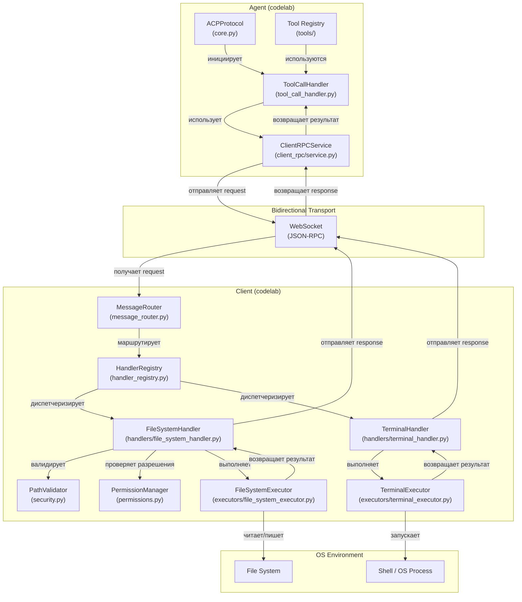
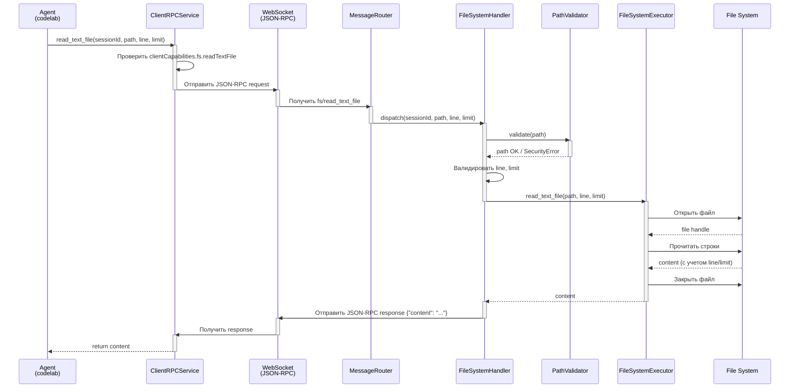
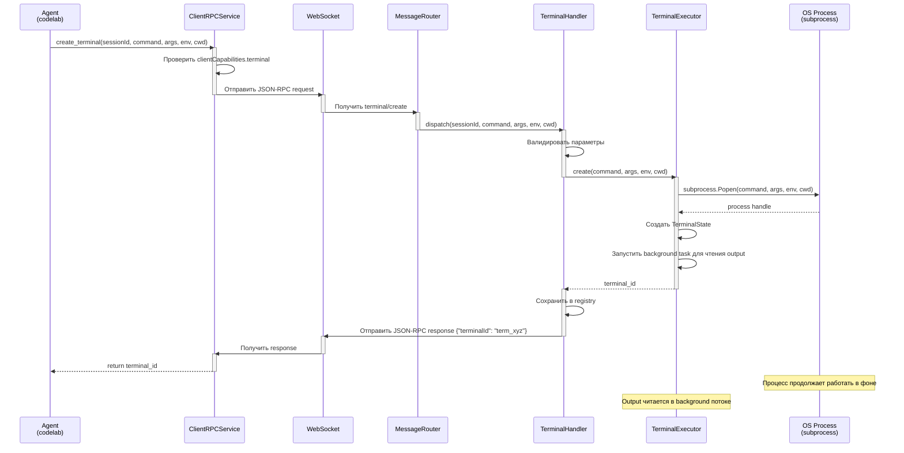
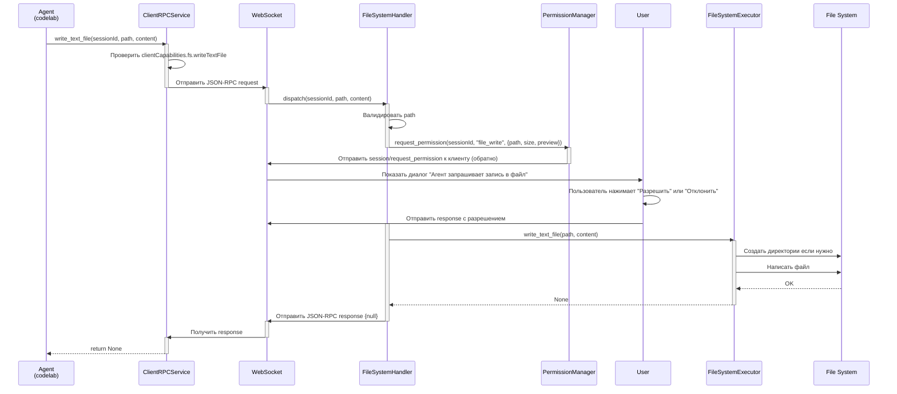
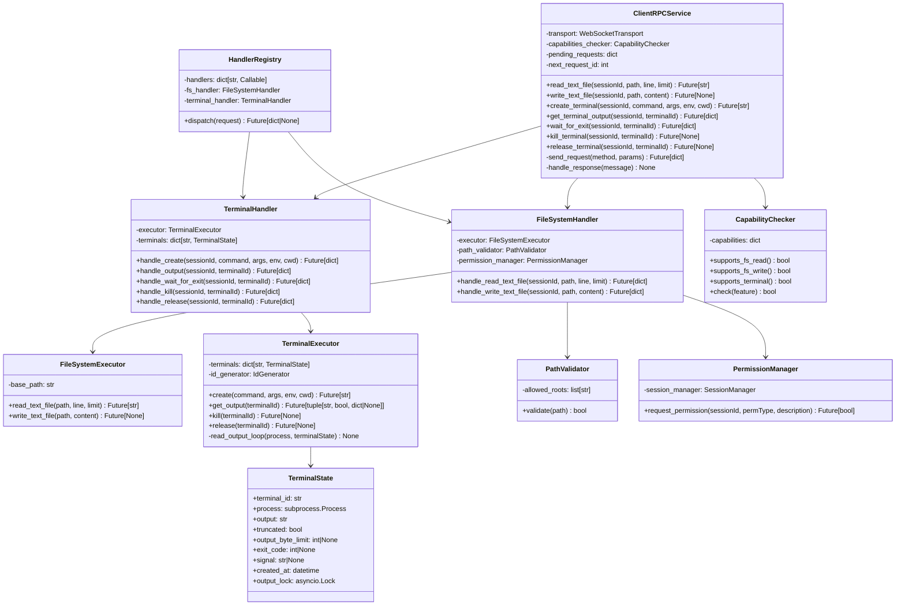

# Архитектура клиентских методов (File System и Terminal)

## Содержание

1. [Обзор](#обзор)
2. [Направление вызовов: Agent → Client](#направление-вызовов-agent--client)
3. [File System методы](#file-system-методы)
4. [Terminal методы](#terminal-методы)
5. [Архитектура реализации](#архитектура-реализации)
6. [Bidirectional RPC механизм](#bidirectional-rpc-механизм)
7. [Безопасность и разрешения](#безопасность-и-разрешения)
8. [Обработка ошибок](#обработка-ошибок)
9. [Интеграция с Tool Calls](#интеграция-с-tool-calls)
10. [Диаграммы архитектуры](#диаграммы-архитектуры)
11. [План реализации](#план-реализации)
12. [Примеры использования](#примеры-использования)

---

## Обзор

### Назначение

Документ описывает архитектуру реализации **клиентских методов** (File System и Terminal) согласно спецификации ACP протокола. Эти методы позволяют **агентам получать доступ к локальной среде клиента** для чтения файлов, записи файлов и выполнения shell команд.

### Ключевое архитектурное направление: Agent → Client

**КРИТИЧЕСКИ ВАЖНО:** fs/* и terminal/* методы вызываются **агентом на клиенте**, а не клиентом на агенте.

- **Инициатор:** Agent (codelab)
- **Исполнитель:** Client (codelab)
- **Транспорт:** Bidirectional JSON-RPC
- **Место выполнения:** Client Environment (локальная машина пользователя)

### Назначение методов

#### File System методы

Предоставляют агентам доступ к файловой системе клиента:
- `fs/read_text_file` — чтение содержимого текстовых файлов (включая несохраненные изменения в редакторе)
- `fs/write_text_file` — запись и обновление текстовых файлов в файловой системе клиента

#### Terminal методы

Позволяют агентам выполнять shell команды в окружении клиента:
- `terminal/create` — запуск нового процесса в терминале
- `terminal/output` — получение текущего output без ожидания завершения
- `terminal/wait_for_exit` — ожидание завершения процесса
- `terminal/kill` — остановка процесса без освобождения ресурсов
- `terminal/release` — завершение процесса и освобождение всех ресурсов

### Ключевые требования

1. **Проверка возможностей (Capability Check)** — агент должен проверить `clientCapabilities` перед использованием методов
2. **Асинхронное выполнение** — команды выполняются в фоне, агент продолжает работать
3. **Управление ресурсами** — явное завершение и освобождение терминалов
4. **Потоковая доставка output** — для встраивания в UI в реальном времени
5. **Безопасность** — path traversal защита, проверка разрешений
6. **Полное соответствие спецификации ACP** — все примеры и параметры из [09-File System.md](../Agent%20Client%20Protocol/protocol/09-File System.md) и [10-Terminal.md](../Agent%20Client%20Protocol/protocol/10-Terminal.md)

---

## Направление вызовов: Agent → Client

### Поток управления

```
Agent (codelab)
    ↓
    └─→ ClientRPCService
            ↓
            └─→ Bidirectional JSON-RPC Transport
                    ↓
                    └─→ Client (codelab)
                            ↓
                            └─→ Handler Registry
                                    ↓
                                    ├─→ FileSystemHandler
                                    │       ↓
                                    │       └─→ FileSystemExecutor
                                    │               ↓
                                    │               └─→ File System / Editor
                                    │
                                    └─→ TerminalHandler
                                            ↓
                                            └─→ TerminalExecutor
                                                    ↓
                                                    └─→ Shell / OS Process
                                    ↓
                            Handler Response
                                    ↓
                    ← ← ← JSON-RPC Response ← ← ←
                    ↓
        ClientRPCService получает результат
                    ↓
        Агент продолжает обработку
```

### Инициация

Агент инициирует запрос на основе:
1. Проверки `clientCapabilities` при инициализации сессии
2. Необходимости доступа к локальной среде для выполнения tool call
3. Запроса на чтение файла (для анализа кода, конфигураций)
4. Запроса на выполнение shell команды (для build, tests, scripts)

### Отличие от Tool Calls

- **Tool Calls:** Client объявляет, какие инструменты доступны → Agent вызывает → Client выполняет
- **fs/terminal методы:** Agent запрашивает доступ к **локальной окружению** → Client предоставляет доступ через RPC методы

---

## File System методы

### Обзор

Два основных метода для работы с текстовыми файлами на стороне клиента:
1. **fs/read_text_file** — чтение файлов с поддержкой частичного чтения (line, limit)
2. **fs/write_text_file** — запись/обновление файлов с запросом разрешения

### 1. fs/read_text_file

#### Назначение

Чтение содержимого текстовых файлов из файловой системы клиента, включая несохраненные изменения в редакторе.

#### Сигнатура запроса

```json
{
  "jsonrpc": "2.0",
  "id": 3,
  "method": "fs/read_text_file",
  "params": {
    "sessionId": "sess_abc123def456",
    "path": "/home/user/project/src/main.py",
    "line": 10,
    "limit": 50
  }
}
```

#### Параметры

| Параметр | Тип | Обязателен | Описание |
|----------|-----|-----------|---------|
| `sessionId` | SessionId | Да | ID сессии для трассировки контекста |
| `path` | string | Да | Абсолютный путь к файлу на клиенте |
| `line` | number | Нет | Номер строки для начала чтения (1-based). Если не задан, начинается с начала файла |
| `limit` | number | Нет | Максимальное количество строк для чтения. Если не задан, читается весь файл |

#### Валидация параметров

Клиент должен валидировать:
1. `sessionId` — должен быть валидным ID существующей сессии
2. `path` — должен быть абсолютным путем (не содержать относительные компоненты `../`)
3. `line` — если задан, должен быть ≥ 1
4. `limit` — если задан, должен быть ≥ 1
5. **Path traversal защита** — путь не должен выходить за пределы санкционированных директорий

#### Требования к разрешениям

- **Capability check:** `clientCapabilities.fs.readTextFile == true`
- **Разрешение пользователя:** опционально, в зависимости от конфигурации агента
- **Ограничения директорий:** агент может быть ограничен определенными директориями (если настроены ограничения)

#### Сигнатура ответа

```json
{
  "jsonrpc": "2.0",
  "id": 3,
  "result": {
    "content": "def hello_world():\n    print('Hello, world!')\n"
  }
}
```

#### Поля ответа

| Поле | Тип | Описание |
|------|-----|---------|
| `content` | string | Содержимое файла (полное или частичное в зависимости от line/limit) |

#### Примеры использования

**Пример 1: Чтение всего файла**

```json
{
  "jsonrpc": "2.0",
  "id": 1,
  "method": "fs/read_text_file",
  "params": {
    "sessionId": "sess_123",
    "path": "/home/user/project/README.md"
  }
}
```

**Пример 2: Чтение 50 строк начиная со строки 10**

```json
{
  "jsonrpc": "2.0",
  "id": 2,
  "method": "fs/read_text_file",
  "params": {
    "sessionId": "sess_123",
    "path": "/home/user/project/src/main.py",
    "line": 10,
    "limit": 50
  }
}
```

### 2. fs/write_text_file

#### Назначение

Запись или обновление текстовых файлов в файловой системе клиента. Клиент должен создать файл, если он не существует.

#### Сигнатура запроса

```json
{
  "jsonrpc": "2.0",
  "id": 4,
  "method": "fs/write_text_file",
  "params": {
    "sessionId": "sess_abc123def456",
    "path": "/home/user/project/config.json",
    "content": "{\n  \"debug\": true,\n  \"version\": \"1.0.0\"\n}"
  }
}
```

#### Параметры

| Параметр | Тип | Обязателен | Описание |
|----------|-----|-----------|---------|
| `sessionId` | SessionId | Да | ID сессии для трассировки контекста |
| `path` | string | Да | Абсолютный путь к файлу на клиенте. Клиент создает файл, если его нет |
| `content` | string | Да | Текстовое содержимое для записи |

#### Валидация параметров

Клиент должен валидировать:
1. `sessionId` — должен быть валидным ID существующей сессии
2. `path` — должен быть абсолютным путем
3. **Path traversal защита** — путь не должен выходить за пределы санкционированных директорий
4. `content` — должна быть строка (может быть пустой)

#### Требования к разрешениям

- **Capability check:** `clientCapabilities.fs.writeTextFile == true`
- **Permission request:** клиент ДОЛЖЕН запросить явное разрешение пользователя перед записью файла
  - Использовать [`session/request_permission`](../Agent%20Client%20Protocol/protocol/03-Session%20Setup.md#requesting-permission) для запроса разрешения
  - Отправить permission request с деталями файла, размера, пути
  - Ждать ответа пользователя перед выполнением записи
- **Ограничения директорий:** агент может быть ограничен определенными директориями

#### Сигнатура ответа

```json
{
  "jsonrpc": "2.0",
  "id": 4,
  "result": null
}
```

При успешной записи клиент возвращает `null` в `result`.

#### Обработка ошибок

Если путь не валиден или клиент не может создать директории, клиент должен вернуть JSON-RPC error:

```json
{
  "jsonrpc": "2.0",
  "id": 4,
  "error": {
    "code": -32603,
    "message": "Internal error",
    "data": {
      "reason": "Cannot create directory structure",
      "path": "/home/user/project/nested/deep/dir/config.json"
    }
  }
}
```

---

## Terminal методы

### Обзор

Пять методов для управления терминальными процессами:
1. **terminal/create** — запуск новой команды
2. **terminal/output** — получение текущего output
3. **terminal/wait_for_exit** — ожидание завершения
4. **terminal/kill** — остановка процесса
5. **terminal/release** — освобождение ресурсов

### 1. terminal/create

#### Назначение

Запуск новой команды в терминале и возвращение terminal ID для последующего управления.

#### Сигнатура запроса

```json
{
  "jsonrpc": "2.0",
  "id": 5,
  "method": "terminal/create",
  "params": {
    "sessionId": "sess_abc123def456",
    "command": "npm",
    "args": ["test", "--coverage"],
    "env": [
      {
        "name": "NODE_ENV",
        "value": "test"
      }
    ],
    "cwd": "/home/user/project",
    "outputByteLimit": 1048576
  }
}
```

#### Параметры

| Параметр | Тип | Обязателен | Описание |
|----------|-----|-----------|---------|
| `sessionId` | SessionId | Да | ID сессии для трассировки контекста |
| `command` | string | Да | Команда для выполнения (например, `npm`, `python`, `sh`) |
| `args` | string[] | Нет | Массив аргументов команды |
| `env` | EnvVariable[] | Нет | Переменные окружения (массив объектов `{name, value}`) |
| `cwd` | string | Нет | Рабочая директория для команды (абсолютный путь) |
| `outputByteLimit` | number | Нет | Максимальное количество байт output для удержания в памяти |

#### Требования к разрешениям

- **Capability check:** `clientCapabilities.terminal == true`
- **Permission request:** клиент МОЖЕТ запросить разрешение пользователя перед выполнением (опционально, зависит от конфигурации)

#### Сигнатура ответа

```json
{
  "jsonrpc": "2.0",
  "id": 5,
  "result": {
    "terminalId": "term_xyz789"
  }
}
```

#### Поля ответа

| Поле | Тип | Описание |
|------|-----|---------|
| `terminalId` | string | Уникальный ID терминала для последующих операций |

**Важно:** Клиент возвращает terminal ID **сразу же**, не ожидая завершения команды. Команда выполняется в фоне.

### 2. terminal/output

#### Назначение

Получение текущего output терминала без ожидания завершения команды. Позволяет агенту получать промежуточные результаты в реальном времени.

#### Сигнатура запроса

```json
{
  "jsonrpc": "2.0",
  "id": 6,
  "method": "terminal/output",
  "params": {
    "sessionId": "sess_abc123def456",
    "terminalId": "term_xyz789"
  }
}
```

#### Параметры

| Параметр | Тип | Обязателен | Описание |
|----------|-----|-----------|---------|
| `sessionId` | SessionId | Да | ID сессии |
| `terminalId` | string | Да | ID терминала (полученный из terminal/create) |

#### Сигнатура ответа

```json
{
  "jsonrpc": "2.0",
  "id": 6,
  "result": {
    "output": "Running tests...\n✓ All tests passed (42 total)\n",
    "truncated": false,
    "exitStatus": {
      "exitCode": 0,
      "signal": null
    }
  }
}
```

#### Поля ответа

| Поле | Тип | Описание |
|------|-----|---------|
| `output` | string | Текущий output терминала |
| `truncated` | boolean | Был ли output обрезан из-за `outputByteLimit` |
| `exitStatus` | TerminalExitStatus | Только если команда завершена. Содержит `exitCode` и `signal` |

### 3. terminal/wait_for_exit

#### Назначение

Ожидание завершения команды и получение final status (exit code, signal).

#### Сигнатура запроса

```json
{
  "jsonrpc": "2.0",
  "id": 7,
  "method": "terminal/wait_for_exit",
  "params": {
    "sessionId": "sess_abc123def456",
    "terminalId": "term_xyz789"
  }
}
```

#### Параметры

| Параметр | Тип | Обязателен | Описание |
|----------|-----|-----------|---------|
| `sessionId` | SessionId | Да | ID сессии |
| `terminalId` | string | Да | ID терминала |

#### Сигнатура ответа

```json
{
  "jsonrpc": "2.0",
  "id": 7,
  "result": {
    "exitCode": 0,
    "signal": null
  }
}
```

#### Поля ответа

| Поле | Тип | Описание |
|------|-----|---------|
| `exitCode` | number | Код выхода процесса (может быть null если завершена сигналом) |
| `signal` | string | Сигнал, который завершил процесс (может быть null если нормальный выход) |

### 4. terminal/kill

#### Назначение

Остановка процесса через отправку SIGTERM (или другого сигнала). Терминал остается валидным и может быть использован для получения output.

#### Сигнатура запроса

```json
{
  "jsonrpc": "2.0",
  "id": 8,
  "method": "terminal/kill",
  "params": {
    "sessionId": "sess_abc123def456",
    "terminalId": "term_xyz789"
  }
}
```

#### Параметры

| Параметр | Тип | Обязателен | Описание |
|----------|-----|-----------|---------|
| `sessionId` | SessionId | Да | ID сессии |
| `terminalId` | string | Да | ID терминала |

#### Сигнатура ответа

```json
{
  "jsonrpc": "2.0",
  "id": 8,
  "result": null
}
```

#### Важные замечания

- Терминал остается валидным после kill
- Можно вызвать `terminal/output` для получения final output
- Можно вызвать `terminal/wait_for_exit` для получения exit status
- **ОБЯЗАТЕЛЬНО** вызвать `terminal/release` когда процесс больше не нужен

### 5. terminal/release

#### Назначение

Завершение процесса (если еще работает) и освобождение всех ресурсов. После release терминал ID больше не валиден.

#### Сигнатура запроса

```json
{
  "jsonrpc": "2.0",
  "id": 9,
  "method": "terminal/release",
  "params": {
    "sessionId": "sess_abc123def456",
    "terminalId": "term_xyz789"
  }
}
```

#### Параметры

| Параметр | Тип | Обязателен | Описание |
|----------|-----|-----------|---------|
| `sessionId` | SessionId | Да | ID сессии |
| `terminalId` | string | Да | ID терминала |

#### Сигнатура ответа

```json
{
  "jsonrpc": "2.0",
  "id": 9,
  "result": null
}
```

#### Важные замечания

- Если команда еще работает, она будет принудительно завершена (SIGKILL)
- Все ресурсы (процесс, буферы) освобождаются
- Терминал ID становится невалидным
- Если терминал был встроен в tool call, UI может продолжить отображать его output

---

## Архитектура реализации

### Принципы архитектуры

1. **Layered Architecture** — разделение на слои (RPC Service, Handlers, Executors, OS)
2. **Bidirectional Communication** — поддержка рпс в обе стороны
3. **Resource Management** — явное управление жизненным циклом ресурсов (терминалы)
4. **Security First** — защита на каждом слое (validation, permission, path traversal)
5. **Error Handling** — структурированная обработка ошибок с JSON-RPC error codes

### Сторона агента (codelab)

#### ClientRPCService

**Назначение:** Инициирование RPC вызовов на клиенте для доступа к локальной среде.

**Местоположение:** `codelab/src/codelab/server/client_rpc/service.py` (будет создано)

**Ответственность:**
- Инициирование RPC запросов (fs/* и terminal/* методы)
- Проверка `clientCapabilities` перед вызовом
- Обработка RPC responses и ошибок
- Трассировка вызовов через sessionId
- Интеграция с Tool Call Handler

**Интеграция:**
```python
class ClientRPCService:
    """Сервис для вызова методов на клиенте."""
    
    async def read_text_file(
        self,
        session_id: str,
        path: str,
        line: int | None = None,
        limit: int | None = None
    ) -> str:
        """Чтение текстового файла с клиента."""
        # 1. Проверить clientCapabilities.fs.readTextFile
        # 2. Сформировать JSON-RPC request
        # 3. Отправить через transport.send_request()
        # 4. Дождаться response
        # 5. Вернуть content или выбросить исключение
        
    async def write_text_file(
        self,
        session_id: str,
        path: str,
        content: str
    ) -> None:
        """Запись текстового файла на клиенте (с запросом разрешения)."""
        # 1. Проверить clientCapabilities.fs.writeTextFile
        # 2. Запросить разрешение через session/request_permission
        # 3. Дождаться разрешения от пользователя
        # 4. Сформировать JSON-RPC request
        # 5. Отправить и дождаться response
```

#### Capability Check

```python
def check_capability(
    self,
    session: SessionState,
    capability_path: str  # "fs.readTextFile", "terminal", и т.д.
) -> bool:
    """Проверить, поддерживает ли клиент функцию."""
    caps = session.client_capabilities
    # Проверить nested capability через дот-нотацию
    # Вернуть True/False
```

### Сторона клиента (codelab)

#### Общая архитектура

```
codelab/src/codelab/client/infrastructure/
├── handler_registry.py  (расширить для RPC handlers)
├── transport.py         (bidirectional support)
├── services/
│   ├── acp_transport_service.py  (расширить)
│   ├── background_receive_loop.py (расширить)
│   └── message_router.py          (расширить)
└── handlers/            (новая директория)
    ├── __init__.py
    ├── file_system_handler.py
    └── terminal_handler.py

codelab/src/codelab/client/infrastructure/executors/ (новая директория)
├── __init__.py
├── file_system_executor.py
└── terminal_executor.py
```

#### FileSystemHandler

**Назначение:** Обработка входящих fs/* запросов от агента.

**Местоположение:** `codelab/src/codelab/client/infrastructure/handlers/file_system_handler.py`

**Ответственность:**
- Обработка `fs/read_text_file` requests
- Обработка `fs/write_text_file` requests
- Валидация параметров (path, line, limit)
- Path traversal защита
- Делегирование выполнения FileSystemExecutor
- Формирование JSON-RPC responses/errors

**Интеграция:**
```python
class FileSystemHandler:
    """Обработчик File System методов."""
    
    def __init__(self, executor: FileSystemExecutor):
        self.executor = executor
    
    async def handle_read_text_file(
        self,
        session_id: str,
        path: str,
        line: int | None = None,
        limit: int | None = None
    ) -> dict:
        """Обработка fs/read_text_file."""
        # 1. Валидировать sessionId
        # 2. Валидировать path (path traversal защита)
        # 3. Валидировать line, limit
        # 4. Вызвать executor.read_text_file()
        # 5. Вернуть {"content": ...} или error
    
    async def handle_write_text_file(
        self,
        session_id: str,
        path: str,
        content: str
    ) -> dict:
        """Обработка fs/write_text_file."""
        # 1. Валидировать параметры
        # 2. Запросить разрешение пользователя
        # 3. Вызвать executor.write_text_file()
        # 4. Вернуть {null} или error
```

#### FileSystemExecutor

**Назначение:** Выполнение файловых операций на локальной файловой системе.

**Местоположение:** `codelab/src/codelab/client/infrastructure/executors/file_system_executor.py`

**Ответственность:**
- Чтение файлов (с поддержкой line/limit)
- Запись файлов (создание директорий если нужно)
- Интеграция с редактором (получение несохраненных изменений)
- Обработка исключений файловой системы

**Интеграция:**
```python
class FileSystemExecutor:
    """Исполнитель файловых операций."""
    
    async def read_text_file(
        self,
        path: str,
        line: int | None = None,
        limit: int | None = None
    ) -> str:
        """Прочитать текстовый файл."""
        # 1. Проверить существование файла
        # 2. Открыть и прочитать
        # 3. Если line/limit — обработать
        # 4. Вернуть content или выбросить исключение
    
    async def write_text_file(
        self,
        path: str,
        content: str
    ) -> None:
        """Написать текстовый файл."""
        # 1. Создать директории если нужно
        # 2. Написать файл
        # 3. Уведомить редактор об изменении (если интегрирован)
```

#### TerminalHandler

**Назначение:** Обработка входящих terminal/* запросов от агента.

**Местоположение:** `codelab/src/codelab/client/infrastructure/handlers/terminal_handler.py`

**Ответственность:**
- Обработка `terminal/create` requests
- Обработка `terminal/output` requests
- Обработка `terminal/wait_for_exit` requests
- Обработка `terminal/kill` requests
- Обработка `terminal/release` requests
- Управление registry терминалов
- Валидация terminalId
- Формирование responses/errors

**Интеграция:**
```python
class TerminalHandler:
    """Обработчик Terminal методов."""
    
    def __init__(self, executor: TerminalExecutor):
        self.executor = executor
        self.terminals: dict[str, TerminalState] = {}
    
    async def handle_create(
        self,
        session_id: str,
        command: str,
        args: list[str] | None = None,
        env: list[dict] | None = None,
        cwd: str | None = None,
        output_byte_limit: int | None = None
    ) -> dict:
        """Обработка terminal/create."""
        # 1. Валидировать параметры
        # 2. Вызвать executor.create()
        # 3. Сохранить TerminalState в registry
        # 4. Вернуть {"terminalId": ...}
    
    async def handle_output(
        self,
        session_id: str,
        terminal_id: str
    ) -> dict:
        """Обработка terminal/output."""
        # 1. Найти terminal по ID
        # 2. Вызвать executor.get_output()
        # 3. Вернуть {"output": ..., "truncated": ..., "exitStatus": ...}
    
    # ... аналогично для wait_for_exit, kill, release
```

#### TerminalExecutor

**Назначение:** Выполнение и управление shell процессами.

**Местоположение:** `codelab/src/codelab/client/infrastructure/executors/terminal_executor.py`

**Ответственность:**
- Запуск shell процессов (subprocess.Popen)
- Захват output в реальном времени
- Управление жизненным циклом процесса
- Отправка сигналов (SIGTERM, SIGKILL)
- Управление byte limit output
- Получение exit code и signal

**Интеграция:**
```python
class TerminalExecutor:
    """Исполнитель терминальных команд."""
    
    async def create(
        self,
        command: str,
        args: list[str] | None = None,
        env: dict | None = None,
        cwd: str | None = None,
        output_byte_limit: int | None = None
    ) -> str:
        """Создать терминал и запустить команду."""
        # 1. Подготовить environment
        # 2. Запустить subprocess
        # 3. Создать TerminalState
        # 4. Начать читать output в фоновом потоке
        # 5. Вернуть terminal_id
    
    async def get_output(
        self,
        terminal_id: str
    ) -> tuple[str, bool, dict | None]:
        """Получить текущий output и статус."""
        # 1. Найти terminal по ID
        # 2. Вернуть (output, truncated, exit_status)
    
    async def kill(self, terminal_id: str) -> None:
        """Остановить процесс (SIGTERM)."""
        # 1. Найти process
        # 2. Отправить SIGTERM
        # 3. Дождаться завершения (с timeout)
        # 4. Если не завершится — SIGKILL
    
    async def release(self, terminal_id: str) -> None:
        """Освободить ресурсы."""
        # 1. Kill если еще работает
        # 2. Закрыть файловые дескрипторы
        # 3. Удалить из registry
```

#### TerminalState

```python
@dataclass
class TerminalState:
    """Состояние терминала."""
    terminal_id: str
    process: asyncio.subprocess.Process
    output: str
    truncated: bool
    output_byte_limit: int | None
    exit_code: int | None = None
    signal: str | None = None
    created_at: datetime = field(default_factory=datetime.now)
    output_lock: asyncio.Lock = field(default_factory=asyncio.Lock)
```

---

## Bidirectional RPC механизм

### Поток данных

Текущая реализация поддерживает **Client → Server RPC** (клиент запрашивает у агента). Для **Agent → Client RPC** нужна двусторонняя поддержка:

```
Server                          Transport                       Client
  ├─ ACPProtocol                  (WebSocket)                   ├─ MessageRouter
  │   ├─ handlers/                 bidirectional                 ├─ HandlerRegistry
  │   │   ├─ session.py            ↓                            │   ├─ fs/read_text_file
  │   │   ├─ auth.py               ↑                            │   ├─ fs/write_text_file
  │   │   ├─ client_rpc_handler.py (новый)                     │   ├─ terminal/create
  │   │   └─ ...                   (новый flow)                │   └─ ...
  │   └─ ...                                                     └─ ...
  │
  ClientRPCService (новый)
  └─ transport.send_request()  ───────────→  handler_registry.dispatch()
                                            (server → client)
```

### Механизм маршрутизации

#### На стороне сервера (codelab)

```python
class ClientRPCHandler:
    """Обработчик для отправки RPC запросов на клиент."""
    
    def __init__(self, protocol: ACPProtocol):
        self.protocol = protocol
        self.pending_requests: dict[int, asyncio.Future] = {}
        self.next_request_id = 1000  # Отличать от обычных request IDs
    
    async def send_request(
        self,
        method: str,
        params: dict,
        session_id: str
    ) -> dict:
        """Отправить RPC request на клиент и дождаться ответа."""
        request_id = self.next_request_id
        self.next_request_id += 1
        
        request = {
            "jsonrpc": "2.0",
            "id": request_id,
            "method": method,
            "params": params
        }
        
        # Отправить через transport
        await self.protocol.transport.send(json.dumps(request))
        
        # Создать Future для ответа
        future = asyncio.Future()
        self.pending_requests[request_id] = future
        
        # Ждать ответ с timeout
        return await asyncio.wait_for(future, timeout=30.0)
    
    def handle_client_response(
        self,
        message: dict
    ) -> None:
        """Обработать response с клиента."""
        request_id = message.get("id")
        if request_id in self.pending_requests:
            future = self.pending_requests.pop(request_id)
            if "result" in message:
                future.set_result(message["result"])
            elif "error" in message:
                future.set_exception(RpcError(message["error"]))
```

#### На стороне клиента (codelab)

```python
class HandlerRegistry:
    """Регистр обработчиков для входящих запросов от сервера."""
    
    def __init__(self):
        self.handlers: dict[str, Callable] = {
            "fs/read_text_file": self.handle_fs_read,
            "fs/write_text_file": self.handle_fs_write,
            "terminal/create": self.handle_terminal_create,
            "terminal/output": self.handle_terminal_output,
            "terminal/wait_for_exit": self.handle_terminal_wait,
            "terminal/kill": self.handle_terminal_kill,
            "terminal/release": self.handle_terminal_release,
        }
    
    async def dispatch(
        self,
        request: dict
    ) -> dict | None:
        """Обработать входящий request."""
        method = request.get("method")
        params = request.get("params", {})
        request_id = request.get("id")
        
        # Найти обработчик
        handler = self.handlers.get(method)
        if not handler:
            return {
                "jsonrpc": "2.0",
                "id": request_id,
                "error": {
                    "code": -32601,
                    "message": f"Method not found: {method}"
                }
            }
        
        try:
            result = await handler(**params)
            return {
                "jsonrpc": "2.0",
                "id": request_id,
                "result": result
            }
        except Exception as e:
            return {
                "jsonrpc": "2.0",
                "id": request_id,
                "error": {
                    "code": -32603,
                    "message": str(e),
                    "data": {"exception_type": type(e).__name__}
                }
            }
```

### Message Router

```python
class MessageRouter:
    """Маршрутизирует входящие сообщения."""
    
    async def route_message(
        self,
        message: dict
    ) -> None:
        """Маршрутировать сообщение в нужный обработчик."""
        
        # Проверить, это response или request
        if "method" in message and "id" in message:
            # Request от сервера
            response = await self.handler_registry.dispatch(message)
            if response:
                await self.transport.send(json.dumps(response))
        
        elif "result" in message or "error" in message:
            # Response на наш request
            await self.client_rpc_service.handle_response(message)
```

---

## Безопасность и разрешения

### Path Traversal защита

Клиент должен защищать файловую систему от доступа к файлам вне разрешенных директорий.

```python
class PathValidator:
    """Валидатор путей с защитой от path traversal."""
    
    def __init__(self, allowed_roots: list[str] | None = None):
        # allowed_roots по умолчанию — project directory
        self.allowed_roots = allowed_roots or [os.getcwd()]
    
    def validate(self, path: str) -> bool:
        """Проверить, находится ли path в разрешенных директориях."""
        # 1. Нормализировать path (разрешить симlinks)
        abs_path = os.path.abspath(path)
        real_path = os.path.realpath(abs_path)
        
        # 2. Проверить, что real_path внутри allowed_roots
        for root in self.allowed_roots:
            real_root = os.path.realpath(root)
            if real_path.startswith(real_root + os.sep) or real_path == real_root:
                return True
        
        return False
```

### Permission Management

#### Для fs/write_text_file

Клиент должен запросить явное разрешение пользователя перед записью файла:

```python
async def handle_write_text_file(
    self,
    session_id: str,
    path: str,
    content: str
) -> dict:
    """Обработка fs/write_text_file с запросом разрешения."""
    
    # 1. Валидировать параметры
    if not self.path_validator.validate(path):
        raise SecurityError(f"Path not allowed: {path}")
    
    # 2. Запросить разрешение у пользователя через session/request_permission
    permission_granted = await self.permission_manager.request_permission(
        session_id=session_id,
        permission_type="file_write",
        description=f"Agent requests to write file: {path}",
        details={
            "path": path,
            "file_size": len(content),
            "preview": content[:200] + "..." if len(content) > 200 else content
        }
    )
    
    if not permission_granted:
        raise PermissionDeniedError("User denied permission to write file")
    
    # 3. Выполнить запись
    await self.executor.write_text_file(path, content)
    
    return None
```

#### Для terminal/create

Опционально запросить разрешение перед выполнением команды:

```python
async def handle_create(
    self,
    session_id: str,
    command: str,
    args: list[str] | None = None,
    **kwargs
) -> dict:
    """Обработка terminal/create с опциональным запросом разрешения."""
    
    # 1. Логировать команду
    full_command = f"{command} {' '.join(args or [])}"
    logger.info(f"Terminal create requested: {full_command}")
    
    # 2. Опционально запросить разрешение (зависит от конфигурации)
    if self.config.get("require_terminal_permission"):
        permission_granted = await self.permission_manager.request_permission(
            session_id=session_id,
            permission_type="terminal_execute",
            description=f"Agent requests to execute command: {full_command}",
            details={"command": command, "args": args}
        )
        if not permission_granted:
            raise PermissionDeniedError("User denied permission to execute command")
    
    # 3. Создать терминал
    terminal_id = await self.executor.create(command, args, **kwargs)
    return {"terminalId": terminal_id}
```

### Capability Check

```python
class CapabilityChecker:
    """Проверка возможностей клиента."""
    
    def __init__(self, client_capabilities: dict):
        self.capabilities = client_capabilities
    
    def supports_fs_read(self) -> bool:
        return self.capabilities.get("fs", {}).get("readTextFile", False)
    
    def supports_fs_write(self) -> bool:
        return self.capabilities.get("fs", {}).get("writeTextFile", False)
    
    def supports_terminal(self) -> bool:
        return self.capabilities.get("terminal", False)
    
    def check(self, feature: str) -> bool:
        """Проверить поддержку функции."""
        parts = feature.split(".")
        value = self.capabilities
        for part in parts:
            value = value.get(part, {})
        return bool(value)
```

---

## Обработка ошибок

### JSON-RPC Error Codes

| Code | Название | Описание |
|------|----------|---------|
| -32700 | Parse error | Ошибка парсинга JSON |
| -32600 | Invalid Request | Некорректный JSON-RPC запрос |
| -32601 | Method not found | Метод не существует |
| -32602 | Invalid params | Некорректные параметры |
| -32603 | Internal error | Внутренняя ошибка сервера |
| -32000 до -32099 | Server error | Зарезервировано для server errors |

### Специфичные ошибки для fs/terminal методов

```python
class FileNotFoundError(RpcError):
    """Файл не найден."""
    code = -32603
    
class PathTraversalError(RpcError):
    """Попытка access вне разрешенных директорий."""
    code = -32603
    
class PermissionDeniedError(RpcError):
    """Разрешение отклонено пользователем."""
    code = -32603
    
class TerminalNotFoundError(RpcError):
    """Терминал с таким ID не найден."""
    code = -32603
    
class TerminalAlreadyExitedError(RpcError):
    """Терминал уже завершен."""
    code = -32603
```

### Примеры ошибок

**Пример 1: Файл не найден**

```json
{
  "jsonrpc": "2.0",
  "id": 3,
  "error": {
    "code": -32603,
    "message": "File not found",
    "data": {
      "path": "/home/user/project/nonexistent.py",
      "reason": "File does not exist"
    }
  }
}
```

**Пример 2: Path traversal попытка**

```json
{
  "jsonrpc": "2.0",
  "id": 4,
  "error": {
    "code": -32603,
    "message": "Path not allowed",
    "data": {
      "path": "/etc/passwd",
      "reason": "Path is outside allowed roots"
    }
  }
}
```

**Пример 3: Разрешение отклонено**

```json
{
  "jsonrpc": "2.0",
  "id": 5,
  "error": {
    "code": -32603,
    "message": "Permission denied",
    "data": {
      "reason": "User rejected file write permission",
      "permission_type": "file_write"
    }
  }
}
```

---

## Интеграция с Tool Calls

### Использование fs/* внутри tool calls

Агент использует fs/* методы **внутри выполнения tool call** для доступа к локальной среде:

```python
class ToolCallExecutor:
    """Выполнитель tool calls с поддержкой fs/terminal методов."""
    
    async def execute_tool_call(
        self,
        tool_call: ToolCall,
        session: SessionState
    ) -> ToolCallResult:
        """Выполнить tool call с доступом к fs/terminal."""
        
        # 1. Инициализировать tool
        tool = self.registry.get_tool(tool_call.name)
        
        # 2. Выполнить (tool может использовать ClientRPCService)
        result = await tool.execute(
            **tool_call.params,
            # Передать сервисы
            client_rpc=self.client_rpc_service,
            session=session
        )
        
        return result
```

**Пример:** tool для чтения файла и анализа

```python
class CodeAnalyzerTool:
    """Tool для анализа исходного кода."""
    
    async def execute(
        self,
        file_path: str,
        client_rpc: ClientRPCService,
        session: SessionState,
        **kwargs
    ) -> dict:
        """Прочитать и проанализировать файл."""
        
        # Использовать fs/read_text_file
        content = await client_rpc.read_text_file(
            session_id=session.id,
            path=file_path
        )
        
        # Анализировать содержимое
        analysis = {
            "lines": len(content.split('\n')),
            "language": self.detect_language(file_path),
            "complexity": self.calculate_complexity(content)
        }
        
        return analysis
```

### Встраивание terminal output в tool calls

Агент может встроить live terminal output в tool call для показа прогресса пользователю:

```python
async def execute_build_tool(
    self,
    command: str,
    client_rpc: ClientRPCService,
    session: SessionState
) -> dict:
    """Выполнить build с live output в UI."""
    
    # 1. Создать терминал
    term_result = await client_rpc.create_terminal(
        session_id=session.id,
        command="npm",
        args=["run", "build"]
    )
    terminal_id = term_result["terminalId"]
    
    try:
        # 2. Встроить терминал в tool call
        await self.update_tool_call(
            session.id,
            tool_call_id="call_123",
            status="in_progress",
            content=[
                {"type": "text", "text": "Building project..."},
                {"type": "terminal", "terminalId": terminal_id}
            ]
        )
        
        # 3. Ждать завершения
        exit_status = await client_rpc.wait_for_exit(
            session_id=session.id,
            terminalId=terminal_id
        )
        
        # 4. Получить final output
        output_result = await client_rpc.get_terminal_output(
            session_id=session.id,
            terminalId=terminal_id
        )
        
        return {
            "success": exit_status["exitCode"] == 0,
            "output": output_result["output"],
            "exit_code": exit_status["exitCode"]
        }
    
    finally:
        # 5. Освободить ресурсы
        await client_rpc.release_terminal(
            session_id=session.id,
            terminalId=terminal_id
        )
```

---

## Диаграммы архитектуры

### Диаграмма 1: Component Diagram (исправленная архитектура)



### Диаграмма 2: Sequence Diagram - File Read (Agent → Client)



### Диаграмма 3: Sequence Diagram - Terminal Create (Agent → Client)



### Диаграмма 4: Sequence Diagram - File Write with Permission



### Диаграмма 5: State Diagram - Terminal Lifecycle

```mermaid
stateDiagram-v2
    [*] --> CREATED: terminal/create
    
    CREATED --> RUNNING: Процесс начал работать
    
    RUNNING --> RUNNING: terminal/output<br/>terminal/wait_for_exit (blocking)
    
    RUNNING --> EXITED: Процесс завершился<br/>(exit code или signal)
    
    RUNNING --> EXITED: terminal/kill<br/>(SIGTERM)
    
    EXITED --> EXITED: terminal/output<br/>terminal/wait_for_exit
    
    EXITED --> RELEASED: terminal/release
    
    RELEASED --> [*]
    
    note right of CREATED
        Процесс в очереди запуска
        Terminal ID выдан
    end
    
    note right of RUNNING
        Процесс выполняется
        Output читается в фоне
        Доступны все методы
    end
    
    note right of EXITED
        Процесс завершен (код выхода или сигнал)
        Output сохранен
        Процесс еще занимает память
    end
    
    note right of RELEASED
        Ресурсы освобождены
        Terminal ID невалиден
        Если в tool call — UI продолжает показывать output
    end
```

### Диаграмма 6: Class Diagram



---

## План реализации

### Фаза 1: Подготовка инфраструктуры (Server-side RPC support)

**Цель:** Создать базовую инфраструктуру для отправки RPC запросов на клиент.

**Задачи:**
1. Создать `codelab/src/codelab/server/client_rpc/` директорию
2. Реализовать `ClientRPCService` с поддержкой:
   - Формирования JSON-RPC requests
   - Отправки через transport
   - Ожидания responses с timeout
   - Управления pending requests
3. Реализовать `CapabilityChecker` для проверки `clientCapabilities`
4. Интегрировать `ClientRPCHandler` с основным `ACPProtocol`
5. Добавить unit tests для ClientRPCService

**Файлы:**
- `codelab/src/codelab/server/client_rpc/__init__.py`
- `codelab/src/codelab/server/client_rpc/service.py`
- `codelab/src/codelab/server/client_rpc/models.py`
- `codelab/src/codelab/server/client_rpc/exceptions.py`
- `codelab/tests/server/test_client_rpc_service.py`

### Фаза 2: Подготовка инфраструктуры (Client-side handler support)

**Цель:** Создать инфраструктуру для обработки входящих RPC запросов на клиенте.

**Задачи:**
1. Расширить `MessageRouter` в клиенте для поддержки входящих requests
2. Создать `HandlerRegistry` с поддержкой fs/* и terminal/* методов
3. Добавить механизм диспетчеризации requests на основе method name
4. Добавить поддержку формирования JSON-RPC responses
5. Интегрировать с существующей инфраструктурой (events, logging)
6. Добавить unit tests для MessageRouter и HandlerRegistry

**Файлы:**
- Расширение `codelab/src/codelab/client/infrastructure/handler_registry.py`
- Расширение `codelab/src/codelab/client/infrastructure/services/message_router.py`
- `codelab/tests/client/test_message_router_inbound.py`
- `codelab/tests/client/test_handler_registry_rpc.py`

### Фаза 3: File System методы (реализация)

**Цель:** Реализовать fs/read_text_file и fs/write_text_file методы.

**Задачи:**

**На стороне сервера:**
1. Добавить методы в `ClientRPCService`:
   - `read_text_file(sessionId, path, line, limit)`
   - `write_text_file(sessionId, path, content)`
2. Проверка `clientCapabilities.fs` перед вызовом
3. Обработка responses/errors
4. Unit tests

**На стороне клиента:**
1. Создать `FileSystemHandler` в `infrastructure/handlers/`
2. Создать `FileSystemExecutor` в `infrastructure/executors/`
3. Реализовать методы:
   - `handle_read_text_file` → `executor.read_text_file`
   - `handle_write_text_file` (с запросом разрешения) → `executor.write_text_file`
4. Создать `PathValidator` для защиты от path traversal
5. Интегрировать с `HandlerRegistry`
6. Unit tests + integration tests

**Файлы:**
- `codelab/src/codelab/server/client_rpc/service.py` (fs methods)
- `codelab/src/codelab/client/infrastructure/handlers/file_system_handler.py`
- `codelab/src/codelab/client/infrastructure/executors/file_system_executor.py`
- `codelab/src/codelab/client/infrastructure/security/path_validator.py`
- `codelab/tests/server/test_client_rpc_fs_methods.py`
- `codelab/tests/client/test_file_system_handler.py`
- `codelab/tests/client/test_file_system_executor.py`

### Фаза 4: Terminal методы (реализация)

**Цель:** Реализовать terminal/create, output, wait_for_exit, kill, release методы.

**Задачи:**

**На стороне сервера:**
1. Добавить методы в `ClientRPCService`:
   - `create_terminal(sessionId, command, args, env, cwd, outputByteLimit)`
   - `get_terminal_output(sessionId, terminalId)`
   - `wait_for_exit(sessionId, terminalId)`
   - `kill_terminal(sessionId, terminalId)`
   - `release_terminal(sessionId, terminalId)`
2. Проверка `clientCapabilities.terminal`
3. Unit tests

**На стороне клиента:**
1. Создать `TerminalHandler` в `infrastructure/handlers/`
2. Создать `TerminalExecutor` в `infrastructure/executors/`
3. Создать `TerminalState` dataclass
4. Реализовать методы обработки:
   - `handle_create` → запустить процесс, генерировать ID
   - `handle_output` → получить текущий output
   - `handle_wait_for_exit` → ждать завершения
   - `handle_kill` → отправить SIGTERM
   - `handle_release` → освободить ресурсы
5. Реализовать background task для читания output в реальном времени
6. Управление byte limit output (обрезание старого)
7. Интегрировать с `HandlerRegistry`
8. Unit + integration tests

**Файлы:**
- `codelab/src/codelab/server/client_rpc/service.py` (terminal methods)
- `codelab/src/codelab/client/infrastructure/handlers/terminal_handler.py`
- `codelab/src/codelab/client/infrastructure/executors/terminal_executor.py`
- `codelab/src/codelab/client/infrastructure/executors/terminal_state.py`
- `codelab/tests/server/test_client_rpc_terminal_methods.py`
- `codelab/tests/client/test_terminal_handler.py`
- `codelab/tests/client/test_terminal_executor.py`

### Фаза 5: Permission Management

**Цель:** Интегрировать систему разрешений для write и terminal методов.

**Задачи:**
1. Расширить `PermissionManager` в codelab.client для поддержки:
   - `file_write` разрешения
   - `terminal_execute` разрешения
2. Реализовать запрос разрешения через `session/request_permission`
3. Обработка ответа пользователя
4. Логирование всех операций
5. Unit + integration tests

**Файлы:**
- Расширение `codelab/src/codelab/client/infrastructure/handlers/permission_manager.py`
- `codelab/tests/client/test_permission_requests.py`

### Фаза 6: Integration Tests & Documentation

**Цель:** Полное тестирование и документирование.

**Задачи:**
1. Написать end-to-end tests (server + client)
2. Тестирование edge cases:
   - Timeout при ожидании response
   - Обрезание output по byte limit
   - Path traversal попытки
   - Permission denied сценарии
   - Terminal exit during wait
3. Обновить README файлы
4. Добавить примеры использования в документацию
5. Обновить ARCHITECTURE.md на уровне проекта

**Файлы:**
- `codelab/tests/server/test_client_rpc_integration.py`
- `codelab/tests/client/test_client_rpc_integration.py`
- `README.md` обновления
- `codelab/README.md` обновления
- `codelab/README.md` обновления

---

## Примеры использования

### Пример 1: Агент читает исходный код

```json
REQUEST (Agent → Client):
{
  "jsonrpc": "2.0",
  "id": 1,
  "method": "fs/read_text_file",
  "params": {
    "sessionId": "sess_123",
    "path": "/home/user/project/src/main.py",
    "line": 1,
    "limit": 50
  }
}

RESPONSE (Client → Agent):
{
  "jsonrpc": "2.0",
  "id": 1,
  "result": {
    "content": "def main():\n    print('Hello')\n\nif __name__ == '__main__':\n    main()\n"
  }
}
```

### Пример 2: Агент запрашивает создание файла конфигурации

```json
REQUEST (Agent → Client):
{
  "jsonrpc": "2.0",
  "id": 2,
  "method": "fs/write_text_file",
  "params": {
    "sessionId": "sess_123",
    "path": "/home/user/project/config.json",
    "content": "{\"debug\": true, \"version\": \"1.0.0\"}"
  }
}

[Client запрашивает разрешение у пользователя]

RESPONSE (Client → Agent):
{
  "jsonrpc": "2.0",
  "id": 2,
  "result": null
}
```

### Пример 3: Агент запускает тесты

```json
REQUEST (Agent → Client):
{
  "jsonrpc": "2.0",
  "id": 3,
  "method": "terminal/create",
  "params": {
    "sessionId": "sess_123",
    "command": "npm",
    "args": ["test", "--coverage"],
    "cwd": "/home/user/project",
    "outputByteLimit": 1048576
  }
}

RESPONSE (Client → Agent):
{
  "jsonrpc": "2.0",
  "id": 3,
  "result": {
    "terminalId": "term_xyz789"
  }
}

[Команда работает в фоне]

REQUEST (Agent проверяет статус):
{
  "jsonrpc": "2.0",
  "id": 4,
  "method": "terminal/output",
  "params": {
    "sessionId": "sess_123",
    "terminalId": "term_xyz789"
  }
}

RESPONSE (Client → Agent):
{
  "jsonrpc": "2.0",
  "id": 4,
  "result": {
    "output": "PASS: 42 tests\n",
    "truncated": false,
    "exitStatus": null
  }
}

REQUEST (Агент ждет завершения):
{
  "jsonrpc": "2.0",
  "id": 5,
  "method": "terminal/wait_for_exit",
  "params": {
    "sessionId": "sess_123",
    "terminalId": "term_xyz789"
  }
}

RESPONSE (Client → Agent, когда процесс завершен):
{
  "jsonrpc": "2.0",
  "id": 5,
  "result": {
    "exitCode": 0,
    "signal": null
  }
}

REQUEST (Освободить ресурсы):
{
  "jsonrpc": "2.0",
  "id": 6,
  "method": "terminal/release",
  "params": {
    "sessionId": "sess_123",
    "terminalId": "term_xyz789"
  }
}

RESPONSE:
{
  "jsonrpc": "2.0",
  "id": 6,
  "result": null
}
```

### Пример 4: Tool Call с использованием fs/read_text_file

```python
# Agent использует tool, который читает файл через RPC

class ReadFileTool:
    """Tool для чтения файлов."""
    
    async def execute(
        self,
        file_path: str,
        client_rpc: ClientRPCService,
        session: SessionState
    ) -> dict:
        """Прочитать файл и вернуть информацию."""
        
        # Использовать ClientRPCService для чтения файла
        content = await client_rpc.read_text_file(
            session_id=session.id,
            path=file_path
        )
        
        return {
            "file": file_path,
            "lines": len(content.split('\n')),
            "content": content
        }
```

### Пример 5: Tool Call с встраиванием terminal output

```python
# Agent использует tool, который запускает команду и встраивает output в UI

class RunBuildTool:
    """Tool для запуска build."""
    
    async def execute(
        self,
        project_dir: str,
        client_rpc: ClientRPCService,
        session: SessionState
    ) -> dict:
        """Запустить build и показать progress в UI."""
        
        # 1. Создать терминал
        result = await client_rpc.create_terminal(
            session_id=session.id,
            command="npm",
            args=["run", "build"],
            cwd=project_dir
        )
        terminal_id = result["terminalId"]
        
        try:
            # 2. Встроить в tool call для UI
            await session.update_tool_call(
                tool_call_id="build_001",
                content=[
                    {"type": "text", "text": "Building project..."},
                    {"type": "terminal", "terminalId": terminal_id}
                ]
            )
            
            # 3. Ждать завершения
            exit_status = await client_rpc.wait_for_exit(
                session_id=session.id,
                terminal_id=terminal_id
            )
            
            # 4. Получить final output
            output = await client_rpc.get_terminal_output(
                session_id=session.id,
                terminal_id=terminal_id
            )
            
            return {
                "success": exit_status["exitCode"] == 0,
                "exit_code": exit_status["exitCode"],
                "output": output["output"]
            }
        
        finally:
            # 5. Освободить
            await client_rpc.release_terminal(
                session_id=session.id,
                terminal_id=terminal_id
            )
```

---

## Соответствие спецификации

Данная архитектура **полностью соответствует** официальной спецификации ACP:

- ✅ **09-File System.md:** fs/read_text_file и fs/write_text_file реализуются как Agent → Client RPC
- ✅ **10-Terminal.md:** terminal/create, output, wait_for_exit, kill, release реализуются как Agent → Client RPC
- ✅ **03-Session Setup.md:** clientCapabilities проверяются перед использованием методов
- ✅ **03-Session Setup.md:** Разрешения запрашиваются через session/request_permission
- ✅ **Bidirectional JSON-RPC:** Transport поддерживает обе стороны инициирования
- ✅ **Security:** Path traversal защита, permission management, capability check
- ✅ **Error Handling:** JSON-RPC error codes и структурированные ошибки
- ✅ **Tool Calls Integration:** fs/* и terminal/* используются внутри tool execution

---

## История изменений

### Версия 2.0 (Исправленная архитектура)

**Дата:** 2026-04-14

**Ключевые изменения:**

1. **Исправлено направление вызовов:** Agent → Client (вместо Client → Agent)
2. **Реорганизована архитектура:**
   - `ClientRPCService` на стороне сервера для инициирования RPC
   - `FileSystemHandler` и `TerminalHandler` на стороне клиента для обработки
   - `FileSystemExecutor` и `TerminalExecutor` для выполнения
3. **Добавлена двусторонняя RPC поддержка** в transport
4. **Реализована система разрешений** для write и terminal методов
5. **Добавлена path traversal защита** на стороне клиента
6. **Переработаны все диаграммы** (Component, Sequence, State, Class)
7. **Обновлен план реализации** с 6 фазами
8. **Добавлены примеры JSON-RPC** из спецификации

