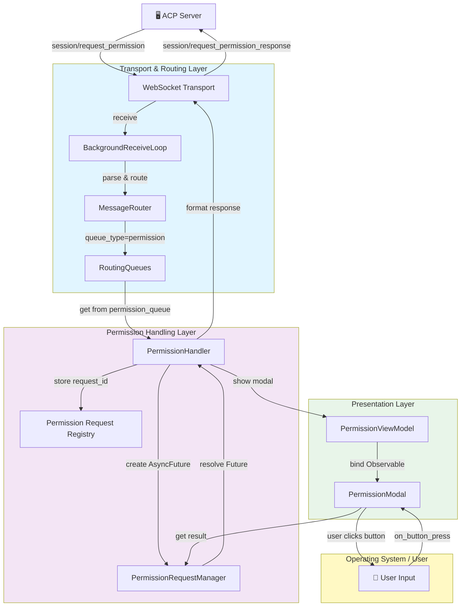
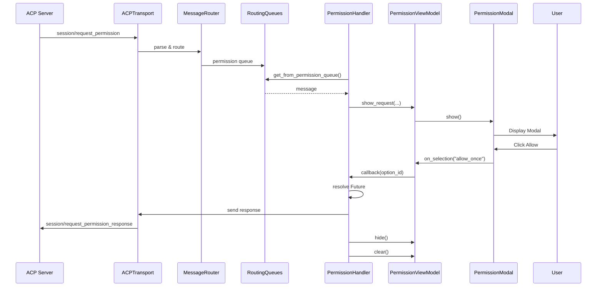
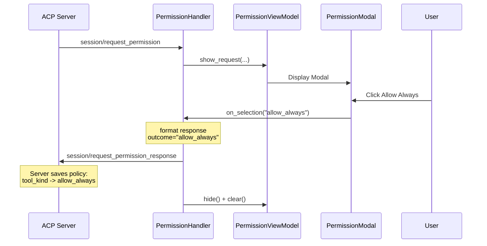
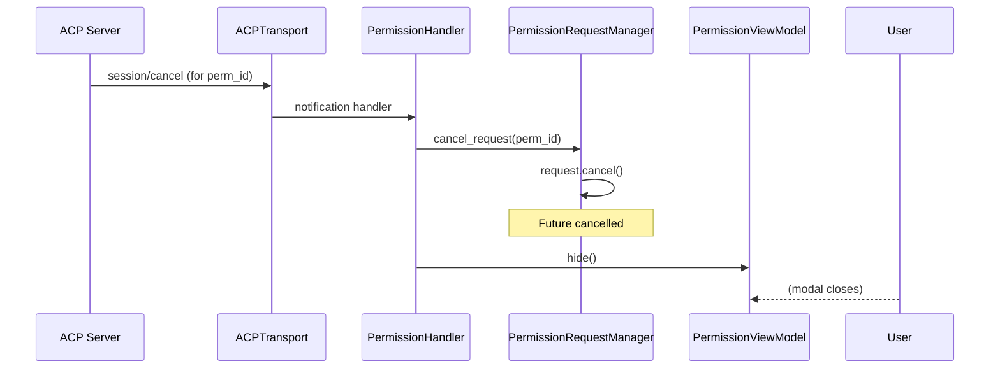
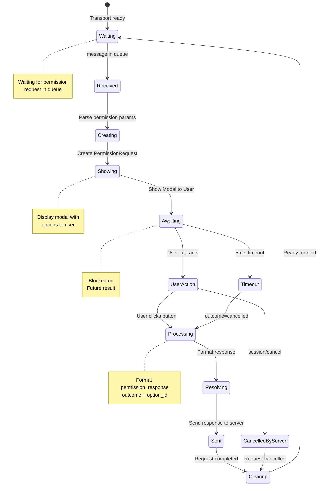

# Архитектура обработки Permissions клиента

**Версия**: 1.0  
**Дата**: 2026-04-16  
**Статус**: Проектирование  
**Автор**: Техническая команда

---

## 1. Обзор и цели

### 1.1 Проблема

ACP протокол определяет метод `session/request_permission` для запроса пользовательского согласия на выполнение операций. На сервере полностью реализована система управления разрешениями с `GlobalPolicyManager`, но на клиентской стороне отсутствует:

1. **Обработчик входящих запросов** — нет компонента, который получает `session/request_permission` от сервера
2. **Интеграция с transport layer** — запросы не маршрутизируются в правильные обработчики
3. **State management** — нет отслеживания pending requests и связи между request/response
4. **Автоматическая отправка response** — ответ не отправляется обратно на сервер
5. **Взаимодействие UI/логика** — нет полного цикла show modal → user action → send response

### 1.2 Цели реализации

Реализовать полный цикл обработки permission requests на клиенте:

- ✅ Получить `session/request_permission` от сервера
- ✅ Показать модальное окно пользователю
- ✅ Дождаться выбора пользователя
- ✅ Отправить ответ на сервер с `session/request_permission_response`
- ✅ Поддерживать отмену (cancellation) запроса
- ✅ Интегрировать с существующей архитектурой (ACPTransportService, MessageRouter)
- ✅ Обеспечить типизацию и тестируемость

### 1.3 Scope

**Входит:**
- Permission Handler в инфраструктуре (PermissionHandler, PermissionRequestManager)
- Интеграция с MessageRouter и RoutingQueues
- Integration с PermissionViewModel и PermissionModal
- State management для pending requests (asyncio.Future)
- Обработка различных исходов (allow_once, allow_always, reject_once, reject_always)
- Отмена запроса по инициативе сервера (session/cancel)

**Не входит:**
- Изменение протокола ACP
- Серверная реализация (она уже готова)
- Persistence политик на клиенте (глобальные политики хранятся только на сервере)
- CLI интерфейс для управления permissions (может быть в отдельной задаче)

---

## 2. Текущее состояние

### 2.1 Что уже реализовано

#### 2.1.1 Серверная сторона
Полная реализация в [`codelab/src/codelab/server/protocol/handlers/permissions.py`](../../codelab/src/codelab/server/protocol/handlers/permissions.py):
- Обработчик метода `session/request_permission`
- GlobalPolicyManager для управления глобальными политиками
- Типизированные сообщения (PermissionRequest, PermissionOption, PermissionOutcome)

#### 2.1.2 Клиентская UI часть
Существующие компоненты:

1. **PermissionViewModel** ([`codelab/src/codelab/client/presentation/permission_view_model.py`](../../codelab/src/codelab/client/presentation/permission_view_model.py)):
   - Управление состоянием модального окна
   - Observable properties: permission_type, resource, message, is_visible
   - Методы: show_request(), hide(), clear()

2. **PermissionModal** ([`codelab/src/codelab/client/tui/components/permission_modal.py`](../../codelab/src/codelab/client/tui/components/permission_modal.py)):
   - Textual UI компонент (ModalScreen)
   - Отображение опций разрешения
   - Привязка к PermissionViewModel через Observable

#### 2.1.3 Инфраструктура транспорта
Компоненты для маршрутизации ([`codelab/src/codelab/client/infrastructure/services/`](../../codelab/src/codelab/client/infrastructure/services/)):
- **ACPTransportService** — низкоуровневая коммуникация
- **MessageRouter** — маршрутизация по методам и id (уже поддерживает permission queue type)
- **RoutingQueues** — распределение сообщений
- **BackgroundReceiveLoop** — единственный receive() на WebSocket

#### 2.1.4 Протокол (сообщения)
В [`codelab/src/codelab/client/messages.py`](../../codelab/src/codelab/client/messages.py):
- PermissionOption (optionId, name, kind, description, disabled)
- PermissionOutcome (outcome, optionId)
- Поддержка request/response в ACPMessage

### 2.2 Что отсутствует

| Компонент | Статус | Описание |
|-----------|--------|---------|
| PermissionHandler | ❌ Отсутствует | Обработчик входящих permission requests |
| PermissionRequestManager | ❌ Отсутствует | State management для pending requests |
| Integration с PermissionModal | ❌ Отсутствует | Связь handler → modal → response |
| Permission Queue обработка | ❌ Отсутствует | Получение из routing queue и обработка |
| Cancellation handling | ❌ Отсутствует | Обработка session/cancel уведомлений |
| Тесты | ❌ Отсутствует | Unit/integration тесты |

### 2.3 Ссылки на существующие компоненты

```
codelab/
├── src/codelab/src/codelab/client/
│   ├── messages.py (PermissionOption, PermissionOutcome)
│   ├── presentation/
│   │   └── permission_view_model.py (PermissionViewModel)
│   ├── tui/components/
│   │   └── permission_modal.py (PermissionModal)
│   └── infrastructure/services/
│       ├── acp_transport_service.py (ACPTransportService)
│       ├── message_router.py (MessageRouter)
│       ├── routing_queues.py (RoutingQueues)
│       └── background_receive_loop.py (BackgroundReceiveLoop)
```

---

## 3. Архитектура решения

### 3.1 Компонентная диаграмма



### 3.2 Описание компонентов

#### 3.2.1 Permission Handling Layer

**PermissionHandler** (новый):
- Координирует всю логику обработки permission request
- Получает сообщение из permission queue
- Создает PermissionRequestManager для отслеживания
- Показывает модальное окно
- Ждет результата
- Отправляет response обратно на сервер
- Ответственность: orchestration, не business logic

**PermissionRequestManager** (новый):
- Управляет состоянием одного permission request
- Хранит id запроса, опции, метаданные
- Использует asyncio.Future для ожидания результата
- Методы: await_response(), resolve_with_option(), cancel()
- Ответственность: state management одного request

**Permission Request Registry** (новый):
- Глобальный реестр активных requests
- Быстрый поиск по request_id
- Поддержка отмены по id
- Dict[JsonRpcId, PermissionRequestManager]

#### 3.2.2 Transport & Routing Layer

**MessageRouter** (расширение):
- Уже поддерживает routing permission requests
- Queue type: "permission" (зарезервирован, работает)
- Не требует изменений

**RoutingQueues** (расширение):
- Уже имеет permission_queue
- Метод: get_from_permission_queue()
- Не требует изменений

#### 3.2.3 Presentation Layer

**PermissionViewModel** (минимальные изменения):
- Добавить callback для user action
- Добавить методы allow_once(), reject_once() и т.д.
- Инициировать отправку response

**PermissionModal** (минимальные изменения):
- Подключить обработчики нажатия кнопок
- Вызвать callback из ViewModel
- Закрыть модальное окно

### 3.3 Взаимодействие между компонентами

```
1. Server sends: session/request_permission
   ↓
2. BackgroundReceiveLoop receives message
   ↓
3. MessageRouter routes to permission queue
   ↓
4. PermissionHandler gets message from queue
   ↓
5. PermissionHandler creates PermissionRequestManager
   ↓
6. PermissionHandler shows PermissionModal via ViewModel
   ↓
7. User clicks button (Allow, Reject, etc.)
   ↓
8. PermissionModal triggers callback
   ↓
9. PermissionRequestManager resolves Future with selection
   ↓
10. PermissionHandler formats response
    ↓
11. ACPTransportService sends response
    ↓
12. Server receives: session/request_permission_response
```

---

## 4. Детальный дизайн

### 4.1 Permission Handler

#### 4.1.1 Интерфейс

```python
# codelab/src/codelab/client/infrastructure/services/permission_handler.py

from __future__ import annotations

import asyncio
from typing import TYPE_CHECKING

import structlog

from codelab.client.messages import ACPMessage, JsonRpcId

if TYPE_CHECKING:
    from codelab.client.presentation.permission_view_model import PermissionViewModel
    from .routing_queues import RoutingQueues


class PermissionHandler:
    """Обработчик входящих permission request сообщений от сервера.
    
    Координирует:
    - Получение сообщения из routing queue
    - Показ модального окна пользователю
    - Ожидание выбора пользователя
    - Отправку response обратно на сервер
    
    Ответственность: orchestration логика обработки permission request,
    а не business logic валидации или хранения.
    
    Пример:
        >>> handler = PermissionHandler(queues, vm, send_response_fn)
        >>> await handler.start()  # Запускает фоновую обработку
    """
    
    def __init__(
        self,
        routing_queues: RoutingQueues,
        permission_vm: PermissionViewModel,
        send_response: Callable[[ACPMessage], Awaitable[None]],
    ) -> None:
        """Инициализировать PermissionHandler.
        
        Args:
            routing_queues: RoutingQueues для получения permission requests
            permission_vm: PermissionViewModel для управления UI
            send_response: Callback для отправки response на сервер
        """
        self._queues = routing_queues
        self._permission_vm = permission_vm
        self._send_response = send_response
        self._request_manager = PermissionRequestManager()
        self._logger = structlog.get_logger("permission_handler")
        self._processing_task: asyncio.Task[None] | None = None
    
    async def start(self) -> None:
        """Запустить фоновую обработку permission requests.
        
        Запускает бесконечный цикл обработки сообщений из permission queue.
        Должна быть вызвана один раз при инициализации.
        """
        self._logger.info("permission_handler_starting")
        self._processing_task = asyncio.create_task(self._processing_loop())
    
    async def stop(self) -> None:
        """Остановить обработку permission requests."""
        if self._processing_task:
            self._processing_task.cancel()
            try:
                await self._processing_task
            except asyncio.CancelledError:
                pass
        self._logger.info("permission_handler_stopped")
    
    async def _processing_loop(self) -> None:
        """Основной цикл обработки permission requests.
        
        Получает сообщения из permission queue и обрабатывает их.
        Работает в фоне на протяжении всего сеанса.
        """
        while True:
            try:
                # Получить сообщение из permission queue
                # (блокирует, если очередь пуста)
                message = await self._queues.get_from_permission_queue()
                await self._handle_permission_request(message)
            except asyncio.CancelledError:
                self._logger.debug("processing_loop_cancelled")
                break
            except Exception as e:
                self._logger.error("permission_processing_error", error=str(e))
    
    async def _handle_permission_request(self, message: dict[str, Any]) -> None:
        """Обработать входящий permission request.
        
        Args:
            message: Сообщение session/request_permission от сервера
        """
        request_id = message.get("id")
        params = message.get("params", {})
        
        self._logger.info(
            "handling_permission_request",
            request_id=request_id,
            permission_type=params.get("permissionType"),
        )
        
        # Извлечь параметры из message
        permission_type = params.get("permissionType")
        resource = params.get("resource")
        reason = params.get("reason")
        options = params.get("options", [])
        
        # Создать request manager для отслеживания этого запроса
        request = self._request_manager.create_request(
            request_id=request_id,
            permission_type=permission_type,
            resource=resource,
            options=options,
        )
        
        # Показать модальное окно пользователю
        self._permission_vm.show_request(
            permission_type=permission_type,
            resource=resource,
            message=reason or "",
        )
        
        # Установить options в modal
        # (предполагается, что modal будет обновлена отдельно)
        
        # Ждать результата от пользователя
        try:
            selected_option = await asyncio.wait_for(
                request.await_response(),
                timeout=300.0,  # 5 минут timeout
            )
            
            # Скрыть модальное окно
            self._permission_vm.hide()
            
            # Отправить response на сервер
            response = self._format_permission_response(
                request_id=request_id,
                outcome=selected_option.outcome,
                option_id=selected_option.option_id,
            )
            await self._send_response(response)
            
            self._logger.info(
                "permission_request_completed",
                request_id=request_id,
                outcome=selected_option.outcome,
            )
        
        except asyncio.TimeoutError:
            self._logger.warning(
                "permission_request_timeout",
                request_id=request_id,
            )
            self._permission_vm.hide()
            
            # Отправить cancelled response
            response = self._format_permission_response(
                request_id=request_id,
                outcome="cancelled",
                option_id=None,
            )
            await self._send_response(response)
        
        finally:
            # Очистить request manager
            self._request_manager.remove_request(request_id)
            self._permission_vm.clear()
    
    def _format_permission_response(
        self,
        request_id: JsonRpcId,
        outcome: str,
        option_id: str | None,
    ) -> ACPMessage:
        """Сформировать response message для session/request_permission.
        
        Args:
            request_id: ID оригинального request
            outcome: Исход (allow_once, reject_once, allow_always, reject_always, cancelled)
            option_id: ID выбранной опции
        
        Returns:
            ACPMessage готовое к отправке на сервер
        """
        result = {
            "outcome": {
                "outcome": outcome,
            }
        }
        if option_id is not None:
            result["outcome"]["optionId"] = option_id
        
        return ACPMessage.response(request_id, result)
```

#### 4.1.2 PermissionRequestManager

```python
# codelab/src/codelab/client/infrastructure/services/permission_request_manager.py

from __future__ import annotations

from dataclasses import dataclass
from typing import Any

import structlog

from codelab.client.messages import JsonRpcId, PermissionOption


@dataclass
class PermissionOutcome:
    """Результат выбора пользователя."""
    outcome: str  # allow_once, reject_once, allow_always, reject_always, cancelled
    option_id: str | None = None


class PermissionRequest:
    """Отслеживает состояние одного permission request.
    
    Использует asyncio.Future для ожидания результата от пользователя.
    Позволяет обработчику блокировать до получения ответа.
    """
    
    def __init__(
        self,
        request_id: JsonRpcId,
        permission_type: str,
        resource: str,
        options: list[dict[str, Any]],
    ) -> None:
        """Инициализировать PermissionRequest.
        
        Args:
            request_id: ID от сервера
            permission_type: Тип разрешения
            resource: Ресурс
            options: Список доступных опций
        """
        self.request_id = request_id
        self.permission_type = permission_type
        self.resource = resource
        self.options = [
            PermissionOption.model_validate(opt)
            for opt in options
        ]
        
        # Future для ожидания результата
        self._response_future: asyncio.Future[PermissionOutcome] = asyncio.Future()
        self._logger = structlog.get_logger("permission_request")
    
    async def await_response(self) -> PermissionOutcome:
        """Ждать результата выбора пользователя.
        
        Returns:
            PermissionOutcome с выбором пользователя
        
        Raises:
            asyncio.TimeoutError: Если timeout
            asyncio.CancelledError: Если request отменен
        """
        return await self._response_future
    
    def resolve(self, outcome: PermissionOutcome) -> None:
        """Разрешить future с результатом.
        
        Args:
            outcome: Результат выбора пользователя
        """
        if not self._response_future.done():
            self._response_future.set_result(outcome)
            self._logger.debug(
                "permission_request_resolved",
                request_id=self.request_id,
                outcome=outcome.outcome,
            )
    
    def cancel(self) -> None:
        """Отменить request (например по инициативе сервера)."""
        if not self._response_future.done():
            self._response_future.cancel()
            self._logger.debug(
                "permission_request_cancelled",
                request_id=self.request_id,
            )


class PermissionRequestManager:
    """Реестр и управление всеми активными permission requests.
    
    Отслеживает все pending requests по их ID и позволяет
    обработчику быстро находить нужный request для разрешения.
    """
    
    def __init__(self) -> None:
        """Инициализировать PermissionRequestManager."""
        self._requests: dict[JsonRpcId, PermissionRequest] = {}
        self._logger = structlog.get_logger("permission_request_manager")
    
    def create_request(
        self,
        request_id: JsonRpcId,
        permission_type: str,
        resource: str,
        options: list[dict[str, Any]],
    ) -> PermissionRequest:
        """Создать и зарегистрировать новый request.
        
        Args:
            request_id: ID от сервера
            permission_type: Тип разрешения
            resource: Ресурс
            options: Список доступных опций
        
        Returns:
            PermissionRequest
        """
        request = PermissionRequest(
            request_id=request_id,
            permission_type=permission_type,
            resource=resource,
            options=options,
        )
        self._requests[request_id] = request
        self._logger.debug(
            "permission_request_created",
            request_id=request_id,
            total_active=len(self._requests),
        )
        return request
    
    def get_request(self, request_id: JsonRpcId) -> PermissionRequest | None:
        """Получить request по ID.
        
        Args:
            request_id: ID запроса
        
        Returns:
            PermissionRequest или None если не найден
        """
        return self._requests.get(request_id)
    
    def remove_request(self, request_id: JsonRpcId) -> None:
        """Удалить request из реестра.
        
        Args:
            request_id: ID запроса
        """
        if request_id in self._requests:
            del self._requests[request_id]
            self._logger.debug(
                "permission_request_removed",
                request_id=request_id,
                remaining=len(self._requests),
            )
    
    def cancel_request(self, request_id: JsonRpcId) -> None:
        """Отменить request по ID (например по инициативе сервера).
        
        Args:
            request_id: ID запроса
        """
        request = self._requests.get(request_id)
        if request:
            request.cancel()
            self.remove_request(request_id)
            self._logger.info(
                "permission_request_cancelled_by_server",
                request_id=request_id,
            )
    
    def get_all_active(self) -> list[PermissionRequest]:
        """Получить все активные requests.
        
        Returns:
            Список всех pending requests
        """
        return list(self._requests.values())
```

### 4.2 Transport Integration

#### 4.2.1 Изменения в ACPTransportService

Требуемые изменения минимальны, так как инфраструктура уже поддерживает permission queue.

**Необходимое расширение:**

```python
# В codelab/src/codelab/client/infrastructure/services/acp_transport_service.py

class ACPTransportService(TransportService):
    """Добавить методы для обработки permissions."""
    
    async def setup_permission_handler(
        self,
        permission_vm: PermissionViewModel,
    ) -> None:
        """Инициализировать обработчик permissions.
        
        Args:
            permission_vm: PermissionViewModel для показа modal
        """
        from .permission_handler import PermissionHandler
        
        self._permission_handler = PermissionHandler(
            routing_queues=self._queues,
            permission_vm=permission_vm,
            send_response=self._send_permission_response,
        )
        await self._permission_handler.start()
        self._logger.info("permission_handler_setup_complete")
    
    async def _send_permission_response(self, response: ACPMessage) -> None:
        """Отправить response на permission request.
        
        Args:
            response: ACPMessage с результатом
        """
        await self.send(response)
        self._logger.debug(
            "permission_response_sent",
            request_id=response.id,
        )
```

#### 4.2.2 Routing: MessageRouter и RoutingQueues

**Текущее состояние:**

```python
# MessageRouter уже поддерживает permission routing:
if method == "session/request_permission":
    return RoutingKey(queue_type="permission")

# RoutingQueues уже имеет permission_queue
```

**Требуемое расширение RoutingQueues:**

```python
async def get_from_permission_queue(self, timeout: float | None = None) -> dict[str, Any]:
    """Получить сообщение из permission queue с опциональным timeout.
    
    Args:
        timeout: Timeout в секундах
    
    Returns:
        Сообщение из очереди
    
    Raises:
        asyncio.TimeoutError: Если timeout истек
    """
    try:
        message = await asyncio.wait_for(
            self.permission_queue.get(),
            timeout=timeout,
        )
        return message
    except asyncio.TimeoutError:
        self._logger.warning("permission_queue_timeout")
        raise
```

### 4.3 State Management

#### 4.3.1 Использование asyncio.Future

**Паттерн:**

```python
# 1. Создание request с Future
request = PermissionRequest(
    request_id="perm_123",
    permission_type="execute",
    resource="/bin/ls",
    options=[...],
)

# 2. Ожидание в обработчике
task = asyncio.create_task(request.await_response())  # Non-blocking
# или
outcome = await request.await_response()  # Blocking

# 3. Разрешение future из callback
user_choice = PermissionOutcome(
    outcome="allow_once",
    option_id="allow_once",
)
request.resolve(user_choice)  # Future resolved
```

#### 4.3.2 Отслеживание Pending Requests

```python
# Request Registry:
manager = PermissionRequestManager()

# Создание
req = manager.create_request(
    request_id="perm_1",
    permission_type="file_read",
    resource="/etc/passwd",
    options=[...],
)

# Получение
req = manager.get_request("perm_1")
if req:
    outcome = await req.await_response()

# Отмена (по инициативе сервера)
manager.cancel_request("perm_1")

# Получение всех активных
active = manager.get_all_active()
```

### 4.4 UI Integration

#### 4.4.1 Изменения в PermissionModal

```python
# codelab/src/codelab/client/tui/components/permission_modal.py

class PermissionModal(ModalScreen[PermissionOutcome]):
    """Модальное окно permission request с поддержкой callback."""
    
    def __init__(
        self,
        *,
        permission_vm: PermissionViewModel,
        on_selection: Callable[[str], None],  # NEW: callback
        options: list[PermissionOption] | None = None,
    ) -> None:
        """Инициализировать modal с callback.
        
        Args:
            permission_vm: PermissionViewModel
            on_selection: Callback при нажатии кнопки (option_id)
            options: Список опций
        """
        super().__init__()
        self.permission_vm = permission_vm
        self._on_selection = on_selection  # NEW
        self._options = options or []
    
    async def action_allow_once(self) -> None:
        """Пользователь нажал Allow."""
        self._on_selection("allow_once")
        self.dismiss()
    
    async def action_reject_once(self) -> None:
        """Пользователь нажал Reject."""
        self._on_selection("reject_once")
        self.dismiss()
    
    async def action_allow_always(self) -> None:
        """Пользователь нажал Allow Always."""
        self._on_selection("allow_always")
        self.dismiss()
    
    async def action_reject_always(self) -> None:
        """Пользователь нажал Reject Always."""
        self._on_selection("reject_always")
        self.dismiss()
```

#### 4.4.2 Изменения в PermissionViewModel

```python
# codelab/src/codelab/client/presentation/permission_view_model.py

class PermissionViewModel(BaseViewModel):
    """ViewModel с поддержкой callbacks для user actions."""
    
    def __init__(
        self,
        on_user_selection: Callable[[str], None] | None = None,
        **kwargs,
    ) -> None:
        """Инициализировать ViewModel.
        
        Args:
            on_user_selection: Callback при выборе пользователя
        """
        super().__init__(**kwargs)
        self._on_user_selection = on_user_selection
    
    def set_on_user_selection(self, callback: Callable[[str], None]) -> None:
        """Установить callback для user selection."""
        self._on_user_selection = callback
    
    async def user_selected_option(self, option_id: str) -> None:
        """Пользователь выбрал опцию.
        
        Args:
            option_id: ID выбранной опции
        """
        if self._on_user_selection:
            self._on_user_selection(option_id)
        self.hide()
```

---

## 5. Sequence диаграммы

### 5.1 Нормальный flow (allow_once)



### 5.2 Flow с сохранением (allow_always)



### 5.3 Cancellation flow (server-initiated)



---

## 6. State диаграмма



---

## 7. План реализации

### 7.1 Этапы реализации

#### Этап 1: Инфраструктура (HIGH)
- [ ] Создать `permission_handler.py` с `PermissionHandler`
- [ ] Создать `permission_request_manager.py` с `PermissionRequest` и `PermissionRequestManager`
- [ ] Добавить вспомогательные типы (PermissionOutcome)
- [ ] Обновить `routing_queues.py` с методом `get_from_permission_queue()`
- [ ] Добавить инициализацию в `ACPTransportService.setup_permission_handler()`

**Приоритет**: HIGH  
**Причина**: Foundation для всей остальной реализации

#### Этап 2: UI интеграция (HIGH)
- [ ] Обновить `PermissionModal` для поддержки callbacks
- [ ] Обновить `PermissionViewModel` для управления callbacks
- [ ] Добавить методы user_selected_option() в ViewModel
- [ ] Проверить Observable binding

**Приоритет**: HIGH  
**Причина**: Необходимо для замыкания цикла user → response

#### Этап 3: Transport интеграция (MEDIUM)
- [ ] Добавить вызов `setup_permission_handler()` в инициализацию
- [ ] Проверить integration с background receive loop
- [ ] Добавить обработчик для session/cancel notification

**Приоритет**: MEDIUM  
**Причина**: Большая часть уже готова в инфраструктуре

#### Этап 4: Тестирование (MEDIUM)
- [ ] Unit тесты для PermissionHandler
- [ ] Unit тесты для PermissionRequestManager
- [ ] Integration тесты (handler + mock transport)
- [ ] E2E тесты с реальным сервером

**Приоритет**: MEDIUM  
**Требует**: Завершение этапов 1-3

#### Этап 5: Документация и обработка ошибок (LOW)
- [ ] Обработка edge cases (одновременные requests)
- [ ] Логирование и диагностика
- [ ] Обновление README
- [ ] Примеры использования

**Приоритет**: LOW  
**Требует**: Завершение этапов 1-4

### 7.2 Порядок реализации

```
1. PermissionRequest + PermissionOutcome (базовые типы)
   ↓
2. PermissionRequestManager (state management)
   ↓
3. PermissionHandler + routing_queues расширение
   ↓
4. PermissionModal callback интеграция
   ↓
5. PermissionViewModel callback поддержка
   ↓
6. ACPTransportService setup_permission_handler()
   ↓
7. Unit тесты
   ↓
8. Integration тесты
   ↓
9. E2E тесты
   ↓
10. Документация + примеры
```

---

## 8. Тестирование

### 8.1 Unit тесты

#### 8.1.1 PermissionRequest

```python
# codelab/tests/client/infrastructure/test_permission_request.py

import asyncio
import pytest

from codelab.client.infrastructure.services.permission_request_manager import (
    PermissionRequest,
    PermissionOutcome,
)


@pytest.mark.asyncio
async def test_permission_request_create():
    """Тест создания PermissionRequest."""
    req = PermissionRequest(
        request_id="perm_1",
        permission_type="file_read",
        resource="/etc/passwd",
        options=[
            {"optionId": "allow_once", "name": "Allow", "kind": "allow_once"},
        ],
    )
    assert req.request_id == "perm_1"
    assert req.permission_type == "file_read"
    assert req.resource == "/etc/passwd"
    assert len(req.options) == 1


@pytest.mark.asyncio
async def test_permission_request_resolve():
    """Тест разрешения PermissionRequest."""
    req = PermissionRequest(
        request_id="perm_1",
        permission_type="file_read",
        resource="/etc/passwd",
        options=[],
    )
    
    outcome = PermissionOutcome(outcome="allow_once", option_id="allow_once")
    req.resolve(outcome)
    
    result = await req.await_response()
    assert result.outcome == "allow_once"
    assert result.option_id == "allow_once"


@pytest.mark.asyncio
async def test_permission_request_timeout():
    """Тест timeout при ожидании response."""
    req = PermissionRequest(
        request_id="perm_1",
        permission_type="file_read",
        resource="/etc/passwd",
        options=[],
    )
    
    with pytest.raises(asyncio.TimeoutError):
        await asyncio.wait_for(req.await_response(), timeout=0.1)
```

#### 8.1.2 PermissionRequestManager

```python
# codelab/tests/client/infrastructure/test_permission_request_manager.py

import asyncio
import pytest

from codelab.client.infrastructure.services.permission_request_manager import (
    PermissionRequestManager,
    PermissionOutcome,
)


@pytest.mark.asyncio
async def test_create_and_get_request():
    """Тест создания и получения request."""
    manager = PermissionRequestManager()
    
    req = manager.create_request(
        request_id="perm_1",
        permission_type="file_read",
        resource="/etc/passwd",
        options=[],
    )
    
    retrieved = manager.get_request("perm_1")
    assert retrieved is req


@pytest.mark.asyncio
async def test_remove_request():
    """Тест удаления request."""
    manager = PermissionRequestManager()
    manager.create_request(
        request_id="perm_1",
        permission_type="file_read",
        resource="/etc/passwd",
        options=[],
    )
    
    manager.remove_request("perm_1")
    assert manager.get_request("perm_1") is None


@pytest.mark.asyncio
async def test_cancel_request():
    """Тест отмены request."""
    manager = PermissionRequestManager()
    req = manager.create_request(
        request_id="perm_1",
        permission_type="file_read",
        resource="/etc/passwd",
        options=[],
    )
    
    manager.cancel_request("perm_1")
    
    with pytest.raises(asyncio.CancelledError):
        await req.await_response()


@pytest.mark.asyncio
async def test_multiple_concurrent_requests():
    """Тест нескольких одновременных requests."""
    manager = PermissionRequestManager()
    
    reqs = [
        manager.create_request(
            request_id=f"perm_{i}",
            permission_type="execute",
            resource=f"/bin/cmd{i}",
            options=[],
        )
        for i in range(5)
    ]
    
    # Разрешить все одновременно
    tasks = [
        asyncio.create_task(req.await_response())
        for req in reqs
    ]
    
    for i, req in enumerate(reqs):
        req.resolve(PermissionOutcome(outcome="allow_once"))
    
    results = await asyncio.gather(*tasks)
    assert all(r.outcome == "allow_once" for r in results)
```

#### 8.1.3 PermissionHandler

```python
# codelab/tests/client/infrastructure/test_permission_handler.py

import asyncio
import pytest
from unittest.mock import AsyncMock, MagicMock

from codelab.client.infrastructure.services.permission_handler import (
    PermissionHandler,
)
from codelab.client.messages import ACPMessage


@pytest.mark.asyncio
async def test_permission_handler_handle_request():
    """Тест обработки permission request."""
    # Setup mocks
    mock_queues = MagicMock()
    mock_vm = MagicMock()
    mock_send = AsyncMock()
    
    handler = PermissionHandler(
        routing_queues=mock_queues,
        permission_vm=mock_vm,
        send_response=mock_send,
    )
    
    # Simulate incoming message
    message = {
        "id": "perm_1",
        "method": "session/request_permission",
        "params": {
            "permissionType": "file_read",
            "resource": "/etc/passwd",
            "reason": "Need to read file",
            "options": [
                {"optionId": "allow_once", "name": "Allow Once"},
            ],
        },
    }
    
    # Verify modal shown
    # (would need more elaborate mocking to test full flow)


@pytest.mark.asyncio
async def test_permission_handler_format_response():
    """Тест форматирования response."""
    mock_queues = MagicMock()
    mock_vm = MagicMock()
    mock_send = AsyncMock()
    
    handler = PermissionHandler(
        routing_queues=mock_queues,
        permission_vm=mock_vm,
        send_response=mock_send,
    )
    
    response = handler._format_permission_response(
        request_id="perm_1",
        outcome="allow_once",
        option_id="allow_once",
    )
    
    assert response.id == "perm_1"
    assert response.result["outcome"]["outcome"] == "allow_once"
    assert response.result["outcome"]["optionId"] == "allow_once"
```

### 8.2 Integration тесты

```python
# codelab/tests/client/integration/test_permission_integration.py

import asyncio
import pytest
from unittest.mock import AsyncMock, MagicMock

from codelab.client.infrastructure.services.permission_handler import (
    PermissionHandler,
)
from codelab.client.infrastructure.services.permission_request_manager import (
    PermissionRequestManager,
    PermissionOutcome,
)


@pytest.mark.asyncio
async def test_permission_flow_allow_once():
    """Integration тест полного flow: request → modal → response."""
    # Setup
    manager = PermissionRequestManager()
    mock_queues = MagicMock()
    mock_vm = MagicMock()
    sent_responses = []
    
    async def capture_send(msg):
        sent_responses.append(msg)
    
    handler = PermissionHandler(
        routing_queues=mock_queues,
        permission_vm=mock_vm,
        send_response=capture_send,
    )
    
    # Simulate receiving permission request
    async def simulate_user_action():
        await asyncio.sleep(0.1)
        # User clicks Allow
        req = manager.get_request("perm_1")
        if req:
            req.resolve(PermissionOutcome(outcome="allow_once"))
    
    # Create request
    request = manager.create_request(
        request_id="perm_1",
        permission_type="file_read",
        resource="/etc/passwd",
        options=[],
    )
    
    # Simulate user action in background
    user_task = asyncio.create_task(simulate_user_action())
    
    # Wait for response
    outcome = await asyncio.wait_for(request.await_response(), timeout=1.0)
    
    await user_task
    
    # Verify
    assert outcome.outcome == "allow_once"


@pytest.mark.asyncio
async def test_permission_timeout():
    """Integration тест timeout обработки."""
    manager = PermissionRequestManager()
    
    request = manager.create_request(
        request_id="perm_1",
        permission_type="execute",
        resource="/bin/ls",
        options=[],
    )
    
    # Should timeout after 0.1 sec
    with pytest.raises(asyncio.TimeoutError):
        await asyncio.wait_for(request.await_response(), timeout=0.1)
```

### 8.3 E2E сценарии

```python
# codelab/tests/client/e2e/test_permission_e2e.py

@pytest.mark.asyncio
@pytest.mark.integration
async def test_e2e_permission_flow_with_real_server():
    """E2E тест с реальным ACP сервером."""
    # Start test server
    # Create client connection
    # Send permission request from server
    # Verify modal shown
    # Simulate user input
    # Verify response received on server
    pass
```

---

## 9. Риски и митигация

### 9.1 Технические риски

| Риск | Вероятность | Impact | Митигация |
|------|-------------|--------|-----------|
| Deadlock между permission handler и other requests | Medium | High | Использовать asyncio.Future вместо блокирования, правильная обработка timeouts |
| Race condition при одновременных requests | Medium | Medium | PermissionRequestManager гарантирует isolation per request_id |
| Memory leak (request не удален) | Low | High | Всегда вызывать remove_request() в finally блоке |
| Modal не закрывается при ошибке | Medium | Low | Гарантированный hide() + clear() в finally |
| Сервер отменяет request, но handler ждет | Low | Medium | Обработчик session/cancel отменяет Future |
| User действие после timeout | Low | Low | Игнорировать actions если request удален |

### 9.2 Способы митигации

1. **Deadlocks**:
   - Использовать asyncio.Future для non-blocking wait
   - Всегда задавать timeout (300 сек для permission request)
   - Логировать все ожидания и разрешения

2. **Race conditions**:
   - PermissionRequestManager изолирует по request_id
   - Все операции атомарные на уровне dict
   - Future гарантирует одноразовое разрешение

3. **Memory leaks**:
   - try/finally в _handle_permission_request
   - Обязательный remove_request() в cleanup

4. **Надежность UI**:
   - Гарантированный hide() при любом исходе
   - clear() для сброса состояния
   - Timeout для гарантированного закрытия modal

5. **Обработка ошибок сервера**:
   - session/cancel → отмена Future
   - Логирование всех ошибок
   - Graceful degradation

---

## 10. Примеры кода

### 10.1 Permission Handler (полный класс)

```python
# codelab/src/codelab/client/infrastructure/services/permission_handler.py

"""Обработчик входящих permission request сообщений от сервера."""

from __future__ import annotations

import asyncio
from collections.abc import Awaitable, Callable
from typing import TYPE_CHECKING, Any

import structlog

from codelab.client.messages import ACPMessage, JsonRpcId

if TYPE_CHECKING:
    from codelab.client.presentation.permission_view_model import PermissionViewModel
    from .routing_queues import RoutingQueues


class PermissionHandler:
    """Координирует обработку permission requests: получение → показ → ответ.
    
    Основной цикл:
    1. Получить message из permission queue
    2. Показать modal пользователю
    3. Ждать выбора
    4. Отправить response на сервер
    
    Поддерживает timeout, отмену по инициативе сервера, обработку ошибок.
    """

    def __init__(
        self,
        routing_queues: RoutingQueues,
        permission_vm: PermissionViewModel,
        send_response: Callable[[ACPMessage], Awaitable[None]],
    ) -> None:
        """Инициализировать PermissionHandler.

        Args:
            routing_queues: Для получения permission requests
            permission_vm: Для управления UI
            send_response: Для отправки responses на сервер
        """
        self._queues = routing_queues
        self._permission_vm = permission_vm
        self._send_response = send_response
        
        from .permission_request_manager import PermissionRequestManager
        self._request_manager = PermissionRequestManager()
        
        self._logger = structlog.get_logger("permission_handler")
        self._processing_task: asyncio.Task[None] | None = None
        self._running = False

    async def start(self) -> None:
        """Запустить фоновую обработку permission requests."""
        if self._running:
            self._logger.warning("permission_handler_already_running")
            return
        
        self._running = True
        self._logger.info("permission_handler_starting")
        self._processing_task = asyncio.create_task(self._processing_loop())

    async def stop(self) -> None:
        """Остановить обработку permission requests."""
        self._running = False
        if self._processing_task:
            self._processing_task.cancel()
            try:
                await self._processing_task
            except asyncio.CancelledError:
                pass
        self._logger.info("permission_handler_stopped")

    async def _processing_loop(self) -> None:
        """Основной цикл получения и обработки permission requests."""
        while self._running:
            try:
                message = await self._queues.get_from_permission_queue()
                await self._handle_permission_request(message)
            except asyncio.CancelledError:
                self._logger.debug("processing_loop_cancelled")
                break
            except Exception as e:
                self._logger.error(
                    "permission_processing_error",
                    error=str(e),
                    exc_info=True,
                )

    async def _handle_permission_request(self, message: dict[str, Any]) -> None:
        """Обработать входящий permission request.

        Args:
            message: Сообщение session/request_permission
        """
        request_id = message.get("id")
        params = message.get("params", {})

        self._logger.info(
            "handling_permission_request",
            request_id=request_id,
            permission_type=params.get("permissionType"),
        )

        permission_type = params.get("permissionType")
        resource = params.get("resource")
        reason = params.get("reason")
        options = params.get("options", [])

        # Создать и зарегистрировать request
        request = self._request_manager.create_request(
            request_id=request_id,
            permission_type=permission_type,
            resource=resource,
            options=options,
        )

        # Показать modal
        self._permission_vm.show_request(
            permission_type=permission_type,
            resource=resource,
            message=reason or "",
        )
        # TODO: Set options in modal via callback or property

        try:
            # Ждать результата (с timeout)
            selected_option = await asyncio.wait_for(
                request.await_response(),
                timeout=300.0,  # 5 minutes
            )

            self._permission_vm.hide()

            # Отправить response
            response = self._format_permission_response(
                request_id=request_id,
                outcome=selected_option.outcome,
                option_id=selected_option.option_id,
            )
            await self._send_response(response)

            self._logger.info(
                "permission_request_completed",
                request_id=request_id,
                outcome=selected_option.outcome,
            )

        except asyncio.TimeoutError:
            self._logger.warning(
                "permission_request_timeout",
                request_id=request_id,
            )
            self._permission_vm.hide()

            # Отправить cancelled response
            response = self._format_permission_response(
                request_id=request_id,
                outcome="cancelled",
                option_id=None,
            )
            await self._send_response(response)

        except Exception as e:
            self._logger.error(
                "permission_request_error",
                request_id=request_id,
                error=str(e),
            )
            self._permission_vm.hide()

        finally:
            self._request_manager.remove_request(request_id)
            self._permission_vm.clear()

    def _format_permission_response(
        self,
        request_id: JsonRpcId,
        outcome: str,
        option_id: str | None,
    ) -> ACPMessage:
        """Сформировать response message.

        Args:
            request_id: ID оригинального request
            outcome: Исход (allow_once, reject_once, allow_always, reject_always, cancelled)
            option_id: ID выбранной опции (если есть)

        Returns:
            ACPMessage готовое к отправке
        """
        result = {
            "outcome": {
                "outcome": outcome,
            }
        }
        if option_id is not None:
            result["outcome"]["optionId"] = option_id

        return ACPMessage.response(request_id, result)
```

### 10.2 Session Coordinator integration

```python
# В codelab/src/codelab/client/application/session_coordinator.py

class SessionCoordinator:
    """Координирует сессию и всю инфраструктуру."""

    async def initialize(self) -> None:
        """Инициализировать сессию и компоненты."""
        await self._transport_service.connect()

        # Инициализировать permission handler
        permission_vm = self._view_model_factory.create_permission_vm()
        await self._transport_service.setup_permission_handler(
            permission_vm=permission_vm,
        )

        self._logger.info("session_coordinator_initialized")
```

### 10.3 Transport integration

```python
# В codelab/src/codelab/client/infrastructure/services/acp_transport_service.py

class ACPTransportService(TransportService):
    """Расширение для support permission handling."""

    async def setup_permission_handler(
        self,
        permission_vm: PermissionViewModel,
    ) -> None:
        """Инициализировать permission handler.

        Args:
            permission_vm: PermissionViewModel для показа modal
        """
        from .permission_handler import PermissionHandler

        if not self._queues:
            raise RuntimeError("RoutingQueues not initialized. Call connect() first.")

        self._permission_handler = PermissionHandler(
            routing_queues=self._queues,
            permission_vm=permission_vm,
            send_response=self._send_permission_response,
        )
        await self._permission_handler.start()
        self._logger.info("permission_handler_setup_complete")

    async def _send_permission_response(self, response: ACPMessage) -> None:
        """Отправить response на permission request.

        Args:
            response: ACPMessage с результатом
        """
        await self.send(response)
        self._logger.debug(
            "permission_response_sent",
            request_id=response.id,
        )

    async def disconnect(self) -> None:
        """Расширенная отключение с cleanup permission handler."""
        if hasattr(self, "_permission_handler") and self._permission_handler:
            await self._permission_handler.stop()
        await super().disconnect()
```

### 10.4 UI integration

```python
# Обновление PermissionModal для callbacks

class PermissionModal(ModalScreen[str | None]):
    """Модальное окно с поддержкой callbacks."""

    def __init__(
        self,
        *,
        permission_vm: PermissionViewModel,
        on_selection: Callable[[str], None] | None = None,
        options: list[PermissionOption] | None = None,
    ) -> None:
        super().__init__()
        self.permission_vm = permission_vm
        self._on_selection = on_selection
        self._options = options or []

    def action_allow_once(self) -> None:
        """Пользователь нажал Allow."""
        if self._on_selection:
            self._on_selection("allow_once")
        self.dismiss()

    def action_reject_once(self) -> None:
        """Пользователь нажал Reject."""
        if self._on_selection:
            self._on_selection("reject_once")
        self.dismiss()
```

---

## 11. Заключение

Данный документ определяет полную архитектуру для обработки permission requests на клиенте. Реализация требует:

1. **Создание 2 новых модулей** (PermissionHandler, PermissionRequestManager)
2. **Минимальные изменения** в существующих компонентах
3. **Интеграция** с уже готовой инфраструктурой (MessageRouter, RoutingQueues)
4. **Полное покрытие тестами** (unit, integration, e2e)

Архитектура обеспечивает:
- ✅ Типизацию на всех уровнях
- ✅ Асинхронную обработку без deadlocks
- ✅ Изоляцию concurrent requests
- ✅ Graceful error handling
- ✅ Полную интеграцию с ACP протоколом

**Готово к реализации.**
