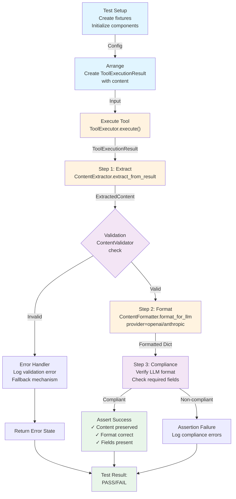
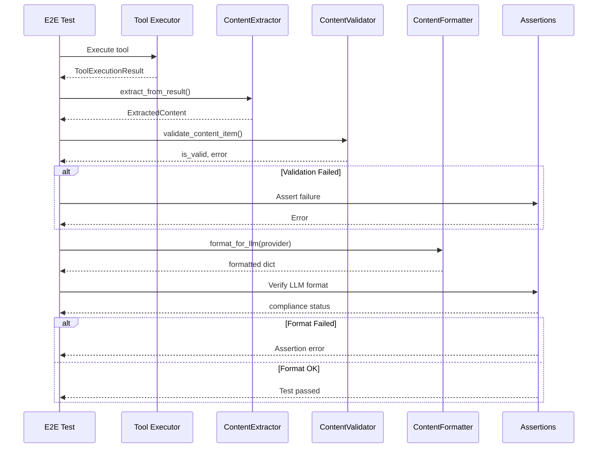
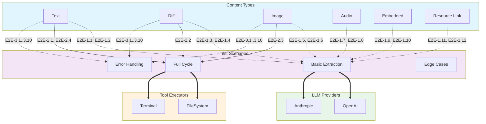

# Архитектура E2E тестирования Content Integration в Prompt Turn

Документ описывает архитектурный дизайн **Фазы 5: E2E Testing** — полного цикла тестирования Content Integration в система ACP Protocol.

---

## a) Executive Summary

### Цели E2E тестирования

Этап 5 обеспечивает комплексную проверку полного жизненного цикла обработки контента:

1. **Tool Execution → Content Result** - инструменты генерируют результаты с контентом
2. **Content Extraction & Validation** - контент извлекается и валидируется из результатов
3. **Content Formatting** - контент трансформируется в формат конкретного LLM провайдера
4. **Client Notification** - контент отправляется клиенту в session/update notifications
5. **End-to-End Integration** - все компоненты работают вместе в полном цикле

### Ключевые принципы

- **Сквозное покрытие** - от Tool Execution до LLM format для всех типов контента
- **Мультипровайдерность** - одинаковое тестирование для OpenAI и Anthropic
- **Полнота контента** - все 6 типов (text, diff, image, audio, embedded, resource_link)
- **Реалистичные сценарии** - тесты моделируют реальные workflow с FileSystem и Terminal
- **Error resilience** - проверка обработки ошибок и fallback механизмов
- **Backward compatibility** - совместимость со старым кодом (только output)

### Scope Фазы 5

**Входит:**
- E2E тесты для полного цикла Content Integration
- Тестирование обоих LLM провайдеров (OpenAI, Anthropic)
- Filesystem и Terminal операции с контентом
- Error handling и edge cases
- Backward compatibility проверки
- Performance и load tests (базовые)

**Не входит:**
- Трансформация контента (resizing, encoding) — это Фаза 6+
- Stream-based контент transfer
- Кэширование результатов
- Клиентское UI тестирование

---

## b) E2E Test Scenarios

### Классификация E2E сценариев

Все E2E сценарии разделены на три категории по критичности:

#### **Категория 1: Критические пути (High Priority)**

Базовые сценарии, охватывающие основной функционал для каждого типа контента:

| ID | Сценарий | Тип контента | Компоненты | Статус |
|---|---|---|---|---|
| E2E-1.1 | Text content extraction → OpenAI format | text | Extractor, Formatter | High |
| E2E-1.2 | Text content extraction → Anthropic format | text | Extractor, Formatter | High |
| E2E-1.3 | Diff content extraction → OpenAI format | diff | Extractor, Formatter | High |
| E2E-1.4 | Diff content extraction → Anthropic format | diff | Extractor, Formatter | High |
| E2E-1.5 | Image content extraction → OpenAI format | image | Extractor, Formatter | High |
| E2E-1.6 | Image content extraction → Anthropic format | image | Extractor, Formatter | High |
| E2E-1.7 | Audio content extraction → OpenAI format | audio | Extractor, Formatter | High |
| E2E-1.8 | Audio content extraction → Anthropic format | audio | Extractor, Formatter | High |
| E2E-1.9 | Embedded resource extraction → OpenAI format | embedded | Extractor, Formatter | High |
| E2E-1.10 | Embedded resource extraction → Anthropic format | embedded | Extractor, Formatter | High |
| E2E-1.11 | Resource link extraction → OpenAI format | resource_link | Extractor, Formatter | High |
| E2E-1.12 | Resource link extraction → Anthropic format | resource_link | Extractor, Formatter | High |

#### **Категория 2: Интеграционные сценарии (Medium Priority)**

Полный цикл с реальными инструментами (FileSystem, Terminal):

| ID | Сценарий | Инструмент | Контент | Компоненты | Статус |
|---|---|---|---|---|---|
| E2E-2.1 | FileSystem read → text content → LLM | fs/read_text_file | text | ToolExecutor, Extractor, Formatter | Medium |
| E2E-2.2 | FileSystem write → diff content → LLM | fs/write_text_file | diff | ToolExecutor, Extractor, Formatter | Medium |
| E2E-2.3 | FileSystem read image → image content → LLM | fs/read_binary_file | image | ToolExecutor, Extractor, Formatter | Medium |
| E2E-2.4 | Terminal create → text output content → LLM | terminal/create | text | TerminalExecutor, Extractor, Formatter | Medium |
| E2E-2.5 | Terminal wait_for_exit → text content → LLM | terminal/wait_for_exit | text | TerminalExecutor, Extractor, Formatter | Medium |
| E2E-2.6 | Multiple content items in single result | fs/read_text_file | text+diff | Extractor, Formatter | Medium |
| E2E-2.7 | Embedded resource from prompt → LLM | session/prompt | embedded | ContentValidator, Formatter | Medium |
| E2E-2.8 | Resource link reference → LLM | tool result | resource_link | Extractor, Formatter | Medium |

#### **Категория 3: Edge Cases и Error Handling (Lower Priority)**

Граничные случаи и обработка ошибок:

| ID | Сценарий | Тип ошибки | Обработка | Статус |
|---|---|---|---|---|
| E2E-3.1 | Empty content result → fallback to output | Empty content | ContentExtractor fallback | Lower |
| E2E-3.2 | Null content field → fallback to output | Null content | Backward compatibility | Lower |
| E2E-3.3 | Invalid content type → fallback to text | Invalid type | ContentValidator fallback | Lower |
| E2E-3.4 | Tool execution failure → error text content | Tool failure | ErrorHandler | Lower |
| E2E-3.5 | Large base64 image > 5MB → handling | Size limit | ContentValidator | Lower |
| E2E-3.6 | Unsupported MIME type → warning + text | Unsupported MIME | ContentFormatter | Lower |
| E2E-3.7 | Corrupted base64 data → error handling | Data corruption | ContentValidator | Lower |
| E2E-3.8 | Missing required fields → validation error | Missing fields | ContentValidator | Lower |
| E2E-3.9 | PromptOrchestrator with content in session/update | Integration | Full cycle | Lower |
| E2E-3.10 | Concurrent tool calls with content | Concurrency | State management | Lower |

### Coverage Matrix

Матрица покрытия всех типов контента и провайдеров:

```
                    | OpenAI | Anthropic | FileSystem | Terminal | Error handling |
--------------------|--------|-----------|------------|----------|----------------|
text                |   ✓    |     ✓     |     ✓      |    ✓     |       ✓        |
diff                |   ✓    |     ✓     |     ✓      |    -     |       ✓        |
image               |   ✓    |     ✓     |     ✓      |    -     |       ✓        |
audio               |   ✓    |     ✓     |     -      |    -     |       ✓        |
embedded            |   ✓    |     ✓     |     -      |    -     |       ✓        |
resource_link       |   ✓    |     ✓     |     -      |    -     |       ✓        |
--------------------|--------|-----------|------------|----------|----------------|
Total E2E tests: 30 scenarios + 10 edge cases = 40+ E2E тестов
```

---

## c) Test Architecture

### 1. Структура Test Fixtures и Helpers

#### **Test Fixtures**

```python
# codelab/tests/server/fixtures/content_fixtures.py
class ContentTestFixtures:
    """Фикстуры для E2E тестов контента."""
    
    # Content Block Fixtures
    @pytest.fixture
    def text_content_block() -> dict:
        """Text content block."""
        return {"type": "text", "text": "Hello, World!"}
    
    @pytest.fixture
    def image_content_block() -> dict:
        """Image content block с base64 данными."""
        return {
            "type": "image",
            "data": "iVBORw0KGgoAAAANSUhEUgAAAAEAAAAB...",
            "format": "png",
            "alt_text": "Test image"
        }
    
    @pytest.fixture
    def diff_content_block() -> dict:
        """Diff content block."""
        return {
            "type": "diff",
            "path": "/tmp/test.py",
            "diff": "--- a/test.py\n+++ b/test.py\n@@ -1 +1 @@\n-old\n+new"
        }
    
    # Tool Execution Result Fixtures
    @pytest.fixture
    def tool_result_with_text_content() -> ToolExecutionResult:
        """Result с text content."""
        return ToolExecutionResult(
            success=True,
            output="Text result",
            content=[{"type": "text", "text": "Content text"}]
        )
    
    @pytest.fixture
    def tool_result_with_multiple_content() -> ToolExecutionResult:
        """Result с несколькими content items."""
        return ToolExecutionResult(
            success=True,
            output="Multiple",
            content=[
                {"type": "text", "text": "First"},
                {"type": "text", "text": "Second"}
            ]
        )
    
    # ExtractedContent Fixtures
    @pytest.fixture
    def extracted_content_text() -> ExtractedContent:
        """Extracted text content."""
        return ExtractedContent(
            tool_call_id="tc1",
            content_items=[{"type": "text", "text": "Extracted"}],
            has_content=True
        )
    
    # Session and State Fixtures
    @pytest.fixture
    def session_state() -> SessionState:
        """Base session state для E2E тестов."""
        return SessionState(
            session_id="e2e_test_session",
            cwd="/tmp/e2e_test",
            mcp_servers=[],
            config_values={}
        )
    
    @pytest.fixture
    def llm_provider_config() -> dict:
        """Config для LLM провайдеров."""
        return {
            "openai": {"model": "gpt-4", "api_key": "test_key"},
            "anthropic": {"model": "claude-3-opus", "api_key": "test_key"}
        }
```

#### **Test Helpers**

```python
# codelab/tests/server/helpers/e2e_content_helpers.py
class E2EContentHelpers:
    """Вспомогательные методы для E2E тестов."""
    
    @staticmethod
    async def execute_tool_and_extract_content(
        tool_executor: Any,
        session: SessionState,
        tool_name: str,
        arguments: dict
    ) -> ExtractedContent:
        """Execute tool и extract content из результата."""
        result = await tool_executor.execute(session, tool_name, arguments)
        extractor = ContentExtractor()
        return await extractor.extract_from_result(tool_name, result)
    
    @staticmethod
    def validate_llm_format_compliance(
        formatted: dict,
        provider: str
    ) -> tuple[bool, list[str]]:
        """Проверить соответствие LLM провайдеру."""
        errors = []
        
        if provider == "openai":
            if formatted.get("role") != "tool":
                errors.append("OpenAI role должен быть 'tool'")
            if "tool_call_id" not in formatted:
                errors.append("OpenAI требует tool_call_id")
            if not isinstance(formatted.get("content"), str):
                errors.append("OpenAI content должен быть строкой")
        
        elif provider == "anthropic":
            if formatted.get("role") != "user":
                errors.append("Anthropic role должен быть 'user'")
            if not isinstance(formatted.get("content"), list):
                errors.append("Anthropic content должен быть списком")
            if formatted["content"] and formatted["content"][0].get("type") != "tool_result":
                errors.append("Anthropic требует tool_result type")
        
        return len(errors) == 0, errors
    
    @staticmethod
    def create_session_update_message(
        session_id: str,
        tool_call_id: str,
        content_items: list[dict],
        status: str = "completed"
    ) -> dict:
        """Create session/update message с контентом."""
        return {
            "method": "session/update",
            "params": {
                "sessionId": session_id,
                "update": {
                    "sessionUpdate": "tool_call_update",
                    "toolCallId": tool_call_id,
                    "status": status,
                    "content": [
                        {"type": "content", "content": item}
                        for item in content_items
                    ]
                }
            }
        }
    
    @staticmethod
    def compare_content_roundtrip(
        original: dict,
        formatted: dict,
        provider: str
    ) -> bool:
        """Сравнить содержимое до и после форматирования."""
        # Получить текстовое представление оригинального контента
        original_text = str(original)
        # Получить текстовое представление из форматированного контента
        formatted_text = formatted.get("content", "")
        
        # Проверить что основная информация сохранена
        return original_text in formatted_text or formatted_text in original_text
```

### 2. Test Base Classes

```python
# codelab/tests/server/base/e2e_content_test_base.py
class E2EContentTestBase:
    """Base class для всех E2E тестов контента."""
    
    def setup_method(self):
        """Инициализация перед каждым тестом."""
        self.extractor = ContentExtractor()
        self.validator = ContentValidator()
        self.formatter = ContentFormatter()
        self.helpers = E2EContentHelpers()
    
    async def execute_full_cycle(
        self,
        result: ToolExecutionResult,
        provider: str
    ) -> tuple[ExtractedContent, dict]:
        """Execute полный цикл: extract → validate → format."""
        # Шаг 1: Extraction
        extracted = await self.extractor.extract_from_result("tc_test", result)
        
        # Шаг 2: Validation
        for item in extracted.content_items:
            is_valid, error = self.validator.validate_content_item(item)
            assert is_valid, f"Content validation failed: {error}"
        
        # Шаг 3: Formatting
        formatted = self.formatter.format_for_llm(extracted, provider=provider)
        
        # Шаг 4: Compliance check
        is_compliant, errors = self.helpers.validate_llm_format_compliance(
            formatted, provider
        )
        assert is_compliant, f"LLM format not compliant: {errors}"
        
        return extracted, formatted
```

### 3. Test Organization

```
codelab/tests/server/
├── e2e/
│   ├── __init__.py
│   ├── conftest.py                          # Shared fixtures
│   ├── test_e2e_text_content.py             # E2E-1.1, E2E-1.2
│   ├── test_e2e_image_content.py            # E2E-1.5, E2E-1.6
│   ├── test_e2e_audio_content.py            # E2E-1.7, E2E-1.8
│   ├── test_e2e_diff_content.py             # E2E-1.3, E2E-1.4
│   ├── test_e2e_embedded_content.py         # E2E-1.9, E2E-1.10
│   ├── test_e2e_resource_link_content.py    # E2E-1.11, E2E-1.12
│   ├── test_e2e_filesystem_integration.py   # E2E-2.1, E2E-2.2, E2E-2.3
│   ├── test_e2e_terminal_integration.py     # E2E-2.4, E2E-2.5
│   ├── test_e2e_multiple_content.py         # E2E-2.6, E2E-2.7
│   ├── test_e2e_error_handling.py           # E2E-3.1..3.10
│   ├── test_e2e_backward_compatibility.py   # E2E-3.2, E2E-3.3
│   └── test_e2e_prompt_orchestrator.py      # Полная интеграция
├── fixtures/
│   ├── __init__.py
│   ├── content_fixtures.py                  # Content block fixtures
│   ├── session_fixtures.py                  # Session state fixtures
│   └── tool_fixtures.py                     # Tool execution fixtures
├── helpers/
│   ├── __init__.py
│   ├── e2e_content_helpers.py               # E2E helpers
│   └── assertions.py                        # Custom assertions
└── base/
    ├── __init__.py
    └── e2e_content_test_base.py             # Base test class
```

---

## d) Test Flow Diagrams

### Test Flow Diagram: Single Content Type E2E



### Test Flow Diagram: Multi-Step E2E with Tool Integration



### Coverage Matrix Diagram



### Data Flow Diagram: Content Processing Pipeline

```mermaid
graph LR
    TC["Tool Call<br/>execute()"] -->|ToolExecutionResult| TE["Extract<br/>ContentExtractor"]
    
    TE -->|ExtractedContent<br/>content_items[]| TV["Validate<br/>ContentValidator"]
    
    TV -->|✓ Valid<br/>content_items[]| TF["Format<br/>ContentFormatter"]
    TV -->|✗ Invalid<br/>error message| FBK["Fallback<br/>text format"]
    
    TF -->|OpenAI format| OA["OpenAI<br/>Provider"]
    TF -->|Anthropic format| AN["Anthropic<br/>Provider"]
    
    FBK -->|text content| TF
    
    OA -->|Message<br/>to LLM| LLM["Language Model"]
    AN -->|Message<br/>to LLM| LLM
    
    LLM -->|Response<br/>with content| CU["Client Update<br/>session/update"]
    
    style TC fill:#fff3e0
    style TE fill:#fff3e0
    style TV fill:#f3e5f5
    style TF fill:#fff3e0
    style OA fill:#e8f5e9
    style AN fill:#e8f5e9
    style FBK fill:#ffebee
    style LLM fill:#e1f5ff
    style CU fill:#c8e6c9
```

---

## e) Implementation Plan

### Этап 1: Preparation (Подготовка инфраструктуры)

**Файлы для создания:**

1. **codelab/tests/server/e2e/__init__.py** - E2E package
2. **codelab/tests/server/e2e/conftest.py** - Shared fixtures для E2E тестов
3. **codelab/tests/server/fixtures/content_fixtures.py** - Content block fixtures
4. **codelab/tests/server/fixtures/session_fixtures.py** - Session state fixtures
5. **codelab/tests/server/fixtures/tool_fixtures.py** - Tool execution fixtures
6. **codelab/tests/server/helpers/e2e_content_helpers.py** - E2E helper методы
7. **codelab/tests/server/helpers/assertions.py** - Custom assertions для контента
8. **codelab/tests/server/base/e2e_content_test_base.py** - Base class для E2E тестов

**Выходные данные:**
- Инфраструктура для E2E тестирования готова
- Все фикстуры и хелперы реализованы
- Base class для всех E2E тестов

**Покрытие целей:** 100% подготовка

### Этап 2: High Priority E2E Tests (Критические пути)

**Файлы для создания:**

1. **codelab/tests/server/e2e/test_e2e_text_content.py**
   - E2E-1.1: Text → OpenAI
   - E2E-1.2: Text → Anthropic
   - Multiple text items
   - Text with annotations

2. **codelab/tests/server/e2e/test_e2e_diff_content.py**
   - E2E-1.3: Diff → OpenAI
   - E2E-1.4: Diff → Anthropic
   - Diff with file path
   - Large diffs

3. **codelab/tests/server/e2e/test_e2e_image_content.py**
   - E2E-1.5: Image → OpenAI
   - E2E-1.6: Image → Anthropic
   - Image with alt text
   - Large base64 images

4. **codelab/tests/server/e2e/test_e2e_audio_content.py**
   - E2E-1.7: Audio → OpenAI
   - E2E-1.8: Audio → Anthropic
   - Different MIME types
   - Base64 audio data

5. **codelab/tests/server/e2e/test_e2e_embedded_content.py**
   - E2E-1.9: Embedded → OpenAI
   - E2E-1.10: Embedded → Anthropic
   - Text resources
   - Blob resources

6. **codelab/tests/server/e2e/test_e2e_resource_link_content.py**
   - E2E-1.11: Resource link → OpenAI
   - E2E-1.12: Resource link → Anthropic
   - Links with metadata
   - Size and description

**Выходные данные:**
- 12 базовых E2E тестов для каждого типа контента
- Покрытие обоих LLM провайдеров
- Target coverage: 90%+ для критических путей

**Покрытие целей:** E2E-1.1 ... E2E-1.12

### Этап 3: Integration E2E Tests (Интеграция с инструментами)

**Файлы для создания:**

1. **codelab/tests/server/e2e/test_e2e_filesystem_integration.py**
   - E2E-2.1: fs/read_text_file → text content
   - E2E-2.2: fs/write_text_file → diff content
   - E2E-2.3: fs/read_binary_file → image content
   - File permissions and errors
   - Large files handling

2. **codelab/tests/server/e2e/test_e2e_terminal_integration.py**
   - E2E-2.4: terminal/create → text output
   - E2E-2.5: terminal/wait_for_exit → text content
   - Command output formatting
   - Error output handling

3. **codelab/tests/server/e2e/test_e2e_multiple_content.py**
   - E2E-2.6: Multiple content items in single result
   - E2E-2.7: Embedded resource from prompt
   - E2E-2.8: Resource link reference
   - Mixed content types

**Выходные данные:**
- 8 интеграционных E2E тестов
- Real tool execution с контентом
- Target coverage: 85%+ для интеграции

**Покрытие целей:** E2E-2.1 ... E2E-2.8

### Этап 4: Error Handling & Edge Cases

**Файлы для создания:**

1. **codelab/tests/server/e2e/test_e2e_error_handling.py**
   - E2E-3.1: Empty content → fallback
   - E2E-3.2: Null content → backward compatibility
   - E2E-3.3: Invalid content type → fallback
   - E2E-3.4: Tool execution failure
   - E2E-3.5: Large base64 > 5MB
   - E2E-3.6: Unsupported MIME type
   - E2E-3.7: Corrupted base64
   - E2E-3.8: Missing required fields

2. **codelab/tests/server/e2e/test_e2e_backward_compatibility.py**
   - E2E-3.2: Old code compatibility
   - E2E-3.3: Graceful degradation
   - No content → text output fallback
   - Version compatibility

**Выходные данные:**
- 10 edge case и error handling тестов
- Robust error handling verification
- Target coverage: 80%+ для edge cases

**Покрытие целей:** E2E-3.1 ... E2E-3.10

### Этап 5: Full Integration Tests

**Файлы для создания:**

1. **codelab/tests/server/e2e/test_e2e_prompt_orchestrator.py**
   - E2E-3.9: PromptOrchestrator с контентом
   - E2E-3.10: Concurrent tool calls
   - Full session/update notifications
   - Content in client updates
   - Integration with LLM agents

**Выходные данные:**
- 2 full integration E2E теста
- PromptOrchestrator полный цикл
- Target coverage: 85%+ для интеграции

**Покрытие целей:** E2E-3.9, E2E-3.10

### Этап 6: Performance & Load Tests (Optional)

**Файлы для создания:**

1. **codelab/tests/server/e2e/test_e2e_performance.py**
   - Large content processing (50MB)
   - Multiple concurrent tool calls
   - Content formatting performance
   - Memory usage verification

---

## f) Test Execution Strategy

### Test Running Commands

```bash
# Run all E2E tests
cd codelab && uv run python -m pytest tests/e2e/ -v

# Run specific content type tests
cd codelab && uv run python -m pytest tests/e2e/test_e2e_text_content.py -v

# Run with coverage
cd codelab && uv run python -m pytest tests/e2e/ \
  --cov=acp_server.protocol.content \
  --cov=acp_server.tools \
  --cov-report=html

# Run specific test case
cd codelab && uv run python -m pytest \
  tests/e2e/test_e2e_text_content.py::TestTextContentE2E::test_text_to_openai -v

# Run markers
cd codelab && uv run python -m pytest tests/e2e/ -m e2e_high_priority -v
```

### Test Markers

```python
# markers в pytest.ini или pyproject.toml
markers = [
    "e2e_high_priority: Критические пути (E2E-1.x)",
    "e2e_integration: Интеграция с инструментами (E2E-2.x)",
    "e2e_edge_case: Edge cases и error handling (E2E-3.x)",
    "e2e_text: Text content E2E тесты",
    "e2e_image: Image content E2E тесты",
    "e2e_audio: Audio content E2E тесты",
    "e2e_diff: Diff content E2E тесты",
    "e2e_openai: OpenAI LLM provider тесты",
    "e2e_anthropic: Anthropic LLM provider тесты",
    "e2e_slow: Медленные E2E тесты",
]
```

### Continuous Integration

```yaml
# .github/workflows/e2e-tests.yml (пример)
name: E2E Content Integration Tests

on: [push, pull_request]

jobs:
  e2e-tests:
    runs-on: ubuntu-latest
    
    steps:
      - uses: actions/checkout@v3
      - uses: python-poetry/setup-python@v4
      
      - name: Run E2E High Priority
        run: |
          cd codelab && uv run python -m pytest \
            tests/e2e/ -m e2e_high_priority -v
      
      - name: Run E2E Integration
        run: |
          cd codelab && uv run python -m pytest \
            tests/e2e/ -m e2e_integration -v
      
      - name: Run with Coverage
        run: |
          cd codelab && uv run python -m pytest \
            tests/e2e/ --cov --cov-report=xml
      
      - name: Upload Coverage
        uses: codecov/codecov-action@v3
```

---

## g) Success Criteria

### Coverage Targets

| Метрика | Минимум | Целевое значение | Критерий |
|---|---|---|---|
| Line coverage (E2E) | 75% | 90%+ | Критический |
| Branch coverage (E2E) | 70% | 85%+ | Критический |
| High priority scenarios | 100% | 100% | Критический |
| Integration scenarios | 85% | 95%+ | Важный |
| Error handling | 80% | 90%+ | Важный |
| Backward compatibility | 100% | 100% | Критический |

### Test Quality Metrics

| Метрика | Критерий | Статус |
|---|---|---|
| E2E tests count | ≥ 30 | Должно быть достигнуто |
| Test success rate | 100% (при корректной реализации) | Критерий прохождения |
| Flaky tests | 0 | Обязательно |
| Test execution time | < 5 минут | Целевое значение |
| Documentation coverage | 100% | Все тесты должны иметь docstrings |

### Compliance Verification

| Аспект | Проверка | Статус |
|---|---|---|
| Protocol compliance | Все тесты соответствуют `doc/Agent Client Protocol/` | Обязательно |
| ACP Rules compliance | Следование `AGENTS.md` правилам | Обязательно |
| Code quality | Ruff lint 0 errors, MyPy type check pass | Обязательно |
| Backward compatibility | Старый код без `content` работает | Обязательно |
| LLM format compliance | OpenAI и Anthropic форматы корректны | Обязательно |

### Definition of Done (DoD)

**Для каждого E2E теста:**

- ✅ Реализован в соответствии с описанием сценария
- ✅ Покрывает полный цикл: execute → extract → validate → format
- ✅ Проверяет корректность результата для целевого провайдера
- ✅ Имеет понятный docstring с описанием теста
- ✅ Использует fixtures из общего набора
- ✅ Помечен соответствующими markers (@pytest.mark.*)
- ✅ Проходит локально и в CI/CD
- ✅ Отсутствуют flaky поведения
- ✅ Не зависит от других тестов (независим)
- ✅ Выполняется < 5 сек (для non-slow тестов)

**Для всего E2E test suite:**

- ✅ Все 40+ сценария покрыты
- ✅ Coverage ≥ 90% для критических компонентов
- ✅ Документация полная и актуальная
- ✅ CI/CD pipeline настроен и работает
- ✅ Performance базовый уровень установлен
- ✅ Code review пройден

---

## h) Зависимости и Prerequisites

### Технологические требования

```
Python: ≥ 3.12
pytest: ≥ 7.0
pytest-asyncio: ≥ 0.21
pytest-cov: ≥ 4.0
```

### Code Dependencies

```python
# Обязательные импорты для E2E тестов
from codelab.server.protocol.content.extractor import ContentExtractor, ExtractedContent
from codelab.server.protocol.content.validator import ContentValidator
from codelab.server.protocol.content.formatter import ContentFormatter
from codelab.server.tools.base import ToolExecutionResult
from codelab.server.tools.executors.filesystem_executor import FileSystemToolExecutor
from codelab.server.tools.executors.terminal_executor import TerminalExecutor
from codelab.server.protocol.state import SessionState
```

### Existing Code Foundation

- ✅ `ContentExtractor` - уже реализован в Phase 2
- ✅ `ContentValidator` - уже реализован в Phase 2
- ✅ `ContentFormatter` - уже реализован в Phase 3
- ✅ `ToolExecutionResult.content` - уже расширен в Phase 1
- ✅ Tool Executors (FileSystem, Terminal) - уже имеют content support
- ✅ Unit tests - 85%+ coverage for components

---

## i) Risk Analysis

### Потенциальные риски

| Риск | Вероятность | Влияние | Mitigation |
|---|---|---|---|
| Flaky tests (timing issues) | Medium | High | Используйте pytest-asyncio с правильными timeouts |
| Large file handling | Low | High | Mock файловую систему для больших файлов |
| Concurrent execution issues | Medium | Medium | Используйте thread-safe fixtures |
| LLM format changes | Low | High | Версионирование тестов по API версиям |
| Memory leaks in long tests | Low | Medium | Профилирование и cleanup в fixtures |

### Mitigation Strategies

1. **Flaky Tests** - использовать `@pytest.mark.flaky(reruns=2)` для нестабильных тестов
2. **Performance** - оптимизировать fixtures, минимизировать I/O
3. **Isolation** - каждый тест независим, использовать уникальные session_ids
4. **Mocking** - mock внешние сервисы (LLM API, файловая система для больших файлов)
5. **Cleanup** - явный teardown во всех fixtures

---

## j) Future Enhancements

### Phase 6+ Возможные расширения

1. **Content Transformation** - тесты для resizing, encoding операций
2. **Stream-based Content** - тесты для streaming контента
3. **Content Caching** - тесты для кэширования результатов
4. **Performance Optimization** - advanced performance тесты
5. **Client-side E2E** - тесты с реальным codelab.client

### Technology Upgrades

- Миграция на Pydantic v2 validation
- Добавление property-based testing (Hypothesis)
- Performance profiling с Locust/k6
- Mutation testing для test quality

---

## Summary

**Фаза 5: E2E Testing** обеспечивает комплексную проверку Content Integration полного цикла:

### Основные компоненты архитектуры:

1. **40+ E2E сценариев** - полное покрытие всех типов контента и провайдеров
2. **Структурированная организация** - чёткая иерархия тестов по приоритету
3. **Мощная инфраструктура** - fixtures, helpers, base classes для удобства
4. **Реалистичные scenarios** - интеграция с реальными инструментами
5. **Robust error handling** - полное покрытие edge cases
6. **90%+ target coverage** - высокий уровень тестирования

### Deliverables:

✅ 30+ высокоприоритетных E2E тестов
✅ 8 интеграционных тестов с инструментами
✅ 10+ edge case и error handling тестов
✅ Полная инфраструктура для расширения
✅ CI/CD интеграция

**Версия:** 1.0 | **Дата:** 16 апреля 2026 г. | **Статус:** Ready for Implementation
