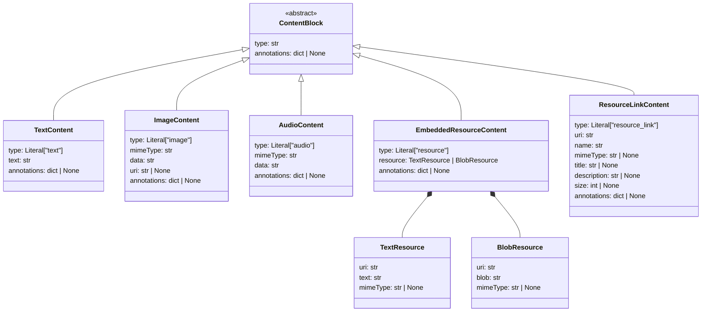
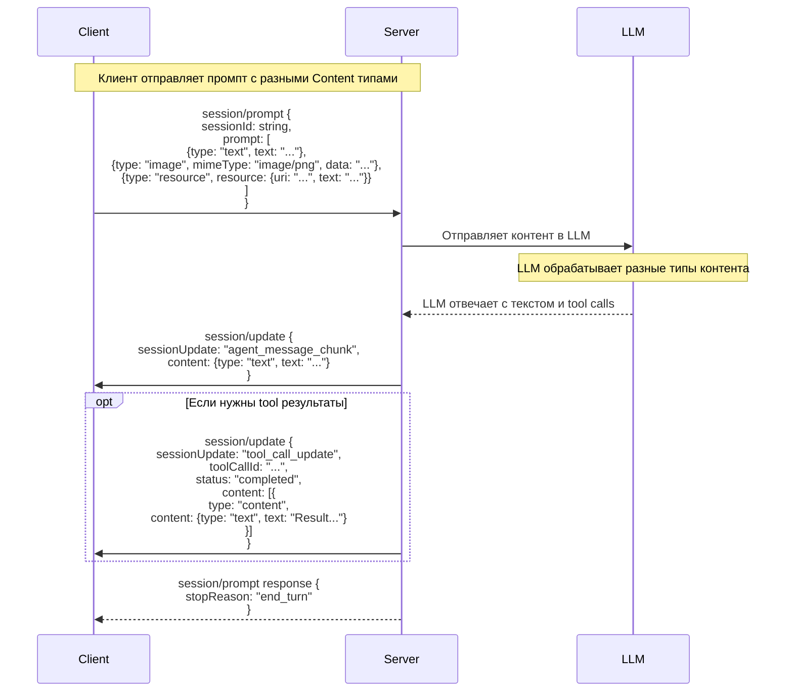
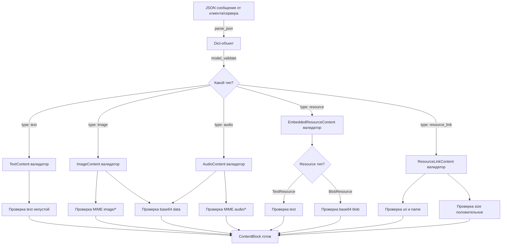

# Архитектура Content типов в ACP протоколе

## Обзор

Документ описывает архитектуру реализации Content типов (Content Blocks) для ACP протокола согласно спецификации [`doc/Agent Client Protocol/protocol/06-Content.md`](../Agent%20Client%20Protocol/protocol/06-Content.md).

Content блоки представляют структурированную информацию, которая передаётся:
- В пользовательских промптах через `session/prompt`
- В выходе языковой модели через `session/update`
- В результатах инструментов (tool calls)

## Спецификация Content типов

Согласно официальной спецификации, определены следующие типы Content:

### 1. Text Content
Простой текстовый контент.

```json
{
  "type": "text",
  "text": "User message",
  "annotations": { ... }  // опционально
}
```

**Обязательные поля:**
- `type`: Literal["text"]
- `text`: str

**Опциональные поля:**
- `annotations`: dict[str, Any] — метаданные для отображения

**Требования:**
- Все агенты ДОЛЖНЫ поддерживать text контент в промптах

### 2. Image Content
Изображения для анализа или контекста.

```json
{
  "type": "image",
  "mimeType": "image/png",
  "data": "iVBORw0KGgoAAAANSUhEUgAAAAEAAAAB...",
  "uri": "file:///path/to/image.png",  // опционально
  "annotations": { ... }  // опционально
}
```

**Обязательные поля:**
- `type`: Literal["image"]
- `mimeType`: str — e.g. "image/png", "image/jpeg"
- `data`: str — base64-кодированные данные

**Опциональные поля:**
- `uri`: str — ссылка на источник
- `annotations`: dict[str, Any]

**Требования:**
- Требует `image` capability при включении в промпты

### 3. Audio Content
Аудиоданные для транскрипции или анализа.

```json
{
  "type": "audio",
  "mimeType": "audio/wav",
  "data": "UklGRiQAAABXQVZFZm10IBAAAAABAAEAQB8AAAB...",
  "annotations": { ... }  // опционально
}
```

**Обязательные поля:**
- `type`: Literal["audio"]
- `mimeType`: str — e.g. "audio/wav", "audio/mp3"
- `data`: str — base64-кодированные данные

**Опциональные поля:**
- `annotations`: dict[str, Any]

**Требования:**
- Требует `audio` capability при включении в промпты

### 4. Embedded Resource
Полное содержимое ресурса, встроенное прямо в сообщение.

```json
{
  "type": "resource",
  "resource": {
    "uri": "file:///home/user/script.py",
    "mimeType": "text/x-python",
    "text": "def hello():\n    print('Hello, world!')"
  },
  "annotations": { ... }  // опционально
}
```

**Обязательные поля:**
- `type`: Literal["resource"]
- `resource`: EmbeddedResource — может быть TextResource или BlobResource

**EmbeddedResource (TextResource):**
- `uri`: str
- `text`: str
- `mimeType`: str (опционально)

**EmbeddedResource (BlobResource):**
- `uri`: str
- `blob`: str — base64-кодированные бинарные данные
- `mimeType`: str (опционально)

**Опциональные поля:**
- `annotations`: dict[str, Any]

**Требования:**
- Требует `embeddedContext` capability при включении в промпты
- Предпочтительный способ включить контекст в промпты (например, через @-mentions)

### 5. Resource Link
Ссылки на ресурсы, доступные агенту.

```json
{
  "type": "resource_link",
  "uri": "file:///home/user/document.pdf",
  "name": "document.pdf",
  "mimeType": "application/pdf",
  "title": "My Document",
  "description": "A PDF document",
  "size": 1024000,
  "annotations": { ... }  // опционально
}
```

**Обязательные поля:**
- `type`: Literal["resource_link"]
- `uri`: str
- `name`: str — человеко-читаемое имя

**Опциональные поля:**
- `mimeType`: str
- `title`: str — дополнительный заголовок для отображения
- `description`: str — описание контента
- `size`: int — размер в байтах
- `annotations`: dict[str, Any]

## Архитектура реализации

### 1. Иерархия dataclasses

```
ContentBlock (базовый класс)
├── TextContent
├── ImageContent
├── AudioContent
├── EmbeddedResourceContent
│   ├── TextResourceContent (вариант EmbeddedResourceContent)
│   └── BlobResourceContent (вариант EmbeddedResourceContent)
└── ResourceLinkContent
```

### 2. Дизайн класса

Используем **discriminated union** (дискриминированное объединение) с типом `type` для различения:

```python
from typing import Literal, Union
from pydantic import BaseModel, Field, ConfigDict

# Базовые компоненты для вложенных ресурсов
class TextResource(BaseModel):
    """Текстовый ресурс внутри EmbeddedResourceContent."""
    uri: str
    text: str
    mimeType: str | None = None

class BlobResource(BaseModel):
    """Бинарный ресурс внутри EmbeddedResourceContent."""
    uri: str
    blob: str  # base64-кодированные данные
    mimeType: str | None = None

# Объединение вариантов ресурсов
EmbeddedResource = Union[TextResource, BlobResource]

# Content блоки
class TextContent(BaseModel):
    """Text content block."""
    type: Literal["text"] = "text"
    text: str
    annotations: dict[str, Any] | None = None

class ImageContent(BaseModel):
    """Image content block."""
    type: Literal["image"] = "image"
    mimeType: str
    data: str  # base64-кодированные данные
    uri: str | None = None
    annotations: dict[str, Any] | None = None

class AudioContent(BaseModel):
    """Audio content block."""
    type: Literal["audio"] = "audio"
    mimeType: str
    data: str  # base64-кодированные данные
    annotations: dict[str, Any] | None = None

class EmbeddedResourceContent(BaseModel):
    """Embedded resource content block."""
    type: Literal["resource"] = "resource"
    resource: EmbeddedResource
    annotations: dict[str, Any] | None = None

class ResourceLinkContent(BaseModel):
    """Resource link content block."""
    type: Literal["resource_link"] = "resource_link"
    uri: str
    name: str
    mimeType: str | None = None
    title: str | None = None
    description: str | None = None
    size: int | None = None
    annotations: dict[str, Any] | None = None

# Discriminated union
ContentBlock = Union[
    TextContent,
    ImageContent,
    AudioContent,
    EmbeddedResourceContent,
    ResourceLinkContent,
]
```

### 3. Валидаторы и ограничения

**TextContent:**
- `text` должен быть непустой строкой

**ImageContent:**
- `mimeType` должен быть валидным MIME-типом для изображения (image/*)
- `data` должна быть валидной base64-строкой
- `uri` опционально, но если указан, должен быть валидным URI

**AudioContent:**
- `mimeType` должен быть валидным MIME-типом для аудио (audio/*)
- `data` должна быть валидной base64-строкой

**EmbeddedResourceContent:**
- `resource` должна иметь валидный discriminator для выбора TextResource/BlobResource
- Для TextResource: `text` должен быть непустым
- Для BlobResource: `blob` должна быть валидной base64-строкой

**ResourceLinkContent:**
- `uri` и `name` должны быть непустыми
- `size` если указан, должен быть положительным
- `mimeType` опционально, но если указан, должен быть валидным

### 4. Сериализация/Десериализация

Используем Pydantic `model_validate()` и `model_dump()`:

```python
# Десериализация из JSON
payload = {
    "type": "text",
    "text": "Hello, world!",
    "annotations": None
}
content = TextContent.model_validate(payload)
# или через discriminated union:
content = ContentBlock.model_validate(payload)

# Сериализация в JSON
json_dict = content.model_dump(exclude_none=True)
json_str = content.model_dump_json(exclude_none=True)
```

## Интеграция с ACPMessage

Content блоки встраиваются в существующие структуры:

### 1. session/prompt параметры

```python
class PromptParams(BaseModel):
    """Параметры метода session/prompt."""
    sessionId: str
    prompt: list[ContentBlock]  # Массив Content блоков
```

### 2. session/update уведомления

```python
class AgentMessageChunkUpdate(BaseModel):
    """Agent message chunk update."""
    sessionUpdate: Literal["agent_message_chunk"]
    content: ContentBlock  # Один Content блок

class ToolCallContentUpdate(BaseModel):
    """Tool call content update."""
    content: list[dict[str, ContentBlock]]  # Массив с контентом
```

## Диаграмма классов



## Диаграмма взаимодействия (Prompt Turn с разными типами Content)



## Цепочка валидации



## Структура файлов для реализации

### codelab.server

```
codelab/
├── src/codelab/src/codelab/server/
│   ├── protocol/
│   │   ├── content/
│   │   │   ├── __init__.py                # Экспорт публичных классов
│   │   │   ├── types.py                   # Dataclasses Content типов
│   │   │   ├── validators.py              # Валидаторы для контента
│   │   │   └── serializers.py             # Сериализация/десериализация
│   │   └── ...
│   ├── messages.py                        # Обновить: интеграция ContentBlock
│   └── ...
└── tests/
    └── test_content/
        ├── test_text_content.py
        ├── test_image_content.py
        ├── test_audio_content.py
        ├── test_embedded_resource.py
        ├── test_resource_link.py
        └── test_content_validation.py
```

### codelab.client

```
codelab/
├── src/codelab/src/codelab/client/
│   ├── infrastructure/
│   │   ├── message_parser.py              # Обновить: парсинг ContentBlock
│   │   └── ...
│   └── ...
└── tests/
    └── test_content/
        ├── test_content_parsing.py
        └── test_content_serialization.py
```

## Изменения в существующем коде

### messages.py в обоих проектах

**codelab/src/codelab/server/messages.py:**
```python
# Добавить импорт Content типов
from codelab.server.protocol.content import ContentBlock

# Обновить PromptParams
class PromptParams(BaseModel):
    sessionId: str
    prompt: list[ContentBlock]  # Вместо list[dict[str, Any]]

# Обновить AgentMessageChunkUpdate
class AgentMessageChunkUpdate(BaseModel):
    sessionUpdate: Literal["agent_message_chunk"]
    content: ContentBlock  # Вместо dict[str, Any]
```

**codelab/src/codelab/client/messages.py:**
```python
# Аналогично для клиента
from codelab.client.protocol.content import ContentBlock

# Обновить типизацию
class PromptParams(BaseModel):
    sessionId: str
    prompt: list[ContentBlock]
```

### message_parser.py

**codelab/src/codelab/client/infrastructure/message_parser.py:**
```python
# Добавить методы для парсинга Content блоков
class MessageParser:
    @staticmethod
    def parse_content_block(data: dict[str, Any]) -> ContentBlock:
        """Парсит Content блок с автоматическим выбором типа."""
        return ContentBlock.model_validate(data)
    
    @staticmethod
    def parse_content_blocks(data: list[dict[str, Any]]) -> list[ContentBlock]:
        """Парсит массив Content блоков."""
        return [ContentBlock.model_validate(item) for item in data]
```

## Примеры использования

### Создание Content блоков

```python
from codelab.server.protocol.content import (
    TextContent,
    ImageContent,
    ResourceLinkContent,
    EmbeddedResourceContent,
    TextResource,
)

# Text контент
text = TextContent(text="Hello, world!")

# Image контент
image = ImageContent(
    mimeType="image/png",
    data="iVBORw0KGgo...",  # base64-кодированные данные
    uri="file:///path/to/image.png"
)

# Embedded resource (текстовый)
resource = EmbeddedResourceContent(
    resource=TextResource(
        uri="file:///script.py",
        text="def hello():\n    print('hello')",
        mimeType="text/x-python"
    )
)

# Resource link
link = ResourceLinkContent(
    uri="file:///document.pdf",
    name="document.pdf",
    mimeType="application/pdf",
    size=1024000
)
```

### Сериализация в JSON

```python
import json

text = TextContent(text="Hello")
json_dict = text.model_dump(exclude_none=True)
# {"type": "text", "text": "Hello"}

json_str = text.model_dump_json(exclude_none=True)
# '{"type":"text","text":"Hello"}'
```

### Десериализация из JSON

```python
from codelab.server.protocol.content import ContentBlock

payload = {
    "type": "text",
    "text": "Hello, world!"
}

content = ContentBlock.model_validate(payload)
assert isinstance(content, TextContent)
assert content.text == "Hello, world!"
```

## Требования к реализации

1. **Соответствие спецификации:** Все классы должны точно соответствовать спецификации в `doc/Agent Client Protocol/protocol/06-Content.md`

2. **Типизация Python 3.12+:** Использовать современные type hints (Union, Literal, etc.)

3. **Валидация:** Каждый тип должен иметь валидаторы для обязательных полей и ограничений

4. **Сериализация:** Пользовать Pydantic для JSON сериализации/десериализации

5. **Тестирование:** 100% покрытие unit тестами для всех типов и валидаторов

6. **Интеграция:** Без нарушения существующих публичных интерфейсов CLI

7. **Документация:** Docstrings на русском языке в коде

## Дальнейшие этапы (Этап 2 и выше)

После реализации базовой инфраструктуры Content типов (Этап 1):

- **Этап 2:** Интеграция с handlers протокола (prompt handler, state manager)
- **Этап 3:** Поддержка capabilities validation в initialize
- **Этап 4:** Обработка различных типов Content в prompt turn
- **Этап 5:** Тесты интеграции с реальными сценариями использования

## Заключение

Архитектура Content типов обеспечивает:
- ✅ Полную типизацию и валидацию
- ✅ Чистое разделение между разными типами контента
- ✅ Минимальные изменения в существующем коде
- ✅ Возможность расширения без нарушения протокола
- ✅ Полное соответствие спецификации ACP

Реализация готова к переводу в режим Code для создания модулей и написания кода.
