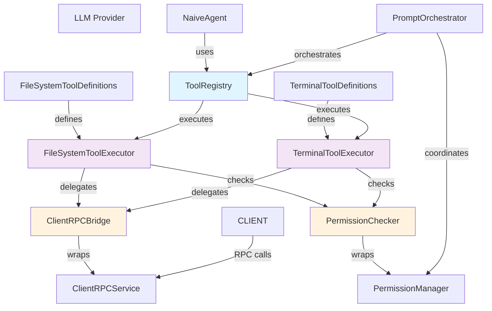
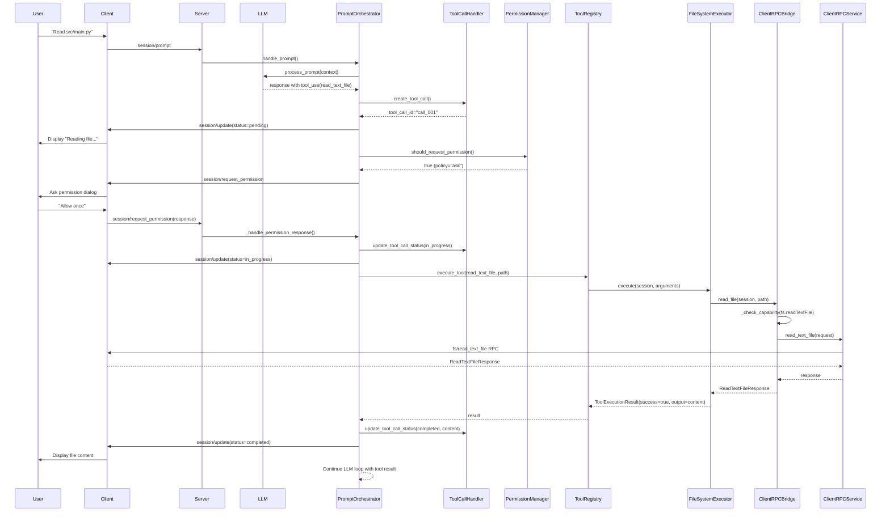
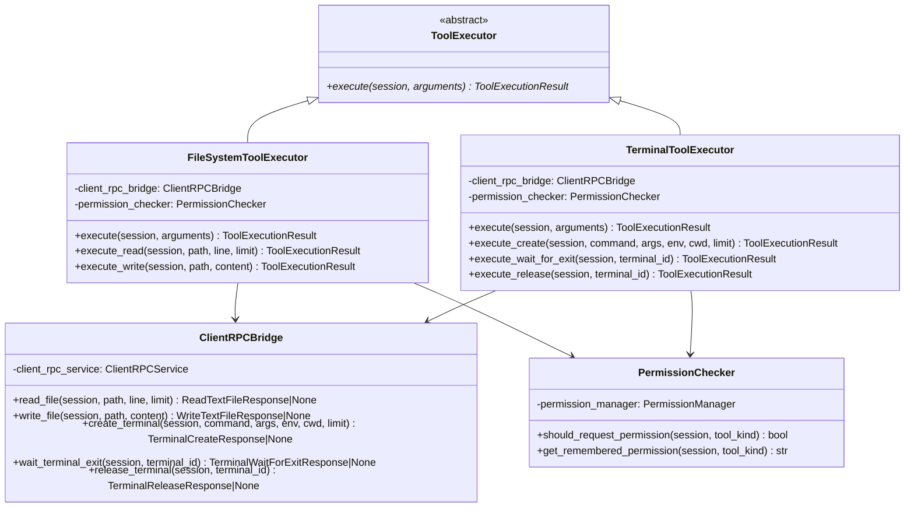
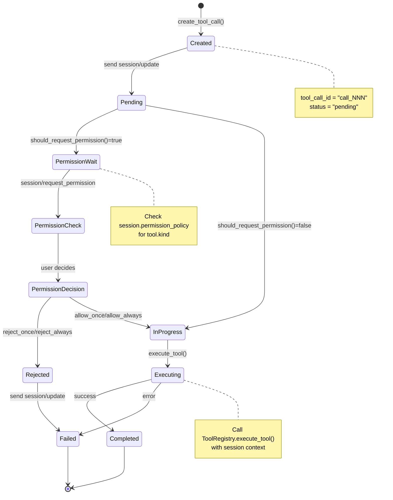

# Tool Calls Integration Architecture

## 1. Обзор

Этот документ описывает архитектуру интеграции File System и Terminal методов в систему Tool Calls ACP сервера. Система позволяет LLM агентам безопасно получать доступ к локальной среде клиента через структурированный механизм инструментов.

### Ключевые компоненты

- **Tool Registry**: Реестр для регистрации и выполнения инструментов
- **Tool Executors**: Асинхронные выполнители для fs/* и terminal/* операций
- **ClientRPC Integration**: Связь между tool executors и ClientRPCService
- **Permission Flow**: Механизм запроса разрешений перед выполнением операций
- **Notification System**: Система уведомлений session/update о статусе tool calls

### Требования ACP протокола

Согласно спецификации:
- **fs/read_text_file**: Чтение файлов с поддержкой line и limit
- **fs/write_text_file**: Запись файлов с поддержкой diff и tracking
- **terminal/create**: Создание терминала
- **terminal/wait_for_exit**: Ожидание завершения процесса
- **terminal/release**: Освобождение терминала
- **Permissions**: Механизм ask-режима для запроса разрешений

---

## 2. Модульная структура

### Директория: `codelab/src/codelab/server/tools/`

```
tools/
├── __init__.py                   # Публичный экспорт
├── base.py                       # Базовые интерфейсы (существует)
├── registry.py                   # SimpleToolRegistry (существует)
├── executors/
│   ├── __init__.py              # Экспорт executors
│   ├── base.py                  # Базовый класс для всех executors
│   ├── filesystem_executor.py   # FileSystemToolExecutor
│   └── terminal_executor.py     # TerminalToolExecutor
├── definitions/
│   ├── __init__.py              # Экспорт definitions
│   ├── filesystem.py            # FileSystemToolDefinitions
│   └── terminal.py              # TerminalToolDefinitions
└── integrations/
    ├── __init__.py              # Экспорт integrations
    ├── client_rpc_bridge.py      # ClientRPCBridge (адаптер для ClientRPCService)
    └── permission_checker.py     # PermissionChecker (адаптер для PermissionManager)
```

### Классы и интерфейсы

#### `tools/executors/base.py`

```python
class ToolExecutor(ABC):
    """Базовый класс для всех executors инструментов."""
    
    @abstractmethod
    async def execute(
        self,
        session: SessionState,
        arguments: dict[str, Any],
    ) -> ToolExecutionResult:
        """Выполнить инструмент."""
        pass
```

#### `tools/executors/filesystem_executor.py`

```python
class FileSystemToolExecutor(ToolExecutor):
    """Executor для файловых операций через ClientRPC.
    
    Поддерживает:
    - fs/read_text_file (с line и limit)
    - fs/write_text_file (с diff tracking)
    """
    
    def __init__(
        self,
        client_rpc_bridge: ClientRPCBridge,
        permission_checker: PermissionChecker,
    ):
        """Инициализация с зависимостями."""
        pass
    
    async def execute_read(
        self,
        session: SessionState,
        path: str,
        line: int | None = None,
        limit: int | None = None,
    ) -> ToolExecutionResult:
        """Чтение текстового файла через ClientRPC."""
        pass
    
    async def execute_write(
        self,
        session: SessionState,
        path: str,
        content: str,
    ) -> ToolExecutionResult:
        """Запись текстового файла через ClientRPC с diff tracking."""
        pass
```

#### `tools/executors/terminal_executor.py`

```python
class TerminalToolExecutor(ToolExecutor):
    """Executor для терминальных операций через ClientRPC.
    
    Поддерживает:
    - terminal/create (запуск команды)
    - terminal/wait_for_exit (ожидание завершения)
    - terminal/release (освобождение терминала)
    """
    
    def __init__(
        self,
        client_rpc_bridge: ClientRPCBridge,
        permission_checker: PermissionChecker,
    ):
        """Инициализация с зависимостями."""
        pass
    
    async def execute_create(
        self,
        session: SessionState,
        command: str,
        args: list[str] | None = None,
        env: dict[str, str] | None = None,
        cwd: str | None = None,
        output_byte_limit: int | None = None,
    ) -> ToolExecutionResult:
        """Создать терминал и запустить команду."""
        pass
    
    async def execute_wait_for_exit(
        self,
        session: SessionState,
        terminal_id: str,
    ) -> ToolExecutionResult:
        """Ожидать завершения терминала и получить exit code."""
        pass
    
    async def execute_release(
        self,
        session: SessionState,
        terminal_id: str,
    ) -> ToolExecutionResult:
        """Освободить терминал."""
        pass
```

#### `tools/definitions/filesystem.py`

```python
class FileSystemToolDefinitions:
    """Фабрика для создания определений файловых инструментов."""
    
    @staticmethod
    def read_text_file() -> tuple[ToolDefinition, Callable]:
        """Создать определение и executor для fs/read_text_file."""
        pass
    
    @staticmethod
    def write_text_file() -> tuple[ToolDefinition, Callable]:
        """Создать определение и executor для fs/write_text_file."""
        pass
```

#### `tools/definitions/terminal.py`

```python
class TerminalToolDefinitions:
    """Фабрика для создания определений терминальных инструментов."""
    
    @staticmethod
    def create() -> tuple[ToolDefinition, Callable]:
        """Создать определение и executor для terminal/create."""
        pass
    
    @staticmethod
    def wait_for_exit() -> tuple[ToolDefinition, Callable]:
        """Создать определение и executor для terminal/wait_for_exit."""
        pass
    
    @staticmethod
    def release() -> tuple[ToolDefinition, Callable]:
        """Создать определение и executor для terminal/release."""
        pass
```

#### `tools/integrations/client_rpc_bridge.py`

```python
class ClientRPCBridge:
    """Адаптер, предоставляющий ClientRPCService executors.
    
    Задачи:
    - Инкапсулировать ClientRPCService
    - Проверять capabilities перед вызовами
    - Преобразовывать исключения в ToolExecutionResult
    """
    
    def __init__(self, client_rpc_service: ClientRPCService):
        """Инициализация с ClientRPCService."""
        pass
    
    async def read_file(
        self,
        session: SessionState,
        path: str,
        line: int | None = None,
        limit: int | None = None,
    ) -> ReadTextFileResponse | None:
        """Прокси для ClientRPCService.read_text_file."""
        pass
    
    async def write_file(
        self,
        session: SessionState,
        path: str,
        content: str,
    ) -> WriteTextFileResponse | None:
        """Прокси для ClientRPCService.write_text_file."""
        pass
    
    async def create_terminal(
        self,
        session: SessionState,
        command: str,
        args: list[str] | None = None,
        env: dict[str, str] | None = None,
        cwd: str | None = None,
        output_byte_limit: int | None = None,
    ) -> TerminalCreateResponse | None:
        """Прокси для ClientRPCService.create_terminal."""
        pass
    
    async def wait_terminal_exit(
        self,
        session: SessionState,
        terminal_id: str,
    ) -> TerminalWaitForExitResponse | None:
        """Прокси для ClientRPCService.wait_for_exit."""
        pass
    
    async def release_terminal(
        self,
        session: SessionState,
        terminal_id: str,
    ) -> TerminalReleaseResponse | None:
        """Прокси для ClientRPCService.release."""
        pass
```

#### `tools/integrations/permission_checker.py`

```python
class PermissionChecker:
    """Адаптер для проверки разрешений через PermissionManager.
    
    Задачи:
    - Определять, нужно ли запрашивать разрешение
    - Получать remembered permissions
    - Интегрироваться с PromptOrchestrator для ask-режима
    """
    
    def __init__(self, permission_manager: PermissionManager):
        """Инициализация с PermissionManager."""
        pass
    
    def should_request_permission(
        self,
        session: SessionState,
        tool_kind: str,
    ) -> bool:
        """Нужно ли запросить разрешение?"""
        pass
    
    def get_remembered_permission(
        self,
        session: SessionState,
        tool_kind: str,
    ) -> str:
        """Получить remembered permission (allow/reject/ask)."""
        pass
```

---

## 3. Tool Definitions спецификация

### 3.1 fs/read_text_file

**Назначение**: Чтение текстового файла с поддержкой partial reads.

**ToolDefinition**:
```python
ToolDefinition(
    name="read_text_file",
    description="Read text file content from client filesystem. Supports line numbers and limits for partial reads.",
    parameters={
        "type": "object",
        "properties": {
            "path": {
                "type": "string",
                "description": "Absolute file path"
            },
            "line": {
                "type": "integer",
                "description": "Starting line number (1-based, optional)"
            },
            "limit": {
                "type": "integer",
                "description": "Maximum number of lines to read (optional)"
            }
        },
        "required": ["path"]
    },
    kind="read",
    requires_permission=True,
)
```

**Процесс выполнения**:
1. Проверить capability `fs.readTextFile`
2. Проверить разрешение (permission flow)
3. Вызвать `ClientRPCService.read_text_file()`
4. Вернуть содержимое в `output`

**Пример результата**:
```python
ToolExecutionResult(
    success=True,
    output="def hello():\n    print('Hello, world!')\n",
)
```

### 3.2 fs/write_text_file

**Назначение**: Запись текстового файла с diff tracking.

**ToolDefinition**:
```python
ToolDefinition(
    name="write_text_file",
    description="Write or update text file in client filesystem. Supports diff generation for tracking changes.",
    parameters={
        "type": "object",
        "properties": {
            "path": {
                "type": "string",
                "description": "Absolute file path"
            },
            "content": {
                "type": "string",
                "description": "File content to write"
            }
        },
        "required": ["path", "content"]
    },
    kind="edit",
    requires_permission=True,
)
```

**Процесс выполнения**:
1. Проверить capability `fs.writeTextFile`
2. Проверить разрешение (permission flow)
3. Прочитать старое содержимое (для diff)
4. Вызвать `ClientRPCService.write_text_file()`
5. Генерировать diff между старым и новым
6. Вернуть результат с diff в metadata

**Метаданные для session/update**:
```python
{
    "sessionUpdate": "tool_call_update",
    "toolCallId": "call_NNN",
    "status": "completed",
    "content": [{
        "type": "content",
        "content": {
            "type": "text",
            "text": "[unified diff здесь]",
            "mimeType": "application/vnd.acp.diff"
        }
    }]
}
```

### 3.3 terminal/create

**Назначение**: Создание нового терминала и запуск команды.

**ToolDefinition**:
```python
ToolDefinition(
    name="execute_command",
    description="Create a new terminal and execute a command. Returns terminal ID for subsequent operations.",
    parameters={
        "type": "object",
        "properties": {
            "command": {
                "type": "string",
                "description": "Command to execute"
            },
            "args": {
                "type": "array",
                "items": {"type": "string"},
                "description": "Command arguments (optional)"
            },
            "env": {
                "type": "object",
                "description": "Environment variables (optional)",
                "additionalProperties": {"type": "string"}
            },
            "cwd": {
                "type": "string",
                "description": "Working directory (optional)"
            },
            "output_byte_limit": {
                "type": "integer",
                "description": "Maximum output bytes to retain (optional)"
            }
        },
        "required": ["command"]
    },
    kind="execute",
    requires_permission=True,
)
```

**Процесс выполнения**:
1. Проверить capability `terminal`
2. Проверить разрешение (permission flow)
3. Вызвать `ClientRPCService.create_terminal()`
4. Получить и сохранить `terminal_id` в session state
5. Вернуть результат с `terminal_id` в metadata

**Метаданные для session/update**:
```python
{
    "sessionUpdate": "tool_call_update",
    "toolCallId": "call_NNN",
    "status": "in_progress",
    "metadata": {
        "terminal_id": "term_xyz789"
    }
}
```

---

## 4. Tool Executors дизайн

### 4.1 Сигнатура executor функции

Все executor функции должны соответствовать сигнатуре для регистрации в ToolRegistry:

```python
async def executor(
    session_id: str,
    tool_name: str,
    arguments: dict[str, Any],
    # Дополнительные контексты (через closure):
    session: SessionState,
    client_rpc_bridge: ClientRPCBridge,
    permission_checker: PermissionChecker,
    tool_call_handler: ToolCallHandler,
) -> ToolExecutionResult:
    """Выполнить инструмент и вернуть результат."""
    pass
```

### 4.2 Обработка ошибок

```python
class ToolExecutionError(Exception):
    """Базовый класс для ошибок выполнения инструментов."""
    pass

class CapabilityNotSupportedError(ToolExecutionError):
    """Клиент не поддерживает требуемую capability."""
    pass

class PermissionDeniedError(ToolExecutionError):
    """Разрешение отклонено пользователем."""
    pass

class ClientRPCError(ToolExecutionError):
    """Ошибка при вызове ClientRPC."""
    pass
```

Все ошибки преобразуются в `ToolExecutionResult`:

```python
try:
    result = await executor(...)
except CapabilityNotSupportedError as e:
    return ToolExecutionResult(
        success=False,
        error=f"Capability not supported: {str(e)}"
    )
except PermissionDeniedError:
    return ToolExecutionResult(
        success=False,
        error="Permission denied by user"
    )
except Exception as e:
    return ToolExecutionResult(
        success=False,
        error=f"Tool execution failed: {str(e)}"
    )
```

### 4.3 Интеграция с Permission Flow

**Sequence**:

```
Executor → PermissionChecker.should_request_permission()
  ↓
  NO → Execute directly
  YES → Create pending request in PromptOrchestrator
  ↓
  Wait for session/request_permission response
  ↓
  User decision (allow_once, allow_always, reject_once, reject_always)
  ↓
  If allowed → Execute
  If rejected → Return ToolExecutionResult(success=False)
```

### 4.4 Интеграция с Tool Call Lifecycle

**Sequence**:

```
1. PromptOrchestrator sends session/update(status=pending)
2. Executor starts
3. Update status to in_progress (if long-running)
4. Execute operation via ClientRPC
5. Generate metadata (terminal_id, diff, etc.)
6. PromptOrchestrator sends session/update(status=completed)
```

---

## 5. Интеграция в AgentOrchestrator

### 5.1 Инъекция зависимостей

**Текущая сигнатура**:
```python
class AgentOrchestrator:
    def __init__(
        self,
        config: OrchestratorConfig,
        llm_provider: LLMProvider,
        tool_registry: ToolRegistry,
    ) -> None:
        pass
```

**Новые зависимости**:
- Нет новых зависимостей в `AgentOrchestrator`
- Все зависимости инъектируются в `ToolRegistry` при регистрации инструментов

### 5.2 Процесс регистрации инструментов

**Вызывается в момент создания AgentOrchestrator**:

```python
def _register_tools(self) -> None:
    """Регистрировать файловые и терминальные инструменты."""
    
    # FileSystem tools
    fs_exec = FileSystemToolExecutor(
        client_rpc_bridge=self.client_rpc_bridge,
        permission_checker=self.permission_checker,
    )
    
    for tool_def, handler in [
        FileSystemToolDefinitions.read_text_file(),
        FileSystemToolDefinitions.write_text_file(),
    ]:
        self.tool_registry.register(tool_def, handler)
    
    # Terminal tools
    term_exec = TerminalToolExecutor(
        client_rpc_bridge=self.client_rpc_bridge,
        permission_checker=self.permission_checker,
    )
    
    for tool_def, handler in [
        TerminalToolDefinitions.create(),
        TerminalToolDefinitions.wait_for_exit(),
        TerminalToolDefinitions.release(),
    ]:
        self.tool_registry.register(tool_def, handler)
```

### 5.3 Поток выполнения инструментов

```
LLM Response with tool_use
  ↓
NaiveAgent.process_prompt()
  ↓
Extract tool_call from response
  ↓
tool_registry.execute_tool(tool_name, arguments)
  ↓
Find executor function
  ↓
Call executor with session context
  ↓
Return ToolExecutionResult
  ↓
Feed result back to LLM (via NaiveAgent agentic loop)
```

---

## 6. Интеграция в PromptOrchestrator

### 6.1 Уточненная сигнатура handle_prompt

**Текущая версия**: Обрабатывает prompt и возвращает notifications

**Измененная версия**:

```python
class PromptOrchestrator:
    def __init__(
        self,
        state_manager: StateManager,
        plan_builder: PlanBuilder,
        turn_lifecycle_manager: TurnLifecycleManager,
        tool_call_handler: ToolCallHandler,
        permission_manager: PermissionManager,
        client_rpc_handler: ClientRPCHandler,
        tool_call_executor: ToolCallExecutor,  # NEW
    ):
        """NEW: Добавлена зависимость ToolCallExecutor."""
        pass
```

### 6.2 Обработка LLM response с tool calls

**Новый поток в handle_prompt**:

```python
async def handle_prompt(...) -> ProtocolOutcome:
    # ... existing code ...
    
    # Обработка ответа от LLM
    agent_response = await agent_orchestrator.process_prompt(...)
    
    # NEW: Обработка tool calls из response
    for tool_call in agent_response.tool_calls:
        notifications.extend(
            await self._handle_tool_call(
                session=session,
                tool_call=tool_call,
                agent_orchestrator=agent_orchestrator,
            )
        )
    
    # ... rest of code ...
```

### 6.3 Обработка single tool call

```python
async def _handle_tool_call(
    self,
    session: SessionState,
    tool_call: ToolCallInfo,
    agent_orchestrator: AgentOrchestrator,
) -> list[ACPMessage]:
    """Обработать один tool call с полным lifecycle.
    
    Stages:
    1. Создать tool_call_id (ToolCallHandler)
    2. Отправить session/update(pending)
    3. Проверить разрешение (PermissionManager) → ask-режим
    4. Выполнить инструмент (ToolRegistry)
    5. Обновить статус (in_progress, completed, failed)
    6. Вернуть notifications
    """
    notifications: list[ACPMessage] = []
    
    # Stage 1: Create tool call
    tool_call_id = self.tool_call_handler.create_tool_call(
        session=session,
        title=tool_call.name,
        kind=self._get_tool_kind(tool_call.name),
    )
    
    # Stage 2: Report pending
    notifications.append(
        self._build_tool_call_notification(
            session=session,
            tool_call_id=tool_call_id,
            status="pending",
        )
    )
    
    # Stage 3: Check permission
    should_ask = self.permission_manager.should_request_permission(
        session=session,
        tool_kind=self._get_tool_kind(tool_call.name),
    )
    
    if should_ask:
        # Async wait for permission
        permission_response = await self._wait_for_permission(
            session=session,
            tool_call_id=tool_call_id,
        )
        
        if permission_response.kind in ("reject_once", "reject_always"):
            # Report failure
            self.tool_call_handler.update_tool_call_status(
                session=session,
                tool_call_id=tool_call_id,
                status="failed",
            )
            notifications.append(
                self._build_tool_call_notification(
                    session=session,
                    tool_call_id=tool_call_id,
                    status="failed",
                )
            )
            return notifications
    
    # Stage 4: Execute
    self.tool_call_handler.update_tool_call_status(
        session=session,
        tool_call_id=tool_call_id,
        status="in_progress",
    )
    
    result = await agent_orchestrator.tool_registry.execute_tool(
        session_id=session.session_id,
        tool_name=tool_call.name,
        arguments=tool_call.arguments,
    )
    
    # Stage 5: Report result
    final_status = "completed" if result.success else "failed"
    content = self._build_tool_result_content(result)
    
    self.tool_call_handler.update_tool_call_status(
        session=session,
        tool_call_id=tool_call_id,
        status=final_status,
        content=content,
    )
    
    notifications.append(
        self._build_tool_call_notification(
            session=session,
            tool_call_id=tool_call_id,
            status=final_status,
        )
    )
    
    return notifications
```

### 6.4 Ask-режим и Permission requests

**Асинхронное ожидание разрешения**:

```python
async def _wait_for_permission(
    self,
    session: SessionState,
    tool_call_id: str,
) -> PermissionResponse:
    """Отправить session/request_permission и ждать ответа.
    
    Используется механизм pending requests из ClientRPCHandler.
    """
    # Создать pending request
    request_id = JsonRpcId(uuid.uuid4().hex)
    future: asyncio.Future = asyncio.Future()
    
    # Сохранить future в session
    session.pending_requests[request_id] = future
    
    # Отправить request
    request = self._build_permission_request(
        session=session,
        tool_call_id=tool_call_id,
        request_id=request_id,
    )
    
    # Ждать ответа с таймаутом
    try:
        response = await asyncio.wait_for(future, timeout=300)  # 5 минут
        return response
    except asyncio.TimeoutError:
        raise PermissionTimeoutError(
            f"Permission request {request_id} timed out"
        )
```

---

## 7. Permission Flow

### 7.1 Permission Policy

**Определено в SessionState**:

```python
permission_policy: dict[str, str] = {
    "read": "ask",      # ask, allow_always, reject_always
    "edit": "ask",
    "execute": "ask",
    "delete": "ask",
}
```

### 7.2 Процесс запроса разрешения

```
1. ToolCallHandler создает tool_call с статусом "pending"

2. PromptOrchestrator проверяет PermissionManager
   - Нужно ли запрашивать разрешение?
   
3. Если policy == "ask":
   a. Отправить session/request_permission
   b. Ждать ответа с timeout=300 сек
   c. Пользователь выбирает опцию:
      - allow_once: выполнить один раз
      - allow_always: выполнить и запомнить
      - reject_once: отклонить один раз
      - reject_always: отклонить и запомнить
   
4. Если policy == "allow_always":
   - Выполнить без запроса

5. Если policy == "reject_always":
   - Вернуть ошибку без выполнения

6. После выполнения:
   - Обновить permission_policy для allow_always
   - Сохранить решение
```

### 7.3 Permission request message

```python
{
    "jsonrpc": "2.0",
    "id": "<request_id>",
    "method": "session/request_permission",
    "params": {
        "sessionId": "<session_id>",
        "toolCall": {
            "toolCallId": "call_NNN",
        },
        "options": [
            {
                "optionId": "allow-once",
                "name": "Allow once",
                "kind": "allow_once"
            },
            {
                "optionId": "allow-always",
                "name": "Allow always",
                "kind": "allow_always"
            },
            {
                "optionId": "reject-once",
                "name": "Reject",
                "kind": "reject_once"
            },
            {
                "optionId": "reject-always",
                "name": "Reject always",
                "kind": "reject_always"
            }
        ]
    }
}
```

---

## 8. Диаграммы

### 8.1 Component Diagram



### 8.2 Sequence Diagram: Full Tool Execution Flow



### 8.3 Class Diagram: Executor Classes



### 8.4 State Diagram: Tool Call Lifecycle



---

## 9. Изменения в существующих модулях

### 9.1 `codelab/src/codelab/server/tools/base.py`

**Добавить метаданные для executor результатов**:

```python
@dataclass
class ToolExecutionResult:
    """Результат выполнения инструмента."""
    
    success: bool
    output: str | None = None
    error: str | None = None
    # NEW: Метаданные для специфичных инструментов
    metadata: dict[str, Any] | None = None  # terminal_id, diff, etc.
```

### 9.2 `codelab/src/codelab/server/tools/registry.py`

**Сделать async выполнение**:

```python
async def execute_tool(
    self,
    session_id: str,
    tool_name: str,
    arguments: dict[str, Any],
) -> ToolExecutionResult:
    """Выполнить инструмент (асинхронно)."""
    # Изменить вызов handler на await
    handler = self._handlers[tool_name]
    
    try:
        output = await handler(**arguments)
        # ... rest of code ...
    except Exception as exc:
        # ... error handling ...
```

### 9.3 `codelab/src/codelab/server/protocol/handlers/prompt_orchestrator.py`

**Добавить обработку tool calls**:

```python
class PromptOrchestrator:
    def __init__(
        self,
        # ... existing params ...
        tool_call_executor: ToolCallExecutor,  # NEW
    ):
        """Инициализация с executor для tool calls."""
        pass
    
    async def handle_prompt(...) -> ProtocolOutcome:
        # ... existing code ...
        
        # NEW: Обработка tool calls из response
        for tool_call in agent_response.tool_calls:
            notifications.extend(
                await self._handle_tool_call(...)
            )
        
        # ... rest of code ...
```

### 9.4 `codelab/src/codelab/server/agent/orchestrator.py`

**Добавить инъекцию зависимостей и регистрацию инструментов**:

```python
class AgentOrchestrator:
    def __init__(
        self,
        config: OrchestratorConfig,
        llm_provider: LLMProvider,
        tool_registry: ToolRegistry,
        # NEW: Зависимости для инструментов
        client_rpc_bridge: ClientRPCBridge,
        permission_checker: PermissionChecker,
    ) -> None:
        """Инициализация с зависимостями для инструментов."""
        self.config = config
        self.llm_provider = llm_provider
        self.tool_registry = tool_registry
        
        # Регистрировать инструменты
        self._register_tools(
            client_rpc_bridge,
            permission_checker,
        )
    
    def _register_tools(
        self,
        client_rpc_bridge: ClientRPCBridge,
        permission_checker: PermissionChecker,
    ) -> None:
        """Регистрировать файловые и терминальные инструменты."""
        # Регистрация fs/* и terminal/* tools
        pass
```

### 9.5 `codelab/src/codelab/server/protocol/state.py`

**Добавить поле для pending permission requests**:

```python
@dataclass
class SessionState:
    # ... existing fields ...
    
    # NEW: Для отслеживания pending permission requests
    pending_permission_requests: dict[str, asyncio.Future] = field(
        default_factory=dict
    )
```

### 9.6 `codelab/src/codelab/server/http_server.py`

**Обработка session/request_permission response**:

```python
async def handle_message(self, message: ACPMessage) -> None:
    # ... existing code ...
    
    if message.method == "session/request_permission":
        # NEW: Обработка response на permission request
        result = message.get("result")
        request_id = message.get("id")
        
        # Найти соответствующий future и вернуть результат
        if request_id in session.pending_permission_requests:
            future = session.pending_permission_requests.pop(request_id)
            future.set_result(result)
```

---

## 10. План реализации (пошаговый)

### Фаза 1: Инфраструктура executors (шаги 1-4)

- [ ] Шаг 1: Создать `tools/executors/base.py` с базовым классом `ToolExecutor`
- [ ] Шаг 2: Создать `tools/integrations/client_rpc_bridge.py` с адаптером `ClientRPCBridge`
- [ ] Шаг 3: Создать `tools/integrations/permission_checker.py` с адаптером `PermissionChecker`
- [ ] Шаг 4: Обновить `tools/base.py` для добавления metadata в `ToolExecutionResult`

### Фаза 2: FileSystem executors (шаги 5-8)

- [ ] Шаг 5: Создать `tools/executors/filesystem_executor.py` с `FileSystemToolExecutor`
- [ ] Шаг 6: Создать `tools/definitions/filesystem.py` с определениями инструментов
- [ ] Шаг 7: Реализовать `execute_read()` с поддержкой line и limit
- [ ] Шаг 8: Реализовать `execute_write()` с diff tracking

### Фаза 3: Terminal executors (шаги 9-12)

- [ ] Шаг 9: Создать `tools/executors/terminal_executor.py` с `TerminalToolExecutor`
- [ ] Шаг 10: Создать `tools/definitions/terminal.py` с определениями инструментов
- [ ] Шаг 11: Реализовать `execute_create()` с параметрами команды
- [ ] Шаг 12: Реализовать `execute_wait_for_exit()` и `execute_release()`

### Фаза 4: Интеграция в ToolRegistry (шаги 13-16)

- [ ] Шаг 13: Обновить `tools/registry.py` для async выполнения
- [ ] Шаг 14: Создать `tools/__init__.py` с публичным экспортом
- [ ] Шаг 15: Добавить регистрацию инструментов в `AgentOrchestrator`
- [ ] Шаг 16: Обновить `AgentOrchestrator` для инъекции зависимостей

### Фаза 5: Permission Flow (шаги 17-20)

- [ ] Шаг 17: Обновить `protocol/state.py` для pending permission requests
- [ ] Шаг 18: Реализовать `_wait_for_permission()` в PromptOrchestrator
- [ ] Шаг 19: Обновить `http_server.py` для обработки permission responses
- [ ] Шаг 20: Интегрировать permission checks в PromptOrchestrator

### Фаза 6: Tool Call Lifecycle (шаги 21-24)

- [ ] Шаг 21: Создать `_handle_tool_call()` в PromptOrchestrator
- [ ] Шаг 22: Интегрировать with ToolCallHandler для notifications
- [ ] Шаг 23: Реализовать metadata передачу в session/update
- [ ] Шаг 24: Обновить NaiveAgent для обработки tool results

### Фаза 7: Тестирование и документация (шаги 25-28)

- [ ] Шаг 25: Написать unit тесты для executors
- [ ] Шаг 26: Написать интеграционные тесты для full flow
- [ ] Шаг 27: Обновить README.md с примерами использования
- [ ] Шаг 28: Создать примеры для каждого инструмента

---

## 11. Обеспечение обратной совместимости

### 11.1 Несовместимые изменения

Нет несовместимых изменений с публичными интерфейсами:

- `ToolRegistry` интерфейс остается прежним
- `ToolDefinition` добавляется только опциональное поле `metadata`
- `ToolExecutionResult` добавляется только опциональное поле `metadata`

### 11.2 Migration path для legacy slash-команд

Текущие slash-команды (`/read`, `/write`, `/execute`) могут быть переучены на новую систему:

```python
class LegacySlashCommandAdapter:
    """Адаптер для миграции slash-команд на tool calls."""
    
    def adapt_slash_command(self, command: str, args: str) -> dict[str, Any]:
        """Преобразовать slash-команду в tool arguments."""
        if command == "/read":
            return {
                "path": args,
                "line": None,
                "limit": None,
            }
        elif command == "/write":
            # Parse args for path and content
            pass
        elif command == "/execute":
            # Parse args for command and arguments
            pass
```

---

## Заключение

Эта архитектура обеспечивает:

1. **Модульность**: Четкое разделение на executors, definitions и integrations
2. **Расширяемость**: Простое добавление новых инструментов через определения
3. **Безопасность**: Permission flow для ask-режима
4. **Надежность**: Полный lifecycle управления tool calls
5. **ACP соответствие**: Полная реализация спецификации протокола
6. **Обратная совместимость**: Никаких breaking changes в публичных интерфейсах

Система готова к реализации в 6 фазах по 4-5 шагов каждая.
