# FCM — Интеграция с AgentLoop и стратегиями

> **ARCHIVED.** Этот документ архивирован. Каноническая документация — в [`doc/internals/context-manager/`](../../context-manager/). См. также [ADR-002](../adr/ADR-002-context-manager-consolidation.md).


> **Версия:** 1.1  
> **Дата:** 25 июня 2026  
> **Статус:** Design Document  
> **Аудитория:** Разработчики, AI Agents
>
> **Изменения в v1.1 (согласование с каноном v2.3):**
> - §4.3 переписан без противоречия: кэш-хит устраняет RPC в `ClientRPCBridge`
>   (ADR-4), декоратор только наполняет кэш/scope в постобработке
> - Пути multi-agent стратегий исправлены на
>   `src/codelab/server/protocol/handlers/strategies/*_strategy.py`;
>   отмечено, что они ещё не существуют (есть только `single_strategy.py`)

---

## Оглавление

1. [Обзор интеграции](#1-обзор-интеграции)
2. [Ключевой принцип: hydration vs explicit scope management](#2-ключевой-принцип-hydration-vs-explicit-scope-management)
3. [Точки создания ContextItem](#3-точки-создания-contextitem)
4. [ClientRPC Tool Execution → FCM](#4-clientrpc-tool-execution--fcm)
5. [SingleStrategy + FCM](#5-singlestrategy--fcm)
6. [OrchestratedStrategy + FCM](#6-orchestratedstrategy--fcm)
7. [HierarchicalStrategy + FCM](#7-hierarchicalstrategy--fcm)
8. [ChoreographyStrategy + FCM](#8-choreographystrategy--fcm)
9. [Architecture Decision Records](#9-architecture-decision-records)
10. [Сравнительная таблица стратегий](#10-сравнительная-таблица-стратегий)

---

## 1. Обзор интеграции

### 1.1. Место FCM в архитектуре

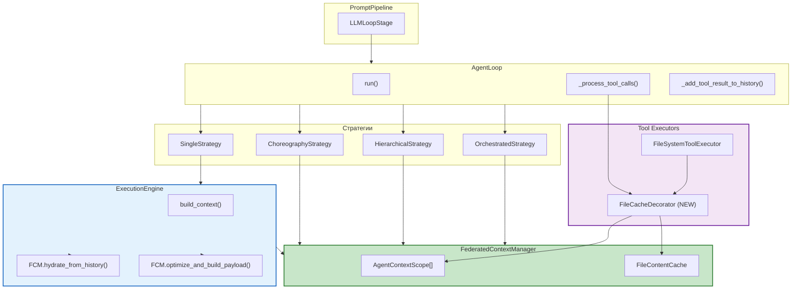
```mermaid
graph TB
    subgraph Pipeline["PromptPipeline"]
        LLMLoop["LLMLoopStage"]
    end
    
    subgraph AgentLoop["AgentLoop"]
        Run["run()"]
        Process["_process_tool_calls()"]
        AddHistory["_add_tool_result_to_history()"]
    end
    
    subgraph Strategies["Стратегии"]
        Single["SingleStrategy"]
        Orch["OrchestratedStrategy"]
        Hier["HierarchicalStrategy"]
        Chor["ChoreographyStrategy"]
    end
    
    subgraph Engine["ExecutionEngine"]
        BuildCtx["build_context()"]
        HydrateHist["FCM.hydrate_from_history()"]
        OptimizePay["FCM.optimize_and_build_payload()"]
    end
    
    subgraph FCM["FederatedContextManager"]
        Scopes["AgentContextScope[]"]
        FileCache["FileContentCache"]
    end
    
    subgraph Executors["Tool Executors"]
        FSExec["FileSystemToolExecutor"]
        FCMDecorator["FileCacheDecorator (NEW)"]
        FSExec --> FCMDecorator
    end

    LLMLoop --> AgentLoop
    AgentLoop --> Single
    AgentLoop --> Orch
    AgentLoop --> Hier
    AgentLoop --> Chor
    
    Single --> Engine
    Orch --> FCM
    Hier --> FCM
    Chor --> FCM
    
    Engine --> FCM
    Engine --> HydrateHist
    Engine --> OptimizePay
    
    Process --> FCMDecorator
    FCMDecorator --> FileCache
    FCMDecorator --> Scopes
    
    style FCM fill:#c8e6c9,stroke:#2e7d32,stroke-width:2px
    style Engine fill:#e3f2fd,stroke:#1565c0,stroke-width:2px
    style Executors fill:#f3e5f5,stroke:#6a1b9a,stroke-width:2px
```

### 1.2. Два механизма наполнения FCM

FCM наполняется контекстом двумя путями:

| Механизм | Когда | Кто | Что добавляет |
|----------|-------|-----|---------------|
| **`hydrate_from_history()`** | При каждом `build_context()` если scope не существует | ExecutionEngine | История сессии: system prompt, user messages, tool results |
| **`FileCacheDecorator`** | При успешном `fs/read` | Tool Executor Decorator | Содержимое файлов + FileContentCache |
| **Явное управление** | Multi-agent (Orchestrated, Hierarchical, Choreography) | Стратегия | Создание scope, add_to_scope, share_item |

---

## 2. Ключевой принцип: hydration vs explicit scope management

### 2.1. SingleStrategy — автоматическая гидратация

SingleStrategy не знает о FCM. `ExecutionEngine.build_context()` автоматически:

1. Проверяет: `exists scopes["single"]?`
2. Нет → вызывает `hydrate_from_history("single", session.history)`
3. Да → использует существующий scope
4. Вызывает `optimize_and_build_payload("single")`

```python
# ExecutionEngine._build_via_fcm() — псевдокод
async def _build_via_fcm(self, session, system_prompt, agent_scope="single"):
    scope = self.context_manager.scopes.get(agent_scope)
    
    if scope is None:
        # SingleStrategy всегда сюда попадает (нет pre-created scope)
        await self.context_manager.hydrate_from_history(
            scope_name=agent_scope,
            history=session.history,
            system_prompt=system_prompt,
        )
    # else: scope создан стратегией (Orchestrated/Hierarchical/Choreography)
    #   → используем без hydration
    
    return await self.context_manager.optimize_and_build_payload(agent_scope)
```

### 2.2. Multi-agent стратегии — явное управление

Orchestrated, Hierarchical и Choreography стратегии:
1. **Явно создают** скоупы через `fcm.create_scope()`
2. **Явно добавляют** контекст через `fcm.add_to_scope()`  
3. **Явно шарят** данные через `fcm.share_item()`
4. `ExecutionEngine.build_context(agent_scope="agent_name")` пропускает hydration — scope уже существует

---

## 3. Точки создания ContextItem

### 3.1. Таблица: Event → ContextItem

| Событие | item_id | type | priority | Кто создаёт |
|---------|---------|------|----------|-------------|
| Session start / hydration | `"system_prompt"` | `system_rules` | **10** | `hydrate_from_history()` |
| User message (turn N) | `f"user_{turn}"` | `user_prompt` | **8** | `hydrate_from_history()` |
| Assistant response (turn N) | `f"assistant_{turn}"` | `agent_report` | **7** | `hydrate_from_history()` |
| **fs/read (полный файл)** | **`file_path`** | **`file_content`** | **5** | **`FileCacheDecorator`** |
| **fs/read (partial)** | **`f"{path}:{line}:{limit}"`** | **`file_content`** | **5** | **`FileCacheDecorator`** |
| terminal/exec | `f"terminal_{id}"` | `terminal_output` | **5** | `FileCacheDecorator` |
| Search agent result | `"search_result_{N}"` | `agent_report` | **9** | Стратегия |
| TokenSlicer summary | `"summary_{agent}_{N}"` | `agent_report` | **8** | `SubAgentCoordinator` |
| Task delegation | `"task_{id}"` | `user_prompt` | **8** | `HierarchicalStrategy` |

### 3.2. FileCacheDecorator — новый Decorator для Tool Executors

`FileCacheDecorator` — единый декоратор в цепочке Tool Executors,
объединяющий ранее раздельные `FCMCachingDecorator` (read-cache + FCM scope)
и `CacheInvalidationDecorator` (write-invalidation).

```python
class FileCacheDecorator(ToolExecutorDecorator):
    """Кэширование результатов tool calls в FCM.
    
    Паттерн: Decorator (стандартный для проекта — как `MetricsDecorator`).
    
    Ответственности:
    - fs/read успех → FileContentCache.set() + FCM.add_to_scope()
    - fs/write успех → FileContentCache.invalidate()  [ветка _on_write того же декоратора]
    - terminal/exec → FCM.add_to_scope(type="terminal_output")
    
    НЕ отвечает за:
    - Создание scopes (это делают стратегии и ExecutionEngine)
    - Шеринг между агентами (это делают стратегии)
    """
    
    _FILE_READ_OPERATIONS = frozenset({"read"})
    _TERMINAL_TOOLS = frozenset({"terminal"})
    
    def __init__(
        self,
        wrapped: ToolExecutorProtocol,
        file_cache: FileContentCache,
        context_manager: ContextManager | None = None,
    ) -> None:
        super().__init__(wrapped)
        self._file_cache = file_cache
        self._context_manager = context_manager
    
    async def execute(
        self,
        session: SessionState,
        arguments: dict[str, Any],
    ) -> ToolExecutionResult:
        result = await self._wrapped.execute(session, arguments)
        
        if not result.success:
            return result
        
        tool_name = arguments.get("tool_name", "")
        operation = arguments.get("operation", "")
        
        # fs/read → кэшировать файл
        if operation in self._FILE_READ_OPERATIONS and result.output:
            path = arguments.get("path", "")
            line = arguments.get("line")
            limit = arguments.get("limit")
            
            is_full_read = line is None and limit is None
            
            if is_full_read:
                # Полный файл → кэшируем
                self._file_cache.set(path, result.output)
                item_id = path
            else:
                # Partial read → не кэшируем (нет смысла)
                item_id = f"{path}:{line}:{limit}"
            
            # Добавляем в FCM scope текущего агента
            if self._context_manager:
                scope_name = session.current_agent_scope or "single"
                await self._context_manager.add_to_scope(
                    scope_name=scope_name,
                    item_id=item_id,
                    content_type="file_content",
                    content=result.output,
                    priority=5,
                )
        
        # terminal/exec → добавляем в FCM (не кэшируем)
        elif "terminal" in tool_name and result.output:
            if self._context_manager:
                scope_name = session.current_agent_scope or "single"
                terminal_id = f"terminal_{session.session_id}_{id(result)}"
                await self._context_manager.add_to_scope(
                    scope_name=scope_name,
                    item_id=terminal_id,
                    content_type="terminal_output",
                    content=result.output,
                    priority=5,
                )
        
        return result
```

**Chain of Decorators (обновлённый):**

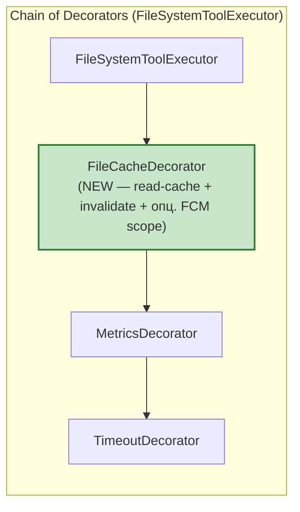
```mermaid
graph LR
    subgraph Chain["Chain of Decorators (FileSystemToolExecutor)"]
        Base["FileSystemToolExecutor"]
        FC["FileCacheDecorator<br/>(NEW — read-cache + invalidate + опц. FCM scope)"]
        Metrics["MetricsDecorator"]
        Timeout["TimeoutDecorator"]

        Base --> FC
        FC --> Metrics
        Metrics --> Timeout
    end

    style FC fill:#c8e6c9,stroke:#2e7d32,stroke-width:2px
```

### 3.3. SubAgentCoordinator — координатор вызова субагентов

`SubAgentCoordinator` заменяет `HybridContextManager`. Содержит **только** то, что FCM не покрывает:

```python
class SubAgentCoordinator:
    """Координатор вызова субагентов для мультиагентных стратегий.
    
    Инкапсулирует:
    - TokenSlicer: суммаризация ответов субагентов
    - SessionStorage: создание и связывание child sessions
    
    НЕ отвечает за:
    - Context compaction — это делает FCM.optimize_and_build_payload()
    - Хранение контекста — это делает FederatedContextManager
    - Шеринг между агентами — это делают стратегии через FCM.share_item()
    """
    
    def __init__(
        self,
        slicer: TokenSlicer,
        storage: SessionStorage,
        # ContextCompactor УДАЛЁН — FCM покрывает через DefaultContextCompactor
    ) -> None:
        self._slicer = slicer
        self._storage = storage
    
    async def process_subagent_response(
        self,
        session: SessionState,
        agent_name: str,
        response: AgentResponse,
        fcm: FederatedContextManager,
        target_scope: str,  # scope куда добавить summary
    ) -> SlicedResult:
        """Обработать ответ субагента.
        
        1. Создать child session
        2. TokenSlicer суммаризирует ответ
        3. FCM.add_to_scope() сохраняет summary в target_scope
        """
        # 1. Создать child session
        child = await self._storage.create_child_session(session)
        
        # 2. Суммаризировать
        sliced = await self._slicer.slice(response.text)
        
        # 3. Добавить summary в FCM (стратегия явно указывает куда)
        await fcm.add_to_scope(
            scope_name=target_scope,
            item_id=f"summary_{agent_name}_{child.session_id[:8]}",
            content_type="agent_report",
            content=sliced.summary,
            priority=9,
        )
        
        return SlicedResult(
            summary=sliced.summary,
            child_session_id=child.session_id,
            was_skipped=sliced.was_skipped,
        )
    
    # ensure_context_fits() УДАЛЁН — вместо него:
    # await fcm.optimize_and_build_payload(scope_name)
    # FCM вызывает DefaultContextCompactor автоматически при необходимости
```

**Сравнение: HybridContextManager vs SubAgentCoordinator:**

| | HybridContextManager (было) | SubAgentCoordinator (стало) |
|--|---|---|
| TokenSlicer | ✅ | ✅ |
| Child Session creation | ✅ | ✅ |
| ContextCompactor (`ensure_context_fits`) | ✅ | ❌ — FCM покрывает |
| Context storage (scopes) | ❌ | ❌ — FCM |
| `process_subagent_response` | ✅ | ✅ (сигнатура изменена: +fcm, +target_scope) |

### 3.4. `session.current_agent_scope` — текущий scope агента

Для корректной работы `FileCacheDecorator` сессия должна знать, в каком scope работает текущий агент:

```python
@dataclass
class SessionState:
    # ... existing fields ...
    current_agent_scope: str = "single"  # NEW
    """Имя FCM scope для текущего агента.
    
    Устанавливается:
    - AgentLoop: перед вызовом strategy.execute() → "single"
    - OrchestratedStrategy: перед вызовом sub-agent → "sub_agent_name"
    - HierarchicalStrategy: перед delegating → "sub_agent_name"
    - ChoreographyStrategy: перед broadcast → устанавливается каждому агенту
    """
```

---

## 4. ClientRPC Tool Execution → FCM

### 4.1. fs/read — полный файл (Full Read)

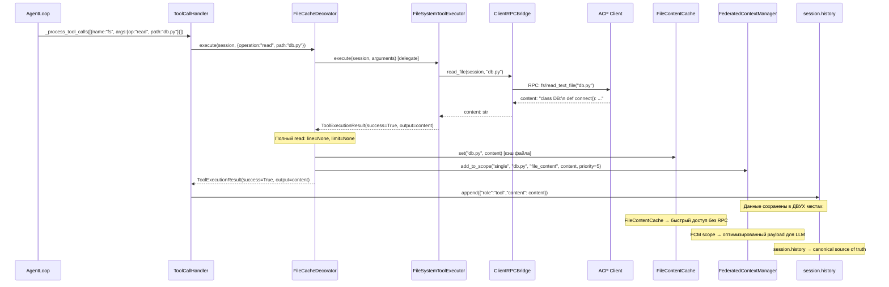
```mermaid
sequenceDiagram
    participant AL as AgentLoop
    participant TCH as ToolCallHandler
    participant Dec as FileCacheDecorator
    participant FSExec as FileSystemToolExecutor
    participant Bridge as ClientRPCBridge
    participant Client as ACP Client
    participant Cache as FileContentCache
    participant FCM as FederatedContextManager
    participant Sess as session.history

    AL->>TCH: _process_tool_calls([{name:"fs", args:{op:"read", path:"db.py"}}])
    TCH->>Dec: execute(session, {operation:"read", path:"db.py"})
    Dec->>FSExec: execute(session, arguments) [delegate]
    FSExec->>Bridge: read_file(session, "db.py")
    Bridge->>Client: RPC: fs/read_text_file("db.py")
    Client-->>Bridge: content: "class DB:\n    def connect(): ..."
    Bridge-->>FSExec: content: str
    FSExec-->>Dec: ToolExecutionResult(success=True, output=content)
    
    Note over Dec: Полный read: line=None, limit=None
    Dec->>Cache: set("db.py", content) [кэш файла]
    Dec->>FCM: add_to_scope("single", "db.py", "file_content", content, priority=5)
    Dec-->>TCH: ToolExecutionResult(success=True, output=content)
    
    TCH->>Sess: append({"role":"tool","content": content})
    
    Note over FCM,Sess: Данные сохранены в ДВУХ местах:
    Note over Cache: FileContentCache → быстрый доступ без RPC
    Note over FCM: FCM scope → оптимизированный payload для LLM
    Note over Sess: session.history → canonical source of truth
```

### 4.2. fs/read — частичное чтение (Partial Read)

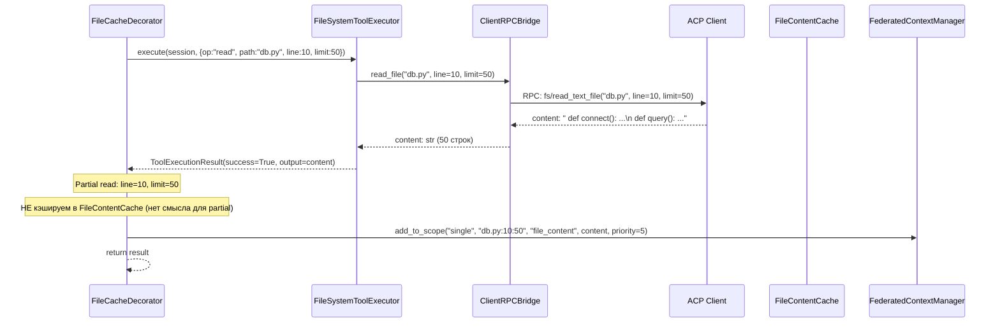
```mermaid
sequenceDiagram
    participant Dec as FileCacheDecorator
    participant FSExec as FileSystemToolExecutor
    participant Bridge as ClientRPCBridge
    participant Client as ACP Client
    participant Cache as FileContentCache
    participant FCM as FederatedContextManager

    Dec->>FSExec: execute(session, {op:"read", path:"db.py", line:10, limit:50})
    FSExec->>Bridge: read_file("db.py", line=10, limit=50)
    Bridge->>Client: RPC: fs/read_text_file("db.py", line=10, limit=50)
    Client-->>Bridge: content: "    def connect(): ...\n    def query(): ..."
    Bridge-->>FSExec: content: str (50 строк)
    FSExec-->>Dec: ToolExecutionResult(success=True, output=content)
    
    Note over Dec: Partial read: line=10, limit=50
    Note over Dec: НЕ кэшируем в FileContentCache (нет смысла для partial)
    Dec->>FCM: add_to_scope("single", "db.py:10:50", "file_content", content, priority=5)
    Dec-->>Dec: return result
```

**Примечание:** Partial reads используют составной `item_id = f"{path}:{line}:{limit}"`, что позволяет хранить несколько фрагментов одного файла.

### 4.3. fs/read — повторное чтение (Cache Hit)

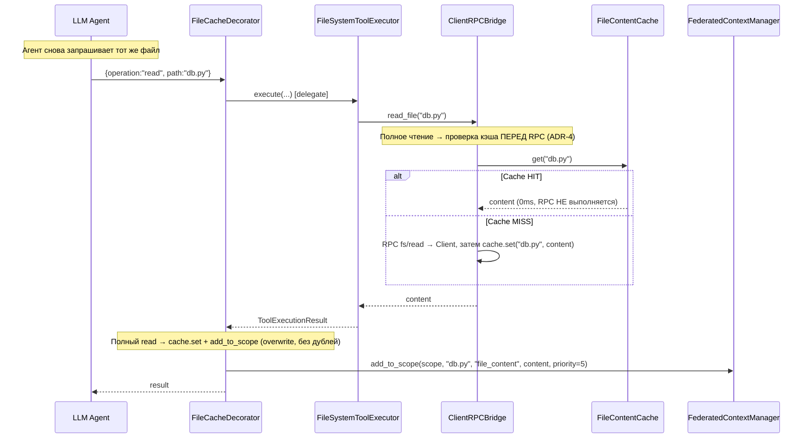
```mermaid
sequenceDiagram
    participant Agent as LLM Agent
    participant Dec as FileCacheDecorator
    participant FSExec as FileSystemToolExecutor
    participant Bridge as ClientRPCBridge
    participant Cache as FileContentCache
    participant FCM as FederatedContextManager

    Note over Agent: Агент снова запрашивает тот же файл
    Agent->>Dec: {operation:"read", path:"db.py"}
    Dec->>FSExec: execute(...) [delegate]
    FSExec->>Bridge: read_file("db.py")

    Note over Bridge: Полное чтение → проверка кэша ПЕРЕД RPC (ADR-4)
    Bridge->>Cache: get("db.py")
    alt Cache HIT
        Cache-->>Bridge: content (0ms, RPC НЕ выполняется)
    else Cache MISS
        Bridge->>Bridge: RPC fs/read → Client, затем cache.set("db.py", content)
    end
    Bridge-->>FSExec: content
    FSExec-->>Dec: ToolExecutionResult

    Note over Dec: Полный read → cache.set + add_to_scope (overwrite, без дублей)
    Dec->>FCM: add_to_scope(scope, "db.py", "file_content", content, priority=5)
    Dec-->>Agent: result
```

> **Где живёт кэш-хит.** RPC устраняется именно в `ClientRPCBridge` (ADR-4):
> Bridge проверяет `FileContentCache` перед обращением к клиенту. Декоратор
> не перехватывает RPC — он лишь наполняет кэш/scope в постобработке.

**Замечание по кэшированию на уровне Bridge:**

Для полного устранения повторных RPC запросов, `ClientRPCBridge.read_file()` должен проверять `FileContentCache` ПЕРЕД обращением к клиенту:

```python
class ClientRPCBridge:
    def __init__(self, ..., file_cache: FileContentCache | None = None):
        self._file_cache = file_cache
    
    async def read_file(self, session, path, line=None, limit=None) -> str | None:
        # Проверяем кэш только для полных чтений
        if self._file_cache and line is None and limit is None:
            cached = self._file_cache.get(path)
            if cached is not None:
                logger.debug("file_cache_hit", path=path, session_id=session.session_id)
                return cached
        
        # Cache miss → идём к клиенту
        content = await self._rpc_client.call("fs/read_text_file", ...)
        
        # Кэшируем полное чтение
        if self._file_cache and line is None and limit is None and content:
            self._file_cache.set(path, content)
        
        return content
```

### 4.4. fs/write — инвалидация кэша

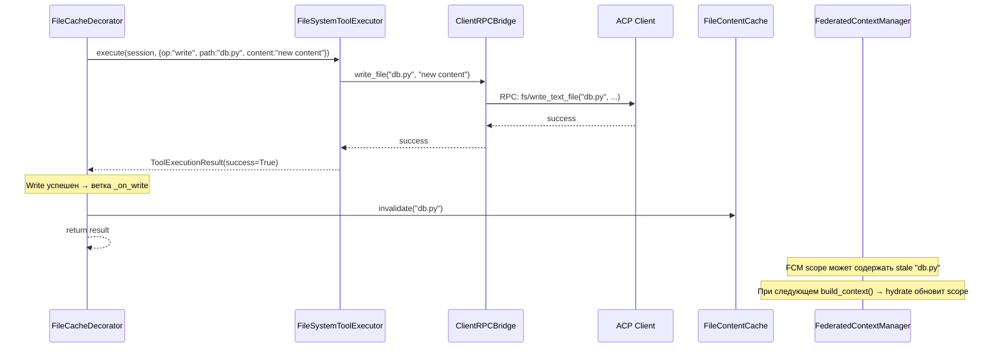
```mermaid
sequenceDiagram
    participant Dec as FileCacheDecorator
    participant FSExec as FileSystemToolExecutor
    participant Bridge as ClientRPCBridge
    participant Client as ACP Client
    participant Cache as FileContentCache
    participant FCM as FederatedContextManager

    Dec->>FSExec: execute(session, {op:"write", path:"db.py", content:"new content"})
    FSExec->>Bridge: write_file("db.py", "new content")
    Bridge->>Client: RPC: fs/write_text_file("db.py", ...)
    Client-->>Bridge: success
    Bridge-->>FSExec: success
    FSExec-->>Dec: ToolExecutionResult(success=True)

    Note over Dec: Write успешен → ветка _on_write
    Dec->>Cache: invalidate("db.py")
    Dec-->>Dec: return result

    Note over FCM: FCM scope может содержать stale "db.py"
    Note over FCM: При следующем build_context() → hydrate обновит scope
```

**Важно:** FCM scope может содержать устаревший `file_content` для `"db.py"` после записи. При следующем `optimize_and_build_payload()` — старый item будет вытеснен при следующем чтении (FCM overwrite semantics).

### 4.5. terminal/exec — вывод команды

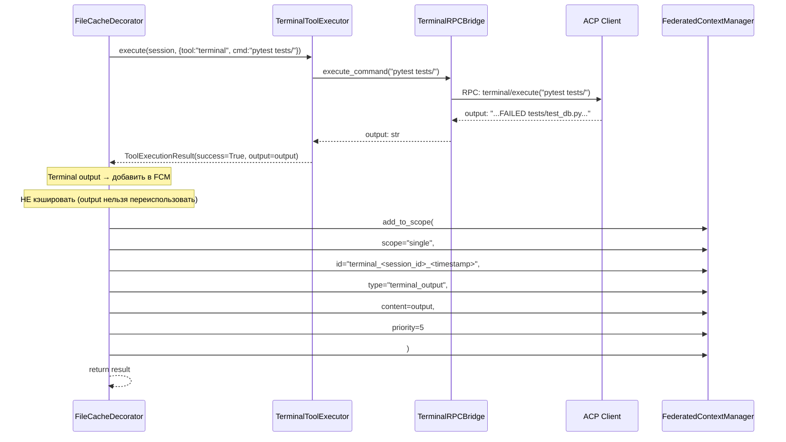
```mermaid
sequenceDiagram
    participant Dec as FileCacheDecorator
    participant TExec as TerminalToolExecutor
    participant Bridge as TerminalRPCBridge
    participant Client as ACP Client
    participant FCM as FederatedContextManager

    Dec->>TExec: execute(session, {tool:"terminal", cmd:"pytest tests/"})
    TExec->>Bridge: execute_command("pytest tests/")
    Bridge->>Client: RPC: terminal/execute("pytest tests/")
    Client-->>Bridge: output: "...FAILED tests/test_db.py..."
    Bridge-->>TExec: output: str
    TExec-->>Dec: ToolExecutionResult(success=True, output=output)
    
    Note over Dec: Terminal output → добавить в FCM
    Note over Dec: НЕ кэшировать (output нельзя переиспользовать)
    Dec->>FCM: add_to_scope(
    Dec->>FCM:   scope="single",
    Dec->>FCM:   id="terminal_<session_id>_<timestamp>",
    Dec->>FCM:   type="terminal_output",
    Dec->>FCM:   content=output,
    Dec->>FCM:   priority=5
    Dec->>FCM: )
    Dec-->>Dec: return result
```

---

## 5. SingleStrategy + FCM

### 5.1. Полный lifecycle одного turn

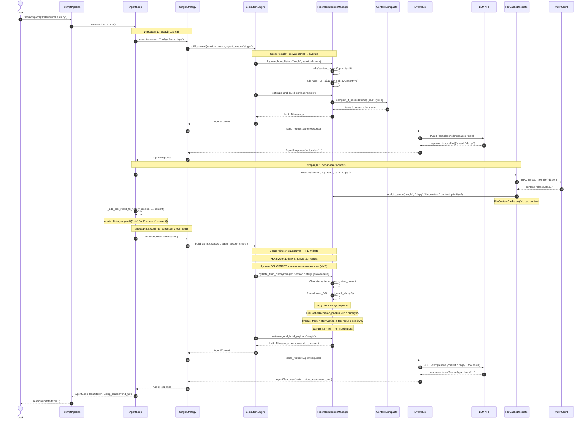
```mermaid
sequenceDiagram
    autonumber
    actor User
    participant PP as PromptPipeline
    participant AL as AgentLoop
    participant SS as SingleStrategy
    participant EE as ExecutionEngine
    participant FCM as FederatedContextManager
    participant CC as ContextCompactor
    participant EB as EventBus
    participant LLM as LLM API
    participant Dec as FileCacheDecorator
    participant Client as ACP Client

    User->>PP: session/prompt("Найди баг в db.py")
    PP->>AL: run(session, prompt)
    
    Note over AL,SS: Итерация 1: первый LLM call
    AL->>SS: execute(session, "Найди баг в db.py")
    SS->>EE: build_context(session, prompt, agent_scope="single")
    
    Note over EE,FCM: Scope "single" не существует → hydrate
    EE->>FCM: hydrate_from_history("single", session.history)
    FCM->>FCM: add("system_prompt", priority=10)
    FCM->>FCM: add("user_0: Найди баг в db.py", priority=8)
    
    EE->>FCM: optimize_and_build_payload("single")
    FCM->>CC: compact_if_needed(items) [если нужно]
    CC-->>FCM: items (compacted or as-is)
    FCM-->>EE: list[LLMMessage]
    EE-->>SS: AgentContext
    
    SS->>EB: send_request(AgentRequest)
    EB->>LLM: POST /completions [messages+tools]
    LLM-->>EB: response: tool_calls=[{fs.read, "db.py"}]
    EB-->>SS: AgentResponse(tool_calls=[...])
    SS-->>AL: AgentResponse
    
    Note over AL,Dec: Итерация 1: обработка tool calls
    AL->>Dec: execute(session, {op:"read", path:"db.py"})
    Dec->>Client: RPC: fs/read_text_file("db.py")
    Client-->>Dec: content: "class DB:\n..."
    Dec->>FCM: add_to_scope("single", "db.py", "file_content", content, priority=5)
    Note over Dec: FileContentCache.set("db.py", content)
    AL->>AL: _add_tool_result_to_history(session, ..., content)
    Note over AL: session.history.append({"role":"tool","content": content})
    
    Note over AL,SS: Итерация 2: continue_execution с tool results
    AL->>SS: continue_execution(session)
    SS->>EE: build_context(session, agent_scope="single")
    
    Note over EE,FCM: Scope "single" существует → НЕ hydrate
    Note over EE,FCM: НО: нужно добавить новые tool results
    Note over EE,FCM: hydrate ОБНОВЛЯЕТ scope при каждом вызове (MVP)
    EE->>FCM: hydrate_from_history("single", session.history) [обновление]
    FCM->>FCM: Clearhistory items, keep system_prompt
    FCM->>FCM: Reload: user_0(8) + tool_result_db.py(5) + ...
    Note over FCM: "db.py" item НЕ дублируется:
    Note over FCM: FileCacheDecorator добавил его с priority=5
    Note over FCM: hydrate_from_history добавит tool result с priority=5
    Note over FCM: (разные item_id → нет конфликта)
    
    EE->>FCM: optimize_and_build_payload("single")
    FCM-->>EE: list[LLMMessage] [включает db.py content]
    EE-->>SS: AgentContext
    
    SS->>EB: send_request(AgentRequest)
    EB->>LLM: POST /completions [context с db.py + tool result]
    LLM-->>EB: response: text="Баг найден: line 42..."
    EB-->>SS: AgentResponse(text=..., stop_reason=end_turn)
    SS-->>AL: AgentResponse
    
    AL-->>PP: AgentLoopResult(text=..., stop_reason=end_turn)
    PP-->>User: session/update(text=...)
```

### 5.2. Приоритеты в SingleStrategy scope

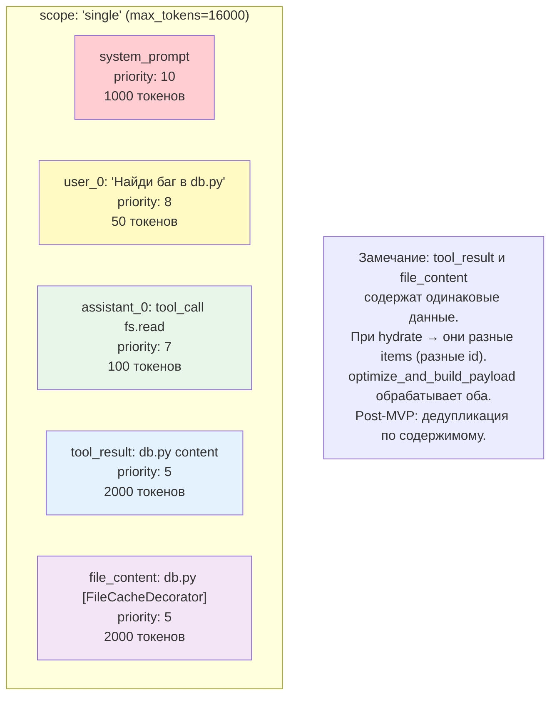
```mermaid
graph TB
    subgraph Scope["scope: 'single' (max_tokens=16000)"]
        SP["system_prompt<br/>priority: 10<br/>1000 токенов"]
        U0["user_0: 'Найди баг в db.py'<br/>priority: 8<br/>50 токенов"]
        A0["assistant_0: tool_call fs.read<br/>priority: 7<br/>100 токенов"]
        TR["tool_result: db.py content<br/>priority: 5<br/>2000 токенов"]
        FC["file_content: db.py [FileCacheDecorator]<br/>priority: 5<br/>2000 токенов"]
    end
    
    Note1["Замечание: tool_result и file_content<br/>содержат одинаковые данные.<br/>При hydrate → они разные items (разные id).<br/>optimize_and_build_payload обрабатывает оба.<br/>Post-MVP: дедупликация по содержимому."]
    
    style SP fill:#ffcdd2
    style U0 fill:#fff9c4
    style A0 fill:#e8f5e9
    style TR fill:#e3f2fd
    style FC fill:#f3e5f5
```

### 5.3. Повторное чтение того же файла

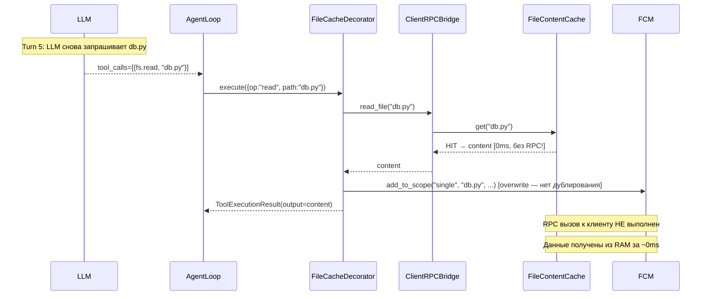
```mermaid
sequenceDiagram
    participant LLM
    participant AL as AgentLoop
    participant Dec as FileCacheDecorator
    participant Bridge as ClientRPCBridge
    participant Cache as FileContentCache
    participant FCM

    Note over LLM: Turn 5: LLM снова запрашивает db.py
    LLM-->>AL: tool_calls=[{fs.read, "db.py"}]
    AL->>Dec: execute({op:"read", path:"db.py"})
    Dec->>Bridge: read_file("db.py")
    
    Bridge->>Cache: get("db.py")
    Cache-->>Bridge: HIT → content [0ms, без RPC!]
    Bridge-->>Dec: content
    
    Dec->>FCM: add_to_scope("single", "db.py", ...) [overwrite — нет дублирования]
    Dec-->>AL: ToolExecutionResult(output=content)
    
    Note over Cache,FCM: RPC вызов к клиенту НЕ выполнен
    Note over Cache,FCM: Данные получены из RAM за ~0ms
```

---

## 6. OrchestratedStrategy + FCM

### 6.1. Архитектура OrchestratedStrategy с FCM

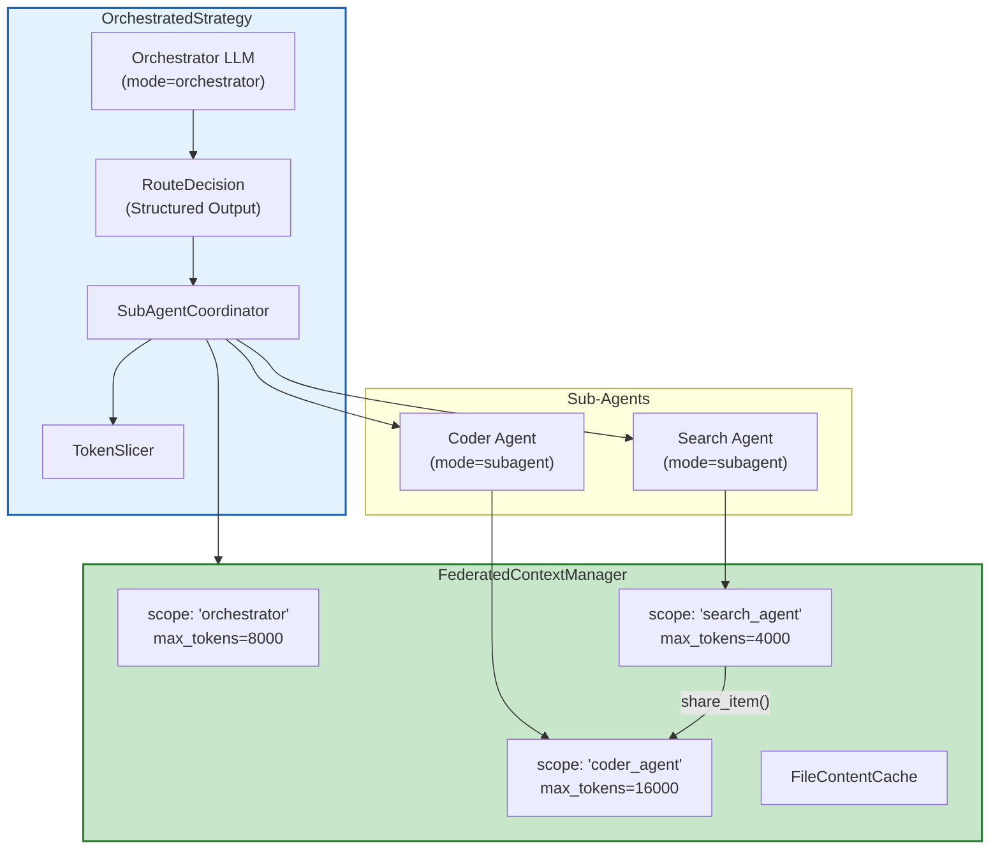
```mermaid
graph TB
    subgraph OrchestratedStrategy["OrchestratedStrategy"]
        Orchestrator["Orchestrator LLM<br/>(mode=orchestrator)"]
        RouteDecision["RouteDecision<br/>(Structured Output)"]
        TokenSlicer["TokenSlicer"]
        SAC["SubAgentCoordinator"]
    end
    
    subgraph FCM["FederatedContextManager"]
        OrcheScope["scope: 'orchestrator'<br/>max_tokens=8000"]
        SearchScope["scope: 'search_agent'<br/>max_tokens=4000"]
        CoderScope["scope: 'coder_agent'<br/>max_tokens=16000"]
        FileCache["FileContentCache"]
    end
    
    subgraph Agents["Sub-Agents"]
        SearchAgent["Search Agent<br/>(mode=subagent)"]
        CoderAgent["Coder Agent<br/>(mode=subagent)"]
    end
    
    Orchestrator --> RouteDecision
    RouteDecision --> SAC
    SAC --> FCM
    SAC --> TokenSlicer
    SAC --> SearchAgent
    SAC --> CoderAgent
    
    SearchAgent --> SearchScope
    CoderAgent --> CoderScope
    
    SearchScope -->|"share_item()"| CoderScope
    
    style FCM fill:#c8e6c9,stroke:#2e7d32,stroke-width:2px
    style OrchestratedStrategy fill:#e3f2fd,stroke:#1565c0,stroke-width:2px
```

### 6.2. Полный lifecycle: Orchestrated multi-agent turn

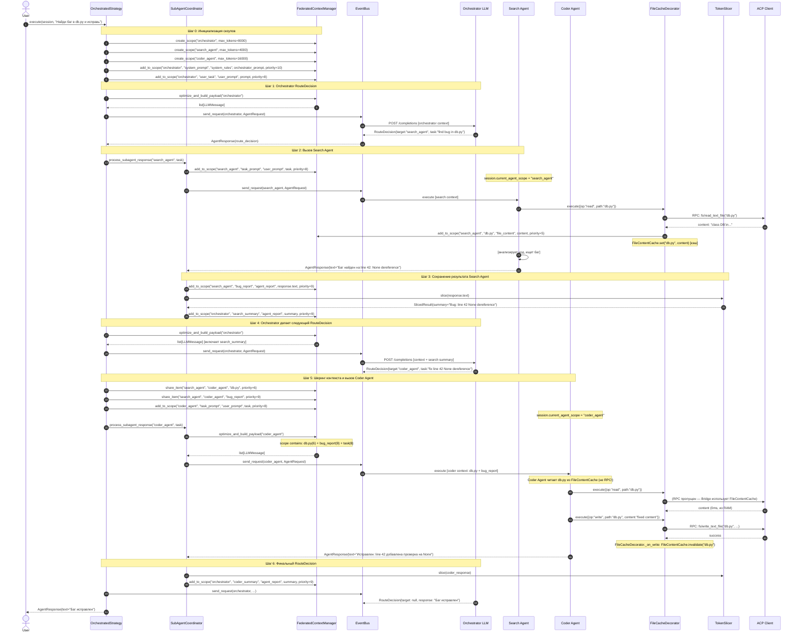
```mermaid
sequenceDiagram
    autonumber
    actor User
    participant OS as OrchestratedStrategy
    participant SAC as SubAgentCoordinator
    participant FCM as FederatedContextManager
    participant EB as EventBus
    participant OL as Orchestrator LLM
    participant SA as Search Agent
    participant CA as Coder Agent
    participant Dec as FileCacheDecorator
    participant TS as TokenSlicer
    participant Client as ACP Client

    User->>OS: execute(session, "Найди баг в db.py и исправь")
    
    Note over OS,FCM: Шаг 0: Инициализация скоупов
    OS->>FCM: create_scope("orchestrator", max_tokens=8000)
    OS->>FCM: create_scope("search_agent", max_tokens=4000)
    OS->>FCM: create_scope("coder_agent", max_tokens=16000)
    OS->>FCM: add_to_scope("orchestrator", "system_prompt", "system_rules", orchestrator_prompt, priority=10)
    OS->>FCM: add_to_scope("orchestrator", "user_task", "user_prompt", prompt, priority=8)
    
    Note over OS,OL: Шаг 1: Orchestrator RouteDecision
    OS->>FCM: optimize_and_build_payload("orchestrator")
    FCM-->>OS: list[LLMMessage]
    
    OS->>EB: send_request(orchestrator, AgentRequest)
    EB->>OL: POST /completions [orchestrator context]
    OL-->>EB: RouteDecision{target:"search_agent", task:"find bug in db.py"}
    EB-->>OS: AgentResponse(route_decision)
    
    Note over OS,SA: Шаг 2: Вызов Search Agent
    OS->>SAC: process_subagent_response("search_agent", task)
    SAC->>FCM: add_to_scope("search_agent", "task_prompt", "user_prompt", task, priority=8)
    
    Note over SA: session.current_agent_scope = "search_agent"
    SAC->>EB: send_request(search_agent, AgentRequest)
    EB->>SA: execute [search context]
    
    SA->>Dec: execute({op:"read", path:"db.py"})
    Dec->>Client: RPC: fs/read_text_file("db.py")
    Client-->>Dec: content: "class DB:\n..."
    Dec->>FCM: add_to_scope("search_agent", "db.py", "file_content", content, priority=5)
    Note over Dec: FileContentCache.set("db.py", content) [кэш]
    
    SA->>SA: [анализирует код, ищет баг]
    SA-->>SAC: AgentResponse(text="Баг найден на line 42: None dereference")
    
    Note over SAC,TS: Шаг 3: Сохранение результата Search Agent
    SAC->>FCM: add_to_scope("search_agent", "bug_report", "agent_report", response.text, priority=9)
    SAC->>TS: slice(response.text)
    TS-->>SAC: SlicedResult(summary="Bug: line 42 None dereference")
    SAC->>FCM: add_to_scope("orchestrator", "search_summary", "agent_report", summary, priority=9)
    
    Note over OS,OL: Шаг 4: Orchestrator делает следующий RouteDecision
    OS->>FCM: optimize_and_build_payload("orchestrator")
    FCM-->>OS: list[LLMMessage] [включает search_summary]
    OS->>EB: send_request(orchestrator, AgentRequest)
    EB->>OL: POST /completions [context + search summary]
    OL-->>EB: RouteDecision{target:"coder_agent", task:"fix line 42 None dereference"}
    
    Note over OS,CA: Шаг 5: Шеринг контекста и вызов Coder Agent
    OS->>FCM: share_item("search_agent", "coder_agent", "db.py", priority=6)
    OS->>FCM: share_item("search_agent", "coder_agent", "bug_report", priority=9)
    OS->>FCM: add_to_scope("coder_agent", "task_prompt", "user_prompt", task, priority=8)
    
    Note over CA: session.current_agent_scope = "coder_agent"
    OS->>SAC: process_subagent_response("coder_agent", task)
    SAC->>FCM: optimize_and_build_payload("coder_agent")
    Note over FCM: scope contains: db.py(6) + bug_report(9) + task(8)
    FCM-->>SAC: list[LLMMessage]
    SAC->>EB: send_request(coder_agent, AgentRequest)
    EB->>CA: execute [coder context: db.py + bug_report]
    
    Note over CA: Coder Agent читает db.py из FileContentCache (не RPC!)
    CA->>Dec: execute({op:"read", path:"db.py"})
    Dec->>Client: (RPC пропущен — Bridge использует FileContentCache)
    Client-->>Dec: content (0ms, из RAM)
    
    CA->>Dec: execute({op:"write", path:"db.py", content:"fixed content"})
    Dec->>Client: RPC: fs/write_text_file("db.py", ...)
    Client-->>Dec: success
    Note over Dec: FileCacheDecorator._on_write: FileContentCache.invalidate("db.py")
    
    CA-->>SAC: AgentResponse(text="Исправлен: line 42 добавлена проверка на None")
    
    Note over OS,OL: Шаг 6: Финальный RouteDecision
    SAC->>TS: slice(coder_response)
    SAC->>FCM: add_to_scope("orchestrator", "coder_summary", "agent_report", summary, priority=9)
    OS->>EB: send_request(orchestrator, ...)
    OL-->>EB: RouteDecision{target: null, response: "Баг исправлен"}
    
    OS-->>User: AgentResponse(text="Баг исправлен")
```

### 6.3. Состояние скоупов после завершения

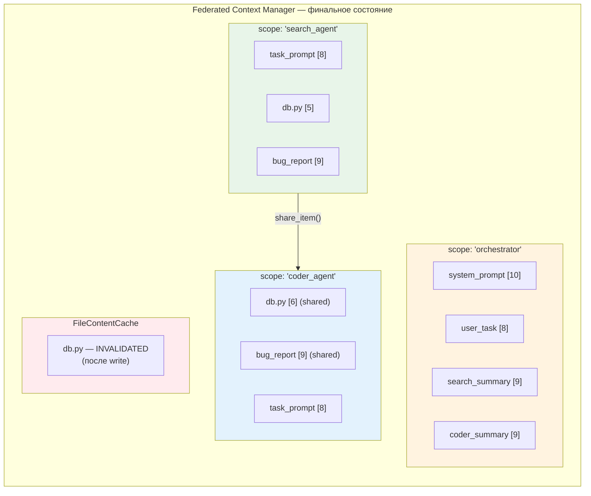
```mermaid
graph LR
    subgraph FCM["Federated Context Manager — финальное состояние"]
        subgraph OrcheScope["scope: 'orchestrator'"]
            O_SP["system_prompt [10]"]
            O_Task["user_task [8]"]
            O_Search["search_summary [9]"]
            O_Coder["coder_summary [9]"]
        end
        
        subgraph SearchScope["scope: 'search_agent'"]
            S_Task["task_prompt [8]"]
            S_DB["db.py [5]"]
            S_Bug["bug_report [9]"]
        end
        
        subgraph CoderScope["scope: 'coder_agent'"]
            C_DB["db.py [6] (shared)"]
            C_Bug["bug_report [9] (shared)"]
            C_Task["task_prompt [8]"]
        end
        
        subgraph Cache["FileContentCache"]
            FC_DB["db.py — INVALIDATED<br/>(после write)"]
        end
    end
    
    SearchScope -->|"share_item()"| CoderScope
    
    style OrcheScope fill:#fff3e0
    style SearchScope fill:#e8f5e9
    style CoderScope fill:#e3f2fd
    style Cache fill:#ffebee
```

---

## 7. HierarchicalStrategy + FCM

### 7.1. Архитектура HierarchicalStrategy с FCM

HierarchicalStrategy отличается от OrchestratedStrategy тем, что **Primary Agent сам принимает решение о делегировании** через специальный `task` tool call, а не через Structured Outputs.

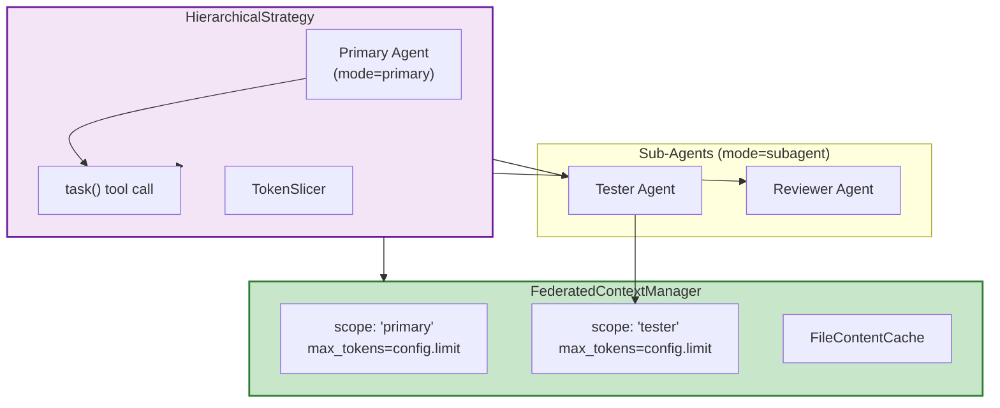
```mermaid
graph TB
    subgraph HierarchicalStrategy["HierarchicalStrategy"]
        Primary["Primary Agent<br/>(mode=primary)"]
        TaskTool["task() tool call"]
        TokenSlicer["TokenSlicer"]
    end
    
    subgraph FCM["FederatedContextManager"]
        PrimaryScope["scope: 'primary'<br/>max_tokens=config.limit"]
        TesterScope["scope: 'tester'<br/>max_tokens=config.limit"]
        FileCache["FileContentCache"]
    end
    
    subgraph Agents["Sub-Agents (mode=subagent)"]
        Tester["Tester Agent"]
        Reviewer["Reviewer Agent"]
    end
    
    Primary --> TaskTool
    TaskTool --> HierarchicalStrategy
    HierarchicalStrategy --> FCM
    HierarchicalStrategy --> Tester
    HierarchicalStrategy --> Reviewer
    
    Tester --> TesterScope
    
    style FCM fill:#c8e6c9,stroke:#2e7d32,stroke-width:2px
    style HierarchicalStrategy fill:#f3e5f5,stroke:#6a1b9a,stroke-width:2px
```

### 7.2. Полный lifecycle: Primary delegates to Sub-Agent

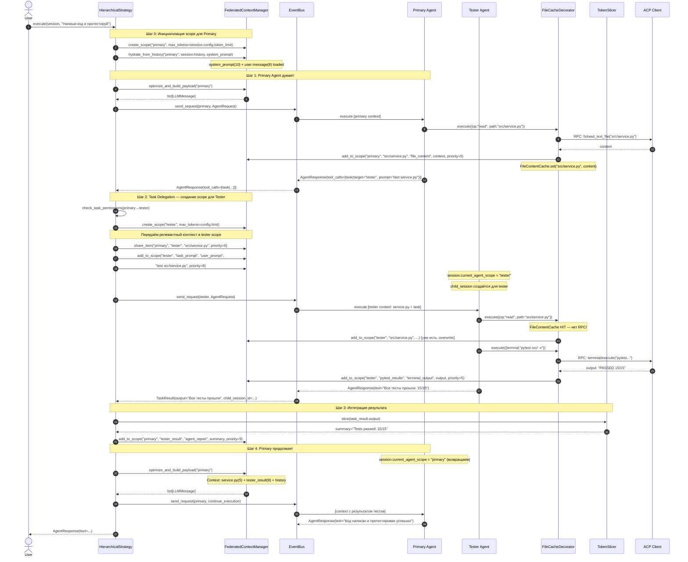
```mermaid
sequenceDiagram
    autonumber
    actor User
    participant HS as HierarchicalStrategy
    participant FCM as FederatedContextManager
    participant EB as EventBus
    participant Primary as Primary Agent
    participant Tester as Tester Agent
    participant Dec as FileCacheDecorator
    participant TS as TokenSlicer
    participant Client as ACP Client

    User->>HS: execute(session, "Напиши код и протестируй")
    
    Note over HS,FCM: Шаг 0: Инициализация scope для Primary
    HS->>FCM: create_scope("primary", max_tokens=session.config.token_limit)
    HS->>FCM: hydrate_from_history("primary", session.history, system_prompt)
    Note over FCM: system_prompt(10) + user message(8) loaded
    
    Note over HS,Primary: Шаг 1: Primary Agent думает
    HS->>FCM: optimize_and_build_payload("primary")
    FCM-->>HS: list[LLMMessage]
    HS->>EB: send_request(primary, AgentRequest)
    
    EB->>Primary: execute [primary context]
    Primary->>Dec: execute({op:"read", path:"src/service.py"})
    Dec->>Client: RPC: fs/read_text_file("src/service.py")
    Client-->>Dec: content
    Dec->>FCM: add_to_scope("primary", "src/service.py", "file_content", content, priority=5)
    Note over Dec: FileContentCache.set("src/service.py", content)
    
    Primary-->>EB: AgentResponse(tool_calls=[task(target="tester", prompt="test service.py")])
    EB-->>HS: AgentResponse(tool_calls=[task(...)])
    
    Note over HS,FCM: Шаг 2: Task Delegation — создание scope для Tester
    HS->>HS: check_task_permissions(primary→tester)
    HS->>FCM: create_scope("tester", max_tokens=config.limit)
    
    Note over HS,FCM: Передаём релевантный контекст в tester scope
    HS->>FCM: share_item("primary", "tester", "src/service.py", priority=6)
    HS->>FCM: add_to_scope("tester", "task_prompt", "user_prompt",
    HS->>FCM:   "test src/service.py", priority=8)
    
    Note over Tester: session.current_agent_scope = "tester"
    Note over Tester: child_session создаётся для tester
    HS->>EB: send_request(tester, AgentRequest)
    EB->>Tester: execute [tester context: service.py + task]
    
    Tester->>Dec: execute({op:"read", path:"src/service.py"})
    Note over Dec: FileContentCache HIT — нет RPC!
    Dec->>FCM: add_to_scope("tester", "src/service.py", ...) [уже есть, overwrite]
    
    Tester->>Dec: execute({termnal:"pytest src/ -v"})
    Dec->>Client: RPC: terminal/execute("pytest...")
    Client-->>Dec: output: "PASSED 15/15"
    Dec->>FCM: add_to_scope("tester", "pytest_results", "terminal_output", output, priority=5)
    
    Tester-->>EB: AgentResponse(text="Все тесты прошли: 15/15")
    EB-->>HS: TaskResult(output="Все тесты прошли", child_session_id=...)
    
    Note over HS,TS: Шаг 3: Интеграция результата
    HS->>TS: slice(task_result.output)
    TS-->>HS: summary="Tests passed: 15/15"
    
    HS->>FCM: add_to_scope("primary", "tester_result", "agent_report", summary, priority=9)
    
    Note over HS,Primary: Шаг 4: Primary продолжает
    Note over Primary: session.current_agent_scope = "primary" (возвращаем)
    HS->>FCM: optimize_and_build_payload("primary")
    Note over FCM: Context: service.py(5) + tester_result(9) + history
    FCM-->>HS: list[LLMMessage]
    HS->>EB: send_request(primary, continue_execution)
    EB->>Primary: [context с результатом тестов]
    Primary-->>EB: AgentResponse(text="Код написан и протестирован успешно")
    
    HS-->>User: AgentResponse(text=...)
```

### 7.3. Управление scope при cascade delegation

При глубокой иерархии (Primary → Tester → Reviewer):

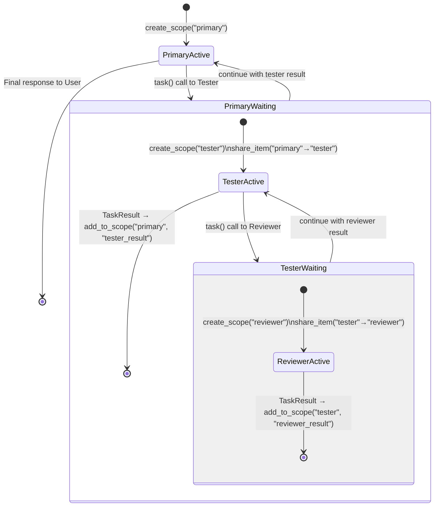
```mermaid
stateDiagram-v2
    [*] --> PrimaryActive: create_scope("primary")
    PrimaryActive --> PrimaryWaiting: task() call to Tester
    
    state PrimaryWaiting {
        [*] --> TesterActive: create_scope("tester")\nshare_item("primary"→"tester")
        TesterActive --> TesterWaiting: task() call to Reviewer
        
        state TesterWaiting {
            [*] --> ReviewerActive: create_scope("reviewer")\nshare_item("tester"→"reviewer")
            ReviewerActive --> [*]: TaskResult → add_to_scope("tester", "reviewer_result")
        }
        
        TesterWaiting --> TesterActive: continue with reviewer result
        TesterActive --> [*]: TaskResult → add_to_scope("primary", "tester_result")
    }
    
    PrimaryWaiting --> PrimaryActive: continue with tester result
    PrimaryActive --> [*]: Final response to User
```

---

## 8. ChoreographyStrategy + FCM

### 8.1. Архитектура ChoreographyStrategy с FCM

ChoreographyStrategy **параллельно** рассылает контекст всем агентам (`ContextBroadcast`). Нет центрального оркестратора — агенты сами решают, выполнять ли действие.

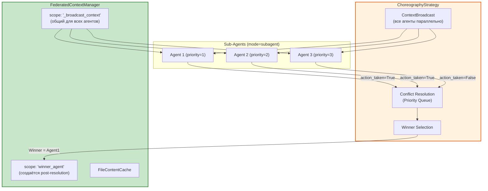
```mermaid
graph TB
    subgraph ChoreographyStrategy["ChoreographyStrategy"]
        Broadcast["ContextBroadcast<br/>(все агенты параллельно)"]
        Conflict["Conflict Resolution<br/>(Priority Queue)"]
        Winner["Winner Selection"]
    end
    
    subgraph FCM["FederatedContextManager"]
        SharedCtx["scope: '_broadcast_context'<br/>(общий для всех агентов)"]
        WinnerScope["scope: 'winner_agent'<br/>(создаётся post-resolution)"]
        FileCache["FileContentCache"]
    end
    
    subgraph Agents["Sub-Agents (mode=subagent)"]
        Agent1["Agent 1 (priority=1)"]
        Agent2["Agent 2 (priority=2)"]
        Agent3["Agent 3 (priority=3)"]
    end
    
    Broadcast --> Agent1
    Broadcast --> Agent2
    Broadcast --> Agent3
    
    Agent1 -->|"action_taken=True"| Conflict
    Agent2 -->|"action_taken=True"| Conflict
    Agent3 -->|"action_taken=False"| Conflict
    
    Conflict --> Winner
    Winner -->|"Winner = Agent1"| WinnerScope
    
    SharedCtx --> Agent1
    SharedCtx --> Agent2
    SharedCtx --> Agent3
    
    style FCM fill:#c8e6c9,stroke:#2e7d32,stroke-width:2px
    style ChoreographyStrategy fill:#fff3e0,stroke:#e65100,stroke-width:2px
```

### 8.2. Полный lifecycle: Choreography turn

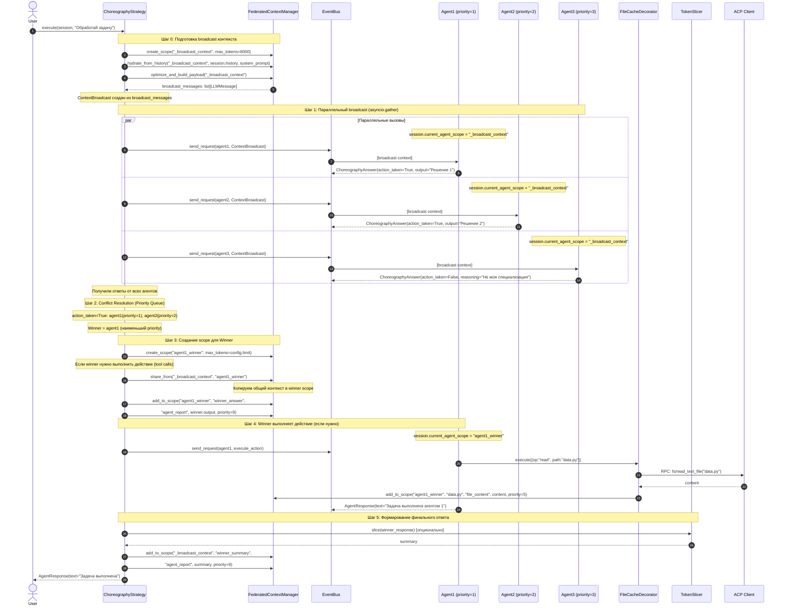
```mermaid
sequenceDiagram
    autonumber
    actor User
    participant CS as ChoreographyStrategy
    participant FCM as FederatedContextManager
    participant EB as EventBus
    participant A1 as Agent1 (priority=1)
    participant A2 as Agent2 (priority=2)
    participant A3 as Agent3 (priority=3)
    participant Dec as FileCacheDecorator
    participant TS as TokenSlicer
    participant Client as ACP Client

    User->>CS: execute(session, "Обработай задачу")
    
    Note over CS,FCM: Шаг 0: Подготовка broadcast контекста
    CS->>FCM: create_scope("_broadcast_context", max_tokens=8000)
    CS->>FCM: hydrate_from_history("_broadcast_context", session.history, system_prompt)
    CS->>FCM: optimize_and_build_payload("_broadcast_context")
    FCM-->>CS: broadcast_messages: list[LLMMessage]
    
    Note over CS: ContextBroadcast создан из broadcast_messages
    
    Note over CS,A3: Шаг 1: Параллельный broadcast (asyncio.gather)
    par Параллельные вызовы
        Note over A1: session.current_agent_scope = "_broadcast_context"
        CS->>EB: send_request(agent1, ContextBroadcast)
        EB->>A1: [broadcast context]
        A1-->>EB: ChoreographyAnswer(action_taken=True, output="Решение 1")
    and
        Note over A2: session.current_agent_scope = "_broadcast_context"
        CS->>EB: send_request(agent2, ContextBroadcast)
        EB->>A2: [broadcast context]
        A2-->>EB: ChoreographyAnswer(action_taken=True, output="Решение 2")
    and
        Note over A3: session.current_agent_scope = "_broadcast_context"
        CS->>EB: send_request(agent3, ContextBroadcast)
        EB->>A3: [broadcast context]
        A3-->>EB: ChoreographyAnswer(action_taken=False, reasoning="Не моя специализация")
    end
    
    Note over CS: Получили ответы от всех агентов
    
    Note over CS: Шаг 2: Conflict Resolution (Priority Queue)
    Note over CS: action_taken=True: agent1(priority=1), agent2(priority=2)
    Note over CS: Winner = agent1 (наименьший priority)
    
    Note over CS,FCM: Шаг 3: Создание scope для Winner
    CS->>FCM: create_scope("agent1_winner", max_tokens=config.limit)
    
    Note over CS: Если winner нужно выполнить действие (tool calls):
    CS->>FCM: share_from("_broadcast_context", "agent1_winner")
    Note over FCM: Копируем общий контекст в winner scope
    
    CS->>FCM: add_to_scope("agent1_winner", "winner_answer",
    CS->>FCM:   "agent_report", winner.output, priority=9)
    
    Note over CS,A1: Шаг 4: Winner выполняет действие (если нужно)
    Note over A1: session.current_agent_scope = "agent1_winner"
    CS->>EB: send_request(agent1, execute_action)
    
    A1->>Dec: execute({op:"read", path:"data.py"})
    Dec->>Client: RPC: fs/read_text_file("data.py")
    Client-->>Dec: content
    Dec->>FCM: add_to_scope("agent1_winner", "data.py", "file_content", content, priority=5)
    
    A1-->>EB: AgentResponse(text="Задача выполнена агентом 1")
    
    Note over CS,TS: Шаг 5: Формирование финального ответа
    CS->>TS: slice(winner_response) [опционально]
    TS-->>CS: summary
    
    CS->>FCM: add_to_scope("_broadcast_context", "winner_summary",
    CS->>FCM:   "agent_report", summary, priority=9)
    
    CS-->>User: AgentResponse(text="Задача выполнена")
```

### 8.3. Broadcast Context vs Winner Scope

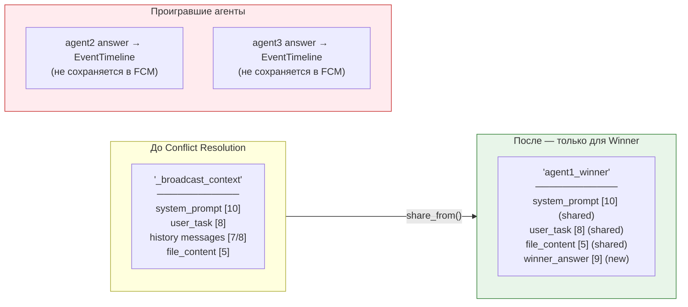
```mermaid
graph LR
    subgraph Before["До Conflict Resolution"]
        BC["'_broadcast_context'<br/>────────────<br/>system_prompt [10]<br/>user_task [8]<br/>history messages [7/8]<br/>file_content [5]"]
    end
    
    subgraph After["После — только для Winner"]
        WS["'agent1_winner'<br/>────────────<br/>system_prompt [10] (shared)<br/>user_task [8] (shared)<br/>file_content [5] (shared)<br/>winner_answer [9] (new)"]
    end
    
    subgraph Discarded["Проигравшие агенты"]
        A2["agent2 answer → EventTimeline<br/>(не сохраняется в FCM)"]
        A3["agent3 answer → EventTimeline<br/>(не сохраняется в FCM)"]
    end
    
    Before -->|"share_from()"| After
    
    style After fill:#e8f5e9,stroke:#2e7d32
    style Discarded fill:#ffebee,stroke:#c62828
```

---

## 9. Architecture Decision Records

### ADR-1: Кто добавляет ContextItem в FCM?

**Контекст:** Нужно решить, где происходит конвертация `tool result → ContextItem`.

**Рассмотренные варианты:**

| Вариант | Плюсы | Минусы |
|---------|-------|--------|
| **A: FileCacheDecorator** | SRP, OCP, соответствует паттерну | Нужно передать context_manager + session scope |
| B: AgentLoop.\_process\_tool\_calls | Единое место, прямой доступ | AgentLoop знает о FCM — нарушение SRP |
| C: ExecutionEngine.hydrate\_from\_history | Уже существует, просто | Не Real-time — файлы добавляются только при следующем build_context() |

**Решение: A + C (комбинация)**
- `FileCacheDecorator` — для Real-time кэширования файлов при tool execution
- `hydrate_from_history()` — для синхронизации истории при build_context()

**Обоснование:**
- Соответствует существующему паттерну Decorator (`MetricsDecorator`, `TracingDecorator`, …)
- SRP: AgentLoop не знает о FCM
- Real-time: файлы доступны в scope сразу после чтения

---

### ADR-2: Как SingleStrategy узнаёт свой scope?

**Контекст:** `FileCacheDecorator` должен знать имя scope при добавлении `file_content`.

**Решение:** `session.current_agent_scope: str = "single"` — новое поле SessionState.

```python
# Устанавливается перед каждым agent execution:
session.current_agent_scope = "single"              # SingleStrategy
session.current_agent_scope = "search_agent"        # OrchestratedStrategy
session.current_agent_scope = "tester"              # HierarchicalStrategy
session.current_agent_scope = "_broadcast_context"  # ChoreographyStrategy
```

**Обоснование:**
- Минимальное изменение (одно поле)
- Не требует передачи FCM в tool executors напрямую
- DefaultValue `"single"` обеспечивает backward compatibility

---

### ADR-3: Когда пересоздавать scope для SingleStrategy?

**Контекст:** После каждого tool execution в session.history добавляется tool result. При следующем `build_context()` — нужно ли пересоздавать scope?

**Рассмотренные варианты:**

| Вариант | Плюсы | Минусы |
|---------|-------|--------|
| **A: hydrate каждый раз (MVP)** | Простота, всегда актуально | O(n) overhead |
| B: Incremental update | O(1) для добавления | Сложная логика, риск stale |
| C: Версионирование scope | Гарантированная актуальность | Сложно, нужен hash |

**Решение: A (MVP)** — hydrate_from_history при каждом build_context.

**Обоснование:**
- Прост в реализации и тестировании
- Типичная сессия < 100 messages → negligible overhead (~1ms)
- Предсказуемое поведение

**Post-MVP:** Incremental update при наличии performance bottleneck.

---

### ADR-4: FileContentCache в Bridge vs в Decorator?

**Контекст:** Где правильно проверять кэш перед RPC вызовом?

**Решение: В ClientRPCBridge** (предпочтительно) + fallback в FileCacheDecorator.

```python
# ClientRPCBridge.read_file() — проверяет кэш ПЕРЕД RPC
async def read_file(self, session, path, line=None, limit=None):
    if self._file_cache and line is None and limit is None:
        cached = self._file_cache.get(path)
        if cached:
            return cached  # 0ms, no RPC
    result = await self._rpc_client.call("fs/read_text_file", ...)
    if self._file_cache and line is None and limit is None:
        self._file_cache.set(path, result)
    return result
```

**Обоснование:**
- Bridge — единственное место, откуда идут все RPC calls
- Декоратор не может "перехватить" RPC вызов, только постобработку
- Централизованная логика кэширования

---

### ADR-5: Scope lifecycle для Multi-agent стратегий

**Контекст:** Когда создаются и удаляются scope для субагентов?

**Решение:**

| Событие | Действие |
|---------|----------|
| Strategy.execute() | Создать scope для каждого агента |
| AgentResponse получен | Сохранить результат в scope |
| Strategy завершена | Оставить scope в FCM до конца session |
| Session удалена | SessionFileCacheRegistry.remove() очищает всё |

**Обоснование:**
- Scope живут всю сессию → агенты могут "вспомнить" контекст при следующем turn
- При следующем turn multi-agent стратегия пересоздаёт только нужные scope (или использует существующие)
- Memory overhead приемлем (< 2MB per session)

---

## 10. Сравнительная таблица стратегий

| Аспект | SingleStrategy | OrchestratedStrategy | HierarchicalStrategy | ChoreographyStrategy |
|--------|----------------|---------------------|---------------------|---------------------|
| **Scope creation** | Автоматически в `hydrate_from_history` | Явно в стратегии | Явно в стратегии | Явно в стратегии |
| **Кол-во scope** | 1 (`"single"`) | N (orchestrator + sub-agents) | N (primary + sub-agents) | 2 (`_broadcast_context` + winner) |
| **hydrate_from_history** | ✅ Каждый turn | Только для orchestrator scope | Только для primary scope | Только для broadcast scope |
| **share_item** | ❌ Не нужен | ✅ search → coder | ✅ primary → subagent | ✅ broadcast → winner |
| **FileCacheDecorator** | ✅ scope = `"single"` | ✅ scope = `"search_agent"` | ✅ scope = `"tester"` | ✅ scope = `"_broadcast_context"` |
| **TokenSlicer** | ❌ | ✅ Каждый subagent response | ✅ Каждый task result | ✅ Winner response (опционально) |
| **session.current_agent_scope** | `"single"` | Меняется per sub-agent | Меняется per delegation | `"_broadcast_context"` для всех |
| **Child sessions** | ❌ | ✅ Per sub-agent | ✅ Per task | ✅ Только для winner |

---

## Appendix A: Sequence Diagram — FCM в AgentLoop Lifecycle (полный view)

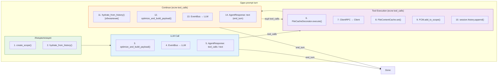
```mermaid
graph LR
    subgraph Turn["Один prompt turn"]
        subgraph Init["Инициализация"]
            I1["1. create_scope()"]
            I2["2. hydrate_from_history()"]
        end
        
        subgraph LLMCall["LLM Call"]
            LC1["3. optimize_and_build_payload()"]
            LC2["4. EventBus → LLM"]
            LC3["5. AgentResponse: tool_calls / text"]
        end
        
        subgraph ToolExec["Tool Execution (если tool_calls)"]
            TE1["6. FileCacheDecorator.execute()"]
            TE2["7. ClientRPC → Client"]
            TE3["8. FileContentCache.set()"]
            TE4["9. FCM.add_to_scope()"]
            TE5["10. session.history.append()"]
        end
        
        subgraph Continue["Continue (если tool_calls)"]
            C1["11. hydrate_from_history() [обновление]"]
            C2["12. optimize_and_build_payload()"]
            C3["13. EventBus → LLM"]
            C4["14. AgentResponse: text (end_turn)"]
        end
    end
    
    Init --> LLMCall
    LLMCall -->|"tool_calls"| ToolExec
    ToolExec --> Continue
    Continue -->|"ещё tool_calls"| ToolExec
    LLMCall -->|"end_turn"| Done["Done"]
    Continue -->|"end_turn"| Done
    
    style Init fill:#e8f5e9,stroke:#2e7d32
    style LLMCall fill:#e3f2fd,stroke:#1565c0
    style ToolExec fill:#f3e5f5,stroke:#6a1b9a
    style Continue fill:#fff3e0,stroke:#e65100
```

---

## Appendix B: Новые компоненты для реализации

### Что нужно создать/изменить

| Компонент | Действие | Файл |
|-----------|----------|------|
| `FileCacheDecorator` | Создать | `src/codelab/server/tools/executors/decorators/file_cache.py` |
| `SessionState.current_agent_scope` | Добавить поле | `src/codelab/server/protocol/state.py` |
| `ClientRPCBridge.read_file()` | Добавить FileContentCache | `src/codelab/server/tools/integrations/client_rpc_bridge.py` |
| `ExecutionEngine._build_via_fcm()` | Создать | `src/codelab/server/agent/execution_engine.py` |
| `FederatedContextManager.hydrate_from_history()` | Реализовать | `src/codelab/server/agent/context/manager.py` |
| `OrchestratedStrategy` | Создать + интегрировать FCM¹ | `src/codelab/server/protocol/handlers/strategies/orchestrated_strategy.py` |
| `HierarchicalStrategy` | Создать + интегрировать FCM¹ | `src/codelab/server/protocol/handlers/strategies/hierarchical_strategy.py` |
| `ChoreographyStrategy` | Создать + интегрировать FCM¹ | `src/codelab/server/protocol/handlers/strategies/choreography_strategy.py` |

> ¹ Multi-agent стратегии пока **не существуют** в кодовой базе (есть только
> `single_strategy.py`). Их сначала нужно создать в
> `src/codelab/server/protocol/handlers/strategies/`, а затем интегрировать FCM.

### Зависимости создания

```mermaid
graph TB
    A["SessionState.current_agent_scope"] --> B["FileCacheDecorator"]
    C["FileContentCache (Слой 1)"] --> B
    C --> D["ClientRPCBridge + cache"]
    E["FederatedContextManager (Слой 3)"] --> B
    E --> F["ExecutionEngine._build_via_fcm()"]
    F --> G["SingleStrategy integration"]
    E --> H["OrchestratedStrategy integration"]
    E --> I["HierarchicalStrategy integration"]
    E --> J["ChoreographyStrategy integration"]
    
    style A fill:#fff9c4
    style B fill:#c8e6c9
    style C fill:#e8f5e9
    style E fill:#e3f2fd
```

---

## Appendix C: Testing Strategy

### Integration test: SingleStrategy + FCM

```python
@pytest.mark.asyncio
async def test_single_strategy_fcm_lifecycle():
    """
    Проверяет полный lifecycle:
    1. build_context → hydrate_from_history создаёт scope
    2. fs/read → FileCacheDecorator добавляет файл в scope
    3. Повторное build_context → scope обновляется с tool result
    4. FileContentCache hit → нет повторного RPC
    """
    # Setup
    file_cache = InMemoryFileCache()
    fcm = FederatedContextManager(
        file_cache=file_cache,
        compactor=DefaultContextCompactor(...),
    )
    engine = ExecutionEngine(tool_registry, context_manager=fcm)
    
    # Шаг 1: Первый build_context
    session = create_test_session(history=[
        {"role": "system", "content": "..."},
        {"role": "user", "content": "read db.py"},
    ])
    context = await engine.build_context(session, "read db.py", agent_scope="single")
    
    assert "single" in fcm.scopes
    scope = fcm.scopes["single"]
    assert scope.registry["system_prompt"].priority == 10
    
    # Шаг 2: fs/read через FileCacheDecorator
    decorator = FileCacheDecorator(
        wrapped=mock_fs_executor(content="class DB: ..."),
        file_cache=file_cache,
        context_manager=fcm,
    )
    session.current_agent_scope = "single"
    await decorator.execute(session, {"operation": "read", "path": "db.py"})
    
    assert file_cache.get("db.py") == "class DB: ..."
    assert "db.py" in scope.registry
    assert scope.registry["db.py"].type == "file_content"
    
    # Шаг 3: Повторное чтение — cache hit
    rpc_calls = 0
    async def mock_rpc(*args, **kwargs):
        nonlocal rpc_calls
        rpc_calls += 1
        return "class DB: ..."
    
    bridge = ClientRPCBridge(..., file_cache=file_cache)
    result = await bridge.read_file(session, "db.py")
    assert rpc_calls == 0  # Cache hit: RPC не вызван!
    assert result == "class DB: ..."
```

### Integration test: OrchestratedStrategy context sharing

```python
@pytest.mark.asyncio
async def test_orchestrated_context_sharing():
    """
    Проверяет что search_agent может передать файл coder_agent
    без повторного RPC.
    """
    fcm = FederatedContextManager(...)
    
    # Search agent читает файл
    await fcm.create_scope("search_agent", max_tokens=4000)
    await fcm.add_to_scope("search_agent", "db.py", "file_content", content, priority=5)
    
    # Создаём coder scope
    await fcm.create_scope("coder_agent", max_tokens=16000)
    
    # Шаринг без RPC
    await fcm.share_item("search_agent", "coder_agent", "db.py", priority=6)
    
    coder_scope = fcm.scopes["coder_agent"]
    assert "db.py" in coder_scope.registry
    assert coder_scope.registry["db.py"].priority == 6
    assert coder_scope.registry["db.py"].owner_scope == "coder_agent"
    
    # Payload для coder содержит db.py
    payload = await fcm.optimize_and_build_payload("coder_agent")
    payload_text = " ".join(str(m) for m in payload)
    assert "class DB" in payload_text
```
