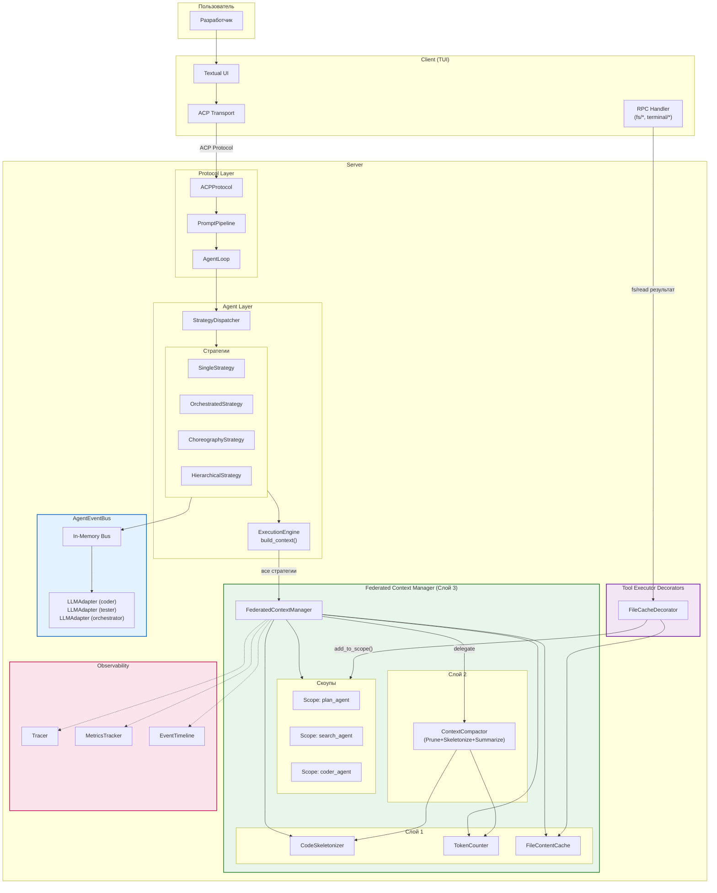
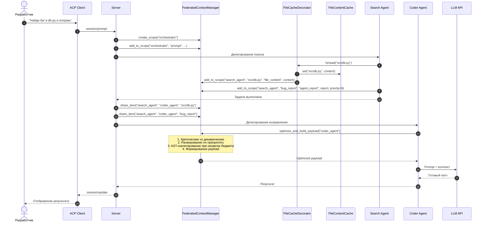
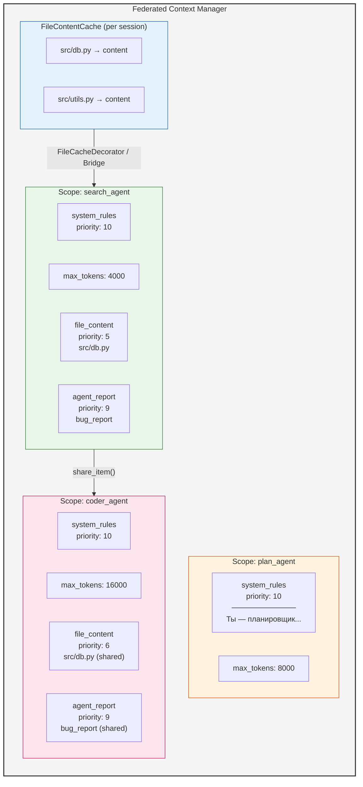
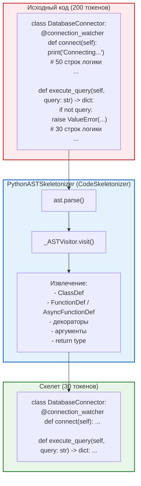
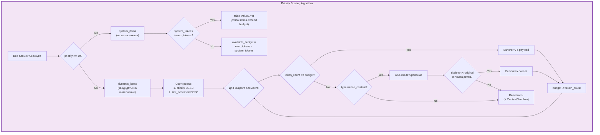
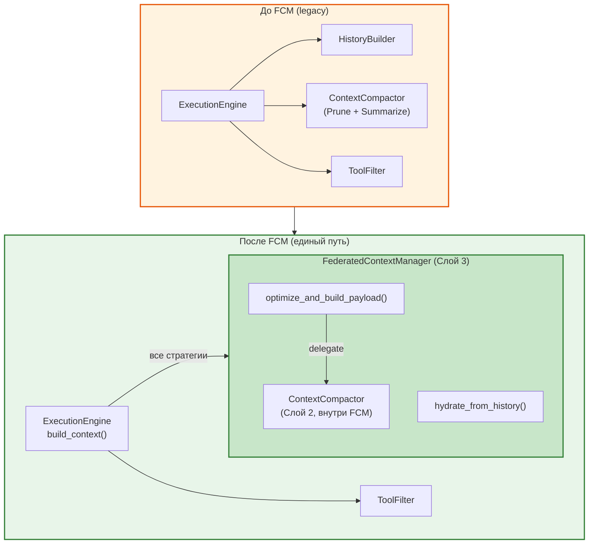
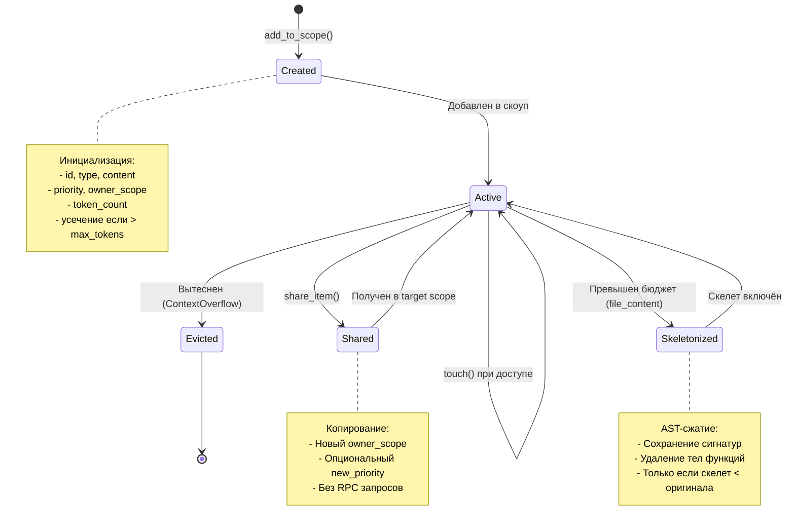
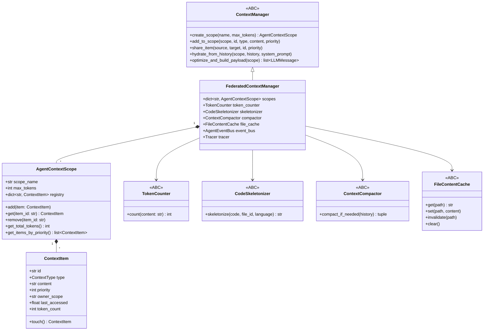
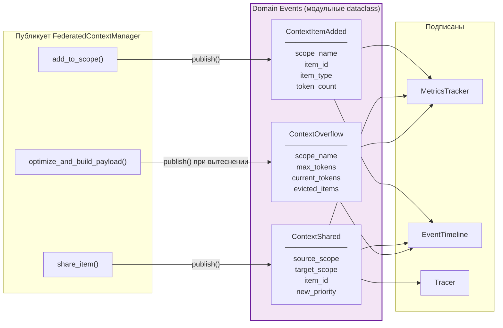
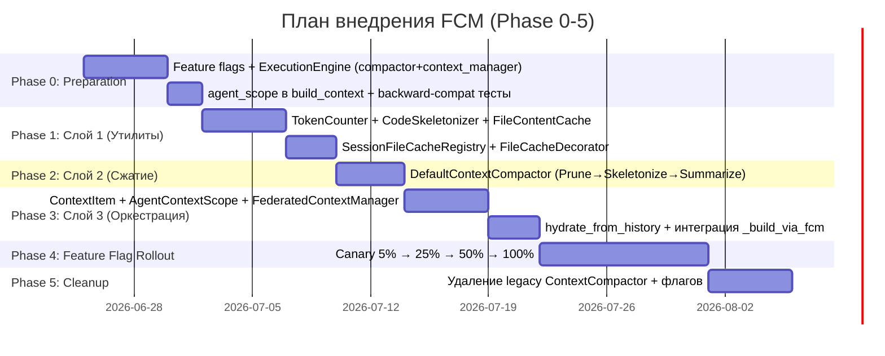

# Federated Context Manager — Диаграммы

> **ARCHIVED.** Этот документ архивирован. Каноническая документация — в [`doc/internals/context-manager/`](../../context-manager/). См. также [ADR-002](../adr/ADR-002-context-manager-consolidation.md).

> **Версия:** 2.3
> **Дата:** 25 июня 2026
>
> Все диаграммы соответствуют слоистой архитектуре (Слой 1/2/3),
> единому пути формирования payload и кэшу на базе `FileContentCache`
> (`ACPCache`/`Shared Memory Bridge` из ранних версий удалены).

---

## 1. Общая архитектура системы

---

## 2. Поток данных при мультиагентном запросе

---

## 3. Структура скоупов в памяти

---

## 4. AST-скелетирование

> Экономия ~85% токенов. Edge case (EDGE_CASES §3): если скелет не меньше
> оригинала (minified-код), используется оригинал.

---

## 5. Приоритизация и вытеснение

---

## 6. Интеграция с ExecutionEngine

> Ключевое отличие: `ContextCompactor` — это **Слой 2 внутри FCM**, а не
> сосед `ExecutionEngine`. Движок общается только с FCM (FCM-путь) либо с
> legacy-компактором (legacy-путь) — пути взаимоисключающие.

---

## 7. Жизненный цикл элемента контекста

---

## 8. Компоненты FCM

---

## 9. События EventBus

---

## 10. Путь внедрения (Gantt)

> Соответствует Phase 0–5 из `MIGRATION_PLAN.md` (источник истины по roadmap).

