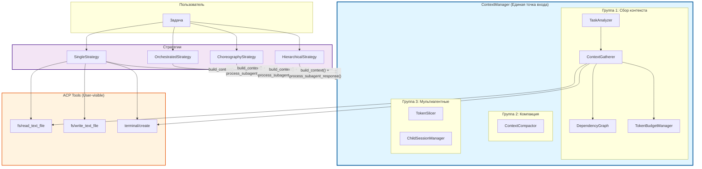
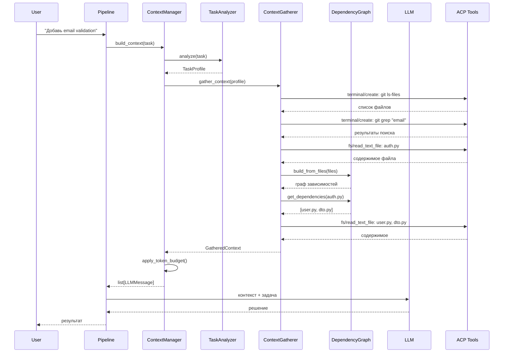
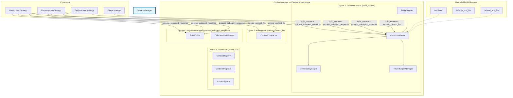

# Context Manager Architecture

> Интеллектуальный слой управления контекстом для coding agent уровня Claude Code / OpenCode

## Связанные документы

- **[ROADMAP.md](./ROADMAP.md)** — план реализации по фазам
- **[COMPARISON.md](./COMPARISON.md)** — сравнение с конкурентами
- **[EXAMPLES.md](./EXAMPLES.md)** — практические примеры использования
- **[INDEX.md](./INDEX.md)** — навигация по документации

### Общая архитектура системы

Context Manager является частью **полной архитектуры CodeLab Agent**. См. **[System Architecture](../system-architecture/SYSTEM_ARCHITECTURE.md)** для понимания места Context Manager в общей системе.

**Связанные слои:**
- **[Discovery Layer](../system-architecture/DISCOVERY_LAYER.md)** — ProjectDiscovery, SearchEngine (используются ContextGatherer)
- **[File Intelligence](../system-architecture/FILE_INTELLIGENCE.md)** — ReadRangeStrategy, LargeFileHandler (используются ContextGatherer)
- **[Memory Layer](../system-architecture/MEMORY_LAYER.md)** — TaskMemory, SessionMemory, ProjectMemory (интегрируются с ContextManager)
- **[Git Awareness](../system-architecture/GIT_AWARENESS.md)** — GitContextSource (используется ContextRegistry)
- **[Code Understanding](../system-architecture/CODE_UNDERSTANDING.md)** — CodeIndexer, SymbolIndex (используются ContextGatherer)
- **[Planning Engine](../system-architecture/PLANNING_ENGINE.md)** — PlanningEngine (использует ContextManager)
- **[Verification Layer](../system-architecture/VERIFICATION_LAYER.md)** — TestRunner, BuildVerifier (интегрируются с ExecutionEngine)

## Оглавление

- [Введение](#введение)
- [Основная идея](#основная-идея)
- [Почему это правильный подход](#почему-это-правильный-подход)
- [Сравнение с конкурентами](#сравнение-с-конкурентами)
- [Архитектура](#архитектура)
- [Сущности](#сущности)
- [Roadmap реализации](#roadmap-реализации)
- [Заключение](#заключение)

---

## Введение

Context Manager — это интеллектуальный слой управления контекстом, который позволяет coding agent понимать проект, находить релевантный код и собирать минимально необходимый контекст для решения задачи.

### Проблема

Большинство самодельных coding agents работают по примитивной схеме:

```
Пользователь → LLM → "Прочитай файл X" → LLM → "Прочитай файл Y" → ...
```

Это приводит к нескольким проблемам:

1. **LLM тратит токены на исследование** — вместо решения задачи модель ищет файлы
2. **Неполный контекст** — модель не видит связей между файлами
3. **Переполнение контекста** — модель читает слишком много лишнего
4. **Нестабильное качество** — результат сильно зависит от формулировки задачи

### Решение

Context Manager добавляет промежуточный слой между пользователем и LLM:

```
Пользователь → Context Manager → LLM
              ↓
         Сбор контекста:
         - Анализ задачи
         - Поиск файлов
         - Построение графа зависимостей
         - Бюджетирование токенов
```

LLM получает уже подготовленный контекст и может сразу приступить к решению задачи.

---

## Основная идея

### Ключевой принцип

> **Архитектура = финальная сразу**  
> **Реализация = по фазам**

MVP — это не упрощённая архитектура, а **полная архитектура с неполной реализацией**.

### Два уровня абстракции

Context Manager разделяет систему на два уровня:

```
┌─────────────────────────────────────────────────────────────┐
│  Уровень 1: User-visible tools (видит LLM)                  │
│                                                              │
│  • fs/read_text_file                                         │
│  • fs/write_text_file                                        │
│  • terminal/create, terminal/output, terminal/wait_for_exit │
└─────────────────────────────────────────────────────────────┘
                            ↓
┌─────────────────────────────────────────────────────────────┐
│  Уровень 2: Runtime services (НЕ видит LLM)                 │
│                                                              │
│  • TaskAnalyzer — анализ задачи                             │
│  • ContextGatherer — сбор контекста                         │
│  • DependencyGraph — граф зависимостей                      │
│  • TokenBudgetManager — управление токенами                 │
│  • SubagentManager — изоляция исследования                  │
└─────────────────────────────────────────────────────────────┘
```

### Почему это важно

**LLM не видит Runtime Services** — это значит:

1. Можно менять реализацию без изменения промптов
2. Сегодня используем `git grep`, завтра — `tree-sitter` или `RAG`
3. ACP протокол остаётся минимальным
4. Сложность инкапсулирована

---

## Почему это правильный подход

### 1. LLM не тратит токены на исследование

**Без Context Manager:**

```
User: "Добавь email validation"

LLM: "Какие файлы мне прочитать?"
     → git ls-files
     → grep "email"
     → grep "validation"
     → read auth.py
     → read user.py
     → read dto.py
     ... (тратит 5000 токенов на исследование)
```

**С Context Manager:**

```
User: "Добавь email validation"

Context Manager (невидимо):
  → TaskAnalyzer: тип задачи = ADD_FIELD
  → ContextGatherer: поиск "email", "validation"
  → DependencyGraph: auth.py → user.py → dto.py
  → TokenBudget: ограничить размер файлов

LLM: Получает готовый контекст
     → Сразу пишет код
```

**Экономия:** 30-50% токенов на каждую задачу.

### 2. Понимание связей между файлами

**Без Context Manager:**

```
LLM читает auth.controller.ts
Не знает что нужно прочитать auth.service.ts
Пишет код, который ломает сервис
```

**С Context Manager:**

```
Context Manager:
  → Читает auth.controller.ts
  → DependencyGraph: controller → service → repository
  → Добавляет в контекст все связанные файлы

LLM: Видит полную картину
     → Пишет корректный код
```

### 3. Предсказуемое качество

**Без Context Manager:**

```
"Добавь валидацию" → LLM читает 2 файла → качество 40%
"Добавь валидацию email" → LLM читает 5 файлов → качество 70%
"Добавь email validation в UserDTO" → LLM читает 3 файла → качество 90%
```

**С Context Manager:**

```
Любая формулировка → Context Manager находит все нужные файлы → качество 85-95%
```

### 4. Возможность эволюции

**Пример: замена поиска**

Сегодня:
```python
class ContextGatherer:
    async def search(self, pattern: str):
        return await self.terminal.execute(f"git grep '{pattern}'")
```

Завтра (без изменения архитектуры):
```python
class ContextGatherer:
    async def search(self, pattern: str):
        return await self.tree_sitter_index.search(pattern)
```

Послезавтра:
```python
class ContextGatherer:
    async def search(self, pattern: str):
        return await self.rag_index.search(pattern)
```

**LLM не замечает разницы** — она видит только результат поиска.

---

## Сравнение с конкурентами

### Claude Code (Anthropic)

**Подход:**
- Agentic Loop Pattern: gather → action → verify
- CLAUDE.md файлы для контекста (global → project → directory)
- Subagents для изоляции исследования
- Context Epochs для консистентности

**Сильные стороны:**
- Отличная система памяти (CLAUDE.md)
- Subagents для параллельной работы
- Автоматическая компакция контекста

**Слабые стороны:**
- Нет явного графа зависимостей
- LLM сама решает что читать (нестабильное качество)
- Сложная система промптов

**Что берём:**
- ✅ Иерархия instruction файлов (AGENTS.md)
- ✅ Context Epochs
- ✅ Subagents (Phase 6)

---

### OpenCode

**Подход:**
- System Context Registry — реестр источников контекста
- Context Epochs — immutable baseline + updates
- Context Snapshots — отслеживание изменений
- Mid-Conversation System Messages

**Сильные стороны:**
- Самая продвинутая архитектура управления контекстом
- Чёткое разделение на sources
- Атомарные обновления контекста

**Слабые стороны:**
- Очень сложная реализация
- Нет явного TaskAnalyzer
- Нет графа зависимостей

**Что берём:**
- ✅ Context Registry
- ✅ Context Sources
- ✅ Snapshots и Epochs

---

### Cursor

**Подход:**
- IDE-интеграция (VS Code fork)
- Автоматический контекст из editor state
- @-mentions для явного включения файлов
- Codebase-wide indexing

**Сильные стороны:**
- Глубокая интеграция с IDE
- Автоматический контекст (открытые файлы, курсор)
- Отличная навигация по коду

**Слабые стороны:**
- Привязка к IDE (не CLI)
- Проприетарная технология
- Нет явного управления контекстом

**Что берём:**
- ✅ Автоматическое определение релевантных файлов
- ✅ Понимание структуры проекта

---

### Codex CLI (OpenAI)

**Подход:**
- Минимальный контекст
- LLM сама исследует кодовую базу
- Простая компакция истории

**Сильные стороны:**
- Простота реализации
- Быстрый старт

**Слабые стороны:**
- Нестабильное качество
- Нет графа зависимостей
- Нет управления контекстом

**Что НЕ берём:**
- ❌ Подход "LLM сама разберётся"

---

### Итоговая таблица

| Компонент | Claude Code | OpenCode | Cursor | Codex CLI | **CodeLab** |
|-----------|-------------|----------|--------|-----------|-------------|
| Task Analysis | LLM | Manual | IDE | LLM | **TaskAnalyzer** |
| Context Sources | CLAUDE.md | Registry | IDE | - | **ContextRegistry** |
| Dependency Graph | Implicit | - | Indexing | - | **Explicit** |
| Context Epochs | Yes | Yes | - | - | **Phase 3** |
| Subagents | Yes | - | - | - | **Phase 6** |
| ACP Tools | Minimal | Minimal | IDE | Minimal | **Minimal** |

**Наше преимущество:**
- Явная архитектура с самого начала
- TaskAnalyzer + DependencyGraph дают предсказуемое качество
- Поэтапная реализация без переделок
- Минимальный ACP протокол

---

## Архитектура

### Единый ContextManager

**Ключевой принцип:** Один ContextManager — единая точка управления контекстом для всех стратегий (Single, Orchestrated, Choreography, Hierarchical).

**Почему один, а не два:**
- ❌ Два менеджера (ContextManager + HybridContextManager) — нарушение SRP, дублирование логики, путаница
- ✅ Один ContextManager с разными методами для разных сценариев — чистая архитектура

**Что происходит с существующими компонентами:**
- `HybridContextManager` — **упраздняется**, его логика поглощается ContextManager
- `ContextCompactor` — становится **внутренним компонентом** ContextManager
- `TokenSlicer` — становится **внутренним компонентом** ContextManager

### Три группы методов ContextManager

```python
class ContextManager:
    """Единое управление контекстом для всех стратегий."""

    # === Группа 1: Сбор контекста (ДО LLM call) ===
    # Используется ВСЕМИ стратегиями

    async def build_context(
        self,
        session: SessionState,
        task: str | None = None,
    ) -> list[LLMMessage]:
        """Собрать контекст для LLM call.
        
        Pipeline:
        1. TaskAnalyzer — анализ задачи
        2. ContextGatherer — поиск и чтение файлов
        3. DependencyGraph — граф зависимостей
        4. TokenBudgetManager — бюджетирование
        """
        ...

    # === Группа 2: Компакция (все стратегии) ===
    # Используется ВСЕМИ стратегиями

    async def ensure_context_fits(
        self,
        history: list[LLMMessage],
    ) -> list[LLMMessage]:
        """Сжать историю если превышает лимит.
        
        Внутренние компоненты:
        - ContextCompactor (Prune + LLM Summarize)
        """
        ...

    # === Группа 3: Мультиагентные (ТОЛЬКО для Orchestrated/Choreography/Hierarchical) ===
    # SingleStrategy НЕ вызывает

    async def process_subagent_response(
        self,
        response: AgentResponse,
        parent_session: SessionState,
    ) -> SlicedResult:
        """Обработать ответ субагента.
        
        Pipeline:
        1. TokenSlicer — суммаризация ответа
        2. ChildSessionManager — создание child session
        3. Связывание parent ↔ child
        """
        ...
```

### Как стратегии используют ContextManager

| Стратегия | Методы ContextManager |
|-----------|----------------------|
| **SingleStrategy** | `build_context()` + `ensure_context_fits()` |
| **OrchestratedStrategy** | `build_context()` + `process_subagent_response()` + `ensure_context_fits()` |
| **ChoreographyStrategy** | `build_context()` + `process_subagent_response()` (для winner) |
| **HierarchicalStrategy** | `build_context()` + `process_subagent_response()` + `ensure_context_fits()` |

**Один компонент. Один интерфейс. Разные методы для разных сценариев.**

### Высокоуровневая схема



### Поток данных



### Разделение ответственности



**Ключевые принципы:**

1. **Один ContextManager** — единая точка входа для всех стратегий
2. **Три группы методов** — для разных сценариев (сбор, компакция, мультиагентные)
3. **HybridContextManager упразднён** — его логика поглощена ContextManager
4. **ContextCompactor** — внутренний компонент, не отдельная сущность
5. **Стратегии выбирают методы** — в зависимости от своих потребностей

---

## Совместимость с мультиагентными стратегиями

### Единый ContextManager для всех стратегий

Context Manager и мультиагентные стратегии работают на **разных уровнях** и используют **один компонент**:

```
┌─────────────────────────────────────────────────────────────┐
│  Уровень 1: ContextManager.build_context() (ДО LLM call)    │
│                                                              │
│  • TaskAnalyzer — анализ задачи                             │
│  • ContextGatherer — поиск и чтение файлов                  │
│  • DependencyGraph — граф зависимостей                      │
│  • TokenBudgetManager — бюджетирование                      │
│                                                              │
│  Результат: list[LLMMessage] для LLM                        │
│  Используется: ВСЕМИ стратегиями                            │
└─────────────────────────────────────────────────────────────┘
                            ↓
┌─────────────────────────────────────────────────────────────┐
│  Уровень 2: Strategy (выполнение)                           │
│                                                              │
│  • SingleStrategy — один агент                              │
│  • OrchestratedStrategy — маршрутизация                     │
│  • ChoreographyStrategy — параллельное выполнение           │
│  • HierarchicalStrategy — делегирование                     │
└─────────────────────────────────────────────────────────────┘
                            ↓
┌─────────────────────────────────────────────────────────────┐
│  Уровень 3: ContextManager.process_subagent_response()      │
│           (ПОСЛЕ sub-agent response)                        │
│                                                              │
│  • TokenSlicer — суммаризация ответов                       │
│  • ChildSessionManager — создание child sessions            │
│                                                              │
│  Результат: SlicedResult для parent context                 │
│  Используется: ТОЛЬКО мультиагентными стратегиями           │
└─────────────────────────────────────────────────────────────┘
                            ↓
┌─────────────────────────────────────────────────────────────┐
│  Уровень 4: ContextManager.ensure_context_fits()            │
│           (Компакция истории)                               │
│                                                              │
│  • ContextCompactor — Prune + LLM Summarize                 │
│                                                              │
│  Результат: Сжатая история                                  │
│  Используется: ВСЕМИ стратегиями                            │
└─────────────────────────────────────────────────────────────┘
```

### Как каждая стратегия использует ContextManager

#### SingleStrategy

```python
class SingleStrategy:
    async def execute(self, session, prompt):
        # Шаг 1: Сбор контекста
        context = await self.context_manager.build_context(session, prompt)
        
        # Шаг 2: LLM call
        response = await self.llm.call(context)
        
        # Шаг 3: Компакция если нужно
        history = await self.context_manager.ensure_context_fits(session.history)
        
        return response
```

**Использует:** `build_context()` + `ensure_context_fits()`

---

#### OrchestratedStrategy

```python
class OrchestratedStrategy:
    async def execute(self, session, prompt):
        # Шаг 1: Сбор контекста для Orchestrator
        context = await self.context_manager.build_context(session, prompt)
        
        # Шаг 2: Orchestrator делает RouteDecision
        decision = await self.orchestrator.decide(context)
        
        # Шаг 3: Вызов sub-agent
        response = await self.event_bus.send_request(decision)
        
        # Шаг 4: Обработка ответа sub-agent
        result = await self.context_manager.process_subagent_response(
            response, session
        )
        
        # Шаг 5: Компакция
        history = await self.context_manager.ensure_context_fits(session.history)
        
        return result
```

**Использует:** `build_context()` + `process_subagent_response()` + `ensure_context_fits()`

---

#### ChoreographyStrategy

```python
class ChoreographyStrategy:
    async def execute(self, session, prompt):
        # Шаг 1: Сбор общего контекста для broadcast
        shared_context = await self.context_manager.build_context(session, prompt)
        
        # Шаг 2: Broadcast всем агентам
        broadcast = ContextBroadcast(context=shared_context, ...)
        answers = await self.event_bus.broadcast(broadcast)
        
        # Шаг 3: Conflict Resolution
        winner = self.resolve_conflict(answers)
        
        # Шаг 4: Обработка ответа winner
        result = await self.context_manager.process_subagent_response(
            winner.output, session
        )
        
        return result
```

**Использует:** `build_context()` + `process_subagent_response()` (для winner)

---

#### HierarchicalStrategy

```python
class HierarchicalStrategy:
    async def execute(self, session, prompt):
        # Шаг 1: Сбор контекста для Primary
        context = await self.context_manager.build_context(session, prompt)
        
        # Шаг 2: Primary LLM решает делегировать
        decision = await self.primary_llm.decide(context)
        
        if decision.should_delegate:
            # Шаг 3: Вызов sub-agent
            response = await self.event_bus.send_request(decision)
            
            # Шаг 4: Обработка ответа sub-agent
            result = await self.context_manager.process_subagent_response(
                response, session
            )
            
            # Шаг 5: Компакция
            history = await self.context_manager.ensure_context_fits(session.history)
            
            return result
        else:
            # Primary отвечает сам
            return await self.llm.call(context)
```

**Использует:** `build_context()` + `process_subagent_response()` + `ensure_context_fits()`

---

### Сводная таблица совместимости

| Стратегия | build_context() | process_subagent_response() | ensure_context_fits() | Совместимость |
|-----------|-----------------|----------------------------|----------------------|---------------|
| **SingleStrategy** | ✅ | ❌ | ✅ | Полная |
| **OrchestratedStrategy** | ✅ | ✅ | ✅ | Полная |
| **ChoreographyStrategy** | ✅ | ✅ (winner) | ❌ | Полная |
| **HierarchicalStrategy** | ✅ | ✅ | ✅ | Полная |

### Конфигурация для мультиагентных стратегий

```toml
# codelab.toml
[context_manager]
enabled = true

# Включить Context Manager для sub-agents
# Если true — каждый sub-agent получает свой контекст
# Если false — sub-agent получает только task_payload
enable_for_subagents = false

[context_manager.budget]
max_tokens = 128000
system_context_ratio = 0.20
conversation_history_ratio = 0.50
tool_outputs_ratio = 0.20
response_buffer_ratio = 0.10

[context_manager.gatherer]
max_files_to_read = 20
search_max_results = 100
```

### Миграция: упразднение HybridContextManager

**Было (до Context Manager):**

```python
# src/codelab/server/agent/core/context_manager.py
class HybridContextManager:
    _slicer: TokenSlicer
    _compactor: ContextCompactor
    _storage: SessionStorage
    
    async def process_subagent_response(self, response, session):
        # TokenSlicer + Child Session
        ...
    
    async def ensure_context_fits(self, history):
        # ContextCompactor
        ...
```

**Стало (после Context Manager):**

```python
# src/codelab/server/context/manager.py
class ContextManager:
    # Внутренние компоненты
    _task_analyzer: TaskAnalyzer
    _gatherer: ContextGatherer
    _budget: TokenBudgetManager
    _compactor: ContextCompactor  # Поглощён из HybridContextManager
    _slicer: TokenSlicer  # Поглощён из HybridContextManager
    _child_session_manager: ChildSessionManager  # Поглощён из HybridContextManager
    
    # Группа 1: Сбор контекста
    async def build_context(self, session, task):
        ...
    
    # Группа 2: Компакция (из HybridContextManager.ensure_context_fits)
    async def ensure_context_fits(self, history):
        return await self._compactor.compact_if_needed(history)
    
    # Группа 3: Мультиагентные (из HybridContextManager.process_subagent_response)
    async def process_subagent_response(self, response, session):
        # TokenSlicer + Child Session
        sliced = await self._slicer.slice(response)
        child_session = await self._child_session_manager.create(session, response)
        return SlicedResult(summary=sliced.summary, child_session_id=child_session.id)
```

**HybridContextManager удаляется из кодовой базы.**
    R5 --> R2
    
    E1 -.-> R2
    E2 -.-> R2
    E3 -.-> R2

    style "User-visible (LLM видит)" fill:#fff3e0,stroke:#e65100
    style "Runtime Services (LLM НЕ видит)" fill:#e1f5ff,stroke:#01579b
    style "Extensions (поэтапное включение)" fill:#f3e5f5,stroke:#4a148c
```

---

## Сущности

### TaskAnalyzer

**Цель:** Анализ задачи пользователя и определение профиля для сбора контекста.

**Назначение:**
- Определить тип задачи (bug fix, feature, refactor, etc.)
- Выделить ключевые слова для поиска
- Определить предполагаемые целевые файлы
- Определить глубину исследования

**Как использовать:**

```python
class TaskAnalyzer:
    def __init__(self, llm: LLMProvider):
        self.llm = llm
    
    async def analyze(self, task: str, project_context: str) -> TaskProfile:
        """
        Проанализировать задачу.
        
        Args:
            task: Текст задачи от пользователя
            project_context: Контекст проекта (структура, технологии)
        
        Returns:
            TaskProfile с информацией о задаче
        """
        # LLM классификация
        prompt = f"""
        Analyze this coding task:
        {task}
        
        Project context:
        {project_context}
        
        Return JSON:
        {{
            "task_type": "bug_fix|feature|refactor|architecture",
            "search_terms": ["term1", "term2"],
            "likely_targets": ["module1", "module2"],
            "investigation_depth": 1-3,
            "requires_tests": true/false
        }}
        """
        
        response = await self.llm.create_completion(...)
        return self._parse_task_profile(response.text)
```

**Пример:**

```python
analyzer = TaskAnalyzer(llm)
profile = await analyzer.analyze(
    task="Добавь email validation",
    project_context="TypeScript, NestJS, PostgreSQL"
)

# Результат:
TaskProfile(
    task_type=TaskType.FEATURE,
    search_terms=["email", "validation", "register", "dto"],
    likely_targets=["dto", "service", "validator"],
    investigation_depth=2,
    requires_tests=True
)
```

---

### ContextGatherer

**Цель:** Целенаправленный сбор контекста на основе TaskProfile.

**Назначение:**
- Получить структуру проекта
- Найти релевантные файлы по ключевым словам
- Прочитать файлы
- Построить граф зависимостей
- Выбрать целевые файлы

**Как использовать:**

```python
class ContextGatherer:
    def __init__(
        self,
        tool_registry: ToolRegistry,
        graph_builder: DependencyGraphBuilder,
    ):
        self.tools = tool_registry
        self.graph_builder = graph_builder
    
    async def gather_context(
        self,
        task: str,
        profile: TaskProfile,
        session: SessionState,
    ) -> GatheredContext:
        """
        Собрать контекст для задачи.
        
        Pipeline:
        1. project_tree() — структура проекта
        2. search() — поиск по ключевым словам
        3. read_file() — чтение файлов
        4. build_dependency_graph() — граф зависимостей
        5. select_targets() — выбор целевых файлов
        """
        # 1. Структура проекта
        tree = await self.project_tree(session.cwd)
        
        # 2. Поиск
        search_results = []
        for term in profile.search_terms:
            results = await self.search(term, session.cwd)
            search_results.extend(results)
        
        # 3. Чтение файлов
        candidate_files = self._extract_files(search_results)
        file_contents = {}
        for file in candidate_files[:20]:
            content = await self.read_file(file)
            file_contents[file] = content
        
        # 4. Граф зависимостей
        graph = await self.graph_builder.build_from_files(
            candidate_files,
            self
        )
        
        # 5. Выбор целевых файлов
        target_files = self._select_targets(graph, profile)
        
        return GatheredContext(
            task_profile=profile,
            target_files=target_files,
            dependency_graph=graph,
            file_contents=file_contents,
            summary=self._build_summary(profile, target_files, graph)
        )
    
    async def project_tree(self, cwd: str) -> list[str]:
        """Получить структуру проекта через terminal"""
        result = await self.tools.execute(
            "terminal/create",
            {"command": "git ls-files", "cwd": cwd}
        )
        return result.output.strip().split('\n')
    
    async def search(self, pattern: str, cwd: str) -> list[SearchResult]:
        """Поиск через terminal (git grep / rg / grep)"""
        if await self._is_git_repo(cwd):
            result = await self.tools.execute(
                "terminal/create",
                {"command": f"git grep -n '{pattern}'", "cwd": cwd}
            )
            return self._parse_git_grep(result.output)
        
        # Fallback на rg или grep
        result = await self.tools.execute(
            "terminal/create",
            {"command": f"rg '{pattern}' || grep -r '{pattern}' .", "cwd": cwd}
        )
        return self._parse_search_output(result.output)
    
    async def read_file(self, path: str) -> str:
        """Чтение файла через fs/read_text_file"""
        result = await self.tools.execute(
            "fs/read_text_file",
            {"path": path}
        )
        return result.content
```

**Пример:**

```python
gatherer = ContextGatherer(tool_registry, graph_builder)
context = await gatherer.gather_context(
    task="Добавь email validation",
    profile=task_profile,
    session=session
)

# Результат:
GatheredContext(
    task_profile=task_profile,
    target_files=["auth.dto.ts", "auth.service.ts", "auth.controller.ts"],
    dependency_graph=graph,
    file_contents={
        "auth.dto.ts": "...",
        "auth.service.ts": "...",
        "auth.controller.ts": "..."
    },
    summary="Найдено 3 файла, граф: controller → service → dto"
)
```

---

### DependencyGraph

**Цель:** Построение и анализ графа зависимостей между файлами.

**Назначение:**
- Отслеживать импорты между файлами
- Находить зависимости файла (что он использует)
- Находить зависимые файлы (кто использует его)
- Помогать выбирать целевые файлы

**Как использовать:**

```python
@dataclass
class DependencyGraph:
    """Граф зависимостей между файлами"""
    
    file_imports: dict[str, set[str]] = field(default_factory=dict)
    
    def add_file(self, file_path: str, imports: list[str]) -> None:
        """Добавить файл и его импорты"""
        self.file_imports[file_path] = set(imports)
    
    def get_dependencies(self, file_path: str) -> list[str]:
        """
        Получить все зависимости файла (рекурсивно).
        
        Пример:
            auth.controller.ts
                ↓ imports
            auth.service.ts
                ↓ imports
            user.repository.ts
        
        get_dependencies("auth.controller.ts")
        → ["auth.service.ts", "user.repository.ts"]
        """
        visited = set()
        result = []
        
        def dfs(path: str):
            if path in visited:
                return
            visited.add(path)
            result.append(path)
            
            for imp in self.file_imports.get(path, set()):
                resolved = self._resolve_import(path, imp)
                if resolved:
                    dfs(resolved)
        
        dfs(file_path)
        return result
    
    def get_dependents(self, file_path: str) -> list[str]:
        """
        Получить все файлы, которые зависят от данного.
        
        Пример:
            get_dependents("user.repository.ts")
            → ["auth.service.ts", "auth.controller.ts"]
        """
        result = []
        for path, imports in self.file_imports.items():
            for imp in imports:
                resolved = self._resolve_import(path, imp)
                if resolved == file_path:
                    result.append(path)
                    break
        return result


class DependencyGraphBuilder:
    """Строит DependencyGraph на основе файлов"""
    
    async def build_from_files(
        self,
        files: list[str],
        gatherer: ContextGatherer
    ) -> DependencyGraph:
        """Построить граф из списка файлов"""
        graph = DependencyGraph()
        
        for file_path in files:
            content = await gatherer.read_file(file_path)
            imports = self._extract_imports(file_path, content)
            graph.add_file(file_path, imports)
        
        return graph
    
    def _extract_imports(self, file_path: str, content: str) -> list[str]:
        """Извлечь импорты через regex"""
        lang = self._detect_language(file_path)
        
        if lang == "typescript":
            # import X from 'Y'
            pattern = r"""import\s+.*\s+from\s+['"]([^'"]+)['"]"""
            return re.findall(pattern, content)
        
        elif lang == "python":
            # from X import Y, import X
            patterns = [
                r"^from\s+([\w.]+)\s+import",
                r"^import\s+([\w.]+)",
            ]
            imports = []
            for pattern in patterns:
                imports.extend(re.findall(pattern, content, re.MULTILINE))
            return imports
        
        return []
```

**Пример:**

```python
builder = DependencyGraphBuilder()
graph = await builder.build_from_files(
    files=["auth.controller.ts", "auth.service.ts", "user.repository.ts"],
    gatherer=gatherer
)

# Граф:
# auth.controller.ts → auth.service.ts
# auth.service.ts → user.repository.ts

# Зависимости controller:
deps = graph.get_dependencies("auth.controller.ts")
# → ["auth.controller.ts", "auth.service.ts", "user.repository.ts"]

# Зависимые от repository:
dependents = graph.get_dependents("user.repository.ts")
# → ["auth.service.ts", "auth.controller.ts"]
```

---

### TokenBudgetManager

**Цель:** Управление token budget для предотвращения переполнения контекста.

**Назначение:**
- Распределять токены между компонентами
- Ограничивать размер контента
- Сжимать историю если нужно

**Как использовать:**

```python
class TokenBudgetManager:
    """Управление token budget"""
    
    def __init__(self, max_tokens: int):
        self.max_tokens = max_tokens
        self.allocations = {
            'system_context': int(max_tokens * 0.20),
            'conversation_history': int(max_tokens * 0.50),
            'tool_outputs': int(max_tokens * 0.20),
            'response_buffer': int(max_tokens * 0.10)
        }
    
    def bound_content(self, content: str, max_tokens: int) -> str:
        """
        Ограничить размер контента.
        
        Если контент слишком большой:
        - Сохранить начало и конец
        - Вырезать середину
        """
        lines = content.split('\n')
        max_lines = max_tokens * 4  # ~4 символа на токен
        
        if len(lines) <= max_lines:
            return content
        
        # Сохранить начало и конец
        half = max_lines // 2
        truncated = '\n'.join(
            lines[:half] + ['... (truncated) ...'] + lines[-half:]
        )
        
        return truncated
    
    async def compact_if_needed(
        self,
        history: list[LLMMessage]
    ) -> tuple[list[LLMMessage], bool]:
        """
        Сжать историю если превышен лимит.
        
        Returns:
            (новая история, была ли компакция)
        """
        total_tokens = self._estimate_tokens(history)
        
        if total_tokens <= self.max_tokens * 0.9:
            return history, False
        
        # Удалить старые tool outputs
        pruned = self._prune_old_tool_outputs(history)
        
        # Если всё ещё много — суммаризировать
        if self._estimate_tokens(pruned) > self.max_tokens * 0.9:
            summarized = await self._summarize_history(pruned)
            return summarized, True
        
        return pruned, True
```

**Пример:**

```python
budget = TokenBudgetManager(max_tokens=128000)

# Ограничить файл до 8000 токенов
content = read_large_file()
bounded = budget.bound_content(content, max_tokens=8000)

# Сжать историю если нужно
history, was_compacted = await budget.compact_if_needed(history)
if was_compacted:
    print("История была сжата")
```

---

### ContextManager

**Цель:** Единая точка управления контекстом для всех стратегий.

**Ключевой принцип:** Один ContextManager — три группы методов для разных сценариев.

**Что поглощает:**
- `HybridContextManager` — упраздняется, его логика становится частью ContextManager
- `ContextCompactor` — становится внутренним компонентом
- `TokenSlicer` — становится внутренним компонентом

**Назначение:**
- **Группа 1:** Сбор контекста для LLM (build_context)
- **Группа 2:** Компакция истории (ensure_context_fits)
- **Группа 3:** Обработка ответов субагентов (process_subagent_response)
- **Группа 4:** Эволюция (ContextRegistry, ContextSnapshot, ContextEpoch — Phase 2+)

**Как использовать:**

```python
class ContextManager:
    """Единая точка управления контекстом для всех стратегий."""
    
    def __init__(
        self,
        # Группа 1: Сбор контекста
        task_analyzer: TaskAnalyzer,
        gatherer: ContextGatherer,
        budget: TokenBudgetManager,
        
        # Группа 2: Компакция (поглощено из HybridContextManager)
        compactor: ContextCompactor,
        
        # Группа 3: Мультиагентные (поглощено из HybridContextManager)
        slicer: TokenSlicer,
        child_session_manager: ChildSessionManager,
        
        # Группа 4: Эволюция (Phase 2+)
        registry: ContextRegistry | None = None,
        snapshot: ContextSnapshot | None = None,
        epoch: ContextEpoch | None = None,
    ):
        # Группа 1
        self.task_analyzer = task_analyzer
        self.gatherer = gatherer
        self.budget = budget
        
        # Группа 2
        self.compactor = compactor
        
        # Группа 3
        self.slicer = slicer
        self.child_session_manager = child_session_manager
        
        # Группа 4
        self.registry = registry
        self.snapshot = snapshot
        self.epoch = epoch
    
    # === Группа 1: Сбор контекста (ДО LLM call) ===
    # Используется ВСЕМИ стратегиями
    
    async def build_context(
        self,
        session: SessionState,
        task: str | None = None,
    ) -> list[LLMMessage]:
        """Собрать контекст для LLM call.
        
        Pipeline:
        1. TaskAnalyzer — анализ задачи
        2. ContextGatherer — поиск и чтение файлов
        3. DependencyGraph — граф зависимостей
        4. TokenBudgetManager — бюджетирование
        """
        messages = []
        
        # 1. System context
        if self.registry:
            system_context = await self.registry.render_baseline()
        else:
            system_context = f"Working directory: {session.cwd}"
        
        if system_context:
            messages.append(LLMMessage(role="system", content=system_context))
        
        # 2. Task analysis + context gathering
        if task:
            profile = await self.task_analyzer.analyze(
                task=task,
                project_context=system_context
            )
            
            gathered = await self.gatherer.gather_context(
                task=task,
                profile=profile,
                session=session
            )
            
            for file_path, content in gathered.file_contents.items():
                bounded_content = self.budget.bound_content(
                    content,
                    max_tokens=8000
                )
                messages.append(LLMMessage(
                    role="system",
                    content=f"[File: {file_path}]\n{bounded_content}"
                ))
        
        return messages
    
    # === Группа 2: Компакция (все стратегии) ===
    # Используется ВСЕМИ стратегиями
    
    async def ensure_context_fits(
        self,
        history: list[LLMMessage],
    ) -> list[LLMMessage]:
        """Сжать историю если превышает лимит.
        
        Поглощено из HybridContextManager.ensure_context_fits().
        Использует внутренний ContextCompactor.
        """
        return await self.compactor.compact_if_needed(history)
    
    # === Группа 3: Мультиагентные (ТОЛЬКО для Orchestrated/Choreography/Hierarchical) ===
    # SingleStrategy НЕ вызывает
    
    async def process_subagent_response(
        self,
        response: AgentResponse,
        parent_session: SessionState,
    ) -> SlicedResult:
        """Обработать ответ субагента.
        
        Поглощено из HybridContextManager.process_subagent_response().
        
        Pipeline:
        1. TokenSlicer — суммаризация ответа
        2. ChildSessionManager — создание child session
        3. Связывание parent ↔ child
        """
        # 1. Суммаризация ответа
        sliced = await self.slicer.slice(response)
        
        # 2. Создание child session
        child_session = await self.child_session_manager.create(
            parent_session=parent_session,
            response=response
        )
        
        # 3. Связывание
        await self.child_session_manager.link(
            parent_session=parent_session,
            child_session=child_session
        )
        
        return SlicedResult(
            summary=sliced.summary,
            child_session_id=child_session.id,
            metrics=sliced.metrics
        )
```

**Пример использования для разных стратегий:**

```python
# Инициализация
manager = ContextManager(
    task_analyzer=analyzer,
    gatherer=gatherer,
    budget=budget,
    compactor=compactor,
    slicer=slicer,
    child_session_manager=child_session_manager
)

# SingleStrategy
class SingleStrategy:
    async def execute(self, session, prompt):
        # Группа 1: Сбор контекста
        context = await manager.build_context(session, prompt)
        
        # LLM call
        response = await self.llm.call(context)
        
        # Группа 2: Компакция
        history = await manager.ensure_context_fits(session.history)
        
        return response

# OrchestratedStrategy
class OrchestratedStrategy:
    async def execute(self, session, prompt):
        # Группа 1: Сбор контекста
        context = await manager.build_context(session, prompt)
        
        # Orchestrator decision
        decision = await self.orchestrator.decide(context)
        
        # Sub-agent call
        response = await self.event_bus.send_request(decision)
        
        # Группа 3: Обработка ответа sub-agent
        result = await manager.process_subagent_response(response, session)
        
        # Группа 2: Компакция
        history = await manager.ensure_context_fits(session.history)
        
        return result
```

---

## Roadmap реализации

### Phase 0 — Skeleton (1 неделя)

**Цель:** Зафиксировать архитектуру, определить все интерфейсы.

**Что делаем:**

1. **Создаём структуру:**
   ```
   src/codelab/server/context/
   ├── __init__.py
   ├── manager.py           # ContextManager
   ├── task_analyzer.py     # TaskAnalyzer
   ├── gatherer.py          # ContextGatherer
   ├── dependency_graph.py  # DependencyGraph
   ├── budget.py            # TokenBudgetManager
   └── types.py             # TaskProfile, GatheredContext, etc.
   ```

2. **Определяем интерфейсы:**
   - `TaskAnalyzer` с методом `analyze()`
   - `ContextGatherer` с методами `project_tree()`, `search()`, `read_file()`, `gather_context()`
   - `DependencyGraph` с методами `add_file()`, `get_dependencies()`, `get_dependents()`
   - `TokenBudgetManager` с методами `bound_content()`, `compact_if_needed()`
   - `ContextManager` с методом `build_context()`

3. **Реализуем заглушки:**
   ```python
   class TaskAnalyzer:
       async def analyze(self, task: str, project_context: str) -> TaskProfile:
           raise NotImplementedError("Phase 1")
   
   class ContextGatherer:
       async def gather_context(self, task, profile, session) -> GatheredContext:
           raise NotImplementedError("Phase 1")
   ```

4. **Пишем тесты:**
   - Unit tests для контрактов
   - Integration tests для структуры

**Результат:**
- ✅ Архитектура зафиксирована
- ✅ Все интерфейсы определены
- ✅ Готово к реализации Phase 1

---

### Phase 1 — Боевой MVP (3 недели)

**Цель:** Агент способен собирать контекст проекта и решать реальные задачи.

**Что делаем:**

1. **TaskAnalyzer (1 неделя):**
   - Реализовать `analyze()` с LLM классификацией
   - Prompt engineering для точной классификации
   - Поддержка типов задач: bug_fix, feature, refactor, architecture
   - Unit tests с mock LLM

2. **ContextGatherer (1 неделя):**
   - Реализовать `project_tree()` через `terminal/create` (git ls-files)
   - Реализовать `search()` через `terminal/create` (git grep / rg)
   - Реализовать `read_file()` через `fs/read_text_file`
   - Реализовать `gather_context()` pipeline
   - Integration tests

3. **TokenBudgetManager (0.5 недели):**
   - Реализовать `bound_content()` с truncation
   - Реализовать `compact_if_needed()` (базовая версия)
   - Unit tests

4. **Интеграция (0.5 недели):**
   - Создать `TaskAnalysisStage` для pipeline
   - Интегрировать с `ExecutionEngine`
   - End-to-end tests

**Результат:**

```
Task: "Добавь email validation"
  ↓
TaskAnalyzer (невидимо)
  → TaskProfile: type=FEATURE, terms=["email", "validation"]
  ↓
ContextGatherer (невидимо)
  → project_tree(): git ls-files
  → search(): git grep "email"
  → read_file(): auth.py, user.py, dto.py
  → gather_context(): готовый контекст
  ↓
LLM получает контекст
  → Сразу пишет код
  ↓
Результат: рабочий код с валидацией
```

**Критерии готовности:**
- ✅ TaskAnalyzer классифицирует задачи с точностью >80%
- ✅ ContextGatherer находит релевантные файлы
- ✅ LLM получает готовый контекст
- ✅ End-to-end тесты проходят
- ✅ Агент решает реальные задачи

---

### Phase 2 — Snapshot Layer (1 неделя)

**Цель:** Агент понимает, что изменилось в проекте между шагами.

**Что делаем:**

1. **ContextRegistry:**
   - Реализовать реестр Context Sources
   - Методы: `register()`, `get()`, `render_baseline()`, `render_updates()`

2. **ContextSnapshot:**
   - Реализовать `detect_changes()`
   - Реализовать `apply()`
   - Отслеживание изменений в sources

3. **Context Sources:**
   - `InstructionContextSource` (AGENTS.md иерархия)
   - `ProjectContextSource` (структура проекта)
   - `GitContextSource` (git status, branch)

4. **ContextManager.reconcile():**
   - Обнаружение изменений
   - Mid-conversation updates

**Результат:**
- ✅ Агент видит обновления AGENTS.md
- ✅ Агент видит новые файлы
- ✅ Контекст обновляется инкрементально

---

### Phase 3 — Epoch Layer (1 неделя)

**Цель:** История изменений контекста, консистентность внутри epoch.

**Что делаем:**

1. **ContextEpoch:**
   - Реализовать `baseline` + `mid_conversation_messages`
   - Метод `get_full_context()`
   - Immutable baseline

2. **ContextManager.start_new_epoch():**
   - Создание нового epoch после compaction
   - Сохранение истории изменений

3. **Mid-conversation system messages:**
   - Добавление updates в epoch
   - Интеграция с `LLMLoopStage`

**Результат:**
- ✅ Консистентный контекст внутри epoch
- ✅ История изменений сохраняется
- ✅ После compaction начинается новый epoch

---

### Phase 4 — Dependency Graph (2 недели)

**Цель:** Качество агента резко растёт за счёт понимания связей.

**Что делаем:**

1. **DependencyGraph (полная реализация):**
   - `get_dependencies()` с рекурсией
   - `get_dependents()` с reverse lookup
   - Поддержка Python, TypeScript, JavaScript

2. **DependencyGraphBuilder:**
   - Regex-based parsing для imports
   - Поддержка различных языков
   - Интеграция с `ContextGatherer`

3. **ContextGatherer с графом:**
   - `build_dependency_graph()` после поиска
   - `select_targets()` с учётом графа
   - Приоритизация файлов по связям

**Результат:**

```
Task: "Добавь метод в UserService"
  ↓
ContextGatherer:
  → search(): находит user.service.ts
  → build_dependency_graph():
      user.service.ts
          ↓
      user.repository.ts
          ↓
      database.ts
  → select_targets(): читает все связанные файлы
  ↓
LLM видит полную картину
  → Пишет корректный код
```

**Критерии готовности:**
- ✅ Граф строится для Python/TypeScript/JavaScript
- ✅ ContextGatherer использует граф для выбора файлов
- ✅ Качество решений растёт на 20-30%

---

### Phase 5 — Context Reconciliation (1 неделя)

**Цель:** Обновление контекста без полного пересоздания.

**Что делаем:**

1. **ContextManager.reconcile() (полная реализация):**
   - Обнаружение изменений в sources
   - Генерация mid-conversation updates
   - Атомарное применение изменений

2. **Интеграция с LLMLoopStage:**
   - Вызов `reconcile()` перед каждым LLM call
   - Добавление updates в контекст

**Результат:**
- ✅ Контекст обновляется инкрементально
- ✅ Не нужно пересоздавать весь контекст
- ✅ Экономия токенов

---

### Phase 6 — Subagents (2 недели)

**Цель:** Изоляция исследования от основного контекста.

**Что делаем:**

1. **SubagentManager:**
   - `investigate()` — делегировать исследование subagent
   - `parallel_investigate()` — параллельные исследования
   - Isolated context windows

2. **Интеграция с ContextGatherer:**
   - Делегирование сложных исследований
   - Возврат только summary в основной контекст

**Результат:**
- ✅ Исследование не pollution основной контекст
- ✅ Параллельная работа над несколькими задачами
- ✅ Экономия токенов основного контекста

---

## Заключение

### Итоговая архитектура

Context Manager — это интеллектуальный слой управления контекстом, который:

1. **Анализирует задачу** (TaskAnalyzer)
2. **Собирает релевантный контекст** (ContextGatherer)
3. **Понимает связи между файлами** (DependencyGraph)
4. **Управляет токенами** (TokenBudgetManager)
5. **Отслеживает изменения** (ContextSnapshot, ContextEpoch)
6. **Изолирует исследование** (SubagentManager)

### Ключевые преимущества

1. **Предсказуемое качество** — TaskAnalyzer + DependencyGraph дают стабильный результат
2. **Экономия токенов** — LLM не тратит токены на исследование
3. **Минимальный ACP** — только существующие tools + опциональные расширения
4. **Эволюционируемость** — можно менять реализацию без изменения архитектуры
5. **Поэтапная реализация** — от MVP к production-ready за 10 недель

### Следующие шаги

1. **Phase 0** (1 неделя) — зафиксировать архитектуру
2. **Phase 1** (3 недели) — боевой MVP
3. **Phase 2-6** (6 недель) — расширения

**Итого:** 10 недель до production-ready системы уровня Claude Code / OpenCode.

---

## Дополнительные материалы

- [AGENTS.md](../../AGENTS.md) — общие правила проекта
- [ARCHITECTURE.md](../architecture/ARCHITECTURE.md) — общая архитектура системы
- [ACP Protocol](../../protocols/Agent%20Client%20Protocol/) — спецификация протокола
