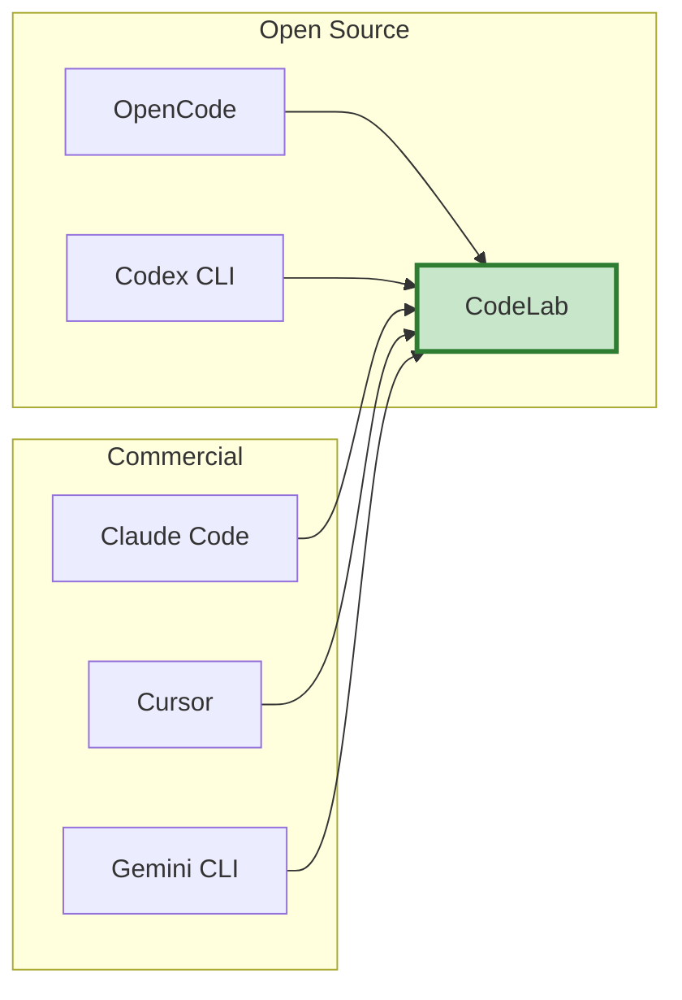
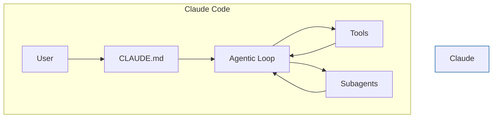
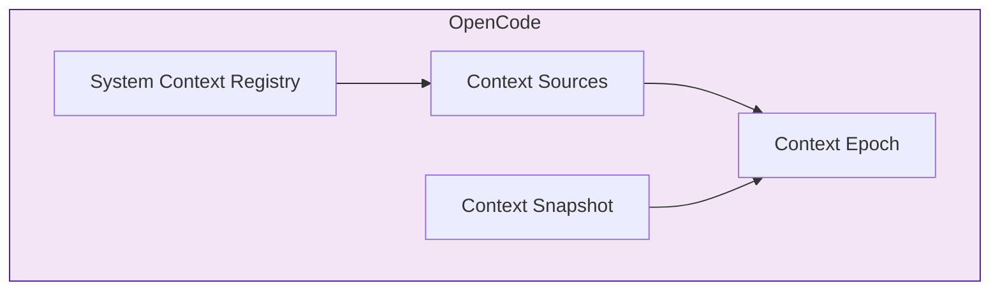
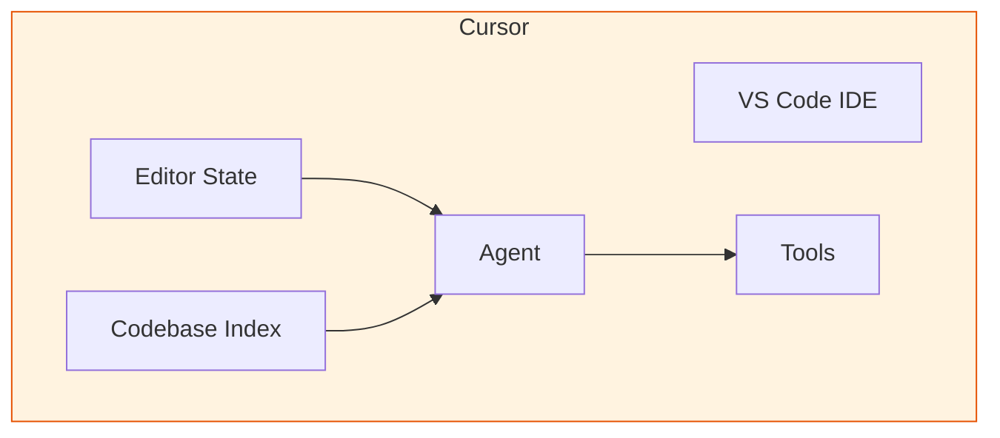
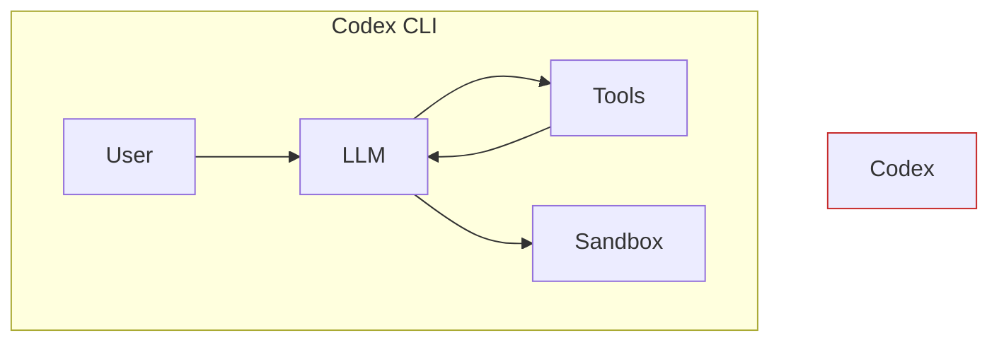
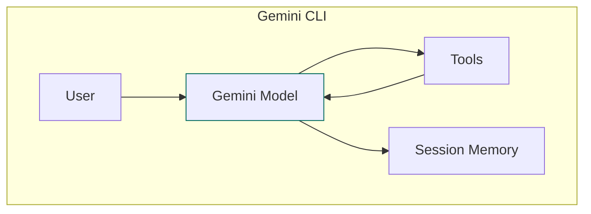
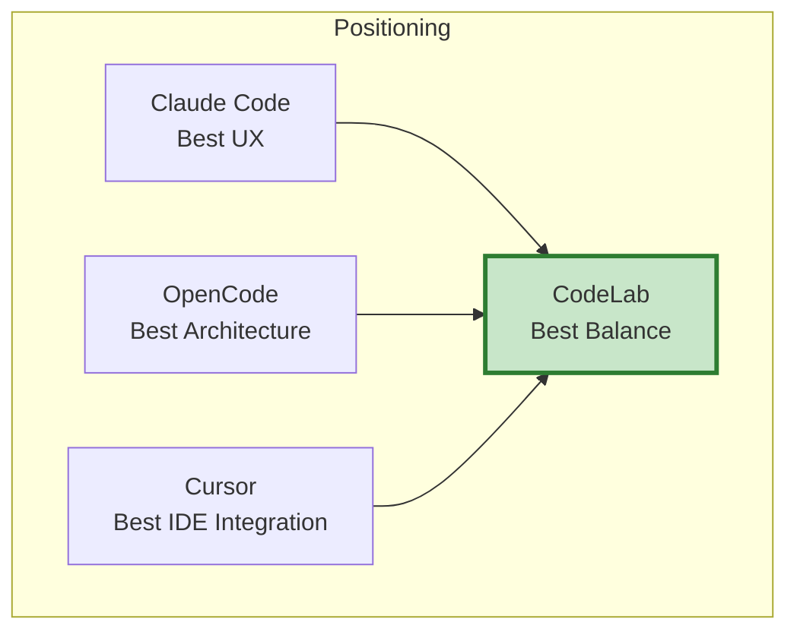

# Сравнение с конкурентами

> Детальное сравнение Context Manager с решениями Claude Code, OpenCode, Cursor, Codex CLI

## Связанные документы

- **[ARCHITECTURE.md](./ARCHITECTURE.md)** — полная архитектура системы
- **[ROADMAP.md](./ROADMAP.md)** — план реализации по фазам
- **[EXAMPLES.md](./EXAMPLES.md)** — практические примеры использования
- **[INDEX.md](./INDEX.md)** — навигация по документации

## Оглавление

- [Обзор конкурентов](#обзор-конкурентов)
- [Claude Code (Anthropic)](#claude-code-anthropic)
- [OpenCode](#opencode)
- [Cursor](#cursor)
- [Codex CLI (OpenAI)](#codex-cli-openai)
- [Gemini CLI (Google)](#gemini-cli-google)
- [Сравнительная таблица](#сравнительная-таблица)
- [Что берём у конкурентов](#что-берём-у-конкурентов)
- [Наши преимущества](#наши-преимущества)

---

## Обзор конкурентов



---

## Claude Code (Anthropic)

### Архитектура



### Ключевые особенности

**1. CLAUDE.md — иерархия инструкций**

```
~/.claude/CLAUDE.md          # Global
./CLAUDE.md                   # Project
./src/CLAUDE.md               # Directory
```

Агент автоматически загружает инструкции из всех уровней.

**2. Agentic Loop Pattern**

```
Gather Context → Take Action → Verify Results
      ↑                              ↓
      └──────────────────────────────┘
```

Цикл продолжается пока задача не решена.

**3. Subagents**

```python
# Основная задача
main_agent.run("Refactor authentication module")

# Subagent для исследования
subagent = create_subagent(
    task="Find all authentication-related files",
    tools=["read", "grep", "glob"]
)
result = subagent.run()

# Только summary возвращается в основной контекст
main_agent.context.add(result.summary)
```

**4. Context Epochs**

```
Epoch #1
 ├─ baseline (immutable)
 ├─ update 1
 └─ update 2

Compaction

Epoch #2
 ├─ new baseline
 └─ ...
```

### Сильные стороны

- ✅ Отличная система памяти (CLAUDE.md)
- ✅ Subagents для параллельной работы
- ✅ Автоматическая компакция контекста
- ✅ Checkpoints для отката изменений

### Слабые стороны

- ❌ Нет явного графа зависимостей
- ❌ LLM сама решает что читать (нестабильное качество)
- ❌ Сложная система промптов
- ❌ Закрытый код

### Что берём

- ✅ Иерархия instruction файлов (AGENTS.md)
- ✅ Context Epochs
- ✅ Subagents (Phase 6)

---

## OpenCode

### Архитектура



### Ключевые особенности

**1. System Context Registry**

```python
class ContextRegistry:
    """Реестр источников контекста"""
    
    sources: dict[str, ContextSource]
    
    def register(self, key: str, source: ContextSource):
        self.sources[key] = source
    
    async def render_baseline(self) -> str:
        """Рендер всех sources для начала epoch"""
        parts = []
        for source in self.sources.values():
            value = await source.load()
            parts.append(source.render_baseline(value))
        return "\n\n".join(parts)
```

**2. Context Sources**

```python
class ContextSource(Generic[T]):
    """Типизированный источник контекста"""
    
    key: str
    loader: Callable[[], T]
    codec: Codec[T]
    render_baseline: Callable[[T], str]
    render_update: Callable[[T], str]

# Примеры:
InstructionContextSource  # AGENTS.md
GitContextSource          # Git status
MemoryContextSource       # Cross-session memories
```

**3. Context Epochs**

```python
@dataclass
class ContextEpoch:
    baseline: str  # Immutable
    snapshot: dict[str, Any]
    mid_conversation_messages: list[str]
    
    def get_full_context(self) -> str:
        parts = [self.baseline]
        parts.extend(self.mid_conversation_messages)
        return "\n\n".join(parts)
```

**4. Context Snapshots**

```python
class ContextSnapshot:
    """Отслеживание изменений"""
    
    _values: dict[str, Any]
    
    def detect_changes(
        self,
        sources: dict[str, ContextSource]
    ) -> dict[str, Any]:
        changes = {}
        for key, source in sources.items():
            current = await source.load()
            old = self._values.get(key)
            
            if old is None or source.has_changed(old, current):
                changes[key] = current
        
        return changes
```

### Сильные стороны

- ✅ Самая продвинутая архитектура управления контекстом
- ✅ Чёткое разделение на sources
- ✅ Атомарные обновления контекста
- ✅ Открытый код

### Слабые стороны

- ❌ Очень сложная реализация
- ❌ Нет явного TaskAnalyzer
- ❌ Нет графа зависимостей
- ❌ Нет subagents

### Что берём

- ✅ Context Registry
- ✅ Context Sources
- ✅ Snapshots и Epochs

---

## Cursor

### Архитектура



### Ключевые особенности

**1. IDE-интеграция**

```
Автоматический контекст:
- Открытые файлы
- Выделенный текст
- Позиция курсора
- Активный файл
```

**2. @-mentions**

```
User: "Fix bug in @auth.py related to @UserDTO"

Агент автоматически включает:
- auth.py
- UserDTO
- Связанные файлы
```

**3. Codebase-wide Indexing**

```
Индекс всей кодовой базы:
- Символы (классы, функции)
- Импортные связи
- Типы данных
- Документация
```

### Сильные стороны

- ✅ Глубокая интеграция с IDE
- ✅ Автоматический контекст (открытые файлы, курсор)
- ✅ Отличная навигация по коду
- ✅ Codebase-wide understanding

### Слабые стороны

- ❌ Привязка к IDE (не CLI)
- ❌ Проприетарная технология
- ❌ Нет явного управления контекстом
- ❌ Нет TaskAnalyzer

### Что берём

- ✅ Автоматическое определение релевантных файлов
- ✅ Понимание структуры проекта

---

## Codex CLI (OpenAI)

### Архитектура



### Ключевые особенности

**1. Минимальный контекст**

```
LLM сама исследует кодовую базу:
- Читает файлы
- Ищет паттерны
- Строит понимание
```

**2. Sandboxed Execution**

```
Каждая команда выполняется в изолированной среде:
- Docker контейнер
- Ограниченные ресурсы
- Безопасность
```

**3. Простая компакция**

```
Когда контекст переполняется:
- Суммаризация истории
- Удаление старых tool outputs
```

### Сильные стороны

- ✅ Простота реализации
- ✅ Быстрый старт
- ✅ Безопасность (sandbox)

### Слабые стороны

- ❌ Нестабильное качество
- ❌ Нет графа зависимостей
- ❌ Нет управления контекстом
- ❌ LLM тратит много токенов на исследование

### Что НЕ берём

- ❌ Подход "LLM сама разберётся"

---

## Gemini CLI (Google)

### Архитектура



### Ключевые особенности

**1. Session Memory**

```
Долгосрочная память:
- Сохранение между сессиями
- Автоматическое извлечение фактов
- Контекстные подсказки
```

**2. Multi-modal Context**

```
Поддержка:
- Текст
- Изображения
- Код
- Документы
```

### Сильные стороны

- ✅ Большие контекстные окна (1M+ токенов)
- ✅ Multi-modal
- ✅ Session memory

### Слабые стороны

- ❌ Закрытый код
- ❌ Зависимость от Google API
- ❌ Нет явного управления контекстом

### Что берём

- ✅ Идея session memory (для будущих версий)

---

## Сравнительная таблица

| Компонент | Claude Code | OpenCode | Cursor | Codex CLI | Gemini CLI | **CodeLab** |
|-----------|-------------|----------|--------|-----------|------------|-------------|
| **Task Analysis** | LLM | Manual | IDE | LLM | LLM | **TaskAnalyzer** |
| **Context Sources** | CLAUDE.md | Registry | IDE | - | Memory | **ContextRegistry** |
| **Dependency Graph** | Implicit | - | Indexing | - | - | **Explicit** |
| **Context Epochs** | Yes | Yes | - | - | - | **Phase 3** |
| **Subagents** | Yes | - | - | - | - | **Phase 6** |
| **ACP Tools** | Minimal | Minimal | IDE | Minimal | Minimal | **Minimal** |
| **Open Source** | No | Yes | No | Yes | No | **Yes** |
| **CLI** | Yes | Yes | No | Yes | Yes | **Yes** |

---

## Что берём у конкурентов

### От Claude Code

```python
# 1. Иерархия instruction файлов
~/.config/codelab/AGENTS.md      # Global
./AGENTS.md                       # Project
./src/AGENTS.md                   # Directory

# 2. Context Epochs
class ContextEpoch:
    baseline: str  # Immutable
    mid_conversation_messages: list[str]

# 3. Subagents (Phase 6)
class SubagentManager:
    async def investigate(self, question: str) -> InvestigationResult:
        # Изолированное исследование
        pass
```

### От OpenCode

```python
# 1. Context Registry
class ContextRegistry:
    sources: dict[str, ContextSource]
    
    async def render_baseline(self) -> str:
        # Рендер всех sources
        pass

# 2. Context Sources
class InstructionContextSource(ContextSource):
    # AGENTS.md иерархия
    pass

class ProjectContextSource(ContextSource):
    # Структура проекта
    pass

# 3. Snapshots
class ContextSnapshot:
    async def detect_changes(self) -> dict[str, Any]:
        # Обнаружение изменений
        pass
```

### От Cursor

```python
# 1. Автоматическое определение релевантных файлов
class ContextGatherer:
    async def gather_context(self, task: str) -> GatheredContext:
        # Анализ задачи → поиск файлов → чтение
        pass

# 2. Понимание структуры проекта
class ProjectContextSource:
    async def load(self) -> ProjectMetadata:
        # Language, framework, dependencies
        pass
```

---

## Наши преимущества

### 1. Явная архитектура с самого начала

**Проблема конкурентов:**
- Claude Code: сложная система промптов
- OpenCode: очень сложная реализация
- Codex CLI: нет архитектуры

**Наше решение:**
```python
# Чёткое разделение на уровни
User-visible tools (LLM видит)
    ↓
Runtime services (LLM НЕ видит)
    ↓
ACP protocol (минимальный)
```

### 2. TaskAnalyzer + DependencyGraph

**Проблема конкурентов:**
- Claude Code: LLM сама решает что читать
- OpenCode: нет TaskAnalyzer
- Codex CLI: нет графа зависимостей

**Наше решение:**
```python
# TaskAnalyzer
profile = await analyzer.analyze(task)
# → TaskProfile с ключевыми словами и целевыми файлами

# DependencyGraph
graph = await builder.build_from_files(files)
deps = graph.get_dependencies("auth.controller.ts")
# → ["auth.service.ts", "user.repository.ts"]
```

**Результат:** Предсказуемое качество 85-95% вместо 40-90%.

### 3. Поэтапная реализация

**Проблема конкурентов:**
- Claude Code: сразу сложная система
- OpenCode: сразу сложная система
- Codex CLI: слишком просто

**Наше решение:**
```
Phase 0: Skeleton (1 неделя)
Phase 1: MVP (3 недели)
Phase 2-6: Extensions (6 недель)
```

**Результат:** Рабочий MVP через 4 недели, production-ready через 11 недель.

### 4. Минимальный ACP протокол

**Проблема конкурентов:**
- Многие специализированные tools
- Сложная интеграция
- Breaking changes

**Наше решение:**
```
ACP Tools:
├─ fs/read_text_file (существующий)
├─ fs/write_text_file (существующий)
└─ terminal/* (существующие)

Runtime Services:
├─ TaskAnalyzer
├─ ContextGatherer
└─ DependencyGraph
```

**Результат:** ACP остаётся минимальным, можно менять реализацию без изменения протокола.

### 5. Открытый код

**Проблема конкурентов:**
- Claude Code: закрытый
- Cursor: закрытый
- Gemini CLI: закрытый

**Наше решение:**
- Полностью открытый код
- Сообщество может участвовать
- Прозрачная архитектура

---

## Итоговая позиция



**CodeLab = Best Balance:**
- ✅ Архитектура уровня OpenCode
- ✅ UX уровня Claude Code
- ✅ Открытый код
- ✅ Поэтапная реализация
- ✅ Предсказуемое качество

---

## Дополнительные материалы

- [ARCHITECTURE.md](./ARCHITECTURE.md) — полная архитектура
- [ROADMAP.md](./ROADMAP.md) — план реализации
