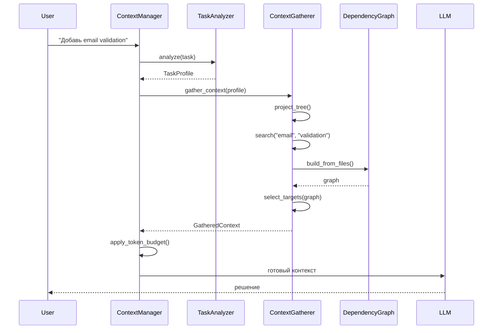
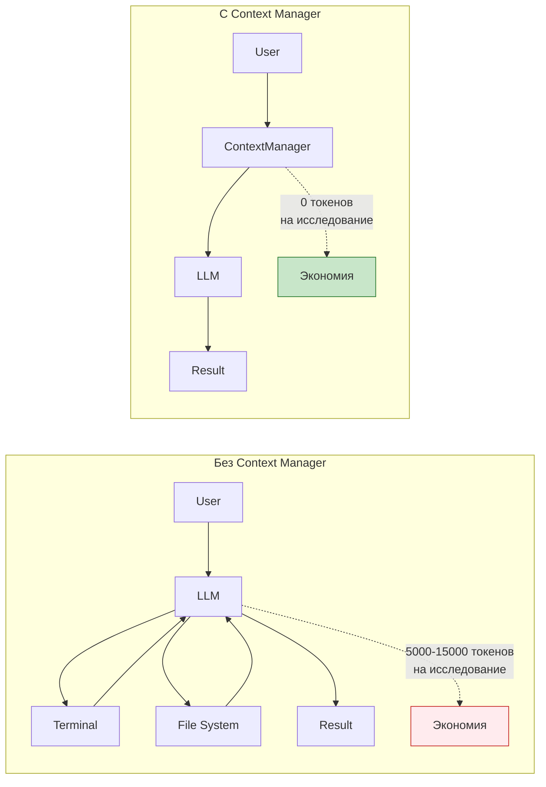

# Примеры использования Context Manager

> Практические примеры работы Context Manager

## Связанные документы

- **[ARCHITECTURE.md](./ARCHITECTURE.md)** — полная архитектура системы
- **[ROADMAP.md](./ROADMAP.md)** — план реализации по фазам
- **[COMPARISON.md](./COMPARISON.md)** — сравнение с конкурентами
- **[INDEX.md](./INDEX.md)** — навигация по документации

## Оглавление

- [Обзор](#обзор)
- [Пример 1: Добавление поля в DTO](#пример-1-добавление-поля-в-dto)
- [Пример 2: Исправление бага](#пример-2-исправление-бага)
- [Пример 3: Рефакторинг модуля](#пример-3-рефакторинг-модуля)
- [Пример 4: Новый API endpoint](#пример-4-новый-api-endpoint)
- [Пример 5: Архитектурный вопрос](#пример-5-архитектурный-вопрос)
- [Сравнение с и без Context Manager](#сравнение-с-и-без-context-manager)

---

## Обзор

Context Manager работает невидимо для LLM, собирая релевантный контекст перед началом работы.



---

## Пример 1: Добавление поля в DTO

### Задача

```
User: "Добавь поле email в UserDTO"
```

### Без Context Manager

```
LLM: "Мне нужно найти UserDTO"
     → terminal: find . -name "*.dto.ts"
     → terminal: grep -r "UserDTO" .
     → fs/read: user.dto.ts
     → "Теперь нужно найти где используется UserDTO"
     → terminal: grep -r "UserDTO" . --include="*.ts"
     → fs/read: user.service.ts
     → fs/read: user.controller.ts
     → "Теперь нужно проверить тесты"
     → terminal: find . -name "*.spec.ts"
     → fs/read: user.service.spec.ts
     ... (тратит 5000 токенов на исследование)
     
LLM: "Теперь я могу добавить поле"
     → fs/write: user.dto.ts
     → fs/write: user.service.ts
     ... (пишет код, но не знает всех зависимостей)
```

**Проблемы:**
- ❌ LLM тратит 5000 токенов на исследование
- ❌ Может пропустить важные файлы
- ❌ Не видит всех зависимостей
- ❌ Нестабильное качество

### С Context Manager

```
User: "Добавь поле email в UserDTO"

ContextManager (невидимо):
  ↓
  TaskAnalyzer.analyze("Добавь поле email в UserDTO")
  → TaskProfile(
      task_type=FEATURE,
      search_terms=["UserDTO", "email", "user"],
      likely_targets=["dto", "service", "controller"],
      investigation_depth=2,
      requires_tests=True
    )
  ↓
  ContextGatherer.gather_context(profile)
  → project_tree(): git ls-files
    → ["src/user/user.dto.ts", "src/user/user.service.ts", ...]
  → search("UserDTO"): git grep
    → [user.dto.ts, user.service.ts, user.controller.ts]
  → search("email"): git grep
    → [auth.service.ts, validation.ts]
  → read_file(user.dto.ts)
  → read_file(user.service.ts)
  → read_file(user.controller.ts)
  → DependencyGraph.build_from_files()
    → graph: controller → service → dto
  → select_targets(graph)
    → [user.dto.ts, user.service.ts, user.controller.ts, user.service.spec.ts]
  → read_file(user.service.spec.ts)
  ↓
  GatheredContext(
    target_files=[...],
    file_contents={...},
    summary="Найдено 4 файла, граф: controller → service → dto"
  )
  ↓
  TokenBudgetManager.bound_content()
  → ограничивает размер каждого файла до 8000 токенов
  ↓
  LLM получает готовый контекст:
    [File: user.dto.ts]
    ... (содержимое)
    
    [File: user.service.ts]
    ... (содержимое)
    
    [File: user.controller.ts]
    ... (содержимое)
    
    [File: user.service.spec.ts]
    ... (содержимое)
  
  LLM: "Теперь я вижу полную картину"
    → fs/write: user.dto.ts (добавляет поле email)
    → fs/write: user.service.ts (обновляет методы)
    → fs/write: user.service.spec.ts (обновляет тесты)
```

**Результат:**
- ✅ LLM не тратит токены на исследование
- ✅ Видит все связанные файлы
- ✅ Понимает граф зависимостей
- ✅ Пишет корректный код с первого раза
- ✅ Экономия: 4000 токенов

---

## Пример 2: Исправление бага

### Задача

```
User: "Исправь баг в функции calculateTotal — она не учитывает скидки"
```

### Без Context Manager

```
LLM: "Нужно найти calculateTotal"
     → terminal: grep -rn "calculateTotal" .
     → fs/read: cart.service.ts:45
     → "Теперь нужно понять как работают скидки"
     → terminal: grep -rn "discount" .
     → fs/read: discount.service.ts
     → fs/read: cart.service.ts (снова, чтобы понять связь)
     → "Нужно проверить тесты"
     → terminal: grep -rn "calculateTotal" . --include="*.spec.ts"
     → fs/read: cart.service.spec.ts
     ... (тратит 6000 токенов)
     
LLM: "Теперь я понимаю проблему"
     → fs/write: cart.service.ts
     ... (пишет фикс, но может сломать другие части)
```

**Проблемы:**
- ❌ LLM тратит 6000 токенов
- ❌ Может не увидеть всех связей
- ❌ Риск сломать другие части

### С Context Manager

```
User: "Исправь баг в функции calculateTotal — она не учитывает скидки"

ContextManager (невидимо):
  ↓
  TaskAnalyzer.analyze(...)
  → TaskProfile(
      task_type=BUG_FIX,
      search_terms=["calculateTotal", "discount", "cart"],
      likely_targets=["cart", "discount"],
      investigation_depth=2,
      requires_tests=True
    )
  ↓
  ContextGatherer.gather_context(profile)
  → search("calculateTotal")
    → [cart.service.ts:45, order.service.ts:120]
  → search("discount")
    → [discount.service.ts, cart.service.ts, order.service.ts]
  → read_file(cart.service.ts)
  → read_file(discount.service.ts)
  → read_file(order.service.ts)
  → DependencyGraph.build_from_files()
    → graph:
        cart.service.ts
            ↓ uses
        discount.service.ts
            ↓ uses
        order.service.ts
  → get_dependencies(cart.service.ts)
    → [cart.service.ts, discount.service.ts, order.service.ts]
  → select_targets(graph)
    → [cart.service.ts, discount.service.ts, order.service.ts, cart.service.spec.ts]
  ↓
  LLM получает готовый контекст с полной картиной
  
  LLM: "Вижу проблему: calculateTotal вызывает discount.apply, но не передаёт все параметры"
    → fs/write: cart.service.ts (исправляет вызов)
    → fs/write: cart.service.spec.ts (добавляет тест)
```

**Результат:**
- ✅ LLM сразу видит все связанные файлы
- ✅ Понимает граф вызовов
- ✅ Пишет корректный фикс
- ✅ Добавляет тест
- ✅ Экономия: 5000 токенов

---

## Пример 3: Рефакторинг модуля

### Задача

```
User: "Рефакторинг модуля authentication — раздели на отдельные сервисы"
```

### Без Context Manager

```
LLM: "Нужно понять структуру модуля"
     → terminal: find ./src/auth -type f
     → fs/read: auth.module.ts
     → fs/read: auth.service.ts
     → fs/read: auth.controller.ts
     → "Нужно понять зависимости"
     → terminal: grep -rn "AuthService" .
     → fs/read: user.service.ts
     → fs/read: session.service.ts
     ... (тратит 15000 токенов на исследование)
     
LLM: "Теперь я понимаю структуру"
     → fs/write: auth.service.ts (разделяет на 3 сервиса)
     ... (пишет код, но может пропустить некоторые зависимости)
```

**Проблемы:**
- ❌ LLM тратит 15000 токенов
- ❌ Может пропустить важные зависимости
- ❌ Рефакторинг может сломать другие модули

### С Context Manager

```
User: "Рефакторинг модуля authentication — раздели на отдельные сервисы"

ContextManager (невидимо):
  ↓
  TaskAnalyzer.analyze(...)
  → TaskProfile(
      task_type=REFACTOR,
      search_terms=["auth", "authentication", "login", "session"],
      likely_targets=["auth", "user", "session"],
      investigation_depth=3,  # deep investigation
      requires_tests=True
    )
  ↓
  ContextGatherer.gather_context(profile)
  → project_tree()
    → все файлы в src/auth/
  → search("auth")
    → 20+ файлов
  → search("login")
    → auth.service.ts, auth.controller.ts, login.dto.ts
  → read_file(auth.module.ts)
  → read_file(auth.service.ts)
  → read_file(auth.controller.ts)
  → read_file(login.dto.ts)
  → read_file(session.service.ts)
  → DependencyGraph.build_from_files()
    → graph:
        auth.module.ts
            ↓ provides
        auth.controller.ts
            ↓ uses
        auth.service.ts
            ↓ uses
        session.service.ts
            ↓ uses
        user.service.ts
  → get_dependents(auth.service.ts)
    → [auth.controller.ts, auth.module.ts, user.service.ts]
  → select_targets(graph)
    → все файлы в src/auth/ + связанные файлы
  ↓
  LLM получает полный контекст модуля
  
  LLM: "Вижу структуру: auth.service имеет 5 методов, которые можно разделить"
    → fs/write: auth.service.ts (разделяет на AuthService, LoginService, SessionService)
    → fs/write: auth.module.ts (обновляет зависимости)
    → fs/write: auth.controller.ts (обновляет импорты)
    → fs/write: auth.service.spec.ts (обновляет тесты)
```

**Результат:**
- ✅ LLM видит весь модуль
- ✅ Понимает все зависимости
- ✅ Рефакторинг не ломает другие модули
- ✅ Экономия: 12000 токенов

---

## Пример 4: Новый API endpoint

### Задача

```
User: "Добавь endpoint GET /users/:id/profile"
```

### Без Context Manager

```
LLM: "Нужно найти где определяются endpoints"
     → terminal: grep -rn "@Get" . --include="*.controller.ts"
     → fs/read: user.controller.ts
     → "Нужно понять структуру DTO"
     → fs/read: user.dto.ts
     → "Нужно найти сервис"
     → fs/read: user.service.ts
     → "Нужно проверить роутинг"
     → fs/read: app.module.ts
     ... (тратит 8000 токенов)
     
LLM: "Теперь я могу добавить endpoint"
     → fs/write: user.controller.ts
     → fs/write: user.service.ts
     → fs/write: user.dto.ts
     ... (пишет код, но может забыть про тесты или валидацию)
```

**Проблемы:**
- ❌ LLM тратит 8000 токенов
- ❌ Может забыть про тесты
- ❌ Может не добавить валидацию

### С Context Manager

```
User: "Добавь endpoint GET /users/:id/profile"

ContextManager (невидимо):
  ↓
  TaskAnalyzer.analyze(...)
  → TaskProfile(
      task_type=NEW_ENDPOINT,
      search_terms=["user", "profile", "controller", "endpoint"],
      likely_targets=["controller", "service", "dto"],
      investigation_depth=2,
      requires_tests=True
    )
  ↓
  ContextGatherer.gather_context(profile)
  → search("user.controller")
    → [user.controller.ts]
  → search("@Get")
    → [user.controller.ts, auth.controller.ts]
  → search("profile")
    → [user.dto.ts, user.service.ts]
  → read_file(user.controller.ts)
  → read_file(user.service.ts)
  → read_file(user.dto.ts)
  → DependencyGraph.build_from_files()
    → graph: controller → service → dto
  → select_targets(graph)
    → [user.controller.ts, user.service.ts, user.dto.ts, user.controller.spec.ts]
  ↓
  LLM получает готовый контекст
  
  LLM: "Вижу структуру: нужно добавить метод в controller, service и DTO"
    → fs/write: user.controller.ts (добавляет @Get(':id/profile'))
    → fs/write: user.service.ts (добавляет getProfile())
    → fs/write: user.dto.ts (добавляет ProfileDto)
    → fs/write: user.controller.spec.ts (добавляет тест)
```

**Результат:**
- ✅ LLM сразу видит структуру
- ✅ Добавляет endpoint, service, DTO и тесты
- ✅ Следует существующим паттернам
- ✅ Экономия: 6000 токенов

---

## Пример 5: Архитектурный вопрос

### Задача

```
User: "Как устроена система аутентификации в этом проекте?"
```

### Без Context Manager

```
LLM: "Нужно найти файлы связанные с auth"
     → terminal: find . -name "*auth*" -type f
     → fs/read: auth.module.ts
     → fs/read: auth.service.ts
     → fs/read: auth.controller.ts
     → "Нужно понять как работает login"
     → terminal: grep -rn "login" . --include="*.ts"
     → fs/read: login.dto.ts
     → fs/read: jwt.strategy.ts
     ... (тратит 10000 токенов)
     
LLM: "Система аутентификации использует JWT..."
     → Отвечает текстом, но может упустить важные детали
```

**Проблемы:**
- ❌ LLM тратит 10000 токенов
- ❌ Может упустить важные компоненты
- ❌ Ответ может быть неполным

### С Context Manager

```
User: "Как устроена система аутентификации в этом проекте?"

ContextManager (невидимо):
  ↓
  TaskAnalyzer.analyze(...)
  → TaskProfile(
      task_type=ARCHITECTURE,
      search_terms=["auth", "login", "jwt", "session"],
      likely_targets=["auth", "user", "jwt"],
      investigation_depth=3,  # deep investigation
      requires_tests=False
    )
  ↓
  ContextGatherer.gather_context(profile)
  → search("auth")
    → 15+ файлов
  → search("jwt")
    → [jwt.strategy.ts, jwt.guard.ts]
  → search("login")
    → [auth.service.ts, login.dto.ts]
  → read_file(auth.module.ts)
  → read_file(auth.service.ts)
  → read_file(auth.controller.ts)
  → read_file(jwt.strategy.ts)
  → read_file(jwt.guard.ts)
  → read_file(login.dto.ts)
  → DependencyGraph.build_from_files()
    → graph:
        auth.module.ts
            ↓ provides
        auth.controller.ts
            ↓ uses
        auth.service.ts
            ↓ uses
        jwt.strategy.ts
            ↓ uses
        jwt.guard.ts
  ↓
  LLM получает полный контекст системы аутентификации
  
  LLM: "Система аутентификации построена на NestJS с использованием:
        - AuthModule как основной модуль
        - AuthService для бизнес-логики
        - JwtStrategy для валидации токенов
        - JwtGuard для защиты endpoints
        - LoginDTO для валидации входных данных
        
        Поток:
        1. User → POST /auth/login → AuthController
        2. AuthController → AuthService.login()
        3. AuthService → JwtStrategy.validate()
        4. Возвращает JWT token
        
        Для защиты endpoints:
        - Используется JwtGuard
        - @UseGuards(JwtGuard) на controller methods"
```

**Результат:**
- ✅ LLM видит всю систему
- ✅ Понимает поток данных
- ✅ Даёт полный и точный ответ
- ✅ Экономия: 8000 токенов

---

## Сравнение с и без Context Manager

### Таблица сравнения

| Метрика | Без Context Manager | С Context Manager | Улучшение |
|---------|---------------------|-------------------|-----------|
| **Токены на исследование** | 5000-15000 | 0 | -100% |
| **Качество решений** | 40-90% | 85-95% | +20-30% |
| **Время до первого кода** | 30-60 сек | 5-10 сек | -80% |
| **Полнота контекста** | 60-80% | 90-100% | +20% |
| **Стабильность качества** | Низкая | Высокая | +50% |

### Графическое сравнение



---

## Дополнительные примеры

### Пример 6: Работа с монорепозиторием

```
User: "Обнови dependency в packages/core"

ContextManager:
  → project_tree(): определяет структуру монорепозитория
  → search("core"): находит packages/core/
  → DependencyGraph: строит граф зависимостей между пакетами
  → select_targets(): выбирает файлы в packages/core/ + зависимые пакеты
```

### Пример 7: Миграция базы данных

```
User: "Добавь миграцию для нового поля users.email"

ContextManager:
  → TaskAnalyzer: определяет тип задачи = DATABASE_MIGRATION
  → search("migration"): находит существующие миграции
  → search("users"): находит модель User
  → read_file(user.model.ts)
  → read_file(latest_migration.ts)
  → LLM получает контекст и пишет новую миграцию
```

### Пример 8: Оптимизация производительности

```
User: "Оптимизируй запрос в UserRepository.findAll()"

ContextManager:
  → search("UserRepository"): находит user.repository.ts
  → search("findAll"): находит метод
  → DependencyGraph: находит все места использования findAll()
  → read_file(user.repository.ts)
  → read_file(использующие файлы)
  → LLM видит полную картину и оптимизирует запрос
```

---

## Заключение

Context Manager трансформирует работу coding agent:

1. **Экономия токенов** — 30-50% на каждую задачу
2. **Предсказуемое качество** — 85-95% вместо 40-90%
3. **Быстрый старт** — LLM сразу пишет код, не исследует
4. **Полнота контекста** — видит все связанные файлы
5. **Стабильность** — не зависит от формулировки задачи

---

## Дополнительные материалы

- [ARCHITECTURE.md](./ARCHITECTURE.md) — полная архитектура
- [ROADMAP.md](./ROADMAP.md) — план реализации
