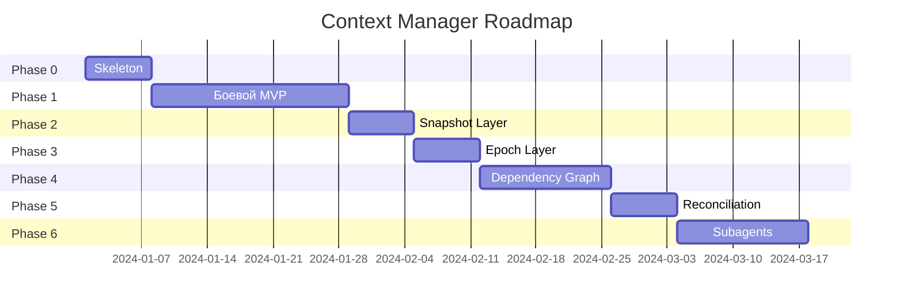

# Context Manager — Полная документация

> Интеллектуальный слой управления контекстом для coding agent уровня Claude Code / OpenCode

## 📚 Навигация по документации

### 🎯 Для начинающих

Если вы только знакомитесь с Context Manager:

1. **[README.md](./README.md)** — начните отсюда
   - Ключевые концепции
   - Основные сущности
   - Преимущества подхода
   - Быстрый старт

2. **[EXAMPLES.md](./EXAMPLES.md)** — практические примеры
   - Добавление поля в DTO
   - Исправление бага
   - Рефакторинг модуля
   - Новый API endpoint
   - Архитектурный вопрос

---

### 🏗️ Для архитекторов и разработчиков

Если вы хотите понять архитектуру или реализовать:

1. **[ARCHITECTURE.md](./ARCHITECTURE.md)** — полная архитектура
   - Основная идея и обоснование
   - Сравнение с конкурентами (краткое)
   - Архитектурные схемы (Mermaid)
   - Описание каждой сущности
   - Примеры кода

2. **[ROADMAP.md](./ROADMAP.md)** — план реализации
   - Phase 0-6 с детальным описанием
   - Примеры кода для каждой фазы
   - Критерии готовности
   - Временные оценки

3. **[COMPARISON.md](./COMPARISON.md)** — сравнение с конкурентами
   - Claude Code, OpenCode, Cursor, Codex CLI, Gemini CLI
   - Детальный анализ каждого
   - Сравнительная таблица
   - Наши преимущества

---

### 🌐 Общая архитектура системы

Если вы хотите понять полную архитектуру CodeLab Agent:

**[System Architecture](../system-architecture/SYSTEM_ARCHITECTURE.md)** — полная архитектура системы

**Слои системы:**

#### Core (MVP)
- **[Discovery Layer](../system-architecture/DISCOVERY_LAYER.md)** — ProjectDiscovery, SearchEngine
- **[File Intelligence](../system-architecture/FILE_INTELLIGENCE.md)** — ReadRangeStrategy, LargeFileHandler, ContextPruner

#### Advanced
- **[Memory Layer](../system-architecture/MEMORY_LAYER.md)** — TaskMemory, SessionMemory, ProjectMemory
- **[Git Awareness](../system-architecture/GIT_AWARENESS.md)** — GitContextSource, GitDiffAnalyzer, GitStatusProvider
- **[Verification Layer](../system-architecture/VERIFICATION_LAYER.md)** — TestRunner, BuildVerifier, LintVerifier

#### Claude Code / Cursor Level
- **[Code Understanding](../system-architecture/CODE_UNDERSTANDING.md)** — CodeIndexer, SymbolIndex, ReferenceIndex, CrossFileAnalyzer
- **[Planning Engine](../system-architecture/PLANNING_ENGINE.md)** — PlanningEngine, ModificationPlanner, ChangeImpactAnalyzer

#### Ultimate
- **[Semantic Layer](../system-architecture/SEMANTIC_LAYER.md)** — VectorIndex, RAGProvider, SemanticSearch
- **[LSP Integration](../system-architecture/LSP_INTEGRATION.md)** — LSPClient, DefinitionResolver, ReferenceResolver, RenameEngine
- **[Autonomous Reasoning](../system-architecture/AUTONOMOUS_REASONING.md)** — ReflectionEngine, SelfCritiqueEngine, RepairEngine

---

## 🎯 Ключевые идеи

### Единый ContextManager

**Ключевой принцип:** Один ContextManager — единая точка управления контекстом для всех стратегий.

**Три группы методов:**

| Группа | Метод | Назначение | Кто использует |
|--------|-------|------------|----------------|
| **1. Сбор контекста** | `build_context()` | Анализ задачи + поиск файлов + бюджетирование | ВСЕ стратегии |
| **2. Компакция** | `ensure_context_fits()` | Сжатие истории (Prune + Summarize) | ВСЕ стратегии |
| **3. Мультиагентные** | `process_subagent_response()` | Суммаризация ответов + child sessions | Только мультиагентные |

**Что поглощает ContextManager:**
- `HybridContextManager` — упраздняется
- `ContextCompactor` — становится внутренним компонентом
- `TokenSlicer` — становится внутренним компонентом

### Интеграция со стратегиями

| Стратегия | build_context() | process_subagent_response() | ensure_context_fits() |
|-----------|-----------------|----------------------------|----------------------|
| **SingleStrategy** | ✅ | ❌ | ✅ |
| **OrchestratedStrategy** | ✅ | ✅ | ✅ |
| **ChoreographyStrategy** | ✅ | ✅ (winner) | ❌ |
| **HierarchicalStrategy** | ✅ | ✅ | ✅ |

### Два уровня абстракции

```
┌─────────────────────────────────────────────┐
│  User-visible tools (видит LLM)             │
│  • fs/read_text_file                        │
│  • fs/write_text_file                       │
│  • terminal/*                               │
└─────────────────────────────────────────────┘
                     ↓
┌─────────────────────────────────────────────┐
│  ContextManager (единая точка входа)        │
│                                             │
│  Группа 1: Сбор контекста                   │
│  • TaskAnalyzer                             │
│  • ContextGatherer                          │
│  • DependencyGraph                          │
│  • TokenBudgetManager                       │
│                                             │
│  Группа 2: Компакция                        │
│  • ContextCompactor (внутренний)            │
│                                             │
│  Группа 3: Мультиагентные                   │
│  • TokenSlicer (внутренний)                 │
│  • ChildSessionManager (внутренний)         │
└─────────────────────────────────────────────┘
```

### Философия

**Архитектура = финальная сразу**  
**Реализация = по фазам**

MVP — это не упрощённая архитектура, а **полная архитектура с неполной реализацией**.

---

## 🚀 Быстрый старт

### Хотите понять архитектуру?

```
README.md → ARCHITECTURE.md → EXAMPLES.md
```

### Хотите реализовать?

```
README.md → ARCHITECTURE.md → ROADMAP.md → Phase 0
```

### Хотите понять позиционирование?

```
README.md → COMPARISON.md
```

---

## 📊 Основные метрики

| Метрика | Значение |
|---------|----------|
| **Экономия токенов** | 30-50% на задачу |
| **Качество решений** | 85-95% (вместо 40-90%) |
| **Время до кода** | -80% (5-10 сек вместо 30-60) |
| **Длительность MVP** | 4 недели |
| **Длительность production-ready** | 11 недель |

---

## 🗺️ Roadmap (кратко)



| Фаза | Длительность | Результат |
|------|--------------|-----------|
| **Phase 0** | 1 неделя | Архитектура зафиксирована |
| **Phase 1** | 3 недели | Боевой MVP |
| **Phase 2** | 1 неделя | Snapshot Layer |
| **Phase 3** | 1 неделя | Epoch Layer |
| **Phase 4** | 2 недели | Dependency Graph |
| **Phase 5** | 1 неделя | Reconciliation |
| **Phase 6** | 2 недели | Subagents |

**Итого:** 11 недель до production-ready

---

## 🎓 Основные сущности

### ContextManager (единая точка входа)

**Цель:** Единое управление контекстом для всех стратегий.

**Три группы методов:**

```python
class ContextManager:
    # Группа 1: Сбор контекста (ВСЕ стратегии)
    async def build_context(self, session, task) -> list[LLMMessage]:
        """Анализ задачи + поиск файлов + бюджетирование"""
        ...
    
    # Группа 2: Компакция (ВСЕ стратегии)
    async def ensure_context_fits(self, history) -> list[LLMMessage]:
        """Сжатие истории (Prune + Summarize)"""
        ...
    
    # Группа 3: Мультиагентные (только Orchestrated/Choreography/Hierarchical)
    async def process_subagent_response(self, response, session) -> SlicedResult:
        """Суммаризация ответов + child sessions"""
        ...
```

**Что поглощает:**
- `HybridContextManager` — упраздняется
- `ContextCompactor` — становится внутренним компонентом
- `TokenSlicer` — становится внутренним компонентом

---

### TaskAnalyzer (внутренний компонент)

**Цель:** Анализ задачи пользователя

```python
profile = await analyzer.analyze("Добавь email validation")
# → TaskProfile(
#     task_type=FEATURE,
#     search_terms=["email", "validation"],
#     likely_targets=["dto", "service"]
# )
```

---

### ContextGatherer (внутренний компонент)

**Цель:** Сбор контекста на основе TaskProfile

```python
context = await gatherer.gather_context(task, profile, session)
# → GatheredContext(
#     target_files=["auth.dto.ts", "auth.service.ts"],
#     file_contents={...}
# )
```

---

### DependencyGraph (внутренний компонент)

**Цель:** Понимание связей между файлами

```python
deps = graph.get_dependencies("auth.controller.ts")
# → ["auth.service.ts", "user.repository.ts"]
```

---

### TokenBudgetManager (внутренний компонент)

**Цель:** Управление token budget

```python
bounded = budget.bound_content(large_content, max_tokens=8000)
```

---

## 💡 Преимущества

### 1. Предсказуемое качество

**Без Context Manager:**
- "Добавь валидацию" → качество 40%
- "Добавь email validation" → качество 70%
- "Добавь email validation в UserDTO" → качество 90%

**С Context Manager:**
- Любая формулировка → качество 85-95%

### 2. Экономия токенов

LLM не тратит токены на исследование — получает готовый контекст.

**Экономия:** 30-50% токенов на каждую задачу.

### 3. Эволюционируемость

Можно менять реализацию без изменения архитектуры:
- Сегодня: `git grep`
- Завтра: `tree-sitter`
- Послезавтра: `RAG`

LLM не замечает разницы.

### 4. Минимальный ACP

Только существующие tools:
- `fs/read_text_file`
- `fs/write_text_file`
- `terminal/*`

Никаких новых ACP методов (опционально).

---

## 🆚 Сравнение с конкурентами

| Компонент | Claude Code | OpenCode | Cursor | **CodeLab** |
|-----------|-------------|----------|--------|-------------|
| Task Analysis | LLM | Manual | IDE | **TaskAnalyzer** |
| Context Sources | CLAUDE.md | Registry | IDE | **ContextRegistry** |
| Dependency Graph | Implicit | - | Indexing | **Explicit** |
| Context Epochs | Yes | Yes | - | **Phase 3** |
| Subagents | Yes | - | - | **Phase 6** |
| ACP Tools | Minimal | Minimal | IDE | **Minimal** |

**Подробнее:** [COMPARISON.md](./COMPARISON.md)

---

## 📖 Примеры использования

### Пример 1: Добавление поля в DTO

```
User: "Добавь поле email в UserDTO"

ContextManager (невидимо):
  → TaskAnalyzer: тип задачи = FEATURE
  → ContextGatherer: поиск "email", "UserDTO"
  → DependencyGraph: controller → service → dto
  → TokenBudget: ограничить размер файлов

LLM: Получает готовый контекст
  → Сразу пишет код
  → Обновляет DTO, service, controller, tests
```

**Результат:** Экономия 4000 токенов, качество 95%

**Подробнее:** [EXAMPLES.md](./EXAMPLES.md)

---

## 🎯 Следующие шаги

1. **Прочитайте документацию**
   - Начните с [README.md](./README.md)
   - Изучите [ARCHITECTURE.md](./ARCHITECTURE.md)
   - Посмотрите [EXAMPLES.md](./EXAMPLES.md)

2. **Обсудите архитектуру**
   - Задайте вопросы
   - Предложите улучшения
   - Создайте issue

3. **Начните реализацию**
   - Следуйте [ROADMAP.md](./ROADMAP.md)
   - Начните с Phase 0
   - Двигайтесь фаза за фазой

---

## 📚 Дополнительные материалы

- [AGENTS.md](../../AGENTS.md) — общие правила проекта
- [ARCHITECTURE.md](../architecture/ARCHITECTURE.md) — общая архитектура системы
- [ACP Protocol](../../protocols/Agent%20Client%20Protocol/) — спецификация протокола

---

## 💬 Контакты

Если у вас есть вопросы или предложения:
- Создайте issue в репозитории
- Обсудите в чате команды
- Предложите PR с улучшениями

---

## 📝 Лицензия

Этот документ является частью проекта CodeLab.
