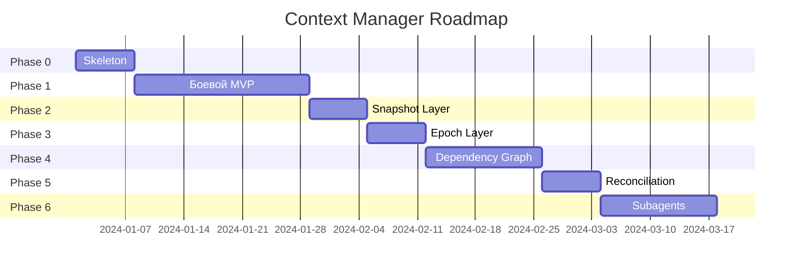
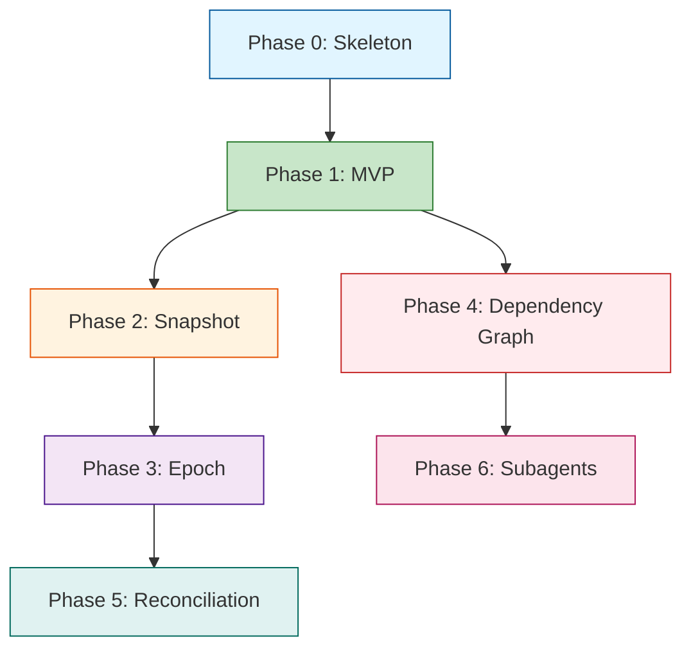

# Context Manager Roadmap

> Поэтапный план реализации Context Manager

## Оглавление

- [Обзор](#обзор)
- [Phase 0 — Skeleton](#phase-0--skeleton-1-неделя)
- [Phase 1 — Боевой MVP](#phase-1--боевой-mvp-3-недели)
- [Phase 2 — Snapshot Layer](#phase-2--snapshot-layer-1-неделя)
- [Phase 3 — Epoch Layer](#phase-3--epoch-layer-1-неделя)
- [Phase 4 — Dependency Graph](#phase-4--dependency-graph-2-недели)
- [Phase 5 — Context Reconciliation](#phase-5--context-reconciliation-1-неделя)
- [Phase 6 — Subagents](#phase-6--subagents-2-недели)
- [Итоговая таблица](#итоговая-таблица)

## Связанные документы

- **[ARCHITECTURE.md](./ARCHITECTURE.md)** — полная архитектура системы
- **[COMPARISON.md](./COMPARISON.md)** — сравнение с конкурентами
- **[EXAMPLES.md](./EXAMPLES.md)** — практические примеры использования
- **[INDEX.md](./INDEX.md)** — навигация по документации

---

## Обзор

### Обоснование порядка фаз

**Почему именно такой порядок фаз?**

Фазы упорядочены по принципу **зависимостей и ценности**:

1. **Phase 0 (Skeleton, 1 неделя)** — фиксация архитектуры
   - Почему первая: без зафиксированной архитектуры последующие фазы будут менять контракты
   - Почему 1 неделя: достаточно для определения интерфейсов и написания тестов-заглушек
   - Зависимости: нет

2. **Phase 1 (Боевой MVP, 3 недели)** — базовая функциональность
   - Почему вторая: даёт первый работающий продукт, который можно тестировать на реальных задачах
   - Почему самая длинная (3 недели): TaskAnalyzer + ContextGatherer + TokenBudgetManager — ядро системы
   - Зависимости: Phase 0 (интерфейсы)
   - Ценность: агент уже может решать простые задачи с качеством ~80%

3. **Phase 2 (Snapshot Layer, 1 неделя)** — отслеживание изменений
   - Почему третья: без snapshot невозможно понять, что изменилось в проекте
   - Почему 1 неделя: ContextRegistry + ContextSnapshot — относительно простые компоненты
   - Зависимости: Phase 1 (ContextGatherer уже работает)
   - Ценность: агент видит обновления AGENTS.md, новые файлы

4. **Phase 3 (Epoch Layer, 1 неделя)** — консистентность контекста
   - Почему четвёртая: epoch нужен для кэширования и mid-conversation updates
   - Почему 1 неделя: ContextEpoch + Reconciliation — надстройка над Snapshot
   - Зависимости: Phase 2 (Snapshot)
   - Ценность: после compaction начинается новый epoch, история изменений сохраняется

5. **Phase 4 (Dependency Graph, 2 недели)** — понимание связей
   - Почему пятая: даёт резкий рост качества (с 80% до 90%), но требует стабильного ядра
   - Почему 2 недели: парсинг импортов для Python/TypeScript/JavaScript + рекурсивный обход
   - Зависимости: Phase 1 (ContextGatherer)
   - Ценность: агент видит связанные файлы, не ломает зависимости

6. **Phase 5 (Context Reconciliation, 1 неделя)** — инкрементальные обновления
   - Почему шестая: оптимизация, не критичная для MVP
   - Почему 1 неделя: интеграция с LLMLoopStage, но логика уже есть в Phase 3
   - Зависимости: Phase 3 (Epoch)
   - Ценность: экономия токенов на инкрементальных обновлениях

7. **Phase 6 (Subagents, 2 недели)** — изоляция исследования
   - Почему последняя: требует стабильной мультиагентной архитектуры
   - Почему 2 недели: SubagentManager + интеграция с мультиагентными стратегиями
   - Зависимости: Phase 1-5 (вся система должна быть стабильной)
   - Ценность: исследование не pollution основной контекст

**Почему нельзя поменять фазы местами?**

- Phase 0 → Phase 1: нельзя реализовать без зафиксированных интерфейсов
- Phase 1 → Phase 2-3: нельзя отслеживать изменения без работающего ContextGatherer
- Phase 2 → Phase 3: Epoch строится на Snapshot
- Phase 4 может быть параллельно с Phase 2-3, но интегрируется в Phase 1 (ContextGatherer)
- Phase 5 требует Epoch (Phase 3)
- Phase 6 требует всей системы (Phase 1-5)

**Почему 11 недель суммарно?**

- MVP (Phase 0-1): 4 недели — минимум для работающего продукта
- Advanced (Phase 2-3): 2 недели — надстройка для production
- Production Ready (Phase 4-5): 3 недели — качество 90%+
- Full System (Phase 6): 2 недели — мультиагентные сценарии

Это оптимистичная оценка для команды из 1-2 разработчиков. Реалистичный срок с тестированием и отладкой: 14-16 недель.

### Философия

**Архитектура = финальная сразу**  
**Реализация = по фазам**

Каждая фаза добавляет новую функциональность без изменения существующих контрактов.

### Единый ContextManager

**Ключевой принцип:** Один ContextManager — единая точка управления контекстом для всех стратегий.

**Три группы методов:**

| Группа | Метод | Назначение | Кто использует |
|--------|-------|------------|----------------|
| **1. Сбор контекста** | `build_context()` | Анализ задачи + поиск файлов + бюджетирование | ВСЕ стратегии |
| **2. Компакция** | `ensure_context_fits()` | Сжатие истории (Prune + Summarize) | ВСЕ стратегии |
| **3. Мультиагентные** | `process_subagent_response()` | Суммаризация ответов + child sessions | Только мультиагентные |

**Что поглощает ContextManager:**
- `HybridContextManager` — упраздняется
- `ContextCompactor` — становится внутренним компонентом
- `TokenSlicer` — становится внутренним компонентом

### Интеграция со стратегиями

| Стратегия | build_context() | process_subagent_response() | ensure_context_fits() |
|-----------|-----------------|----------------------------|----------------------|
| **SingleStrategy** | ✅ | ❌ | ✅ |
| **OrchestratedStrategy** | ✅ | ✅ | ✅ |
| **ChoreographyStrategy** | ✅ | ✅ (winner) | ❌ |
| **HierarchicalStrategy** | ✅ | ✅ | ✅ |

### Общая схема



### Зависимости между фазами



---

## Phase 0 — Skeleton (1 неделя)

### Цель

Зафиксировать архитектуру, определить все интерфейсы и контракты.

### Что делаем

#### 1. Создаём структуру

```bash
mkdir -p src/codelab/server/context
touch src/codelab/server/context/__init__.py
touch src/codelab/server/context/manager.py
touch src/codelab/server/context/task_analyzer.py
touch src/codelab/server/context/gatherer.py
touch src/codelab/server/context/dependency_graph.py
touch src/codelab/server/context/budget.py
touch src/codelab/server/context/types.py
```

#### 2. Определяем типы

```python
# src/codelab/server/context/types.py

from dataclasses import dataclass, field
from enum import Enum

class TaskType(Enum):
    BUG_FIX = "bug_fix"
    FEATURE = "feature"
    REFACTOR = "refactor"
    ARCHITECTURE = "architecture"
    UNKNOWN = "unknown"

@dataclass
class TaskProfile:
    """Профиль задачи для сбора контекста"""
    task_type: TaskType
    likely_targets: list[str]
    search_terms: list[str]
    investigation_depth: int  # 1=shallow, 2=medium, 3=deep
    requires_tests: bool
    requires_migrations: bool

@dataclass
class SearchResult:
    """Результат поиска"""
    file_path: str
    line_number: int
    line_content: str
    match_content: str

@dataclass
class GatheredContext:
    """Собранный контекст для задачи"""
    task_profile: TaskProfile
    target_files: list[str]
    dependency_graph: Any  # DependencyGraph
    file_contents: dict[str, str]
    summary: str
```

#### 3. Определяем интерфейсы

```python
# src/codelab/server/context/task_analyzer.py

class TaskAnalyzer:
    """Анализирует задачу и определяет профиль для сбора контекста"""
    
    def __init__(self, llm: LLMProvider):
        self.llm = llm
    
    async def analyze(self, task: str, project_context: str) -> TaskProfile:
        """Проанализировать задачу и вернуть профиль"""
        raise NotImplementedError("Phase 1")


# src/codelab/server/context/gatherer.py

class ContextGatherer:
    """Целенаправленный сбор контекста на основе TaskProfile"""
    
    def __init__(
        self,
        tool_registry: ToolRegistry,
        graph_builder: DependencyGraphBuilder,
    ):
        self.tools = tool_registry
        self.graph_builder = graph_builder
    
    async def project_tree(self, cwd: str) -> list[str]:
        """Получить структуру проекта"""
        raise NotImplementedError("Phase 1")
    
    async def search(self, pattern: str, cwd: str) -> list[SearchResult]:
        """Поиск по кодовой базе"""
        raise NotImplementedError("Phase 1")
    
    async def read_file(self, path: str) -> str:
        """Чтение файла"""
        raise NotImplementedError("Phase 1")
    
    async def gather_context(
        self,
        task: str,
        profile: TaskProfile,
        session: SessionState,
    ) -> GatheredContext:
        """Полный цикл сбора контекста"""
        raise NotImplementedError("Phase 1")


# src/codelab/server/context/dependency_graph.py

@dataclass
class DependencyGraph:
    """Граф зависимостей между файлами"""
    
    file_imports: dict[str, set[str]] = field(default_factory=dict)
    
    def add_file(self, file_path: str, imports: list[str]) -> None:
        """Добавить файл и его импорты"""
        self.file_imports[file_path] = set(imports)
    
    def get_dependencies(self, file_path: str) -> list[str]:
        """Получить все зависимости файла (рекурсивно)"""
        raise NotImplementedError("Phase 4")
    
    def get_dependents(self, file_path: str) -> list[str]:
        """Получить все файлы, которые зависят от данного"""
        raise NotImplementedError("Phase 4")


class DependencyGraphBuilder:
    """Строит DependencyGraph на основе файлов"""
    
    async def build_from_files(
        self,
        files: list[str],
        gatherer: ContextGatherer
    ) -> DependencyGraph:
        """Построить граф из списка файлов"""
        raise NotImplementedError("Phase 4")


# src/codelab/server/context/budget.py

class TokenBudgetManager:
    """Управление token budget"""
    
    def __init__(self, max_tokens: int):
        self.max_tokens = max_tokens
        self.allocations = {
            'system_context': int(max_tokens * 0.20),
            'conversation_history': int(max_tokens * 0.50),
            'tool_outputs': int(max_tokens * 0.20),
            'response_buffer': int(max_tokens * 0.10)
        }
    
    def bound_content(self, content: str, max_tokens: int) -> str:
        """Ограничить размер контента"""
        raise NotImplementedError("Phase 1")
    
    async def compact_if_needed(
        self,
        history: list[LLMMessage]
    ) -> tuple[list[LLMMessage], bool]:
        """Сжать если превышен лимит"""
        raise NotImplementedError("Phase 1")


# src/codelab/server/context/manager.py

class ContextManager:
    """Единая точка управления контекстом для всех стратегий.
    
    Три группы методов:
    1. build_context() — сбор контекста (ВСЕ стратегии)
    2. ensure_context_fits() — компакция (ВСЕ стратегии)
    3. process_subagent_response() — мультиагентные (только Orchestrated/Choreography/Hierarchical)
    """
    
    def __init__(
        self,
        # Группа 1: Сбор контекста
        task_analyzer: TaskAnalyzer,
        gatherer: ContextGatherer,
        budget: TokenBudgetManager,
        
        # Группа 2: Компакция (поглощено из HybridContextManager)
        compactor: ContextCompactor,
        
        # Группа 3: Мультиагентные (поглощено из HybridContextManager)
        slicer: TokenSlicer,
        child_session_manager: ChildSessionManager,
    ):
        # Группа 1
        self.task_analyzer = task_analyzer
        self.gatherer = gatherer
        self.budget = budget
        
        # Группа 2
        self.compactor = compactor
        
        # Группа 3
        self.slicer = slicer
        self.child_session_manager = child_session_manager
    
    # === Группа 1: Сбор контекста (ДО LLM call) ===
    
    async def build_context(
        self,
        session: SessionState,
        task: str | None = None,
    ) -> list[LLMMessage]:
        """Собрать контекст для LLM call.
        
        Используется ВСЕМИ стратегиями.
        """
        raise NotImplementedError("Phase 1")
    
    # === Группа 2: Компакция (все стратегии) ===
    
    async def ensure_context_fits(
        self,
        history: list[LLMMessage],
    ) -> list[LLMMessage]:
        """Сжать историю если превышает лимит.
        
        Используется ВСЕМИ стратегиями.
        Поглощено из HybridContextManager.ensure_context_fits().
        """
        raise NotImplementedError("Phase 1")
    
    # === Группа 3: Мультиагентные (ТОЛЬКО для Orchestrated/Choreography/Hierarchical) ===
    
    async def process_subagent_response(
        self,
        response: AgentResponse,
        parent_session: SessionState,
    ) -> SlicedResult:
        """Обработать ответ субагента.
        
        Используется ТОЛЬКО мультиагентными стратегиями.
        SingleStrategy НЕ вызывает.
        Поглощено из HybridContextManager.process_subagent_response().
        """
        raise NotImplementedError("Phase 1")
```

#### 4. Пишем тесты

```python
# tests/server/context/test_types.py

def test_task_profile_creation():
    profile = TaskProfile(
        task_type=TaskType.FEATURE,
        likely_targets=["dto", "service"],
        search_terms=["email", "validation"],
        investigation_depth=2,
        requires_tests=True,
        requires_migrations=False
    )
    assert profile.task_type == TaskType.FEATURE
    assert len(profile.search_terms) == 2

# tests/server/context/test_interfaces.py

def test_task_analyzer_interface():
    analyzer = TaskAnalyzer(llm=Mock())
    with pytest.raises(NotImplementedError):
        await analyzer.analyze("task", "context")

def test_context_gatherer_interface():
    gatherer = ContextGatherer(tool_registry=Mock(), graph_builder=Mock())
    with pytest.raises(NotImplementedError):
        await gatherer.project_tree("/path")
```

### Результат

- ✅ Архитектура зафиксирована
- ✅ Все интерфейсы определены
- ✅ Типы данных определены
- ✅ Unit tests для контрактов
- ✅ Готово к реализации Phase 1

### Критерии готовности

- [ ] Все файлы созданы
- [ ] Все интерфейсы определены
- [ ] Unit tests проходят
- [ ] Код проходит `make check`

---

## Phase 1 — Боевой MVP (3 недели)

### Цель

Агент способен собирать контекст проекта и решать реальные задачи.

### Что делаем

#### Неделя 1: TaskAnalyzer

**Задачи:**

1. Реализовать `analyze()` с LLM классификацией
2. Prompt engineering для точной классификации
3. Поддержка типов задач: bug_fix, feature, refactor, architecture
4. Unit tests с mock LLM

**Код:**

```python
# src/codelab/server/context/task_analyzer.py

class TaskAnalyzer:
    def __init__(self, llm: LLMProvider):
        self.llm = llm
    
    async def analyze(self, task: str, project_context: str) -> TaskProfile:
        """Проанализировать задачу"""
        prompt = f"""
Analyze this coding task and determine:
1. Task type (bug_fix, feature, refactor, architecture, unknown)
2. Likely target modules/files
3. Search terms for finding relevant code
4. Investigation depth needed (1=shallow, 2=medium, 3=deep)
5. Whether tests need to be found
6. Whether database migrations are involved

Task: {task}

Project context:
{project_context}

Return JSON:
{{
    "task_type": "...",
    "likely_targets": [...],
    "search_terms": [...],
    "investigation_depth": N,
    "requires_tests": bool,
    "requires_migrations": bool
}}
"""
        
        response = await self.llm.create_completion(
            CompletionRequest(
                model="openai/gpt-4o-mini",
                messages=[LLMMessage(role="user", content=prompt)],
                max_tokens=500,
                temperature=0.0,
            )
        )
        
        return self._parse_task_profile(response.text)
    
    def _parse_task_profile(self, text: str) -> TaskProfile:
        """Parse LLM response into TaskProfile"""
        import json
        data = json.loads(text)
        
        return TaskProfile(
            task_type=TaskType(data.get("task_type", "unknown")),
            likely_targets=data.get("likely_targets", []),
            search_terms=data.get("search_terms", []),
            investigation_depth=data.get("investigation_depth", 2),
            requires_tests=data.get("requires_tests", False),
            requires_migrations=data.get("requires_migrations", False)
        )
```

**Тесты:**

```python
# tests/server/context/test_task_analyzer.py

class TestTaskAnalyzer:
    async def test_analyze_feature_task(self):
        mock_llm = Mock()
        mock_llm.create_completion.return_value = Mock(
            text='{"task_type": "feature", "search_terms": ["email"], ...}'
        )
        
        analyzer = TaskAnalyzer(llm=mock_llm)
        profile = await analyzer.analyze("Add email validation", "TypeScript")
        
        assert profile.task_type == TaskType.FEATURE
        assert "email" in profile.search_terms
    
    async def test_analyze_bug_fix_task(self):
        # ...
```

#### Неделя 2: ContextGatherer

**Задачи:**

1. Реализовать `project_tree()` через `terminal/create` (git ls-files)
2. Реализовать `search()` через `terminal/create` (git grep / rg)
3. Реализовать `read_file()` через `fs/read_text_file`
4. Реализовать `gather_context()` pipeline
5. Integration tests

**Код:**

```python
# src/codelab/server/context/gatherer.py

class ContextGatherer:
    def __init__(
        self,
        tool_registry: ToolRegistry,
        graph_builder: DependencyGraphBuilder,
    ):
        self.tools = tool_registry
        self.graph_builder = graph_builder
    
    async def project_tree(self, cwd: str) -> list[str]:
        """Получить структуру проекта через terminal"""
        # Попытка git ls-files
        result = await self.tools.execute(
            "terminal/create",
            {"command": "git ls-files", "cwd": cwd}
        )
        
        if result.exit_code == 0:
            return [f for f in result.output.strip().split('\n') if f]
        
        # Fallback на find
        result = await self.tools.execute(
            "terminal/create",
            {"command": "find . -type f -not -path '*/\\.*'", "cwd": cwd}
        )
        return [f for f in result.output.strip().split('\n') if f]
    
    async def search(self, pattern: str, cwd: str) -> list[SearchResult]:
        """Поиск через terminal"""
        # Проверка git repo
        is_git = await self._is_git_repo(cwd)
        
        if is_git:
            result = await self.tools.execute(
                "terminal/create",
                {"command": f"git grep -n '{pattern}'", "cwd": cwd}
            )
            return self._parse_git_grep(result.output)
        
        # Fallback на rg или grep
        result = await self.tools.execute(
            "terminal/create",
            {"command": f"rg '{pattern}' || grep -rn '{pattern}' .", "cwd": cwd}
        )
        return self._parse_search_output(result.output)
    
    async def read_file(self, path: str) -> str:
        """Чтение файла через fs/read_text_file"""
        result = await self.tools.execute(
            "fs/read_text_file",
            {"path": path}
        )
        return result.content
    
    async def gather_context(
        self,
        task: str,
        profile: TaskProfile,
        session: SessionState,
    ) -> GatheredContext:
        """Полный цикл сбора контекста"""
        # 1. Структура проекта
        tree = await self.project_tree(session.cwd)
        
        # 2. Поиск по ключевым словам
        search_results = []
        for term in profile.search_terms:
            results = await self.search(term, session.cwd)
            search_results.extend(results)
        
        # 3. Извлечение файлов
        candidate_files = self._extract_files(search_results)
        
        # 4. Чтение файлов
        file_contents = {}
        for file in candidate_files[:20]:  # Ограничение
            content = await self.read_file(file)
            file_contents[file] = content
        
        # 5. Граф зависимостей (пока пустой)
        graph = DependencyGraph()
        
        # 6. Выбор целевых файлов
        target_files = candidate_files[:10]
        
        return GatheredContext(
            task_profile=profile,
            target_files=target_files,
            dependency_graph=graph,
            file_contents=file_contents,
            summary=f"Found {len(target_files)} files"
        )
    
    async def _is_git_repo(self, cwd: str) -> bool:
        """Проверить является ли директория git repo"""
        result = await self.tools.execute(
            "terminal/create",
            {"command": "git rev-parse --is-inside-work-tree", "cwd": cwd}
        )
        return result.exit_code == 0
    
    def _parse_git_grep(self, output: str) -> list[SearchResult]:
        """Parse git grep output"""
        results = []
        for line in output.strip().split('\n'):
            if not line:
                continue
            parts = line.split(':', 2)
            if len(parts) >= 3:
                results.append(SearchResult(
                    file_path=parts[0],
                    line_number=int(parts[1]),
                    line_content=parts[2],
                    match_content=parts[2]
                ))
        return results
    
    def _extract_files(self, results: list[SearchResult]) -> list[str]:
        """Извлечь уникальные файлы из результатов поиска"""
        files = set()
        for result in results:
            files.add(result.file_path)
        return list(files)
```

#### Неделя 3: TokenBudgetManager + Интеграция

**Задачи:**

1. Реализовать `bound_content()` с truncation
2. Реализовать `compact_if_needed()` (базовая версия)
3. Создать `TaskAnalysisStage` для pipeline
4. Интегрировать с `ExecutionEngine`
5. End-to-end tests

**Код:**

```python
# src/codelab/server/context/budget.py

class TokenBudgetManager:
    def __init__(self, max_tokens: int):
        self.max_tokens = max_tokens
        self.allocations = {
            'system_context': int(max_tokens * 0.20),
            'conversation_history': int(max_tokens * 0.50),
            'tool_outputs': int(max_tokens * 0.20),
            'response_buffer': int(max_tokens * 0.10)
        }
    
    def bound_content(self, content: str, max_tokens: int) -> str:
        """Ограничить размер контента"""
        lines = content.split('\n')
        max_lines = max_tokens * 4  # ~4 символа на токен
        
        if len(lines) <= max_lines:
            return content
        
        # Сохранить начало и конец
        half = max_lines // 2
        truncated = '\n'.join(
            lines[:half] + ['... (truncated) ...'] + lines[-half:]
        )
        
        return truncated
    
    async def compact_if_needed(
        self,
        history: list[LLMMessage]
    ) -> tuple[list[LLMMessage], bool]:
        """Сжать если превышен лимит"""
        total_tokens = self._estimate_tokens(history)
        
        if total_tokens <= self.max_tokens * 0.9:
            return history, False
        
        # Базовая компакция: удалить старые tool outputs
        pruned = [msg for msg in history if msg.role != "tool"]
        
        return pruned, True
    
    def _estimate_tokens(self, messages: list[LLMMessage]) -> int:
        """Приблизительная оценка токенов"""
        total = 0
        for msg in messages:
            if msg.content:
                total += len(msg.content) // 4
        return total
```

**Интеграция с Pipeline и стратегиями:**

```python
# src/codelab/server/protocol/handlers/pipeline/stages/task_analysis.py

class TaskAnalysisStage(PromptStage):
    """Анализ задачи и сбор контекста перед LLM loop.
    
    Используется ВСЕМИ стратегиями через ExecutionEngine.
    """
    
    name = "task_analysis"
    
    def __init__(
        self,
        context_manager: ContextManager,
        enabled: bool = True,
    ):
        self.context_manager = context_manager
        self.enabled = enabled
    
    async def process(self, context: PromptContext) -> PromptContext:
        if not self.enabled:
            return context
        
        # Группа 1: Сбор контекста (ВСЕ стратегии)
        gathered_messages = await self.context_manager.build_context(
            session=context.session,
            task=context.raw_text
        )
        
        # Сохранить в meta для LLMLoopStage
        context.meta["gathered_context_messages"] = gathered_messages
        
        return context


# Интеграция со стратегиями:

# SingleStrategy
class SingleStrategy:
    async def execute(self, session, prompt):
        # Группа 1: Сбор контекста
        context = await self.context_manager.build_context(session, prompt)
        
        # LLM call
        response = await self.llm.call(context)
        
        # Группа 2: Компакция
        history = await self.context_manager.ensure_context_fits(session.history)
        
        return response

# OrchestratedStrategy
class OrchestratedStrategy:
    async def execute(self, session, prompt):
        # Группа 1: Сбор контекста
        context = await self.context_manager.build_context(session, prompt)
        
        # Orchestrator decision
        decision = await self.orchestrator.decide(context)
        
        # Sub-agent call
        response = await self.event_bus.send_request(decision)
        
        # Группа 3: Обработка ответа sub-agent
        result = await self.context_manager.process_subagent_response(
            response, session
        )
        
        # Группа 2: Компакция
        history = await self.context_manager.ensure_context_fits(session.history)
        
        return result

# ChoreographyStrategy
class ChoreographyStrategy:
    async def execute(self, session, prompt):
        # Группа 1: Сбор общего контекста для broadcast
        shared_context = await self.context_manager.build_context(session, prompt)
        
        # Broadcast всем агентам
        broadcast = ContextBroadcast(context=shared_context, ...)
        answers = await self.event_bus.broadcast(broadcast)
        
        # Conflict Resolution
        winner = self.resolve_conflict(answers)
        
        # Группа 3: Обработка ответа winner
        result = await self.context_manager.process_subagent_response(
            winner.output, session
        )
        
        return result

# HierarchicalStrategy
class HierarchicalStrategy:
    async def execute(self, session, prompt):
        # Группа 1: Сбор контекста для Primary
        context = await self.context_manager.build_context(session, prompt)
        
        # Primary LLM решает делегировать
        decision = await self.primary_llm.decide(context)
        
        if decision.should_delegate:
            # Sub-agent call
            response = await self.event_bus.send_request(decision)
            
            # Группа 3: Обработка ответа sub-agent
            result = await self.context_manager.process_subagent_response(
                response, session
            )
            
            # Группа 2: Компакция
            history = await self.context_manager.ensure_context_fits(session.history)
            
            return result
        else:
            # Primary отвечает сам
            return await self.llm.call(context)
```

**Миграция: упразднение HybridContextManager**

```python
# БЫЛО (до Context Manager):

# src/codelab/server/agent/core/context_manager.py
class HybridContextManager:
    """Устаревший компонент — будет удалён"""
    _slicer: TokenSlicer
    _compactor: ContextCompactor
    _storage: SessionStorage
    
    async def process_subagent_response(self, response, session):
        # TokenSlicer + Child Session
        ...
    
    async def ensure_context_fits(self, history):
        # ContextCompactor
        ...

# СТАЛО (после Context Manager):

# src/codelab/server/context/manager.py
class ContextManager:
    """Единая точка входа — заменяет HybridContextManager"""
    
    # Внутренние компоненты (поглощены из HybridContextManager)
    _compactor: ContextCompactor
    _slicer: TokenSlicer
    _child_session_manager: ChildSessionManager
    
    # Группа 2: Компакция (из HybridContextManager.ensure_context_fits)
    async def ensure_context_fits(self, history):
        return await self._compactor.compact_if_needed(history)
    
    # Группа 3: Мультиагентные (из HybridContextManager.process_subagent_response)
    async def process_subagent_response(self, response, session):
        sliced = await self._slicer.slice(response)
        child_session = await self._child_session_manager.create(session, response)
        return SlicedResult(summary=sliced.summary, child_session_id=child_session.id)

# HybridContextManager удаляется из кодовой базы
```

### Результат

```
Task: "Добавь email validation"
  ↓
TaskAnalyzer (невидимо)
  → TaskProfile: type=FEATURE, terms=["email", "validation"]
  ↓
ContextGatherer (невидимо)
  → project_tree(): git ls-files
  → search(): git grep "email"
  → read_file(): auth.py, user.py, dto.py
  → gather_context(): готовый контекст
  ↓
LLM получает контекст
  → Сразу пишет код
  ↓
Результат: рабочий код с валидацией
```

### Критерии готовности

- [ ] TaskAnalyzer классифицирует задачи с точностью >80%
- [ ] ContextGatherer находит релевантные файлы
- [ ] TokenBudgetManager ограничивает размер контента
- [ ] TaskAnalysisStage интегрирован в pipeline
- [ ] End-to-end тесты проходят
- [ ] Агент решает реальные задачи

---

## Phase 2 — Snapshot Layer (1 неделя)

### Цель

Агент понимает, что изменилось в проекте между шагами.

### Что делаем

1. **ContextRegistry:**
   - Реестр Context Sources
   - Методы: `register()`, `get()`, `render_baseline()`, `render_updates()`

2. **ContextSnapshot:**
   - `detect_changes()` — обнаружение изменений
   - `apply()` — применение изменений

3. **Context Sources:**
    - `InstructionContextSource` (AGENTS.md иерархия)
    - `ProjectContextSource` (структура проекта)
    - `GitContextSource` (git status, branch)
    - `SkillContextSource` (каталог skills из SkillRegistry)

4. **ContextManager.reconcile():**
   - Обнаружение изменений
   - Mid-conversation updates

### Результат

- ✅ Агент видит обновления AGENTS.md
- ✅ Агент видит новые файлы
- ✅ Контекст обновляется инкрементально

---

## Phase 3 — Epoch Layer (1 неделя)

### Цель

История изменений контекста, консистентность внутри epoch.

### Что делаем

1. **ContextEpoch:**
   - `baseline` + `mid_conversation_messages`
   - `get_full_context()`
   - Immutable baseline

2. **ContextManager.start_new_epoch():**
   - Создание нового epoch после compaction
   - Сохранение истории изменений

3. **Mid-conversation system messages:**
   - Добавление updates в epoch
   - Интеграция с `LLMLoopStage`

### Результат

- ✅ Консистентный контекст внутри epoch
- ✅ История изменений сохраняется
- ✅ После compaction начинается новый epoch

---

## Phase 4 — Dependency Graph (2 недели)

### Цель

Качество агента резко растёт за счёт понимания связей.

### Что делаем

1. **DependencyGraph (полная реализация):**
   - `get_dependencies()` с рекурсией
   - `get_dependents()` с reverse lookup
   - Поддержка Python, TypeScript, JavaScript

2. **DependencyGraphBuilder:**
   - Regex-based parsing для imports
   - Поддержка различных языков
   - Интеграция с `ContextGatherer`

3. **ContextGatherer с графом:**
   - `build_dependency_graph()` после поиска
   - `select_targets()` с учётом графа
   - Приоритизация файлов по связям

### Результат

```
Task: "Добавь метод в UserService"
  ↓
ContextGatherer:
  → search(): находит user.service.ts
  → build_dependency_graph():
      user.service.ts
          ↓
      user.repository.ts
          ↓
      database.ts
  → select_targets(): читает все связанные файлы
  ↓
LLM видит полную картину
  → Пишет корректный код
```

### Критерии готовности

- [ ] Граф строится для Python/TypeScript/JavaScript
- [ ] ContextGatherer использует граф для выбора файлов
- [ ] Качество решений растёт на 20-30%

---

## Phase 5 — Context Reconciliation (1 неделя)

### Цель

Обновление контекста без полного пересоздания.

### Что делаем

1. **ContextManager.reconcile() (полная реализация):**
   - Обнаружение изменений в sources
   - Генерация mid-conversation updates
   - Атомарное применение изменений

2. **Интеграция с LLMLoopStage:**
   - Вызов `reconcile()` перед каждым LLM call
   - Добавление updates в контекст

### Результат

- ✅ Контекст обновляется инкрементально
- ✅ Не нужно пересоздавать весь контекст
- ✅ Экономия токенов

---

## Phase 6 — Subagents (2 недели)

### Цель

Изоляция исследования от основного контекста.

### Что делаем

1. **SubagentManager:**
   - `investigate()` — делегировать исследование subagent
   - `parallel_investigate()` — параллельные исследования
   - Isolated context windows

2. **Интеграция с ContextGatherer:**
   - Делегирование сложных исследований
   - Возврат только summary в основной контекст

### Результат

- ✅ Исследование не pollution основной контекст
- ✅ Параллельная работа над несколькими задачами
- ✅ Экономия токенов основного контекста

---

## Итоговая таблица

| Фаза | Длительность | Результат | Критерии готовности |
|------|--------------|-----------|---------------------|
| **Phase 0** | 1 неделя | Архитектура зафиксирована | Все интерфейсы определены, тесты проходят |
| **Phase 1** | 3 недели | Боевой MVP | Агент решает реальные задачи |
| **Phase 2** | 1 неделя | Snapshot Layer | Агент видит изменения |
| **Phase 3** | 1 неделя | Epoch Layer | Консистентный контекст |
| **Phase 4** | 2 недели | Dependency Graph | Качество +20-30% |
| **Phase 5** | 1 неделя | Reconciliation | Инкрементальные обновления |
| **Phase 6** | 2 недели | Subagents | Изоляция исследования |

**Итого:** 11 недель до production-ready системы

---

## Дополнительные материалы

- [ARCHITECTURE.md](./ARCHITECTURE.md) — полная архитектура
- [AGENTS.md](../../AGENTS.md) — общие правила проекта
