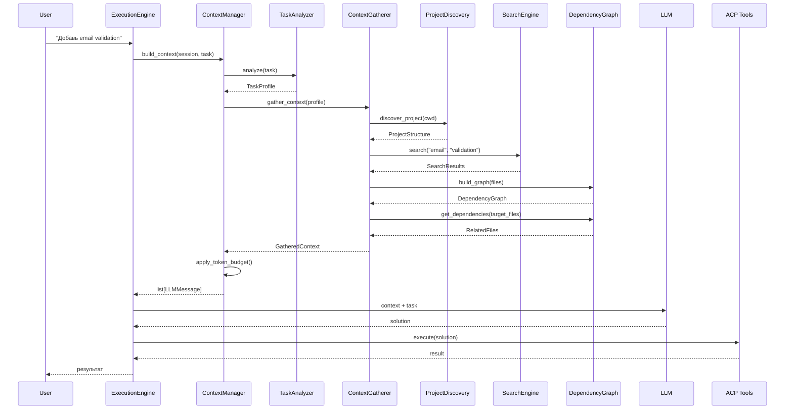
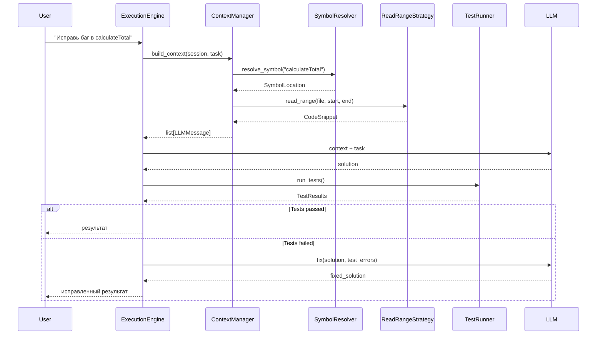

# System Architecture — Полная архитектура CodeLab Agent

> Компонентная архитектура coding agent уровня Claude Code / Cursor

## Оглавление

- [Обзор системы](#обзор-системы)
- [Архитектурные слои](#архитектурные-слои)
- [Диаграмма компонентов](#диаграмма-компонентов)
- [Поток данных](#поток-данных)
- [Компоненты по слоям](#компоненты-по-слоям)
- [Интеграция компонентов](#интеграция-компонентов)
- [Roadmap реализации](#roadmap-реализации)

---

## Обзор системы

CodeLab Agent — это coding agent, который понимает проект, находит релевантный код и решает задачи с помощью LLM.

**Ключевые возможности:**
- Понимание структуры проекта (Dependency Graph, Symbol Index)
- Интеллектуальный поиск файлов (Search Engine, Context Gatherer)
- Управление контекстом (Context Manager, Token Budget)
- Выполнение кода (Terminal, File System)
- Верификация результатов (Test Runner, Build Verifier)
- Память между сессиями (Task Memory, Project Memory)

**Целевой уровень качества:**
- Phase 1-2: 80% качества (рабочий MVP)
- Phase 3-4: 95% качества (production-ready)
- Phase 5: 99% качества (Claude Code / Cursor level)

### Обоснование архитектуры

**Почему 5 уровней, а не 3 или 7?**

5 уровней — это баланс между гранулярностью и управляемостью:

- **3 уровня** (Core/Advanced/Ultimate) — слишком грубо. Production Ready включает слишком разные компоненты (Git, Verification, Memory), которые реализуются в разное время.
- **7+ уровней** — избыточная детализация. Усложняет планирование и коммуникацию.
- **5 уровней** — каждый уровень имеет чёткую цель и критерии готовности:
  1. **Core (MVP)** — агент может решать простые задачи
  2. **Advanced** — агент понимает зависимости и связи
  3. **Production Ready** — агент верифицирует результаты и запоминает
  4. **Claude Code Level** — агент планирует и параллелит работу
  5. **Ultimate** — агент использует семантический поиск и LSP

**Почему компоненты распределены именно по этим уровням?**

Распределение основано на **зависимостях и ценности**:

- **Level 1 (Core)** — без этих компонентов агент вообще не работает:
  - ExecutionEngine — оркестрация выполнения
  - ContextManager — управление контекстом
  - TaskAnalyzer — анализ задач
  - ContextGatherer — сбор контекста
  - TokenBudgetManager — бюджетирование токенов

- **Level 2 (Advanced)** — надстройка над Core для понимания связей:
  - DependencyGraph — понимание зависимостей между файлами
  - SymbolResolver — резолвинг символов
  - ContextSnapshot — отслеживание изменений
  - Все эти компоненты требуют работающего Core

- **Level 3 (Production Ready)** — компоненты для production-использования:
  - GitAware — осведомлённость о Git (branch, diff, status)
  - Verification — верификация результатов (тесты, сборка, lint)
  - Memory — память между сессиями
  - Skills — динамическое подключение навыков
  - Эти компоненты не критичны для MVP, но необходимы для production

- **Level 4 (Claude Code Level)** — продвинутые возможности:
  - CodeIndex — индексация кода (символы, ссылки)
  - Planning — планирование изменений
  - Subagents — параллельная работа
  - Эти компоненты дают конкурентное преимущество, но требуют стабильного ядра

- **Level 5 (Ultimate)** — передовые технологии:
  - Semantic Layer — векторный поиск, RAG
  - LSP — интеграция с language servers
  - Autonomous Reasoning — рефлексия, самокритика, исправление
  - Эти компоненты сложны в реализации, но дают максимальное качество

**Почему quality targets: 80% → 90% → 95% → 99% → 99.9%?**

Целевые показатели качества основаны на **анализе конкурентов**:

- **80% (Phase 1-2)** — базовый MVP. Агент решает простые задачи (добавить поле, исправить опечатку). Качество ограничено отсутствием понимания зависимостей.
- **90% (Phase 3)** — продвинутый MVP. Агент понимает зависимости (DependencyGraph), видит связанные файлы. Качество растёт на 10-15%.
- **95% (Phase 4)** — production-ready. Агент верифицирует результаты (тесты, сборка), запоминает контекст. Качество стабильное.
- **99% (Phase 5)** — Claude Code level. Агент планирует изменения, использует семантический поиск. Качество близко к лучшим коммерческим решениям.
- **99.9% (Phase 6)** — ultimate. Агент использует LSP, рефлексию, самокритику. Качество максимально возможное.

Эти показатели — целевые, не гарантированные. Реальное качество зависит от качества LLM, сложности задач и полноты реализации.

**Почему 26 недель суммарно?**

Оценка основана на **сложности компонентов и зависимостях**:

- **Phase 1 (Core MVP, 4 недели)** — ExecutionEngine + ContextManager + базовые компоненты. Самое сложное — спроектировать правильные интерфейсы.
- **Phase 2 (Advanced, 4 недели)** — DependencyGraph + SymbolResolver + ContextSnapshot. Требует понимания AST и парсинга импортов.
- **Phase 3 (Production Ready, 4 недели)** — GitAware + Verification + Memory + Skills. Много интеграций с внешними системами (git, test frameworks, storage).
- **Phase 4 (Claude Code Level, 6 недель)** — CodeIndex + Planning + Subagents. Самое сложное — планирование и параллелизация.
- **Phase 5 (Ultimate, 8 недель)** — Semantic Layer + LSP + Autonomous Reasoning. Требует интеграции с внешними библиотеками (FAISS, LSP clients) и сложных алгоритмов.

Это оптимистичная оценка для команды из 1-2 разработчиков. Реалистичный срок с тестированием и отладкой: 32-40 недель.

---

## Архитектурные слои

Система разделена на **5 уровней** в зависимости от важности и сложности:

```
┌─────────────────────────────────────────────────────────────┐
│  Level 1: Core (MVP)                                        │
│  Без этого агент будет слабым                               │
│  ExecutionEngine, ContextManager, TaskAnalyzer              │
└─────────────────────────────────────────────────────────────┘
                            ↓
┌─────────────────────────────────────────────────────────────┐
│  Level 2: Advanced (первый серьёзный апгрейд)               │
│  DependencyGraph, SymbolResolver, ContextSnapshot           │
└─────────────────────────────────────────────────────────────┘
                            ↓
┌─────────────────────────────────────────────────────────────┐
│  Level 3: Production Ready                                  │
│  GitAware, Verification, Memory                             │
└─────────────────────────────────────────────────────────────┘
                            ↓
┌─────────────────────────────────────────────────────────────┐
│  Level 4: Claude Code / Cursor Level                        │
│  CodeIndex, Planning, Subagents                             │
└─────────────────────────────────────────────────────────────┘
                            ↓
┌─────────────────────────────────────────────────────────────┐
│  Level 5: Ultimate (уровень лучших агентов)                 │
│  Semantic Layer, LSP, Autonomous Reasoning                  │
└─────────────────────────────────────────────────────────────┘
```

---

## Диаграмма компонентов

```mermaid
graph TB
    subgraph "User Interface"
        CLI[CLI / TUI]
        WebUI[Web UI]
    end

    subgraph "Runtime Layer (Core)"
        EE[ExecutionEngine]
        TR[ToolRegistry]
        ACP[ACP Client]
        SS[SessionState]
    end

    subgraph "Context Layer (Core)"
        CM[ContextManager]
        CR[ContextRegistry]
        CG[ContextGatherer]
        TA[TaskAnalyzer]
        TBM[TokenBudgetManager]
    end

    subgraph "Discovery Layer (Core)"
        PD[ProjectDiscovery]
        SE[SearchEngine]
        DG[DependencyGraph]
    end

    subgraph "File Intelligence (Advanced)"
        RRS[ReadRangeStrategy]
        LFH[LargeFileHandler]
        CP[ContextPruner]
    end

    subgraph "Project Intelligence (Advanced)"
        SR[SymbolResolver]
        IR[ImportResolver]
        CI[CodeIndexer]
    end

    subgraph "Memory Layer (Production)"
        TM[TaskMemory]
        SM[SessionMemory]
        PM[ProjectMemory]
    end

    subgraph "Git Awareness (Production)"
        GCS[GitContextSource]
        GDA[GitDiffAnalyzer]
        GSP[GitStatusProvider]
    end

    subgraph "Skills System (Production)"
        SKR[SkillRegistry]
        SKC[SkillContextSource]
        SKD[SkillDeployer]
    end

    subgraph "Verification Layer (Production)"
        TestR[TestRunner]
        BV[BuildVerifier]
        LV[LintVerifier]
    end

    subgraph "Code Understanding (Claude Code Level)"
        SI[SymbolIndex]
        RI[ReferenceIndex]
        CFA[CrossFileAnalyzer]
    end

    subgraph "Planning Layer (Claude Code Level)"
        PE[PlanningEngine]
        MP[ModificationPlanner]
        CIA[ChangeImpactAnalyzer]
    end

    subgraph "Parallel Research (Claude Code Level)"
        SAM[SubagentManager]
        IA[InvestigationAgent]
        PCG[ParallelContextGatherer]
    end

    subgraph "Semantic Layer (Ultimate)"
        VI[VectorIndex]
        RAG[RAGProvider]
        SS2[SemanticSearch]
    end

    subgraph "LSP Integration (Ultimate)"
        LSP[LSPClient]
        DR[DefinitionResolver]
        RR[ReferenceResolver]
    end

    subgraph "Autonomous Reasoning (Ultimate)"
        RE[ReflectionEngine]
        SCE[SelfCritiqueEngine]
        RPE[RepairEngine]
    end

    CLI --> EE
    WebUI --> EE
    
    EE --> CM
    EE --> TR
    EE --> SS
    
    CM --> CG
    CM --> TBM
    CM --> CR
    
    CG --> PD
    CG --> SE
    CG --> DG
    
    DG --> SR
    DG --> IR
    
    CI --> SI
    CI --> RI
    
    PE --> MP
    MP --> CIA
    
    SAM --> IA
    IA --> PCG
    
    VI --> RAG
    RAG --> SS2
    
    LSP --> DR
    LSP --> RR
    
    RE --> SCE
    SCE --> RPE
    
    SKR --> SKC
    SKC --> CR

    style "Runtime Layer (Core)" fill:#e1f5ff,stroke:#01579b,stroke-width:2px
    style "Context Layer (Core)" fill:#c8e6c9,stroke:#2e7d32,stroke-width:2px
    style "Discovery Layer (Core)" fill:#fff3e0,stroke:#e65100,stroke-width:2px
    style "File Intelligence (Advanced)" fill:#f3e5f5,stroke:#4a148c,stroke-width:2px
    style "Project Intelligence (Advanced)" fill:#ffebee,stroke:#c62828,stroke-width:2px
    style "Memory Layer (Production)" fill:#e0f2f1,stroke:#00695c,stroke-width:2px
    style "Git Awareness (Production)" fill:#fce4ec,stroke:#ad1457,stroke-width:2px
    style "Skills System (Production)" fill:#f3e5f5,stroke:#6a1b9a,stroke-width:2px
    style "Verification Layer (Production)" fill:#e8f5e9,stroke:#2e7d32,stroke-width:2px
    style "Code Understanding (Claude Code Level)" fill:#fff9c4,stroke:#f57f17,stroke-width:2px
    style "Planning Layer (Claude Code Level)" fill:#fff9c4,stroke:#f57f17,stroke-width:2px
    style "Parallel Research (Claude Code Level)" fill:#fff9c4,stroke:#f57f17,stroke-width:2px
    style "Semantic Layer (Ultimate)" fill:#e1bee7,stroke:#6a1b9a,stroke-width:2px
    style "LSP Integration (Ultimate)" fill:#e1bee7,stroke:#6a1b9a,stroke-width:2px
    style "Autonomous Reasoning (Ultimate)" fill:#e1bee7,stroke:#6a1b9a,stroke-width:2px
```

---

## Поток данных

### Базовый поток (Core)



### Расширенный поток (Advanced)



---

## Компоненты по слоям

### Level 1: Core (MVP)

**Без этого агент будет слабым.**

#### Runtime

| Компонент | Назначение | Статус |
|-----------|------------|--------|
| `ExecutionEngine` | Оркестрация выполнения задач | ✅ Существует |
| `ToolRegistry` | Реестр инструментов (fs, terminal, plan) | ✅ Существует |
| `ACP Client` | Клиент ACP протокола | ✅ Существует |
| `SessionState` | Состояние сессии | ✅ Существует |

#### Context

| Компонент | Назначение | Статус |
|-----------|------------|--------|
| `ContextManager` | Единая точка управления контекстом | ✅ Документация |
| `ContextRegistry` | Реестр источников контекста | ✅ Документация |
| `ContextSource` | Базовый класс для источников | ✅ Документация |
| `ContextGatherer` | Сбор контекста для задачи | ✅ Документация |

#### Discovery

| Компонент | Назначение | Статус |
|-----------|------------|--------|
| `TaskAnalyzer` | Анализ задачи пользователя | ✅ Документация |
| `ProjectDiscovery` | Обнаружение структуры проекта | ❌ Нужно добавить |
| `SearchEngine` | Поиск по кодовой базе | ❌ Нужно добавить |

#### Budget

| Компонент | Назначение | Статус |
|-----------|------------|--------|
| `TokenBudgetManager` | Управление token budget | ✅ Документация |

#### ACP Tools

| Компонент | Назначение | Статус |
|-----------|------------|--------|
| `fs/read_text_file` | Чтение файлов | ✅ Существует |
| `fs/write_text_file` | Запись файлов | ✅ Существует |
| `terminal/*` | Выполнение команд | ✅ Существует |

---

### Level 2: Advanced

**Первый серьёзный апгрейд.**

#### Context Tracking

| Компонент | Назначение | Статус |
|-----------|------------|--------|
| `ContextSnapshot` | Отслеживание изменений | ✅ [Документация](./CONTEXT_LIFECYCLE.md#contextsnapshot) |
| `ContextReconciliation` | Согласование изменений | ✅ [Документация](./CONTEXT_LIFECYCLE.md#contextreconciliation) |

#### Project Intelligence

| Компонент | Назначение | Статус |
|-----------|------------|--------|
| `DependencyGraph` | Граф зависимостей | ✅ Документация |
| `SymbolResolver` | Резолвинг символов | ❌ Нужно добавить |
| `ImportResolver` | Резолвинг импортов | ❌ Нужно добавить |

#### Context Sources

| Компонент | Назначение | Статус |
|-----------|------------|--------|
| `ContextRegistry` | Реестр источников | ✅ [Документация](./CONTEXT_LIFECYCLE.md#contextregistry) |
| `ContextSource` | Базовый класс | ✅ [Документация](./CONTEXT_LIFECYCLE.md#contextsource) |
| `InstructionContextSource` | AGENTS.md иерархия | ✅ [Документация](./CONTEXT_LIFECYCLE.md#instructioncontextsource) |
| `ProjectContextSource` | Структура проекта | ✅ [Документация](./CONTEXT_LIFECYCLE.md#projectcontextsource) |
| `EnvironmentContextSource` | Environment variables | ✅ [Документация](./CONTEXT_LIFECYCLE.md#environmentcontextsource) |
| `SkillContextSource` | Каталог skills | ✅ [Документация](./CONTEXT_LIFECYCLE.md#skillcontextsource) |

> **Примечание:** Все файловые операции в Context Sources выполняются через ACP (ToolRegistry) для поддержки LOCAL и REMOTE режимов. Server не имеет прямого доступа к файловой системе клиента.

#### File Intelligence

| Компонент | Назначение | Статус |
|-----------|------------|--------|
| `ReadRangeStrategy` | Чтение диапазонов файлов | ❌ Нужно добавить |
| `LargeFileHandler` | Обработка больших файлов | ❌ Нужно добавить |
| `ContextPruner` | Обрезка нерелевантного контекста | ❌ Нужно добавить |

---

### Level 3: Production Ready

**Git, Verification, Memory.**

#### Context Lifecycle

| Компонент | Назначение | Статус |
|-----------|------------|--------|
| `ContextEpoch` | Immutable baseline + updates | ✅ [Документация](./CONTEXT_LIFECYCLE.md#contextepoch) |
| `ContextCompactor` | Сжатие контекста | ✅ Существует |
| `ConversationSummarizer` | Суммаризация диалога | ✅ [Документация](./CONTEXT_LIFECYCLE.md#conversationsummarizer) |

#### Memory

| Компонент | Назначение | Статус |
|-----------|------------|--------|
| `TaskMemory` | Память о задачах | ❌ Нужно добавить |
| `SessionMemory` | Память сессии | ❌ Нужно добавить |
| `ProjectMemory` | Память проекта | ❌ Нужно добавить |

#### Git Awareness

| Компонент | Назначение | Статус |
|-----------|------------|--------|
| `GitContextSource` | Git status, branch | ✅ Упомянут |
| `GitDiffAnalyzer` | Анализ изменений | ❌ Нужно добавить |
| `GitStatusProvider` | Git status provider | ❌ Нужно добавить |

#### Skills System

| Компонент | Назначение | Статус |
|-----------|------------|--------|
| `SkillRegistry` | Реестр skills | ✅ [Спецификация](../../../openspec/changes/skills-system-support/specs/skills-system/spec.md) |
| `SkillContextSource` | Каталог skills как контекст | ✅ [Документация](./CONTEXT_LIFECYCLE.md#skillcontextsource) |
| `SkillDeployer` | Деплой ресурсов skills | ✅ [Спецификация](../../../openspec/changes/skills-system-support/specs/skills-system/spec.md) |
| `SkillCatalogBuilder` | Построение каталога | ✅ [Спецификация](../../../openspec/changes/skills-system-support/specs/skills-system/spec.md) |

#### Verification

| Компонент | Назначение | Статус |
|-----------|------------|--------|
| `TestRunner` | Запуск тестов | ❌ Нужно добавить |
| `BuildVerifier` | Проверка сборки | ❌ Нужно добавить |
| `LintVerifier` | Проверка линтера | ❌ Нужно добавить |

---

### Level 4: Claude Code / Cursor Level

**Code Understanding, Planning, Parallel Research.**

#### Code Understanding

| Компонент | Назначение | Статус |
|-----------|------------|--------|
| `CodeIndexer` | Индексация кода | ❌ Нужно добавить |
| `SymbolIndex` | Индекс символов | ❌ Нужно добавить |
| `ReferenceIndex` | Индекс ссылок | ❌ Нужно добавить |
| `CrossFileAnalyzer` | Межфайловый анализ | ❌ Нужно добавить |

#### Advanced Planning

| Компонент | Назначение | Статус |
|-----------|------------|--------|
| `PlanningEngine` | Движок планирования | ❌ Нужно добавить |
| `ModificationPlanner` | Планировщик изменений | ❌ Нужно добавить |
| `ChangeImpactAnalyzer` | Анализ влияния изменений | ❌ Нужно добавить |

#### Parallel Research

| Компонент | Назначение | Статус |
|-----------|------------|--------|
| `SubagentManager` | Управление subagents | ✅ Документация |
| `InvestigationAgent` | Агент исследования | ❌ Нужно добавить |
| `ParallelContextGatherer` | Параллельный сбор контекста | ❌ Нужно добавить |

---

### Level 5: Ultimate

**Semantic Layer, LSP, Autonomous Reasoning.**

#### Semantic Layer

| Компонент | Назначение | Статус |
|-----------|------------|--------|
| `VectorIndex` | Векторный индекс | ❌ Нужно добавить |
| `RAGProvider` | RAG провайдер | ❌ Нужно добавить |
| `SemanticSearch` | Семантический поиск | ❌ Нужно добавить |

#### LSP Integration

| Компонент | Назначение | Статус |
|-----------|------------|--------|
| `LSPClient` | LSP клиент | ❌ Нужно добавить |
| `DefinitionResolver` | Резолвинг определений | ❌ Нужно добавить |
| `ReferenceResolver` | Резолвинг ссылок | ❌ Нужно добавить |
| `RenameEngine` | Движок переименования | ❌ Нужно добавить |

#### Autonomous Reasoning

| Компонент | Назначение | Статус |
|-----------|------------|--------|
| `ReflectionEngine` | Движок рефлексии | ❌ Нужно добавить |
| `SelfCritiqueEngine` | Самокритика | ❌ Нужно добавить |
| `RepairEngine` | Движок исправления | ❌ Нужно добавить |

---

## Интеграция компонентов

### Как компоненты взаимодействуют

```python
class ExecutionEngine:
    """Оркестрация выполнения задач."""
    
    def __init__(
        self,
        context_manager: ContextManager,
        tool_registry: ToolRegistry,
        session_state: SessionState,
    ):
        self.context_manager = context_manager
        self.tool_registry = tool_registry
        self.session_state = session_state
    
    async def execute(self, task: str) -> ExecutionResult:
        # 1. Сбор контекста
        context = await self.context_manager.build_context(
            session=self.session_state,
            task=task
        )
        
        # 2. LLM call
        response = await self.llm.call(context)
        
        # 3. Выполнение инструментов
        for tool_call in response.tool_calls:
            result = await self.tool_registry.execute(tool_call)
        
        # 4. Верификация (если есть)
        if self.verifier:
            verification = await self.verifier.verify()
        
        return ExecutionResult(response, verification)


class ContextManager:
    """Единая точка управления контекстом."""
    
    def __init__(
        self,
        task_analyzer: TaskAnalyzer,
        context_gatherer: ContextGatherer,
        token_budget: TokenBudgetManager,
        symbol_resolver: SymbolResolver | None = None,
        dependency_graph: DependencyGraph | None = None,
    ):
        self.task_analyzer = task_analyzer
        self.context_gatherer = context_gatherer
        self.token_budget = token_budget
        self.symbol_resolver = symbol_resolver
        self.dependency_graph = dependency_graph
    
    async def build_context(
        self,
        session: SessionState,
        task: str,
    ) -> list[LLMMessage]:
        # 1. Анализ задачи
        profile = await self.task_analyzer.analyze(task)
        
        # 2. Сбор контекста
        gathered = await self.context_gatherer.gather_context(
            task=task,
            profile=profile,
            session=session
        )
        
        # 3. Резолвинг символов (если есть)
        if self.symbol_resolver:
            symbols = await self.symbol_resolver.resolve(
                gathered.target_files
            )
            gathered.add_symbols(symbols)
        
        # 4. Граф зависимостей (если есть)
        if self.dependency_graph:
            deps = await self.dependency_graph.get_dependencies(
                gathered.target_files
            )
            gathered.add_dependencies(deps)
        
        # 5. Бюджетирование
        bounded = self.token_budget.apply(gathered)
        
        return bounded.to_llm_messages()
```

---

## Roadmap реализации

### Phase 1: Core MVP (4 недели)

**Результат:** Рабочий агент с базовым качеством (80%).

```
✅ ExecutionEngine
✅ ToolRegistry
✅ ACP Client
✅ SessionState
✅ ContextManager
✅ ContextRegistry
✅ ContextSource
✅ ContextGatherer
✅ TaskAnalyzer
❌ ProjectDiscovery (нужно добавить)
❌ SearchEngine (нужно добавить)
✅ TokenBudgetManager
```

**Документация:**
- ✅ [ARCHITECTURE.md](../context-manager/ARCHITECTURE.md) — Context Manager
- ❌ [DISCOVERY_LAYER.md](./DISCOVERY_LAYER.md) — ProjectDiscovery, SearchEngine

---

### Phase 2: Advanced (4 недели)

**Результат:** Продвинутый агент с пониманием зависимостей (90%).

```
✅ ContextSnapshot
✅ ContextReconciliation
✅ DependencyGraph
❌ SymbolResolver (нужно добавить)
❌ ImportResolver (нужно добавить)
❌ ReadRangeStrategy (нужно добавить)
❌ LargeFileHandler (нужно добавить)
```

**Документация:**
- ❌ [FILE_INTELLIGENCE.md](./FILE_INTELLIGENCE.md) — ReadRangeStrategy, LargeFileHandler
- ❌ [PROJECT_INTELLIGENCE.md](./PROJECT_INTELLIGENCE.md) — SymbolResolver, ImportResolver

---

### Phase 3: Production Ready (4 недели)

**Результат:** Production-ready агент с верификацией (95%).

```
✅ ContextEpoch
✅ ContextCompactor
❌ ConversationSummarizer (нужно добавить)
❌ GitContextSource (нужно добавить)
❌ GitDiffAnalyzer (нужно добавить)
❌ SkillRegistry (нужно добавить)
❌ SkillContextSource (нужно добавить)
❌ SkillDeployer (нужно добавить)
❌ TestRunner (нужно добавить)
❌ BuildVerifier (нужно добавить)
❌ LintVerifier (нужно добавить)
```

**Документация:**
- ❌ [GIT_AWARENESS.md](./GIT_AWARENESS.md) — GitDiffAnalyzer, GitStatusProvider
- ❌ [Skills System Spec](../../../openspec/changes/skills-system-support/specs/skills-system/spec.md) — SkillRegistry, SkillContextSource, SkillDeployer
- ❌ [VERIFICATION_LAYER.md](./VERIFICATION_LAYER.md) — TestRunner, BuildVerifier, LintVerifier
- ❌ [MEMORY_LAYER.md](./MEMORY_LAYER.md) — TaskMemory, SessionMemory, ProjectMemory

---

### Phase 4: Claude Code Level (6 недель)

**Результат:** Агент уровня Claude Code (99%).

```
❌ CodeIndexer (нужно добавить)
❌ SymbolIndex (нужно добавить)
❌ PlanningEngine (нужно добавить)
❌ ModificationPlanner (нужно добавить)
❌ ChangeImpactAnalyzer (нужно добавить)
✅ SubagentManager (документация)
❌ InvestigationAgent (нужно добавить)
```

**Документация:**
- ❌ [CODE_UNDERSTANDING.md](./CODE_UNDERSTANDING.md) — CodeIndexer, SymbolIndex
- ❌ [PLANNING_ENGINE.md](./PLANNING_ENGINE.md) — PlanningEngine, ModificationPlanner

---

### Phase 5: Ultimate (8 недель)

**Результат:** Агент уровня лучших систем (99.9%).

```
❌ VectorIndex (нужно добавить)
❌ RAGProvider (нужно добавить)
❌ LSPClient (нужно добавить)
❌ ReflectionEngine (нужно добавить)
```

**Документация:**
- ❌ [SEMANTIC_LAYER.md](./SEMANTIC_LAYER.md) — VectorIndex, RAGProvider
- ❌ [LSP_INTEGRATION.md](./LSP_INTEGRATION.md) — LSPClient, DefinitionResolver
- ❌ [AUTONOMOUS_REASONING.md](./AUTONOMOUS_REASONING.md) — ReflectionEngine, SelfCritiqueEngine

---

## Итого

**Общее время реализации:** 26 недель (6.5 месяцев)

**Ключевые вехи:**
- **Phase 1-2 (8 недель):** 80-90% качества — рабочий MVP
- **Phase 3 (4 недели):** 95% качества — production-ready
- **Phase 4 (6 недель):** 99% качества — Claude Code level
- **Phase 5 (8 недель):** 99.9% качества — ultimate

**Приоритет:**
1. Phase 1-2 — критично для MVP
2. Phase 3 — важно для production
3. Phase 4-5 — для конкуренции с лучшими

---

## Дополнительные материалы

- [Context Manager Architecture](../context-manager/ARCHITECTURE.md) — детальная архитектура Context Manager
- [Context Manager Roadmap](../context-manager/ROADMAP.md) — план реализации Context Manager
- [Comparison with Competitors](../context-manager/COMPARISON.md) — сравнение с конкурентами
