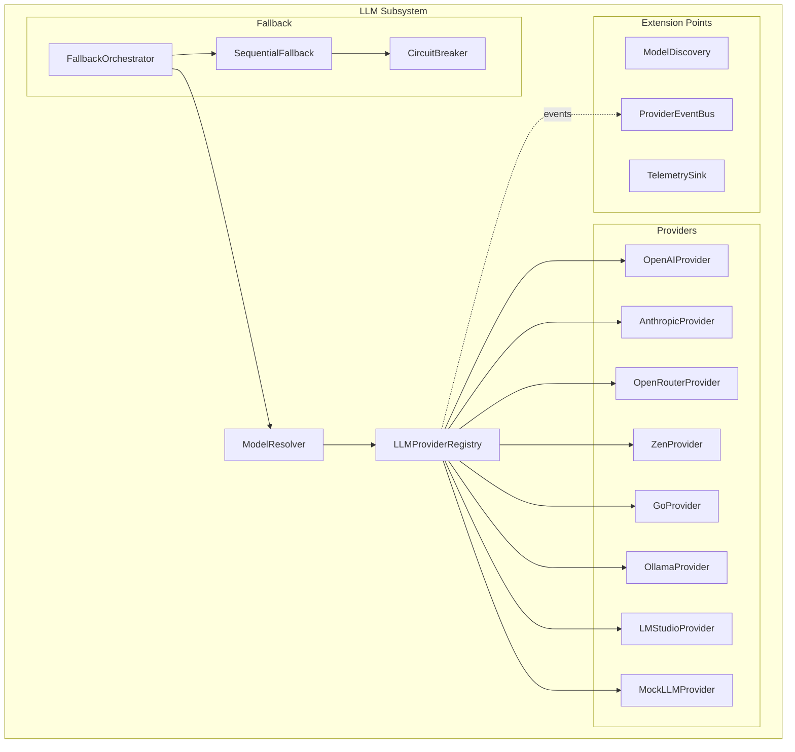

# Добавление нового LLM провайдера

Это руководство описывает пошаговый процесс добавления нового LLM провайдера в CodeLab.

## Архитектура LLM подсистемы

CodeLab использует мульти-провайдер архитектуру с Registry паттерном:



### Ключевые компоненты

| Компонент | Файл | Описание |
|-----------|------|----------|
| `LLMProvider` | `llm/base.py` | Абстрактный базовый класс для всех провайдеров |
| `LLMProviderRegistry` | `llm/registry.py` | Реестр провайдеров с factory-паттерном |
| `ModelResolver` | `llm/resolver.py` | Резолвит `"provider/model"` в конкретный провайдер |
| `OpenAICompatibleProvider` | `llm/providers/openai_compatible.py` | Базовый класс для OpenAI-совместимых провайдеров |
| `FallbackOrchestrator` | `llm/fallback/orchestrator.py` | Управление fallback цепочками |
| `ProviderEventBus` | `llm/events.py` | Шина событий жизненного цикла провайдеров |

## Шаг 1: Определить тип провайдера

### Вариант A: OpenAI-совместимый провайдер

Если ваш провайдер поддерживает OpenAI Chat Completions API, наследуйтесь от `OpenAICompatibleProvider`:

```python
# codelab/server/llm/providers/my_provider.py

from codelab.server.llm.providers.openai_compatible import OpenAICompatibleProvider


class MyProvider(OpenAICompatibleProvider):
    """Мой кастомный LLM провайдер."""

    def __init__(self) -> None:
        super().__init__(
            base_url="https://api.my-provider.com/v1",
            default_model="my-model",
        )
```

Это всё, что нужно. `OpenAICompatibleProvider` содержит всю логику:
- Конвертация `CompletionRequest` → OpenAI SDK формат
- Конвертация OpenAI response → `CompletionResponse`
- Поддержка streaming
- Поддержка tool calls

### Вариант B: Уникальный API

Если провайдер использует собственный API (как Anthropic с Messages API), реализуйте `LLMProvider` ABC:

```python
# codelab/server/llm/providers/my_provider.py

from __future__ import annotations

from collections.abc import AsyncGenerator

from codelab.server.llm.base import LLMCapabilities, LLMConfig, LLMProvider
from codelab.server.llm.models import CompletionRequest, CompletionResponse


class MyProvider(LLMProvider):
    """Мой кастомный LLM провайдер с уникальным API."""

    @property
    def name(self) -> str:
        return "my-provider"

    @property
    def capabilities(self) -> LLMCapabilities:
        return LLMCapabilities(
            supports_tools=True,
            supports_streaming=True,
            supports_function_calling=True,
            supports_vision=False,
            supports_system_prompt=True,
        )

    async def initialize(self, config: LLMConfig) -> None:
        """Инициализация провайдера с конфигурацией."""
        self._config = config
        # Создать клиент, проверить API key, и т.д.

    async def create_completion(
        self,
        request: CompletionRequest,
    ) -> CompletionResponse:
        """Выполнить completion запрос."""
        # Конвертировать request в формат провайдера
        # Вызвать API
        # Конвертировать response в CompletionResponse
        ...

    async def stream_completion(
        self,
        request: CompletionRequest,
    ) -> AsyncGenerator[CompletionResponse, None]:
        """Выполнить streaming completion запрос."""
        # Аналогично create_completion, но с yield chunks
        ...
```

## Шаг 2: Определить ProviderInfo и ModelInfo

Создайте метаданные провайдера для Registry:

```python
from codelab.server.llm.models import ModelInfo, ProviderInfo

MY_PROVIDER_INFO = ProviderInfo(
    id="my-provider",
    name="My Provider",
    description="Мой кастомный LLM провайдер",
    base_url="https://api.my-provider.com/v1",
    models=[
        ModelInfo(
            id="my-model",
            provider_id="my-provider",
            name="My Model",
            description="Основная модель",
            context_window=128000,
            max_output_tokens=16384,
            supports_tools=True,
            supports_streaming=True,
            cost_per_input_token=0.000001,
            cost_per_output_token=0.000002,
        ),
        ModelInfo(
            id="my-model-fast",
            provider_id="my-provider",
            name="My Model Fast",
            context_window=32000,
            max_output_tokens=4096,
        ),
    ],
)
```

## Шаг 3: Зарегистрировать провайдер в Registry

Добавьте регистрацию в DI контейнер (`di.py`):

```python
# codelab/server/di.py

from codelab.server.llm.providers.my_provider import MyProvider, MY_PROVIDER_INFO


class LLMProvider_(Provider):
    """Провайдер LLM провайдеров (APP scope)."""

    @provide(scope=Scope.APP)
    async def get_llm_provider(
        self,
        config: Annotated[AppConfig, from_context(provides=AppConfig)],
    ) -> LLMProviderRegistry:
        """Создаёт Registry со всеми провайдерами."""
        registry = LLMProviderRegistry()

        # ... существующие провайдеры ...

        # Зарегистрировать новый провайдер
        registry.register(
            "my-provider",
            lambda: MyProvider(),
            info=MY_PROVIDER_INFO,
        )

        return registry
```

## Шаг 4: Добавить CLI аргументы

Обновите `cli.py` если провайдер требует специфичных аргументов:

```python
# codelab/server/cli.py

parser.add_argument(
    "--my-provider-api-key",
    default=None,
    help="API ключ для My Provider",
)
```

## Шаг 5: Написать тесты

Создайте тесты для провайдера:

```python
# tests/server/llm/providers/test_my_provider.py

import pytest

from codelab.server.llm.base import LLMConfig
from codelab.server.llm.models import CompletionRequest, LLMMessage
from codelab.server.llm.providers.my_provider import MyProvider


class TestMyProvider:
    """Тесты для MyProvider."""

    @pytest.mark.asyncio
    async def test_initialization(self) -> None:
        """Проверить инициализацию провайдера."""
        provider = MyProvider()
        config = LLMConfig(
            api_key="test-key",
            model="my-model",
        )
        await provider.initialize(config)
        assert provider.name == "my-provider"

    @pytest.mark.asyncio
    async def test_capabilities(self) -> None:
        """Проверить capabilities провайдера."""
        provider = MyProvider()
        caps = provider.capabilities
        assert caps.supports_tools is True
        assert caps.supports_streaming is True

    @pytest.mark.asyncio
    async def test_create_completion(self) -> None:
        """Проверить completion запрос."""
        # Используйте mock или тестовый endpoint
        ...

    @pytest.mark.asyncio
    async def test_stream_completion(self) -> None:
        """Проверить streaming completion."""
        ...
```

## Шаг 6: Обновить документацию

Добавьте информацию о провайдере в:

1. `doc/product/user-guide/11-llm-providers.md` — описание и настройка
2. `doc/product/reference/05-llm-reference.md` — справочная информация
3. `doc/product/reference/03-environment.md` — переменные окружения
4. `codelab/codelab.toml.example` — пример конфигурации

## Шаг 7: Обновить экспорты

Добавьте провайдер в `__init__.py`:

```python
# codelab/server/llm/__init__.py

from codelab.server.llm.providers.my_provider import MyProvider

__all__ = [
    # ...
    "MyProvider",
]
```

## Пример: Полный код нового провайдера

Вот полный пример минимального провайдера:

```python
"""My Provider — кастомный LLM провайдер."""

from __future__ import annotations

from collections.abc import AsyncGenerator

from codelab.server.llm.base import LLMCapabilities, LLMConfig, LLMProvider
from codelab.server.llm.models import (
    CompletionRequest,
    CompletionResponse,
    ModelInfo,
    ProviderInfo,
    StopReason,
)


class MyProvider(LLMProvider):
    """Мой кастомный LLM провайдер."""

    def __init__(self) -> None:
        self._config: LLMConfig | None = None

    @property
    def name(self) -> str:
        return "my-provider"

    @property
    def capabilities(self) -> LLMCapabilities:
        return LLMCapabilities(
            supports_tools=True,
            supports_streaming=True,
            supports_function_calling=True,
            supports_vision=False,
            supports_system_prompt=True,
        )

    async def initialize(self, config: LLMConfig) -> None:
        self._config = config

    async def create_completion(
        self,
        request: CompletionRequest,
    ) -> CompletionResponse:
        # Заглушка — замените на реальный API вызов
        return CompletionResponse(
            text="Hello from My Provider!",
            stop_reason=StopReason.END_TURN,
            model=request.model,
        )

    async def stream_completion(
        self,
        request: CompletionRequest,
    ) -> AsyncGenerator[CompletionResponse, None]:
        yield CompletionResponse(
            text="Hello",
            stop_reason=StopReason.STREAMING,
            model=request.model,
        )
        yield CompletionResponse(
            text=" from My Provider!",
            stop_reason=StopReason.END_TURN,
            model=request.model,
        )


MY_PROVIDER_INFO = ProviderInfo(
    id="my-provider",
    name="My Provider",
    models=[
        ModelInfo(
            id="my-model",
            provider_id="my-provider",
            name="My Model",
            context_window=128000,
            max_output_tokens=16384,
        ),
    ],
)
```

## Checklist добавления провайдера

- [ ] Создан файл провайдера в `llm/providers/`
- [ ] Реализованы все абстрактные методы `LLMProvider`
- [ ] Определены `ProviderInfo` и `ModelInfo`
- [ ] Провайдер зарегистрирован в `LLMProviderRegistry` (DI)
- [ ] Добавлены CLI аргументы (если нужны)
- [ ] Написаны unit тесты
- [ ] Обновлена документация
- [ ] Обновлён `codelab.toml.example`
- [ ] Обновлены экспорты в `__init__.py`
- [ ] Запущен `make check` — lint, typecheck, все тесты
