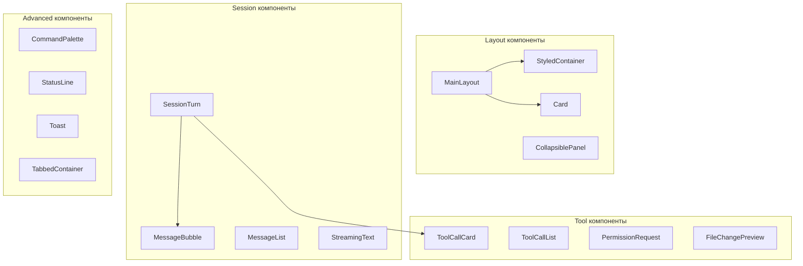

# UI Компоненты CodeLab TUI

## Обзор

CodeLab TUI построен на базе [Textual](https://textual.textualize.io/) и включает набор переиспользуемых компонентов для создания современного терминального интерфейса.

## Архитектура компонентов



## Фаза 1: Core Layout

### MainLayout

Главный контейнер с трёхколоночной структурой:
- Sidebar (левая колонка, сворачиваемая)
- MainContent (центральная колонка)
- RightPanel (правая колонка, опциональная)

```python
from codelab.client.tui.components import MainLayout

layout = MainLayout(
    ui_vm=ui_view_model,
    sidebar_width=30,
    right_panel_width=30,
)
```

### StyledContainer / Card

Универсальные контейнеры с настраиваемым стилем:

```python
from codelab.client.tui.components import Card, ContainerVariant

# Карточка с границей
card = Card(title="Информация", variant=ContainerVariant.BORDERED)
```

### CollapsiblePanel / AccordionPanel

Сворачиваемые панели:

```python
from codelab.client.tui.components import CollapsiblePanel

panel = CollapsiblePanel(title="Детали", collapsed=False)
```

## Фаза 2: Session Components

### MessageBubble

Отображение отдельного сообщения:

```python
from codelab.client.tui.components import MessageBubble, MessageRole

bubble = MessageBubble(
    content="Привет!",
    role=MessageRole.USER,
    timestamp=datetime.now(),
)
```

### MessageList

Список сообщений с разделителями по датам:

```python
from codelab.client.tui.components import MessageList

message_list = MessageList(chat_vm=chat_view_model)
```

### StreamingText / ThinkingIndicator

Компоненты для real-time обновлений:

```python
from codelab.client.tui.components import StreamingText, ThinkingIndicator

# Текст с эффектом печатания
streaming = StreamingText(text="Загрузка...", speed=0.05)

# Индикатор размышления агента
thinking = ThinkingIndicator()
```

### MarkdownViewer

Рендеринг Markdown контента:

```python
from codelab.client.tui.components import MarkdownViewer

viewer = MarkdownViewer(content="# Заголовок\n\nТекст с **выделением**")
```

## Фаза 3: Tool Components

### ToolCallCard

Карточка вызова инструмента:

```python
from codelab.client.tui.components import ToolCallCard, ToolCallStatus

card = ToolCallCard(
    tool_name="read_file",
    tool_args={"path": "/etc/hosts"},
    status=ToolCallStatus.RUNNING,
)
```

### ToolCallList

Список вызовов инструментов:

```python
from codelab.client.tui.components import ToolCallList

tool_list = ToolCallList(tool_calls=calls)
```

### PermissionRequest

Запрос разрешения:

```python
from codelab.client.tui.components import PermissionRequest, PermissionType

request = PermissionRequest(
    permission_type=PermissionType.FILE_WRITE,
    resource="/path/to/file",
)
```

### FileChangePreview

Предпросмотр изменений файла (diff):

```python
from codelab.client.tui.components import FileChangePreview

preview = FileChangePreview(
    file_path="/path/to/file.py",
    old_content="old code",
    new_content="new code",
)
```

### ActionButton / ActionBar

Кнопки действий:

```python
from codelab.client.tui.components import ActionButton, ActionBar, ButtonVariant

button = ActionButton(
    label="Применить",
    variant=ButtonVariant.PRIMARY,
)

bar = ActionBar(buttons=[button1, button2])
```

## Фаза 4: Advanced Features

### Toast / ToastContainer

Всплывающие уведомления:

```python
from codelab.client.tui.components import ToastContainer, ToastData, ToastType

# Показать уведомление
toast_data = ToastData(
    message="Операция выполнена!",
    toast_type=ToastType.SUCCESS,
    duration=3.0,
)
container.show_toast(toast_data)
```

### TabbedContainer / TabBar

Компоненты табов:

```python
from codelab.client.tui.components import TabbedContainer, TabData

tabs = TabbedContainer(tabs=[
    TabData(id="chat", label="Чат", content=chat_view),
    TabData(id="files", label="Файлы", content=file_tree),
])
```

### SearchInput

Поле поиска с debounce:

```python
from codelab.client.tui.components import SearchInput

search = SearchInput(
    placeholder="Поиск...",
    debounce_ms=300,
)
```

### ProgressBar / Spinner

Индикаторы прогресса:

```python
from codelab.client.tui.components import ProgressBar, Spinner, SpinnerVariant

progress = ProgressBar(value=0.5, label="Загрузка")
spinner = Spinner(variant=SpinnerVariant.DOTS)
```

### ContextMenu

Контекстное меню:

```python
from codelab.client.tui.components import ContextMenu, MenuItem, MenuSeparator

menu = ContextMenu(items=[
    MenuItem(id="copy", label="Копировать", hotkey="Ctrl+C"),
    MenuSeparator(),
    MenuItem(id="delete", label="Удалить", hotkey="Del"),
])
```

### TerminalPanel

Панель терминала:

```python
from codelab.client.tui.components import TerminalPanel

terminal = TerminalPanel(terminal_vm=terminal_view_model)
```

## Фаза 5: Polish

### CommandPalette

Палитра команд (открывается по `Ctrl+P`):

```python
from codelab.client.tui.components import CommandPalette, Command

# Добавить кастомную команду
palette = CommandPalette()
palette.add_command(Command(
    id="custom_action",
    name="Моя команда",
    description="Описание команды",
    action="custom_action",
    hotkey="Ctrl+M",
))
```

Особенности:
- Fuzzy search по названию и описанию
- Группировка по категориям
- Отображение горячих клавиш
- История последних команд

### StatusLine

Строка статуса:

```python
from codelab.client.tui.components import StatusLine, StatusMode, StatusIndicator

status = StatusLine(ui_vm=ui_view_model)
status.set_mode(StatusMode.CHAT)
status.add_indicator(StatusIndicator(
    name="connection",
    icon="●",
    label="Online",
    active=True,
))
```

Режимы:
- `NORMAL` - обычный режим
- `CHAT` - ввод сообщения
- `COMMAND` - ввод команды
- `SEARCH` - режим поиска

### KeyboardManager

Управление горячими клавишами:

```python
from codelab.client.tui.components import (
    KeyboardManager,
    HotkeyBinding,
    HotkeyCategory,
)

manager = KeyboardManager(app=app)

# Регистрация кастомной горячей клавиши
manager.register(HotkeyBinding(
    key="ctrl+m",
    action="my_action",
    description="Моё действие",
    category=HotkeyCategory.SYSTEM,
))

# Получить все клавиши для справки
groups = manager.get_help_groups()
```

## Темы

CodeLab TUI поддерживает переключение тем:

```python
from codelab.client.tui.themes import ThemeManager, ThemeType

theme_manager = ThemeManager(app=app)

# Переключение темы
theme_manager.set_theme(ThemeType.DARK)
theme_manager.set_theme(ThemeType.LIGHT)

# Или toggle
theme_manager.toggle_theme()
```

### Доступные темы

- **Dark** - тёмная тема (по умолчанию)
- **Light** - светлая тема

## Горячие клавиши

| Клавиша | Действие |
|---------|----------|
| `Ctrl+Q` | Выход |
| `Ctrl+P` | Палитра команд |
| `Ctrl+T` | Переключить тему |
| `Ctrl+B` | Показать/скрыть sidebar |
| `Ctrl+N` | Новая сессия |
| `Ctrl+J` | Следующая сессия |
| `Ctrl+K` | Предыдущая сессия |
| `Ctrl+L` | Очистить чат |
| `Ctrl+H` | Справка |
| `?` | Горячие клавиши |
| `Ctrl+\`` | Терминал |
| `Tab` | Переключить фокус |
| `Escape` | Закрыть модальное окно |

## Стилизация

Компоненты используют CSS-переменные для стилизации:

```css
/* Основные цвета */
--background: #1a1b26;
--foreground: #c0caf5;
--primary: #7aa2f7;
--success: #9ece6a;
--warning: #e0af68;
--error: #f7768e;

/* Границы */
--border: #3b4261;
--border-focus: #7aa2f7;
```

Файлы тем:
- `themes/dark.tcss` - тёмная тема
- `themes/light.tcss` - светлая тема
