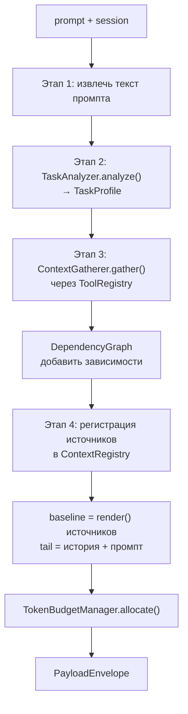

# Context Manager — реализация и расширение

Это руководство для разработчиков, которые хотят **понять внутреннее устройство**
Context Manager и **дорабатывать его**: добавлять языки скелетирования, новые
источники контекста, альтернативные реализации анализатора/сборщика или фазы сжатия.

Прежде чем менять код, ознакомьтесь с каноном для разработчиков:

- [INDEX](../../../internals/context-manager/INDEX.md) — карта документации
- [INTERFACES](../../../internals/context-manager/INTERFACES.md) — замороженные ABC
- [CONSOLIDATED_ARCHITECTURE](../../../internals/context-manager/CONSOLIDATED_ARCHITECTURE.md) — полная архитектура
- [ADR-002](../../../internals/architecture/adr/ADR-002-context-manager-consolidation.md) — архитектурные решения

> Общий обзор для пользователя (конфигурация, `/context`): [Context Manager — руководство пользователя](../../user-guide/server/context-manager.md).

---

## Где живёт код

```
src/codelab/server/agent/context/
├── interfaces.py         # ABC-контракты (заморожены на Phase 0)
├── models.py             # dataclass-модели (PayloadEnvelope, ContextConfig, …)
├── manager.py            # DefaultContextManager — единая точка входа
├── config_loader.py      # TOML/env → ContextConfig
├── task_analyzer.py      # LLMBasedTaskAnalyzer (Слой A)
├── gatherer.py           # ACPContextGatherer (Слой A)
├── dependency_graph.py   # граф импортов (Слой A)
├── budget.py             # DefaultTokenBudgetManager (Слой A)
├── registry.py           # ContextRegistryImpl + FileContextSource/SkillCatalogSource
├── epoch.py              # EpochManager (Слой B)
├── reconciler.py         # DefaultContextReconciler (Слой B)
├── summarizer.py         # LLMConversationSummarizer (Слой B)
├── token_counter.py      # Tiktoken/Approximate + create_token_counter() (Слой C)
├── file_cache.py         # InMemoryFileCache + SessionFileCacheRegistry + InvalidationSignalBus (Слой C)
├── file_cache_decorator.py  # FileCacheDecorator — перехват fs/read|write (Слой C)
├── compactor.py          # ThreePhaseCompactor (Слой C)
├── skeletonizer/         # CompositeSkeletonizer + стратегии (Слой C)
├── child_session.py      # DefaultChildSessionManager (Слой D)
└── legacy_bridge.py      # обёртка legacy-компактора в ABC
```

Публичные символы экспортируются из `context/__init__.py` (`__all__`).

---

## Слои A–D: интерфейс → реализация

Context Manager разбит на четыре слоя. Каждый слой — набор ABC из `interfaces.py`
и их конкретных реализаций.

| Слой | Интерфейс (ABC) | Реализация | Назначение |
|------|-----------------|------------|------------|
| — | `ContextManager` | `DefaultContextManager` | Единая точка входа |
| A — Сбор | `TaskAnalyzer` | `LLMBasedTaskAnalyzer` | Классификация задачи |
| A | `ContextGatherer` | `ACPContextGatherer` | Подбор файлов через `ToolRegistry` |
| A | `DependencyGraph` | (в `dependency_graph.py`) | Граф импортов |
| A | `TokenBudgetManager` | `DefaultTokenBudgetManager` | Распределение бюджета |
| A | `ContextRegistry` | `ContextRegistryImpl` | Реестр источников |
| A | `ContextSource` | `FileContextSource`, `SkillCatalogSource` | Источник контекста |
| B — Жизненный цикл | `ConversationSummarizer` | `LLMConversationSummarizer` | Суммаризация истории |
| B | `ContextReconciler` | `DefaultContextReconciler` | Диф эпох на границе хода |
| C — Хранение | `TokenCounter` | `TiktokenCounter` / `ApproximateTokenCounter` | Подсчёт токенов |
| C | `CodeSkeletonizer` | `CompositeSkeletonizer` | Сжатие кода до сигнатур |
| C | `FileContentCache` | `InMemoryFileCache` | LRU-кэш файлов |
| C | `ContextCompactor` | `ThreePhaseCompactor` | 3-фазное сжатие |
| D — Мультиагент | `ChildSessionManager` | `DefaultChildSessionManager` | Изолированные дочерние сессии |

---

## Ключевые контракты

`ContextManager` (единая точка входа) определяет три метода — все стратегии агента
работают только через них:

```python
async def build_context(session, prompt, *, agent_scope="single",
                        system_prompt=None, options=None) -> PayloadEnvelope
async def ensure_context_fits(envelope, *, max_context_tokens,
                              reserved_tokens) -> PayloadEnvelope
async def process_subagent_response(parent_scope, subagent_scope,
                                    response) -> SubagentResult
```

**`PayloadEnvelope`** — единственная форма payload на пути формирования. Он явно
разделён на `baseline` (стабильная часть: system + файлы) и `tail` (изменяющаяся:
последние сообщения). Конвертация в плоский `list[LLMMessage]` происходит **только**
через `to_messages()` на границе с `LLMAdapter` — не собирайте список сообщений вручную
в обход этого метода.

---

## Поток `build_context()`



Реализация — `DefaultContextManager.build_context()` (`manager.py`). Внутренние
компоненты создаются лениво: `LLMBasedTaskAnalyzer`, `ACPContextGatherer`,
`ThreePhaseCompactor` (см. `_get_or_create_compactor()`).

### `ensure_context_fits()` — 3-фазное сжатие

Когда `PayloadEnvelope` превышает окно, `ThreePhaseCompactor` применяет фазы по порядку:

1. **Prune** — FIFO-удаление старых сообщений по приоритету
   (`tool` 4 → `assistant` 6 → `user` 8 → `system` 10);
2. **Skeletonize** — `CompositeSkeletonizer` сжимает read-only файлы до сигнатур
   (если skeleton не короче оригинала — берётся оригинал);
3. **Summarize** — `LLMConversationSummarizer` суммирует историю.

**Мягкая деградация:** если LLM недоступен, фаза 3 пропускается, сжатие ограничивается
Prune + Skeletonize; горячий путь не падает. После сжатия делается пост-проверка
токенов; при недооценке бюджета выполняется повторное сжатие со строгим лимитом
(лог `budget_underestimated_retry`).

---

## Интеграция через DI (Dishka)

Все компоненты собираются в `src/codelab/server/di/agent.py` (scope `APP`):

```python
@provide(scope=Scope.APP)
def get_context_manager(self, tool_registry, config, metrics_tracker,
                        tracer, llm_provider, signal_bus) -> DefaultContextManager:
    return DefaultContextManager(
        tool_registry=tool_registry,
        config=config.agents.context,
        llm=llm_provider,
        model=config.agents.context.analyzer_model,
        metrics_tracker=metrics_tracker,
        tracer=tracer,
        signal_bus=signal_bus,
    )
```

`ExecutionEngine` получает и `context_manager`, и legacy `compactor`; выбор режима
идёт по флагу `config.agents.context.enabled` (и runtime-override `/context on|off`).
Кэш файлов подключается через `SessionFileCacheRegistry` + `FileCacheDecorator`,
который оборачивает `FileSystemToolExecutor` и слушает `InvalidationSignalBus`.

Конструктор `DefaultContextManager` принимает необязательные зависимости
(`token_counter`, `skeletonizer`, `summarizer`, `signal_bus`) — это основной шов для
подмены реализаций в тестах и при расширении.

---

## Точки расширения

### 1. Новый язык скелетирования

Skeletonizer построен на Strategy-паттерне: `CompositeSkeletonizer` перебирает
стратегии (`NoOpStrategy`, `RegexStrategy`, `TreeSitterStrategy`) и выбирает первую,
чей `can_handle(path)` истинен.

**Вариант A — язык с tree-sitter грамматикой.** Добавьте запись в
`skeletonizer/registry.py`:

- в `LANGUAGE_SPECS` — кортеж `(язык, модуль_грамматики, атрибут_language)`;
- в `EXTENSION_TO_LANGUAGE` — сопоставление расширения → язык;
- при необходимости — tree-sitter query для извлечения сигнатур.

Не забудьте добавить пакет грамматики (`tree-sitter-<lang>`) в зависимости
`pyproject.toml`. Отсутствие грамматики **не** ошибка — стратегия молча пропустит язык.

**Вариант B — своя стратегия.** Реализуйте `SkeletonizerStrategy`
(`skeletonizer/strategy.py`):

```python
class MyLangStrategy(SkeletonizerStrategy):
    def can_handle(self, path: str) -> bool:
        return path.endswith(".mylang")

    def skeletonize(self, code: str, path: str) -> str:
        # Детерминированно! Байт-идентичный вывод для стабильности prompt cache.
        ...
```

и зарегистрируйте её в `CompositeSkeletonizer`.

> **Требование детерминизма:** `skeletonize()` обязан давать байт-идентичный результат
> на одном входе — от этого зависит стабильность prompt cache. Golden-тесты:
> `tests/server/agent/context/test_skeletonizer.py::TestDeterminism`.

### 2. Новый источник контекста

Реализуйте `ContextSource` (`interfaces.py`) и зарегистрируйте в `ContextRegistry`:

```python
class MyContextSource(ContextSource):
    @property
    def source_id(self) -> str:
        return "my-source"

    async def render(self) -> str:
        ...

    async def fingerprint(self) -> str:
        # Codec-based хэш содержимого — НЕ timestamp.
        ...
```

Отпечаток (`fingerprint`) должен строиться из содержимого через Codec, а не по времени —
иначе ломается детект изменений и стабильность эпох. Примеры: `FileContextSource`,
`SkillCatalogSource` в `registry.py`.

### 3. Альтернативные реализации Слоя A/B/C

`TaskAnalyzer`, `ContextGatherer`, `TokenCounter`, `ConversationSummarizer` и др. —
это ABC; можно реализовать свою версию и передать её в `DefaultContextManager` через
конструктор (или подменить провайдер в DI). Например, локальный анализатор без LLM или
токенайзер под конкретную модель.

**Нельзя** создавать новую реализацию `ContextCompactor` — используйте
`ThreePhaseCompactor` (ограничение ADR-002); расширяйте его фазами, а не заменой.

---

## Правила и ограничения

Соблюдайте (см. `CLAUDE.md` → раздел Context Manager):

- **ABC из `interfaces.py` заморожены** (Phase 0) — не меняйте сигнатуры; фазы
  добавляют только реализации.
- **Всё файловое I/O — через ACP `ToolRegistry`.** Прямой доступ к файловой системе из
  компонентов Context Manager запрещён.
- **`PayloadEnvelope`** — единственная форма payload; `to_messages()` — единственная
  точка конвертации на границе `LLMAdapter`.
- **Детерминизм:** `CodeSkeletonizer` и `FileContentCache` дают байт-идентичный вывод.
- **Fingerprint** — только Codec-хэши, никаких timestamp.
- **Graceful degradation:** горячий путь не должен падать; каждый сбой — с fallback.
- **Приоритеты eviction:** `system` 10 > `user` 8 > `assistant` 6 > `tool` 4.
- **Обход менеджера запрещён:** стратегии обращаются к компонентам только через
  `ContextManager`, а не напрямую.

---

## Тестирование

Тесты — в `tests/server/agent/context/`:

- unit на каждый компонент (`test_budget.py`, `test_dependency_graph.py`,
  `test_skeletonizer.py`, `test_token_counter.py`, …);
- интеграционные: `test_manager.py`, `test_integration.py`, `test_phase4_integration.py`;
- golden-тесты детерминизма: `test_skeletonizer.py::TestDeterminism`;
- фазовые: `test_phase5_recursive.py`, `test_phase6_multiagent.py`.

Любое изменение поведения сопровождается тестами. Перед завершением — обязательный
гейт из корня репозитория:

```bash
make check   # ruff + ty + pytest
```

---

## Наблюдаемость для разработчика

- **Метрики** (`MetricsTracker`): `context_build_count`, `context_build_total_ms`,
  `context_gathered_files`, `context_baseline_tokens`, `context_tail_tokens`,
  `context_subagent_responses_total` и др.
- **Span'ы** (`Tracer`): `context.build`, `context.gather` с атрибутами
  (`agent_scope`, `task_type`, `gathered_files`, `candidate_files`, `selected_files`, …).
- **Логи** (`structlog`): события `context.build.*`, `context.gather.*`,
  `context.ensure_fits.*`, `context.subagent.*` — всегда через `structlog` с kwargs.
- **Интерактивно:** slash-команда `/context` (`config/last/files/graph/profile/spans`)
  показывает конфигурацию, детали последней сборки и span'ы прямо в клиенте.

---

## Связанные документы

- [Архитектура CodeLab](../architecture.md) — место Context Manager в общей картине
- [Разработка сервера](../core/server-development.md)
- [Тестирование](../workflow/testing.md)
- [Context Manager — канон для разработчиков](../../../internals/context-manager/INDEX.md)
