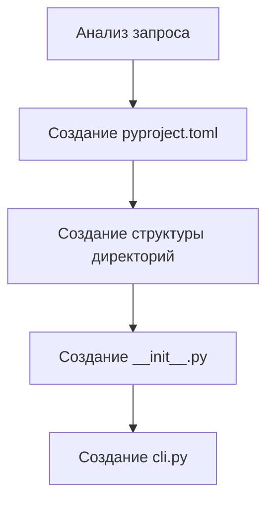
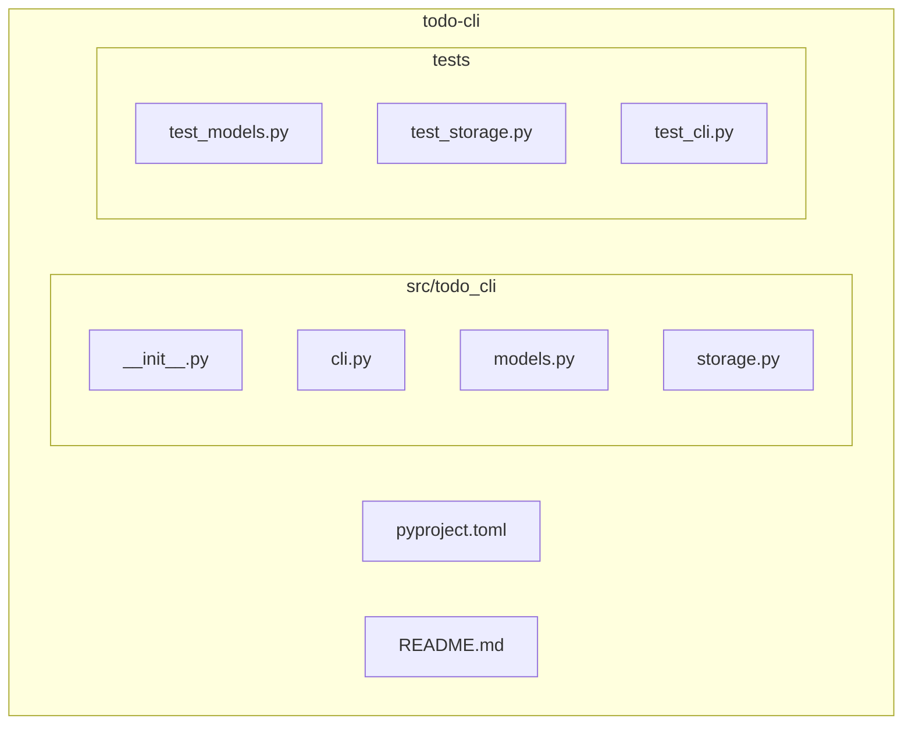

# Первый проект

> Практический пример: создание CLI-утилиты с помощью CodeLab.

## Цель

В этом руководстве мы создадим простую CLI-утилиту для работы с TODO-списком, используя CodeLab как AI-помощника.

## Подготовка

### Запуск CodeLab

```bash
# Терминал 1: Сервер
cd acp-protocol/codelab
OPENAI_API_KEY=sk-... CODELAB_LLM_PROVIDER=openai uv run codelab serve

# Терминал 2: Клиент
cd acp-protocol/codelab
uv run codelab connect
```

### Создание рабочей директории

```bash
# Терминал 3: Рабочая директория проекта
mkdir ~/projects/todo-cli
cd ~/projects/todo-cli
```

> **Важно:** CodeLab работает в директории, из которой запущен сервер. Для работы с другой директорией перезапустите сервер из неё.

## Этап 1: Структура проекта

### Запрос к агенту

```
> Создай структуру Python-проекта для CLI-утилиты todo-cli:
  - Использовать uv для управления зависимостями
  - CLI на основе click
  - Хранение данных в JSON файле
```

### Агент выполняет



### Результат

```
todo-cli/
├── pyproject.toml
├── src/
│   └── todo_cli/
│       ├── __init__.py
│       └── cli.py
└── tests/
    └── __init__.py
```

## Этап 2: Модель данных

### Запрос

```
> Создай модуль models.py с Pydantic моделями:
  - Todo (id, title, completed, created_at)
  - TodoList (items: list[Todo])
  - Методы для добавления, удаления, переключения статуса
```

### Результат

```python
# src/todo_cli/models.py

from datetime import datetime
from pydantic import BaseModel, Field
import uuid


class Todo(BaseModel):
    """Модель задачи."""
    id: str = Field(default_factory=lambda: str(uuid.uuid4())[:8])
    title: str
    completed: bool = False
    created_at: datetime = Field(default_factory=datetime.now)


class TodoList(BaseModel):
    """Список задач с методами управления."""
    items: list[Todo] = []
    
    def add(self, title: str) -> Todo:
        """Добавить новую задачу."""
        todo = Todo(title=title)
        self.items.append(todo)
        return todo
    
    def remove(self, todo_id: str) -> bool:
        """Удалить задачу по ID."""
        for i, item in enumerate(self.items):
            if item.id == todo_id:
                self.items.pop(i)
                return True
        return False
    
    def toggle(self, todo_id: str) -> bool:
        """Переключить статус задачи."""
        for item in self.items:
            if item.id == todo_id:
                item.completed = not item.completed
                return True
        return False
```

## Этап 3: Хранилище

### Запрос

```
> Создай модуль storage.py для сохранения и загрузки TodoList из JSON файла.
  Файл по умолчанию: ~/.todo-cli/todos.json
```

### Результат

```python
# src/todo_cli/storage.py

from pathlib import Path
from .models import TodoList


DEFAULT_PATH = Path.home() / ".todo-cli" / "todos.json"


def load(path: Path = DEFAULT_PATH) -> TodoList:
    """Загрузить список задач из файла."""
    if not path.exists():
        return TodoList()
    return TodoList.model_validate_json(path.read_text())


def save(todos: TodoList, path: Path = DEFAULT_PATH) -> None:
    """Сохранить список задач в файл."""
    path.parent.mkdir(parents=True, exist_ok=True)
    path.write_text(todos.model_dump_json(indent=2))
```

## Этап 4: CLI команды

### Запрос

```
> Обнови cli.py, добавь команды:
  - add <title> — добавить задачу
  - list — показать все задачи
  - done <id> — отметить выполненной
  - remove <id> — удалить задачу
  Используй rich для красивого вывода
```

### Результат

```python
# src/todo_cli/cli.py

import click
from rich.console import Console
from rich.table import Table

from . import storage
from .models import TodoList


console = Console()


@click.group()
def cli():
    """TODO CLI - управление задачами из терминала."""
    pass


@cli.command()
@click.argument("title")
def add(title: str):
    """Добавить новую задачу."""
    todos = storage.load()
    todo = todos.add(title)
    storage.save(todos)
    console.print(f"✅ Добавлено: [bold]{todo.title}[/] (ID: {todo.id})")


@cli.command("list")
def list_todos():
    """Показать все задачи."""
    todos = storage.load()
    
    if not todos.items:
        console.print("[dim]Задач нет. Добавьте первую: todo add 'Моя задача'[/]")
        return
    
    table = Table(title="📋 Мои задачи")
    table.add_column("ID", style="dim")
    table.add_column("Статус")
    table.add_column("Задача")
    table.add_column("Создано", style="dim")
    
    for todo in todos.items:
        status = "✅" if todo.completed else "⬜"
        style = "strike dim" if todo.completed else ""
        table.add_row(
            todo.id,
            status,
            f"[{style}]{todo.title}[/]",
            todo.created_at.strftime("%d.%m %H:%M")
        )
    
    console.print(table)


@cli.command()
@click.argument("todo_id")
def done(todo_id: str):
    """Отметить задачу выполненной."""
    todos = storage.load()
    if todos.toggle(todo_id):
        storage.save(todos)
        console.print(f"✅ Статус задачи {todo_id} изменён")
    else:
        console.print(f"[red]❌ Задача {todo_id} не найдена[/]")


@cli.command()
@click.argument("todo_id")
def remove(todo_id: str):
    """Удалить задачу."""
    todos = storage.load()
    if todos.remove(todo_id):
        storage.save(todos)
        console.print(f"🗑️ Задача {todo_id} удалена")
    else:
        console.print(f"[red]❌ Задача {todo_id} не найдена[/]")


if __name__ == "__main__":
    cli()
```

## Этап 5: Тестирование

### Запрос

```
> Напиши тесты для models.py с pytest
```

### Результат

```python
# tests/test_models.py

import pytest
from todo_cli.models import Todo, TodoList


class TestTodo:
    def test_create_todo(self):
        todo = Todo(title="Test task")
        assert todo.title == "Test task"
        assert todo.completed is False
        assert todo.id is not None

    def test_todo_with_completed(self):
        todo = Todo(title="Done task", completed=True)
        assert todo.completed is True


class TestTodoList:
    def test_add_todo(self):
        todos = TodoList()
        todo = todos.add("New task")
        assert len(todos.items) == 1
        assert todos.items[0].title == "New task"

    def test_remove_todo(self):
        todos = TodoList()
        todo = todos.add("To remove")
        assert todos.remove(todo.id) is True
        assert len(todos.items) == 0

    def test_remove_nonexistent(self):
        todos = TodoList()
        assert todos.remove("fake-id") is False

    def test_toggle_todo(self):
        todos = TodoList()
        todo = todos.add("To toggle")
        assert todo.completed is False
        todos.toggle(todo.id)
        assert todo.completed is True
        todos.toggle(todo.id)
        assert todo.completed is False
```

### Запуск тестов

```
> Запусти тесты
```

Агент выполнит:
```bash
uv run pytest -v
```

## Этап 6: Финализация

### Запрос

```
> Добавь README.md с описанием проекта и инструкцией по установке
```

### Использование готовой утилиты

```bash
# Установка
uv pip install -e .

# Использование
todo add "Изучить CodeLab"
todo add "Написать документацию"
todo list
todo done abc123
todo remove def456
```

## Итоговая структура



## Что мы узнали

1. **Итеративная разработка** — разбивка задачи на этапы
2. **Работа с файлами** — агент создаёт и редактирует код
3. **Выполнение команд** — запуск тестов через агента
4. **Система разрешений** — контроль над действиями агента

## Дальнейшие шаги

Попробуйте расширить проект:

```
> Добавь приоритеты к задачам (low, medium, high)
> Добавь команду для фильтрации по статусу
> Добавь экспорт в Markdown
```

## См. также

- [Сценарии использования](../overview/03-use-cases.md)
- [Архитектура](../overview/02-architecture.md)
- [Спецификация ACP](../../protocols/Agent%20Client%20Protocol/protocol/01-Overview.md)
