# Архитектура CodeLab

> Обзор архитектуры системы и взаимодействия компонентов.

## Общая архитектура

CodeLab реализует клиент-серверную архитектуру, определённую [Agent Client Protocol (ACP)](../../protocols/Agent%20Client%20Protocol/get-started/02-Architecture.md).

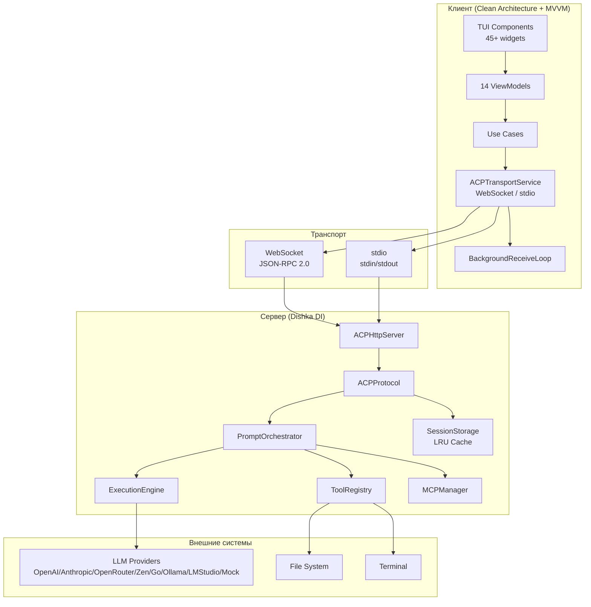

## Компоненты системы

### Клиент (Client)

Клиент реализует **Clean Architecture** с 5 слоями и **MVVM паттерн** для реактивного UI:

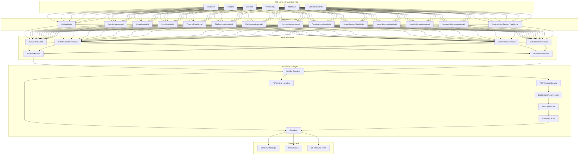

**Слои клиента:**
- **TUI Layer** — 45+ Textual компонентов (ChatView, Sidebar, FileTree, CommandPalette, ModelSelector, и др.)
- **Presentation** — 14 ViewModels с Observable состоянием (MVVM): 9 базовых + 5 selector ViewModels
- **Application** — 5 Use Cases, UIStateMachine, PermissionHandler
- **Infrastructure** — Dishka DI, ACPTransportService, BackgroundReceiveLoop, MessageRouter, EventBus
- **Domain** — Session, Message, Permission, ToolCall, Repository интерфейсы, 16 Domain Events

### Сервер (Server)

Сервер использует **Dishka DI контейнер** с двумя скоупами и **Pipeline систему** для обработки промптов:

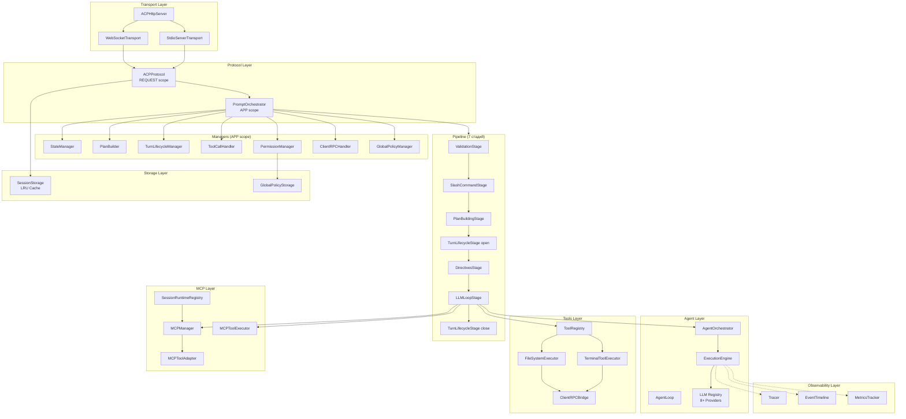

**Скоупы DI контейнера:**
- **APP scope** — синглтоны на всё время жизни сервера (LLM, ToolRegistry, менеджеры, pipeline)
- **REQUEST scope** — на одно WebSocket соединение (ClientRPCService, ACPProtocol)

**Менеджеры:**
| Менеджер | Ответственность |
|----------|-----------------|
| `StateManager` | Управление состоянием сессии |
| `PlanBuilder` | Построение планов выполнения |
| `TurnLifecycleManager` | Жизненный цикл prompt-turn |
| `ToolCallHandler` | Обработка tool calls |
| `PermissionManager` | Управление разрешениями |
| `ClientRPCHandler` | Обработка agent→client RPC |
| `GlobalPolicyManager` | Глобальные политики разрешений |

**Pipeline стадии:**
1. `ValidationStage` — валидация входных данных
2. `SlashCommandStage` — обработка `/help`, `/mode`, `/status`, `/strategy`
3. `PlanBuildingStage` — построение плана
4. `TurnLifecycleStage(open)` — открытие turn
5. `DirectivesStage` — обработка директив промпта
6. `LLMLoopStage` — основной цикл LLM с tool calls
7. `TurnLifecycleStage(close)` — закрытие turn

## Background Receive Loop (Клиент)

Для избежания race condition при конкурентном доступе к WebSocket, клиент использует единый фоновый цикл получения сообщений:

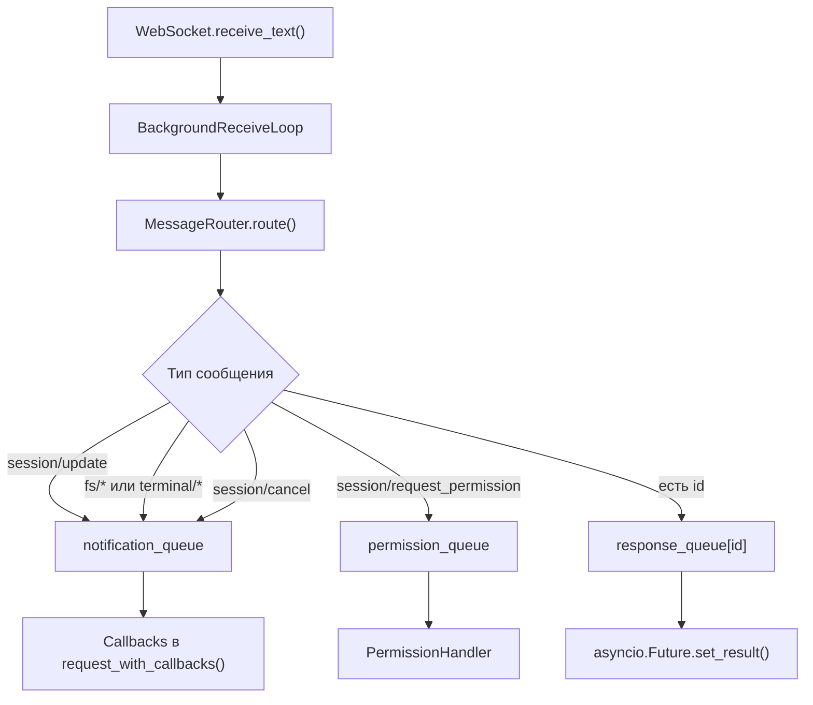

**Ключевые особенности:**
- **Единственный receive()** — избегает RuntimeError при конкурентном доступе
- **Три типа очередей:** response (per-request), notification (shared), permission (shared)
- **Graceful shutdown** — await stop() с 5-секундным таймаутом
- **Broadcast ошибок** — при разрыве соединения все ожидающие очереди получают уведомление

## Двухуровневая история

На сервере существует **двухуровневая система истории**:

| Аспект | SessionState.history | events_history |
|--------|----------------------|-----------------|
| **Содержание** | Message objects (user/assistant) | Structured events (started, added, completed) |
| **Использование** | Передача LLM для контекста | Восстановление state при session/load |
| **Обновление** | Централизованно в PromptOrchestrator | Через TurnLifecycleManager |
| **Размер** | Компактный (только сообщения) | Расширенный (все события) |

**ReplayManager** использует `events_history` для полного восстановления состояния сессии при `session/load`.

## MCP интеграция

Модуль `server/mcp/` обеспечивает подключение внешних MCP-серверов для расширения инструментов агента.

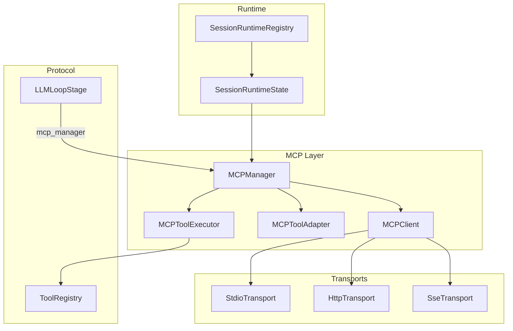

### Компоненты

| Компонент | Файл | Описание |
|-----------|------|----------|
| `MCPClient` | `client.py` | Клиент для одного MCP-сервера с state machine (Created → Connecting → Initializing → Ready) |
| `MCPManager` | `manager.py` | Управление несколькими MCP-серверами, auto-reconnect, health check |
| `MCPToolAdapter` | `tool_adapter.py` | Адаптация MCP инструментов к ACP ToolDefinition, kind inference |
| `MCPToolExecutor` | `executors/mcp_executor.py` | Executor для MCP инструментов через ToolRegistry |
| `StdioTransport` | `transport.py` | Запуск MCP-серверов через stdio subprocess |
| `HttpTransport` | `transport.py` | HTTP POST с JSON-RPC для удалённых серверов |
| `SseTransport` | `transport.py` | Server-Sent Events (deprecated в MCP spec) |
| `SessionRuntimeRegistry` | `session_runtime.py` | REQUEST-scoped реестр runtime объектов (отделяет MCP manager от SessionState) |

### MCP модели данных

| Модель | Описание |
|--------|----------|
| `MCPServerConfig` | Конфигурация сервера: type, command, args, url, headers, env, retry config |
| `MCPTool` | Определение инструмента: name, description, inputSchema, annotations |
| `MCPToolAnnotations` | Аннотации для kind inference: readOnlyHint, destructiveHint, idempotentHint, openWorldHint |
| `MCPResource` | Ресурс MCP: uri, name, description, mimeType |
| `MCPPrompt` | Промпт MCP: name, description, arguments |

### Именование MCP инструментов

`mcp:server_id:tool_name` — namespace для избежания конфликтов с встроенными инструментами.

### Kind Inference

Автоматическое определение типа MCP инструмента для системы разрешений:

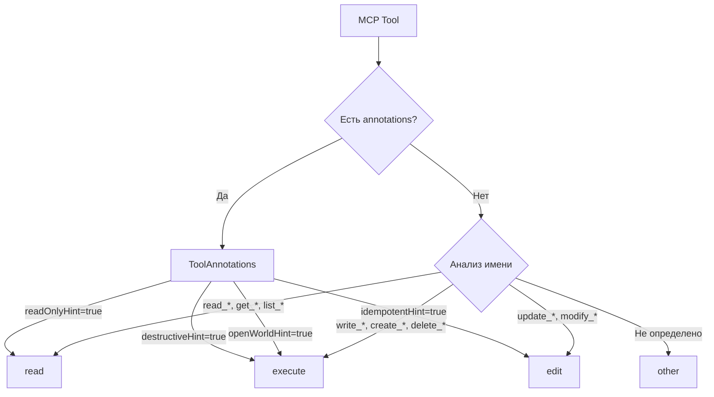

### Auto-reconnect

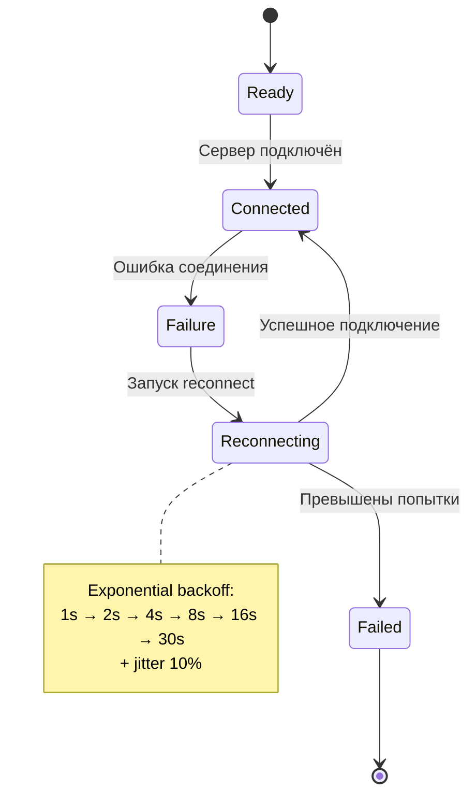

### SessionRuntimeRegistry

Отделяет runtime объекты (MCP manager) от сериализуемого SessionState:

- **Проблема:** SessionState сохраняется в JSON, но MCPManager содержит subprocesses
- **Решение:** SessionRuntimeRegistry хранит MCP manager отдельно
- **Скоуп:** REQUEST-scoped через Dishka
- **Cleanup:** Автоматический shutdown MCP subprocesses при disconnect

> **Подробная документация:** [MCP серверы (user guide)](../user-guide/extensions/mcp-servers.md) · [MCP разработка (dev guide)](../developer-guide/mcp-development.md)

## Протокол ACP

Взаимодействие происходит через JSON-RPC 2.0:

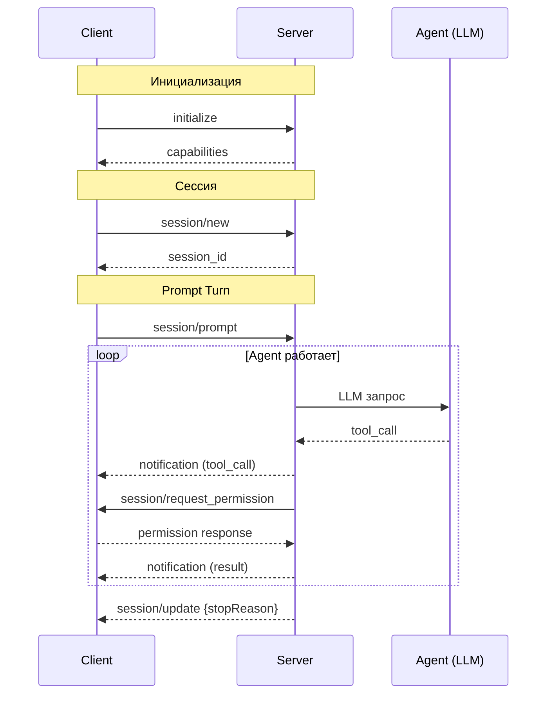

**Методы протокола:**
| Метод | Направление | Описание |
|-------|-------------|----------|
| `initialize` | C→S | Инициализация, обмен capabilities |
| `authenticate` | C→S | Аутентификация (API key) |
| `session/new` | C→S | Создание новой сессии |
| `session/load` | C→S | Загрузка существующей сессии |
| `session/list` | C→S | Список сессий |
| `session/prompt` | C→S | Отправка промпта |
| `session/cancel` | C→S | Отмена текущего промпта |
| `session/update` | S→C | Уведомление о ходе выполнения |
| `session/request_permission` | S→C | Запрос разрешения |
| `session/request_permission_response` | C→S | Ответ на запрос разрешения |
| `session/set_config_option` | C→S | Установка опции конфигурации |
| `session/set_mode` | C→S | Установка режима сессии |

## Агент и LLM

### Цикл обработки prompt

Полный путь запроса от пользователя до ответа LLM:

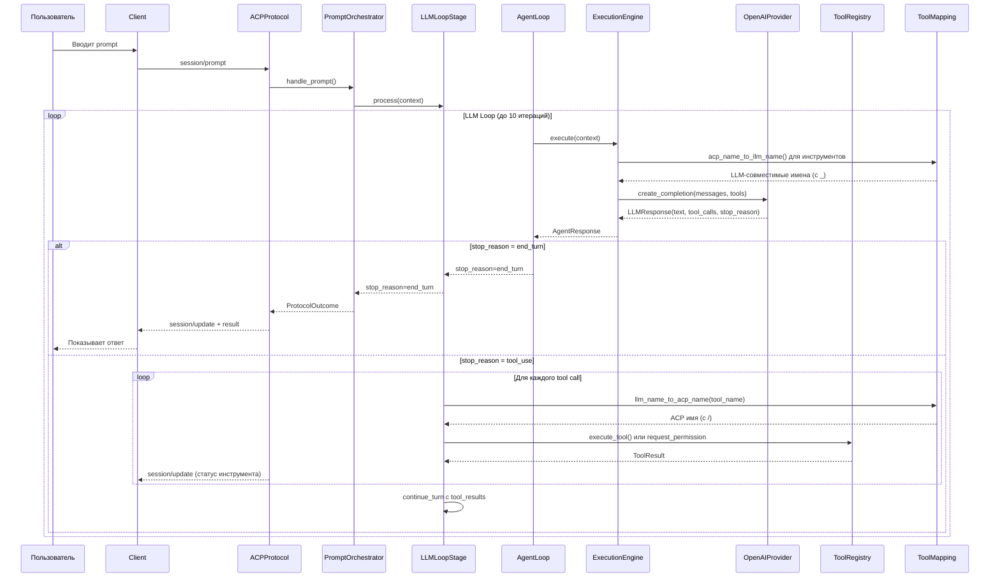

### LLM Loop — алгоритм

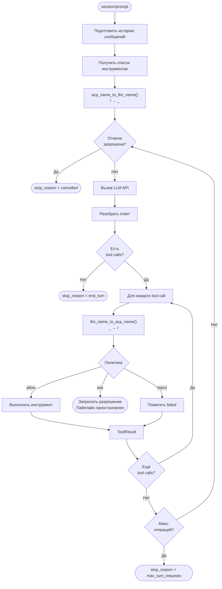

### Отмена prompt

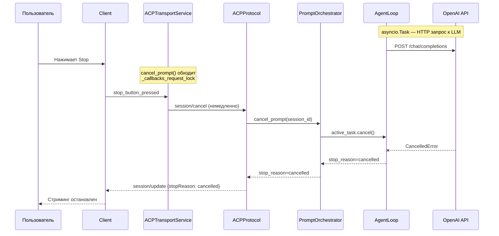

## Мультиагентная система

### Архитектура

Сервер поддерживает несколько стратегий выполнения агентов через EventBus-архитектуру:

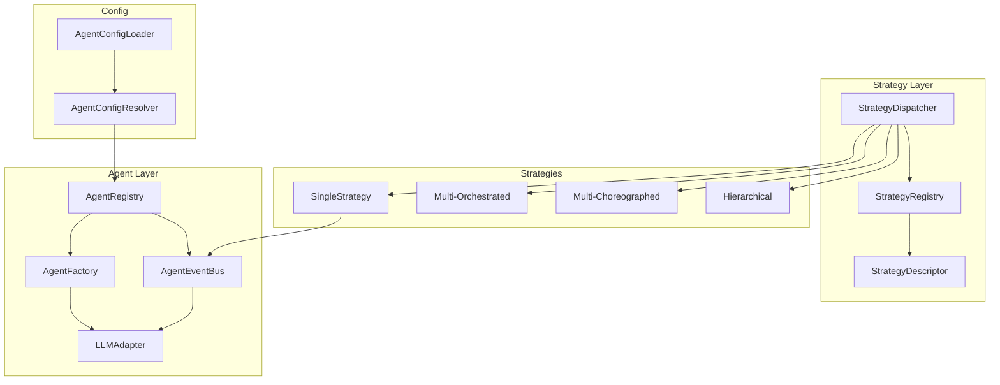

### Стратегии выполнения

| Стратегия | ID | Описание |
|-----------|----|----------|
| **Single** | `single` | Один агент через EventBus. Базовая стратегия, всегда доступна |
| **Multi-Orchestrated** | `multi_orchestrated` | Оркестратор + subагенты |
| **Multi-Choreographed** | `multi_choreographed` | Peer-to-peer collaboration через broadcast |
| **Hierarchical** | `hierarchical` | Primary делегирует subагентам |

### StrategyDispatcher — приоритет выбора

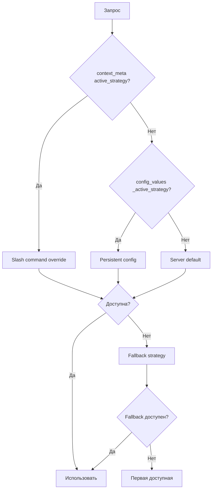

### LLMCallStrategy Protocol

```python
class LLMCallStrategy(Protocol):
    async def execute(self, session, prompt, mcp_manager) -> AgentResponse: ...
    async def continue_execution(self, session, mcp_manager) -> AgentResponse: ...
```

`AgentLoop` зависит от абстракции (DIP), конкретные стратегии реализуют Protocol. Добавление новой стратегии не требует изменения `AgentLoop` (OCP).

### StrategyDescriptor — self-describing стратегии

```python
@dataclass
class StrategyDescriptor:
    name: str                          # "single", "hierarchical"
    display_name: str                  # "Single", "Hierarchical"
    description: str                   # Описание для UI
    factory: Callable[[StrategyDependencies], LLMCallStrategy]
    validator: Callable[[AgentRegistry], bool]  # Проверка доступности
```

### AgentRegistry

Единый реестр агентов с загрузкой конфигураций из 4 источников:

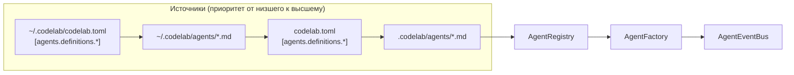

### Роли агентов

| Роль | Описание |
|------|----------|
| `primary` | Основной агент, обрабатывает запросы пользователя |
| `subagent` | Subагент для делегирования задач |
| `orchestrator` | Оркестратор, управляет subагентами |

### Формат Markdown-конфигурации агента

```markdown
---
name: coder
role: primary
model: openai/gpt-4o
temperature: 0.0
priority: 10
permissions:
  edit: true
  bash: true
---
Ты — эксперт-разработчик. Пиши чистый код...
```

### AgentEventBus

In-memory шина межагентской коммуникации. Реализует два интерфейса:

| Интерфейс | Назначение |
|-----------|------------|
| `AbstractEventBus` (pub/sub) | Observability: MetricsTracker, EventTimeline подписываются на события |
| `AgentRoutingInterface` (routing) | Стратегии отправляют запросы агентам через `send_request()` и `broadcast()` |

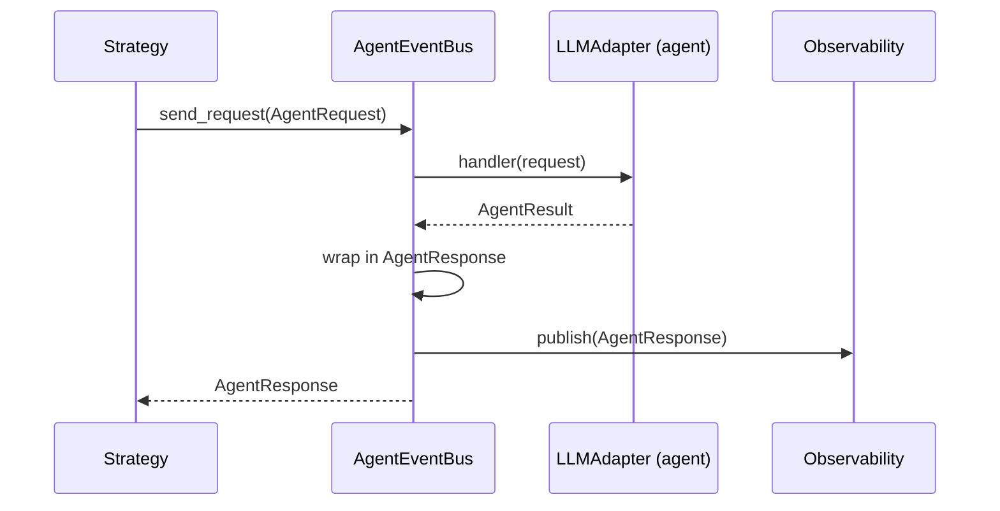

**Retry:** `send_request()` повторяет до `max_attempts` (по умолчанию 3) с exponential backoff.

**Broadcast:** `broadcast()` рассылает `ContextBroadcast` всем агентам параллельно, собирает `ChoreographyAnswer`. При частичном падении — `BroadcastPartialFailure`.

### Domain Events

| Событие | Описание |
|---------|----------|
| `AgentRegistered` | Агент зарегистрирован в шине |
| `AgentUnregistered` | Агент удалён из шины |
| `AgentListChanged` | Список агентов изменился (пакетная операция) |
| `AgentResponse` | Ответ агента (для observability) |
| `AgentRequest` | Запрос к агенту |
| `ContextBroadcast` | Broadcast всем агентам |
| `ChoreographyAnswer` | Ответ агента на broadcast |

### AgentFactory

Фабрика создания `LLMAdapter` из конфигурации агента. Каждый агент может использовать свою модель:

```python
class AgentFactory:
    async def create_adapter(self, agent: ResolvedAgent) -> LLMAdapter:
        # Резолвит model → LLMProvider через LLMProviderRegistry
        # Создаёт LLMAdapter с правильным провайдером
        # Кэширует adapter per agent_name
```

### Slash-команда `/strategy`

```
/strategy              # Показать текущую strategy и доступные
/strategy hierarchical # Переключить на hierarchical
```

Сохраняет выбор в `session.config_values["_active_strategy"]` для persistence между turn'ами.

## Observability

### Архитектура

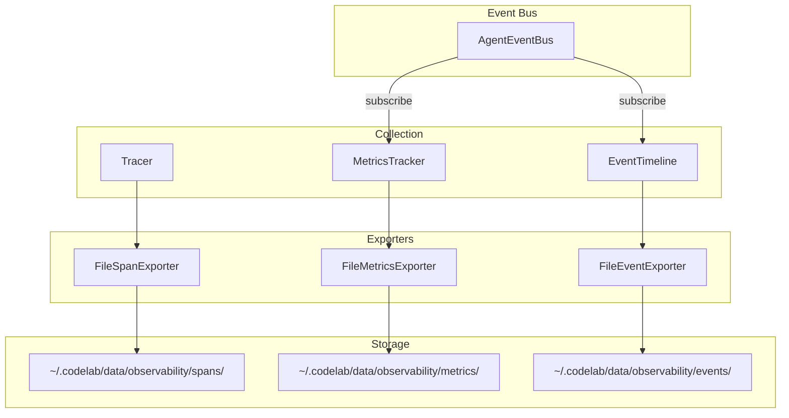

### Tracer

Span hierarchy с context propagation:

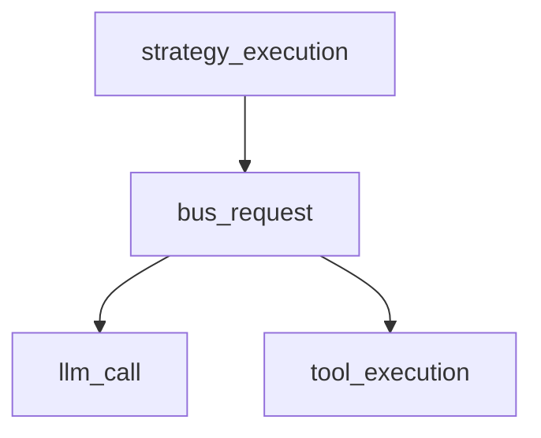

| Компонент | Описание |
|-----------|----------|
| `SpanContext` | ID, name, parent_id, attributes, start/end_time, session_id |
| `Tracer` | Управление span'ами: start/end/current, стек активных span'ов |
| `debug` mode | Сохраняет полные атрибуты span'ов |

### MetricsTracker

Автоматический сбор метрик через подписку на EventBus:

| Метрика | Описание |
|---------|----------|
| `bus_dispatch_count` / `bus_dispatch_total_ms` | Dispatch операции |
| `llm_call_count` / `llm_total_input_tokens` / `llm_total_output_tokens` | LLM вызовы |
| `compression_count` / `compression_total_ratio` | Context compression |
| `slicer_count` / `slicer_total_original_tokens` / `slicer_total_sliced_tokens` | Token slicing |
| `strategy_execution_count` / `strategy_execution_total_ms` | Выполнение стратегий |
| `agent_responses` / `agent_errors` | Ответы и ошибки агентов |

### EventTimeline

Хронология событий сессии. Автоматически подписывается на:
- `AgentRegistered`, `AgentUnregistered`, `AgentListChanged`, `AgentResponse`

### File Exporters

| Экспортёр | Формат файла | Режим |
|-----------|-------------|-------|
| `FileSpanExporter` | `spans/YYYY-MM-DD-HH-MM-SS.json` | Write + ротация |
| `FileMetricsExporter` | `metrics/YYYY-MM-DD.json` | Overwrite (atomic) |
| `FileEventExporter` | `events/YYYY-MM-DD.json` | Append + ротация |

Все экспортёры поддерживают:
- **Ротация** при превышении `max_file_size` (по умолчанию 10MB)
- **Cleanup** удаление файлов старше `max_age_days` (по умолчанию 30 дней)
- **ExportMetrics** — метрики экспорта (total_exports, failed_exports, total_items_exported)
- **Background flush** через `ObservabilityFlushManager` (APP scope)

### Конфигурация observability

```toml
[observability]
enabled = true
export_dir = "~/.codelab/data/observability"
flush_interval = 60       # секунды
max_file_size = 10485760  # 10MB
```

## Middleware (Protocol Layer)

Middleware применяется в порядке onion pattern: первое в списке — внешнее, последнее — ближе к обработчику.

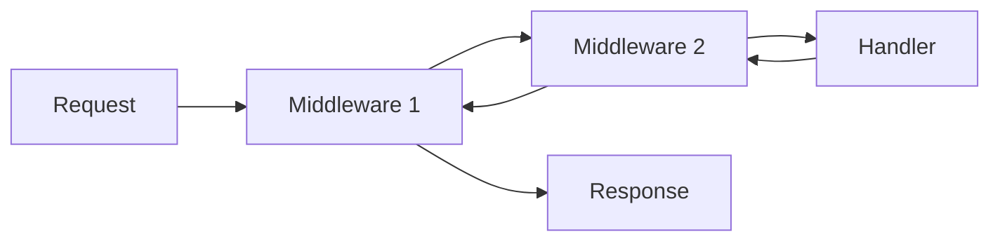

### Встроенные middleware

| Middleware | Описание |
|------------|----------|
| `message_trace_middleware` | Трассировка JSON-RPC сообщений (вкл. через `--trace-messages`) |

**Message Trace Middleware:**
- Логирует входящие запросы и исходящие ответы с полным payload
- Пишет в отдельный logger `codelab.trace` (JSON формат)
- Поддерживает обрезку payload через `max_payload_length`
- Контекст: `connection_id`, `request_id`, `direction` (in/out)

```python
trace_mw = create_message_trace_middleware(
    enabled=True,
    connection_id="abc123",
    max_payload_length=4096,
)
protocol = ACPProtocol(middleware=[trace_mw])
```

## LLM подсистема (детали)

### Model Discovery

```python
class ModelDiscovery(ABC):
    async def discover_models(self) -> list[ModelInfo]: ...
```

| Реализация | Описание |
|------------|----------|
| `StaticDiscovery` | Статический список моделей из `ProviderInfo` (используется сейчас) |
| `DiscoveryConfig` | Конфигурация: `enabled`, `refresh_interval`, `default_models` |

Extension points: `OllamaDiscovery` (dynamic через Ollama API), `LMStudioDiscovery` — future.

### Telemetry

```python
class TelemetrySink(ABC):
    async def record_request(self, provider_id, model_id, latency_ms, success): ...
    async def record_cost(self, provider_id, model_id, cost_usd): ...
```

| Реализация | Описание |
|------------|----------|
| `NoOpTelemetry` | Заглушка (используется сейчас) |

Extension points: `PrometheusTelemetry`, `DatadogTelemetry` — future.

### LLM Timeouts

```toml
[llm.timeout]
connect = 30.0   # Таймаут подключения к API (секунды)
read = 300.0     # Таймаут ожидания ответа (секунды)
write = 30.0     # Таймаут отправки запроса (секунды)
pool = 30.0      # Таймаут ожидания соединения из пула (секунды)
```

CLI: `--llm-timeout-connect`, `--llm-timeout-read`, `--llm-timeout-write`, `--llm-timeout-pool`.

## Потоки данных

### Prompt Turn

Цикл обработки пользовательского запроса:

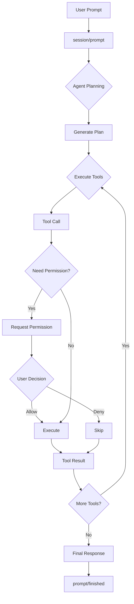

### Система разрешений

```mermaid
flowchart LR
    subgraph "Permission Flow"
        Tool[Tool Call] --> Check{Check Policy}
        Check -->|Auto-Allow| Execute[Execute]
        Check -->|Auto-Deny| Skip[Skip]
        Check -->|Ask|         Request["Request<br/>Permission"]
        Request --> User{User}
        User -->|Allow| Execute
        User -->|Allow All|         Policy["Update<br/>Policy"]
        Policy --> Execute
        User -->|Deny| Skip
    end
```

## Хранение данных

### Структура сессий

```mermaid
erDiagram
    SESSION ||--o{ MESSAGE : contains
    SESSION ||--o{ TOOL_CALL : has
    SESSION {
        string id PK
        string name
        datetime created_at
        json config
        json context
    }
    MESSAGE {
        string id PK
        string session_id FK
        string role
        json content
        datetime timestamp
    }
    TOOL_CALL {
        string id PK
        string session_id FK
        string tool_name
        json arguments
        json result
        string status
    }
```

## Директории проекта

```
codelab/src/codelab/
├── shared/              # Общие модули
│   ├── messages.py      # JSON-RPC сообщения
│   ├── logging.py       # Структурированное логирование
│   └── content/         # Типы контента ACP
│
├── server/              # Серверная часть
│   ├── di.py            # Dishka DI контейнер
│   ├── config.py        # Pydantic конфигурация
│   ├── http_server.py   # HTTP/WebSocket сервер
│   ├── web_app.py       # Web UI (textual-web)
│   ├── rpc_holder.py    # ClientRPCServiceHolder
│   ├── protocol/        # ACP протокол
│   │   ├── core.py      # ACPProtocol (dispatcher)
│   │   ├── state.py     # SessionState, ToolCallState
│   │   ├── handlers/    # Обработчики методов
│   │   │   ├── auth.py
│   │   │   ├── session.py
│   │   │   ├── prompt.py
│   │   │   ├── permissions.py
│   │   │   ├── config.py
│   │   │   ├── prompt_orchestrator.py  # Главный координатор
│   │   │   ├── pipeline/               # 7 стадий pipeline
│   │   │   ├── slash_commands/         # /help, /mode, /status, /strategy
│   │   │   ├── middleware/             # message_trace middleware
│   │   │   └── ... (менеджеры)
│   │   └── content/     # Extractor, Validator, Formatter
│   ├── agent/           # LLM агент (ExecutionEngine, AgentLoop, Strategies, EventBus)
│   │   ├── strategies/  # StrategyRegistry, StrategyDispatcher, SingleStrategy
│   │   ├── config/      # AgentConfigLoader, AgentConfigResolver (TOML + Markdown)
│   │   ├── contracts/   # DomainEvent, AgentRequest, AgentResponse, Broadcast
│   │   └── event_bus/   # AgentEventBus (pub/sub + routing)
│   ├── tools/           # Инструменты (registry, executors)
│   ├── storage/         # Хранилище сессий (LRU cache)
│   ├── mcp/             # MCP интеграция
│   ├── client_rpc/      # Agent→Client RPC
│   ├── llm/             # LLM подсистема (Registry, 8+ Providers, Fallback, Events)
│   ├── observability/   # Tracer, Metrics, Timeline, Exporters
│   └── transport/       # WebSocket, stdio
│
└── client/              # Клиентская часть
    ├── domain/          # Domain Layer (entities, repos)
    ├── application/     # Application Layer (use cases)
    ├── infrastructure/  # Infrastructure Layer (DI, transport)
    │   ├── services/    # ACPTransportService, BackgroundReceiveLoop
    │   ├── handlers/    # FS, Terminal handlers
    │   └── events/      # EventBus
    ├── presentation/    # ViewModels (MVVM, 14 штук)
    └── tui/             # TUI компоненты (45+ файлов)
        ├── app.py       # ACPClientApp
        ├── components/  # ChatView, Sidebar, FileTree, ...
        ├── navigation/  # NavigationManager
        └── themes/      # Dark/Light themes
```

## См. также

- [Введение](introduction.md) — общая информация о CodeLab
- [Сценарии использования](use-cases.md) — примеры применения
- [Спецификация ACP](../../protocols/Agent%20Client%20Protocol/protocol/01-Overview.md) — детали протокола
