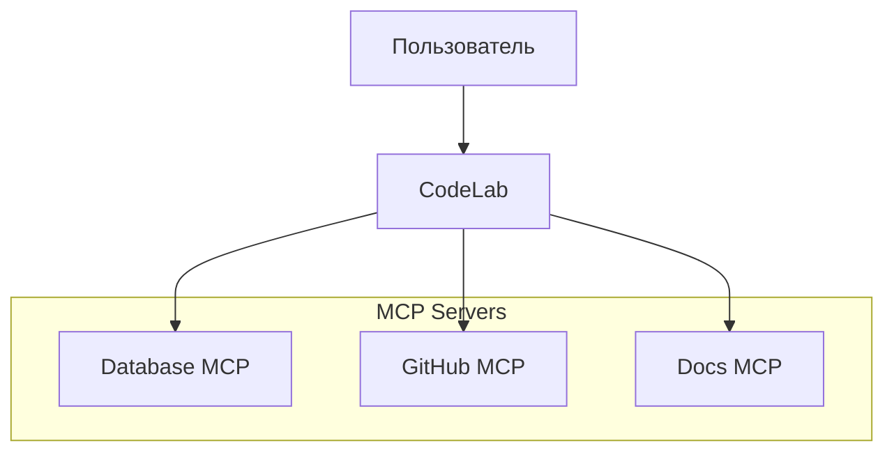
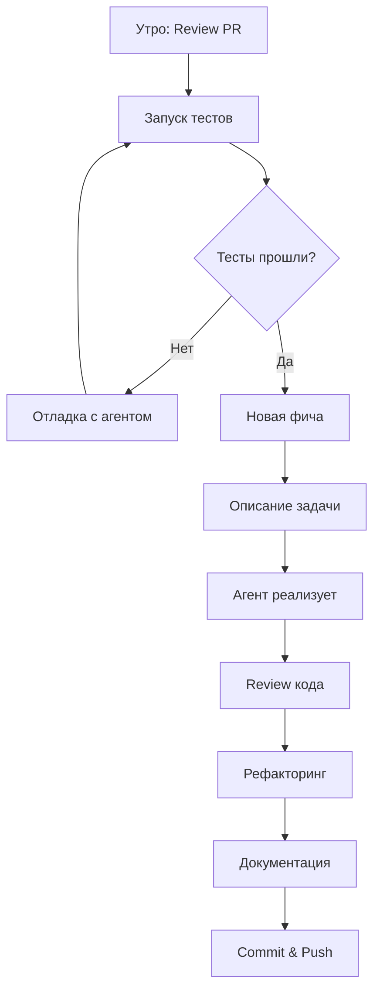

# Сценарии использования

> Типичные варианты применения CodeLab в повседневной разработке.

## Обзор

CodeLab — это AI-помощник для разработчиков, который может выполнять широкий спектр задач. Ниже представлены основные сценарии использования.

## 🔨 Разработка новых функций

### Описание
Вы описываете функционал на естественном языке, агент анализирует кодовую базу и реализует его.

### Пример взаимодействия

```
User: Добавь авторизацию через JWT в наш REST API

Agent: Проанализировал структуру проекта. Предлагаю план:
1. Добавить зависимость PyJWT
2. Создать модуль auth/jwt.py с функциями encode/decode
3. Создать middleware для проверки токенов
4. Добавить эндпоинты /login и /refresh
5. Обновить существующие защищённые роуты

Начинаю выполнение...
```

### Workflow


## 🐛 Отладка и исправление ошибок

### Описание
Агент анализирует стектрейсы, находит причины ошибок и предлагает исправления.

### Пример взаимодействия

```
User: Приложение падает с ошибкой "KeyError: 'user_id'" в auth.py:45

Agent: Анализирую код...
Проблема: в функции get_current_user() отсутствует проверка 
на наличие ключа 'user_id' в payload токена.

Предлагаю исправление:
- Добавить валидацию payload перед доступом к ключам
- Добавить обработку исключений с понятным сообщением об ошибке

Применить изменения?
```

## ♻️ Рефакторинг кода

### Описание
Улучшение структуры кода без изменения функциональности.

### Примеры задач
- Разделение большого модуля на несколько
- Извлечение повторяющегося кода в функции
- Применение паттернов проектирования
- Улучшение типизации

### Пример взаимодействия

```
User: Разбей файл utils.py на отдельные модули по функциональности

Agent: Проанализировал utils.py (450 строк). Предлагаю структуру:
├── utils/
│   ├── __init__.py      # Реэкспорт для обратной совместимости
│   ├── strings.py       # Работа со строками (120 строк)
│   ├── dates.py         # Работа с датами (95 строк)
│   ├── files.py         # Работа с файлами (130 строк)
│   └── validation.py    # Валидаторы (105 строк)

Начать рефакторинг?
```

## 📝 Написание тестов

### Описание
Автоматическое создание unit и интеграционных тестов.

### Пример взаимодействия

```
User: Напиши тесты для модуля services/user_service.py

Agent: Создаю тесты для UserService:
- test_create_user_success
- test_create_user_duplicate_email
- test_get_user_by_id
- test_get_user_not_found
- test_update_user
- test_delete_user

Использую pytest с fixtures для БД.
Покрытие: 95%
```

## 📚 Документирование

### Описание
Генерация документации, docstrings, README файлов.

### Пример взаимодействия

```
User: Добавь docstrings ко всем публичным функциям в api/handlers.py

Agent: Добавляю docstrings в формате Google Style:
- get_users: 3 параметра, возвращает List[User]
- create_user: описание, примеры, исключения
- update_user: ...

Всего обработано 12 функций.
```

## 🔧 Выполнение команд

### Описание
Запуск shell-команд с интерактивным выводом.

### Пример взаимодействия

```
User: Запусти тесты и покажи какие падают

Agent: Выполняю pytest...

FAILED tests/test_auth.py::test_token_expiry - AssertionError
FAILED tests/test_api.py::test_rate_limit - TimeoutError

2 теста упали. Хотите, чтобы я проанализировал и исправил их?
```

## 🔌 Интеграция с MCP

### Описание
Использование внешних инструментов через MCP-серверы.

### Примеры
- Поиск в документации
- Работа с базами данных
- Интеграция с CI/CD
- Управление инфраструктурой



## 🎯 Типичный рабочий день



## Рекомендации по использованию

### ✅ Хорошие практики

1. **Чёткое описание задачи** — чем конкретнее запрос, тем лучше результат
2. **Итеративный подход** — разбивайте большие задачи на части
3. **Проверка результатов** — всегда ревьюьте изменения агента
4. **Использование системы разрешений** — контролируйте опасные операции

### ⚠️ Ограничения

- Агент работает в рамках текущей рабочей директории
- Большие файлы могут быть обработаны частями
- Сложная бизнес-логика требует детального описания

## См. также

- [Введение](introduction.md) — общая информация о CodeLab
- [Быстрый старт](../getting-started/quickstart.md) — начало работы
- [Первый проект](../getting-started/first-project.md) — практический пример
