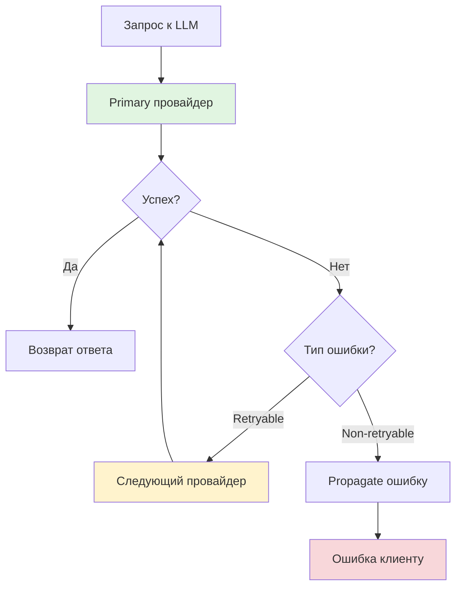
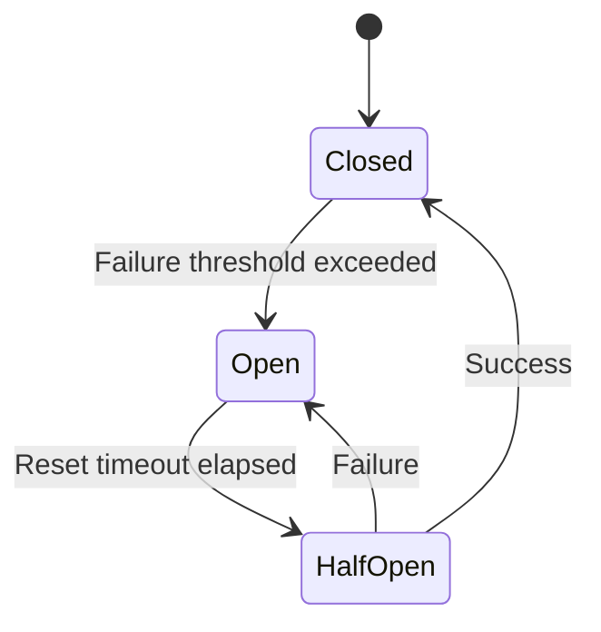

# Fallback и устойчивость LLM

CodeLab поддерживает автоматическую fallback цепочку для обеспечения устойчивости при ошибках LLM провайдеров.

## Концепция

Fallback система позволяет автоматически переключаться на резервные провайдеры при ошибках основного:



### Retryable ошибки

| Тип ошибки | Описание | Пример |
|------------|----------|--------|
| `rate_limit` | Превышен лимит запросов | HTTP 429 |
| `timeout` | Таймаут запроса | Connection timeout |
| `internal_error` | Внутренняя ошибка провайдера | HTTP 500 |
| `service_unavailable` | Сервис недоступен | HTTP 503 |
| `model_unavailable` | Модель временно недоступна | Model overloaded |

### Non-retryable ошибки

| Тип ошибки | Описание |
|------------|----------|
| `auth_error` | Ошибка аутентификации |
| `invalid_request` | Некорректный запрос |

## Настройка fallback

### Через CLI

```bash
codelab serve \
  --fallback-enabled \
  --fallback-strategy sequential \
  --fallback-order openai,openrouter,ollama
```

### Через TOML

```toml
[llm.fallback]
enabled = true
strategy = "sequential"
order = ["openai", "openrouter", "ollama"]
max_attempts = 3
retry_on = ["rate_limit", "timeout", "internal_error"]
```

### Через переменные окружения

```bash
export CODELAB_FALLBACK_ENABLED=true
export CODELAB_FALLBACK_STRATEGY=sequential
export CODELAB_FALLBACK_ORDER=openai,openrouter,ollama
```

## Стратегии fallback

### Sequential (MVP)

Перебирает провайдеры по порядку, пока один не обработает запрос успешно:

1. Попытка с первым провайдером
2. При retryable ошибке → следующий провайдер
3. При успехе → возврат ответа
4. При всех.failed → `AllProvidersFailed`

### Future стратегии

| Стратегия | Описание | Статус |
|-----------|----------|--------|
| `cost` | Выбор провайдера по минимальной стоимости | Extension point |
| `latency` | Выбор провайдера по минимальной задержке | Extension point |
| `smart` | ML-based выбор оптимального провайдера | Extension point |

## Circuit Breaker

Circuit Breaker отслеживает ошибки провайдеров и временно исключает их из fallback цепочки:



### Состояния

| Состояние | Описание |
|-----------|----------|
| **Closed** | Провайдер работает нормально |
| **Open** | Провайдер исключён из цепочки (слишком много ошибок) |
| **HalfOpen** | Провайдер тестируется после timeout |

### Настройка

```python
from codelab.server.llm.fallback.circuit_breaker import CircuitBreaker

circuit_breaker = CircuitBreaker(
    failure_threshold=5,      # Ошибок до открытия circuit
    reset_timeout=60,         # Секунд до попытки восстановления
    half_open_max_calls=1,    # Тестовых вызовов в HalfOpen
)
```

## Fallback Orchestrator

`FallbackOrchestrator` управляет выполнением fallback цепочки:

```python
from codelab.server.llm.fallback import FallbackOrchestrator, SequentialFallback
from codelab.server.llm.fallback.config import FallbackConfig

# Создать стратегию
fallback = SequentialFallback(
    provider_order=["openai", "openrouter", "ollama"],
    circuit_breaker=circuit_breaker,
)

# Создать конфигурацию
config = FallbackConfig(
    enabled=True,
    max_attempts=3,
    retry_on=[ProviderErrorType.RATE_LIMIT, ProviderErrorType.TIMEOUT],
)

# Создать оркестратор
orchestrator = FallbackOrchestrator(strategy=fallback, config=config)

# Выполнить completion с fallback
response = await orchestrator.execute_completion(
    providers=[openai, openrouter, ollama],
    request=completion_request,
)
```

## ProviderEventBus

Шина событий для мониторинга fallback:

| Событие | Описание |
|---------|----------|
| `ProviderInitialized` | Провайдер успешно инициализирован |
| `ProviderFailed` | Ошибка инициализации провайдера |
| `ModelsUpdated` | Список моделей обновлён |
| `FallbackTriggered` | Активирован fallback |

### Подписка на события

```python
from codelab.server.llm.events import event_bus, FallbackTriggered

async def on_fallback(event: FallbackTriggered) -> None:
    print(f"Fallback: {event.from_provider} → {event.to_provider}")

event_bus.subscribe(FallbackTriggered, on_fallback)
```

## Примеры конфигураций

### Production: OpenAI → OpenRouter → Ollama

```toml
[llm]
provider = "openai"
model = "openai/gpt-4o"

[llm.providers.openai]
api_key = "${OPENAI_API_KEY}"

[llm.providers.openrouter]
api_key = "${OPENROUTER_API_KEY}"

[llm.providers.ollama]
base_url = "http://localhost:11434/v1"

[llm.fallback]
enabled = true
strategy = "sequential"
order = ["openai", "openrouter", "ollama"]
max_attempts = 3
retry_on = ["rate_limit", "timeout", "service_unavailable"]
```

### Development: Mock только

```toml
[llm]
provider = "mock"
model = "mock/mock-model"

[llm.fallback]
enabled = false
```

### Cost-optimized: Ollama → OpenRouter → OpenAI

```toml
[llm]
provider = "ollama"
model = "ollama/llama3.1:70b"

[llm.fallback]
enabled = true
order = ["ollama", "openrouter", "openai"]
retry_on = ["timeout", "service_unavailable", "model_unavailable"]
```

## Troubleshooting

### Все провайдеры упали

```
AllProvidersFailed: All 3 providers failed after 3 attempts
```

**Решение:**
1. Проверьте API keys всех провайдеров
2. Проверьте доступность сервисов
3. Увеличьте `max_attempts`
4. Добавьте больше провайдеров в `order`

### Fallback не срабатывает на ошибку

**Решение:** Проверьте `retry_on` — ошибка должна быть в списке retryable типов.

### Circuit Breaker постоянно открывает circuit

**Решение:**
1. Увеличьте `failure_threshold`
2. Увеличьте `reset_timeout`
3. Проверьте стабильность провайдера
