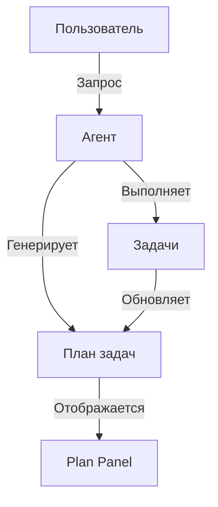
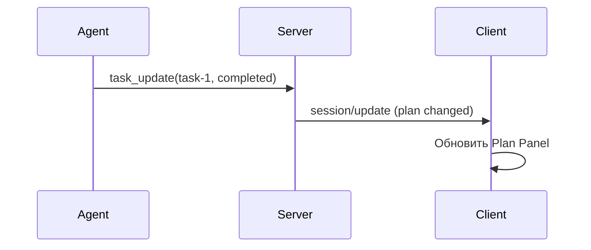

# План агента

> Руководство по работе с планом задач агента.

## Обзор

План агента — это структурированный список задач, которые агент планирует выполнить для достижения цели пользователя. CodeLab реализует визуализацию плана согласно [ACP спецификации Agent Plan](../../../protocols/Agent%20Client%20Protocol/protocol/11-Agent%20Plan.md).



## Интерфейс плана

### Plan Panel в Sidebar

Вкладка "Plan" в Sidebar показывает текущий план:

```
Plan
─────────────────────────
✅ Анализ требований
   └─ Прочитать main.py
   └─ Изучить структуру

🔄 Рефакторинг кода
   └─ Выделить функции
   └─ Обновить импорты

⏳ Тестирование
   └─ Написать unit-тесты
   └─ Запустить pytest

⏳ Документация
```

### Статусы задач

| Иконка | Статус | Описание |
|--------|--------|----------|
| ⏳ | Pending | Ожидает выполнения |
| 🔄 | In Progress | Выполняется сейчас |
| ✅ | Completed | Успешно завершена |
| ❌ | Failed | Завершена с ошибкой |
| ⏸️ | Paused | Приостановлена |
| 🚫 | Cancelled | Отменена |

## Структура плана

### Иерархия задач

План может содержать вложенные задачи:

```json
{
  "plan": {
    "goal": "Рефакторинг модуля авторизации",
    "tasks": [
      {
        "id": "task-1",
        "title": "Анализ текущего кода",
        "status": "completed",
        "subtasks": [
          {
            "id": "task-1.1",
            "title": "Прочитать auth.py",
            "status": "completed"
          },
          {
            "id": "task-1.2",
            "title": "Найти зависимости",
            "status": "completed"
          }
        ]
      },
      {
        "id": "task-2",
        "title": "Рефакторинг",
        "status": "in_progress",
        "subtasks": [...]
      }
    ]
  }
}
```

### Поля задачи

| Поле | Тип | Описание |
|------|-----|----------|
| `id` | string | Уникальный идентификатор |
| `title` | string | Название задачи |
| `description` | string | Подробное описание (опционально) |
| `status` | enum | Статус выполнения |
| `subtasks` | array | Вложенные подзадачи |
| `tool_calls` | array | Связанные tool calls |

## Генерация плана

### Автоматическая генерация

Агент автоматически создает план при получении сложного запроса:

```
User: Создай REST API для управления пользователями

Agent: Создаю план выполнения:
1. Анализ требований
2. Создание структуры проекта
3. Модели данных
4. API endpoints
5. Тестирование
6. Документация
```

### Явный запрос плана

```
/plan создай REST API
```

Агент вернет план без немедленного выполнения.

## Обновление плана

### В реальном времени

План обновляется по мере выполнения:



### События обновления

| Событие | Описание |
|---------|----------|
| `task_started` | Задача начата |
| `task_progress` | Прогресс задачи |
| `task_completed` | Задача завершена |
| `task_failed` | Задача провалена |
| `subtask_added` | Добавлена подзадача |

## Взаимодействие с планом

### Просмотр деталей

Кликните на задачу для просмотра:
- Подробное описание
- Связанные tool calls
- Время выполнения
- Ошибки (если есть)

### Отмена задачи

```
Ctrl+C
```

Отменяет текущую выполняющуюся задачу.

### Пропуск задачи

В некоторых случаях можно пропустить задачу:

```
/skip task-3
```

## Прогресс выполнения

### Progress Bar

Общий прогресс отображается в Header:

```
[████████░░░░░░░░] 50% (3/6 tasks)
```

### Детальный прогресс

В Plan Panel каждая задача показывает:
- Процент выполнения
- Количество подзадач
- Время выполнения

## Интеграция с Tool Calls

### Связь задач и инструментов

Каждая задача может быть связана с tool calls:

```
✅ Прочитать конфигурацию
   └─ 📖 read_text_file: config.json ✅
   └─ 📖 read_text_file: .env ✅

🔄 Обновить настройки
   └─ ✏️ write_text_file: config.json 🔄
```

### Навигация

Кликните на tool call для перехода в Tool Panel.

## Сохранение плана

### Автосохранение

План сохраняется как часть сессии в `~/.codelab/data/sessions/`.

### Экспорт плана

```bash
# Экспорт в JSON
codelab plan export SESSION_ID > plan.json

# Экспорт в Markdown
codelab plan export SESSION_ID --format md > plan.md
```

### Пример Markdown экспорта

```markdown
# План: Рефакторинг модуля авторизации

## Цель
Улучшить структуру и читаемость кода авторизации.

## Задачи

### ✅ 1. Анализ текущего кода
- [x] Прочитать auth.py
- [x] Найти зависимости

### 🔄 2. Рефакторинг
- [x] Выделить класс AuthService
- [ ] Обновить импорты
- [ ] Добавить типизацию

### ⏳ 3. Тестирование
- [ ] Unit-тесты
- [ ] Integration-тесты
```

## Режимы планирования

### Immediate Mode (по умолчанию)

Агент выполняет план сразу:
1. Получает запрос
2. Генерирует план
3. Начинает выполнение

### Plan-First Mode

Агент показывает план перед выполнением:

```
/mode plan-first
```

Или в конфигурации:
```json
{
  "agent": {
    "mode": "plan-first"
  }
}
```

## Лучшие практики

### ✅ Рекомендуется

1. **Проверять план** перед выполнением сложных задач
2. **Использовать подзадачи** для структурирования
3. **Отменять ненужные задачи** (`Ctrl+C`)

### ⚠️ Учитывайте

1. Сложные планы требуют больше токенов
2. Глубокая вложенность усложняет навигацию
3. Слишком детальный план может быть избыточным

## Troubleshooting

### План не отображается

1. Проверьте вкладку Plan в Sidebar
2. Убедитесь, что агент работает
3. Сложность запроса достаточна для плана

### Задача зависла

```
Ctrl+C
```

Отменяет текущую задачу. Агент попробует альтернативный подход.

### План не обновляется

1. Проверьте соединение с сервером
2. Перезагрузите интерфейс (`F5` в Web)
3. Проверьте логи сервера

## См. также

- [Инструменты](tools.md) — инструменты агента
- [TUI клиент](../clients/tui-client.md) — интерфейс
- [Спецификация Agent Plan](../../../protocols/Agent%20Client%20Protocol/protocol/11-Agent%20Plan.md) — протокол
