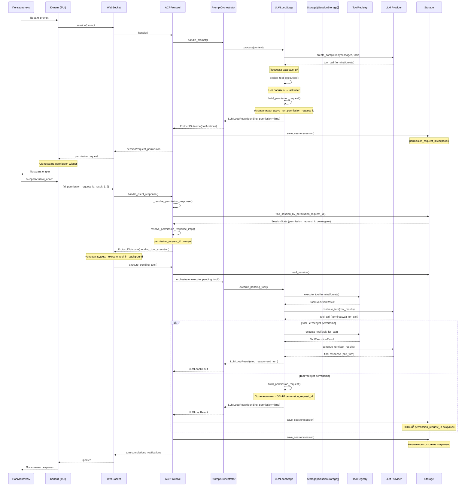
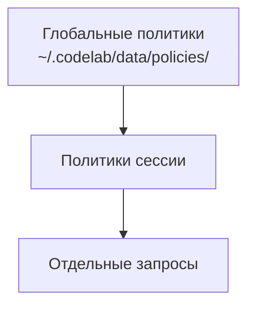

# Система разрешений

> Руководство по управлению разрешениями агента.

## Обзор

CodeLab использует систему разрешений для контроля доступа агента к ресурсам клиента: файловой системе и терминалу. Это обеспечивает безопасность и контроль пользователя над действиями AI.

## Поток выполнения разрешений



## Типы разрешений

### File System

| Вид (`kind`) | Инструмент | Уровень риска |
|--------------|------------|---------------|
| `read` | `fs/read_text_file` | 🟢 Низкий |
| `edit` | `fs/write_text_file` | 🟡 Средний |

### Terminal

| Вид (`kind`) | Инструмент | Уровень риска |
|--------------|------------|---------------|
| `execute` | `terminal/create` | 🔴 Высокий |

`terminal/wait_for_exit` и `terminal/release` разрешения не требуют.

## Диалог разрешения

При запросе агентом операции появляется диалог:

```
┌────────────────────────────────────────────────────────────┐
│  🔒 Запрос разрешения                                      │
│                                                            │
│  Операция: read_text_file                                  │
│  Путь: /project/src/main.py                                │
│                                                            │
│  [Allow]  [Allow All]  [Always Allow]  [Deny]             │
└────────────────────────────────────────────────────────────┘
```

### Варианты ответа

| optionId | Название | Действие | Область |
|----------|----------|----------|---------|
| `allow_once` | Allow once | Разрешить один раз | Только этот запрос |
| `allow_always` | Allow always | Разрешать этот **вид** инструмента | Сессия и глобальная политика |
| `reject_once` | Reject once | Отклонить один раз | Только этот запрос |
| `reject_always` | Reject always | Отклонять этот **вид** инструмента | Сессия и глобальная политика |

Запоминаемое решение привязано к **виду** (`kind`) инструмента — `read`, `edit`,
`execute`, `delete`, `search`, `fetch`, `move`, `think`, `other`, — а не к его имени и
не к пути.

## Политики разрешений

### Уровни политик



### Глобальные политики

Сохраняются в `<CODELAB_HOME>/data/policies/global_permissions.json`
(по умолчанию `~/.codelab/data/policies/`). Формат — решения по видам инструментов:

```json
{
  "version": 1,
  "policies": {
    "read": "allow_always",
    "execute": "reject_always"
  },
  "metadata": {
    "updated_at": "2026-08-17T12:00:00+00:00",
    "updated_by": "system"
  }
}
```

Запись атомарная: сначала во временный файл, затем переименование.

### Политики сессии

Те же решения по видам, но в документе сессии: действуют в текущей сессии и проверяются
**раньше** глобальных. Порядок проверки — сессия → глобальная политика → спросить
пользователя.

> **Чего пока нет:** правил по путям и командам, glob-паттернов, решений `ask`/`deny` в
> файле, отдельных правил для MCP-серверов. Допустимых решений два — `allow_always` и
> `reject_always`. Формат более выразительных правил вместе с их миграцией — отдельное
> решение (ADR-009).

## Режимы сессии

Режим задаёт уровень автономности агента и переключается командой `/mode` или
методом `session/set_mode`. Режимов три:

| Режим | Поведение |
|-------|-----------|
| `plan` | Read-only: инструменты видов `edit`/`execute`/`delete` заблокированы, агент только рассуждает и планирует |
| `standard` (по умолчанию) | Запрос разрешения перед каждым изменяющим или исполняющим вызовом |
| `bypass` | Автоматическое исполнение без подтверждения |

Старые имена режимов (`ask`, `code`, `architect`, `debug`) читаются из сохранённых
сессий и приводятся к новым: `ask` → `standard`, `code` → `bypass`,
`architect` → `plan`, `debug` → `standard`.

> **Чего пока нет:** правил по командам терминала (`"rm -rf *" → deny`), режимов
> «paranoid»/«trusted» и списков безопасных команд. Ограничение исполнения сегодня —
> это режим сессии и решение по виду инструмента, а не разбор командной строки.

## Управление политиками

Политики выдаются ответом в диалоге разрешения (`allow_always` / `reject_always`) и
сохраняются автоматически. Отдельных CLI-команд для них нет: у `codelab` два
подкоманды — `serve` и `connect`.

### Уровни политик

1. **Политика сессии** — проверяется первой, живёт в документе сессии;
2. **Глобальная политика** — `<CODELAB_HOME>/data/policies/global_permissions.json`;
3. **Запрос пользователю** — если ни там, ни там решения нет.

### Сброс политик

Глобальные — удалением файла `global_permissions.json`; сессионные — вместе с сессией.

## Inline разрешения

В чате разрешения отображаются inline:

```
🤖 Агент: Мне нужно прочитать файл main.py
   
   ┌─ 🔒 read_text_file: src/main.py ─┐
   │ [✓ Allow] [✓ All] [✗ Deny]       │
   └──────────────────────────────────┘
   
🤖 Агент: Вот содержимое файла...
```

## Аудит действий

Все операции логируются:

```bash
# Просмотр последних операций
cat ~/.codelab/logs/codelab.log | grep "permission"
```

Каждая инвокация инструмента пишет `tool_invocation_probe` — что исполняется, от чьего
имени и прошло ли решение через гейт:

```
[info] tool_invocation_probe acp_tool_name=fs/read_text_file subject=model
       requires_permission=True gated=True inside_cwd=True path=src/main.py
```

`subject` различает вызывающего (`model` — turn-путь, `context` — сборка контекста),
`gated` показывает, спрашивалось ли разрешение фактически.

## Рекомендации по безопасности

### ✅ Рекомендуется

1. Использовать **Allow All** для безопасных операций (чтение документации)
2. Настроить глобальные политики для частых паттернов
3. Всегда проверять команды терминала перед разрешением

### ⚠️ С осторожностью

1. **Always Allow** для write операций
2. Разрешение команд с `sudo`
3. Операции над системными файлами

### ❌ Не рекомендуется

1. Trusted mode для незнакомых проектов
2. Разрешение `rm -rf`
3. Отключение системы разрешений

## Troubleshooting

### Слишком много запросов

Ответьте `allow_always` на первый запрос нужного вида — решение сохранится и для
остальных инструментов этого вида. Для доверенного проекта переключите режим сессии
в `bypass` командой `/mode`.

### Агент не может работать

Проверьте режим сессии (`plan` блокирует запись и исполнение) и файл
`~/.codelab/data/policies/global_permissions.json` — там мог остаться
`reject_always` по нужному виду.

## MCP разрешения

MCP инструменты проходят через ту же систему разрешений, что и встроенные инструменты.

### Определение типа MCP инструмента

Для применения политик разрешений CodeLab определяет тип (kind) MCP инструмента:

| MCP Annotation | ACP Kind | Описание |
|----------------|----------|----------|
| `readOnlyHint: true` | `read` | Только чтение |
| `destructiveHint: true` + `delete`/`remove`/`rm` в имени | `delete` | Удаление |
| `destructiveHint: true` (иначе) | `edit` | Изменяющее действие |

`idempotentHint` и `openWorldHint` на вывод вида не влияют.

### Эвристика по имени

Если аннотации отсутствуют, используется анализ имени:

| Префикс имени | ACP Kind |
|---------------|----------|
| `read`, `get`, `list`, `cat`, `show` | `read` |
| `fetch`, `download`, `http`, `web`, `url` | `fetch` |
| `search`, `find`, `grep`, `query` | `search` |
| `write`, `create`, `update`, `edit`, `modify`, `append` | `edit` |
| `delete`, `remove`, `rm` | `delete` |
| `move`, `rename`, `mv` | `move` |
| `exec`, `run` | `execute` |
| Остальные | `other` |

### Политики для MCP

Отдельного формата правил для MCP нет: MCP-инструменты проходят тот же гейт, что и
встроенные, и решение сохраняется по **виду** инструмента, а не по его имени или
серверу. Ответ `allow_always` на MCP-инструмент вида `read` действует и на все
остальные инструменты этого вида.

> **Чего пока нет:** правил с glob-паттернами (`"mcp:*:read_*"`), политик по серверу и
> решения `deny`/`ask` в файле политики. Допустимых решений два — `allow_always` и
> `reject_always`; формат более выразительных правил — отдельное решение (ADR-009).

### Диалог разрешения для MCP

```
┌────────────────────────────────────────────────────────────┐
│  🔒 Запрос разрешения                                      │
│                                                            │
│  Операция: [MCP:filesystem] write_file                     │
│  Путь: /project/src/main.py                                │
│  Сервер: filesystem (stdio)                                │
│                                                            │
│  [Allow]  [Allow All]  [Always Allow]  [Deny]             │
└────────────────────────────────────────────────────────────┘
```

## См. также

- [Инструменты](tools.md) — работа с файловой системой и терминалом
- [Сессии](sessions.md) — политики на уровне сессии
- [Архитектура разрешений](../../../../doc/internals/archive/CLIENT_PERMISSION_HANDLING_ARCHITECTURE.md) — техническая документация
