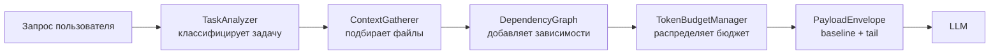

# Context Manager — управление контекстом агента

Context Manager — подсистема сервера CodeLab, которая решает, **что именно увидит
LLM** на каждом шаге работы агента: какие файлы проекта подобрать, как уместить их
в контекстное окно модели и как не дать длинной сессии «переполнить» контекст.

Это руководство для конечного пользователя: как включить Context Manager, как его
настроить под свою модель и проект, как наблюдать за его работой и что делать, когда
что-то идёт не так.

> Для разработчиков: архитектура и внутренние контракты описаны в
> [`doc/internals/context-manager/`](../../../internals/context-manager/INDEX.md).

---

## Зачем это нужно

Без Context Manager сервер использует legacy-режим: он складывает историю диалога и
сжимает её, когда та не помещается в окно модели. Он **не** подбирает файлы проекта
сам — агент вынужден читать их инструментами по одному.

С включённым Context Manager сервер:

- **сам находит релевантные файлы** под текущую задачу (по ключевым словам, структуре
  проекта и графу импортов) и кладёт их в контекст заранее;
- **точно считает токены** и распределяет бюджет окна между системным промптом,
  историей, результатами инструментов и буфером ответа;
- **сжимает контекст в три фазы** (удаление старого → скелетирование кода →
  LLM-суммаризация), когда сессия становится длинной;
- **кэширует прочитанные файлы**, чтобы повторные чтения были мгновенными;
- **деградирует мягко**: любой сбой (недоступен LLM, не распознан язык файла)
  приводит к запасному пути, а не к падению агента.

Итог для пользователя: агент быстрее выходит на нужные файлы, реже «забывает»
контекст в длинных сессиях и устойчивее работает на моделях с небольшим окном.

---

## Быстрый старт

По умолчанию Context Manager **выключен**. Включите его в конфигурации проекта или
глобально:

```toml
# ~/.codelab/codelab.toml  (глобально)  или  ./codelab.toml (для проекта)
[agents.context]
enabled = true
```

Или через переменную окружения (удобно для разовой проверки):

```bash
CODELAB_CONTEXT_ENABLED=true codelab
```

После запуска проверьте состояние прямо в чате клиента:

```
/context
```

Команда покажет, включён ли менеджер, сколько сборок контекста было и сколько токенов
уходит на baseline и tail. Всё — базовая настройка готова, остальное можно
подстраивать по мере необходимости.

---

## Как это работает (кратко)

Каждый ход агента Context Manager строит **PayloadEnvelope** — контекст, разбитый на
две части:

- **baseline** — стабильная часть: системные правила, каталог скиллов, собранные
  файлы проекта. Она кэшируется и меняется только когда меняются её источники;
- **tail** — изменяющаяся часть: последние сообщения диалога и результаты инструментов.



Когда контекст перестаёт помещаться в окно, включается трёхфазное сжатие:

1. **Prune** — удаляет самые старые результаты инструментов (по приоритету:
   `tool` → `assistant` → `user` → `system`);
2. **Skeletonize** — сжимает код до сигнатур функций/классов для файлов, которые агент
   только читает (не редактирует);
3. **Summarize** — просит LLM суммировать историю, сохранив ключевые решения.

Если LLM недоступен, третья фаза пропускается, а сжатие ограничивается Prune +
Skeletonize (мягкая деградация).

---

## Конфигурация

Все параметры задаются в секции `[agents.context]` (и вложенной
`[agents.context.budget]`). Ниже — полный перечень с фактическими значениями по
умолчанию.

### Основные параметры — `[agents.context]`

| Параметр | Тип | По умолчанию | Назначение |
|----------|-----|--------------|------------|
| `enabled` | bool | `false` | Мастер-переключатель. При `false` используется legacy-режим |
| `gather_enabled` | bool | `true` | Автоматический сбор релевантных файлов |
| `analyzer_model` | str | `openai/gpt-4o-mini` | Модель для классификации задачи в `TaskAnalyzer` |
| `recursive_dependencies` | bool | `false` | Рекурсивно разрешать импорты (глубже 1 уровня) |
| `use_tree_sitter` | bool | `false` | Парсить импорты через tree-sitter вместо regex |
| `use_tiktoken` | bool | `true` | Точный подсчёт токенов через tiktoken (иначе — приблизительный) |
| `storage_enabled` | bool | `true` | Включить слой хранения (кэш + скелетирование) |
| `file_cache` | bool | `true` | Кэшировать содержимое прочитанных файлов |
| `skeletonize` | bool | `true` | Сжимать код до сигнатур при переполнении |
| `cache_max_files` | int | `1000` | Максимум файлов в кэше (LRU-вытеснение) |
| `incremental` | bool | `false` | Инкрементальная модель (эпохи) для длинных сессий |
| `federation` | bool | `false` | Обмен контекстом между агентами (экспериментально) |

### Бюджет токенов — `[agents.context.budget]`

| Параметр | Тип | По умолчанию | Назначение |
|----------|-----|--------------|------------|
| `max_context_tokens` | int | `128000` | Верхняя граница контекстного окна |
| `reserved_tokens` | int | `4096` | Резерв под ответ модели |
| `system_share` | float | `0.20` | Доля бюджета под системный промпт |
| `history_share` | float | `0.50` | Доля под историю диалога |
| `tool_output_share` | float | `0.20` | Доля под результаты инструментов |
| `response_buffer_share` | float | `0.10` | Буфер под ответ LLM |

> Доли (`*_share`) описывают распределение доступного бюджета по категориям; держите
> их сумму в пределах `1.0`.

Параметры бюджета можно писать и плоско — прямо в `[agents.context]`. При конфликте
**плоское значение имеет приоритет** над вложенным в `[agents.context.budget]`.

### Полный пример

```toml
# ~/.codelab/codelab.toml
[agents.context]
enabled = true
gather_enabled = true
recursive_dependencies = false
use_tree_sitter = false
use_tiktoken = true
file_cache = true
skeletonize = true
cache_max_files = 1000
incremental = false

[agents.context.budget]
max_context_tokens = 128000
reserved_tokens = 4096
system_share = 0.20
history_share = 0.50
tool_output_share = 0.20
response_buffer_share = 0.10
```

### Переменные окружения

Любой параметр можно переопределить переменной вида
`CODELAB_CONTEXT_<ИМЯ_ПАРАМЕТРА>` (имя — в верхнем регистре). Env-значения имеют
приоритет над TOML.

```bash
CODELAB_CONTEXT_ENABLED=true
CODELAB_CONTEXT_GATHER_ENABLED=true
CODELAB_CONTEXT_MAX_CONTEXT_TOKENS=200000
CODELAB_CONTEXT_SKELETONIZE=true
CODELAB_CONTEXT_ANALYZER_MODEL=openai/gpt-4o-mini
CODELAB_CONTEXT_SYSTEM_SHARE=0.15
```

Булевы значения распознаются как истинные при `true`, `1` или `yes`
(регистр не важен).

### Приоритет источников

От высшего к низшему:

1. **Runtime-переключатель** сессии — `/context on` / `/context off` (влияет только на `enabled`);
2. **Переменные окружения** — `CODELAB_CONTEXT_*`;
3. **TOML** — `[agents.context.*]`;
4. **Значения по умолчанию** из таблиц выше.

### Устаревший флаг

`agents.context.enable_fcm` объявлен устаревшим и работает как алиас для `enabled`
(с предупреждением в логах). Используйте `enabled`.

---

## Наблюдение и управление: команда `/context`

Команда `/context` доступна прямо в чате клиента и не требует перезапуска сервера.

| Команда | Что показывает / делает |
|---------|-------------------------|
| `/context` | Сводка: статус, число сборок, среднее время, токены baseline/tail |
| `/context config` | Полная действующая конфигурация с бюджетом в токенах |
| `/context last` | Детали последней сборки: тайминги стадий, тип задачи, файлы, токены |
| `/context files` | Список файлов из последней сборки с токенами на файл |
| `/context graph` | Статистика графа зависимостей (файлы, импорты, зависимые) |
| `/context profile` | Профиль последней задачи из `TaskAnalyzer` |
| `/context spans` | Последние трассировочные span'ы (`context.build`, `context.gather`) |
| `/context on` | Включить Context Manager для текущей сессии |
| `/context off` | Выключить Context Manager для текущей сессии (вернуться к legacy) |

Типовой рабочий цикл диагностики:

1. `/context` — быстрый взгляд на статус и среднее время сборки;
2. `/context last` или `/context spans` — если сборка кажется медленной;
3. `/context files` — проверить, те ли файлы подобраны;
4. подстроить конфигурацию и, при необходимости, `/context off` → сравнить с legacy.

---

## Рецепты настройки

### Модель с большим окном (например, 200K)

```toml
[agents.context.budget]
max_context_tokens = 200000
```

Больше окно — больше файлов помещается в baseline без сжатия.

### Модель с маленьким окном / экономия токенов

```toml
[agents.context]
enabled = true
skeletonize = true          # агрессивно сжимать код до сигнатур
[agents.context.budget]
max_context_tokens = 32000
reserved_tokens = 2048
```

### Большой репозиторий: сборка стала медленной

Если `/context spans` показывает много кандидатов при малом числе выбранных файлов
(`candidates >> selected`), уменьшите охват графа зависимостей:

```toml
[agents.context]
recursive_dependencies = false   # не уходить вглубь по импортам
```

### Проект на языке без tree-sitter парсера импортов

Оставьте `use_tree_sitter = false` — regex-парсер импортов покрывает большинство
случаев и не требует грамматики языка.

### Локальная LLM без доступа к OpenAI-классификатору

Укажите доступную вам модель для анализа задач:

```toml
[agents.context]
analyzer_model = "ollama/gemma4:e2b"
```

При недоступности классификатора менеджер всё равно продолжит работу с
профилем задачи по умолчанию (мягкая деградация).

---

## Обратная совместимость

При `enabled = false` (значение по умолчанию) сервер работает в legacy-режиме:

- двухфазное сжатие истории (Prune + LLM-суммаризация);
- **нет** автоматического сбора файлов, кэша и скелетирования;
- публичный API и поведение прежние — переключение безопасно и обратимо.

Переключаться между режимами можно на лету через `/context on` / `/context off`
без перезапуска.

---

## Troubleshooting

### `/context` показывает `enabled=false`, хотя в TOML стоит `true`

- Проверьте, не задан ли `/context off` в этой сессии (runtime-переключатель имеет
  наивысший приоритет) — выполните `/context on`.
- Проверьте переменную окружения `CODELAB_CONTEXT_ENABLED` — она перекрывает TOML.
- Убедитесь, что правится нужный файл конфигурации (см. приоритет файлов в
  [TOML конфигурация](./toml-configuration.md)).

### Контекст не помещается в окно

Симптом в логах:

```
context.ensure_fits.exceeded current=150000 available=124000
```

Что сделать:

1. Увеличьте `max_context_tokens`, если модель поддерживает большее окно;
2. Уменьшите `reserved_tokens`;
3. Убедитесь, что `skeletonize = true`;
4. Проверьте `/context last` — какая стадия сжатия не сработала.

### Сборка контекста медленная

1. `/context` → посмотрите среднее время сборки;
2. `/context spans` → если `candidates` намного больше `selected`, отключите
   `recursive_dependencies`;
3. При очень больших проектах уменьшите `cache_max_files`, если растёт потребление
   памяти.

### Агент подбирает не те файлы

1. `/context files` — посмотрите, что реально попало в контекст;
2. `/context profile` — проверьте, верно ли классифицирована задача;
3. сформулируйте запрос конкретнее (упомяните имена модулей/функций) — это улучшает
   подбор ключевых слов.

### Скелетирование «не срабатывает»

Симптом в логах: `skeleton_not_beneficial`. Причины:

- файл на неподдерживаемом языке (skeletonizer поддерживает Python, TypeScript, Dart,
  Go, Rust, Java, C++);
- файл слишком мал, чтобы сжатие дало выигрыш;
- `skeletonize = false` в конфигурации.

---

## Связанные документы

- [TOML конфигурация](./toml-configuration.md) — общая система конфигурации сервера
- [Настройка сервера](./server-setup.md)
- [Провайдеры LLM](../llm/llm-providers.md)
- [Архитектура Context Manager](../../../internals/context-manager/INDEX.md) — для разработчиков
