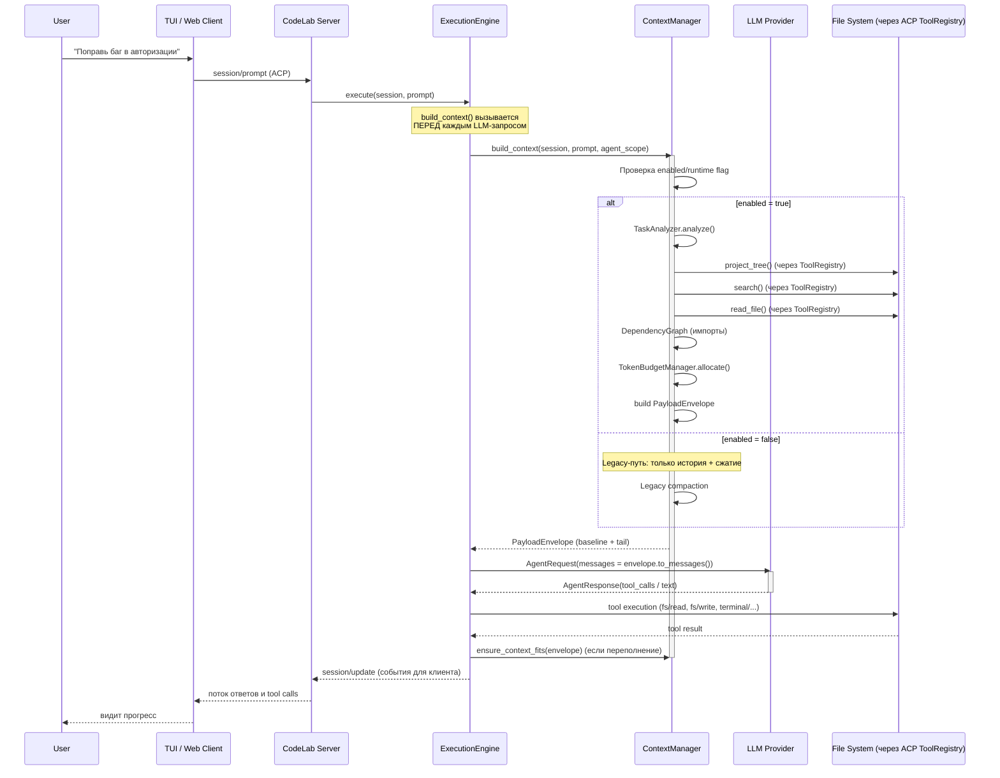
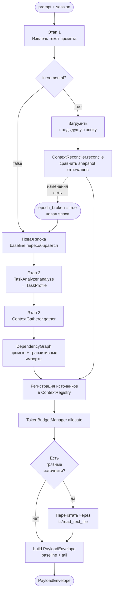
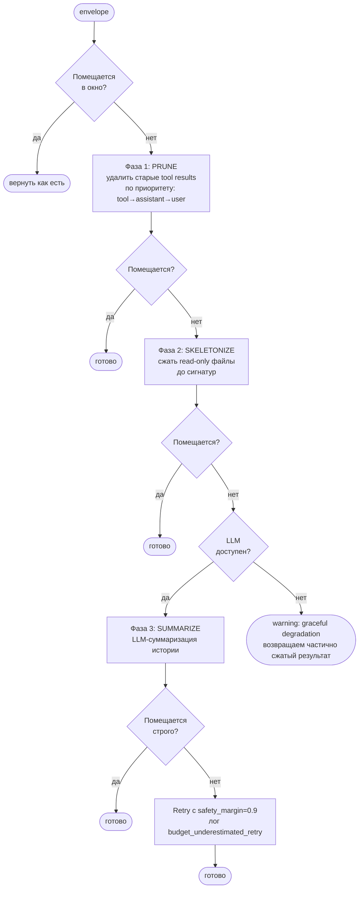

# Context Manager — управление контекстом агента

Context Manager — подсистема сервера CodeLab, которая решает, **что именно увидит
LLM** на каждом шаге работы агента: какие файлы проекта подобрать, как уместить их
в контекстное окно модели и как не дать длинной сессии «переполнить» контекст.

Это руководство для конечного пользователя: как включить Context Manager, как его
настроить под свою модель и проект, как наблюдать за его работой и что делать, когда
что-то идёт не так.

> Для разработчиков: архитектура и внутренние контракты описаны в
> [`doc/internals/context-manager/`](../../../internals/context-manager/INDEX.md).

---

## Зачем это нужно

Без Context Manager сервер использует legacy-режим: он складывает историю диалога и
сжимает её, когда та не помещается в окно модели. Он **не** подбирает файлы проекта
сам — агент вынужден читать их инструментами по одному.

С включённым Context Manager сервер:

- **сам находит релевантные файлы** под текущую задачу (по ключевым словам, структуре
  проекта и графу импортов) и кладёт их в контекст заранее;
- **точно считает токены** и распределяет бюджет окна между системным промптом,
  историей, результатами инструментов и буфером ответа;
- **сжимает контекст в три фазы** (удаление старого → скелетирование кода →
  LLM-суммаризация), когда сессия становится длинной;
- **кэширует прочитанные файлы**, чтобы повторные чтения были мгновенными;
- **деградирует мягко**: любой сбой (недоступен LLM, не распознан язык файла)
  приводит к запасному пути, а не к падению агента.

Итог для пользователя: агент быстрее выходит на нужные файлы, реже «забывает»
контекст в длинных сессиях и устойчивее работает на моделях с небольшим окном.

---

## Быстрый старт

По умолчанию Context Manager **выключен**. Включите его в конфигурации проекта или
глобально:

```toml
# ~/.codelab/codelab.toml  (глобально)  или  ./codelab.toml (для проекта)
[agents.context]
enabled = true
```

Или через переменную окружения (удобно для разовой проверки):

```bash
CODELAB_CONTEXT_ENABLED=true codelab
```

После запуска проверьте состояние прямо в чате клиента:

```
/context
```

Команда покажет, включён ли менеджер, сколько сборок контекста было и сколько токенов
уходит на baseline и tail. Всё — базовая настройка готова, остальное можно
подстраивать по мере необходимости.

---

## Как это работает — полный алгоритм

### Общая схема: где включается Context Manager

Context Manager — это **отдельная подсистема сервера**, которая активируется
внутри стратегии выполнения (LLM-call) при вызове `ExecutionEngine.build_context()`.
Решение «использовать новый Context Manager или legacy-режим» принимается по
флагам `agents.context.enabled` и runtime-команде `/context on|off`.



> **Ключевой момент:** `build_context()` вызывается **перед каждым LLM-запросом**
> внутри стратегии (Single/Orchestrated/…), а не один раз за сессию. На длинной
> сессии Context Manager отрабатывает десятки и сотни раз, переиспользуя
> кэш и эпохи для ускорения.

### Алгоритм `build_context()` по шагам



#### Этап 1: Извлечение текста промпта

```python
prompt_text = _extract_prompt_text(prompt)
```

Промпт приходит от клиента как список блоков (ACP-формат: `text`, `image`,
`resource` и т.д.). Для анализа нужен только текст.

**Когда включается:** всегда, при любом запросе.

#### Этап 2: TaskAnalyzer — классификация задачи

```python
profile = await analyzer.analyze(prompt_text, session)
```

`LLMBasedTaskAnalyzer` отправляет LLM короткий запрос с structured output,
чтобы получить `TaskProfile`:
- `task_type` — `BUG_FIX` / `FEATURE` / `REFACTOR` / `ARCHITECTURE`;
- `search_terms` — ключевые слова для поиска файлов;
- `target_modules` — целевые модули/файлы (например, `src/auth.py`);
- `investigation_depth` — 1, 2 или 3 (глубина рекурсивного обхода графа);
- `needs_tests` — нужно ли сразу подбирать тесты.

**Graceful degradation:** если LLM недоступен или не поддерживает
structured output, используется fallback — эвристика на основе
ключевых слов в промпте.

**Когда включается:** при `agents.context.gather_enabled=true` (по умолчанию `true`).

#### Этап 3: ContextGatherer — подбор файлов

```python
items = await gatherer.gather(profile, session, options=options)
```

`ACPContextGatherer` выполняет пайплайн:

1. **Загрузка структуры проекта** — `project_tree()` через `ToolRegistry`
   (берётся из кэша сессии, при необходимости — bootstrap через `find . -type f`);
2. **Отбор кандидатов** — `target_modules` + `search_terms` → `search()`;
3. **Чтение файлов** — `read_file()` для каждого кандидата;
4. **Парсинг импортов** — `dependency_graph.parse_imports(content)`;
5. **Добавление зависимостей** — прямые + транзитивные (при `recursive_dependencies=true`);
6. **Чтение зависимых файлов** — `read_file()` для каждого;
7. **Отбор по бюджету** — `max_files` (по умолчанию 20).

**Граф зависимостей (Phase 5):**
- **Прямой:** `get_dependencies(file, recursive=False)` — только непосредственные импорты;
- **Транзитивный:** `get_dependencies(file, recursive=True, max_depth=investigation_depth)`;
- **Обратный:** `get_dependents(file)` — кто импортирует данный файл;
- **Языки:** Python (regex) и Dart (regex: `import '...';`, `export '...';`);
- **Защита от циклов:** visited-set.

**Когда включается:** при `gather_enabled=true`.

#### Этап 4: Регистрация источников

Каждый найденный файл оборачивается в `FileContextSource` и регистрируется
в `ContextRegistryImpl`. Также регистрируется `SkillCatalogSource`
(пока пустой — SkillRegistry отсутствует).

#### Этап 5: Формирование baseline

```python
baseline_text = await registry.render_baseline()
baseline = [LLMMessage(role="system", content=baseline_text)]
```

**В режиме гидрации (`incremental=false`):** baseline пересобирается
заново из текущего состояния реестра. Медленно, но предсказуемо.

**В инкрементальном режиме (`incremental=true`):**
1. `ContextReconciler.reconcile()` сравнивает отпечатки источников с прошлым snapshot;
2. Если ничего не изменилось — эпоха стабильна, отправляются только `tail`
   (prompt cache hit у провайдера);
3. Если изменилось — `epoch_broken=true`, baseline пересобирается;
4. **Грязные источники** (помеченные `InvalidationSignalBus` после `fs/write`)
   перечитываются через `_refresh_dirty_sources()` лениво.

**Когда включается:** всегда. Выбор режима (гидрация vs эпоха) — по `incremental` flag.

#### Этап 6: TokenBudgetManager

```python
allocation = budget_manager.allocate(max_context_tokens - reserved_tokens)
# allocation: system_tokens, history_tokens, tool_output_tokens, response_buffer_tokens
```

Делит доступный бюджет по долям (`system_share`, `history_share`, …).
`bound_content()` усекает длинные файлы, сохраняя начало и конец.

#### Этап 7: PayloadEnvelope

```python
envelope = PayloadEnvelope(
    baseline=baseline_messages,      # system + file contents
    tail=tail_messages,              # история диалога + tool results
    baseline_fingerprint=hash,       # для детекта изменений
    token_count=total_tokens,
)
```

**Результат:** единая форма payload, с которой работают все стратегии.

---

### `ensure_context_fits()` — 3-фазное сжатие

Когда `PayloadEnvelope` превышает `max_context_tokens - reserved_tokens`:



**Приоритеты eviction** (в Phase 0 зафиксированы):

| Категория | Priority | Когда удаляется |
|-----------|----------|-----------------|
| `system` | 10 | Никогда (если нет критического переполнения) |
| `user` | 8 | После tool/assistant |
| `assistant` | 6 | После tool |
| `tool` | 4 | Первыми |

**Мягкая деградация:** если фаза 3 невозможна (LLM недоступен), горячий
путь возвращает частично сжатый результат. После сжатия делается
пост-проверка; при недооценке ApproximateTokenCounter — повтор со
строгим лимитом (`budget_underestimated_retry`).

---

### Пример сессии: исправление бага

**Конфигурация:** `~/.codelab/codelab.toml`
```toml
[agents.context]
enabled = true
gather_enabled = true
incremental = true
recursive_dependencies = true
[agents.context.budget]
max_context_tokens = 128000
```

**Сессия 1: «Найди баг в авторизации пользователя»**

```
[Пользователь] Найди баг в авторизации пользователя
```

**Шаг 1 — `ExecutionEngine.execute()` → `build_context()`**

Логи:
```
context.build.start  agent_scope=single  gather_enabled=True  incremental=True
context.task_analyze.start  prompt_length=37
context.task_analyze.complete  task_type=bug_fix  investigation_depth=2  search_terms=5
context.gather.start  search_terms=['auth', 'login', 'user', 'session', 'token']
context.gather.target_module.fallback  normalized=src/auth.py
context.gather.content_search.match  file_path=src/auth.py
context.gather.file.imports_parsed  path=src/auth.py  imports=['src.user', 'src.utils', ...]
context.gather.dependents.resolved  dependents_count=15  recursive_mode=True  max_depth=2
context.gather.complete  files_gathered=18  total_tokens=24500
context.build.gather.complete  files_gathered=18  elapsed_ms=420
context.build.incremental.new_epoch  baseline_fingerprint=a1b2c3d4
context.build.complete  baseline_messages=1  tail_messages=2  token_count=25100
context.ensure_fits.ok  available=111513  margin=86413
```

**Что увидит LLM в первом ходе:**
- `system` — собранные файлы (`<file path="src/auth.py">...</file>`);
- `user` — «Найди баг в авторизации пользователя»;
- `assistant` — (пустой, LLM ещё не ответил).

**Шаг 2 — LLM отвечает: «Прочитай `src/auth.py:42-50`»**

Стратегия выполняет `fs/read_text_file`, файл кэшируется через
`FileCacheDecorator` (сигнал `InvalidationSignalBus` отсутствует —
чтение не публикует invalidation).

**Шаг 3 — `build_context()` для следующего хода**

```
context.build.start  incremental=True
context.gather.file.imports_parsed  path=src/auth.py  imports=[...]
context.gather.dependents.resolved  dependents_count=15  recursive_mode=True
context.build.complete  baseline_messages=1  tail_messages=4  reconcile_state=unchanged
```

**Что важно:** `reconcile_state=unchanged` — `baseline_fingerprint`
совпадает с прошлым ходом → prompt cache hit у провайдера (если поддерживается).

---

**Сессия 2 (на той же сессии): «Агент записывает фикс в `src/auth.py`»**

Стратегия выполняет `fs/write_text_file`:
```
context.multiagent → нет, это SingleStrategy
file_cache.invalidate  path=src/auth.py
InvalidationSignalBus  emit path=src/auth.py
DefaultContextManager._dispatch_file_invalidated  → ctx.dirty_paths.add("src/auth.py")
```

**Следующий `build_context()`** (перед очередным LLM-вызовом):
```
context.build.start  incremental=True
_refresh_dirty_sources  path=src/auth.py  (вызывается до reconcile)
context.build.complete  reconcile_state=updated  epoch_broken=True
```

**Что произошло:**
1. `FileCacheDecorator` поймал `fs/write` → `cache.invalidate("src/auth.py")`;
2. `InvalidationSignalBus` получил сигнал → `dirty_paths.add(...)`;
3. На границе хода `_refresh_dirty_sources()` перечитал файл
   через `fs/read_text_file` (с обновлённым содержимым);
4. `ContextReconciler` сравнил отпечатки — изменился `src/auth.py` →
   `epoch_broken=True`, baseline пересобран с **новым** содержимым.

**Двойная защита:** даже если сигнал потеряется, `ContextSnapshot.diff()`
обнаружит изменение по Codec-fingerprint на следующем reconcile.

---

**Сессия 3 (длинная): контекст переполняется**

После 30+ ходов:
```
context.ensure_fits.exceeded  current=145000  available=124000  exceeded_by=21000
context.compact.phase_prune  tokens_before=145000  tokens_after=128000
context.compact.phase_skeletonize  tokens_before=128000  tokens_after=115000
context.compact.phase_summarize  tokens_before=115000  tokens_after=98000
context.ensure_fits.compacted  tokens_before=145000  tokens_after=98000
```

**Что делает LLM в этом случае:**
- Видит тот же baseline (стабильная часть), но с сокращённым `tail`
  (история сжата через 3 фазы);
- `Phase 2: SKELETONIZE` — большие read-only файлы заменены на сигнатуры;
- `Phase 3: SUMMARIZE` — старые сообщения диалога суммаризированы LLM-ом.

---

### Зачем нужен инкрементальный режим (`incremental=true`)

**Проблема, которую решает:** Без инкрементального режима каждый ход агента
пересобирает **весь baseline** (системный промпт + все собранные файлы) и
отправляет его LLM. На длинной сессии это приводит к:

1. **Квадратичному росту токенов** — `N ходов × одинаковый baseline = N × M токенов`;
2. **Промахам prompt cache** — провайдер не может закэшировать префикс,
   потому что он пересобирается каждый ход (новые timestamp, новая длина, новый fingerprint);
3. **Росту latency** — каждый ход = полная сборка + полная отправка baseline;
4. **Росту стоимости** — `input_tokens × N ходов` при стабильном содержимом.

**Решение (Phase 4):** Зафиксировать `baseline` в **эпохе** (`ContextEpoch`)
и пересобирать его только при реальных изменениях. На границе хода
`ContextReconciler` сравнивает **Codec-отпечатки** источников и выбирает
одну из стратегий:

| Состояние | Когда | Что отправляется | Стоимость |
|-----------|-------|-------------------|-----------|
| `UNCHANGED` | Ничего не изменилось с прошлого хода | Только `tail` (новые сообщения) | `delta_tokens` |
| `UPDATED` | Изменились только `tool`/`user` сообщения | Стабильный `baseline` + обновлённый `tail` | `baseline_tokens + delta_tokens` |
| `epoch_broken=True` | Изменился файл из baseline (`fs/write`) | Полная пересборка baseline, новая эпоха | `full_tokens` |

**Что даёт:**

- **Линейный рост вместо квадратичного** — стоимость `baseline_tokens + N × delta_tokens`
  вместо `N × (baseline_tokens + delta_tokens)`;
- **Prompt cache hit** — стабильный `baseline_fingerprint` → провайдер кэширует
  префикс (Anthropic prompt caching, OpenAI cached input, локальный KV-cache);
- **Измеримая экономия** — метрика `context_prompt_cache_hit_rate` (рост с `0%` до `80%+`
  на длинных сессиях);
- **Сохранение обратной совместимости** — `incremental=false` (default) даёт
  бит-в-бит поведение Phase 1-3; переключение безопасное.

**Когда включается:**

- **При первом ходе сессии** — `new_epoch`, baseline рендерится и фиксируется;
- **На каждом следующем ходе** — `ContextReconciler.reconcile()` сравнивает
  Codec-отпечатки;
- **При `fs/write` файла из baseline** — `FileCacheDecorator` перехватывает
  запись → `InvalidationSignalBus` публикует сигнал → `ctx.dirty_paths` помечает
  файл грязным → `_refresh_dirty_sources()` лениво перечитывает файл через
  `fs/read_text_file` (с обновлённым содержимым) → `epoch_broken=True`,
  baseline пересобран.
- **Двойная защита:** даже если сигнал `InvalidationSignalBus` потеряется,
  `ContextSnapshot.diff()` найдёт изменение на следующем `reconcile()` по
  Codec-fingerprint (хеш содержимого, не timestamp).

**Пример расчёта экономии** (сессия из 30 ходов, `src/auth.py` изменён 1 раз):

| Режим | Стоимость |
|-------|-----------|
| **Гидрация** (`incremental=false`) | `30 × 25000 (baseline) + 30 × 1000 (tail) = 780000` токенов |
| **Инкрементальный** (`incremental=true`) | `1 × 25000 + 29 × 1000 (unchanged) + 1 × 25000 (epoch_broken) = 54000` токенов |
| **Экономия** | **~14×** меньше токенов + prompt cache hit на 29 неизменных ходах |

**Включение в конфигурации:**

```toml
[agents.context]
incremental = true   # включить инкрементальный режим
```

**Текущий статус в CodeLab:** Phase 4 реализован полностью. Состояние
`DEFERRED` явно отклонено через ADR-002 (mid-turn reconcile не запланирован,
eventual consistency на границах ходов достаточна для корректности).

---

### Slash-команда `/context` — наблюдаемость

В клиенте доступна полная диагностика работы Context Manager:

| Команда | Что показывает |
|---------|----------------|
| `/context` | Сводка: статус, число сборок, среднее время, токены baseline/tail |
| `/context config` | Полная действующая конфигурация с бюджетом в токенах |
| `/context last` | Детали последней сборки: тайминги стадий, тип задачи, файлы, токены |
| `/context files` | Список файлов из последней сборки с токенами на файл |
| `/context graph` | Статистика графа зависимостей (файлы, импорты, зависимые) |
| `/context profile` | Профиль последней задачи из `TaskAnalyzer` |
| `/context spans` | Последние трассировочные span'ы (`context.build`, `context.gather`) |
| `/context on` | Включить Context Manager для текущей сессии |
| `/context off` | Выключить Context Manager для текущей сессии (вернуться к legacy) |

---

## Конфигурация

Все параметры задаются в секции `[agents.context]` (и вложенной
`[agents.context.budget]`). Ниже — полный перечень с фактическими значениями по
умолчанию.

### Основные параметры — `[agents.context]`

| Параметр | Тип | По умолчанию | Назначение |
|----------|-----|--------------|------------|
| `enabled` | bool | `false` | Мастер-переключатель. При `false` используется legacy-режим |
| `gather_enabled` | bool | `true` | Автоматический сбор релевантных файлов |
| `analyzer_model` | str | `openai/gpt-4o-mini` | Модель для классификации задачи в `TaskAnalyzer` |
| `recursive_dependencies` | bool | `false` | Рекурсивно разрешать импорты (глубже 1 уровня) |
| `use_tree_sitter` | bool | `false` | Парсить импорты через tree-sitter вместо regex |
| `use_tiktoken` | bool | `true` | Точный подсчёт токенов через tiktoken (иначе — приблизительный) |
| `storage_enabled` | bool | `true` | Включить слой хранения (кэш + скелетирование) |
| `file_cache` | bool | `true` | Кэшировать содержимое прочитанных файлов |
| `skeletonize` | bool | `true` | Сжимать код до сигнатур при переполнении |
| `cache_max_files` | int | `1000` | Максимум файлов в кэше (LRU-вытеснение) |
| `incremental` | bool | `false` | Инкрементальная модель (эпохи) для длинных сессий |
| `federation` | bool | `false` | Обмен контекстом между агентами (экспериментально) |

### Бюджет токенов — `[agents.context.budget]`

| Параметр | Тип | По умолчанию | Назначение |
|----------|-----|--------------|------------|
| `max_context_tokens` | int | `128000` | Верхняя граница контекстного окна |
| `reserved_tokens` | int | `4096` | Резерв под ответ модели |
| `system_share` | float | `0.20` | Доля бюджета под системный промпт |
| `history_share` | float | `0.50` | Доля под историю диалога |
| `tool_output_share` | float | `0.20` | Доля под результаты инструментов |
| `response_buffer_share` | float | `0.10` | Буфер под ответ LLM |

> Доли (`*_share`) описывают распределение доступного бюджета по категориям; держите
> их сумму в пределах `1.0`.

Параметры бюджета можно писать и плоско — прямо в `[agents.context]`. При конфликте
**плоское значение имеет приоритет** над вложенным в `[agents.context.budget]`.

### Полный пример

```toml
# ~/.codelab/codelab.toml
[agents.context]
enabled = true
gather_enabled = true
recursive_dependencies = false
use_tree_sitter = false
use_tiktoken = true
file_cache = true
skeletonize = true
cache_max_files = 1000
incremental = false

[agents.context.budget]
max_context_tokens = 128000
reserved_tokens = 4096
system_share = 0.20
history_share = 0.50
tool_output_share = 0.20
response_buffer_share = 0.10
```

### Переменные окружения

Любой параметр можно переопределить переменной вида
`CODELAB_CONTEXT_<ИМЯ_ПАРАМЕТРА>` (имя — в верхнем регистре). Env-значения имеют
приоритет над TOML.

```bash
CODELAB_CONTEXT_ENABLED=true
CODELAB_CONTEXT_GATHER_ENABLED=true
CODELAB_CONTEXT_MAX_CONTEXT_TOKENS=200000
CODELAB_CONTEXT_SKELETONIZE=true
CODELAB_CONTEXT_ANALYZER_MODEL=openai/gpt-4o-mini
CODELAB_CONTEXT_SYSTEM_SHARE=0.15
```

Булевы значения распознаются как истинные при `true`, `1` или `yes`
(регистр не важен).

### Приоритет источников

От высшего к низшему:

1. **Runtime-переключатель** сессии — `/context on` / `/context off` (влияет только на `enabled`);
2. **Переменные окружения** — `CODELAB_CONTEXT_*`;
3. **TOML** — `[agents.context.*]`;
4. **Значения по умолчанию** из таблиц выше.

### Устаревший флаг

`agents.context.enable_fcm` объявлен устаревшим и работает как алиас для `enabled`
(с предупреждением в логах). Используйте `enabled`.

---

## Наблюдение и управление: команда `/context`

Команда `/context` доступна прямо в чате клиента и не требует перезапуска сервера.

| Команда | Что показывает / делает |
|---------|-------------------------|
| `/context` | Сводка: статус, число сборок, среднее время, токены baseline/tail |
| `/context config` | Полная действующая конфигурация с бюджетом в токенах |
| `/context last` | Детали последней сборки: тайминги стадий, тип задачи, файлы, токены |
| `/context files` | Список файлов из последней сборки с токенами на файл |
| `/context graph` | Статистика графа зависимостей (файлы, импорты, зависимые) |
| `/context profile` | Профиль последней задачи из `TaskAnalyzer` |
| `/context spans` | Последние трассировочные span'ы (`context.build`, `context.gather`) |
| `/context on` | Включить Context Manager для текущей сессии |
| `/context off` | Выключить Context Manager для текущей сессии (вернуться к legacy) |

Типовой рабочий цикл диагностики:

1. `/context` — быстрый взгляд на статус и среднее время сборки;
2. `/context last` или `/context spans` — если сборка кажется медленной;
3. `/context files` — проверить, те ли файлы подобраны;
4. подстроить конфигурацию и, при необходимости, `/context off` → сравнить с legacy.

---

## Рецепты настройки

### Модель с большим окном (например, 200K)

```toml
[agents.context.budget]
max_context_tokens = 200000
```

Больше окно — больше файлов помещается в baseline без сжатия.

### Модель с маленьким окном / экономия токенов

```toml
[agents.context]
enabled = true
skeletonize = true          # агрессивно сжимать код до сигнатур
[agents.context.budget]
max_context_tokens = 32000
reserved_tokens = 2048
```

### Большой репозиторий: сборка стала медленной

Если `/context spans` показывает много кандидатов при малом числе выбранных файлов
(`candidates >> selected`), уменьшите охват графа зависимостей:

```toml
[agents.context]
recursive_dependencies = false   # не уходить вглубь по импортам
```

### Проект на языке без tree-sitter парсера импортов

Оставьте `use_tree_sitter = false` — regex-парсер импортов покрывает большинство
случаев и не требует грамматики языка.

### Локальная LLM без доступа к OpenAI-классификатору

Укажите доступную вам модель для анализа задач:

```toml
[agents.context]
analyzer_model = "ollama/gemma4:e2b"
```

При недоступности классификатора менеджер всё равно продолжит работу с
профилем задачи по умолчанию (мягкая деградация).

---

## Обратная совместимость

При `enabled = false` (значение по умолчанию) сервер работает в legacy-режиме:

- двухфазное сжатие истории (Prune + LLM-суммаризация);
- **нет** автоматического сбора файлов, кэша и скелетирования;
- публичный API и поведение прежние — переключение безопасно и обратимо.

Переключаться между режимами можно на лету через `/context on` / `/context off`
без перезапуска.

---

## Troubleshooting

### `/context` показывает `enabled=false`, хотя в TOML стоит `true`

- Проверьте, не задан ли `/context off` в этой сессии (runtime-переключатель имеет
  наивысший приоритет) — выполните `/context on`.
- Проверьте переменную окружения `CODELAB_CONTEXT_ENABLED` — она перекрывает TOML.
- Убедитесь, что правится нужный файл конфигурации (см. приоритет файлов в
  [TOML конфигурация](./toml-configuration.md)).

### Контекст не помещается в окно

Симптом в логах:

```
context.ensure_fits.exceeded current=150000 available=124000
```

Что сделать:

1. Увеличьте `max_context_tokens`, если модель поддерживает большее окно;
2. Уменьшите `reserved_tokens`;
3. Убедитесь, что `skeletonize = true`;
4. Проверьте `/context last` — какая стадия сжатия не сработала.

### Сборка контекста медленная

1. `/context` → посмотрите среднее время сборки;
2. `/context spans` → если `candidates` намного больше `selected`, отключите
   `recursive_dependencies`;
3. При очень больших проектах уменьшите `cache_max_files`, если растёт потребление
   памяти.

### Агент подбирает не те файлы

1. `/context files` — посмотрите, что реально попало в контекст;
2. `/context profile` — проверьте, верно ли классифицирована задача;
3. сформулируйте запрос конкретнее (упомяните имена модулей/функций) — это улучшает
   подбор ключевых слов.

### Скелетирование «не срабатывает»

Симптом в логах: `skeleton_not_beneficial`. Причины:

- файл на неподдерживаемом языке (skeletonizer поддерживает Python, TypeScript, Dart,
  Go, Rust, Java, C++);
- файл слишком мал, чтобы сжатие дало выигрыш;
- `skeletonize = false` в конфигурации.

---

## Связанные документы

- [TOML конфигурация](./toml-configuration.md) — общая система конфигурации сервера
- [Настройка сервера](./server-setup.md)
- [Провайдеры LLM](../llm/llm-providers.md)
- [Архитектура Context Manager](../../../internals/context-manager/INDEX.md) — для разработчиков
