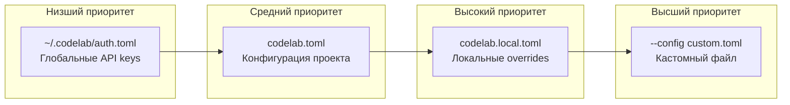

# TOML конфигурация CodeLab

CodeLab поддерживает конфигурацию через TOML-файлы как основной формат настройки. TOML обеспечивает читаемую структуру с поддержкой вложенных конфигураций, комментариев и иерархии приоритетов.

## Обзор

### Файлы конфигурации

| Файл | Назначение | Приоритет | Коммитится в git |
|------|------------|-----------|------------------|
| `~/.codelab/auth.toml` | Глобальные API keys | Низший | Нет |
| `codelab.toml` | Конфигурация проекта | Средний | Да |
| `codelab.local.toml` | Локальные overrides проекта | Высокий | Нет |
| Custom path (`--config`) | Кастомный файл | Высший | Зависит от пути |

### Иерархия приоритетов

Конфигурация собирается из всех доступных источников. Значения из источников с более высоким приоритетом переопределяют значения из источников с низким приоритетом.



> **Примечание:** Переменные окружения (`.env`) и CLI аргументы имеют наивысший приоритет и переопределяют все TOML значения.

## Структура codelab.toml

### Базовая конфигурация

```toml
# codelab.toml

[llm]
# Активный провайдер: openai, anthropic, openrouter, zen, go, ollama, lmstudio, mock
provider = "openai"

# Модель в формате "provider/model"
model = "openai/gpt-4o"

# Параметры генерации
temperature = 0.7
max_tokens = 8192
```

### Конфигурация провайдеров

Каждый провайдер настраивается в отдельной секции `[llm.providers.<id>]`:

```toml
[llm.providers.openai]
api_key = "${OPENAI_API_KEY}"  # Переменная окружения
base_url = "https://api.openai.com/v1"
default_model = "gpt-4o"

[llm.providers.anthropic]
api_key = "${ANTHROPIC_API_KEY}"
base_url = "https://api.anthropic.com"
default_model = "claude-sonnet-4"

[llm.providers.openrouter]
api_key = "${OPENROUTER_API_KEY}"
base_url = "https://openrouter.ai/api/v1"
default_model = "mistral-large"
```

### Per-model конфигурация

Модели определяются как вложенные TOML-таблицы:

```toml
[llm.providers.openai.models]

[llm.providers.openai.models.gpt-4o]
context_window = 128000
max_output_tokens = 16384
cost_per_input_token = 0.0000025
cost_per_output_token = 0.00001

[llm.providers.openai.models.o3]
context_window = 200000
max_output_tokens = 100000
cost_per_input_token = 0.00001
cost_per_output_token = 0.00004
```

### Fallback конфигурация

```toml
[llm.fallback]
# Включить fallback при ошибках провайдера
enabled = false

# Стратегия: sequential (MVP), cost, latency, smart (future)
strategy = "sequential"

# Порядок провайдеров для fallback
order = ["openai", "openrouter", "ollama"]

# Максимальное количество попыток
max_attempts = 3

# Типы ошибок для retry
retry_on = ["rate_limit", "timeout"]
```

## Полные примеры конфигураций

### Production: OpenAI с fallback

```toml
# codelab.toml — Production конфигурация

[llm]
provider = "openai"
model = "openai/gpt-4o"
temperature = 0.7
max_tokens = 8192

[llm.providers.openai]
api_key = "${OPENAI_API_KEY}"
base_url = "https://api.openai.com/v1"
default_model = "gpt-4o"

[llm.providers.openai.models.gpt-4o]
context_window = 128000
max_output_tokens = 16384

[llm.providers.openai.models.o3]
context_window = 200000
max_output_tokens = 100000

[llm.providers.openrouter]
api_key = "${OPENROUTER_API_KEY}"
base_url = "https://openrouter.ai/api/v1"
default_model = "mistral-large"

[llm.providers.ollama]
base_url = "http://localhost:11434/v1"
default_model = "llama3.1:70b"

[llm.fallback]
enabled = true
strategy = "sequential"
order = ["openai", "openrouter", "ollama"]
max_attempts = 3
retry_on = ["rate_limit", "timeout", "service_unavailable"]
```

### Development: Ollama локально

```toml
# codelab.toml — Development конфигурация

[llm]
provider = "ollama"
model = "ollama/llama3.1:70b"
temperature = 0.5
max_tokens = 4096

[llm.providers.ollama]
base_url = "http://localhost:11434/v1"
default_model = "llama3.1:70b"

[llm.providers.ollama.models.llama3.1-70b]
context_window = 128000
max_output_tokens = 8192

[llm.fallback]
enabled = false
```

### Multi-provider: Anthropic + OpenAI

```toml
# codelab.toml — Multi-provider конфигурация

[llm]
provider = "anthropic"
model = "anthropic/claude-sonnet-4"
temperature = 0.7
max_tokens = 8192

[llm.providers.anthropic]
api_key = "${ANTHROPIC_API_KEY}"
base_url = "https://api.anthropic.com"
default_model = "claude-sonnet-4"

[llm.providers.anthropic.models.claude-sonnet-4]
context_window = 200000
max_output_tokens = 64000

[llm.providers.anthropic.models.claude-opus-4]
context_window = 200000
max_output_tokens = 32000

[llm.providers.openai]
api_key = "${OPENAI_API_KEY}"
base_url = "https://api.openai.com/v1"
default_model = "gpt-4o"

[llm.providers.openai.models.gpt-4o]
context_window = 128000
max_output_tokens = 16384

[llm.fallback]
enabled = true
strategy = "sequential"
order = ["anthropic", "openai"]
max_attempts = 3
retry_on = ["rate_limit", "timeout"]
```

## Глобальная аутентификация

Файл `~/.codelab/auth.toml` хранит API keys общие для всех проектов:

```toml
# ~/.codelab/auth.toml

[llm.providers.openai]
api_key = "sk-your-openai-key"

[llm.providers.anthropic]
api_key = "sk-ant-your-anthropic-key"

[llm.providers.openrouter]
api_key = "your-openrouter-key"
```

> **Важно:** Этот файл не коммитится в git. Он используется как источник API keys по умолчанию для всех проектов CodeLab.

## Локальные overrides

Файл `codelab.local.toml` переопределяет значения из `codelab.toml`:

```toml
# codelab.local.toml — должен быть в .gitignore

[llm]
# Переопределить модель для локальной разработки
model = "ollama/llama3.1:70b"
provider = "ollama"

[llm.providers.ollama]
base_url = "http://localhost:11434/v1"
```

Добавьте в `.gitignore`:

```gitignore
# Local overrides
codelab.local.toml
```

## Переменные окружения в TOML

TOML поддерживает раскрытие переменных окружения через синтаксис `${VAR_NAME}`:

```toml
[llm.providers.openai]
api_key = "${OPENAI_API_KEY}"

[llm.providers.anthropic]
api_key = "${ANTHROPIC_API_KEY}"
```

Если переменная окружения не установлена, она заменяется на пустую строку.

### Поддерживаемые форматы

| Формат | Пример | Результат |
|--------|--------|-----------|
| `${VAR}` | `${OPENAI_API_KEY}` | Значение переменной |
| `$VAR` | `$OPENAI_API_KEY` | Значение переменной |
| Текст + переменная | `Bearer ${API_KEY}` | `Bearer sk-...` |
| Несколько переменных | `${HOST}:${PORT}` | `localhost:8080` |

## Custom путь к конфигурации

Используйте CLI аргумент `--config` для указания кастомного TOML файла:

```bash
codelab serve --config /path/to/custom-config.toml
```

Это полезно для:
- CI/CD пайплайнов
- Тестовых окружений
- Разделения конфигураций для разных сред

## TOML vs .env

| Аспект | TOML | .env |
|--------|------|------|
| Вложенные структуры | ✅ | ❌ |
| Комментарии | ✅ | ✅ |
| Типы данных | ✅ (числа, булевы, массивы) | ❌ (только строки) |
| Per-model конфигурация | ✅ | ❌ |
| Fallback конфигурация | ✅ | ⚠️ (через запятую) |
| Переменные окружения | ✅ (`${VAR}`) | ✅ |
| Приоритет | Ниже | Выше |

### Рекомендации

- **Используйте TOML** для сложной конфигурации: несколько провайдеров, per-model настройки, fallback цепочки
- **Используйте .env** для простых случаев: один провайдер, быстрая настройка
- **Комбинируйте**: API keys в `.env` или `auth.toml`, структура провайдеров в `codelab.toml`

## Шаблон конфигурации

Шаблон `codelab.toml.example` доступен в корне репозитория:

```bash
# Скопировать шаблон
cp codelab.toml.example codelab.toml

# Отредактировать под ваш проект
nano codelab.toml
```

## Troubleshooting

### TOML файл не загружается

**Симптом:** CodeLab игнорирует `codelab.toml`.

**Проверка:**
1. Файл должен называться `codelab.toml` (не `config.toml`)
2. Файл должен быть в корне проекта (где запускается `codelab serve`)
3. Проверьте синтаксис TOML:

```bash
python3 -c "import tomllib; tomllib.load(open('codelab.toml', 'rb'))"
```

### Переменные окружения не раскрываются

**Симптом:** `${VAR}` остаётся как есть.

**Проверка:**
1. Переменная должна быть установлена до запуска CodeLab
2. Проверьте синтаксис: `${VAR_NAME}` или `$VAR_NAME`
3. Убедитесь что нет пробелов: `${VAR}` ✅, `${ VAR }` ❌

### Конфигурация не применяется

**Симптом:** Значения из TOML игнорируются.

**Проверка:**
1. Приоритет: CLI > .env > codelab.local.toml > codelab.toml > auth.toml
2. Значения из `.env` переопределяют TOML
3. Используйте `--config` для явного указания файла

### Ошибка парсинга TOML

**Симптом:** `TOMLDecodeError` при запуске.

**Решение:**
1. Проверьте синтаксис TOML (кавычки, запятые, отступы)
2. Массивы должны быть в квадратных скобках: `order = ["a", "b"]`
3. Строки в двойных кавычках: `provider = "openai"`
4. Числа без кавычек: `temperature = 0.7`

## См. также

- [Настройка LLM провайдеров](../llm/llm-providers.md) — гайд по провайдерам
- [Fallback и устойчивость](../llm/fallback-resilience.md) — fallback цепочки
- [Конфигурация (справочник)](../../reference/configuration.md) — все параметры
- [Переменные окружения](../../reference/environment.md) — все CODELAB_* переменные
- [Добавление провайдера](../../developer-guide/adding-providers.md) — developer guide
