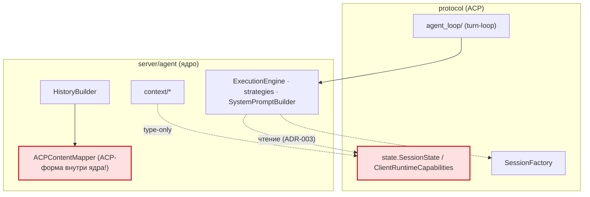
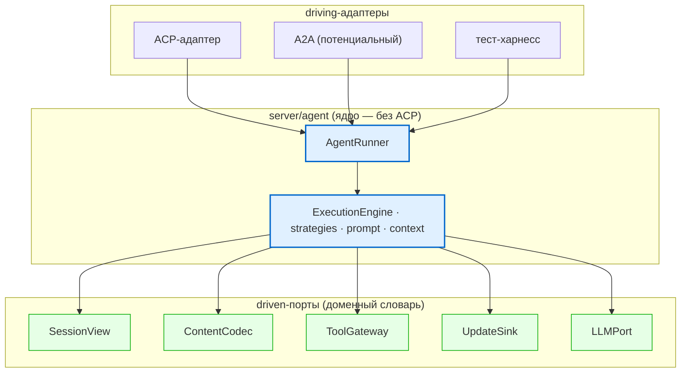

# Design: ACP-независимое ядро агента

Технический дизайн change `acp-independent-agent-core`. Основание: ADR-005 (решение),
ADR-003 (read-фаза), ADR-001 (`LLMAdapter`). Сигнатуры выведены из фактического кода.

## Принципы

1. Ядро зависит только от портов, которые само объявляет; порты — в **доменном словаре**.
   Цель `import-linter`: рёбер `agent → protocol` — **0**.
2. ACP — один driving-адаптер; turn-loop/`session/update`/permission остаются в `protocol/`.
3. Без большого взрыва: каждая фаза — отдельный PR, за портом — адаптер над существующей
   реализацией, поведение байт-в-байт. ABC из `context/interfaces.py` заморожены (не трогаем).
4. Graceful degradation горячего пути; обратная совместимость wire/форматов.

## Как сейчас (as-is)



## Как будет (to-be)



## Контракты портов (целевые сигнатуры)

### SessionView — снимает шов №1 (read-поверхность: session_id, config_values, history, cwd, runtime_capabilities)
```python
class SessionView(Protocol):
    @property
    def id(self) -> SessionId: ...
    @property
    def config(self) -> SessionConfig: ...          # cwd, config_values, runtime_capabilities: ClientCapabilities
    def messages(self) -> Sequence[ConversationMessage]: ...
```
Реализация `SessionStateView(state: SessionState)` читает **сквозь** живую `SessionState`
(не снимок — turn-loop дописывает `history` mid-turn), лениво транслируя через `SessionMapper`.

### ContentCodec — снимает шов №2 (главная работа)
```python
class ContentCodec(Protocol):
    def decode(self, blocks: Sequence[Mapping[str, Any]]) -> list[ContentPart]: ...
```
`ACPContentMapper.map_blocks` буквально удовлетворяет сигнатуре → переезжает в `protocol/`
как `ACPContentCodec`. Ядро оперирует `llm.ContentPart` как каноном контента (отдельный
content-VO не вводим без второго драйвера — иначе лишний маппер).

### ToolGateway — формализация существующего
`tools.base.ToolRegistry(ABC)` уже порт (`execute_tool`, `get_available_tools`, `to_llm_tools`).
Действие — объявить зависимость ядра как `ToolGateway`; переименование, не переписывание.

### UpdateSink — эмиссия в доменных терминах
```python
class UpdateSink(Protocol):
    async def emit_agent_message(self, session_id: SessionId, text: str) -> None: ...
    async def emit_streaming_delta(self, session_id: SessionId, text: str) -> None: ...
    async def emit_plan(self, session_id: SessionId, plan: AgentPlan) -> None: ...
    async def emit_tool_call(self, session_id: SessionId, call: ToolCall) -> None: ...
    async def emit_tool_update(self, session_id: SessionId, update: ToolCallUpdate) -> None: ...
```
Существующий `SessionUpdateSink` (строит `ACPMessage`) оборачивается: доменные аргументы
мапятся в ACP wire **внутри адаптера**. Унифицировать success/exception буферизацию (P1-4).

### LLMPort / ChildSessionFactory
`LLMAdapter` фиксируется как `LLMPort` (ADR-001). `context/child_session` → доменный
`ChildSessionFactory`, ACP-реализация в `protocol/`.

### AgentRunner (driving)
```python
class AgentRunner(Protocol):
    async def run_turn(self, session: SessionView, request: TurnRequest) -> AgentResponse: ...
    async def continue_turn(self, session: SessionView, request: ContinuationRequest) -> AgentResponse: ...
```

## Риски и решения

- **Главная цена — `ContentCodec` (Фаза 2)**, не `SessionState`. Оправдана полностью при
  расхождении content-формата между драйверами.
- **Новый маппер = точка синхронизации** (ср. схлопывание роли `tool` в `SessionMapper`) —
  чистый выигрыш при ≥2 драйверах.
- **CLAUDE.md «всё I/O через ACP `ToolRegistry`»** читать как «через `ToolGateway`-порт».
- **Оправданность Фаз 2–4** — привязать к реальному второму драйверу (A2A / hosted multi-user).

## Вне области

- Write-консолидация мутаций сессии на доменный агрегат (write-фаза ADR-003, отдельный эпик).
- Изменение ACP-спеки, transport-контрактов, форматов сериализации.
- Реализация второго драйвера (A2A) — этот change лишь делает её возможной без переписывания ядра.
