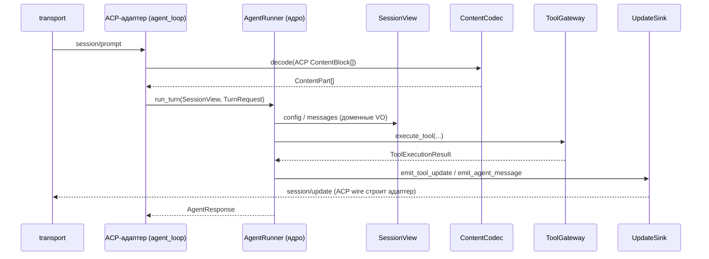

# Proposal: ACP-независимое ядро агента (hexagonal ports)

## Why

Ядро агента (`server/agent/`) типизируется против протокольной модели `protocol.state.SessionState`
и содержит ACP-специфичный `ACPContentMapper` — сериализационная/протокольная форма протекает
в бизнес-логику. Это зафиксированный долг:

- **ADR-003** — протечка `SessionState` в agent (строки `ignore_imports` в `[tool.importlinter]`).
- **tech-debt P2-32** — дублирование `ClientRuntimeCapabilities` (protocol) ↔ `ClientCapabilities` (shared).
- `agent/acp_content_mapper.py` — ACP `ContentBlock` dict-и мапятся в `ContentPart` **внутри ядра**.

Анализ импортов показал, что ядро уже отделено на ~80%: turn-loop, эмиссия `session/update`
и permission-flow живут в `server/protocol/handlers/pipeline/stages/agent_loop/`, а не в `agent/`.
Осталось инвертировать три шва, чтобы ядро зависело только от **портов в доменном словаре**, а
ACP стал одним из driving-адаптеров (открывает путь A2A / hosted multi-user без переписывания ядра).

**Почему сейчас:** read-фаза (`SessionView`) имеет положительный ROI безусловно (тестируемость,
локализация изменений ACP, снятие долга направления зависимостей). Полный гексагон — инкрементально.

## What Changes

### Новые порты (объявляет ядро, реализует ACP-адаптер)

- `SessionView` (read-only, доменный словарь) — заменяет чтение `SessionState`.
- `ContentCodec` — `ACPContentMapper` уезжает из ядра в `protocol/` как адаптер.
- `ToolGateway` — формализация существующего `tools.base.ToolRegistry(ABC)`.
- `UpdateSink` — эмиссия прогресса в доменных терминах (адаптер мапит в ACP `session/update`).
- `LLMPort` — фиксация существующего `LLMAdapter` (ADR-001).
- `ChildSessionFactory` — доменная замена `protocol.session_factory.SessionFactory`.
- Driving-порт `AgentRunner` — вход turn-а; turn-loop становится ACP-адаптером.

### Затрагиваемые ACP-методы

- `session/prompt` — вход turn-а идёт через `AgentRunner` (ACP-адаптер декодирует запрос).
- `session/update` — исходящие обновления (`agent_message_chunk`, `plan`, `tool_call`,
  `tool_call_update`) эмитятся ядром через `UpdateSink`; ACP wire-формат строит адаптер.
- `session/request_permission`, `fs/*`, `terminal/*` — остаются в ACP-адаптере (permission-flow,
  I/O через `ToolGateway`); ядра не касаются.

### Затрагиваемые файлы/слои

- Ядро: `server/agent/{execution_engine,strategies/*,system_prompt_builder,history_builder,tool_filter}`,
  `server/agent/context/{child_session,file_cache_decorator}`.
- Реорганизация внутри `server/agent/` (Фаза 0, hexagon layout): порты — в существующий
  `agent/contracts/` (`ports.py`), чистое ядро — в `agent/core/`. Новый пакет `ports/` не заводим.
- Адаптеры (ACP) в `server/protocol/`: `SessionStateView` (рядом с `state.py`),
  `ACPContentCodec` (в существующий `protocol/content/`), обёртка `SessionUpdateSink`.
- Периферия не трогается: `llm/` (+ `providers/discovery/fallback/telemetry`), `mcp/`,
  `tools/`, `storage/`, `transport/`, `observability/`, `client_rpc/`, `domain/`, `toml_config/`.
- `pyproject.toml` — снятие строк `ignore_imports` контракта «Server layers» по мере фаз.

### Совместимость

- ACP wire-формат `session/update`, форматы сессий и prompt-cache детерминизм — **байт-в-байт**.
- `import-linter` — гейт снятия долга (критерии приёмки формулируются через него).

**Статус гейта (2026-08-04): выполнен.** Контракт «Server layers» не содержит ни одной строки
`ignore_imports`, `lint-imports` — 4 контракта kept / 0 broken, импортов `protocol` внутри
`server/agent/` нет. Read-фаза развязала ядро (Фазы 0–2 этого change), а остаток — `storage`,
цепочку `tools/` и `file_cache_decorator` — снял write-фазой **фаза D ADR-006** (`03e72d08`).
Долг ADR-003 закрыт; при чтении задач `4.6` его искать не нужно. Формулировку «снятие строк
`ignore_imports` по мере фаз» читать как завершённую: список пуст, и пустой список — это и есть
признак приёмки.

## Flow (новый путь turn-а через порты)

## Impact

- Специфицируемые capabilities: **agent-ports** (новая), **session-state** (MODIFIED — развязка),
  **client-capabilities** (MODIFIED — единый доменный VO).
- Долг: снимает ADR-003 (по фазам), P2-32; предусловие для второго драйвера (A2A).
